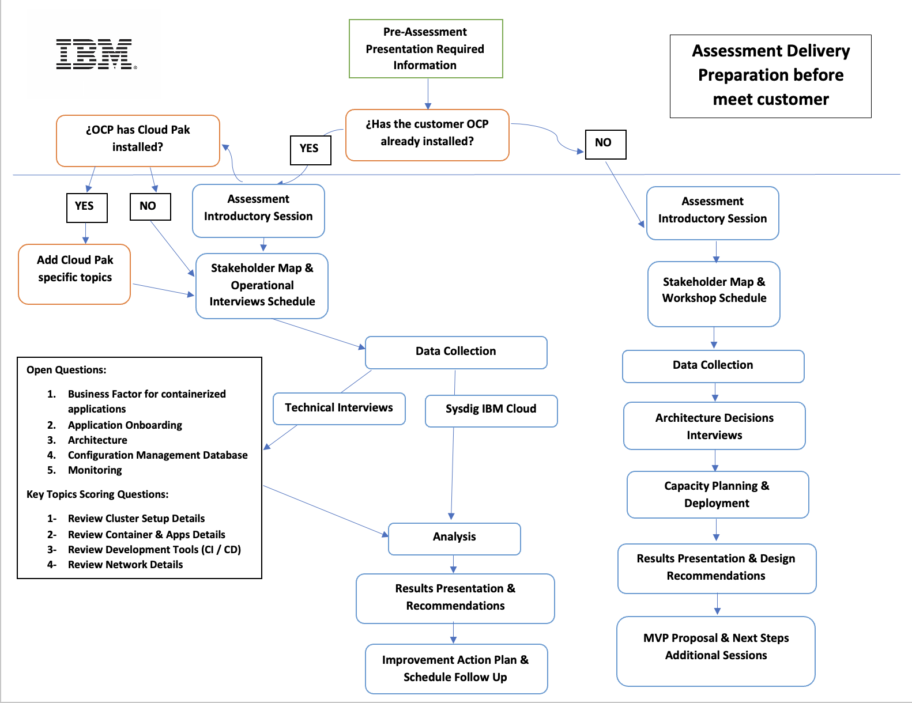

import { Link } from "gatsby";
import FileLink from "../../../components/FileLink";

## Overview

Our CSM team over in SPGI have created an OpenShift Assessment that has proven to be an effective accelerator in deploying our products into a customer's environment. Wether the customer is starting on their modernization journey, or already has OpenShift deployed, this assessment can help YOU guide your customer into a production ready environment to host our IBM Software.

For existing OpenShift clusters, data is collected via technical interviews and optionally with Sysdig running on IBM Cloud, and the results, along with any applicable recommendations, are presented to the customer.

For customers starting their modernization journey, an introductory session explaining the benefits of modernization, and how OpenShift is poised as the best platform to host their workloads. The results and design recommendations are presented to the customer, as well as an MVP proposal with next steps and additional enablement sessions.

#### Assessment Delivery Worklfow

## How do I get started?

Visit or modernization repository, where you can find the <Link to="https://ibm.box.com/s/xy6cehs1hy4sx3v5cgz9y46zwzy0kxkx">assets required to deliver the assessment</Link>. The <Link to="https://ibm.box.com/s/fodssahzs3rni79m84at8xosmifxxlfk">assessment datasheet</Link> can provide a one-pager starting point to introduce the key benefits of the program:

- Gain a comprehensive and consolidated view of your existing OpenShift cluster status
- Improve the overall health of your OpenShift cluster by executing an actionable roadmap with specific improvement points to meet your business needs
- Enhance your modernization practice by working with experienced IBM specialists to learn the most up to date policies, practices and technologies related to your containerized platform

Once your customer has agreed to the assessment, you'll find assets to help you with your <Link to="https://ibm.box.com/s/0fvyjeoabam6cq4hnl6fj4ws7t2fwpt6">Kick Off Planning session</Link>, details on data collection via <Link to="https://ibm.box.com/s/ajkx45f409b9z4e9w8dnulgcazm5bfgn">automated tools</Link>, <Link to="https://ibm.box.com/s/v7r3qferg1fui7oygd78h1yyex5mckma">site interviews and workshops</Link>, and <Link to="https://ibm.box.com/s/h3vk28tvw4ku2dspusns3frj4gzmbcro">templates</Link> you can customize to deliver your results.

Please familiarize yourself with the assets included in each section, and reach out to your WorldWide practice leaders if you'd need additional information. We can connect you with experts that have already delivered this assessment with other customers.
