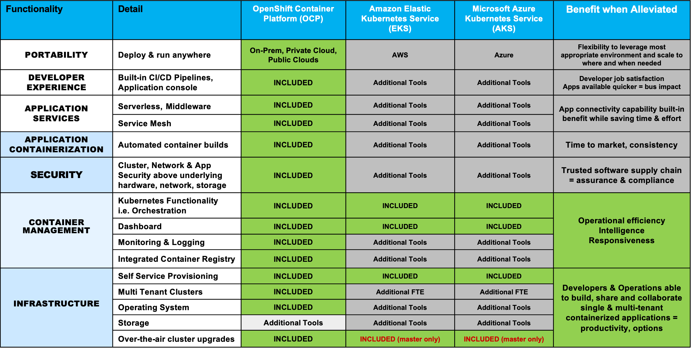

import { Link } from "gatsby";

We have partnered with Red Hat to create high level decks to talk through 4 common scenarios of deployment where you as a CSM may encounter objections on using OpenShift.
The client scenarios are, a client who:

- Has not modernized and currently has not selected a platform yet but does not understand the value of OpenShift.
- Has decided to use xKS and doesn't understand the additional benefits OpenShift provides.
- Is currently using or considering VMWare Tanzu and does not understand the value of OpenShift.
- Is currently using or considering Rancher and does not understand the value of OpenShift.

See below for each scenario and the associated video and powerpoint:

<AnchorLinks small>
  <AnchorLink>Client Starting on Modernization Journey</AnchorLink>
  <AnchorLink>OpenShift vs xKS</AnchorLink>
  <AnchorLink>OpenShift vs VMWare Tanzu</AnchorLink>
  <AnchorLink>OpenShift vs Rancher</AnchorLink>
</AnchorLinks>

## Client Starting on Modernization Journey

<iframe
  width="560"
  height="315"
  src="https://www.youtube.com/embed/VCb4eYtzl5I"
  frameborder="0"
  allow="accelerometer; autoplay; encrypted-media; gyroscope; picture-in-picture"
  allowfullscreen
></iframe>

- <Link
    to="https://ibm.box.com/s/1pvr7g6agpbbv5m1c003mfkivgqysnb3"
    target='_blank' rel='noreferrer noopener'
  >
    Slide Deck
  </Link>

### Key Takeaways:

1. The current challenges faced by organizations with existing applications:
   - lack of scalability
   - inability to roll out new features quickly
   - developer productivity is low
2. The approaches to cloud computing adoption
   - **Lift and shift** - low effort for low benefit – typically moving VM to the cloud as-is – doesn’t address scalability or developer productivity.
   - **Replatform** – moderate effort for moderate benefit – containerizing the existing application with minimal changes doesn’t address scalability or developer productivity, but does get you some of the benefits of Kubernetes such as self-healing and load balancing.
   - **Refactor** – high effort for high benefit – microservices adoption. While there may be some code reuse, this is typically a redesign and reimplementation of the application.
   - **SaaS** – managed offerings versus self-managed. Loss of control and customization in return for a lower cost of ownership due to not needing to manage Day 2 operations which release developers to develop business value
3. Self-building Kubernetes is HARD, the cost and risk are high. Kubernetes lacks the production hardening that enterprises require.
4. You need OpenShift to get to a platform that is production ready and can be deployed on any cloud.
5. OpenShift has a fully automated installation and one-click upgrades.
6. The customers' goal is not to run, build, manage and updated Kubernetes, it is to achieve faster speed to market with security in mind.
7. OpenShift is open source and contains many other curated and validated open source functions that are required by an enterprise and production ready platform.
8. Standardization on OpenShift is the opposite of vendor-lock-in: OpenShift can run anywhere from VMs to AWS and even has managed offerings on AWS, Microsoft, and IBM Cloud.
9. Red Hat has a strong partner ecosystem, including IBM that allows a true hybrid, multi-cloud solution

## OpenShift vs xKS

<iframe
  width="560"
  height="315"
  src="https://www.youtube.com/embed/8yX6UgM8fwo"
  frameborder="0"
  allow="accelerometer; autoplay; encrypted-media; gyroscope; picture-in-picture"
  allowfullscreen
></iframe>

- <Link
    to="https://ibm.box.com/s/meiqsdco92x8ybnrhqg9mdwl977wn6tr"
    target='_blank' rel='noreferrer noopener'
  >
    Slide Deck
  </Link>

### Key Takeaways:

1. That xKS are NOT fully managed services, Amazon, Google and Microsoft manage the “Control Plane”, the customers must manage and integrate all the extra components that make an evironment production ready: networking, storage, security, monitoring, logging, metrics, API management, CI/CD pipelines, databases, middleware, serverless, etc.
2. The Day 2 operations challenge of Kubernetes is NOT solved by xKS
3. xKS is not enterprised, production hardened out of the box
4. You need OpenShift to get to a platform that is production ready and can be deployed on any cloud
5. OpenShift is open source and contains many other curated and validated open source functions that are required by an enterprise and production ready platform
6. Standardization on OpenShift is the opposite of vendor-lock-in: OpenShift can run anywhere from VMs to AWS and even has managed offerings on AWS, Microsoft, and IBM Cloud.
7. ROSA on AWS, ARO on Azure, OpenShift dedicated on GCP are turn-key fully managed OpenShift offerings with SLAs and Support that covers control plane, security, patches and worker nodes
8. ROSA/ARO/OpenShift dedicated include OS, Middleware and Runtime components leaving the customer to worry only about their applications and data
9. Build and run a platform versus a cloud service. Using a car analogy:
   - xKS is an Engine only
   - xKS plus native services are the parts that have to be assembled and managed to provide a finished car
   - OpenShift is a fully assembled car
   - ROSA/ARO/OpenShift dedicated are full service cars with drivers and maintenance included
10. The value of OpenShift is that it enables customers to unlock the power of Kubernetes while hiding the complexity
11. Microsoft and Amazon position xKS and ARO/ROSA as complementary with ARO/ROSA as the turn-key, fully managed offering. The key is not to compete with xKS, but to position OCP as the mamaged solution
12. Red Hat has a strong partner ecosystem, including IBM that allows a true hybrid, multi-cloud solution

### Full Stack Included

## OpenShift vs VMWare Tanzu

<iframe
  width="560"
  height="315"
  src="https://www.youtube.com/embed/P_0X2FQ_0iU"
  frameborder="0"
  allow="accelerometer; autoplay; encrypted-media; gyroscope; picture-in-picture"
  allowfullscreen
></iframe>

- <Link
    to="https://ibm.box.com/s/q9zmj2ebhwg4at4n8pg3le5fllemxubr"
    target='_blank' rel='noreferrer noopener'
  >
    Slide Deck
  </Link>

### Key Takeaways:

1. OpenShift has been around for over 10 years with 3000+ customers and has been a consistent product. VMWare have released various Tanzu products, including some that have recently reached End of Life (unintegrated products that are “stop start”)
2. VMWare has tried and failed with Integrated Containers and Pivotal PCF and PKS.
3. Tanzu is built on disparate acquisitions and only runs on VSphere. In contrast, OpenShift is 100% open-source and can run on-prem and in any of the major clouds
4. Tanzu is not free. VMWare ELAs continue to increase in price
5. VMWare Tanzu is a polgot of acquisitions
6. OpenShift has a fully automated installation and one-click upgrades
7. That the customers’ goal is not to run, build, manage and updated Kubernetes, it is to achieve faster speed to market with security in mind
8. OpenShift is open source and contains many other curated and validated open source functions that are required by an enterprise and production ready platform
9. Standardization on OpenShift is the opposite of vendor-lock-in: OpenShift can run anywhere from VMs to AWS and even has managed offerings on AWS, Microsoft, and IBM Cloud.
10. Red Hat has a strong partner ecosystem, including IBM that allows a true hybrid, multi-cloud solution

## OpenShift vs Rancher

<iframe
  width="560"
  height="315"
  src="https://www.youtube.com/embed/fjGU94hFBRM"
  title="YouTube video player"
  frameborder="0"
  allow="accelerometer; autoplay; clipboard-write; encrypted-media; gyroscope; picture-in-picture; web-share"
  allowfullscreen
></iframe>

- <Link
    to="https://ibm.box.com/s/zz8sqpqtp2gerwy9uc1k2h66cpn9kdff"
    target='_blank' rel='noreferrer noopener'
  >
    Slide Deck
  </Link>

### Key Takeaways:

1. Do not fall into a price war againt SUSE Rancher. OpenShift will always be more expensive. Instead, focus on key diferentiators: Rancher manages the Kubernetes infrastructure; OpenShift is an application development platform, and hides the complexities of Kubernetes and containers.
2. What are your customers organizational goals? If they want a real digital transformation, they get access to enterprise grade security and a large parter ecosystem.
3. OpenShift provides access to API management, CI/CD pipelines, databases, middleware and serverless, integrated networking, storage and multi-cloud management. Rancher does not provide a good modernization plaform.
4. With OpenShift Managed Services in Azure, AWS, GCP and IBM Cloud, your customer is freed to focus on building, deploying and running applications at scale.
5. There are many ways to get started with OpenShift, you can deploy in all major cloud providers, as well as on-prem and bare metal. A free version is available with the OKD upstream distribution.
6. Dont focus on Rancher's ease to install and get started, OpenShift can be installed almost as easily and provides a full application development platform. Focus on security and cloud management.
7. Red Hat is the #2 contributor to the CNCF, and leads almost half of the CNCF Special Interest Groups (SIGs) that define the future of Kubernetes. By comparison, Racher is ranked #11, and leads no CNCF SIGs.
8. OpenShift has a huge partner ecosystem made available by its Operator Framework and OperatorHub. In contrast, Rancher does not support Operators and relies exclusively on Helm charts.
9. Leverage Red Hat CoreOS as a diferentiator: an inmutable OS purpose-built for containerization. No need to manage the underlying OS, just the Kubernetes platform.
10. Edge - Comparing Rancher K3S to OpenShift is an incorrect comparison.

    - Compare it against podman or the microshift project. Single Node OpenShift, a complete installation of OpenShift on one server, is also available for Edge deployments. SNO is the completion of a 2 year edge strategy.
    - K3S uses a SQLite database layer and an adapter that emulates ETCD. This is not sustainable, and is only maintained by Rancher. If the Kubernetes project made a change to ETCD, K3S would have an unbounded future cost of time and labor to modify their datastore.
    - K3S is a single vendor distribution, managed by 4 contributors. There was little development activity in 2022.

11. Multi-cluster and multi-cloud

    - Advanced Container Manager provides an auditable and version-controlled system that managed the configuration of your cluster fleet.
    - ACM integrates with Ansible Tower to create policy violation automations.
    - Management at the Edge: K3S is not managed by Rancher
    - OpenShift provides cross-cluster networking with Submariner. Rancher does not provide any mechanism.

12. Security
    - Advanced Cluster Security: built-in Kubernetes-native security that provides multicluster governance through the entire application life cycle.
    - While both Red Hat and SUSE have a layered security story, Red Hat has always been the leader in this space and the container security market.
    - SELinux enabled by default, preemptively protects against security vulnerabilities.
    - Quick and cheap equals less secure and less support.
    - While the competition simply tries to leverage open source, Red Hat focuses on securing and supporting open source projects.
