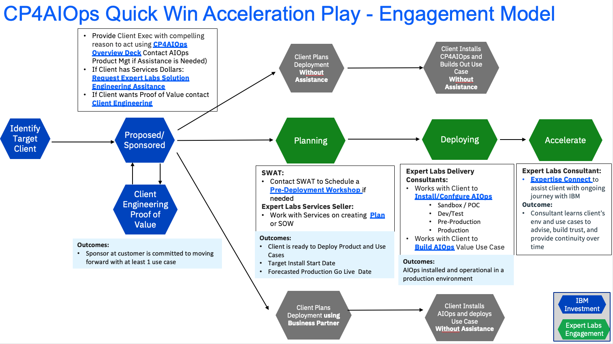

import {Link} from 'gatsby';
import FileLink from '../../../components/FileLink';

## Contacts

| WW contact | Name | WW contact | Name |
| --- | --- | --- | --- |
| **Customer Success Practice Leaders:** | Hollis Chui | **Technology Expert Labs Delivery:** | Saumil Patel |
| **EMEA Automation Brand Leader** | Zdenek Boruvka | **Technology Expert Labs Solution Engineering:** | Ricardo Olivieri, Luca Floris |
| **Americas Automation Brand Leader** | JP Soto | | |
| **APAC Automation Brand Leader** | Nima Moghadam | | |
| **Japan Automation Brand Leader** | Yuhsuke Murakami | | |

## Scope
A few seconds of downtime or an IT outage can cost millions in lost revenue, reputational damage, or regulatory penalties. Understanding what is happening across multiple clouds and on-prem environments is becoming more difficult with the proliferation of compartmentalized tools and data silos. Enterprises want to better detect IT incidents and resolve them faster. IBM AIOps Platform empowers IT Operations teams with insights into incidents and outages using explainable AI to provide clear recommendations and answer the critical question of What happened? The IBM AIOps Platform transforms the way IT Operations triages and resolves incidents leading to improved business outcomes.

## CP4AIOPS Acceleration Engagement model
This diagram shows the Netcool Plus CP4AIOPS Acceleration Engagement model at a high level. Each section is broken down in detail with links to assets below.

## Engage Client Phase
**Led by: CSM**
**Audience: Executive/Sponsor**

Before entering this phase it is necessary to have discussed the introduction of CP4AIOPS with the account team and Account Technical Leader to ensure that it is part of the overall account plan.

This phase covers the steps necessary to have the first conversation with the customer and introduce CP4AIOPS product and explain the compelling reasons to act.

For assistance, reach out to the product management team: James Moore (jdmoore@us.ibm.com) and CC Kim O'Connor (kimoconnor@ie.ibm.com).

The outcome of this phase is that a sponsor is interested in CP4AIOPS and the next step is to identify the use case(s) to scope and plan the project.

Process and Assets:
- Account planning should be performed to identify target personas and related metrics to the adoption.
- CSM should create a Success/Growth Plan in Gainsight to track the progress of this potential project. <a target='_blank' rel='noreferrer noopener' href="https://ibm.box.com/s/u0d2z0ia2z5uhvb81577l36gkvspucud">Sample Growth Plan</a>
- CSM should review the [Incident Management with CP4AIOPS](https://mediacenter.ibm.com/media/t/1_cifk5wwo)
- CSM should review the <a href="https://ibm.seismic.com/Link/Content/DCBMMRG6cVVWR8MFMHPB6773RfdB" target='_blank' rel='noreferrer noopener'>CP4AIOPS Overview deck</a>

## Identify Use Case Phase
**Led by: Customer Success and Technology Expert Labs**

The CSM will work with a client to identify target use case(s) that will address their pain points and where they will see the most value.  Leverage the [SWAT Best Practices document](https://www.ibm.com/docs/en/cloud-paks/cloud-pak-aiops/4.3.0?topic=pdf-documentation) to assist in this activity.

If the client has purchased Technology Expert Labs services, request help from the TEL Solution Engineering team using their [intake form](https://forms.monday.com/forms/c64bacb40df8b2d13a498a4d3223011f?r=use1).

If the client has not purchased Technology Expert Labs services, and a proof of value is required, engage the [Client Engineering team](https://pages.github.ibm.com/csm-playbook/playbook/common/accerlation-plays/cp4aiops-play#optional-client-engineering-proof-of-value-phase).

## Optional Client Engineering Proof of Value Phase
**Led by: Client Engineering**

The customer may want to see a demonstration of CP4AIOPS running on top of OCP. Client Engineering can engage in a Proof of Value to demonstrate the process and the new platform.

To request a Client Engineering resource to run a PoV (Proof of Value) a resource request is done via [IBM Sales Cloud (ISC)](https://ibmsc.lightning.force.com/lightning/page/home).

Here is the link that details how to fill in the request in ISC: [https://w3.ibm.com/w3publisher/client-engineering/engage/engagement-instructions](https://w3.ibm.com/w3publisher/client-engineering/engage/engagement-instructions)

When filling in the information have relevant information ready:

- Engagement Details (”Technology Pattern” + pattern + description)
- Pattern: IT Automation (i.e Technology Pattern MQ Integration "Description")
- Business Problem: CP4AIOPS adoption
- Scope: PoV
- Use Case
- Success Criteria
- Skills: Netcool Operations Insight (NOI) Skills needed.

## Propose, Negotiate and Close Phase
**Led by: Technology Expert Labs Seller**

The purpose of the Propose, Negotiate and Close is to close a services deal. The IBM Sales team: Digital/Services Seller, Solution Architect/Solution Engineer will present the customer with a Services proposal for CP4AIOPS based on their budget and requirements.   

**Technology Expert Labs Offering:** <a target='_blank' rel='noreferrer noopener' href="https://ibm.seismic.com/Link/Content/DChJfpc8G8Q4hGmV6q9PQDP7dPRP">Plan AIOPS Services Offering</a>

Required inputs by CSM: None; however CSM will want to maintain awareness for continued engagement with the client.

## Implement and Accelerate Phases
** Led by: Technology Expert Labs**

**Technology Expert Labs Offering:** <a target='_blank' rel='noreferrer noopener' href="https://ibm.seismic.com/Link/Content/DCJmbFTCcDbmpGhQHhhGgcGJfC83">Install/Configure AIOPS Services Offering</a>

**Technology Expert Labs Offering:** <a target='_blank' rel='noreferrer noopener' href="https://ibm.seismic.com/Link/Content/DCMDX3WhCGdgBGf26VHfJgR2VQhP">Build AIOps Services Offering</a>

**Technology Expert Labs Offering:** <a target='_blank' rel='noreferrer noopener' href="https://ibm.seismic.com/Link/Content/DChTBdhh2f8jg8mHCbCTB8FfD683">Expertise Connect</a>

During the delivery phase, the IBM Technology Expert Labs Delivery team will perform the services as agreed upon in the Propose Negotiate and Close Phase.

Required inputs by CSM: None; however CSM may want to shadow/maintain awareness for continued engagement with the client.
