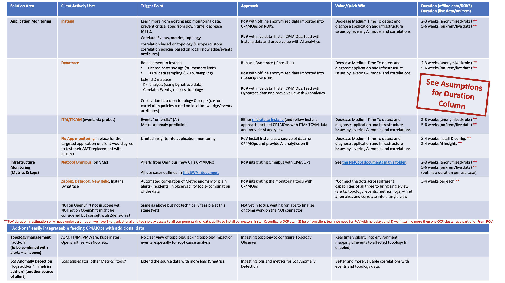
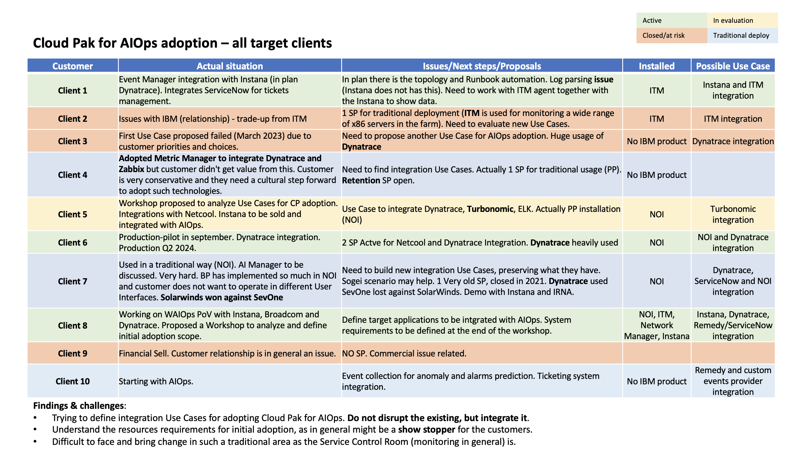
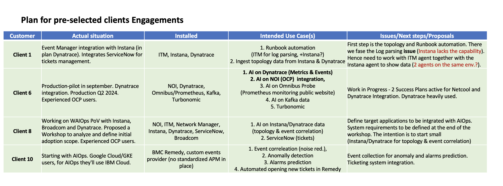

import {Link} from 'gatsby';
import FileLink from '../../../components/FileLink';

## Contacts
| WW contact | Name | WW contact | Name |
| --- | --- | --- | --- |
| **Customer Success Practice Leaders:** | Hollis Chui | **Technology Expert Labs Delivery:** | Saumil Patel |
| **EMEA Automation Brand Leader** | Zdenek Boruvka | **Technology Expert Labs Solution Engineering:** | Ricardo Olivieri, Luca Floris |
| **Americas Automation Brand Leader** | JP Soto | | |
| **APAC Automation Brand Leader** | Nima Moghadam | | |
| **Japan Automation Brand Leader** | Yuhsuke Murakami | | |

## Scope
CP4AIOPS empowers IT Operations teams with insights into incidents and outages with AI, identifies the cause of the problem and provides clear recommendations.  It transforms the way IT Operations triages and resolves incidents leading to improved business outcomes (reducing customer facing outages, reducing the mean time to repair (MTTR)).
The AIOps platform addresses challenges posed by siloed teams, slow incident management response times, inefficient data collection and analysis and not noticing hidden anomalies, and more.

The AIOps and Observability play is intended to help CSM teams start the client conversations and accelerate the deployment of Cloud Pak for AIOps and related observability technologies such as Instana or Turbonomic.  It leverages the Quick Wins approach, to use IBM, competitive or OpenSource monitoring technologies the client already uses as triggers for proposing use case(s).
This accelerator focuses on a quick win approach with IT Operations teams by slicing CP4AIOPS opportunities into smaller and shorter PoVs with use cases focused around connecting to and ingesting data from their existing monitoring tools (trigger points) to show value of the AIOPS platform.

### Why and Why Now

Most IBM clients are going through a massive Modernization effort reworking their business, application, integration and data landscape into Cloud or Cloud native technologies.  Modernizing the way they monitor and observe these technologies is essential and often driven by development teams as part of the modernization effort as well as the maintenance or Day 2 operations for the applications.

Currently, there is a large number of IBM clients that use Netcool and Tivoli Monitoring to monitor their traditional workloads.  We have a unique and large opportunity to help clients to start monitoring their new and modernized workloads with Instana and Turbonomic, while also integrating it with Cloud Pak for AIOps.

We need to act now and with the urgency, otherwise the clients will continue to use the legacy IBM monitoring tools with their old workloads while considering competitor tools like Dynatrace, New Relic, DataDog, Zabbiz, etc for their newer workloads.

### The Quick Win Approach

For IBM's enterprise clients, different teams might be using different monitoring solutions and will not want to replace it with a newer tool.  Instead, we need to discover the various monitoring tools they currently use and derive AIOps value use cases in the context of their existing solutions.
Ingesting data (events, metrics, etc) from Instana, Dynatrace and other APM tools and correlating it with topology data (ie. gathered from OpenShift observer) is one example of how the power of AI and will prove the value of CP4AIOps without directly replacing their favorite APM technology.

To do that we need to first understand what technologies the target client uses for APM (Application Performance Monitoring), Infrastructure Monitoring, and log aggregation (in other words how they collect metrics, events, alerts, logs, topology data etc) to be able to find out the best fitting use case to start with.

The high level approach is to:

- "Slice" CP4AIOps PoC into smaller Quick Win PoVs (3-8 weeks) with clear (tangible) client value
- "Hook" CP4AIOPs with the technology that client uses (for Events, Metrics and Topology) and showcase the value they can gain from it

To make that work easier here are a few **trigger points** to look for:

Once the **trigger points** have been identified for the client, the next step will be one of the following:

- PoV: CP4AIOps on ROKS/TechZone with offline anonymized data provided by client.  Fastest, easiest, least risky. However client might want to see it with live data.
- PoV: CP4IAIOps on-prem install with live monitoring data (integration).  CP4AIOps installed in client environment (one OCP cluster), connecting to local client data.  Longer, more technical risk but showing the real day 2 value of CP4AIOps.
- PoV: CP4AIOps on=prem install with Instana data (integration).  CP4AIOps installed in client environment (one OCP cluster), installed Instana for monitoring.  This is a subset of the #2 above where we see repeatable success across multiple clients and where the technical risks are lower/manageable.
- Workshop led appraoch: Discovery & framing workshop – typically ran together Client Engineering or Expert Labs focused on the entire monitoring landscape, use cases identification and relationship building. If the clinet is interested in the holistic approach we may lead with AIOps Acceleration Workshop – Expert Labs led assessment workshop for Observability.

### Clients to target:

Generally look for clients that have a Cloud Pak for AIOps entitlement but not utilizing it.  If the licenses are used by a legacy monitoring solution, then the goal is to find a sponsor who is interested to discuss the value from bringing AI into observability and/or modernizing their Observability stack.  The **trigger points** described in the screen capture above will provide patterns to look for.

Once you have identified the clients to approach with this Quick Win acceleration play, gather as much information as possible and start with the client(s) that you think have the highest chance of success.  Next, identify their current as-is state, what technologies are being used and draft the first set of desired Observability use cases you want to propose and document the challenges and risks.

Here is an example of the first (internal) client assessment the action plan for the selected clients:

Here are the intended use cases for the selected clients

Once the propose use cases have been documented, connect with the Observability SME from your Market or contact your GEO Automation CSM leader to review the use case list (leverage best practices and avoid known risks) and get help for the next steps.

Next, prepare for a client meeting by studying all existing materials in the <a target="_blank" href="https://ibm.box.com/s/iesl1acj0kklf09q6u1t8bjsau6yzibw" rel='noreferrer noopener'>EMEA AIOps Play</a> Box folder.  Here is an <a target="_blank" href="https://ibm.box.com/s/urgazl4kjp2l9ezrel0q7kxyucrg61s5" rel='noreferrer noopener'>example</a> that the Italian team used recently with one of their clients.

### Who can help you

- Market CSM Observability SME or your Market CSM Automation leader (if you have one) or your GEO CSM Automation Leader (Zdenek for EMEA, JP for Americas).  Additional help can be leveraged from the extended teams (ie. Technoloogy Expert Labs, SWAT, Client Engineering, Support etc.)
- Technical Sales (incl. PTS) has skills in the area and often have a history with - the client(s). The most successful AIOps projects were initiatied together with Technical sales.
- Technology Expert Labs (TEL) have predefined workshops and wide set of projects with predefined scope across all Observability areas. AIOps Acceleration Workshop is their "invesment" activity for specific Observability heavy clients.
- SWAT is a team of AIOps SME producing a lot of technical materials (ie. NetCool integration) and can help. Upon availability they are ready to assist us at first of a kind of tricky AIOps engagements. This whole initiative was designed with their help and feedback.
- Support team is aware of the Acceleration Play and is actively advising us to avoid hitting known risks and ready to help once we need it.

### Get ready and boost your skills

Some of the key resources to get you up to speed:
- <a target="_blank" href="https://ibm.box.com/s/iesl1acj0kklf09q6u1t8bjsau6yzibw" rel='noreferrer noopener'>EMEA AIOps Play</a> Box folder Box folder with wide set of relevant materials
- AIOps intro deck
- CP4AIOPs 4.3 Intro call, Deep dive day 1, Deep dive day 2
- CP4AIOps Jam-in-a-Box – technical environment with hands on labs
- Expert labs Observability offerings
- How to request AIOPs SWAT team’s help
- ITM to Instana migration
- Dynatrace to Instana competitive materials

## Engagement model
This diagram shows the CP4AIOPS "Quick Win" Engagement model at a high level. Each section is broken down in detail with links to assets below.

## Engage Client Phase
**Led by: CSM**
**Audience: Executive/Sponsor**

Before entering this phase it is necessary to have discussed the introduction of CP4AIOPS with the account team and Account Technical Leader to ensure that it is part of the overall account plan.

This phase covers the steps necessary to have the first conversation with the customer and introduce CP4AIOPS product and explain the compelling reasons to act.

For assistance, reach out to the product management team: James Moore (jdmoore@us.ibm.com) and CC Kim O'Connor (kimoconnor@ie.ibm.com).

The outcome of this phase is that a sponsor is interested in CP4AIOPS and the next step is to identify the use case(s) to scope and plan the project.

Process and Assets:
- Account planning should be performed to identify target personas and related metrics to the adoption.
- CSM should create a Success/Growth Plan in Gainsight to track the progress of this potential project. <a target='_blank' rel='noreferrer noopener' href="https://ibm.box.com/s/u0d2z0ia2z5uhvb81577l36gkvspucud">Sample Growth Plan</a> and select the **CP4AIOPS Quick Win Acceleration** Deployment Play. 
- CSM should review the [Incident Management with CP4AIOPS](https://mediacenter.ibm.com/media/t/1_cifk5wwo)
- CSM should review the <a href="https://ibm.seismic.com/Link/Content/DCBMMRG6cVVWR8MFMHPB6773RfdB" target='_blank' rel='noreferrer noopener'>CP4AIOPS Overview deck</a>

## Identify Use Case Phase
**Led by: Customer Success and Technology Expert Labs**

The CSM will work with a client to identify target use case(s) that will address their pain points and where they will see the most value.  Leverage the [SWAT Best Practices document](https://www.ibm.com/docs/en/cloud-paks/cloud-pak-aiops/4.3.0?topic=pdf-documentation) to assist in this activity.

If the client has purchased Technology Expert Labs services, request help from the TEL Solution Engineering team using their [intake form](https://forms.monday.com/forms/c64bacb40df8b2d13a498a4d3223011f?r=use1).

Contact the CP4AIOPS SWAT team to schedule a [Pre-Deployment Workshop](http://ibm.biz/automation-swat).  Note, requests will start to be accepted in March 2024.

If the client has not purchased Technology Expert Labs services, and a proof of value is required, engage the [Client Engineering team](https://pages.github.ibm.com/csm-playbook/playbook/common/accerlation-plays/cp4aiops-play#optional-client-engineering-proof-of-value-phase).

## Optional Client Engineering Proof of Value Phase
**Led by: Client Engineering**

The customer may want to see a demonstration of CP4AIOPS running on top of OCP. Client Engineering can engage in a Proof of Value to demonstrate the process and the new platform.

To request a Client Engineering resource to run a PoV (Proof of Value) a resource request is done via [IBM Sales Cloud (ISC)](https://ibmsc.lightning.force.com/lightning/page/home).

Here is the link that details how to fill in the request in ISC: [https://w3.ibm.com/w3publisher/client-engineering/engage/engagement-instructions](https://w3.ibm.com/w3publisher/client-engineering/engage/engagement-instructions)

When filling in the information have relevant information ready:

- Engagement Details (”Technology Pattern” + pattern + description)
- Pattern: IT Automation (i.e Technology Pattern MQ Integration "Description")
- Business Problem: CP4AIOPS adoption
- Scope: PoV
- Use Case
- Success Criteria
- Skills: Netcool Operations Insight (NOI) Skills needed.

## Propose, Negotiate and Close Phase
**Led by: Technology Expert Labs Seller**

The purpose of the Propose, Negotiate and Close is to close a services deal. The IBM Sales team: Digital/Services Seller, Solution Architect/Solution Engineer will present the customer with a Services proposal for CP4AIOPS based on their budget and requirements.   

**Technology Expert Labs Offering:** <a target='_blank' rel='noreferrer noopener' href="https://ibm.seismic.com/Link/Content/DChJfpc8G8Q4hGmV6q9PQDP7dPRP">Plan AIOPS Services Offering</a>

Required inputs by CSM: None; however CSM will want to maintain awareness for continued engagement with the client.

## Implement and Accelerate Phases
** Led by: Technology Expert Labs**

**Technology Expert Labs Offering:** <a target='_blank' rel='noreferrer noopener' href="https://ibm.seismic.com/Link/Content/DCJmbFTCcDbmpGhQHhhGgcGJfC83">Install/Configure AIOPS Services Offering</a>

**Technology Expert Labs Offering:** <a target='_blank' rel='noreferrer noopener' href="https://ibm.seismic.com/Link/Content/DCMDX3WhCGdgBGf26VHfJgR2VQhP">Build AIOps Services Offering</a>

**Technology Expert Labs Offering:** <a target='_blank' rel='noreferrer noopener' href="https://ibm.seismic.com/Link/Content/DChTBdhh2f8jg8mHCbCTB8FfD683">Expertise Connect</a>

During the delivery phase, the IBM Technology Expert Labs Delivery team will perform the services as agreed upon in the Propose Negotiate and Close Phase.

Required inputs by CSM: None; however CSM may want to shadow/maintain awareness for continued engagement with the client.
