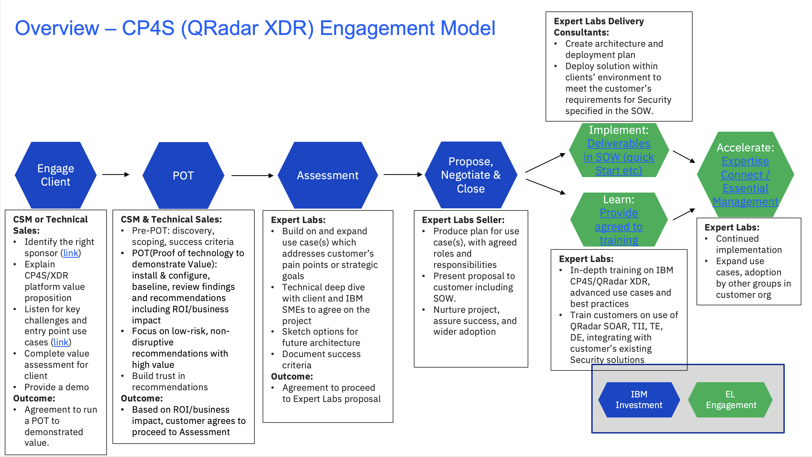
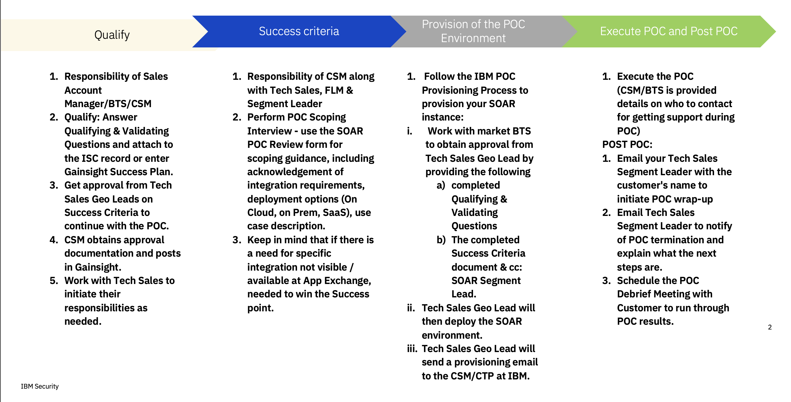
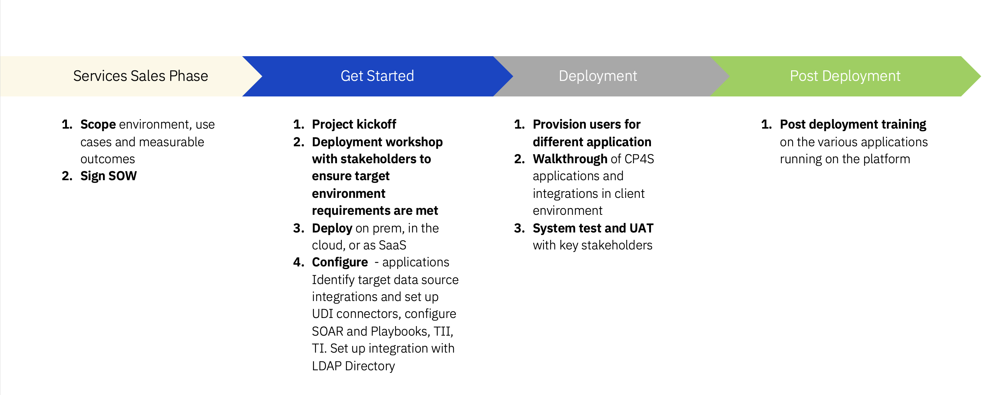

import {Link} from 'gatsby';
import FileLink from '../../../components/FileLink';

## Contacts

| WW contact | Name |
| --- | --- |
| **Customer Success Practice Leaders:** | Greg Sabatini, Hemankita Perabathini | 
| **Technology Expert Labs Practice Leaders:** | Krishna Yellepeddy, Steve Fediuk |

## Scope
Traditionally, the challenges and needs of each user persona within the security team have been so different that organizations gravitated to using different solutions for each security need, resulting in teams having to manually stitch together their findings.  Point solutions meet a distinct need, but isolated data provides limited value; this often results in an incomplete picture of threats. SOC analysts need the ability to connect data across all their existing tools, whether it be events and logs captured in security information and event management (SIEM) tools, network and endpoint data, or cloud solutions.

Customers also need a way to investigate and respond quickly, leveraging automation, AI, and threat intelligence to provide meaningful, contextual insights so they can act quickly. However, to help keep up with the sheer volume of threats, SOC analysts needed is a simple, unified, open, and automated way to manage threat detection and response, one that extends the core capabilities of existing tools,while streamlining data and workflows.

Furthermore, Security teams are facing an ever-increasing barrage of threats – from ransomware to business email compromise to nation state attacks. At the same time, they are tasked with supporting new business initiatives, securely enabling cloud migrations, and complying with an evolving regulatory landscape. Today, security should be flexible, scalable, modern, and intuitive to help quickly and easily defend against advanced threats, proactively hunt for stealthy attackers, and address regulations. At the same time, migration to cloud initiatives have expanded the attack surface and created the need for more security controls. An increase in the volume and sophistication of threats only exacerbates the challenges of today’s security operations centers (SOCs). Disjointed data and lack of visibility often leave security teams with blind spots to the next potential threat.  As IT environments grow more and more complex, organizations may have to consider modernizing their security operations. The current approach to threat detection and response appears unsustainable.

- Security leaders need to understand their enterprise risk, which is a challenge with data spread across multiple tools, clouds and on-premise environments. Their pain points range from managing the skills gap, to increasing Security ROI.
- Security analysts need to monitor IT activity, detect, and investigate suspicious behaviors, and ensure the company’s assets are protected. Their pain points range from gathering threat intelligence, to searching across disparate products.
- Incident Responders need to identify the root cause of security incidents and initiate the correct response playbook. Their pain points range from collaborating with teams, to incident correlation. The right security platform has the potential to solve this challenge.

**IBM Cloud Pak for Security** is an open, integrated security platform that provides insight into threats across multiple environments. IBM CP4S runs on OCP and allows enterprises to utilize a unified experience by leveraging single sign-on (SSO) and role-based access control (RBAC) to manage authorized users or teams providing insight into threat management, investigations, and risk management of any connected security tools and data in their environments.

Major components of CP4S:

**Threat Intelligence Insights:** IBM Security Threat Intelligence Insights (TII) offers the ability for companies to get detailed, actionable threat intelligence that is based on a customized profile and environmental telemetry. These capabilities allow companies to prioritize threats based on what is relevant to the business. IBM TII also allows these threats to be investigated across the organizations siloed resources and remediated, all through a single console that provides a single pane of glass experience to monitor operations.

**Case Management with Security Orchestration, Automation, and Response:** Security SOAR provides companies the ability to create, escalate, and manage cases within a unified platform. IBM Security SOAR also comes bundled with ability to orchestrate and automate interactions with 3rd party products by using an integrated component called AppHost. The AppHost integration server empowers security teams with the capability to do integrations with the extensive orchestration and automation ecosystem that consists of a growing selection of IBM validated third-party security solutions. By leveraging these integrations, SOC teams and security analysts can respond to threats with a comprehensive view of the impact and scope of an incident across multiple security toolsets.

**Data Explorer:** IBM Security Data Explorer enables organizations to perform federated searches and investigations across disparate data sources using one query language and a single user management window, providing SOC teams with complete visibility into their hybrid multi-cloud environments. It operates by connecting to and leveraging the insights from multiple security solutions, such as SIEM solutions, endpoint detection and response (EDR) tools, and data stored in data lakes, and then enables users to filter, sort, analyze, apply statistical analysis without writing additional queries, and export data once it has been aggregated. In addition, deeply integrated workflows with IBM Security SOAR enable users to send artifacts to case management within the Data Explorer application which allows SOC teams to collaborate seamlessly during investigations.

**Risk Manager:** IBM Security Risk Manager provides a unified view of the organization’s risk. This is achieved through contextualizing and normalizing risk data from multiple data sources across the company that in turn provide a more complete view of the company’s security risk landscape. By leveraging Risk Manager, a security analyst can investigate the identified risks by creating a case to remediate the risk swiftly, minimizing the impact to business.

**User Behavior Analytics:** IBM CP4S integrates the User Behavior Analytics (UBA) tool to provide businesses the ability to detect end-user insider threats in the organization. UBA allows for companies to generate insights around users and the risk associated with the user’s specific activities. UBA provides visibility into threat vectors, including compromised or stolen credentials, careless or malicious insiders, and malware takeover of endpoints or user accounts, which is a key component of a mature security program. Since the end-user is the weakest link and poses the highest significant risk to the agency, it is imperative to gain insight and act on such insider threats.

Successful deployment of the components in CP4S is critical for ROI and customer satisfaction.  Since there are multiple aspects to CP4S, a clear understanding of an organization’s environments, challenges and existing Security Tools is a requirement.   Utilizing the following approach to identify and address these critical factors will dramatically improve the client’s success.

## CP4S Engagement Model
This diagram shows the CP4S Engagement model at a high level. Each section is broken down in detail with links to assets below.

## Engage Client phase
**Led by:** Customer Success and/or Technical Seller 
**Audience:** Executive/Sponsor

Before entering this phase, it is necessary to have discussed the positioning of CP4S with the account team and Account Technical Leader to ensure that it is part of the overall account plan.

This phase covers the personas to target as well as the ones to avoid, listen for key challenges and pain points and explain why CP4S is important.

The **outcome** of this phase is that a sponsor is interested and in agreement to run a Proof of Technology (POT/POC) where IBM and the customer will work together to define the scope and success criteria.

**Process and assets:**

| Asset | Role responsible |
| --- | --- |
| Perform account planning to identify target <a href="https://ibm.seismic.com/Link/Content/DCcQ66pBd4qhq8FRjMTPCJBbhTQ8" target='_blank' rel='noreferrer noopener'>personas</a> (and the ones to avoid) | CSM |
| Create a Success/Growth Plan in Gainsight to track the progress of this potential project. <a target='_blank' rel='noreferrer noopener' href="https://ibm.box.com/s/u0d2z0ia2z5uhvb81577l36gkvspucud">Sample Growth Plan</a> | CSM |
| Review the <a target='_blank' rel='noreferrer noopener' href="https://ibm.seismic.com/Link/Content/DCpCXTQ8J6qdM8fX4RqfD7287DHB">Client presentation</a> | CSM |
| Complete the <a target='_blank' rel='noreferrer noopener' href="https://yourlearning.ibm.com/activity/PLAN-11F8EFBC22A9">CP4S Sales Badge</a> | CSM |
| Review the <a target='_blank' rel='noreferrer noopener' href="https://www.ibm.com/account/reg/us-en/subscribe?formid=urx-46836">Persona Based Interactive Demo for CP4S</a> | CSM |
| Review the <a target='_blank' rel='noreferrer noopener' href="https://ibm.seismic.com/Link/Content/DCCW4dTM3QjmT8cWjVRT4TX3cbGP">Quick Access Guide to Live Demonstration</a> | CSM |
| Review the <a target='_blank' rel='noreferrer noopener' href="https://www.ibm.com/downloads/cas/JBDZ5WXJ">CP4S Solution Brief</a> | CSM |
| Review the <a target='_blank' rel='noreferrer noopener' href="https://ibm.seismic.com/Link/Content/DCbDXRFdgm9XD89C2398G744fh4j">Current CP4S Sales Plays</a> | CSM |
| Review the competitive worksheets:   -  <a href="https://ibm.seismic.com/Link/Content/DCCMPBPWcdH288WFghmX3TW9j9cd" target='_blank' rel='noreferrer noopener'>IBM CP4S Competitive - Cortex Palo Alto Networks</a>   -  <a href="https://ibm.seismic.com/Link/Content/DCRpTBQbpXTQhGQ2HbP9hT7P7DJd" target='_blank' rel='noreferrer noopener'>Microsoft Sentinel competitive battlecard</a>   -  <a href="https://ibm.seismic.com/Link/Content/DCWp26cBRjcBF8MH6MG4m2QV238G" target='_blank' rel='noreferrer noopener'>Microsoft Azure Sentinel customer-facing presentation</a> | CSM |
| Review the <a target='_blank' rel='noreferrer noopener' href="https://ibm.seismic.com/Link/Content/DCPdHWB6CGDFWGhHT9B38BBpgc2G">CP4S ROI Calculator Deck</a> | CSM |

## Proof of Concept (POC) phase
**Led by:** CSM & Technical Sales

Start with a Proof of Concept (POC), if needed, to help customers see the impact and value of CP4S in their own environment. With the identified sponsor and selected use case(s), defining the scope and success criteria. Note that the CP4S platform includes QRadar XDR SOAR,  Data Explorer/Federated Access, EDR/XDR etc. Please refer to <a target='_blank' rel='noreferrer noopener' href="https://ibm.seismic.com/Link/Content/DCQBhFT7md93RGFRdPqMT4R4h6b8">Seismic</a> for a description of QRadar Suite for a description and of the various solutions.

The following POC for SOAR is an illustration of the steps involved in accomplishing a Proof of Concept for solutions that are part of the QRadar Suite/CP4S.

Conduct workshop with client on CP4S deployment methodology. Ensure the target environment meets the prerequisites, verify the deployment in a non-production environment (if required by client) and then deploy in the production environment with the assistance of TEL.

After CP4S has been deployed and integrated with client’s LDAP Directory Server, configure the UDI connectors for the data sources to integrate with the platform.  For client’s requiring UDI connectors for proprietary or unsupported data sources, Technology Expert Labs has the skills to develop these connectors as part of a billable engagement. This work will be done as part of an SOW with the client.

If the customer has purchased a SOAR license, configure SOAR, identify use cases for SOAR and the playbooks that can be used out of the box and whether new playbooks need to be developed based on client’s use cases., integrated with QRadar if the client has QRadar. Configure TII and TI.

## Propose, Negotiate, and Close phase
**Led by: Technology Expert Labs Seller**

The purpose of the Propose, Negotiate, and Close phase is to close a services deal. The IBM Sales team: Digital/Services Seller, Solution Architect/Solution Engineer and CSM will present the customer with a Services proposal for Cloud Pak for Security based on their budget and requirements.

Required inputs by CSM: None; however, CSM will want to maintain awareness for continued engagement with the client for OI and status updates.

## Implement, Learn and Accelerate phases
** Led by:** Technology Expert Labs Delivery

**Technology Expert Labs Offerings:** 
- <a target='_blank' rel='noreferrer noopener' href="https://ibm.seismic.com/Link/Content/DCPDX46QbMgJc87Mb4GBJmpJ4bBd">IBM Cloud Pak for Security Platform Expert Labs - Assistance Service</a>

- <a target='_blank' rel='noreferrer noopener' href="https://ibm.seismic.com/Link/Content/DCQTcmC7Gc38B8TTR6PFPTpfhMR8">Cloud Pak for Security Expert Assistance</a>

- <a target='_blank' rel='noreferrer noopener' href="https://ibm.seismic.com/Link/Content/DC9G2FHX2VBm28M22RDqdDPMVmT3">IBM Security Learning Services with Expert Labs</a>

- <a target='_blank' rel='noreferrer noopener' href="https://ibm.seismic.com/Link/Content/DCH2m3Tm8FfRB87Tfpp2C9CTQ9Wd">Technical Account Manager (TAM) services</a>

- <a target='_blank' rel='noreferrer noopener' href="https://ibm.seismic.com/Link/Content/DCM6FfcHb26mq8m2b9HdgTcJ84hP">Expertise Connect/Essential Management</a>

During the delivery phase, the IBM Technology Expert Labs Delivery team will perform the services as agreed upon in the Propose Negotiate and Close Phases.

Required inputs by CSM: None; however CSM should shadow/maintain awareness for continued engagement with the client.
