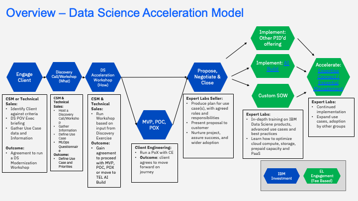

import {Link} from 'gatsby';
import FileLink from '../../../components/FileLink';

<InlineNotification> 
watsonx.ai notice:

This current data science accelerator provides the assets and the means to initiate a data science driven use case and deployment discussion with the client. While watsonx has been announced, the GA of the specific offerings: watsonx.data, watsonx.ai and watsonx.governance will be staggered across the next few quarters.

*This accelerator will be enhanced as watsonx.x offerings come to market.*

</InlineNotification>

### Contacts

| WW contact | Name |
| --- | --- |
| **Customer Success Practice Leaders** | Campbell Robertson @cir and Tal Shahar @Tal Shahar  |
| **Technology Expert Labs (TEL) Delivery Practice Leaders** | Akram Abdouch |
| **Product management** | Eric Saleh |
| **WW Technical Sales Lead** | Elena Lowery |

## Scope

Organizations are embracing data science into formal business processes at a large scale.  Most organizations today have either attempted or are deploying various algorithmic models in various stages of success or frustration.

Some companies assume that they are using data science models but instead are only scratching the surface.

IBM Data Science technologies provide a robust platform to deploy many types of algorithmic models as well as enforce ethical practices to mitigate risk.  Poor data or badly deployed algorithms may lead to ethical or compliance charges.  Enterprise grade data science requires the flexibility of open source technology but the security and privacy of a robust platform.

The intent of this accelerator is to have a engaging discussion with clients in moving their data science to the next level and to take advantages of the latest technologies that IBM has to offer in the Data & AI space.

## Data Science Accelerator Engagement model

This diagram shows the Data Science Accelerator Engagement model at a high level.

## Engage Client phase

**Led by:** Customer Success and/or Technical Seller

**Audience:** Executive/Sponsor

To validate that a client is a good candidate for a Data Science Acceleration dicussion, try to answer or gain insight from the client against these criteria:

- Business wants faster time to market with innovation in product/service
- Business wants greater accuracy in line of business
- Business wants Improved Customer Experience
- Risk and Compliance officer wants enhanced security and complaince in Data Science Practice
- The client has discussed use case(s) i.e. Fraud, AML, Loan Default Prediction, etc.
- Has a Data Science team using disparate tools and are growing frustrated.
- Interested in unifying processes, tools and talent in Data Science.
- The client wants to combine predictive and prescriptive analytics.
- The client wants to leverage existing cloud and data investments to avoid lock-in (Open Source).
- The client wants to do more than AutoAI provides by itself.
- The client wants to provide a broader Low Code/Pro Code mix to users

Before entering this phase it is necessary to have discussed the positioning of IBM Data Science services and products with the account team and Account Technical Leader to ensure that it is part of the overall account plan.

- Identify and work with your Data Science Tech Seller
- Identify your Technology Expert Labs Seller
- Identify any business partners in the Data Science Space

This phase covers the personas to target. Listen to your executive sponsor for key challenges and pain points and explain why Data Science strategies are important.

**Outcomes:**

The **outcome** of this phase is that a sponsor is interested and in agreement to proceed defining the appropriate use case and startegy for Data Science where IBM and the customer will work together to define the scope and success criteria.

<Row>
<Column colMd={12} colLg={12}>

**Process and assets:**

| Task | Role |
| --- | --- |
| Perform account planning to identify target <a href='https://ibm.box.com/s/57gvkgjgmhzg6hpu3naja6en0yuzquv8' target='_blank' rel='noreferrer noopener'>personas</a> | CSM |
| Review the <a href='https://ibm.box.com/s/2a08fcqybfdpjuh177j18gwayg1ehswv' target='_blank' rel='noreferrer noopener'>Data Science Battle Card</a> | CSM |
| Review the Data Science MLOps <a href='https://ibm.box.com/s/4rpf6ajh9vzpa5xks6n51p2mx5gnb0jy' target='_blank' rel='noreferrer noopener'>INTERNAL USE ONLY: MLOps Message Guidance</a> | CSM or Seller |
| Review and create at least one <a href='https://ibm.box.com/s/s0abvehl084jk3plyb0d7aola3aelmph' target='_blank' rel='noreferrer noopener'>Compelling Reason to Act (One Pager)</a> material | CSM |
| Validate the approach you will take, either: [Data Science Acceleration](https://ibm.box.com/s/956sae53d6870tmoxwecaq1upqejt7l3) or AI Governance Acceleration (TBD) | CSM |
| Create a Success/Growth Plan in Gainsight to track the progress of this potential project. <a href='https://ibm.box.com/s/cer0d1z3n3du95lhrnz6sy9avbnm3qj4' target='_blank' rel='noreferrer noopener'>Sample Growth Plan</a> | CSM |
| Present an <a href='https://ibm.box.com/s/oqopme8qv3gugjtjpldjnyxn46cz8pem' target='_blank' rel='noreferrer noopener'>executive briefing</a> to gain approval to run the Data Science Acceleration Workshop. | CSM |
| It is key that you understand the <a href='https://ibm.seismic.com/Link/Content/DCmRVFDWFB4c28T24FXXDMpVH4pG' target='_blank' rel='noreferrer noopener'>highly competitive</a> space of Data Science by researching who you are up against | CSM/Tech Seller |
| Engage in a discovery exercise to identify use case, priorities. Generic Data Discovery assets can be leveraged for a virtual or physical meeting/call with client exec sponsor and other key IT and LOB resources. <a href='https://ibm.box.com/s/g6z1h6bbb7t60bc7b1z0toabgsb03z8g' target='_blank' rel='noreferrer noopener'>IBM Discovery Workshop Material</a> | CSM/Tech Seller |
| Complete the <a href='https://ibm.box.com/s/n79ck4xb4287kti66c9qaa58bsbki5hd' target='_blank' rel='noreferrer noopener'>MLOps Questionaire</a> to ensure you have gathered enough information to help you identify what information you need to gain in a discovery call/worksop. | CSM |

</Column>
</Row>

**NOTE:** If you are not familiar with the discovery process, reach out to your Data & AI Practice Leader or FLM for assistance.

**Outcome:**

The **outcome** of this phase is to have an executive briefing to position the high level POV of IBM Data Science and to (through Discovery Calls or Workshop) arrive at a direction/use case as well as to gather additional information to enable you to focus the Data Science Accleration discussion and workshop.

## Data Science Acceleration Workshop phase

**Led by:** CSM/Tech Seller

**Supporting Roles:** Technology Expert Labs Solution Architect/Solution Engineer

**Audience:** Executive Sponsor, IT, Data Scientist Team and Line of Business Sponsors

Required inputs by CSM and/or Technical Sales (from POV):

- Use case or strategic direction of the client.
- Project objectives, scope, requirements and success criteria
- Completed POV and the ROI/business impact outcome
- Listen to a <a href='https://ibm.box.com/s/5rh421ivn7a6k9e7h9surelq86jawa7d' target='_blank' rel='noreferrer noopener'>recording</a> of the intent, assets, and steps to run a Data Science Acceleration workshop.
- CSM and or Tech Seller to review and plan the <a href='https://ibm.box.com/s/5ica4llr5mplyf6h53rfp8uv05gkvsis' target='_blank' rel='noreferrer noopener'>Data Science Acceleration workshop agenda</a>
- CSM and or Tech Seller define <a href='https://ibm.box.com/s/w3kt8uanwe3ltvtv53kci860nrenbyce' target='_blank' rel='noreferrer noopener'>presentation material</a> and insert your one page of compelling reasons to act (Single Page POVs).
- <a href='https://ibm.box.com/s/moyfbykvf6l0tm3qd0qmtwuoaler3vka' target='_blank' rel='noreferrer noopener'>Demo assets</a> to be used.
- If you are planning on running a more in depth 1/2 day or full day workshop go <a href='https://ibm.box.com/s/vyxifj8gp11k3hjfu651ss5sb81apqzz' target='_blank' rel='noreferrer noopener'>review the assets</a> to  run a lab.

**Outcome:**

The **outcome** of the workshop is present the IBM Data Science POV aligned to the Compelling Reason to Act proposition(s) and to engage the client to ensure they wish to proceed with a PoX (with Client Engineering) and/or a MVP or actual deployment.  Purpose of this phase is to build and expand on the use case(s) to address the customer's pain points and challenges, while continuing to show the value of IBM Data Science, discuss the future architecture and the success criteria.

## Optional: Proof of Experience (PoX) phase

**Led by:** Client Engineering

**Supporting:** CSM & Technical Sales

**Client Engineering Data Science leads (Americas):**

| Role | Contact |
| --- | --- |
| US FFS |  Sivakumar Anne [@sanne](https://ibm-analytics.slack.com/team/W53PY771U)|
| US Pub/Fed | Ricardo Balduino [@balduino](https://ibm-analytics.slack.com/team/W53P81MUN) |
| US National | Victor Terpstra [@vterpstra](https://ibm-analytics.slack.com/team/W52D1UPMX) |
| US Industry | Annamaria Balazs [@annamaria](https://ibm-analytics.slack.com/team/W8RMUAM54) |
| Client Engineering Data Science Lead | APAC: [Derek Chan](https://ibm-analytics.slack.com/team/W55DWQ6SK) |
| Client Engineering Data Science leads | EMEA TBD |

Learn how to <a href='https://w3.ibm.com/w3publisher/client-engineering/engage/engagement-instructions' target='_blank' rel='noreferrer noopener'>request CE to engage with you</a> on the accelerated adoption of Data Science.

You will need Technology Expert Labs or a Tech Seller to create an opportunity number in ISC for you to reference in your request for CE.

Start with a Proof of Experience (PoX) to help customers see the impact and value of IBM Data Science in their own environment with the identified sponsor and selected use case(s) defining the scope and success criteria.

**Asset:** <a href='https://w3.ibm.com/w3publisher/client-engineering/about/technology-patterns' target='_blank' rel='noreferrer noopener'>Technology Patterns</a>

**Outcome:**

The **outcome** of engaging with CE to provide a PoX to the client is that the client's executive sponsor sees the value of proceeding to further enhance or develop thier data science practice within their orgnanization.

## Propose, Negotiate and Close phase

**Led by:** Technology Expert Labs Seller

The purpose of the Propose, Negotiate and Close phase is to close a services deal. The IBM Sales team Digital/Services Seller, Solution Architect/Solution Engineer will present the customer with a Services proposal for Data Science engagements based on their budget and requirements.

There are no required inputs by the CSM; however, as a CSM, you should remain engaged with the client.

**Technology Expert Labs Proposal:** <a href='https://ibm.seismic.com/Link/Content/DCjD3FC43PCg9G4GWbHCMmgXpVG8' target='_blank' rel='noreferrer noopener'>Data Science MLOps Proposal Template</a>

## Implement, Learn and Accelerate phases

**Led by:** Technology Expert Labs Delivery

**Technology Expert Labs <a href='https://ibm.seismic.com/Link/Content/DCRjRRmhcDWJc8mMgGh2CHCPV7Gj' target='_blank' rel='noreferrer noopener'>offering</a>**

During the delivery phase, the IBM Technology Expert Labs Delivery team performs the services as agreed upon in the Propose Negotiate and Close phase.

There are no required inputs by the CSM; however, as a CSM, you should remain engaged with the client.
