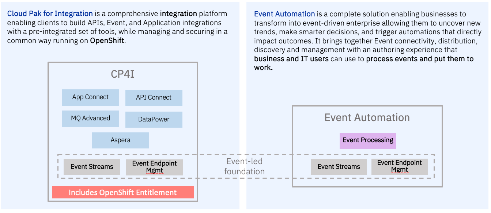
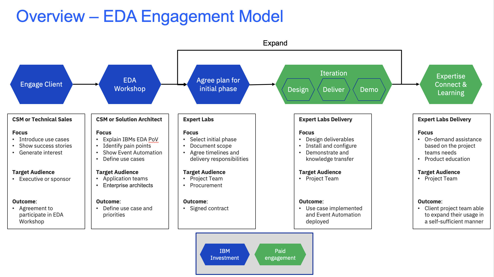

import {Link} from 'gatsby';
import FileLink from '../../../components/FileLink';

## Contacts

| WW Contact | Name |
| --- | --- |
| Customer Success Practice Leader | Venkata V Gadepalli |
| Client Engineering Practice Leader | John Abott |
| Technology Expert Labs Product Management | Callum Jackson |
| Technology Expert Labs Solution Engineering | Mark Barnard |
| Product Management | Matt Sunley |
| Americas CSM Lead | JP Soto |
| EMEA CSM Lead | Zdenek Boruvka|

## Scope

Event-driven architecture is an integration model built around the publication, capture, processing, and storage (or persistence) of events.

IBM Event Automation is a fully composable solution, that enables businesses to accelerate their event-driven efforts, wherever they are on their journey. 
IBM Event Automation provides three primary products (Event Streams, Event End-point Management, Event Processing) that lay the foundation of an event-driven architecture for unlocking the value of events.

The platform empowers enterprises with three main capabilities:

  * Event Streams: Unlock events from existing systems to become a real event-driven enterprise. Rely on resilience and security designed for mission-critical use. 

  * Event Endpoint Management: Catalog event endpoints so they can be socialized and discovered. Enable controlled self-service access via enterprise-wide policies that can be applied to multiple streams of events.

  * Event Processing: Full stack event processing to transform raw events into valuable business events, sense trends and patterns over time and correlate events to a rich and personalized context. Detect business situations and trigger automated responses.

The accelerator aims to help you drive workloads for Integration and Event Automation, products activation, diamond drawdown by using one of the following approaches: 

  * *Entry Point*: Start with CP4I by inroducing EventStreams,expand with Event Automation. Customers will be able to use either Cloud Pak for Integration or IBM Event Automation licenses to deploy event-led foundation capabilities. Access to Event Processing will only be available via the IBM Event Automation license. Take a look at the JLR example to understand how we start with Event Streams and expand to include Event Automation.
    * <a href="https://ibm.ent.box.com/file/1451908350655?s=ax2tipivpzoe1daleba7rmtkez6yfoez" target='_blank' rel='noreferrer noopener'>Event Automation at JLR</a>(Slide Deck).
    * <a href="https://ibm.ent.box.com/file/1451933634805?s=y657l5hn7hjh74u60snkpgpdma2wdtio" target='_blank' rel='noreferrer noopener'>Recording </a>(JLR Experience starts at 14:28) 
  * *Entry Point*: Co-exist with other IBM Products:
    * IBM MQ can serve as a key source of real-time events representing business transactions and changes. MQ-Kafka source and sink connectors in IBM Event Automation enable seamless connectivity between IBM MQ and Event Streaming, turning messages into real-time business events. For more information refer tools this <a target='_blank' rel='noreferrer noopener' href="https://ibm.webcasts.com/starthere.jsp?ei=1633973&tp_key=ce6193c56e">webinar</a>, where Matt Sunley talks about unlocking real-time events from IBM MQ data.
    * Events Are a Natural Extension of API Management. For more details refer to Event Endpoint Management
    * App Connect Enhances Connectivity in a Kafka Ecosystem and enables automations.
    * Watson X to Perform Actions on Business Insights in real-time. Take a look at the <a target="_blank" rel='noreferrer noopener' href="https://github.ibm.com/EA-Watson-X-Demo-Team/complaint-handling-customer-care-demo">Real-time Customer Care - using Generative AI for Sentiment Analysis and Content Generation</a> demo for an example of how this can be done.
  * *Surround and takeout Confluent*: We recommend you start with focusing on a <a target='_blank' rel='noreferrer noopener' href="https://ibm.seismic.com/Link/Content/DC6JhHWmXX7mhGfRRPV9QRRBqGqj">“Surround Confluent”</a> Strategy leveraging our technology accelerators with Event Processing and Event Endpoint Management. However, we are also seeing interest in the market to replace Confluent due to their escalating costs. 
  
  

## Engagement Model 
The following diagram shows the EDA accelerator engagement model at a high level.

## Engage Client Phase
*Led by: Customer Success and/or Brand Technical Seller*
*Audience: Executive/Sponsor*
Before entering this phase, it is necessary to have discussed the positioning of Event Automation with the account team and Account Technical Leader to ensure that it is part of the overall account plan.

The outcome of this phase is that a sponsor is interested and in agreement to have an EDA Workshop, where IBM and the customer will work together to define the scope and success criteria.

**Process and Assets:**
  * Account Planning should be performed to identify target personas and related metrics  
  * CSM should create a Success/Growth Plan in Gainsight to track the progress of this potential project
  * Prepare for the initial meeting using the <a target='_blank' rel='noreferrer noopener' href="https://ibm.box.com/s/x5mbi6g4wm7q1ghotzub189cx0naqzk2">prospecting one pager</a>,and <a target='_blank' rel='noreferrer noopener' href="https://pages.github.ibm.com/csm-playbook/playbook/common/automation/csm-automation-ibm-event-automation/">CSM Playbook page</a> or <a target='_blank' rel='noreferrer noopener' href="https://ibm.box.com/s/x5mbi6g4wm7q1ghotzub189cx0naqzk2">prospecting one pager</a>,and <a target='_blank' rel='noreferrer noopener' href="https://pages.github.ibm.com/csm-playbook/playbook/common/automation/csm-automation-ibm-event-automation/">Seismic Event Automation sales kit</a> (and/or get help from the play contacts)
  * If you have more time with the client executive, present use cases relevant to the client's industry by referring to the <a target='_blank' rel='noreferrer noopener' href="https://ibm.seismic.com/Link/Content/DC43c9cF4qgG7G2BMfhM7PfjPFRB">Event Automation Use Cases</a>

## EDA Workshop
**Led by: Customer Success and/or Technology Expert Labs Solution Architecht**
**Audience: Application Teams, Enterprise Architechts**
This one-day informal and customized workshop will help clients consider what is needed to provide an industry-leading event driven capability suitable to address their business challenges and pain points. This workshop aims to propose potential high-level plans and roadmaps using interactive whiteboard sessions with IBM consultants and specialists with experience in integration.

This phase will typically be an in-person meeting with the following participants:

  - IBM CSM, Technology Expert Labs Solution Architect, Account Team, ATL 
  - Customer architects, developers, operations teams, system designers and managers who are looking for solutions to better satisfy their EDA requirements.

The EDA workshop is used to articulate the capabilities and benefits of IBM Event Automation. The outcome of this phase is that technical team at the customer understands the capabilities and beneifits of IBM Event Automation and agrees to a set of use cases that could be implemented.

**Processes and Assets**
  - CSM engages their Technology Expert Labs Seller (if you don't know your Technology Expert Labs Seller they <a target='_blank' rel='noreferrer noopener' href="https://clientresourcelocator.wdc1a.cirrus.ibm.com/">can be found here</a>)
  - Technology Expert Labs Seller creates an ISC record and engages the Technology Expert Labs Solution Architect (if necessary)
  - CSM conducts the briefing using the <a target='_blank' rel='noreferrer noopener' href="https://ibm.seismic.com/Link/Content/DCmJ3TRBCVW9gG4DMh9GWDp3j7gB">Event Automation PoV Deck</a>
  - CSM should as needed demonstrate features and capabilities of event automation using the <a target='_blank' rel='noreferrer noopener' href="https://ibm.seismic.com/Link/Content/DCmPp2JQBgRhQG9JGh66J4JG8C2V">demos</a> available. It is preferable to have a live demo and you can follow the instructions in the page to build a demo in your own environment.
  - You can also use the <a target='_blank' rel='noreferrer noopener' href="https://ibm.box.com/s/06vqf3ikq9my903j3gc50mp5vx7t2rvs"> Real-time Customer Care </a> demo to show case how you can use event processing to drive AI use cases.
  
## Agree Plan for Initial Phase
**Led by: Technology Expert Labs Solution Architect/Solution Engineer**

**Technology Expert Labs Offering**: <a target='_blank' rel='noreferrer noopener' href="https://ibm.seismic.com/Link/Content/DCVXHRBd4HVgDGCFX9bWp8GbbTDd">Event Automation Solution Offering</a>

**Technology Expert Labs Offering:** <a target='_blank' rel='noreferrer noopener' href="https://ibm.seismic.com/Link/Content/DChTBdhh2f8jg8mHCbCTB8FfD683">Expertise Connect</a>

The purpose of this phase is to close a services deal. The IBM Sales team, Digital/Services Seller, Solution Architect/Solution Engineer will present the customer with a Services proposal for executing an Event Automation Engagement.

Required inputs by the CSM: None; however CSM will want to maintain awareness for continued engagement with the client.

## Deliver Phase

**Led by: Technology Expert Labs Delivery Team**

**Technology Expert Labs Offering**: <a target='_blank' rel='noreferrer noopener' href="https://ibm.seismic.com/Link/Content/DCVXHRBd4HVgDGCFX9bWp8GbbTDd">Event Automation Solution Offering</a>

**Technology Expert Labs Offering:** <a target='_blank' rel='noreferrer noopener' href="https://ibm.seismic.com/Link/Content/DChTBdhh2f8jg8mHCbCTB8FfD683">Expertise Connect</a>

During the delivery phase, the Technology Expert Labs Delivery team will perform the services as agreed upon in the pror phase

Required inputs by CSM: None; however CSM may want to shadow/maintain awareness for continued engagement with the client.
    
## Additional Assets you can use
**Here are some additional assets you can refer to to get started:**
* **Learn:** <a href='https://pages.github.ibm.com/americas-integration/cp4i-pot-v5/Kafka/' target='_blank' rel='noreferrer noopener'>IBM Event Automation POT</a> 
* **Learn:** <a href='https://yourlearning.ibm.com/activity/PLAN-754B571B1344' target='_blank' rel='noreferrer noopener'>IBM Event Automation Level 1 Course</a> 
* **Learn:** <a href='http://ibm.biz/eda-bootcamp' target='_blank' rel='noreferrer noopener'>EDA Bootcamp</a> 
* **Guided Tutorials:** <a href='https://ibm.github.io/event-automation/tutorials' target='_blank' rel='noreferrer noopener'>Tutorials</a> 
* **Demo:** <a href="https://ibm.seismic.com/Link/Content/DC2TPdFG6bb3M87XXTh3DMP2M8BP" target='_blank' rel='noreferrer noopener'>IBM Event Automation Demo Video</a>
* Demo: <a target='_blank' rel='noreferrer noopener' href="https://ibm.box.com/s/06vqf3ikq9my903j3gc50mp5vx7t2rvs"> Real-time Customer Care - using Generative AI for Sentiment Analysis and Content Generation.</a>
* Demo Instructions: <a target="_blank" rel='noreferrer noopener' href="https://github.ibm.com/EA-Watson-X-Demo-Team/complaint-handling-customer-care-demo">Real-time Customer Care - using Generative AI for Sentiment Analysis and Content Generation</a>
* **Sizing Guidance:** <a href="https://ibm.seismic.com/Link/Content/DCpMPMTgdFWJ9GMPcdGcfcbJHRcG" target='_blank' rel='noreferrer noopener'>IBM Event Automation Parts & Pricing</a> 
* **Community:** <a href='https://community.ibm.com/community/user/integration/communities/community-home/digestviewer?communitykey=739928b5-06d5-452d-a013-f688dea8f64a' target='_blank' rel='noreferrer noopener'>IBM Integration community</a> 
* <a href="https://ibm.seismic.com/Link/Content/DC43c9cF4qgG7G2BMfhM7PfjPFRB" target='_blank' rel='noreferrer noopener'>Event Automation Use Cases</a>
* <a href="https://ibm.seismic.com/Link/Content/DCd2PqjhVR8cWGhFmjC6XbPq7cqV" target='_blank' rel='noreferrer noopener'>IBM Event Automation Sales Tactics</a>
* IBM Garage: <a target='_blank' rel='noreferrer noopener' href="https://www.ibm.com/garage">Let's create an approach that turns ideas into outcomes.</a>

You can get an understanding of the CSM led engagement and what is being done from the below slides and recording:
  * <a href="https://ibm.ent.box.com/file/1451908350655?s=ax2tipivpzoe1daleba7rmtkez6yfoez" target='_blank' rel='noreferrer noopener'>Event Automation at JLR</a>(Slide Deck).
  * <a href="https://ibm.ent.box.com/file/1451933634805?s=y657l5hn7hjh74u60snkpgpdma2wdtio" target='_blank' rel='noreferrer noopener'>Recording </a>(JLR Experience starts at 14:28) 

[def]: ../images/stakeholders-personas.png