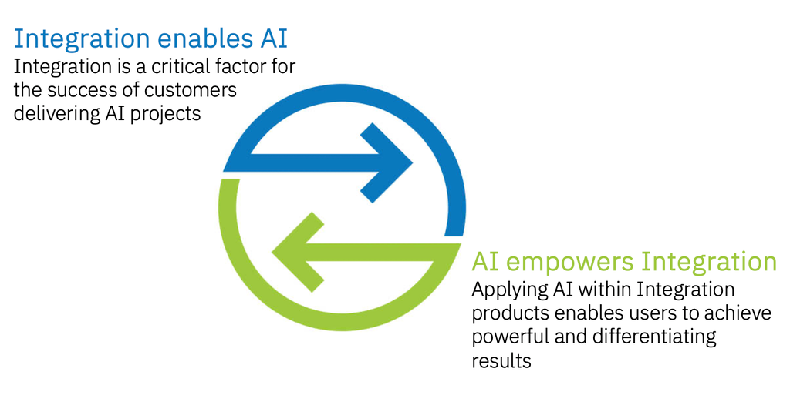
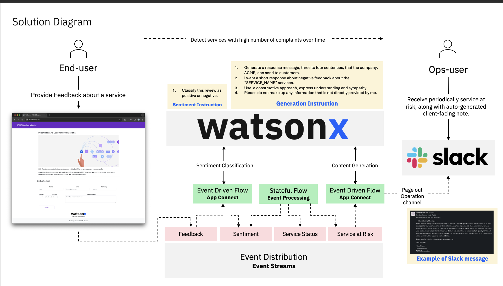
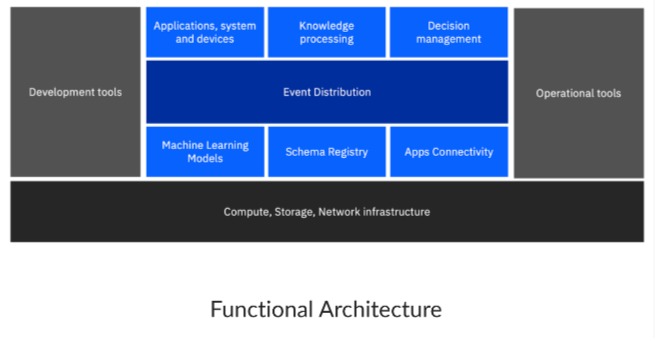
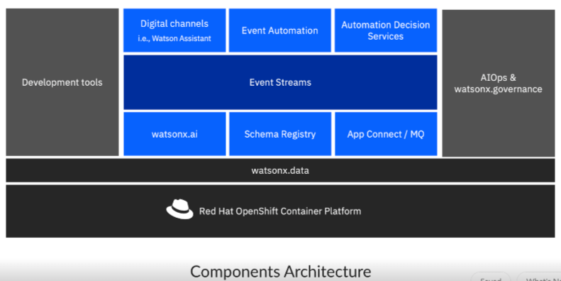

import {Link} from 'gatsby';
import FileLink from '../../../components/FileLink';

## Contacts

| WW Contact | Name |
| --- | --- |
| Customer Success Practice Leader | Venkata V Gadepalli |
| Client Engineering Practice Leader | John Abott |
| Technology Expert Labs Product Management | Callum Jackson |
| Technology Expert Labs Solution Engineering | Mark Barnard |
| Product Management | Andy Garatt|

## Scope

AI is a vital aspect of business, helping organizations become more efficient and effective. But for AI projects to be successful, they need to incorporate multiple applications and disparate data. That is where application integration comes in. AI and application integration work together to drive better business outcomes. In IBM, we have a unique opportunity to incorporate IBM Integration platform with IBM Watson X platform in order to:

  1. Drive business growth.
  2. Deliver distinguished value.
  3. Open new spaces for demands (Blue ocean strategy).

The accelerator aims to help you drive additional new workloads for Integration and watsonx, products activation, diamond drawdown, and introduce IBM watsonx platform by focussing on the following outcomes: 

  * How can you use AI to open conversations with your customers about IBM Integration products?
  * Why is IBM Integration needed for customers to be successful in their own rollout of AI?
 
  

## IBM's perspective on AI in Integration

**The role of Application Integration in the AI domain:**

  1. AI models **require access** to enterprise systems, e.g., access to training data, that require heavy-lifting integration.
  2. Data analytics is **more valuable in real-time** than at rest
  3. Integration is an important **enablement point** for AI journey.

**The role of AI in the Application Integration domain:**

  1. AI delivers **benefits across the user spectrum** – business, developers, and operations.
  2. **Enhances user effectiveness** as AI performs manual or time-consuming work.
  3. **AI supports and enhances human-led innovation**, without replacing the human.

Matt Roberts(DE and CTO, IBM Integration) recently gave a talk on AI use cases (including watsonx integrations) and features with respect to the Integration portfolio. Below are just a few examples, where watsonx and Integration can work together. Matt talks about:
  - A customer scenario  using natural language processing with watsonx.ai retrieving answers and then taking actions on backend systems using IBM App Connect or IBM API Connect Essentials (Stepzen) and converting backend responses into human readable text using watsonx.ai.
  - A customer using IBM MQ Streaming queues and Event Stream topics to take a copy of the business messages as they flow thru the system to train AI Models.
  - A customer using Integration as an enablement point for AI, where AI is used to evaluate incoming information and how Integration helps expedite the processing.

We strongly encourage you to refer to the <a target='_blank' rel='noreferrer noopener' href="https://ibm.seismic.com/Link/Content/DCg6hdV693fBBGFCF27Gh2C22DT8">slides</a> and the <a target='_blank' rel='noreferrer noopener' href="https://ibm.seismic.com/Link/Content/DCBp8PTmGgChTG9GbdjMXJJbqVMB">recording</a> of the session to get a better understanding of watsonx and the Integration portfolio scenarios used together.

Another <a target='_blank' rel='noreferrer noopener' href="https://ibm.box.com/s/06vqf3ikq9my903j3gc50mp5vx7t2rvs">excellent asset</a> that can show a real world example has been implemented by **Rashid A. Aljohani**, CSM Architecht from the MEA region.  This demo showcases how watsonx.ai can be used to do sentiment analysis on feedback provided by customers on an organizations website and also showcases how the content generation (LLMs) feature of watsonx.ai can be used to raise alerts. The following solution diagram shows the interactions between the various capabilities that have been captured in the demo.

Watch this space as we make more assets and guidance available in the future.

## Engagement Model 
- Strategize with ATL and Tech Sales at the account and engage Client Engineering 
- Capitalize on the IBM Garage methodologies to discovery and unpack new business demands for Integration and AI use-cases.
- Engage Technology Expert Labs as necessary.
- Leverage the solution value and assets in the section below.

## Solution value and assets 

You can find below high-level **Functional Architecture** and **Components Architecture** that can help you accelerate innovation, enhance efficiency, and deliver unique and competetive solutions using IBM Integration and powered by watsonx. It all starts by identifying the core building blocks:
- **Events:** a fact or a record of something that hapenned, e.g a user abandoned a shopping cart or a user performed fradulent transactions.  Events are immutable sequence of messages generated while users interact with digital products.  Yo can drive a lot of innovative business value such as Customer 360 and Predictive Maintenance.
- **Schema Registry:** consider it like a data exchange cntract to help producers and consumers communicate.  Schema evolves as the business requirements evolve.
- **Event Distribution:** to collect and organize a raw stream of real-time events across the enterprise.
- **Knowledge Processing:** a framework that detects and acts based on pre-defined business rules.  It converts raw events in real-time into actionable insights.  It uses the "Decision Management" and "AI Models" behind the scenes to support processing the information into knowledge.
- **Apps Connectivity:** an integration solution to connect any of your application and data, no matter where they reside.  It offers drag-and-drop workflows to help users of all skill levels easily create integrations that connect applications and data in minutes.
- **Machine Learning Models**: think about it as an AI studio that brings together new generative AI capabilities and classic machine learning capabilities that spin across the AI development journey such as train, validate, tune and deploy AI models.

 

**Here are some assets you can refer to to get started:**

Webinar: <a target='_blank' rel='noreferrer noopener' href="https://ibm.webcasts.com/starthere.jsp?ei=1638008&tp_key=e505443270)">AI Powered Application Integration</a>

Internal Integration Tech Talk Tuesday Session: <a target='_blank' rel='noreferrer noopener' href="https://ibm.seismic.com/Link/Content/DCBp8PTmGgChTG9GbdjMXJJbqVMB">AI and Integration</a>

IBM Garage: <a target='_blank' rel='noreferrer noopener' href="https://www.ibm.com/garage">Let's create an approach that turns ideas into outcomes.</a>

Demo: <a target='_blank' rel='noreferrer noopener' href="https://ibm.box.com/s/06vqf3ikq9my903j3gc50mp5vx7t2rvs"> Real-time Customer Care - using Generative AI for Sentiment Analysis and Content Generation.</a>

Demo Instructions: <a target="_blank" rel='noreferrer noopener' href="https://github.ibm.com/EA-Watson-X-Demo-Team/complaint-handling-customer-care-demo">Real-time Customer Care - using Generative AI for Sentiment Analysis and Content Generation</a>

[def]: ../images/stakeholders-personas.png