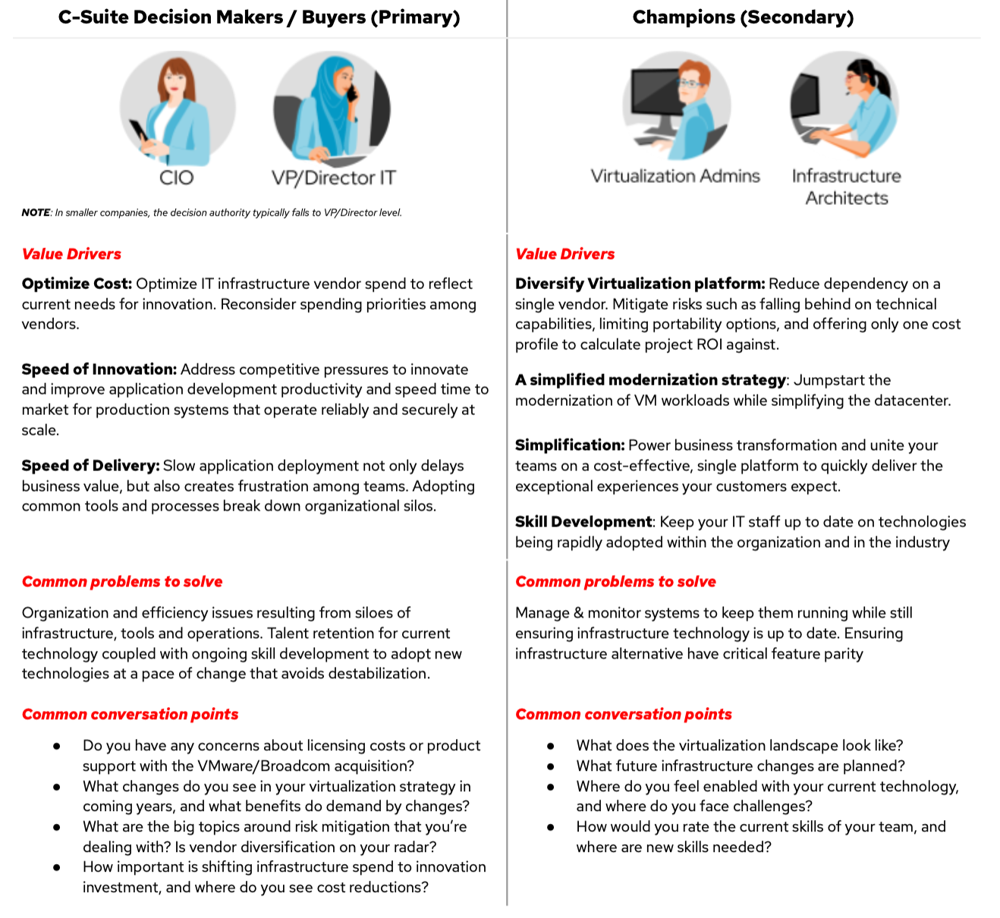
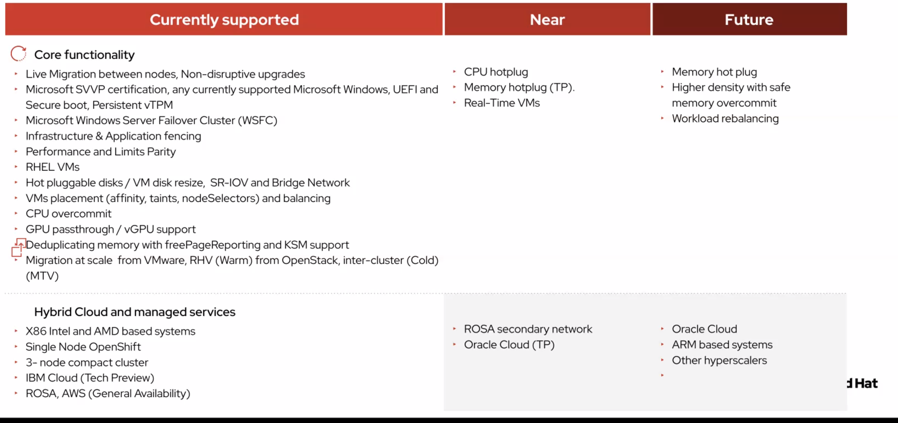
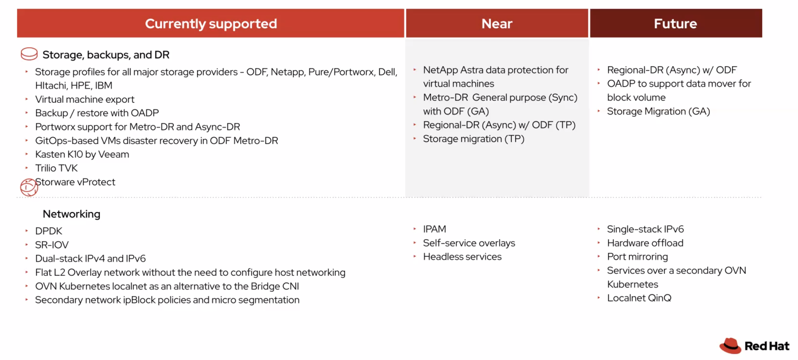

import {Link} from 'gatsby';
import FileLink from '../../../components/FileLink';

## Contacts

| WW contact | Name |
| --- | --- |
| **Customer Success Practice Leaders** | Noel Colon Venkata Gadepalli |
| **Technology Expert Labs Solution Engineering** | Hendrik van Run Mark Barnard Benjamin Orazem |
| **Technology Sales** | Dennis Lauwers |

## Scope

Some customers have asked to look at alternatives to their virtualization platform as they are seeing
- Increased quotes compared to their original price upon contract renewal
- A shift from a variety of skus to just a few platform packages, where they are looking for more flexibility
- A shift from a perpetual contractual model to subscription model

If your client does approach you looking at alternatives for virtualization, <a href="https://docs.openshift.com/container-platform/latest/virt/about_virt/about-virt.html" target="_blank">OpenShift Virtualization</a> could be one alternative for clients, depending on the type of workload the customer is running.  OpenShift Virtualization, is included with <Link to='/common/automation/csm-automation-cloud-pak-for-applications/'><strong>Cloud Pak for Applications</strong></Link>

OpenShift Virtualization allows customers to run virtual machines like any other containerized workload; thus, allowing the same set of tools and automation to manage both worlds. This enables customers to reuse existing VMs not ready for containerization at the app level. Red Hat OpenShift allows unlimited RHEL virtual machines on OpenShift Virtualization within <Link to='/common/automation/csm-automation-cloud-pak-for-applications/'><strong>Cloud Pak for Applications</strong></Link>, making it ideal for data center workloads ready to co-exist with or replace VM based infrastructure - depending on customer preferences and budget.

## Product Demo

<iframe width="560" height="315" src="https://www.youtube.com/embed/buIZ_hXbMYA?si=tM0GCWA--LfiD3ED" title="YouTube video player" frameborder="0" allow="accelerometer; autoplay; clipboard-write; encrypted-media; gyroscope; picture-in-picture; web-share" allowfullscreen></iframe>

## Customer Benefits

- **Reduce Complexity**: Use OpenShift as one unified application platform for all workloads, including virtualized applications in VMs and containers, all managed from a single control plane and console.
- **Application Consistency & Reliability**: Operational efficiency by automating VM lifecycle with GitOps, often referred to as "infrastructure as code".
- **Security & Scalability**: Protect applications running at scale without slowing development or increasing operational complexity.
- **Bring cloud-native to virtual machines**: Apply cloud-native operational practices to virtual machines, accelerating time to value. Take advantage of virtualization infrastructure that allows your VMs and containers to be managed by the same set of tools on a single unified platform.

  

## Personas to talk to

<InlineNotification>
For C-Suite discussions, you should engage your account ATL.
</InlineNotification>

  

## Why should CSMs care

- **Draw down from ELA catalog**: OpenShift Virtualization is a feature of OpenShift, and is included with CloudPak for Applications with **unrestricted** OpenShift entitlements
- **Land & Expand**: Once the OpenShift Virtualization use-case is proven, we are now able to deploy additional CloudPaks on top of the existing cluster.
- **Jumpstart for Fusion HCI or IBM Storage Scale customers**:  Fusion HCI is an ideal integrated hardware platform that deploys OpenShift on Bare Metal, and includes all the benefits of the Fusion SDS solution.  Fusion HCI and IBM Storage Scale can fill in the HADR gaps within the OpenShift Virtualization product.
- **IBM Turbonomic**: To determine what's running on your current virtualization technology today, we should position IBM Turbonomic. This could also help optimize the existing virtualization footprint, with potential for a "quick win" while the client prepares their strategic plan.

  

## Target Customer Profile

- Customers that are looking at alternatives to virtualization due to changes in their cost or licensing model that also own <Link to='/common/automation/csm-automation-cloud-pak-for-applications/'><strong>Cloud Pak for Applications</strong></Link>.

- Customers that own <Link to='/common/automation/csm-automation-cloud-pak-for-applications/'><strong>Cloud Pak for Applications</strong></Link> and non-containerized IBM products and wish to simplify their licensing and management experience.  All brands should consider OpenShift Virtualization for Cloud Pak point product deployments.  For example, a customer could start moving WASND VMs into OpenShift Virtualization, and then modernize their applications using <a href="https://pages.github.ibm.com/csm-playbook/playbook/common/modernization/modernization-was/" target="_blank">Transformation Advisor</a>, with all WAS entitlements provided by WHE.

- Customers that own <Link to='/common/automation/csm-automation-cloud-pak-for-applications/'><strong>Cloud Pak for Applications</strong></Link> and are running OpenShift in virtualized environments on-prem, as they are paying for two hypervisor solutions.

- Avoid going after Managed Service Providers as a start, as they typically do not own or have access to the software/solution running on the VMs they host on behalf of their clients.

- Midmarket and larger companies across industries that use applications as a strategic and competitive advantage, but still have a number of those workloads deployed on traditional virtualization infrastructure. Look for customers who have a dedicated VM team administering current deployments, and definitely look into your existing OpenShift customer base.  Listen for customer pain points associated with legacy VM technology usage with cist uplift where <Link to='/common/automation/csm-automation-cloud-pak-for-applications/'><strong>Cloud Pak for Applications</strong></Link> may have already have had deployment. Common challenges may be long VM deployment lead times, inconsistent deployments, and difficulty retaining and attracting staff. Finally, be cautious of customers with small deployments who are unlikely to justify migration.

  

## Objection Handling

| 
FAQ
 | Answer |
| --- | --- |
|**I’ve got 90K VMs across multiple continents,you certainly can’t handle every workload.**|Migrating to OpenShift Virtualization is a journey and not a massive all at once switchover. Use an iterative process to learn the platform and tools, establish a workflow to migrate only the applications you want to, at your pace. Red Hat offers VM migration tools at no additional cost to help get you started.|
| **You don’t have feature parity with my virtualization vendor**| Focus on the features you use and need. OpenShift meets the majority of enterprise VM needs, and utilizes the KVM hypervisor that is in use in banks, airlines, and other industries. Future improvements are driven by evolving customer needs.|
| **How do I do Day 2 operations? For OpenShift? For VMs?**| OpenShift provides a rich UI experience with CLI and APIs for common VM operations. It has built-in capabilities for networking, storage, observability, and other IT operations. RHEL and Windows guests are compatible with your existing in-guest automation.|
| **Is the performance of VMs on OpenShift as good as what I’m using today?**| Yes. <a href="https://cloud.redhat.com/blog/openshift-cnv-2.5-available" target="_blank">Virtual workloads are benchmarked for performance parity</a> on all Red Hat platforms, including OpenShift.|
| **Does my infrastructure team have to learn Kubernetes to run OpenShift Virtualization?**|Kubernetes no, OpenShift yes. Your team needs to learn, independently or via formal training, OpenShift administration and management which is available via rich UI experience along with CLI and APIs. And companies increasingly need people who understand OpenShift, containers, and Kubernetes.|
| **Does OpenShift Virtualization provide livemigration?**|Yes, it has been a core feature from the very first version, and is <a href="https://docs.openshift.com/container-platform/4.13/virt/live_migration/virt-live-migration.html"  target="_blank">well documented</a>.|

<InlineNotification>
For more details see this <a href="https://content.redhat.com/content/rhcc/us/en/assets/display.html?id=f34a5489-d0b9-4797-a514-4a1568c9a8f7" target="_blank">Objection handling guide</a>
</InlineNotification>

  

###  DOs and DON'Ts when building a Cloud Pak for Applications use-case for OpenShift Virtualization

| 
<strong>DON'T</strong>
 | 
<strong>DO</strong>
 |
| --- | --- |
| Say takeout | Position OpenShift as a virtualization alternative. |
| Position OpenShift Virtualization as cheaper (do not lead with price as a reason to move)  - OR -  Swap one VM technology with another (OpenShift Virtualization)| Modernize with a single administration interface for VMs and containers at your own pace  Position the VM as part of a modern application which needs: VMs, Containers, Kubernetes, GitOps and CI/CD and is managed by the Platform Engineering team.|
| Lift and shift VMs to the cloud (VM technology on IBM Cloud, AWS, etc). This is expensive with no change in agility or speed. | Red Hat offers modularization and containerization architected for horizontal scalability of apps, databases etc which is well suited to public cloud. OpenShift on bare-metal with Hosted Control Planes improves ROI & TCO. Fusion HCI can also be deployed on-prem. Lift and Shift is available with OpenShift Virtualization using the Migration Toolkit for Virtualization.|
| <strong>Say takeout</strong> | <strong>Position OpenShift as a virtualization alternative.</strong> |

  

## Cluster Sizing

Sizing VMs in OpenShift Virtualization is the same as any other <a href="https://docs.google.com/document/d/1gkjMkoxoyaaeDGCO8mmgm1ux5UU0yqZpoQ_-Lm_LiKA/edit#heading=h.mprawrtcxd2y" target="_blank">OpenShift sizing</a> exercise.  Each VM has a request for the full ammount of memory plus overhead.  OpenShift Virtualization does not provide memory overcommitment (as of March 13, 2024), so memory will be your biggest constraint and driver for cluster/node sizing.

At a high level, the process is to determine the amount of virtualization resources needed (VM sizes, overhead, burst capacity, failover capacity), add that to the amount of resources needed for cluster services (logging, metrics, ODF/ACM/ACS if hosted in the same cluster, etc.) and customer workload (hosted control planes, other Pods deployed to the hardware, etc.), then find a balance of node size vs node count:

<InlineNotification>
For a detailed explanation of the steps below, consult this <a href="https://content.redhat.com/content/rhcc/us/en/assets/display.html?id=de5e7eef-dc9d-40b1-bf2e-fc8de762c4b2" target="_blank">OpenShift Virtualization Sizing Examples</a> guide.
</InlineNotification>

1. Determine raw capacity of required VM workloads.  Pay attention to <a href="https://docs.openshift.com/container-platform/latest/virt/install/preparing-cluster-for-virt.html#virt-cluster-resource-requirements_preparing-cluster-for-virt" target="_target">overhead requirements</a>.
2. Decide cluster node size
3. Adjust for cluster architecture
4. Adjust for failover / HA and resource balancing
5. Storage, network, special resources, and more

  

## Product Roadmap

**Comming Soon: Link to Live Roadmap**

## Service Engagements
Comming Soon from TEL

  

## Call To Action
Go to Gainsight and search for your assignements for <Link to='/common/automation/csm-automation-cloud-pak-for-applications/'><strong>Cloud Pak for Applications</strong></Link>. <a href="https://w3.ibm.com/w3publisher/customersuccess/csm-team-blog/c4ff1a40-6d2e-11ee-a957-63ff03d55ee4" target="_blank">Create a success plan</a> and select from the drop down menu the OpenShift Virtualization Play from the "Deployment Play" dropdown to track this execution.  Work with your customer to get the right environment to deploy a small OpenShift cluster (consider SNO a light alternative), and migrate a couple of VMs using the <a href="https://access.redhat.com/documentation/en-us/migration_toolkit_for_virtualization/2.5" target="_blank">Migration Toolkit for Virtualization</a>.

  

## Additional References

| 
Document
 | Purpose |
| --- | --- |
| <a href="https://ec.yourlearning.ibm.com/w3/playback/10427871" target="_blank">Internal Education Materials</a> | Learn how to position OpenShift Virtualization as a modernization platform to customers seeking alternative virtualization options. |
| <a href="https://content.redhat.com/content/rhcc/us/en/assets/display.html?fusionQueryId=7gTk9HCcEo&id=f34a5489-d0b9-4797-a514-4a1568c9a8f7" target="_blank">Objection Handling Guide</a> | This document presents potential objections to purchasing a Red Hat offering and how a sales representative or partner can overcome them. |
| <a href="https://content.redhat.com/content/rhcc/us/en/assets/display.html?fusionQueryId=vuc4hHBqeC&id=0a9e3bc2-276d-4ab0-971a-be4ad0c3a546" target="_blank">Technical product overview </a> | Use this in more technical conversations and to get a deeper dive into OpenShift Virtualization.  |
| <a href="https://content.redhat.com/content/rhcc/us/en/assets/display.html?fusionQueryId=Z8JHoCCfsa&id=de5e7eef-dc9d-40b1-bf2e-fc8de762c4b2" target="_blank">Sizing Example</a> | Use this document to understand OpenShift Virtualization Sizing requirements and how workloads will scale.  |
| <a href="https://access.redhat.com/documentation/en-us/migration_toolkit_for_virtualization/2.5" target="_blank">Migration Toolkit for Virtualization</a> |  Product Documentation for Migration Toolkit for Virtualization, an easy way to migrate VMs hosted on vSphere into OpenShift Virtualization |
| <a href="https://ibm.seismic.com/Link/Content/DCJgMHV7HCJ4PGCQCdc67XWm2bCj" target="_blank">Winning with Fusion and OpenShift Virtualization</a> | Fusion Office Hours: Winning with Fusion and OpenShift Virtualization, February 2024 |
| <a href="https://content.redhat.com/content/rhcc/us/en/assets/display.html?id=7be18771-4b4d-4815-8d24-6699c80be178">Reference Architecture</a> | Details about a large-scale deployment of OpenShift Virtualization with Red Hat Ceph Storage as a high-availability external network storage solution.|
| <a href="https://ibm.ent.box.com/s/7s1lh7gyszfjnicapv67oqdbwuapmnb3" target="_blank">Red Hat Competitive Share Box Folder</a> | Internal Box folder with competitive material provided by Red Hat |
| **Customer Stories** | <a href="https://www.redhat.com/en/about/press-releases/red-hat-refines-kubernetes-both-traditional-and-cloud-native-applications-latest-version-red-hat-openshift" target="_blank">Lockheed Martin</a> <a href="https://www.redhat.com/en/resources/sahibinden-case-study" target="_blank">sahibinden.com</a> <a href="https://redhat.lookbookhq.com/c/rh-dbrb-case-study-f?x=nFZNOq&lx=1QN7sL">Belarus Bank reduces cost of ownership</a> <a href="https://redhat.lookbookhq.com/c/rh-bayport-financial?x=nFZNOq&lx=1QN7sL">Bayport Financial Services simplifies and accelerates growth</a> |
