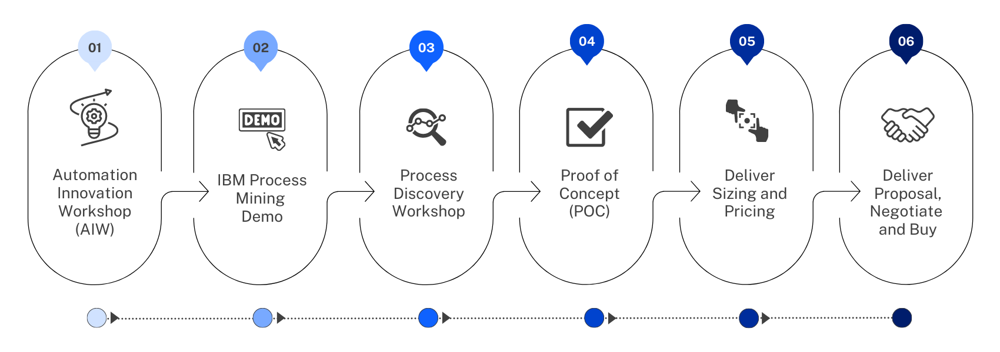

import {Link} from 'gatsby';
import FileLink from '../../../components/FileLink';

## Contacts

| WW contact| Name |
| --- | --- |
| **Customer Success Practice Leader:** | Di Lang |
| **Client Engineering Practice Leader:** | Monika Aggarwal |
| **Technology Expert Labs Product Management:** | Sandeep Sinha |
| **Technology Expert Labs Solution Engineering:** | Gordon Gaenzle |

## Scope

Process mining is a technique that applies AI to discover, monitor, and optimize business processes by analyzing available knowledge from event log systems and desktop interactions. IBM Process Mining enables organizations to identify the business processes that might benefit most from automation by using business system data to create and visualize an end-to-end process to uncover derivations, bottlenecks, and inefficiencies that are hidden in business processes.

This accelerator focuses on clients who haven’t deployed yet or want to discover and automate further. It also helps existing Business Automation clients to extend their Could Pak for Business Automation footprint.

## End-to-end Process Mining journey

- Strategize with ATL/techsales at the account and involve Client Engineering team
- Leverage the IBM Hypersonic Pattern: <a target='_blank' rel='noreferrer noopener' href="https://process-mining.tech-patterns.techzone.ibm.com">Process Mining Technology Pattern</a>
- Engage Technology Expert Labs: <a target='_blank' rel='noreferrer noopener' href="https://ibm.seismic.com/Link/Content/DCGC9F9CRPMX484PCHjQ4HFbmfXd">Process Mining Quickstart - Intelligent Process Analysis & Discovery</a> (if you don’t know your Technology Expert Labs Seller they <a target='_blank' rel='noreferrer noopener' href="https://clientresourcelocator.wdc1a.cirrus.ibm.com/">can be found here</a>)

This diagram shows the End-to-end Process Mining Journey. Each section is broken down in <a target='_blank' rel='noreferrer noopener' href="https://process-mining.tech-patterns.techzone.ibm.com/#how-to-use-this-pattern">Process Mining Technology Pattern</a>.

