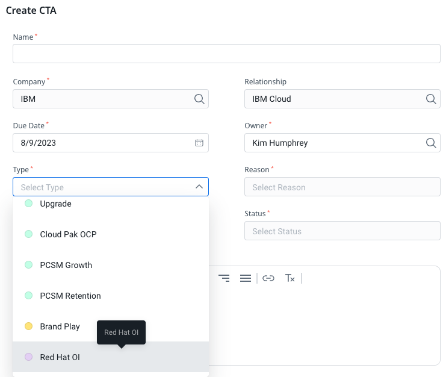
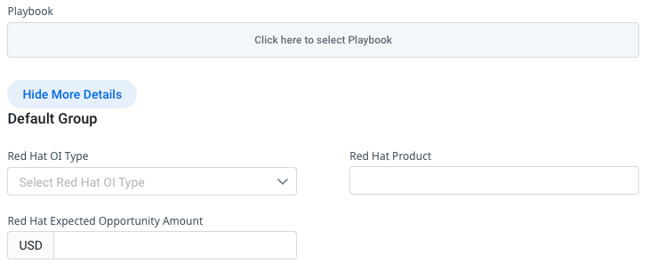

import {Link} from 'gatsby';
import FileLink from '../../../components/FileLink';

## Contacts

| WW contact | Name |
| --- | --- |
| **Customer Success Practice Leaders** | Noel Colon |

## Scope

After the initial use cases are proven out, customers see value in the platform.  As their confidence increases, they open the platform for more internal consumers.  This leads to new use cases using additional Cloud Pak capabilities, as well as additional environments to address their operational needs (development, UAT, staging, production, DR).  As they continue to operationalize the platform, we're able to scale OpenShift organically as it "tags along" for the ride.  CSMs are also working to embed out IBM software products into our Business Partners' solutions, like <a href='https://w3.ibm.com/w3publisher/customersuccess/the-practice/2023-csm-americas-hightlight-stories/2023q2-reliaquest-americas-highlight' target='_blank' rel='noreferrer noopener'>ReliaQuest's GreyMatter security offering</a>, increasing deployments significantly as their solutions are broadly adopted. CSMs are also partnering with Red Hat as part of their customer's modernization to encourage moving to <a href='https://www.redhat.com/en/technologies/cloud-computing/openshift/platform-plus' target='_blank' rel='noreferrer noopener'>OpenShift Platform Plus</a>, allowing them to deploy non-Cloud Pak workloads into their cluster to consume Cloud Pak services. 

## Pass OpenShift opportunities directly to Red Hat

After we land the initial deployment on OpenShift, you have an opportunity to proactively expand the IBM and Red Hat footprint for additional capacity or adjacent use cases. As you find opportunities to expand, there is a process to create those opportunities for IBM products and pass the leads to IBM Sales. To pass OpenShift license opportunities to Red Hat through Gainsight, perform the following steps:

1. Within any relationship in Gainsight, navigate to your cockpit.

2. Create a CTA of type Red Hat OI.

3. Under More Details, complete the information on whether the lead is for a product or services. 

As you submit the opportunity, the opportunity is automatically sent to Red Hat. You will be listed as the first point of contact, which allows you to share key insight into the opportunity and do a warm introduction with the client. 

## End-to-end journey for Red Hat OpenShift expansion

Depending on where you obtain Red Hat® OpenShift® Container Platform from, it can have implications on what you can deploy on it. Red Hat OpenShift Container Platform clusters are entitled by cores, not by individual nodes. You can stack entitlements of different types together to ensure that all of the cores in a cluster have a valid entitlement according to the terms and conditions for that entitlement.

------------------

### Expand existing Restricted OCP footprint with unrestricted OCP

**Scenario:** Any Cloud Pak already deployed on OpenShift where client wants or needs more OCP or wants to run additional workloads. 

If your customer obtains Red Hat OpenShift Container Platform as part of a bundle with an IBM Cloud Pak®, the Red Hat® OpenShift® Container Platform cores are restricted cores. They can only be used in support of the IBM Cloud® Paks.

Important: Whether or not the Red Hat OpenShift Container Platform cores are restricted or not, your customer can still take full advantage of all of the features that are included in Red Hat OpenShift Container Platform, for example, but not limited to, OpenShift Pipelines.

If your customer obtains Red Hat OpenShift Container Platform independent of an IBM Cloud Pak, such as purchasing it directly through Red Hat®, the Red Hat® OpenShift® Container Platform cores are unrestricted cores. They can be used to support IBM Cloud Paks and any other application or monitoring agent.

**Initial focus:** Any Cloud Pak deployment 
**Benefits:** Enable clients to run affiliated apps in containers (ex. web/mobile apps, Guardium, monitoring) 
**Engagement:** 
1. CSM pass to Red Hat via Gainsight CTA
2. Red Hat catches to progress and close

------------------

### Upsell from Restricted OCP to OPP
**Scenario:** Any Cloud Pak already deployed on OpenShift

**Red Hat OpenShift Container Platform** adds a full set of operations and developer services and tools, including OpenShift Serverless, OpenShift Service Mesh, and OpenShift Pipelines. It has everything teams need to get started on building new cloud-native applications or migrating existing applications to containers.

**Red Hat OpenShift Platform Plus** builds on OpenShift Container Platform and includes advanced multicluster security and extended management capabilities for organizations looking to build cloud-native applications at scale.

OPP includes: 

| Product | Description | Learn more |
| --- | --- | --- |
| Red Hat OpenShift Container Platform | A consistent hybrid cloud foundation for building and scaling containerized applications. | <a href='https://www.redhat.com/en/technologies/cloud-computing/openshift/container-platform' target ='_blank'>Learn more</a> |
| Red Hat Advanced Cluster Management for Kubernetes | Application life-cycle management and governance and across multiple Kubernetes clusters from a single console. | <a href='https://www.redhat.com/en/technologies/management/advanced-cluster-management' target ='_blank'>Learn more</a> |
| Red Hat Advanced Cluster Security for Kubernetes | Built-in Kubernetes-native security that provides multicluster governance through the entire application life cycle. | <a href='https://www.redhat.com/en/technologies/cloud-computing/openshift/advanced-cluster-security-kubernetes' target ='_blank'>Learn more</a> |
| Red Hat OpenShift Data Foundation | Persistent software-defined storage and essential data services integrated with and optimized for Red Hat OpenShift. |  <a href='https://www.redhat.com/en/technologies/cloud-computing/openshift-data-foundation' target ='_blank'>Learn more</a> |
| Red Hat Quay | A scalable, central registry to provide a single source of truth of available software and distribute it efficiently to multiple clusters. | <a href='https://www.redhat.com/en/technologies/cloud-computing/quay' target ='_blank'>Learn more</a> |

**Initial focus:** Advanced users of OCP; multi-cloud 
**Benefits:** Provide additional container management and security capabilities 
**Engagement:** 
1. CSM pass to Red Hat via Gainsight CTA
2. Red Hat catches to progress and close

------------------

### Convert OCP to ROSA to reduce costs

The availability of Red Hat OpenShift Service on AWS gives our customers and partners a managed, self-service option to run OpenShift in the AWS cloud, making it even easier for customers to adopt containers, migrate workloads to AWS  and deploy their applications faster. 

**Scenario:** Any Cloud Pak with under-utilized OCP licenses to save the client costs in running OCP managed (e.g., ROSA)  

**Initial focus:** Small and medium clients with Cloud Paks, clients without skills to manage OCP, clients with AWS footprints 
**Benefits:** Leverage existing investment to containerize any application/ workload 
**Engagement:** CSMs share this <a href='https://aws.amazon.com/rosa/pricing/ ' target='_blank' rel='noreferrer noopener'>link </a> with your client for them to apply for the discount on ROSA environment for the first year. 