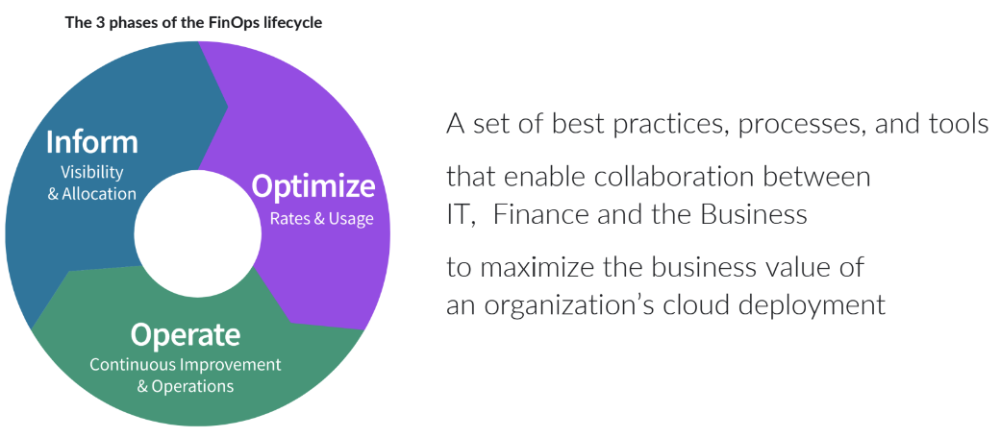
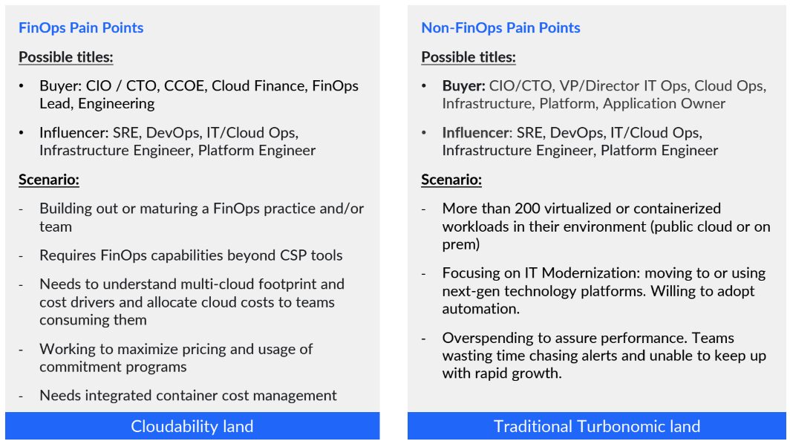
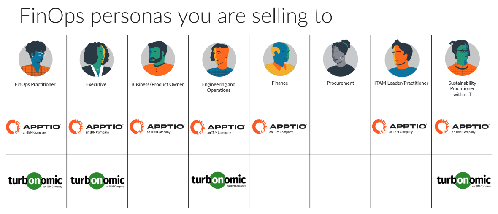
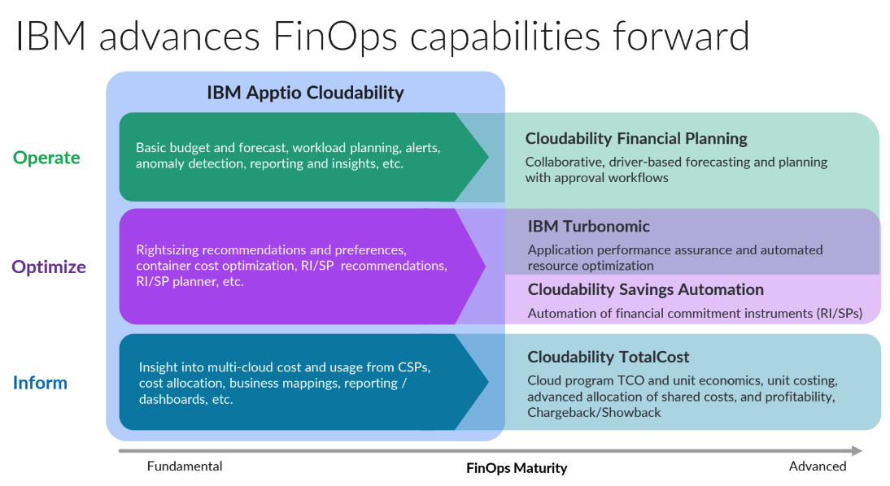
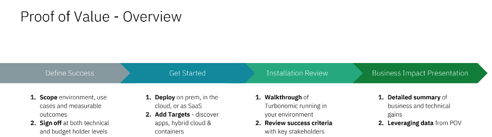

import {Link} from 'gatsby';
import FileLink from '../../../components/FileLink';

## Contacts
| WW contact | Name |
| --- | --- |
| **Customer Success Practice Leaders** | Hollis Chui, Meghan Johel |
| **Technology Expert Labs Practice Leaders:** | Saumil (Sam) Patel |

## Scope
FinOps (financial operations) is a cultural practice to promote a shared responsibility to manage an organization's OpEx (operational expense). 

From the FinOps Foundation, "FinOps is an operational framework and cultural practice which maximizes the business value of cloud, enables timely data-driven decision making, and creates financial accountability through collaboration between engineering, finance, and business teams."

A FinOps practice is based on the following  <a target='_blank' rel='noreferrer noopener' href="https://www.finops.org/framework/principles/">principles</a>:
1. Team need to collaborate
2. Decision are driven by buisness value of cloud
3. Everyone takes ownerhsip for their cloud usage
4. FinOps data should be accessible and timely
5. A centralized team rives FinOps
6. Take advantage of the variable cost model of the cloud

## Why and Why Now
As more and more of our clients start moving workload to the Cloud and use Cloud services from different hyperscalers, their cloud spend will increase year over year.   Currently, over 30% of growing expenditure on cloud is wasted and clients are looking for more transparency into their cloud spend.
Digital leaders are starting to turn to FinOps.  With Cloudability and Turbonomic together, it will help clients on their FinOps journey as they go through the phases (Inform, Optimize, Operate) and mature their practice.

## When should I position Cloudability vs Turbonomic?
If your client is not currently using either Cloudability nor Turbonomic, find out the pain points identified by the sponsor and use the guide below to help decide which to propose.

## Positioning Cloudability to a Turbonomic customer
When the client is interested in advancing FinOps capablities with cost visibility, showback and chargeback, cost allocation and 3rd party cloud vendor costs.

**Target Persona(s)**: CIO, Director of CCOE, Director of CLoud Finance, FinOps Leaders
**Customer Characteristics**:
- We need an introduction to the FinOps or CCOE team by our current champion.
- Need more visibility and reporting into cloud costs to justify spend
- Building out a FinOps practice and/or team.
- $25M+ cloud spend.
- Multi-cloud: Can be AWS, Azure, Google Cloud, IBM Cloud or OCI primary.
- Needs to start with cloud cost transparency; and understand cost allocations (who is doing what).
- Wants to build out planning and forecasting capability.

If your client is in terested, follow the <a target='_blank' rel='noreferrer noopener' href="https://pages.github.ibm.com/csm-playbook/playbook/common/automation/apptio/#csm-rules-of-engagement">CSM rules of engagement</a>: and bring in a Cloudability SME.

## Positioning Turbonomic to a Cloudability customer
TBD

## Apptio and Turbonomic Engagement model

### Engage the client 
**Led by:** Customer Success and/or Technical Seller 
**Audience:** Executive/Sponsor

When meeting with your client, seek answers to the following discovery questions: 

- Who are you talking to and what is their FInOps persona?
- How is their FinOps maturity?
    - Crawl, Walk, Run
- What is their FinOps focus?
    - Reducing waste, cost visilbity, unit economics, optimization
- What is their current FinOps process?
    - Drilling down on how they realize succcess
    - KPIs
    - Key stakeholders

Take the client through IBM'sm FinOps capablities.

**Outcome:**
The **outcome** of this phase is that a sponsor is interested in FinOps and in agreement to run a Proof of Value (POV) where IBM and the customer will work together to define the scope and success criteria.

**Process and assets:**

- IBM FinOps 101 - Apptio Cloudability and Turbonomic Client Facing <a href='https://ibm.seismic.com/Link/Content/DC3c9VpCPVV628HBdD84GP9Jp2bP' target='_blank' rel='noreferrer noopener'>deck</a>
- FinOps Objection Handling <a href='https://ibm.seismic.com/Link/Content/DC2h9j8Hcj6qj8FMVFbV7dQpjRcP' target='_blank' rel='noreferrer noopener'>deck</a>
- Apptio Engagement Model <a href='https://ibm.seismic.com/Link/Content/DC4G7TH9gHW3PGWWm89Qd44P3jM3' target='_blank' rel='noreferrer noopener'>deck</a>
- IBM FinOps Platform (Apptio + Turbo): <a href='https://ibm.seismic.com/Link/Content/DC68RVhJ92mGWGfVmXT9FPgfq9B3' target='_blank' rel='noreferrer noopener'>recording</a>

## Proof of Value (POV) phase
**Led by:** CSM & Technical Sales

Start with a Proof of Value (POV) to help customers see the impact and value of Apptio and/or Turbonomic in their own environment with the identified sponsor and selected use case(s) defining the scope and success criteria.

**Asset:** <a target='_blank' rel='noreferrer noopener' href="https://ibm.seismic.com/Link/Content/DCc29dq8cWbqXGhWmmf982QMpQ8d">Proof of Value process</a>

## Assessment phase
TBD

## Propose, Negotiate ,and Close phase
**Led by:** Technology Expert Labs Seller or Apptio Seller

The purpose of the Propose, Negotiate, and Close is to close a services deal. The IBM Sales team: Digital/Services Seller, Solution Architect/Solution Engineer will present the customer with a Services proposal for Turbonomic based on their budget and requirements.   

Required inputs by CSM: None; however CSM will want to maintain awareness for continued engagement with the client.

## Implement, Learn and Accelerate phases
** Led by:** Technology Expert Labs Delivery, Apptio Services 

**Technology Expert Labs Offerings:** 
- <a target='_blank' rel='noreferrer noopener' href="https://ibm.seismic.com/Link/Content/DCJjJC6JjFCbd8FRVT9R2JHVTTW3">Apptio Services Offerings & Parts</a>
- <a target='_blank' rel='noreferrer noopener' href="https://ibm.seismic.com/Link/Content/DCTRBV4q6TTRR8TQ9bB9VPBb6WMB">TEL Service Offering - Build Turbonomic</a>
- <a target='_blank' rel='noreferrer noopener' href="https://ibm.seismic.com/Link/Content/DCXRhhmJghGJXGfRbJDpJDP8DcF3">TEL Service Offering - Install/Configure Turbonomic</a>
- <a target='_blank' rel='noreferrer noopener' href="https://ibm.seismic.com/Link/Content/DCd8Tc2fmqfQc89DR6c6R8QjjjhG">TEL Service Offering - Perform Turbonomic</a>
- <a target='_blank' rel='noreferrer noopener' href="https://ibm.seismic.com/Link/Content/DCM4V22Jf3qB28FCP9CHfWXg9X43">TEL Service Offering - Expertise Connect</a>
- <a target='_blank' rel='noreferrer noopener' href="https://ibm.seismic.com/Link/Content/DCDW4HDCdQMcC8c2p7cd3cRDVCdj">TEL Service Offering - Essential Management</a>

During the delivery phase, the IBM Technology Expert Labs Delivery team or Apptio Services performs the services as agreed upon in the Propose Negotiate and Close phase.

Required inputs by CSM: None; however CSM may want to shadow/maintain awareness for continued engagement with the client.
