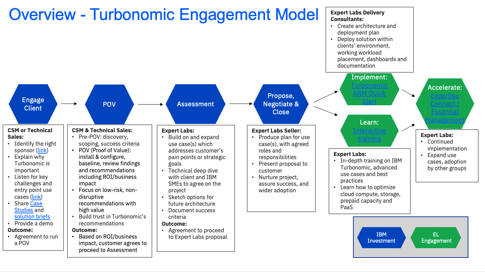
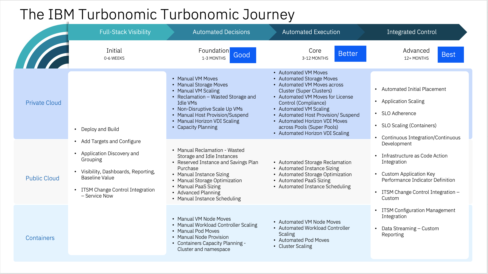

import {Link} from 'gatsby';
import FileLink from '../../../components/FileLink';

## Contacts
| WW contact | Name |
| --- | --- |
| **Customer Success Practice Leaders** | Hollis Chui |
| **Technology Expert Labs Solution Engineering** | Luca Floris, Ricardo Olivieri |
| **Technology Expert Labs Practice Leaders:** | Richard Trickey, Saumil (Sam) Patel |

## Scope
Organizations often face the challenge of balancing the right amount of resources for business applications while limiting as much overallocation as possible. Overallocating application resources can be costly from both a financial and environmental perspective.

Modern applications are often separated by multiple layers of abstraction, making it difficult to understand which underlying physical server, storage, and networking resources are supporting which applications.

**IBM Turbonomic Application Resource Management (ARM)** automatically assures applications get the resources they need to perform, no matter where they run or how they are built. IBM Turbonomic continuously and automatically assures performance by eliminating resource congestion at every level of the application stack, from the business application to the underlying hybrid and multi-cloud environment.

IBM Turbonomic also provides many capabilities as both one solution and as part of integrations beyond it's primary purpose of application resources management. Some of these include: sustainability for greener IT, hybrid cloud migration, and cloud cost management (FinOps). These are just some of the newest capabilities and features of IBM Turbonomic.

After Turbonomic has been deployed, its **stickiness** depends on how far along the customer has progressed on the Turbonomic Journey.  The Journey map below shows the phases of adoption. The further along the customer is on the journey, the stickier the product becomes.

## Turbonomic Engagement model
This diagram shows the Turbonomic Engagement model at a high level. Each section is broken down in detail with links to assets below.

## Engage Client phase
**Led by:** Customer Success and/or Technical Seller 
**Audience:** Executive/Sponsor

Before entering this phase it is necessary to have discussed the positioning of Turbonomic with the account team and Account Technical Leader to ensure that it is part of the overall account plan.

This phase covers the personas to target as well as the ones to avoid. Listen for key challenges and pain points and explain how Turbonomic can address them.

**Outcome:**

The **outcome** of this phase is that a sponsor is interested and in agreement to run a Proof of Value (POV) where IBM and the customer will work together to define the scope and success criteria.

**Process and assets:**

- Account planning should be performed to identify target <a href="https://ibm.seismic.com/Link/Content/DCQ9DbMWc48hJ8fTfWMBfXXgchWV" target='_blank' rel='noreferrer noopener'>personas</a> (and the ones to avoid)
- CSM should create a Success/Growth Plan in Gainsight to track the progress of this potential project. <a target='_blank' rel='noreferrer noopener' href="https://ibm.box.com/s/u0d2z0ia2z5uhvb81577l36gkvspucud">Sample Growth Plan</a>
- CSM should review the <a target='_blank' rel='noreferrer noopener' href="https://ibm.seismic.com/Link/Content/DCJ4BMPWD3Qm8G4Mpqc8jgGqhRJ8">Client presentation role play</a>
- CSM should review the <a target='_blank' rel='noreferrer noopener' href="https://ibm.seismic.com/Link/Content/DCDFX8FBQmJ838TPFhhRXp68cqB3">Objection handling</a> material
- CSM should review the <a target='_blank' rel='noreferrer noopener' href="https://ibm.seismic.com/Link/Content/DCCmhM8Ggj6QXGFM4m87HMB2gBPB">competitive seller enablement</a> material
- CSM should review the <a target='_blank' rel='noreferrer noopener' href="https://ibm.seismic.com/Link/Content/DCJ2bCQ7FPH448fJ6TWjVcmc2MJ3">client presentation and seller enablement decks in the Turbonomic Sales Kit</a>
- CSM should review the Turbonomic demo assets:
    -  <a href="https://techzone.ibm.com/collection/turbonomic-application-resource-management-demo-assets" target='_blank' rel='noreferrer noopener'>Turbonomic Onboarding Demo Asset</a>
    -  <a href="https://techzone.ibm.com/collection/turbonomic-automation-multicloud" target='_blank' rel='noreferrer noopener'>Turbonomic Automation for AWS, Azure and IBM</a>
- Turbonomic Deployment Play Deck for CSMs with links to resources and assets: <a href="https://ibm.box.com/s/spmt63zi5319st794j2d5pl947b3e6sr" target='_blank' rel='noreferrer noopener'>Turbonomic ARM Deployment Play for CSMs</a>

## Proof of Value (POV) phase
**Led by:** CSM & Technical Sales

Start with a Proof of Value (POV) to help customers see the impact and value of Turbonomic in their own environment with the identified sponsor and selected use case(s) defining the scope and success criteria.

**Asset:** <a target='_blank' rel='noreferrer noopener' href="https://ibm.seismic.com/Link/Content/DCc29dq8cWbqXGhWmmf982QMpQ8d">Proof of Value process</a>

After Turbonomic has been installed and targets deployed, Turbonomic starts its analysis to identify problems in the environment and provides actions that can be taken to resolve or avoid these problems.
There are 7 different <a href="https://www.ibm.com/docs/en/tarm/8.8.0?topic=actions-action-types" target='_blank' rel='noreferrer noopener'>Action Types</a>.  As a CSM, start by focusing on the low risk and non-disruptive actions for AWS, Azure or vCenter.
Below is a list of non-disruptive actions to consider.

| Platform | Action | Entity | Category | Example |
| ------ | ------ | ------ | ------ | ------ |
| AWS | Scaling | Volume | Performance | <a href="https://ibm.ent.box.com/s/npht1c7s8pd90ppbwdkcvtnl2kgmvryu" target='_blank' rel='noreferrer noopener'>link</a> |
| AWS | Scaling | Volume | Performance | <a href="https://ibm.ent.box.com/s/o0u0rsswl3t19jqi8mhxqgtchoexbvnd" target='_blank' rel='noreferrer noopener'>link</a> |
| AWS | Scaling | Database: Storage Account | Performance | <a href="https://ibm.ent.box.com/s/amq69oy65mmn0yfjaala84qc3d2junuw" target='_blank' rel='noreferrer noopener'>link</a> |
| Azure | Scaling | Database | Performance | <a href="https://ibm.ent.box.com/s/ohobo799gkg4um9cibzov3qvueccqryx" target='_blank' rel='noreferrer noopener'>link</a> |
| Azure | Scaling | Volume: Managed Ultra SSD | Performance | <a href="https://ibm.ent.box.com/s/1cwxd1nbh40jwmazzkss3vbp1ir8he1v" target='_blank' rel='noreferrer noopener'>link</a> |
| Azure | Scaling | Database | Performance | <a href="https://ibm.ent.box.com/s/dazcr66gqkkpauiscf97ikfkldp5ntp8" target='_blank' rel='noreferrer noopener'>link</a> |
| vCenter | Move | VM | Performance | <a href="https://ibm.ent.box.com/s/l9z5aj4pebv13ncwyqqethzqqmbhgh0j" target='_blank' rel='noreferrer noopener'>link</a> |
| vCenter | Move Storage | VM | Performance | <a href="https://ibm.ent.box.com/s/ekw1jyvae96x99zgmo1lcktutbzm5jjk" target='_blank' rel='noreferrer noopener'>link</a> |
| vCenter | Move | VM: Hot-Add Enabled | Performance | <a href="https://ibm.ent.box.com/s/6gx13ddmpxshqda2wcijm6jj4yp0q0ht" target='_blank' rel='noreferrer noopener'>link</a> |

## Assessment phase
**Led by: Technology Expert Labs Solution Architect/Solution Engineer** 

Required inputs by CSM and/or Technical Sales (from POV):
- Project objectives, scope, requirements and success criteria
- Completed POV and the ROI/business impact outcome

Assessment is performed by Technology Expert Labs after the completion of the Proof of Value (POV).

Purpose of the Assessment Phase is to build and expand on the use case(s) to address the customer's pain points and challenges, while continuing to show the value of Turbonomic, discuss the future architecture and the success criteria.

The **stickiness** of Turbonomic will largely depend on where the customer is on the Turbonomic Journey.  The further along the customer are on the journey, the stickier the product becomes.
The 3 "essentialness test" questions to consider are what happens when Turbonomic is switched off: 1) what breaks 2) who cares 3) what does it cost to fix.
The further right you go on the Turbonomic Journey, the larger the impact that will be seen and increasing Turbonomic stickiness.

* **Foundation**: Good value realized with a good level of stickiness and probability of renewal.
* **Core**: Better value realized with a higher level of stickiness and probability of renewal.
* **Advanced**: Best value realized with stickiness and high probability of renewal

## Propose, Negotiate ,and Close phase
**Led by:** Technology Expert Labs Seller

The purpose of the Propose, Negotiate, and Close is to close a services deal. The IBM Sales team: Digital/Services Seller, Solution Architect/Solution Engineer will present the customer with a Services proposal for Turbonomic based on their budget and requirements.   

Required inputs by CSM: None; however CSM will want to maintain awareness for continued engagement with the client.

## Implement, Learn and Accelerate phases
** Led by:** Technology Expert Labs Delivery

**Technology Expert Labs Offerings:** 
- <a target='_blank' rel='noreferrer noopener' href="https://ibm.seismic.com/Link/Content/DCTRBV4q6TTRR8TQ9bB9VPBb6WMB">Turbonomic ARM Quick Start</a>

- <a target='_blank' rel='noreferrer noopener' href="https://ibm.seismic.com/Link/Content/DCHDHjF2cH3Vc8QQ48PWVXJcQXq3">In-depth enablement with hands-on training</a>

- <a target='_blank' rel='noreferrer noopener' href="https://ibm.seismic.com/Link/Content/DCd8Tc2fmqfQc89DR6c6R8QjjjhG">Technical Account Manager (TAM) services</a>

- <a target='_blank' rel='noreferrer noopener' href="https://ibm.seismic.com/Link/Content/DCXRhhmJghGJXGfRbJDpJDP8DcF3">Velocity Implementation - Remote implementation and configuration focused on Turbonomic v8 with a certified SME</a>

- <a target='_blank' rel='noreferrer noopener' href="https://ibm.seismic.com/Link/Content/DChTBdhh2f8jg8mHCbCTB8FfD683">Expertise Connect/Essential Management</a>

During the delivery phase, the IBM Technology Expert Labs Delivery team performs the services as agreed upon in the Propose Negotiate and Close phase.

Required inputs by CSM: None; however CSM may want to shadow/maintain awareness for continued engagement with the client.
