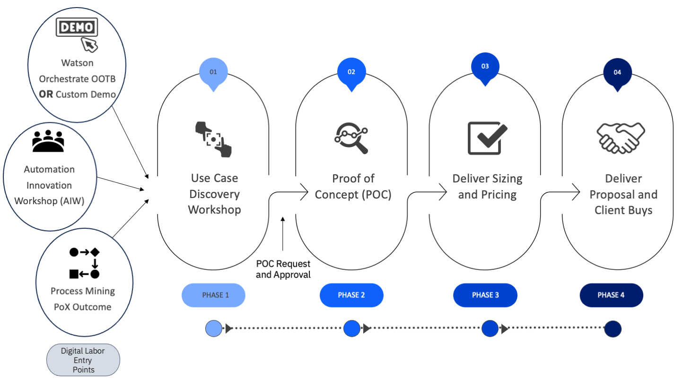

import {Link} from 'gatsby';
import FileLink from '../../../components/FileLink';

## Contacts

| Role | Contact |
| --- | --- |
| **Customer Success Practice Leaders** | Di Lang |
| **Client Engineering Practice Leader:**  | Monika Aggarwal |
| **Technology Expert Labs Product Management:** | Sandeep Sinha |
| **Technology Expert Labs Solution Engineering:** | Gordon Gaenzle |

## Scope
**IBM watsonx Orchestrate** is a software-as-a-service offering that enables enterprise employees to do the meaningful work that they are passionate about and leaves the repetitive tasks to Watson. When you rely on Orchestrate to employ prebuilt skills, you free up time to collaborate and innovate.

Digital Labor enables enterprise employees to get work done without expert knowledge of business processes and applications using watsonx Orchestrate with AI + Automation. Working alongside employees, digital labor can independently execute meaningful parts of complex, end-to-end processes using a range of skills. 

Orchestrate can transform and streamline human resources processes. It will also help existing Business Automation clients to expand **Could Pak for Business Automation** footprints.

## End-to-end Digital Labor journey
- Strategize with ATL/tech sales at the account and involve the Client Engineering team
- Leverage the IBM Technology Pattern: <a target='_blank' rel='noreferrer noopener' href="https://digital-labor.tech-patterns.techzone.ibm.com">Digital Labor Technology Pattern</a>
- Engage Technology Expert Labs (if you don’t know your Technology Expert Labs Seller, you <a target='_blank' rel='noreferrer noopener' href="https://clientresourcelocator.wdc1a.cirrus.ibm.com/">can find them here</a>)

This diagram shows the End-to-end Digital Labor journey. Each section is broken down in <a target='_blank' rel='noreferrer noopener' href="https://digital-labor.tech-patterns.techzone.ibm.com">Digital Labor Technology Pattern</a>.

