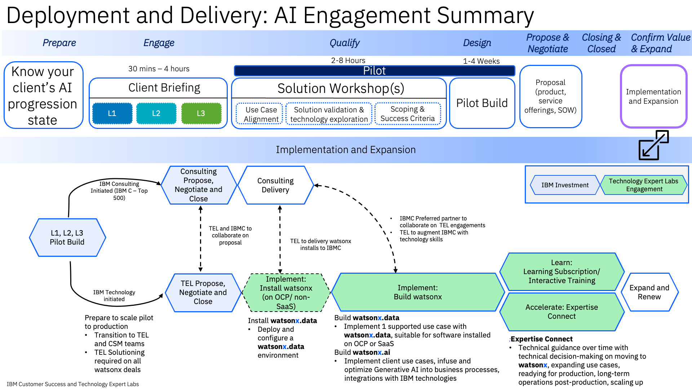

import {Link} from 'gatsby';
import FileLink from '../../../components/FileLink';

## Contacts

| WW contact | Name |
| --- | --- |
| **Customer Success Practice Leaders** | Tal Shahar @Tal Shahar  |
| **Technology Expert Labs (TEL) Delivery Practice Leaders** | Tal Shahar  - WW Data & AI Delivery @Tal Shahar and Charley Beller - WW Solution Engineering Lead @cebeller |
| **Technology Expert Labs (TEL) Product Manager** | Sarah Memon, Associate Product Manager @Sarah Memon |
| **Product Management** | Angela Jamerson, Program Director watsonx.ai @angela.jamerson |

## watsonx Deployments on IBM Cloud

<InlineNotification>
In order to track progress of Deployments on IBM Cloud, you should create a CPP on Cloud Growth Success Plan on the IBM Cloud Relationship.  
The usage threshold that must be met before the entitlement can be marked as Deployed is listed on the <Link to='/deploy/measure-success/#data-and-ai-ibm-cloud-and-the-cs-deployment-scorecard'>measuring success</Link> page. 
</InlineNotification>

## watsonx Deployments on IBM Fusion HCI

IBM is promoting a competitive differentiation with the ability to deploy generative AI models, datalake warehouse and model governance on-premises for clients who consider it undesirable, inefficient, costly, or complex to test or deliver elements of their solution in a public cloud. IBM Fusion HCI is fully supported by the IBM Software Data and AI product team as a platform in which all of these capabilities can be deployed with simplicity, speed and a single point of contact for support. A CSM should engage with the Data and AI Seller and a Storage Seller to develop a plan for client success. Situations in which the client does not wish to use Fusion HCI Lenovo hardware or the standard IBM appliance can be fulfilled with IBM Fusion software and the client's preferred hardware. Please refer to the <Link to='/common/acceleration-plays/watsonx-fusion-play'>Fusion Play Page</Link> 

## Scope

<InlineNotification>
Ensure you read the <Link to='/common/data-ai/csm-data-ai-watsonx-ai'>watsonx.ai product page</Link>  in the CSM Playbook Data & AI Product Section prior to planning your client engagement/briefing. 
</InlineNotification>

In this model, a CSM might be engaged in both pre-sales and post-sales activities.

The prepare, engage, qualify, and design phases are initiated by IBM Consulting Services or IBM Technology. As they progress these phases, Client Engineering conducts a client briefing, solution workshops, and builds a pilot.

In the engagement model, the **Implementation and Expansion phase** is highlighted. It shows how a CSM engages with Client Engineering (CE) and Technology Expert Labs (TEL).  The steps below enable you to prepare, present, and participate to ensure the client starts their watsonx.ai journey to deploy their entitlements.

## Engage/Prospecting phase

**Led by:** IBM Consulting, Sales with CSM engaged 
**Audience:** Executive/Sponsor 

**What are the key value propositions to watsonx.ai?**

A next generation enterprise studio for AI builders to train, validate, tune and deploy both traditional ML and new generative AI capabilities, powered by foundation models.

* Leverage foundation models and generative AI with a fraction of the data, in less time leveraging advanced prompt-tuning capabilities, full SDK and API libraries.

* Bring together AI builders using open-source frameworks and tools for code-based, automated, and visual data science capabilities – all in a secure, trusted studio environment

* Accelerate the full AI model lifecycle with all the tools and runtimes in one place to train, validate, tune and deploy AI models.

Value propositions of watsonx.ai:

* A proven, trusted enterprise studio that brings together Machine Learning and Generative AI for builders.

* Combine the power of predictive, prescriptive and generate AI in a single integrated studio to optimize the AI lifecycle.

* Empower all users including coders and non-coders to use open source and visual modeling tools on a unified studio.

* Leverage existing cloud and data investments and avoid lock-in with flexible deployment.

* Connect to and analyze data across the business, no matter where it resides.

* Operationalize AI with an integrated environment across any cloud.

* Accelerate and scale your business using next-gen foundation models.

**Process:** To have a meaningful discussion with a client about watsonx.ai,  follow the steps defined here, which provide background information and a simple process to articulate a compelling POV to start to investigate, plan, and deploy wastsonx.ai.

Suggested watsonx expansion areas for pre-existing entitlements.

**Prepare:**

| Task | Role |
| --- | --- |
| **Review** the <a href='https://ibm.box.com/s/dujpmyvxqwo3tp8mqfixv8odnt8zp3at' target='_blank' rel='noreferrer noopener'>watsonx expansion plays (Noted Above)</a> | CSM|
| <a href='https://ibm.seismic.com/Link/Content/DCPCWDFbJDJbc8hFBc63B84WRXb8' target='_blank' rel='noreferrer noopener'> Identify TEL Seller</a> to work with | CSM |
| Assess Client's Progression on their <a href='https://ibm.seismic.com/Link/Content/DCQpX624hq2BWGFF78JjMQcGGj8P#/?anchorId=1f484bea-8698-46f4-835a-a8f763e0e2de' target='_blank' rel='noreferrer noopener'>AI Journey</a> | CSM/CE/TEL |
| Review the <a href='https://ibm.seismic.com/Link/Content/DCDJRD4Xh4J73GqMTF6P4Cq3Q8Q3' target='_blank' rel='noreferrer noopener'>watsonx.ai one page prospecting guide</a> | CSM |
| Review the <a href='https://ibm.seismic.com/Link/Content/DCCQmjCjdTqM6GHBPGXWP3FhqbRP' target='_blank' rel='noreferrer noopener'>wastsonx.ai elevator pitch</a> | CSM |
| **NEW - Review** IBM Consulting's inventory of Gen AI Use Cases <a href='https://airtable.com/appg5Wx9i06By0VIG/shrLzEduR2i05fW2L/tblxYqepDMgBuTFmq' target='_blank' rel='noreferrer noopener'>Gen AI Use Cases</a>| CSM/TEL |
| Review the watsonx.ai <a href='https://pages.github.ibm.com/solution-architectures/generative-ai-ref-arch' target='_blank' rel='noreferrer noopener'>Reference Architecture</a> | CSM/CE/TEL |
| Review the watsonx.ai <a href='https://ibm.seismic.com/Link/Content/DCPCHbHgX2GRR8cW4T8HVFBW6QcG' target='_blank' rel='noreferrer noopener'>Prospecting Kit</a> | CSM/CE/TEL |
| Create a Success/Growth Plan in Gainsight to track the progress of this potential project. <a href='https://ibm.box.com/s/bbfl9whxvhj6al8mok5ke7aqtd947pe9' target='_blank' rel='noreferrer noopener'>watsonx.ai Sample Growth Plan</a>. | CSM |

**NEW** We have been collaborating with tech sales and as such they have generated a website that has a collection of use cases, architectural patterns, and more.  Below are links to very specific patterns that apply to watsonx.data  that will help you in your conversations with clients. 

| Generative AI Subjects dependant upon use case | Role |
| ---- | ---- |
| <a target='_blank' rel='noreferrer noopener' href='https://pages.github.ibm.com/solution-architectures/generative-ai-ref-arch/patterns/rag/'>Retrieval Augmented Generation</a>| CSM  |
| <a target='_blank' rel='noreferrer noopener' href='https://pages.github.ibm.com/solution-architectures/generative-ai-ref-arch//'>GenAI Reference Architecture Introduction</a> | CSM  |
| <a target='_blank' rel='noreferrer noopener' href='https://pages.github.ibm.com/solution-architectures/generative-ai-ref-arch/patterns/rag/generative-search/'>Generative Search</a> |   CSM   |
| <a target='_blank' rel='noreferrer noopener' href='https://pages.github.ibm.com/solution-architectures/generative-ai-ref-arch/patterns/rag/conversation-with-agent-assist/'>Conversation with Agent Assist</a> | CSM  |
| <a target='_blank' rel='noreferrer noopener' href='https://pages.github.ibm.com/solution-architectures/generative-ai-ref-arch/patterns/mrkl/'>Modular Reasoning, Knowledge, and Language (MRKL)</a> | CSM  |
| <a target='_blank' rel='noreferrer noopener' href='https://pages.github.ibm.com/solution-architectures/generative-ai-ref-arch/patterns/summarization/'>Document Summarization</a> | CSM  |
| **NEW** <a target='_blank' rel='noreferrer noopener' href='https://w3.ibm.com/tools/cogarch/architectures/Social/arch_xY-BeVuFD'>Cognitive Architect Gen AI (IBM Login req'd)</a> | CSM/TEL |

**Present:**

| Task | Role |
| --- | --- |
| Work with sales or IBM Consulting to build and present an <a href='https://ibm.seismic.com/Link/Content/DCdbfTqG2qMHVGQXmQ3qGT6BhjGV' target='_blank' rel='noreferrer noopener'> executive briefing</a> to gain approval for a watsonx.ai to proceed to a complete POV and Demo session. | CSM |
| Review the <a href='https://ec.yourlearning.ibm.com/w3/event/10358493' target='_blank' rel='noreferrer noopener'>watsonx.ai Tech Preview recording</a> of the client POV material. (additional supporting material) | CSM |
| Review the latest material in <a href='https://ibm.seismic.com/Link/Content/DCJH7MbqmMBmG8MPFjm2jWWfjgbP' target='_blank' rel='noreferrer noopener'> Seismic</a> on watsonx.ai. (additional supporting material) | CSM |

**Outcome**

The **outcome** of this phase:
     A sponsor is interested and agrees to work with IBM to further define the appropriate use case and strategy for watsonx.ai, and define the scope and success criteria.

## Qualify (client briefing)

<InlineNotification>
Be sure to contact Client Engineering to see if they wish to lead the briefing.

Go to the <a href='https://w3.ibm.com/w3publisher/client-engineering/engage/engagement-instructions' target='_blank' rel='noreferrer noopener'>engagement instructions</a> to understand how to request CE to engage with you on this opportunity.

*You will need Expert Labs or a Tech Seller to create an opportunity number in ISC for you to reference in your request for CE.*
</InlineNotification>

**Led by:** Tech Sales, CSM, TEL Seller, ATL 
**Supporting roles:** Technology Expert Labs Solution Architect/Solution Engineer  

The focus of the briefing is to provide the client with a relevant and targeted POV on watsonx.ai and to demonstrate technical capabilities. Through an initial executive briefing above now you want to provide a deeper perspective and demonstrate the capabilities of watsonx.data to a larger audience.

**Prepare:**

| Task | Role |
| --- | --- |
| Review and participate in the <a href='http://watsonx.ai' target='_blank' rel='noreferrer noopener'> watsonx.ai</a> Tech Preview Program. Clients can co-create a proof-of-value application leveraging foundation models. This 2-4 week program is guided by IBM Client Engineering at no cost to the client. Space in the program is limited. If you have a client that is interested, <a href='https://ibm.biz/watsonx-ai-preview' target='_blank' rel='noreferrer noopener'>register them here</a>. | CSM |
| Complete or participate in the The Generative AI Series (ongoing). The goal of this series is to help IBMers understand what generative AI is and how to have conversations with customers about it.  <a href='https://ec.yourlearning.ibm.com/w3/series/10346620?layout=grid' target='_blank' rel='noreferrer noopener'>Enroll here</a>  | CSM |
| Review the <a href='https://ibm.seismic.com/Link/Content/DCdbfTqG2qMHVGQXmQ3qGT6BhjGV' target='_blank' rel='noreferrer noopener'> Client Presentation for watsonx.ai</a> | CSM, CE, TEL |
| **UPDATED** Review the Technology Expert Labs Service Offerings for watsonx.ai on the <a href='http://ibm.biz/watsonx-offerings' target='_blank' rel='noreferrer noopener'>Watsonx Offerings</a> | CSM, CE, TEL |
| Foundation Models <a href='https://foundation-models.tech-patterns.techzone.ibm.com/' target='_blank' rel='noreferrer noopener'>Client Engineering Patterns and Assets</a> | CSM, CE, TEL |
| **NEW** <a target='_blank' rel='noreferrer noopener' href='https://w3.ibm.com/tools/cogarch/architectures/Social/arch_xY-BeVuFD'>Cognitive Architect Gen AI (IBM Login req'd)</a> | CSM/TEL |

**Leverage Use Case and References from Client Engineering with the STARS Tool**

For additional use cases and reference-ability; access and understand the STARS Program.

STARS Overview [here](https://w3.ibm.com/services/lighthouse/spaces/view/stars/overview) 
STARS watsonx engagement reports [here ](https://w3.ibm.com/services/lighthouse/spaces/view/stars/stars-engagement-reports) 
STARS general engagement report [here](https://w3.ibm.com/services/lighthouse/spaces/view/stars/general-engagement-reports) 

**Present/demo:**

**If Client Engineering does not wish to lead, CSM/TEL Sellers to present and demo the watsonx.ai POV material.**

* CSM/TEL Sellers to present the watsonx.ai POV material and demonstrate capabilities of wastonx.ai. Refer to the <a href='https://ibm.seismic.com/Link/Content/DCJH7MbqmMBmG8MPFjm2jWWfjgbP' target='_blank' rel='noreferrer noopener'>watsonx.ai Sales Kit </a> and review <a href='https://ibm.seismic.com/Link/Content/DCQpX624hq2BWGFF78JjMQcGGj8P' target='_blank' rel='noreferrer noopener'>Generative AI</a>

* If you come across **challenges or objections** from the client you can post questions to these Slack Channels for watsonx.ai: <a href='https://ibm-analytics.slack.com/archives/C057G8L357W' target='_blank' rel='noreferrer noopener'>#watsonx-ai-enablement</a>

**Outcome**

The **outcome** of the briefing is to present the watsonx.ai POV and to engage the client to ensure they wish to proceed with a PoX (with Client Engineering) and/or a POX, MVP or actual deployment.

## watsonx.ai scoping, sizing and implementation considerations

The current engagement model above highlights that Sales, Techsales, Client Engineering should be capturing use case, model assessment and sizing data.  However, as a CSM or TEL Service Seller you want to ensure that all data is captured to have a successful deployment strategy.

**Deployment steps to focus on and ensure that the analysis and planning has been done:**

| Deployment steps | |
| --- | --- |
| **Validate or understand** the use case that was captured during the sales cycle or CE workshops   | **If no current use case exists,**  request a TEL Solution Engineer to <a href='https://ibm.biz/grow-my-deal' target='_blank' rel='noreferrer noopener'>assist in a Use Case Discovery Workshop</a>   |
| **Review existing workload/model assessment** that should have been captured by TechSales, Client Engineering, or Sales   |**If there is no existing workload/model assessment**, then align use case to workload type. <a href='https://ibm.biz/grow-my-deal' target='_blank' rel='noreferrer noopener'>Request a TEL SE</a>   |
| **Validation of sizing** from Sales team or the Solution Engineer will validate the sizing and or recommend the proper sizing configuration based on the entitlements.   |**If no sizing information is available** for the entitlement, refer to the watsonx.ai <a href='https://ibm.seismic.com/Link/Content/DC2hQWQHhF4678cMqghMQqPq94CP' target='_blank' rel='noreferrer noopener'>T-shirt sizing</a>  
| **Proper sizing and workload assessment** (driven by an agreed upon use case) will dictate deployment strategy   | **If this is to be a SaaS Deployment of watsonx.data**  **Request** the provisioning documentation for SQA from the sales team.   **Understand how to onboard** a client to IBM Cloud <a href='https://ibm.ent.box.com/s/vt5bhdeh8pq65j20wlez3f0b5ias0m0p' target='_blank' rel='noreferrer noopener'>here</a>  |
| **Review** the implementation offerings from TEL for watsonx.ai <a href='https://ibm.seismic.com/app?ContentId=bd997837-2369-4008-91be-523cc9c4e349#/doccenter/861ea1fd-99e0-44d7-9135-85412e5c28d1/doc/%252Fdd3359e5f7-a856-a91b-7688-41024b2ac637%252FdfNTY4NmVhOWItY2RkNS04ZWY3LTZkNzItZTQwZjczMWUyMjk1%252CPT0%253D%252CRGF0YSBhbmQgQUk%253D%252FdfNDRmODBlMzMtY2ViMC0zMDI1LTVhNDEtNzg2OTg4MWVmZDBl%252CPT0%253D%252Cd2F0c29ueC5haQ%253D%253D%252FdfOTRiYmU4NTQtNWY4NC03Y2QyLWZjYWUtOGIxYmFmZjkyZThk%252CPT0%253D%252CU2VsbGVyIGVuYWJsZW1lbnQ%253D%252Flfb18a5500-ebb8-481b-9ab4-5daff00ecf53/grid/?anchorId=9a4cdf02-9923-43c0-9e71-7f6e3814f5f0' target='_blank' rel='noreferrer noopener'>here</a>  | |

| Generative AI Use Case Sources | |
| --- | --- |
| Review the Library of [AI Use Cases by Industry](https://airtable.com/appg5Wx9i06By0VIG/shrLzEduR2i05fW2L/tblxYqepDMgBuTFmq) | CSM |
| Research watsonx Use Cases in [Lighthouse](https://w3.ibm.com/services/lighthouse/spotlight/all-content?q=watsonx%20use%20cas[…]F31%2F2021-10%2F31%2F2023&tags=&meta_tags=&useQuickFilters=true)    | CSM |
| Research Use Cases in IBM IBV[IBM Institute Business Value](https://www.ibm.com/thought-leadership/institute-business-value/en-us/technology/generative-ai) | CSM |

**Solution pattern examples:**

## Propose, Negotiate, and Close phase

**Led by:** Technology Expert Labs Seller

The purpose of the Propose, Negotiate, and Close phase is to close a services deal. The IBM Technology Expert Labs Sales team: Digital/Services Seller, Solution Architect/Solution Engineer present the customer with a Services proposal for watsonx.data offerings.

There are no required inputs by the CSM; however, as a CSM, you should remain engaged with the client.

**Review** the watsonx.data implementation offerings from TEL for watsonx.ai <a href='http://ibm.biz/watsonx-offerings' target='_blank' rel='noreferrer noopener'>here</a>  

## Implement, Build and Learn Services of Technology Expert Labs

**Led by:** Technology Expert Labs Delivery 

During the Delivery phase, the IBM Technology Expert Labs Delivery team performs the services as agreed upon in the Propose Negotiate, and Close phase.

There are no required inputs by the CSM; however, as a CSM, you should remain engaged with the client.

