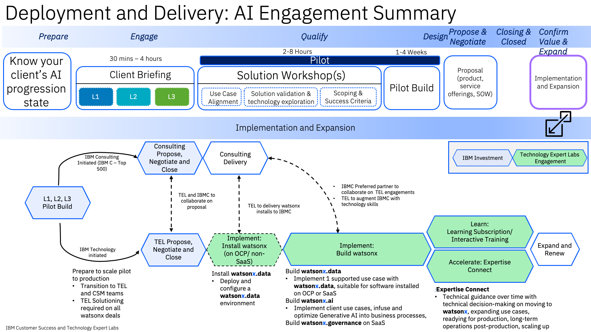
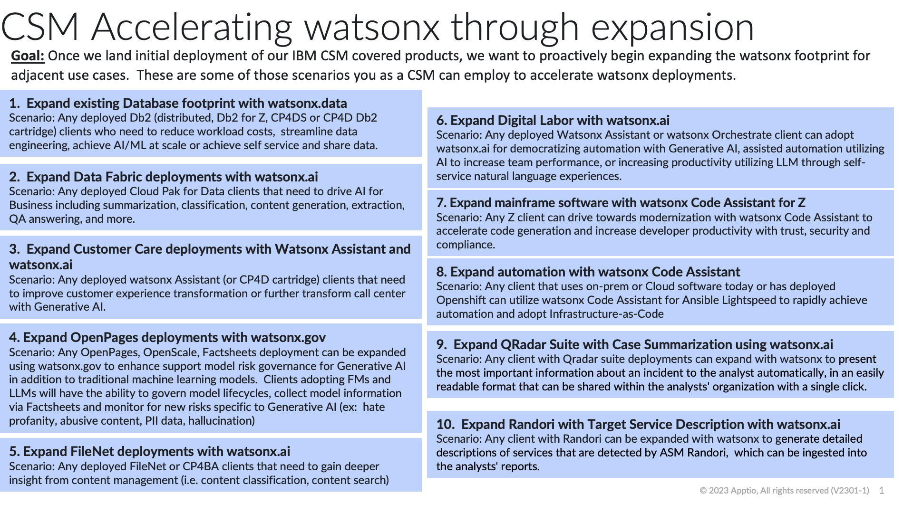
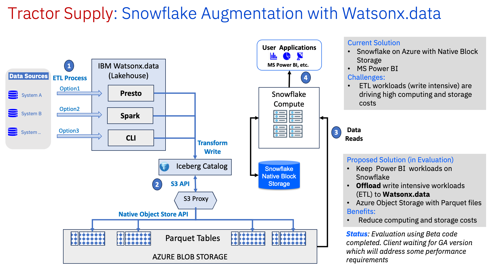
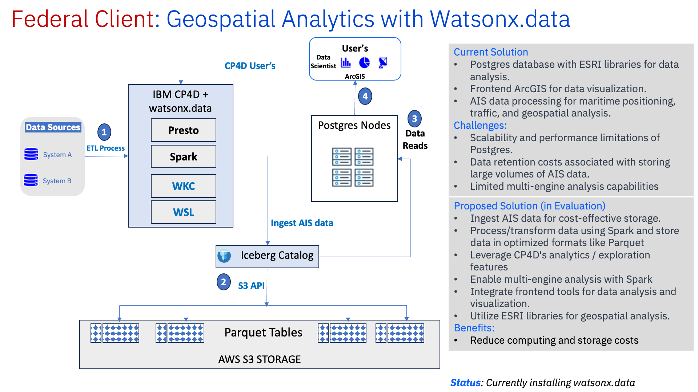
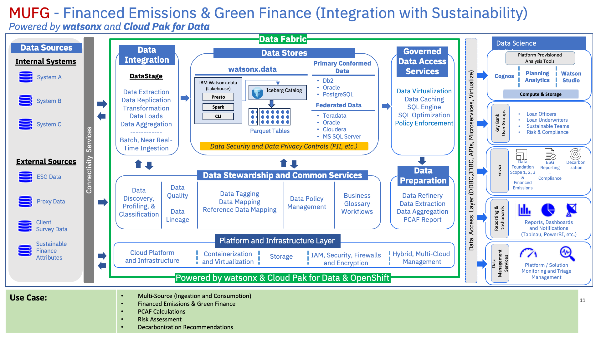

import {Link} from 'gatsby';
import FileLink from '../../../components/FileLink';

## Contacts

| Role | Contact |
| --- | --- |
| **Customer Success Practice Leaders** | Campbell Robertson @ci
| **Technology Expert Labs (TEL) Delivery Practice Leaders** | Suzanne Golledge @Suzanne Golledge |
| **Technology Expert Labs (TEL) Product Manager** | Jennifer Wales @jennifer_wales |
| **Product Management** | Kevin Shen @Kevin.Shen |

## watsonx Deployments on IBM Cloud

<InlineNotification>
To track progress of Deployments on IBM Cloud, you should create a CPP on Cloud Growth Success Plan on the IBM Cloud Relationship.  
The usage threshold that must be met before the entitlement can be marked as Deployed is listed on the <Link to='/deploy/measure-success/#data-and-ai-ibm-cloud-and-the-cs-deployment-scorecard'>measuring success</Link> page. 
</InlineNotification>

## watsonx Deployments on IBM Fusion HCI

IBM is promoting a competitive differentiation with the ability to deploy generative AI models, datalake warehouse and model governance on-premises for clients who consider it undesirable, inefficient, costly, or complex to test or deliver elements of their solution in a public cloud. IBM Fusion HCI is fully supported by the IBM Software Data and AI product team as a platform in which all of these capabilities can be deployed with simplicity, speed and a single point of contact for support. A CSM should engage with the Data and AI Seller and a Storage Seller to develop a plan for client success. Situations in which the client does not wish to use Fusion HCI Lenovo hardware or the standard IBM appliance can be fulfilled with IBM Fusion software and the client's preferred hardware. Please refer to the <Link to='/common/acceleration-plays/watsonx-fusion-play'>Fusion Play Page</Link> 

## Scope

<InlineNotification>
Ensure you read the <Link to='/../common/data-ai/csm-data-ai-watsonx-data'>watsonx.data product page</Link> in the CSM Playbook Data & AI Product Section before planning your client engagement/briefing. 
</InlineNotification>

In this model, a CSM might be engaged in both pre-sales and post-sales activities.

The prepare, engage, qualify, and design phases are initiated by IBM Consulting Services or IBM Technology. As they progress through these phases, Client Engineering conducts a client briefing and solution workshop and builds a pilot.

The chart below shows the deployment and delivery engagement summary:

## Engage/Prospecting Phase

**Led by:**  IBM Consulting, Sales with CSM engaged 
**Audience:** Executive/Sponsor 

**What are the key value propositions to watsonx.data?**

watsonx.data is a next generation Lakehouse built on open source, which reduces or eliminates vendor lock-in cost.  Clients who have entitlements to watsonx.data potentially will be looking to enhance, replace, or augment their Data Warehouse and Data Lake implementation.  The primary focus on a watsonx.data deployment strategy is to provide flexibility in choice of storage compute and data compute to drive down costs and be more cost-performant.

**Process:** To have a meaningful discussion with a client about watsonx.data, follow the steps outlined here, which provide background information and a simple process to articulate a compelling POV to start to investigate,  plan, and deploy wastsonx.data.

**NEW** **watsonx expansion areas for pre-existing entitlements.**

**Prepare:** 

| Task | Role |
| --- | --- |
| **NEW - Read** the incentives blog for watsonx expansion plays for <a href='https://w3.ibm.com/w3publisher/customer-success-and-tech-expert-labs/communications/janine-s-blog/55f89460-71ce-11ee-99b9-aba62eee2d66' target='_blank' rel='noreferrer noopener'>Q423</a> | CSM |
| **NEW - Review** the <a href='https://ibm.box.com/s/dujpmyvxqwo3tp8mqfixv8odnt8zp3at' target='_blank' rel='noreferrer noopener'>watsonx expansion plays (above)</a> | CSM|
| <a href='https://ibm.seismic.com/Link/Content/DCPCWDFbJDJbc8hFBc63B84WRXb8' target='_blank' rel='noreferrer noopener'> Identify TEL Seller</a> to work with | CSM |
| Review the <a href='https://ibm.seismic.com/Link/Content/DCDmmRJDR3cBG8qHqHPdRmg8mX8j' target='_blank' rel='noreferrer noopener'>watsonx.data one page prospecting guide</a> | CSM |
| Review Client conversation guides: [Data Management - IBM watsonx.data Prospecting Guide](https://ibm.seismic.com/Link/Content/DCDhPV3gm4TXbGFJ9XFbFdmcXMDj) | CSM |
| **NEW - Review** the Tech-Sales Generative AI <a href='https://pages.github.ibm.com/technical-sales/generative-ai-ref-arch/' target='_blank' rel='noreferrer noopener'>Architectural Patterns</a> | CSM/CE/TEL |
| Review the [Lakehouse Architecture and Key Technical Themes Deck](https://ibm.box.com/s/97vj0pudfxya28k6q4v7oum2nfqjmobh) | CSM/CE/TEL |
| Create a Success/Growth Plan in Gainsight to track the progress of this potential project. [watsonx.data Sample Growth Plan.](https://ibm.ent.box.com/notes/1243179622382) | CSM |

**NEW** Tech sales has generated a collection of use cases, architectural patterns, and more.  Below are links to very specific patterns that apply to watsonx.data that will help you in your conversations with clients. 

| Task | Role |                                                                     
|---- | ---- |
|[Data Lakehouse](https://pages.github.ibm.com/technical-sales/generative-ai-ref-arch/patterns/data-lakehouse/)   | CSM  |
|[The IBM Generative AI Architecture](https://pages.github.ibm.com/technical-sales/generative-ai-ref-arch/)|   CSM   |

Pursue the following watsonx.data use cases:  
-**AI/ML at scale:** Build, train, tune, deploy and monitor trusted AI/ML models for mission critical workloads with data in watsonx.data and ensure compliance with lineage and reproducibility of data used for AI. 
-**Real-time analytics and business intelligence:** Combine data from existing sources with new data in watsonx.data to unlock new, faster insights without the cost and complexity of duplicating and moving data across different environments. 
-**Streamline data engineering:** Reduce data pipelines, simplify data transformation, and enrich data for consumption using SQL, Python, or an AI-infused conversational interface. 
-**Share data responsibly:** Enable self-service access for more users to more data while ensuring security and compliance with centralized governance and local automated policy enforcement. 

**Present:** 

| Task | Role |
| --- | --- |
| Send to client the <a href='https://www.ibm.com/downloads/cas/4Z1YXEBO' target='_blank' rel='noreferrer noopener'>watsonx.data Solution Brief</a> | CSM |
| Work with sales or IBM Consulting to build and  present an <a href='https://ibm.box.com/s/ny4ivbx0y89ouzmrf6yno8w689cu0mxo' target='_blank' rel='noreferrer noopener'>executive briefing</a> to gain approval for a watsonx.data to proceed to a complete POV and Demo session | CSM |
| Review the <a href='https://ibm.seismic.com/Link/Content/DCqcbD9HD73gCGFDFWDdRcfc8cFB' target='_blank' rel='noreferrer noopener'>watsonx.data recording</a> of the client POV Material (additional supporting material) | CSM |
| Review the latest material in <a href='https://ibm.seismic.com/Link/Content/DCbbPfP64CX3RG4CJPH7bH8XjGBP' target='_blank' rel='noreferrer noopener'>Seismic</a> on watsonx.data (additional supporting material) | CSM |

**Outcome:** 

The **outcome** of this phase:  
  A sponsor is interested and agrees to work with IBM to further define the appropriate use case and strategy for watsonx.data, and to define the scope and success criteria.   

## Qualify (client briefing)

<InlineNotification>
Be sure to contact Client Engineering to see if they want to lead the briefing.

Go to the <a href='https://w3.ibm.com/w3publisher/client-engineering/engage/engagement-instructions' target='_blank' rel='noreferrer noopener'>engagement instructions</a> to understand how to request CE to engage with you on this opportunity.

*You will need Expert Labs or a Tech Seller to create an opportunity number in ISC for you to reference in your request for CE.*
</InlineNotification>

**Led by:** Tech Sales, CSM, TEL Seller, ATL 
**Supporting roles:** Technology Expert Labs Solution Architect/Solution Engineer

The focus of the briefing is to provide the client with a relevant and targeted POV on watsonx.data and to demonstrate technical capabilities.  After an initial executive briefing, you now want to provide a deeper perspective and demonstrate the capabilities of watsonx.data to a larger audience.

**Prepare:**

| Task | Role |
| --- | --- |
| Listen and review the watsonx.data <a href='https://ibm.box.com/s/e1aleydid7roe5faedu78vrke700dpjn' target='_blank' rel='noreferrer noopener'>Community of Practice Session Link</a> | CSM |
| Review the Technology Expert Labs  [watsonx service offerings](http://ibm.biz/watsonx-offerings) | CSM, CE, TEL |
| Review the <a href='https://lakehouse.tech-patterns.techzone.ibm.com/' target='_blank' rel='noreferrer noopener'>Client Engineering Patterns and Assets</a> | CSM, CE, TEL |
| Learn and demonstrate the overall value of watsonx.data provided Client Engineering is not already engaged by using the watsonx.data demo and lab material and environment:   - Techzone reservation - <a href='http://ibm.biz/wxd-techzone' target='_blank' rel='noreferrer noopener'>ibm.biz/wxd-techzone</a>   - Lab Setup - <a href='http://ibm.biz/wxd-setup' target='_blank' rel='noreferrer noopener'>ibm.biz/wxd-setup</a>   - Lab Instructions - <a href='http://ibm.biz/wxd-lab' target='_blank' rel='noreferrer noopener'>ibm.biz/wxd-lab</a> | CSM |
|**UPDATED** Review the  <a href='https://ibm.seismic.com/Link/Content/DCdJJgXcXcjQMGFF6g8X46hhW4X3' target='_blank' rel='noreferrer noopener'>implementation offerings</a> from TEL for watsonx.data  | CSM |

**Present/Demo:**

| Task | Role |
| --- | --- |
| Present the watsonx.data POV material and to demonstrate capablities of wastonx.data if Client Engineering does not want to lead. Refer to the <a href='https://ibm.seismic.com/Link/Content/DCbbPfP64CX3RG4CJPH7bH8XjGBP' target='_blank' rel='noreferrer noopener'>watsonx.data Sales Kit</a> and review <a href='https://ibm.seismic.com/Link/Content/DCQpX624hq2BWGFF78JjMQcGGj8P' target='_blank' rel='noreferrer noopener'>Generative AI Seismic</a> | CSM, TEL Sellers |
| Post questions to these Slack Channels for watsonx.data if you come across **challenges or objections** from the client  - <a href='https://ibm-technology-sales.slack.com/archives/C04TPNQUEP8' target='_blank' rel='noreferrer noopener'>ibm-watsonx-data-lakehouse-feedback</a>   - watsonx.data PUBLIC INTERNAL TO IBM channel for IBMers to provide feedback on watsonx.data product and related items | CSM |

**Outcome:**

The **outcome** of the briefing is to present the watsonx.data POV and to engage the client to ensure they wish to proceed with a PoX (with Client Engineering), and/or a Pilot, or an actual deployment.

## watsonx.data scoping, sizing and implementation considerations

The current engagement model highlights that Sales, Tech Sales, and Client Engineering should be capturing use case, workload assessment, and sizing data.  However, as a CSM or TEL Service Seller you want to ensure that all data is captured to have a successful deployment strategy.

**Deployment steps to focus on and ensure that the analysis and planning has been done:**

| Deployment steps | |
| --- | --- |
| **Validate** or understand the use case that was captured during the sales cycle or CE workshops. | **If no current Use Case exists, engage** a TEL Solution Engineer who can assist with a workshop (IBM Invest). <a href='https://ibm.biz/grow-my-deal' target='_blank' rel='noreferrer noopener'>Request a TEL SE </a> |
| **Review** existing Workload Assessment that should have been captured by Tech-Sales, Client Engineering, or Sales. | **If no existing workload assessment, align** use case to workload type and assessment. <a href='https://ibm.biz/grow-my-deal' target='_blank' rel='noreferrer noopener'>Request a TEL SE.</a> |
| **Validation of sizing** from Sales team or the Solution Engineer will validate the sizing and or recommend the proper sizing configuration based on the entitlements. | **If sizing information is not available, refer** to the watsonx.data sizing tools: <a href='https://app.ibmsalesconfigurator.com/#/zen/home' target='_blank' rel='noreferrer noopener'> Sales Configurator link</a> and the <a href ='https://ibm.seismic.com/Link/Content/DC4QGj6Q4Bjm487X6jp6dqm2QGqd' target='_blank' rel='noreferrer noopener'>watsonx.data T-Shirt Sizing</a> |
| **Proper sizing and workload assessment** (driven by a agreed upon use case) will dictate deployment strategy | **If this is to be a SaaS deployment of watsonx.data**  **Request** the provisioning documentation for SQA from the sales team.  **Understand how to onboard** a client to IBM Cloud <a href='https://ibm.ent.box.com/s/vt5bhdeh8pq65j20wlez3f0b5ias0m0p' target='_blank' rel='noreferrer noopener'>here</a> | 
| **Review** the watsonx.data implementation offerings from TEL for watsonx.data <a href='http://ibm.biz/watsonx-offerings' target='_blank' rel='noreferrer noopener'>here</a> | |

### watsonx.data use case pattern examples

**Leverage Use Case and References from Client Engineering with the STARS Tool**

For additional use cases and reference-ability; access and understand the STARS Program.

STARS Overview [here](https://w3.ibm.com/services/lighthouse/spaces/view/stars/overview) 
STARS watsonx engagement reports [here ](https://w3.ibm.com/services/lighthouse/spaces/view/stars/stars-engagement-reports) 
STARS general engagement report [here](https://w3.ibm.com/services/lighthouse/spaces/view/stars/general-engagement-reports) 

## Propose, Negotiate, and Close phase

**Led by:** Technology Expert Labs Seller

The purpose of the Propose, Negotiate, and Close phase is to close a services deal. The IBM Technology Expert Labs Sales team: Digital/Services Seller, Solution Architect/Solution Engineer presents the customer with a Services proposal for watsonx.data offerings.

There are no required inputs by the CSM; however, as a CSM, you should remain engaged with the client. 

## Implement, Build and Learn Services of Technology Expert Labs

**Led by:** Technology Expert Labs Delivery

During the delivery phase, the IBM Technology Expert Labs Delivery team will perform the services as agreed upon in the Propose, Negotiate, and Close phase.

There are no required inputs by the CSM; however, as a CSM, you should remain engaged with the client.
