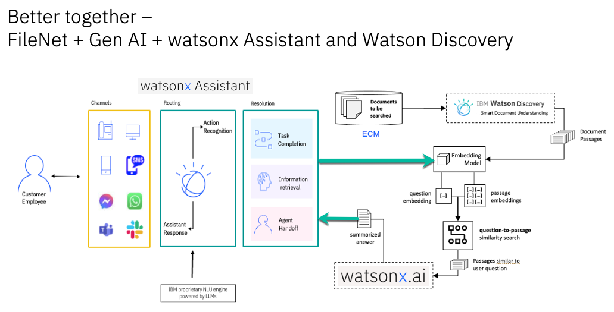
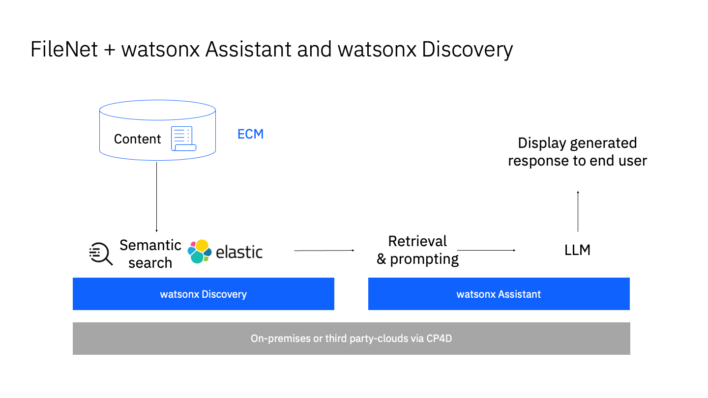

import {Link} from 'gatsby';
import FileLink from '../../../components/FileLink';

## Contacts

| WW contact | Name |
| --- | --- |
| **Customer Success Practice Leaders:**  | Di Lang, Campbell Robertson |
| **EMEA Customer Success Leaders:** | Frank Østergaard, Zdeněk Borůvka |
| **Business Automation Innovations Product Manager:** | Luca Fontinili |

## watsonx Deployments on IBM Cloud

<InlineNotification>
In order to track progress of Deployments on IBM Cloud, you should create a CPP on Cloud Growth Success Plan on the IBM Cloud Relationship.  
The usage threshold that must be met before the entitlement can be marked as Deployed is listed on the <Link to='/deploy/measure-success/#data-and-ai-ibm-cloud-and-the-cs-deployment-scorecard'>measuring success</Link> page. 
</InlineNotification>

## Scope
In this model, a CSM might be engaged in both pre-sales and post-sales activities with major Enterprise Content Management (ECM) accounts. This play focuses on applying enterprise content management techniques to information stored in an ECM system like the IBM FileNet Content Manager. 

Many FileNet deployments have millions or even billions of documents. FileNet provides extensive search capabilities based on existing metadata and textual content associated with each document.

Generative AI has been rapidly evolving, enabling different and more sophisticated interactions with Large Language Models (LLMs) like those available in IBM watsonx.ai. 

ECM provides the foundation for organizing and managing content that AI systems can analyze and process. Generative AI can be used to enhance ECM systems by automating tasks, improving search capabilities, and extracting insights from content.

By utilizing Generative AI interactions among a selected set of enterprise documents, AI applies LLMs to support a more flexible Q&A system that can understand contextual questions with the ability to summarize information from all the buried knowledge.

**Option 1**: Integration between watsonx (Data & AI) platform and the FileNet/ECM solution.

**Option 2**: Leverage watsonx Assistant's <a target='_blank' rel='noreferrer noopener' href="https://www.ibm.com/blog/ibm-watsonx-assistant-driving-generative-ai-innovation-with-conversational-search/">Conversational Search</a> powered by <a target='_blank' rel='noreferrer noopener' href="https://ibm.seismic.com/Link/Content/DCGJXg9XPWF4T8mMfJ8JFj4JhMdP">watsonx Discovery</a> with **watsonx embedded**.

## watsonx + ECM Journey

- Strategize with ATL/tech sales at the account and involve Client Engineering team

- Leverage the existing assets:
  - <a target='_blank' rel='noreferrer noopener' href="https://achan2013.medium.com/approaches-in-using-generative-ai-for-enterprise-content-management-9dbb7a3affe1">Approaches in using Generative AI for Enterprise Content Management</a> by Allen Chan (DE and CTO for Business Automation)
  - Product Management mockups (by Luca Fontinili) 
  - IBM Technology Patterns: <a target='_blank' rel='noreferrer noopener' href="https://foundation-models.tech-patterns.techzone.ibm.com/">Foundation Models Technology Pattern</a> and <a target='_blank' rel='noreferrer noopener' href="https://customer-care.tech-patterns.techzone.ibm.com/">Customer Care Technology Pattern</a>

- Engage Technology Expert Labs: <a target='_blank' rel='noreferrer noopener' href="https://ibm.seismic.com/Link/Content/DCHgM3JQfmVd7GFVd36jTPqhBT2P">Customer Care</a> and <a target='_blank' rel='noreferrer noopener' href="https://ibm.seismic.com/Link/Content/DCdJJgXcXcjQMGFF6g8X46hhW4X3">watsonx</a> (if you don’t know your Technology Expert Labs Seller they <a target='_blank' rel='noreferrer noopener' href="https://clientresourcelocator.wdc1a.cirrus.ibm.com/">can be found here</a>)

