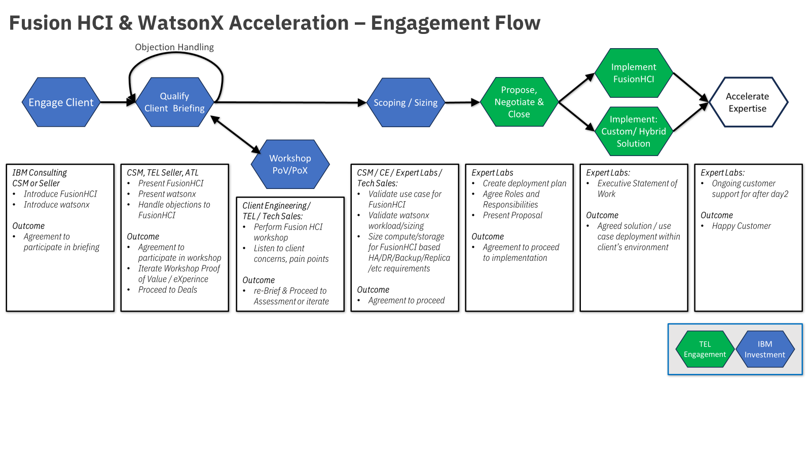

import {Link} from 'gatsby';
import FileLink from '../../../components/FileLink';

## Contacts

| Role | Contact |
| --- | --- |
| **Customer Success Practice Leaders** | Fraser MacIntosh @fraser |
| **Technology Expert Labs (TEL) Delivery Practice Leaders** | Par Hettinga @parhettinga |
| **Fusion Product Management** | Matt Kelm / David Wright |
| **Worldwide Sales Leads** | Bob Kampe / Rob Coventry |
| **Worldwide Tech Sales Leads** | Josh Blumert / Madhav Ponamgi |

---

## Scope

This play deals with the design, provision and integration of Fusion HCI infrastructure to provide compute and storage services for watsonx AI, Data and Governance, particularly focusing on watsonx.Data.

<InlineNotification>
This play will typically run alongside the existing watsonx <Link to='./watsonx-ai-play'>AI</Link>, <Link to='./watsonx-ai-data'>Data </Link> and <Link to='./watsonx-ai-governance'>Governance </Link> plays and is focused on providing the storage, compute and data services requirements of these plays on-prem with Fusion HCI.
</InlineNotification>

In this model, a CSM will typically be engaged in both pre-sales and post-sales activities, you will need to work alongside other specialists in both hardware and software from both IBM and in many cases also Business Partners.

It is essential that the CSM fully understand the clients' business and their requirements for the particular project as building an effective storage and compute infrastructure is far easier and more cost-efficient if it meets requirements from the outset. To this end, the CSM should read and understand the following assets:

| Task | Links |
| --- | --- |
| CSM Playbook Product Pages | <Link to='/common/storage/fusionHCI'>Fusion Hyperconverged (HCI)</Link>   <Link to='/common/storage/fusionSDS'>Fusion as Software</Link> |
| CSM Playbook Accelerator Play | <Link to='/common/acceleration-plays/storage-fusion-play'>Storage Fusion Accelerator play</Link> |
| Sales Kits on Seismic | <Link to='https://ibm.seismic.com/Link/Content/DCqJ2JCd4qdgTGMVcm766c4Gq6Mj'>IBM Storage for Data and AI</Link>   <Link to='https://ibm.seismic.com/Link/Content/DCgFfq4m3dm9MG7BgD3X6qP7dHWd'>IBM Storage Fuision Sales Kit</Link> |
| Fusion Client Decks | <Link to='https://ibm.seismic.com/Link/Content/DCPdbQdBBbTfFGHQCf8CXXXhJ26B'>IBM Storage Fuision Client Deck Level 1 </Link>   <Link to='https://ibm.seismic.com/Link/Content/DCJb9Rh3HF3gBGTVG7dcJ7cVpc8j'>IBM Storage Fuision Client Deck Level 2 </Link> |

NB: The sales kits, in particular the Storage Fusion sales kit, are rich resources and time should be reserved to fully explore their content. Sales kits are continually updated, so re-visit regularly.

The prepare, engage, qualify, and design phases are initiated by IBM Consulting Services or IBM Technology. As they progress through these phases, Client Engineering conducts a client briefing, and solution workshop, and builds a pilot.

The chart below shows the deployment and delivery engagement summary:

---

## Engage/Prospecting Phase

**Led by:**  IBM Consulting, Sales with CSM engaged 
**Audience:** Executive/Sponsor 

**What are the key value propositions of Fusion HCI with watsonx?**

**For the customer:** Using Fusion HCI and Ceph to host unified data services, storage and computing will deliver a simple cost cost-effective way to consume enterprise-grade functionality on what is regarded as de-facto reference hardware platform for WastonX. With Fusion HCI the data services and compute nodes are colocated alongside GPUs for far faster access to data for AI training. In addition, the HCI platform can be extended into software-defined or cloud providers of choice. Fusion builds atop RedHat OpenShift providing additional enterprise-grade services such as high availability, and replication data protection, all built into the product.

**For IBM:** Customers of watsonx.data have existing entitlement to both Fusion Essentials Platform Storage (100TB) and IBM Storage Ceph Data Lakehouse Storage (500TB), this will help build an initial deployment case. Neither Fusion nor Ceph will lock customers into a hardware platform - options to run on HCI, Ready Nodes, Software-defined, cloud or hybrid will enable customers to be confident they will not end up with a dead end in their Fusion HCI investment. Coupling Fusion and Ceph into a watsonx.data deployment will enable customers to grow quickly and easily; to become confident in Fusion and Ceph for their wider compute provision, their storage estate and furthermore to see added value over K8s or RHOS alone.

**Process:** To have a meaningful discussion with a client about Fusion HCI data and compute services for watsonx.data, follow the steps outlined here. This provides a simple process to articulate a compelling POV to start to investigate,  plan, and deploy wastsonx.data utilizing Fusion HCI architecture.

**Prepare:** 

| Task | Role |
| --- | --- |
| Review the <a href='https://pages.github.ibm.com/csm-playbook/playbook/common/acceleration-plays/storage-fusion-play/' target='_blank' rel='noreferrer noopener'>Fusion expansion plays</a> | CSM |
| Identify the <a href='https://ibm.seismic.com/Link/Content/DCPCWDFbJDJbc8hFBc63B84WRXb8' target='_blank' rel='noreferrer noopener'> TEL Seller</a> to work with | CSM |
| Review the <a href='https://ibm.seismic.com/Link/Content/DC4cTMXCpT9p284Qf6jfVpmgpD2V' target='_blank' rel='noreferrer noopener'>Fusion one page prospecting guide</a> | CSM |
| Review the <a href='https://ibm.seismic.com/Link/Content/DCDmmRJDR3cBG8qHqHPdRmg8mX8j' target='_blank' rel='noreferrer noopener'>watsonx.data one page prospecting guide</a> | CSM |
| Revisit the Fusion sales kit for any new assets: [Storage Fusion Sales Kit](https://ibm.seismic.com/Link/Content/DCgFfq4m3dm9MG7BgD3X6qP7dHWd) | CSM |
| Review the <a href='https://ibm.seismic.com/Link/Content/DC7V6DjW8jjcVGcVHJ9fhV843m9G' target='_blank' rel='noreferrer noopener'>IBM Storage for watsonx</a> document | CSM/CE/TEL |
| Create a Success/Growth Plan in Gainsight to track the progress of this potential project. | CSM |

<InlineNotification>
Make sure there is a record in Gainsight from the earliest point possible. Keep the records regularly updated at each point, particularly with watsonx opportunities.
</InlineNotification>

 

**What are the Customer use cases?**

Fusion HCI provides many advantages of standard OpenShift, particularly for the operation of watsonx AI, Data and Governance packages: 

* Reduced Opex
* Simplified management
* Increased reliability
* Remove infrastructure complexity
* Enterprise resiliency for data and applications (HA, DR, Backup, Archive)
* Intelligence for data with a storage data catalog
* Accelerate data access across hybrid multi-cloud

 

**Present:** 

| Task | Role |
| --- | --- |
| Direct the client the solution brief on the <a href='https://www.ibm.com/products/storage-fusion' target='_blank' rel='noreferrer noopener'>IBM Storage Fusion</a> product page | CSM |
| Work with Sales or IBM Consulting to include Fusion HCI into an <a href='https://ibm.ent.box.com/s/ny4ivbx0y89ouzmrf6yno8w689cu0mxo' target='_blank' rel='noreferrer noopener'>executive briefing deck</a> to gain approval for to proceed to a complete POV and Demo session | CSM |
| Update Gainsight with results from the briefing and demo. | CSM |

**Outcome:** 

The **outcome** of this phase:  
  A sponsor is interested and agrees to work with IBM to further define the appropriate use case and strategy for Fusion HCI and watsonx.data, and to define the scope and success criteria.   
 

---

## Qualify (client briefing)

<InlineNotification>
Be sure to contact Client Engineering to see if they want to lead the briefing.

Go to the <a href='https://w3.ibm.com/w3publisher/client-engineering/engage/engagement-instructions' target='_blank' rel='noreferrer noopener'>engagement instructions</a> to understand how to request CE to engage with you on this opportunity.

*You will need Expert Labs or a Tech Seller to create an opportunity number in ISC for you to reference in your request for CE.*
</InlineNotification>

**Led by:** Tech Sales, CSM, TEL Seller, ATL 
**Supporting roles:** Technology Expert Labs Solution Architect/Solution Engineer

The focus of the briefing is to provide the client with a relevant and targeted POV on watsonx.data and to demonstrate the value that can be delivered by Fusion HCI.  After an initial executive briefing, you now want to provide a deeper perspective and demonstrate the capabilities to a larger audience.

**Prepare:**

| Task | Role |
| --- | --- |
| Attend the Storage Community of Practice Q&A sessions pinned in the - [#csm-storage](https://ibm.enterprise.slack.com/archives/C04SZJSGDDG) slack channel | CSM |
| Review the Technology Expert Labs [watsonx service offerings](http://ibm.biz/watsonx-offerings) for Non-SaaS deployments | CSM, CE, TEL |
| Review the <a href='https://lakehouse.tech-patterns.techzone.ibm.com/' target='_blank' rel='noreferrer noopener'>Client Engineering Patterns and Assets</a> | CSM, CE, TEL |
| Learn and demonstrate Fusion from Techzone overview <a href='https://techzone.ibm.com/collection/MOP_Fusion_RW' target='_blank' rel='noreferrer noopener'> Storage Fusion Walkthrough</a> | CSM |
| Understand the additional services offered by Fusion applicable to the customer. Such as Data Catalogue, Backup, Archive, HA, DR, etc. <Link to='https://ibm.seismic.com/Link/Content/DCPdbQdBBbTfFGHQCf8CXXXhJ26B'>Client Deck Level 1 </Link>,  <Link to='https://ibm.seismic.com/Link/Content/DCJb9Rh3HF3gBGTVG7dcJ7cVpc8j'>Client Deck Level 2 </Link> | CSM |
 

**Present/Demo:**

| Task | Role |
| --- | --- |
| Present the watsonx.data POV material and to demonstrate capabilities of wastonx.data if Client Engineering does not want to lead. Refer to the <a href='https://ibm.seismic.com/Link/Content/DCbbPfP64CX3RG4CJPH7bH8XjGBP' target='_blank' rel='noreferrer noopener'>watsonx.data Sales Kit</a> and review <a href='https://ibm.seismic.com/Link/Content/DCQpX624hq2BWGFF78JjMQcGGj8P' target='_blank' rel='noreferrer noopener'>Generative AI Seismic</a> | CSM, TEL Sellers |
| Present the <a href='https://ibm.seismic.com/Link/Content/DC46mqb22j3H38MP7qqjpTBh9bhB' target='_blank' rel='noreferrer noopener'> IBM Storage for watsonx client deck</a> | CSM, TEL Sellers |
| For Fusion HCI related **challenges and objection handling** from the client post questions in    - [#csm-storage](https://ibm.enterprise.slack.com/archives/C04SZJSGDDG) slack channel   - [#storage-fusion-help](https://ibm.enterprise.slack.com/archives/C029ET42U8Y) slack channel   | CSM |
| Update Gainsight with notes/results from this phase. | CSM |

**Outcome:**

The **outcome** of the briefing is to present Fusion HCI POV as the storage and compute platform for watsonx, and to engage the client to ensure they wish to proceed with a PoX (with Client Engineering), and/or a Pilot, or an actual deployment.

---

## Fusion HCI for watsonx scoping, sizing and implementation considerations

The current engagement model highlights that Sales, Tech Sales, and Client Engineering should be capturing use cases, workload assessments, and sizing data.  However, as a CSM or TEL Service Seller you want to ensure that all data is captured to have a successful deployment strategy.

<InlineNotification>
Sales and Tech Sales may not have experience in the delivery of Fusion HCI for the provision of watsonx deployments. This may require additional scoping activities. Make use of your dedicated in Geo and Worldwide CoP resources, if you have any queries or concerns.
</InlineNotification>

**Deployment steps to focus on and ensure that the analysis and planning have been done:**

| Deployment steps | |
| --- | --- |
| **Validate** or understand the use case that was captured during the sales cycle or CE workshops. | **If no current Use Case exists, engage** a TEL Solution Engineer who can assist with a workshop (IBM Invest). <a href='https://ibm.biz/grow-my-deal' target='_blank' rel='noreferrer noopener'>Request a TEL SE </a> |
| **Review** existing Workload Assessment that should have been captured by Tech-Sales, Client Engineering, or Sales. | **If no existing workload assessment, align** use case to workload type and assessment. <a href='https://ibm.biz/grow-my-deal' target='_blank' rel='noreferrer noopener'>Request a TEL SE.</a> |
| **Validation of sizing** from the Sales team or the Solution Engineer will validate the sizing and or recommend the proper sizing configuration based on the entitlements. | **If sizing information is not available, refer** to the watsonx.data sizing tools: <a href='https://app.ibmsalesconfigurator.com/#/zen/home' target='_blank' rel='noreferrer noopener'> Sales Configurator link</a> and the <a href ='https://ibm.seismic.com/Link/Content/DC4QGj6Q4Bjm487X6jp6dqm2QGqd' target='_blank' rel='noreferrer noopener'>watsonx.data T-Shirt Sizing</a> |
| **Proper sizing and workload assessment** will dictate Fusion deployment strategy. There may be a wide variance in required hardware and additional services, through the use of GPU, HA/DR, Replication, Backup, Archive, Data Catalog etc. Once these are finalized, final appliance requiremens can be calculated. | **Sizing tools:**   <a href='https://www.ibm.com/tools/storage-modeller/' target='_blank' rel='noreferrer noopener'>IBM StorM</a>   <a href='https://app.ibmsalesconfigurator.com/#/' target='_blank' rel='noreferrer noopener'>Cloud Pak Sales Configurator</a>   <a href='https://sizer.ocs.ninja/index.html' target='_blank' rel='noreferrer noopener'>Red Hat ODF Sizer</a>   | 
| **Review** the watsonx.data implementation offerings from TEL for watsonx.data <a href='http://ibm.biz/watsonx-offerings' target='_blank' rel='noreferrer noopener'>here</a> | |
| Update Gainsight with results from each of the steps in this deployment phase. | CSM |

**Leverage Use Case and References from Client Engineering with the STARS Tool**

For additional use cases and reference-ability; access and understand the STARS Program.

STARS Overview [here](https://w3.ibm.com/services/lighthouse/spaces/view/stars/overview) 
STARS watsonx engagement reports [here ](https://w3.ibm.com/services/lighthouse/spaces/view/stars/stars-engagement-reports) 
STARS general engagement report [here](https://w3.ibm.com/services/lighthouse/spaces/view/stars/general-engagement-reports) 

---

## Propose, Negotiate, and Close phase

**Led by:** Technology Expert Labs Seller

The purpose of the Propose, Negotiate, and Close phase is to close a services deal. The IBM Technology Expert Labs Sales team: Digital/Services Seller, Solution Architect/Solution Engineer presents the customer with a Services proposal for watsonx.data offerings.

There are no required inputs by the CSM; however, as a CSM, you should remain engaged with the client. 

---

## Implement, Build and Learn Services of Technology Expert Labs

**Led by:** Technology Expert Labs Delivery

During the delivery phase, the IBM Technology Expert Labs Delivery team will perform the services as agreed upon in the Propose, Negotiate, and Close phase.

There are no required inputs by the CSM; however, as a CSM, you should remain engaged with the client.

---

