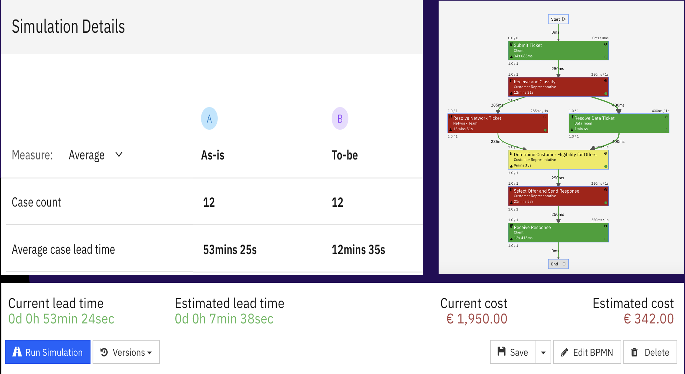
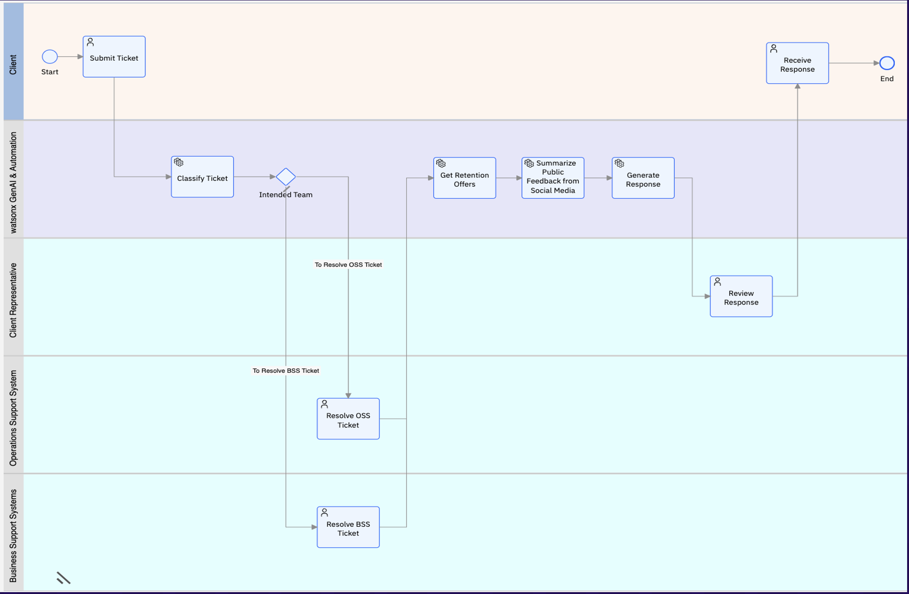
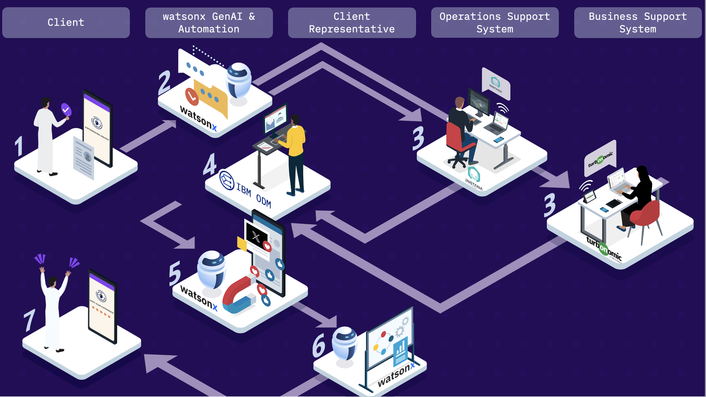
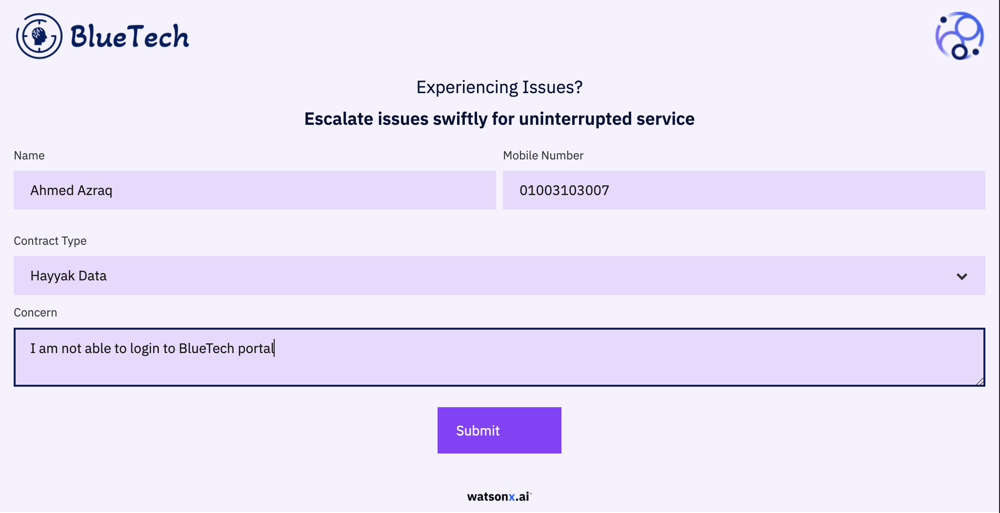
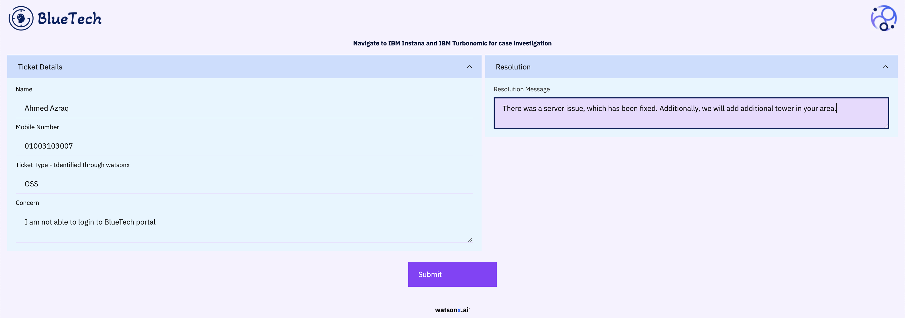
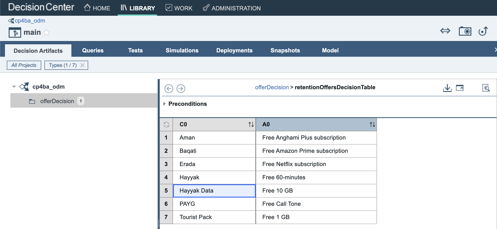
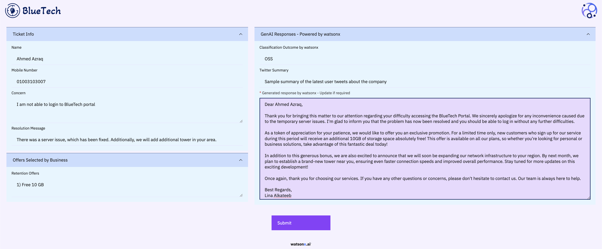
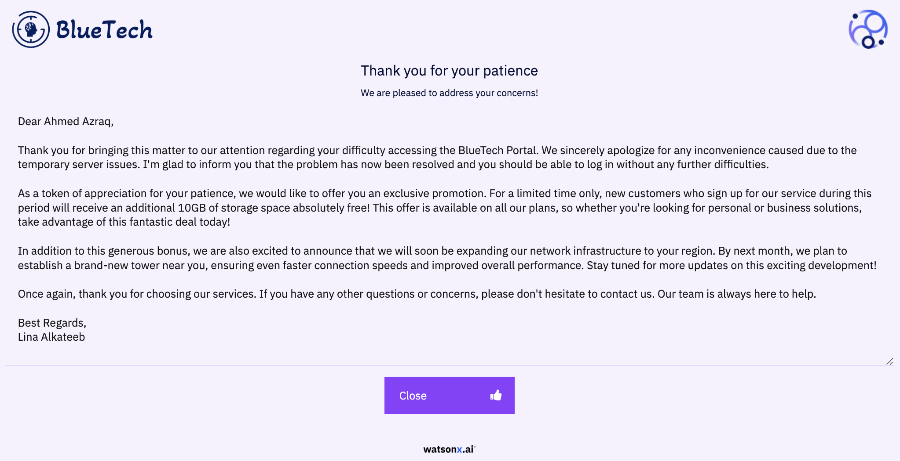
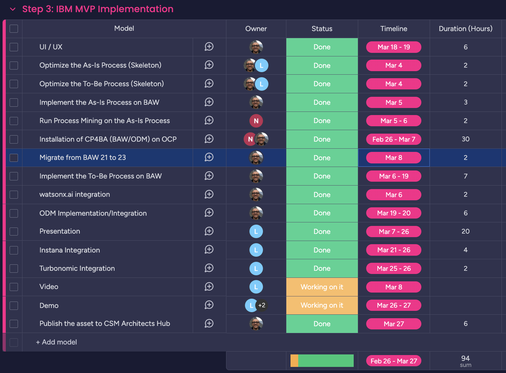

import {Link} from 'gatsby';
import FileLink from '../../../components/FileLink';

## Contacts
| WW contact | Name |
| --- | --- |
| **Customer Success Practice Leaders** | Hollis Chui |
| **MEA Customer Success Team** | Ahmed Azraq (CSM Architect), Lina Al-Khateeb (CSM Architect), Nelly Kamel (CSM Architect), Hany Abdel-Hamid CSM MEA Leader, Anthony Youhana (CSM GLP Leader) |
| **Technology Expert Labs Solution Engineering** | Luca Floris |
| **Technology Expert Labs Practice Leaders:** | Saumil (Sam) Patel |

## Scope
The X-Factor IT Automation play is a cross between Business Processes with watsonx with IT Automation.  The demo asset harnesses the power of the IBM Hybrid Cloud strategy by leveraging the power of watsonx and IBM Cloud Pak for Business Automation in conjunction with Instana, Turbonomic and OpenShift. The asset revolutionizes the optimization of business processes, particularly ticketing in the telecommunications industry, yet, adaptable to various industries. It can be used in a full adoption journey, seamlessly integrating the sales cycle from presales to postsales in one use case. The asset spans domains like core service observability, process mining, business decision-making in realtime, AI-driven actions, governance of AI, and hybrid cloud scale. The asset delivers operational cost optimization, boosting individual productivity, increase of customer retention and satisfaction, and agility and efficiency in business operations.

## Engagement Model
- Work with the ATL, seller and/or tech sales to identify and engage the appropriate client stakeholders.
- Present and demo the usage of IBM watsonx.ai to optimize existing Business Processes in conjunction with Instana and Turbonomic.  
- Review the client's current business processes and assess where watsonx.ai can be leveraged to optimize existing processes. Focus on low risk and high value use cases. 
- Engage Expert Labs Solution Engineering and Seller to highlight the value of Technology Expert Labs and scope a services proposal.
- Technology Expert Labs will focus on implementation, and collaborate with CSMs to explore expansion opportunities. 

## Solution Use Case and Assets

### Revolutionizing Business Processes with watsonx, and IBM Automation
CSM MEA team (**Ahmed Azraq, Lina Al-Khateeb, Nelly Kamel**) created an asset to harness the power of IBM watsonx in combination with the different IBM IT Automation, and Data & AI products to revolutionze the business processes related to ticketing, and the asset can be adopted easily to different other business use cases.

### Technologies used
The following technologies have been used in the asset.

- IBM watsonx.ai
- IBM Cloud Pak for Business Automation
    - IBM Process Mining
    - IBM Business Automation Workflow
    - IBM Operational Decision Manager
- Instana
- Turbonomic
- Red Hat OpenShift

### Presentation
The presentation can be download from this [link](https://github.ibm.com/customersuccess/csm-architects-hub/blob/main/docs/watsonx-assets/resource/csm-mea-asset-revolutionizing-business-processes-watsonx-automation.pptx). Feel free to customize it to your client.

### Demo Recording
Download the video directly from [here](https://ibm.box.com/s/6o4a6yr6uu2gbzn0fh7e258sblraiehy).

### Download the asset
This is inner-source asset, feel free to download it and perform any customizations required for your client MVP, or you can contact the CSM MEA asset development team listed in the next section for any inquires or support.

- [As-Is Process Data](https://pages.github.ibm.com/customersuccess/csm-architects-hub/watsonx-assets/resource/as-is-process-data.csv): This has been extracted through a BAW process using [IBM Process Mining BAW Accelerator](https://github.com/IBM/ibm-process-mining-BAW-accelerator) 
- [BAW to-be-process TWX](https://pages.github.ibm.com/customersuccess/csm-architects-hub/watsonx-assets/resource/watsonx-ticket-process-ww-playback.twx): You can import this process application into any existing IBM Business Automation Workflow environment for the to-be process.
- [watsonx Java Integration Project](https://github.ibm.com/customersuccess/csm-architects-hub/raw/main/docs/watsonx-assets/resource/watsonx-integration-java): You can explore the java integration code that integrates with watsonx and do any required changes to it.
- [ODM artefact](https://github.ibm.com/customersuccess/csm-architects-hub/raw/main/docs/watsonx-assets/resource/cp4ba-odm-retention-offers.zip): You can use it to deploy the ODM business rule definition to ODM installation instance.

### Team
Asset developed by:
- Ahmed Azraq, CSM Architect, MEA
- Lina Al-Khateeb, CSM Architect, MEA
- Nelly Kamel, CSM Architect, MEA

Under the superversion and guidance of:
- Hany Abdel-Hamid, CSM MEA Leader
- Anthony Youhana, CSM GLP Leader

The team would like to acknowledge the efforts of Souraya Ezzat, Heba Emara, [CP4BA installation scripts](https://github.com/apollo-business-automation/cp4ba-manual-deployment) by Jan Dusek, IBM Techzone environments, [IBM Process Mining BAW accelerator](https://github.com/IBM/ibm-process-mining-BAW-accelerator) by Patrick Megard, and the IBM community for the support on the different inquires.

### Details

### Painpoints in the as-is process
The end user is feeling frustrated with the automated bot responses as they don't fully meet their intended purpose, despite being automated.

#### Discovering the as-is process
First, we need to understand the pain points through discovering the as-is process, identifying the bottlenecks, and seeing the impact of process re-engineering on the overall cost and time using IBM Process Mining.

In our MVP, IBM Process Mining serves as a powerful tool to discover, analyze, and identify areas of improvement in the business process. We uploaded the process data, and IBM Process mining created an end-to-end view of the ticketing process including all the activities and paths.

We have used the process mining to visualize the process activities and paths, from this visualization we started analyzing the discovered process. We checked the various process paths taken to complete each request. The conformance option helped us to see how the ticketing process behaves versus the expected process. This gave us insights on the process deviations and if there are any unnecessary activities.

The Model view supported in analyzing the performance of the process. As time and cost are always the primary dimensions to consider the process performance. The Model view showed the activities duration and cost in a very simple way. The activities are colored and if the activity is darker color this means it takes more time or higher cost depends on the dimension chosen. KPIs measurement was applied for the activities to provide us insights whether actual duration is meeting the expectations.

The tool effectively highlighted bottlenecks and pain points. Furthermore, through simulation and testing, we pinpointed specific areas for improvement in the process aiming to reduce both duration and cost. 

We have discovered that those four main tasks can be automated aiming to reduce both duration and cost. 

1. `Receive and Classify` Task can be automated to help classify the tickets and direct them to the proper team. 
2. `Select offer and send response` task can be automated to generate the suitable offer and generate an automated response to the customer. 
3. `Determine Customer offers` task can be automated to have a consistent and reliable decision based on the business direction.  
4. `Tickets resolution` takes considerable time and need to find a way to increase the team productivity.

We have used the “What-if” analysis to simulate future processes to build a concrete improvement recommendations showing the time and cost savings.

#### Process Re-Engineering
Based on the recommendations from the first step, we need to perform process re-engineering using IBM BAW.

In the MVP,  we have used IBM Business Automation Workflow to perform process re-engineering based on the recommendations shared from IBM Process Mining. This includes designing, managing and executing end-to-end the ”To-be” process workflow that automate human and system processes.

BAW provides the following benefits:

1. Process Efficiency and Automation
2. Increase employee productivity
3. Drive down costs
4. Deliver customized and automated client experiences at scale

For this MVP, CP4BA (BAW) is installed on Red Hat OpenShift, and the process is designed and implemented at BAW as per the below screenshot. Process Mining identified that some tasks requires automation to streamline the process. As you can see the second lane includes all the tasks that are completely automated and doesn’t require any user intervention. These tasks have been automated using watsonx and IBM Automation. Additionally, the ticket resolutions are supported with IBM AIOps.

Additionally, using IBM BAW allows easy customization for the UI for creating personalized MVPs to each client.

#### Client Journey
The below diagram explains the client journey in the revamped process.

1. The client submits the ticket
2. watsonx classifies the ticket to the respective team, and BAW auto-routes the ticket accordingly.
3. The OSS/BSS team investigates and resolves the ticket with full observability and resource management utilizing IBM Instana and IBM Turbonomic.
4. The business authored the business rules related to the retention offers on IBM Operational Decision Manager.
5. This feature not yet implemented, and a future enhancement idea to extract the data from the social media feed to understand the general user sentiment about the company using watsonx.
6. watsonx.ai takes all the input from the ticket itself, the resolution response, and the retention offers from ODM, and generated a customized user feedback.
7. The client receives a response to their ticket timely.

### Submit Ticket
The initial step in the client journey is for the client to submit the issue or concern through an intuitive user interface on either a mobile device or a web portal. The UI is implemented as a coach on IBM BAW.

#### Streamline Classification with watsonx for Efficient Categorization
Using watsonx.ai model `flan-ul2 from Hugging Face library` to categorize the tickets automatically to the respective team, in this case to OSS (Operational Support System) or BSS (Business Support System) based on the ticket data.

Flan-ul2 is a 20 billion encoder/decoder which is efficient in classification. Different models are optimized for different tasks, and watsonx.ai provides the freedom to choose the best model fit for the different use cases. In this use case, this model is chosen to understand the concern/ticket as the input might be big depending on the concern, and the output is a classification class which is the intended team.

The MVP instructed the model through prompt engineering with few shot prompting on what’s the scope for each team. Additionally, Greedy has been selected as a model parameter to allow the model to select the word/token with the highest probability.

#### Ticket Resolution empowered by IBM Instana and IBM Turbonomic
You will notice below that the ticket is automatically classified by watsonx as OSS related. The OSS team shall use Instana for full observability around the case, and Turbonomic to assure application performance continuously.

The MVP integrated the OpenShift environment with Instana, and integrated Instana with Turbonomic.

#### Empower Business Decision-Making with IBM Operational Decision Manager
ODM has been used to empower the business users with their decisions on the retention offers.

For this MVP, CP4BA (ODM) is installed on Red Hat OpenShift, and provides the following benefits to the business: 

1. Centralized repo for all the business rules (source for the decisions across all the systems instead of having it scattered across).
2. Business language that can be clearly understood by the business so that the business users can author directly the business rules.
3. Built in governance framework for release management including collaboration between the different stakeholders to agree on decisions and activities for production adoption.
4. Out of the box testing and simulation activities for the business users through business scenarios with native reports, allowing the business to measure the impact of future decisions with different what-if scenarios.
5. Quick time to market for any new business initiative that requires a change of decision without updating the different systems.

The below screenshot is from ODM Decision Center, showing how easy it is for business users to author their business decisions.

#### Harnessing watsonx for Dynamic Responses with Governance
watsonx.ai took all the input from the ticket itself, the resolution response, and the retention offers from ODM, and generated a customized user feedback – which can be reviewed and edited by the client representative. 

The model used is Granite, which is an IBM-built decoder-only model. It is trained on 7TB of data generating 13 billion parameters utilizing data from the Internet, Academic, Code, Legal, and Finance. At 13 billion parameter, the Granite models are more efficient than larger models, fitting onto a single GPU.  

Every dataset that is used in training undergoes a defined governance, risk, and compliance (GRC) review process. IBM has developed governance procedures for incorporating data into the IBM Data Pile which are consistent with IBM AI Ethics principles.

Much media attention has (rightly) been focused on the risk of generative AI producing hateful or defamatory output. IBM knows that businesses can’t afford to take such risks, so the granite models are trained on data scrutinized by the “HAP - Hate, Abuse and Profanity detector,” a language model trained by IBM to detect and root out hateful and profane content (hence “HAP”), which is benchmarked against internal as well as public models. After a score is assigned to each sentence in a document, analytics are run over the sentences and scores to explore the distribution, which determines the percentage of sentences for filtering. Besides this, there is wide range of other quality measures. For example, searching for and removing duplication that improves the quality of output and using document quality filters to further remove low-quality documents not suitable for training. These granite models were trained with 7TB of data (pre-processing) and ended up with 2.4TB of data after processing.

Model parameters:
- Zero shot prompting: no sample emails are given to the model. Based on client need, few shot can be also adopted.
- Temperature 0.7, in general, the higher the temperature the higher the randomness. Setting the temperature to 0 means the model will always return exactly the same result. This allows the model for creativity. This parameter can be adjusted easily based on the client use case.

#### Ticket Closure
Happy user receives a response to their issue timely.

### Asset Planning
In case you're interested to plan for your own asset, or know how much does it take to develop this asset. You can reach out to one of the asset developer and they shall give you access to the board on Monday.com.

