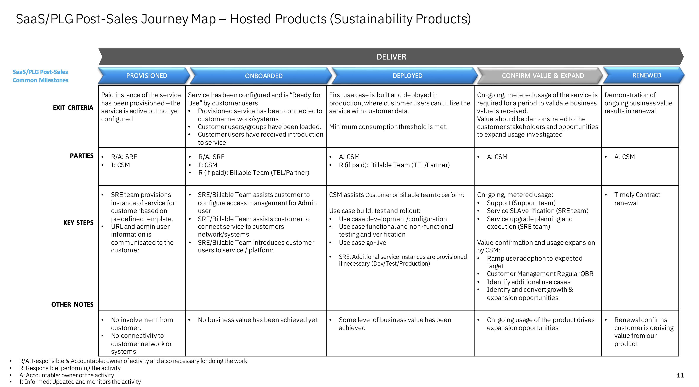

import {Link} from 'gatsby'

<InlineNotification kind="warning">

**Note: The <i>AUTOMATED</i> deployment metrics are pending sign-off and should be considered in progress until this notice is removed.**

The following considerations should be taken when reporting on SaaS deployments:
- All deployments for SaaS should follow the same process as non-SaaS / on-prem deployments
- Create one Growth Plan per use case
- Growth Plan project stages will be used to determine milestone status
- Deployed growth plans require a success plan review by a manager before being counted in the CSM scorecard
- All 3 deployment questions must be answered for the Growth Plan before being counted in the CSM scorecard

See below for detailed instructions on how to view the usage for your account.
</InlineNotification>

## Contacts

| WW contact | Name | WW contact | Name |
| --- | --- | --- | --- |
| **Customer Success Practice Leader:** | Poornima Kallur | **Digital Customer Success & PLG:** | Chris Moran |
| **Technology Expert Labs Delivery:** | Justin Willock | **Technology Expert Labs Solution Engineering:** | Sourav Mazumder |

<Row>
<Column colMd={9} colLg={9}>

## Overview
As a CSM, your focus will be to guide and nurture your customers who have Envizi Essentials SaaS entitlements.  You will guide the customer with provisioning through to onboarding, help with their first use case, and continue to expand their use cases.

Refer to the <a href='https://pages.github.ibm.com/csm-playbook/playbook/common/ai-apps/csm-ai-envizi/' target='_blank' rel='noreferrer noopener'>Envizi Playbook</a> for the product overview, the pain points it addresses, what a CSM driven deployment looks like, and how to expand and grow a client's usage.

</Column>
</Row>

<Row>
<Column>

| FAQ | Answer |
| --- | --- |
| What is the relationship name in Gainsight? | Envizi SaaS |
| Which Clouds does this product run on? | AWS |
| How is SaaS usage calculated? | Number of entitled accounts |
| Who can help my customer with billing/invoicing questions? | Rayssa Fagundes Santos |
| Where is the documentation? | <a href='https://essentials.envizi.com/home/?t=sk8ZD3ohFbyxrKVDEKEfiA' target='_blank' rel='noreferrer noopener'>Envizi Essentials Documentation</a> |
| Are the SaaS capabilities different from the on-prem offering? | There is no on-prem offering for Envizi. It is 100% SaaS.
| Is Envizi Essentials consumable or ratable revenue? | Ratable |
| Who triggers deployment? | Growth Plan & Manager Assessed until Instrumented ​(estimate Apr 2024 for Essentials) |

</Column>
</Row>

<Row>
<Column colMd={9} colLg={9}>

### CSM Scorecard Milestones based on usage
SaaS milestones for the CSM Scorecard are based on usage. To progress from Planning to Deploying to Deployed, see <Link to='/common/saas-growth/#sustainability-software-saas-milestones-based-on-usage'>Sustainability software milestones based on usage</Link>.

</Column>
</Row>

<Row>
<Column>

You can find more about how Envizi Essentials is priced in the <a href='https://www.ibm.com/products/envizi/pricing' target='_blank' rel='noreferrer noopener'>Envizi Essentials Pricing</a>.

<Accordion>
<AccordionItem title="SaaS Adoption Journey Insights">
SaaS has an additional level of insights that are used to track the adoption journey. These provide an additional level of detail specifically for SaaS adoption.  For Envizi, they are shown in the table below

| 
Insight
 | 
Description
 |
| --- | --- |
| Paid Provisioned | Customer has purchased the product. Client organization has been created on one of the Envizi servers|
| Paid Onboarded | Completion of the Onboarding checklist. Client's first system administration user has been created |
| Paid Deployed | First use case or feature deployed in a production environment. An account record has been added |
| Paid Upgraded | Moving to a different offering package (Client has need for custom metrics, needs more than 1000 accounts, need for automatic data capture, additional capability (new modules or SICS or power report edit))|
| Paid Renewed | Customer has adopted and renewed |

</AccordionItem>
</Accordion>

</Column>
</Row>

<Row>
<Column colMd={9} colLg={9}>

### Envizi Essentials Product Feature Adoption and Value Realized Indicators  
Envizi Essentials Product Feature Adoption and Value Realized Indicators are instrumented in the product to show the capabilities and features that the customer is using. This information can be used to determine the level of adoption that has taken place and ensure that the customer is receiving full business value from the product. See below for novice, intermediate and advanced level indicators.

</Column>
</Row>

<Row>
<Column>

<Accordion>
<AccordionItem title="Novice level indicators">

| Product feature | Description | Asset |
| --- | --- | --- |
| User created a user | In Envizi Essentials, you can create users in a single form or you can create contacts and logins separately | <a href='https://essentials.envizi.com/home/creating-users' target='_blank' rel='noreferrer noopener'>Link</a> |
| User created a classification group | Create a classification group or portfolio group. Depending on your access role, you can create, edit, or delete a group in the Groups grid or in a Group Summary page | <a href='https://essentials.envizi.com/home/creating-a-group' target='_blank' rel='noreferrer noopener'>Link</a> |
| User created a location | A system administrator can create, edit, and delete a location. When you create a location, you associate it with a country and a region | <a href='https://essentials.envizi.com/home/setting-up-locations' target='_blank' rel='noreferrer noopener'>Link</a> |
| User created an account | Accounts track consumption, cost, and activity data for utilities, such as electricity or natural gas. User can create an account and associate with a location | <a href='https://essentials.envizi.com/home/setting-up-accounts' target='_blank' rel='noreferrer noopener'>Link</a> |
| User loaded account record data manually | You can add data records to your accounts for your data types by manually entering the data | <a href='https://essentials.envizi.com/home/capturing-data-records-manually' target='_blank' rel='noreferrer noopener'> Link </a> |

</AccordionItem>

<AccordionItem title="Intermediate level indicators">

| Product feature | Description | Asset |
| --- | --- | --- |
| User viewed Org summary page | The Organization Summary page provides an overview of the performance of the organization. You can configure the dashboard to view performance from an energy perspective or an emissions perspective | <a href='https://essentials.envizi.com/home/organization-summary-page' target='_blank' rel='noreferrer noopener'>Link</a> |
| User viewed Group summary page | Group Summary pages provide an overview of the performance of a group. You can customize the page to display the gadgets for your view of the page | <a href='https://essentials.envizi.com/home/group-summary-page' target='_blank' rel='noreferrer noopener'>Link</a> |
| User viewed Location summary page | Location Summary page provides an overview of the performance of a location. You can customize the page to display the gadgets for your view of the page | <a href='https://essentials.envizi.com/home/location-summary-page' target='_blank' rel='noreferrer noopener'>Link</a> |
| User viewed Account summary page | The Account Summary page provides an overview of the performance of an account | <a href='https://essentials.envizi.com/home/account-summary-page' target='_blank' rel='noreferrer noopener'>Link</a> |
| User viewed (Account) Records list | Use this navigation to view past records in the Records grid and also the recent records | <a href='https://essentials.envizi.com/home/capturing-data-records-manually' target='_blank' rel='noreferrer noopener'> Link </a> |
| User ran Audit History report | Lists all of the changes that were made by users or a specific user in the organization for a specified time period | <a href='https://essentials.envizi.com/home/audit-reports' target='_blank' rel='noreferrer noopener'>Link</a> |
| User ran Notes Extract report | Displays all of the notes that are recorded for accounts, locations, groups, or the organization | <a href='https://essentials.envizi.com/home/audit-reports' target='_blank' rel='noreferrer noopener'>Link</a> |
| User run Monthy Data Summary report | A summary of monthly data held in all accounts of a location, group of locations, or all locations | <a href='https://essentials.envizi.com/home/monthly-data-summary-report' target='_blank' rel='noreferrer noopener'>Link</a> |
| User viewed Account Data Health Check PowerReport | The Account Data Health Check report provides detailed information about missing activity data and about gaps in your data. Use the report to prompt you to ask your suppliers for data to complete gaps or to inform them about data that is in arrears | <a href='https://essentials.envizi.com/home/account-data-health-check-report' target='_blank' rel='noreferrer noopener'>Link</a> |
| User loaded account record data from a bulk template | In Envizi Essentials, you can upload activity data, KPIs, and spend data in bulk by using template files | <a href='https://essentials.envizi.com/home/adding-account-data-in-bulk' target='_blank' rel='noreferrer noopener'> Link </a> |
| User ran Record and Cost Audit report | Displays details about the data that was recorded against each account and when the data was loaded | <a href='https://essentials.envizi.com/home/audit-reports' target='_blank' rel='noreferrer noopener'> Link </a> |
| User created a portfolio group | Create a portfolio group | <a href='https://essentials.envizi.com/home/creating-a-group' target='_blank' rel='noreferrer noopener'> Link </a> |
| User viewed Performance dashboard | Several dashboards are available to monitor the environmental performance of your organization, groups, and locations | <a href='https://essentials.envizi.com/home/performance-dashboards' target='_blank' rel='noreferrer noopener'> Link </a> |
| User viewed Performance by Data Type dashboard | Monitor performance by aggregating, ranking, and proportioning data into data type views over a selected period of time | <a href='https://essentials.envizi.com/home/performance-dashboards' target='_blank' rel='noreferrer noopener'> Link </a> |
| User viewed Performance Trend dashboard | Track performance tends over a range of time periods, for example, years, 6 month periods, quarters, or months. Specify any number of months up to 12 months. | <a href='https://essentials.envizi.com/home/performance-dashboards' target='_blank' rel='noreferrer noopener'> Link </a> |
| User viewed Emissions Performance dashboard | The Emissions Performance dashboard shows your GHG emissions broken down by scope, direct emissions, indirect emissions and individual gases, such as CO2, CH4, and N2O | <a href='https://essentials.envizi.com/home/emissions-performance-dashboard' target='_blank' rel='noreferrer noopener'> Link </a> |
| User ran Emissions and Energy Factors report | Lists the factors that are used to calculate GHG emissions and GJ of energy consumed or produced in your organization | <a href='https://essentials.envizi.com/home/audit-reports' target='_blank' rel='noreferrer noopener'> Link </a> |

</AccordionItem>

<AccordionItem title="Advanced level indicators">

| Product feature | Description | Asset |
| --- | --- | --- |
| User created an Issue | In Envizi Essentials, you can create an issue to track a problem. You can assign the issue to someone and you can upload supporting information to the issue | <a href='https://essentials.envizi.com/home/creating-an-issue' target='_blank' rel='noreferrer noopener'> Link </a> |
| User enabled Multi language | A system administrator can enable multi-language support in Envizi Essentials. | <a href='https://essentials.envizi.com/home/enabling-multiple-languages' target='_blank' rel='noreferrer noopener'> Link </a> |
| User ran Sustainability (Executive) PowerReport | The Sustainability (Executive) report is a PowerReport that provides an overview of key sustainability metrics for your organization, including energy, emissions, waste, and water | <a href='https://essentials.envizi.com/home/sustainability-executive-report' target='_blank' rel='noreferrer noopener'> Link </a> |
| User ran Sustainability (Portfolio Performance) PowerReport | The Sustainability (Portfolio Performance) report is a PowerReport that provides information on key sustainability indicators across your property portfolio. | <a href='https://essentials.envizi.com/home/sustainability-portfolio-performance-re' target='_blank' rel='noreferrer noopener'> Link </a> |
| User ran Scope 3 Emissions Analysis PowerReport | The Scope 3 Emissions Analysis report in Envizi Essentials provides a view of your emissions across Scope 3 categories. | <a href='https://essentials.envizi.com/home/scope-3-emissions-analysis-report' target='_blank' rel='noreferrer noopener'> Link </a> |
| User used (Scope 3 spend) AI Assist feature | In Envizi Essentials, as a system administrator, you can use the AI Assist to add scope 3, category 1 spend data | <a href='https://essentials.envizi.com/home/adding-spend-data-by-using-ai-assist' target='_blank' rel='noreferrer noopener'> Link </a> |
| User was emailed Data Receipt report | The Data Receipt report is an automated email that is sent to specific contacts when data is loaded. The report informs them of whether their file was loaded successfully or was partially successful. | <a href='https://essentials.envizi.com/home/data-receipt-report' target='_blank' rel='noreferrer noopener'> Link </a> |
| User viewed Ranking Groups by Intensity dashboard | The Ranking Groups by Intensity dashboard compares performance across peer locations by intensity | <a href='https://essentials.envizi.com/home/ranking-groups-by-intensity' target='_blank' rel='noreferrer noopener'> Link </a> |
| User viewed Ranking Locations by Intensity dashboard | The Ranking Locations by Intensity dashboard compares performance across peer locations by intensity | <a href='https://essentials.envizi.com/home/ranking-locations-by-intensity' target='_blank' rel='noreferrer noopener'> Link </a> |

</AccordionItem>

</Accordion>

</Column>

</Row>

<Row>
<Column colMd={9} colLg={9}>

## Post-sales journey  
As a CSM, your focus is to digitally welcome and nurture your customers who have Envizi SaaS entitlements.

| CSM Coverage | Activities |
| --- | --- |
| CSM Architect | High touch nurture |
| Digital CSM | Low touch nurture |
| No CSM Coverage | Customer self-service |

The diagram shows the Envizi post-sales journey at a high level. Each section is broken down in detail with links to assets below.

</Column>
</Row>

<Row>
<Column>

### Provisioned

| **Led by** | **Outcome** | **Assets & Activities** |
| --- | --- | --- |
| Provisioning team |  Client organization has been created on one of the Envizi servers |  Managed by Envizi Provisioning team |

### Onboarded

| **Led by** | **Outcome** | **Assets & Activities** |
| --- | --- | --- |
| Provisioning team | Client's first system administration user has been created     | The following onboarding activities are completed by Envizi provisioning team     After the Envizi instance has been provisioned,   - Organization settings have been updated   - Data Management preferences have been set   - Products have been assigned   - Monthly Dataset has been set to "hidden"   - Default group and loction has been created   - Default dataflow automation has been setup   |

### Deployed

| **Led by** | **Outcome** | **Assets & Activities** |
| --- | --- | --- |
| CSM Architect/Digital CSM | The client has implemented at least one use case and is receiving value.      Primary outcome of the very first use case - An Account Record has been added    | **Technology Expert Labs Offerings:    (For Envizi Essentials there is no TEL offering in place today, but if you see a need for a customer then reach out to Justin Willock and Poornima Kallur. Will be reviewed on a case by case basis)**   **Expertise Connect Services:** Expertise Connect offers a continuous engagement model for clients to access technical guidance from TEL - Software deep technical expertise at a fraction of the cost of typical consulting engagements.    **Nurture opportunities**  After the Product Led Growth interface in Gainsight is configured later in 2024, you will be able to track the activities that the customer is performing in the Envizi platform. This enables you to determine whether the customer needs additional assistance through their journey. For instance, if you see that no "account records are being created", then your customer has not completed the basic onboarding steps and may require your assistance. |

### Confirm Value & Expand

| **Led by** | **Outcome** | **Assets & Activities** |
| --- | --- | --- |
| CSM Architect/Digital CSM + Sales | Customer has realized value and is expanding usage to new business use cases | **Nurture relationship**   Set up a <a href='https://pages.github.ibm.com/csm-playbook/playbook/onboard/executive-business-review/' target='_blank' rel='noreferrer noopener'>EBR (executive business review)</a> with client sponsor and executives to align and review the adoption, value seen and confirm the customer's strategic goals have been met.    **Identify risk/opportunity**   After the Product Led Growth interface in Gainsight is configured later in 2024, you will be able to track the activities that the customer is performing in Envizi platform. This allows you to determine whether the customer is continuing to use the product or whether usage is dropping.    **Expand solution**   A CSM should continue to track usage and look for opportunities to add more use cases or help customers upgrade to the next premium package offering. |

### Renewed

| **Led by** | **Outcome** | **Assets & Activities** |
| --- | --- | --- |
| CSM Architect/Digital CSM + Renewal Rep + Sales | The client has confirmed that they are using the product and will continue to renew their Envizi entitlement. | N/A |

</Column>
</Row>
