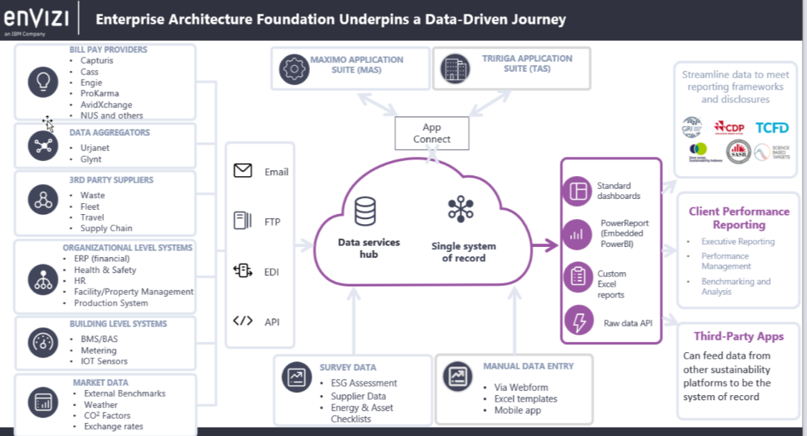
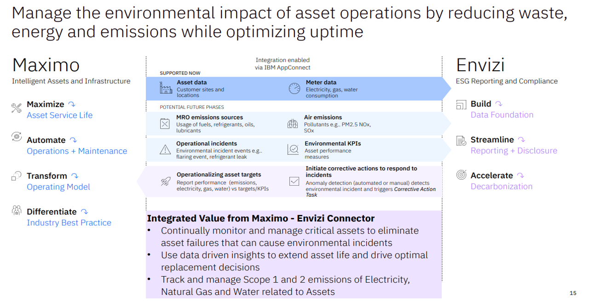
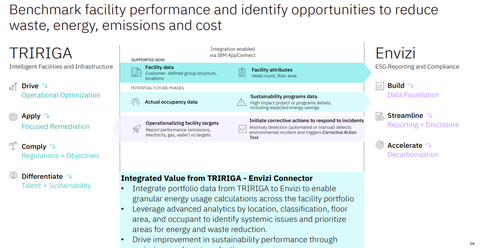
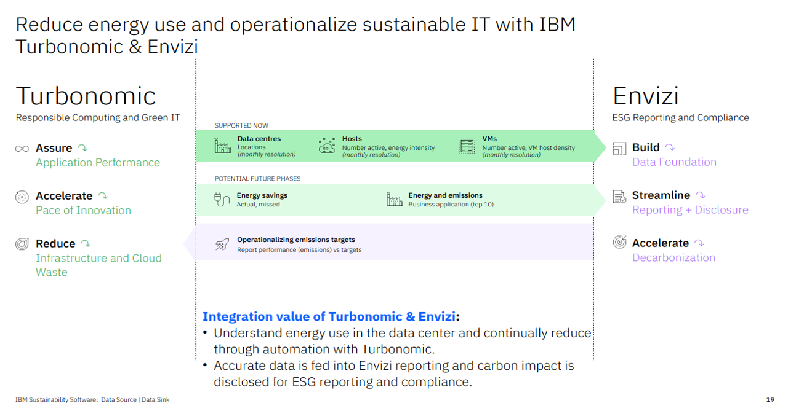
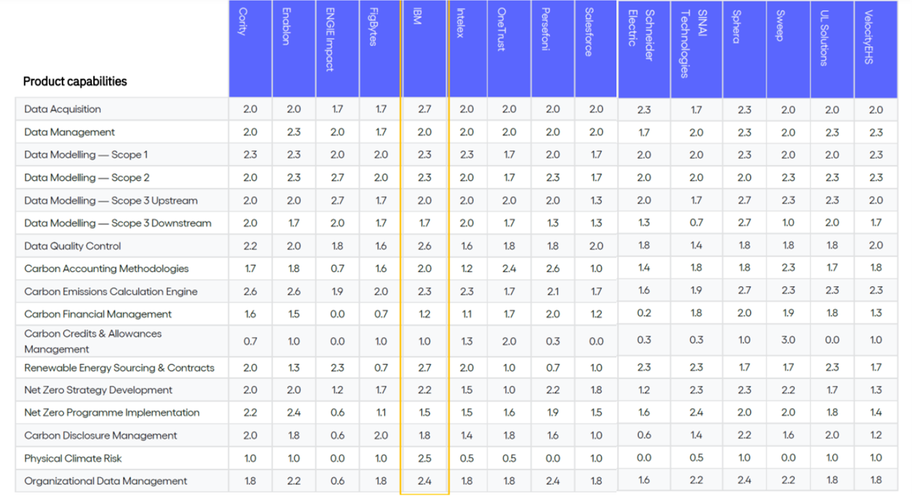
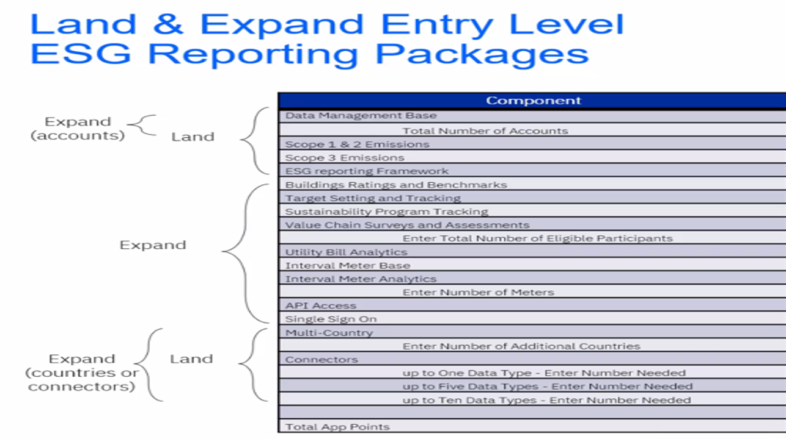
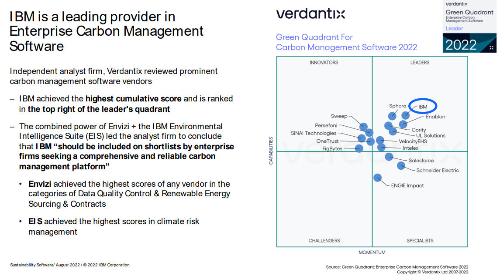

import {Link} from 'gatsby'

<AnchorLinks small>
<AnchorLink>Envizi Announcements</AnchorLink>
<AnchorLink>What is the IBM Envizi ESG Suite and what does it do?</AnchorLink>
<AnchorLink>What are the pain points that the Envizi ESG Suite addresses?</AnchorLink>
<AnchorLink>Envizi technical architecture</AnchorLink>
<AnchorLink>What are the major Envizi use cases?</AnchorLink>
<AnchorLink>There isn't a current use case, where do I start?</AnchorLink>
<AnchorLink>Is Envizi a SaaS solution? Which cloud platform does it run on?</AnchorLink>
<AnchorLink>What are the key steps involved in an Envizi implementation?</AnchorLink>
<AnchorLink>What Envizi connectors are available today using IBM AppConnect?</AnchorLink>
<AnchorLink>What are the typical Envizi implementation timelines?</AnchorLink>
<AnchorLink>Who can help me?</AnchorLink>
<AnchorLink>Where can I find ESG reporting framework complete guide with detailed metric coverage for Envizi?</AnchorLink>
<AnchorLink>Who are the top 5 Envizi competitors, their strengths and weaknesses</AnchorLink>
<AnchorLink>What are the various phases in an Envizi project rollout, teams involved and their roles and responsibilities?</AnchorLink>
<AnchorLink>How do I get support for my Envizi customer?</AnchorLink>
<AnchorLink>How do I expand and grow Envizi usage?</AnchorLink>
<AnchorLink>CSM Soft Skill assets and General Frequently Asked Questions</AnchorLink>
<AnchorLink>Where can I find Envizi presentations and related assets (both client facing and internal)?</AnchorLink>
</AnchorLinks>

<Row className="resource-card-group">

<Column colMd={4} colLg={4} noGutterSm>
<ResourceCard
      subTitle="Guide the customer with provisioning through to onboarding, help with their first use case, and continue to expand their use cases"
      title="Envizi SaaS"
      href="/common/ai-apps/csm-ai-envizi-saas/">

</ResourceCard>

</Column>
</Row>

<Row>
<Column colMd={8} colLg={8} noGutterMdLeft>

## What is the IBM Envizi ESG Suite and what does it do?
Envizi was founded in 2004, acquired by IBM in January 2022 and the transfer of business closed out in October 2022.IBM Envizi ESG Suite offers a comprehensive, modular sustainability Software as-a-Service solution (SaaS) to drive Environmental, Social, and Governance (ESG) reporting and performance management. This data and analytics platform supports the reporting of ESG metrics, delivers Greenhouse gas (GHG) emissions calculations, and helps organizations drive their ESG performance, all underpinned by auditable, finance-grade data.

Envizi’s software automates the collection and consolidation of 500 data types and supports major sustainability reporting frameworks. Envizi’s suite of solutions go beyond reporting. User-friendly visualizations and tools drive energy efficiency improvements and optimize the performance of buildings and equipment. This helps organizations decarbonize their operations. Envizi's solutions simplify the consolidation, analysis, and management of siloed data sources to meet sustainability reporting frameworks requirements, manage stakeholders, and meet sustainability goals.

Our customers use Envizi to: 
Build a Data Foundation by automating the collection and consolidation of more than 500 ESG data types into a single system of auditable, financial-grade data 
Streamline Reporting and Disclosures with Envizi’s powerful emissions calculation engine 
Accelerate Decarbonization by identifying energy and emissions savings opportunities and tracking progress at every stage of your journey 

</Column>

<Column colMd={4} colLg={4} noGutterMdLeft>

 

<Aside>

**Customer Success Practice Leader:** Poornima Kallur (@pkallur) 
**CSM Slack Channel:** <a href='https://ibm-cloud.slack.com/archives/C01LWEJK8D6' target='_blank' rel='noreferrer noopener'>#envizi-cop-advice-forum</a> 
**Learn:** <a href='https://ibm.seismic.com/app#/doccenter/f6bc8873-d580-4ee8-a903-c4e0d3a7eee9/doc/%252Fdd85c941b1-5f54-2314-ce72-b98c4c0974c2%252FdfOTRiYmU4NTQtNWY4NC03Y2QyLWZjYWUtOGIxYmFmZjkyZThk%252CPT0%253D%252CU2FsZXMga2l0%252Flf939c5985-3f3a-491e-9cc1-f83cecad3f46//?mode=view'  target='_blank' rel='noreferrer noopener'>Winning Conversations,</a> <a href='https://ibm.seismic.com/app?ContentId=3bddb23a-55fd-49dd-9096-42b42853c349#/search?appType=DocCenter&keyword=Envizi%2520client%2520presentation&contentType=All%20Documents&selectedProperties=&folderId=&folderName=&fromAppType=&currentTeamSiteId=&sharedTeamSiteId=&profileItemId=&pageIndex=0'  target='_blank' rel='noreferrer noopener'>Client Presentations</a> and <a href='https://ibm.seismic.com/app?ContentId=3bddb23a-55fd-49dd-9096-42b42853c349#/search?appType=DocCenter&keyword=Envizi%2520sales&contentType=All%20Documents&selectedProperties=&folderId=&folderName=&fromAppType=&currentTeamSiteId=&sharedTeamSiteId=&profileItemId=&pageIndex=0' target='_blank' rel='noreferrer noopener'>Sales Enablement</a> materials 
**Roadmap:** Envizi Product Roadmap <a href='https://bigblue.aha.io/bookmarks/custom_pivots/7220622906027033660/7278367753552130996' target='_blank' rel='noreferrer noopener'>Internal + <a href='https://bigblue.aha.io/published/a0870efee8582762a8668ee60a538e51?page=1' target='_blank' rel='noreferrer noopener'> External </a> </a> (PW Envizi2023)  
**Tech Zone:** <a href='https://techzone.ibm.com/collection/ibm-sustainability-software-asset-management-technical-demo-collections#tab-4' target='_blank' rel='noreferrer noopener'>Technical Demo Collections</a> with <a href='https://ibm-envizi-accessrequest.ideas.aha.io/portal_session/new' target='_blank' rel='noreferrer noopener'> Demo environment access request</a> 
**Knowledge Base:** <a href='https://knowledgebase.envizi.com/home/base-platform' target='_blank' rel='noreferrer noopener'>Envizi Product Documentation</a>  
**Service Description:** <a href='https://www.ibm.com/support/customer/csol/terms/?id=i126-9385&lc=en#detail-document' target='_blank' rel='noreferrer noopener'>SD</a>  
**Envizi Practice Page (people focused):** <a href='https://w3.ibm.com/w3publisher/customersuccess/community-connections/sustainability-software-community/asset-management-envizi' target='_blank' rel='noreferrer noopener'>Click here</a> 
**Envizi general announcements: ** <a href='https://ibm.ent.box.com/file/1313625740943' target='_blank' rel='noreferrer noopener'>Current quarter Envizi updates</a>
</Aside>

<Aside>

**Training - Build your skills**

CSMs:
<a href='https://yourlearning.ibm.com/activity/PLAN-887B046E3696' target='_blank' rel='noreferrer noopener'>LearnIT - Learning plan</a> 
<a href='https://yourlearning.ibm.com/activity/PLAN-C8612988CFA5' target='_blank' rel='noreferrer noopener'>ApplyIT - Learning plan</a> 
 

Clients:  
<a href='https://learn.ibm.com/course/view.php?id=11340' target='_blank' rel='noreferrer noopener'>Envizi Essentials</a> 
<a href='https://learn.ibm.com/course/view.php?id=11384' target='_blank' rel='noreferrer noopener'>Envizi System Administration</a> 
<a href='https://learn.ibm.com/course/view.php?id=11663' target='_blank' rel='noreferrer noopener'>Envizi ESG Fundamentals</a> 
</Aside>

<Aside>

**Customer-facing case studies**

Most recent Envizi case studies are here <a href='https://ibm.seismic.com/app?ContentId=a78fb8fe-90e3-4a41-b8a9-6d4e901d8244#/doccenter/f6bc8873-d580-4ee8-a903-c4e0d3a7eee9/doc/%252Fdd0ab3871f-9594-50fd-73b1-7f6c58815c13%252Fdd7511971b-9ec2-e2dc-83ca-0ee2a57c98e5%252Fdd58de910a-4246-e883-ffa3-94549709ea27%252FdfOTRiYmU4NTQtNWY4NC03Y2QyLWZjYWUtOGIxYmFmZjkyZThk%252CPT0%253D%252CQ2FzZSBzdHVkeQ%253D%253D%252Flf1498223a-972a-4181-9a40-2583c1143b92//?mode=viewproperties&searchId=de5d7d8e-dd94-44a1-964e-fcc1da0113c8' target='_blank' rel='noreferrer noopener'>Case Studies on Seismic</a>
<a href='https://www.ibm.com/products/envizi?mhsrc=ibmsearch_a&mhq=envizi' target='_blank' rel='noreferrer noopener'>Case Studies on ibm.com</a>
</Aside>
<Aside>

**Technology Expert Labs offerings**

<a href='https://ibm.seismic.com/app?ContentId=81d827e5-923e-4a79-ba1b-49970676a837#/doccenter/f6bc8873-d580-4ee8-a903-c4e0d3a7eee9/doc/%252Fddee51efc9-4ad7-4432-6340-1ce9c7c12c52%252Fdd9a9377c9-5e5b-3311-59c9-054668c8f2b1%252Fdfbb748928-5f27-4232-9e4e-e3bb08692dcd%252Fdf142efcd5-df0d-4023-ba5c-c1c9bc045854%252Fdf65c22a1d-2d3b-46df-9354-309cad72b456%252Flf1c08dec7-05cd-4997-839a-94cf0c087a5e/grid/?anchorId=ba984d8f-91b6-4335-b84d-d0365eb46c1b' target='_blank' rel='noreferrer noopener'>Overview of Technology Expert Labs Services</a>

</Aside>

</Column>

</Row>

<Row>

<Column colMd={10} colLg={10}>

## What pain points does the Envizi ESG Suite address?
Today’s leaders are excited and energized by the chance to reimagine business and commerce with a sustainability-first mindset. IBM Envizi ESG Suite removes the challenges and complexity of ESG data collection, analysis and reporting so you can harness the power of data to fast-track your success. IBM Envizi addresses these key pain points for our customers.

**ESG Disclosures:** This is one of the core challenges for businesses because investors are increasingly demanding that organizations publicly disclose their Environmental, Social, Governance (ESG) and Greenhouse Gas (GHG) credentials to external ESG agencies and frameworks, and following an increasing number of ESG reporting standards. However, not all organizations have the tools or analytics to do this accurately and efficiently. 
**GHG calculation and reporting:** One of the most difficult parts of ESG disclosures is GHG reporting. GHG reporting covers not only an organization’s operations but also the upstream supply chain and downstream distribution and products sold.  
**Achieving decarbonization targets:** Companies want to reduce their carbon emission, but many currently lack a roadmap to achieve this target. The purpose of sustainable businesses is to not just set a goal but to successfully attain it. Organizations feel all of the pressures previously mentioned; however, without a roadmap in place, they will forever struggle to achieve their decarbonization goals. 
**Driving engagement and action:** Mobilizing a large organization to make steady progress towards those commitments is a huge challenge. IBM has even committed to net zero GHG emissions by 2030 and is continually taking steps towards achieving this. 

## Envizi technical architecture
Envizi consolidates sustainability data from providers to create a single view and a common control plane for sustainability projects.
Take a look at this slide which depicts how Envizi's architecture simplifies the capture, consolidation, management and analysis of sustainability database.

 

Starting on the left side of this slide, Envizi provides the capability to capture a wide range of data types, whether it is granular meter data or high-level health and safety metrics. One of the key tenants of producing financial-grade data is removing human error from the equation. Automating from the source and providing full traceability to that source are critical. Envizi automates data from several sources, including bill pay providers, third-party suppliers (such as fleet systems travel like Concur or American Express), and data from supply chain upstream transportation and distribution (for example, capturing data to assess carbon impact from deliveries companies such as FedEx or UPS).

## What are the major Envizi use cases?

Envizi has the following major use cases. The details of each can be found <a href='https://ibm.seismic.com/app?ContentId=d829c84a-d9fd-4541-89b0-14e86bef15c5#/doccenter/f6bc8873-d580-4ee8-a903-c4e0d3a7eee9/doc/%252Fdd85c941b1-5f54-2314-ce72-b98c4c0974c2%252FdfOTRiYmU4NTQtNWY4NC03Y2QyLWZjYWUtOGIxYmFmZjkyZThk%252CPT0%253D%252CVXNlIGNhc2U%253D%252Flf0712b8b4-b9db-459e-810c-8480620d434b/grid/' target='_blank' rel='noreferrer noopener'>here</a> 

Use Case 1: Create a Structured Data Foundation to establish an Environmental, Social and Governance (ESG) performance baseline 
Use Case 2: Streamline internal Environmental performance reporting 
Use Case 3: Emissions Calculation & Reporting 
Use Case 4: Streamline external ESG reporting disclosures to investors and external reporting frameworks 

## Is Envizi a SaaS solution? Which cloud platform does it run on?

Envizi is a SaaS solution. It runs primarily on AWS but we also have one customer on Azure (Microsoft).

## There isn't a current use case, where do I start?

1. Before you engage with the customer, work with your IBM Sales/Tech Sales to reconfirm if a customer does not have use cases purchased. Then understand if during the pre-sales cycle, they had expressed interest in implementing any use cases  

2. Once you have that information from your IBM peers, engage your customer to discuss and gain approval to run a discovery workshop to identify and prioritize use cases and potential solution designs  

3. Do this with the participation of your customer organizations both IT and LOB department stakeholders either in a meeting room/whiteboarding session or through a MURAL session at the same time  

4. If you need assistance on how to prep for a workshop and execute the same reach out to your Practice Leader - Poornima Kallur for assistance  

5. You can also involve Client Engineering, and/or Technology Expert Labs (Paid Engagement) to arrive at the right set of business outcome-driven use cases

## What are the key steps involved in an Envizi implementation?

Listed below are the major prerequisites / key tasks involved in an Envizi implementation.
1. Project Kick-Off
2. Requirements Gathering and Reporting Workshops
3. Configuration Plan and Reviews
4. System configuration
    - Completion of Master Data Matrix (MDM) template
    - Completion of Account Styles Workbook
    - Configuration Plan document
    - System Configuration (Set up group hierarchy, load locations, accounts, account style set up)
    - Single Sign On configuration
5. Data loading
    - Historical Data load
    - Ongoing Data load
6. Design and build Data Connectors
7. Training
    - General User Training
    - System Administrator training
8. Project Completion and Transition to support
9. Ongoing Support and Client Services  

</Column>
</Row>

<Row>

<Column colMd={10} colLg={10}>

## What Envizi connectors are available today using IBM AppConnect?

**1. Maximo - Envizi Connector** (Maximo integration enabled via IBM AppConnect to Envizi).
  * Continually monitor and manage critical assets to eliminate asset failures that can cause environmental incidents
  * Use data-driven insights to extend asset life and drive optimal replacement decisions
  * Track and manage Scope 1 and 2 emissions of Electricity, Natural Gas and Water related to Asset

**2. Tririga - Envizi Connector**(Tririga integration enabled via IBM AppConnect to Envizi)
  * Integrate portfolio data from TRIRIGA to Envizi to enable
granular energy usage calculations across the facility portfolio
  * Leverage advanced analytics by location, classification, floor
area, and occupant to identify systemic issues and prioritize
areas for energy and waste reduction.
  * Drive improvement in sustainability performance through
emissions and waste reduction

**3. Turbonomic - Envizi Connector** (Turbonomic integration enabled via IBM AppConnect to Envizi)
  * Understand energy use in the data center and continually reduce
through automation with Turbonomic.
  * Accurate data is fed into Envizi reporting and carbon impact is
disclosed for ESG reporting and compliance

## What are the typical Envizi implementation timelines?

A typical Envizi project engagement can range from about 16 - 24 weeks from commercial sign-offs through to user familiarization training and handover. This is dependent on the size of an organization, number of external providers involved, structure and format of current data etc.  A key outcome of the Project Kick off workshop is a mutually agreed project timeline – recognizing client critical dates, key milestones, client stakeholder availability and resourcing.

## Who can help me?

Use the following forums to seek help:
1. Envizi Practice Leader - Poornima Kallur (pkallur@us.ibm.com)  

**Slack Channels:**

2. General product questions - #ask-envizi
3. Support escalations/ticket expedition/status check - #support-escalations-sustainability
4. Support Manager - Kate Reilly reillyk@us.ibm.com
5. Onboarding/services implementation questions - #expertlabs-envizi
6. Renewal questions - #ccs-cer-csm-renewals

**Client Engineering** and **Tech Sales** also have the skills required to perform Proof of Value engagements. 
**IBM Technology Expert Labs** or an **Envizi Business Partner** can deliver Installation and Implementation services.

## Where can I find ESG reporting framework complete guide with detailed metric coverage for Envizi?

A must-have for sustainability managers! Find the framework guide on Seismic. Review Slide 8 in this report <a href='https://ibm.seismic.com/app?ContentId=901b0b1d-77c2-497f-bccd-67eccfd688f5#/doccenter/861ea1fd-99e0-44d7-9135-85412e5c28d1/doc/%252Fdd3359e5f7-a856-a91b-7688-41024b2ac637%252FdfNTY4NmVhOWItY2RkNS04ZWY3LTZkNzItZTQwZjczMWUyMjk1%252CPT0%253D%252CU3VzdGFpbmFiaWxpdHkgU29mdHdhcmU%253D%252FdfNDRmODBlMzMtY2ViMC0zMDI1LTVhNDEtNzg2OTg4MWVmZDBl%252CPT0%253D%252CRW52aXppIEVTRyBTdWl0ZQ%253D%253D%252FdfOTRiYmU4NTQtNWY4NC03Y2QyLWZjYWUtOGIxYmFmZjkyZThk%252CPT0%253D%252CU29sdXRpb24gb3IgcHJvZHVjdCBndWlkZQ%253D%253D%252Flfa6435fda-253c-4eca-b099-cb41a32d1ad1/grid/' target='_blank' rel='noreferrer noopener'>A Guide to ESG Reporting Frameworks - IBM Envizi</a>

## Who are the top 5 Envizi competitors, their strengths and weaknesses?

| Competitor | Strengths | Weaknesses |
| --- | --- | --- |
| **Enablon** | - Established platform with EH&S, GRC, strong in S&G   - Target, manufacturing, oil/gas and pharma. Industries with a strong need for S&G.  - Module expansion capability (land and expand) with 92 modules available.   - Strong carbon calculation engine and Scope 1 data modeling capabilities   - Net zero program implementation to track project performance | - Lack of automation for capturing ‘E’ data  - No ability to customize reports for stakeholder  - No ‘out-of-box’ Scope 3 reporting   - Limited functionality to manage renewable energy sourcing and contracts   - No ability to incorporate geospatial data through direct monitoring and visualization tools |
| **Persefoni** | - Specialised climate management and carbon accounting software   - Targeting banks, asset managers and asset owners   -  Transparency of financed emissions across a portfolio   -  Carbon accounting methodologies with a selection of preferred accounting approaches, inventory boundaries and calculation methodologies | -  Limited functionality in data modeling for Scope 3 downstream   - No physical climate risk capability   -  New to market – one to watch |
| **Sphera** | - Strong carbon calculation engine, including LCA emission factors   -  Strong data modeling for Scope 3   - Strong financial data aggregation capabilities   -  Able to calculate product carbon footprint   -  Experienced and knowledgeable consultancy arm | - Expensive solution   -  Lack of automation for capturing data   -  No ability to customize reports for stakeholders   -  No ability to purchase and manage carbon credits or integrate with carbon credit registries |
| **Cority** | - Leverages the EHS platform to offer carbon calculation engine   -  Scope 1 data modelling   -  Extensive emissions factor library | - Poor carbon credits and allowances management   -  No capabilities to incorporate geospatial data through direct monitoring and visualization tools |
| **UL Solutions** | - User-friendly interface   -  Flexible data management for users to manipulate   -  Data quality checks   -  Tiered proposition for SME and large organizations   -  International presence   -  Broad technical expertise across EHS, sustainability and buildings | - No streamlined process for Scope 3 reporting   -  No automated dashboard reports, surveys or data management   -  No reporting framework support   -No ability to filter down to specific locations |

You can find more competitors and additional details here <a href='https://ibm.seismic.com/app#/doccenter/f6bc8873-d580-4ee8-a903-c4e0d3a7eee9/doc/%252Fdd85c941b1-5f54-2314-ce72-b98c4c0974c2%252FdfOTRiYmU4NTQtNWY4NC03Y2QyLWZjYWUtOGIxYmFmZjkyZThk%252CPT0%253D%252CQ29udmVyc2F0aW9uIEd1aWRhbmNl%252Flfeb23a9e3-d70e-4a9e-b055-5d3004652ec4//?mode=view&searchId=f0a2bdc3-0e7e-44a5-bf46-ce3ce9fd9e67' target='_blank' rel='noreferrer noopener'>Envizi Competitors</a>  

**Competitor Matrix**

 ## What are the various phases in an Envizi project rollout, teams involved and their roles and responsibilities?

 The following teams play a critical role in an Envizi project rollout during the various phases. CSMs collaborate with each of these teams during the contract tenure to strengthen product adoption, expansion, retention and renewal.
 

| Phase | Teams | Activity |
| --- | --- | --- |
| **Sales Phase** | IBM Sales, IBM Tech Sales | Close deal, identify sponsor, define success criteria, engage a Business Partner or IBM Technology Expert Labs for Envizi implementation |
| | Client Engineering, IBM Tech Sales | Perform POV and present Business Value Assessment (BVA) |
| **Post-sales POV stage** (in the event that POV was not performed during Sales Phase) | IBM CSM, Client Engineering, IBM Tech Sales | Engage Customer, and assess their adoption journey, if they are struggling to understand the benefits/value from Envizi then perform POV and Business Value Assessment (BVA). |
| **Deployment Phase** | IBM Technology Expert Labs, Business Partner | Propose services and create SOW, execute SOW and deliver value to the customer 
| | IBM CSM, IBM Tech Sales, IBM Technology Expert Labs, Business Partner | Identify additional use cases, areas for expansion and increased usage |
| | IBM CSM, IBM Tech Sales |  Perform functional and technical demos on new use cases, and feature functions for new expansion opportunities. |

 ## How do I get support for my Envizi customer?

 Share this external facing support <a href='https://ibm.ent.box.com/folder/198940303768' target='_blank' rel='noreferrer noopener'>deck</a> with your customers. This deck gives an outline of
* What IBM Support covers
* Case handling techniques
* Technical information to provide to support team via the case

Here is the latest announcement from Sustainability Software Support Organization - Review this <a href='https://w3.ibm.com/w3publisher/software-support/support-key-services' target='_blank' rel='noreferrer noopener'>site</a> to understand
- Support Process and Escalations (Envizi escalation channel - #support-escalations-sustainability, reach out to your support manager Kate Reilly reillyk@us.ibm.com for additional help as needed)
- Support Extensions  
- <a href='https://w3.ibm.com/w3publisher/software-support/support-key-services/support-offerings' target='_blank' rel='noreferrer noopener'>Support Offerings </a> (IBM Extended Support, IBM Sustained Support, IBM Advanced Support)  

- To help your customers get access to IBM Support portal refer <a href='https://www.ibm.com/mysupport/s/article/Getting-Started-Guide?language=en_US' target='_blank' rel='noreferrer noopener'>Getting Started Support Guide</a> for Administrators, Non Administrators and Contractors/Vendors.

 ## How do I expand and grow Envizi usage?

 Usage of Envizi can be expanded in two ways - an increase in functionality within the application by identifying additional use cases or adding more applications that derive value from Envizi.

 * As CSMs, you need to understand the land and expand model for Envizi and look at which of the 9 modules customer has started Phase 1 with and then initiate a discussion for other modules. For eg if a customer started with Scope 1, 2, 3 and Target Setting modules let us keep them engaged on new modules Value Chain Assessment and Surveys, ESG Reporting, Power BI capabilities and more. 
 * Explore if a customer is looking at expanding geographically by adding more locations/meters etc., as that could be a potential expansion opportunity  
 * Listen to your customers on their IT initiatives and asset management initiatives and see how you can position Maximo and Tririga as additional applications that can help their business initiative but also seamlessly integrate with Envizi to give a complete view of their portfolio performance 
 * Driving expansion into new products or use cases could also be achieved through account planning and Executive Business Reviews with your customers which helps connect executives, understand customer roadmap for the year and position new use cases or new products.

## Where can I find Envizi presentations and related assets (both client-facing and internal)?

</Column>
</Row>

<Row>
<Column colMd={3} colLg={3} noGutterMdLeft>
<CardGroup>
  <MiniCard title="Envizi ESG Suite Quick Guide One Pager - External" href="https://ibm.seismic.com/app#/doccenter/f6bc8873-d580-4ee8-a903-c4e0d3a7eee9/doc/%252Fdd0ab3871f-9594-50fd-73b1-7f6c58815c13%252Fdd7511971b-9ec2-e2dc-83ca-0ee2a57c98e5%252Fdd58de910a-4246-e883-ffa3-94549709ea27%252FdfOTRiYmU4NTQtNWY4NC03Y2QyLWZjYWUtOGIxYmFmZjkyZThk%252CPT0%253D%252CQ2FzZSBzdHVkeQ%253D%253D%252Flfe7a10e4c-cb6b-4ada-ba9a-4f7f9f5cf565//?mode=viewproperties&searchId=f71d011f-181f-478e-b1fb-2a0214d9a0ec"  target='_blank' rel='noreferrer noopener'/>
  </CardGroup>
</Column>
<Column colMd={3} colLg={3} noGutterMdLeft>
<CardGroup>
  <MiniCard title="Envizi Level 1 Client Presentation - External" href="https://ibm.seismic.com/app?ContentId=3a35df8c-546f-4133-b10d-fc73a6f73807#/doccenter/f6bc8873-d580-4ee8-a903-c4e0d3a7eee9/doc/%252Fdd5c8f7522-4368-9455-b031-867e71e2ec33%252Fdd210d97e8-60f3-b041-685f-8dc47b071a2c%252Fdfa25dda6a-6cdf-4546-ae2c-ca71c786161e%252Fdf80a435d1-661f-4aec-8617-256e3fcc3fc1%252Fdf6b3ad303-1d04-49e8-b577-34518334633d%252Flf469df8ee-27ac-4eb0-97ce-86a50bc8f0e4//?mode=view&searchId=d26cff5e-48e5-45d0-b7fd-ab7c75fed781"/>
  </CardGroup>
</Column>

<Column colMd={3} colLg={3} noGutterMdLeft>
<CardGroup>
  <MiniCard title="Envizi Level 2 Client Presentation - External" href="https://ibm.seismic.com/app?ContentId=3a35df8c-546f-4133-b10d-fc73a6f73807#/doccenter/f6bc8873-d580-4ee8-a903-c4e0d3a7eee9/doc/%252Fdd85c941b1-5f54-2314-ce72-b98c4c0974c2%252FdfOTRiYmU4NTQtNWY4NC03Y2QyLWZjYWUtOGIxYmFmZjkyZThk%252CPT0%253D%252CQ2xpZW50IHByZXNlbnRhdGlvbg%253D%253D%252Flf7e5f230d-ecef-4f3f-87c0-5664056b95c6//?mode=view&searchId=d26cff5e-48e5-45d0-b7fd-ab7c75fed781" />
</CardGroup>
</Column>
<Column colMd={3} colLg={3} noGutterMdLeft>
<CardGroup>
  <MiniCard title="Envizi Market Based Emissions Carbon Calculator - IBM Internal" href="https://ibm.seismic.com/app#/doccenter/f6bc8873-d580-4ee8-a903-c4e0d3a7eee9/doc/%252Fdd85c941b1-5f54-2314-ce72-b98c4c0974c2%252FdfOTRiYmU4NTQtNWY4NC03Y2QyLWZjYWUtOGIxYmFmZjkyZThk%252CPT0%253D%252CUXVlc3Rpb24gYW5kIGFuc3dlcg%253D%253D%252Flf2373bb6e-e6b9-4b7e-964d-de0769f01d06//?mode=viewproperties&searchId=8c461769-8145-4995-9b42-aa80330fe58a"/>
</CardGroup>
</Column>
</Row>

<Row>
<Column colMd={3} colLg={3} noGutterMdLeft>
<CardGroup>
  <MiniCard title="Envizi Case Studies - External" href="https://ibm.seismic.com/app#/doccenter/f6bc8873-d580-4ee8-a903-c4e0d3a7eee9/doc/%252Fdd0ab3871f-9594-50fd-73b1-7f6c58815c13%252Fdd7511971b-9ec2-e2dc-83ca-0ee2a57c98e5%252Fdd58de910a-4246-e883-ffa3-94549709ea27%252FdfOTRiYmU4NTQtNWY4NC03Y2QyLWZjYWUtOGIxYmFmZjkyZThk%252CPT0%253D%252CQ2FzZSBzdHVkeQ%253D%253D%252Flfbcba9fb7-8006-4700-a81e-1f4932c66100//?mode=viewproperties&searchId=f71d011f-181f-478e-b1fb-2a0214d9a0ec"/>
</CardGroup>
</Column>
<Column colMd={3} colLg={3} noGutterMdLeft>
<CardGroup>
  <MiniCard title="Turbonomic + Envizi Client Presentation Deck - External" href="https://ibm.seismic.com/app#/doccenter/f6bc8873-d580-4ee8-a903-c4e0d3a7eee9/doc/%252Fdd85c941b1-5f54-2314-ce72-b98c4c0974c2%252FdfOTRiYmU4NTQtNWY4NC03Y2QyLWZjYWUtOGIxYmFmZjkyZThk%252CPT0%253D%252CQ2xpZW50IHByZXNlbnRhdGlvbg%253D%253D%252Flfe53c1a5a-7bf6-4f3f-b758-037452026641//?mode=viewproperties&searchId=42fd5114-71a7-4fbd-96c0-c727bf85258d"/>
</CardGroup>
</Column>

<Column colMd={3} colLg={3} noGutterMdLeft>
<CardGroup>
  <MiniCard title="Enviz-One IBM Sustainability POV including product integrations - IBM Internal" href="https://ibm.seismic.com/app#/doccenter/f6bc8873-d580-4ee8-a903-c4e0d3a7eee9/doc/%252Fdd0ab3871f-9594-50fd-73b1-7f6c58815c13%252Fdd7511971b-9ec2-e2dc-83ca-0ee2a57c98e5%252Fdd58de910a-4246-e883-ffa3-94549709ea27%252FdfOTRiYmU4NTQtNWY4NC03Y2QyLWZjYWUtOGIxYmFmZjkyZThk%252CPT0%253D%252CU2VsbGVyIGVuYWJsZW1lbnQ%253D%252Flf9b0ffd96-bcd7-4d3d-856d-970f1307d6ee//?mode=view&searchId=8c461769-8145-4995-9b42-aa80330fe58a"/>
</CardGroup>
</Column>
<Column colMd={3} colLg={3} noGutterMdLeft>
<CardGroup>
  <MiniCard title="Envizi and Tririga L1 Presentation - IBM Internal" href="https://ibm.seismic.com/app#/doccenter/f6bc8873-d580-4ee8-a903-c4e0d3a7eee9/doc/%252Fdd85c941b1-5f54-2314-ce72-b98c4c0974c2%252FdfOTRiYmU4NTQtNWY4NC03Y2QyLWZjYWUtOGIxYmFmZjkyZThk%252CPT0%253D%252CU2VsbGVyIGVuYWJsZW1lbnQ%253D%252Flf0f219ca7-e8ee-4fe8-b790-d9fbc27d4072//?mode=viewproperties&searchId=f71d011f-181f-478e-b1fb-2a0214d9a0ec"/>
</CardGroup>
</Column>
</Row>

<Row>
<Column colMd={3} colLg={3} noGutterMdLeft>
<CardGroup>
  <MiniCard title="Envizi for Maximo Clients Level 1 - IBM Internal" href="https://ibm.seismic.com/app#/doccenter/f6bc8873-d580-4ee8-a903-c4e0d3a7eee9/doc/%252Fdd85c941b1-5f54-2314-ce72-b98c4c0974c2%252FdfOTRiYmU4NTQtNWY4NC03Y2QyLWZjYWUtOGIxYmFmZjkyZThk%252CPT0%253D%252CU2VsbGVyIGVuYWJsZW1lbnQ%253D%252Flffba5f78e-4c0b-4bf2-aafa-b10f68149bc4//?mode=viewproperties&searchId=f71d011f-181f-478e-b1fb-2a0214d9a0ec"/>
</CardGroup>
</Column>

<Column colMd={3} colLg={3} noGutterMdLeft>
<CardGroup>
  <MiniCard title="Envizi NA, APAC and UK/Europe Ideal Client Profile - IBM Internal" href="https://ibm.seismic.com/app#/doccenter/f6bc8873-d580-4ee8-a903-c4e0d3a7eee9/doc/%252Fdd85c941b1-5f54-2314-ce72-b98c4c0974c2%252FdfOTRiYmU4NTQtNWY4NC03Y2QyLWZjYWUtOGIxYmFmZjkyZThk%252CPT0%253D%252CU2VsbGVyIGVuYWJsZW1lbnQ%253D%252Flf9ea04e87-63c3-46ad-9f0d-2efeec5936b3//?mode=view&searchId=f71d011f-181f-478e-b1fb-2a0214d9a0ec"/>
</CardGroup>
</Column><Column colMd={3} colLg={3} noGutterMdLeft>
<CardGroup>
  <MiniCard title="Envizi One Pager - IBM Internal" href="https://ibm.seismic.com/Link/Content/DChTGjRbXcWG88fHPV6GWqX96j38"/>
</CardGroup>
</Column>
<Column colMd={3} colLg={3} noGutterMdLeft>
<CardGroup>
  <MiniCard title="Envizi Hudson Advisors Success Story - IBM Internal" href="https://ibm.seismic.com/app#/doccenter/f6bc8873-d580-4ee8-a903-c4e0d3a7eee9/doc/%252Fdd0ab3871f-9594-50fd-73b1-7f6c58815c13%252Fdd7511971b-9ec2-e2dc-83ca-0ee2a57c98e5%252Fdd58de910a-4246-e883-ffa3-94549709ea27%252FdfOTRiYmU4NTQtNWY4NC03Y2QyLWZjYWUtOGIxYmFmZjkyZThk%252CPT0%253D%252CVXNlIGNhc2U%253D%252Flf7699ed2a-2da4-4724-b906-0a0a1fe70a42//?mode=view&searchId=f71d011f-181f-478e-b1fb-2a0214d9a0ec&anchorId=456a9660-bd3b-49fd-a991-d8956973eb92"/>
</CardGroup>
</Column>
</Row>

<Row>
<Column colMd={3} colLg={3} noGutterMdLeft>
<CardGroup>
  <MiniCard title="Envizi Experience and Value Proposition by Industries - IBM Internal" href="https://ibm.seismic.com/app#/doccenter/f6bc8873-d580-4ee8-a903-c4e0d3a7eee9/doc/%252Fdd85c941b1-5f54-2314-ce72-b98c4c0974c2%252FdfOTRiYmU4NTQtNWY4NC03Y2QyLWZjYWUtOGIxYmFmZjkyZThk%252CPT0%253D%252CU2VsbGVyIGVuYWJsZW1lbnQ%253D%252Flfb2e0df9c-945f-4df8-9cd3-8285aea60f6b//?mode=viewproperties&searchId=f71d011f-181f-478e-b1fb-2a0214d9a0ec"/>
</CardGroup>
</Column>
<Column colMd={3} colLg={3} noGutterMdLeft>
<CardGroup>
  <MiniCard title="Guide to ESG Reporting Framework - External" href="https://www.ibm.com/downloads/cas/WGPBJP9O" />
</CardGroup>
</Column>
<Column colMd={3} colLg={3} noGutterMdLeft>
<CardGroup>
  <MiniCard title="Envizi SRM Supported Frameworks" href="https://knowledgebase.envizi.com/home/srm-supported-frameworks" />
</CardGroup>
</Column>
</Row>

<Row>

## CSM Soft Skill assets and General Frequently Asked Questions

<Column colMd={12} colLg={12}>

### Envizi acquisition FAQs?

<Accordion>
<AccordionItem title='When did IBM acquire Envizi and why?'>
Envizi was originally founded in 2004, IBM acquired it in Jan 2022 and transfer of business to IBM took place in Oct 2022.
 
 
Envizi has a proven measuring and reporting capability that not only naturally fits/integrates with IBM's
Sustainability solutions but accelerates and differentiates our portfolio of solutions. In addition to the technology, IBM
acquired the deep domain knowledge and passion of Envizi's Subject Matter Experts.
</AccordionItem>
<AccordionItem title='What is Envizi flagship offering and how does it work?'>
Envizi is a SaaS software solution for environmental performance management that helps clients simplify and
streamline measurement and reporting on environmental objectives across more than 15 sustainability
frameworks. Envizi integrates data and reports into corporate-wide Sustainability initiatives and enables automated
feedback loops with operational endpoints like Maximo, Tririga and Turbonomics with more integrations to come
</AccordionItem>
<AccordionItem title='Is IBM using Envizi? How will Envizi complement IBMs ESG and Sustainability goals?'>
Yes, IBM is using Envizi within Corporate Environmental Affairs and Global Real Estate. Envizi’s software
complements IBM’s ESG and environmental goals with the use of analytics to help identify faulty
equipment and hot spots that can be remedied to reduce our carbon footprint. It also helps track sustainability projects and calculates progress against carbon reduction goals which can be quickly shared via
dashboards.
</AccordionItem>

<AccordionItem title='What business partners does Envizi work with today? How have business partners extended the
value of Envizi technology?'>
1. Sustainability Consultants (drive resale/deployment of the solution and provide additional
consulting services with the Envizi software) - EcoAct and Verco  
2. Energy Management Consultants (drive resale/deployment of the solution and provide additional
consulting services with the Envizi software)- Blackstone Energy Services, Edison Energy, Energetics, Optimised Energy 
3. Facility Managers (drive resale of solution)- CBRE, Cushman & Wakefield, BGIS, ISS Facility 
</AccordionItem>
</Accordion>

### What is an ideal Envizi customer account profile?

<Accordion>
<AccordionItem title='Descrpition of an ideal Envizi client'>
1. Global presence e.g., operating in two or more countries
 
2. Capturing or looking to capture a range of Scope 1, 2 and 3 emission resources
 
3. Number of sites; Minimum 30 sites for large complex sites, minimum 100 sites for small to mid-sized sites
 
4. Currently (or soon to be) aligning their corporate sustainability reporting with one or more external frameworks, such CDP, GRI, SASB, TCFD, GRESB, UN SDG
 
5. Have ambitious targets in place (say, for 2030, 2040 or 2050) for net zero, significant CO2 reduction, or significant renewable energy implementation. The more targets (CO2, energy reduction, water reduction, waste reduction) they have, the more they need a system
</AccordionItem>
</Accordion>

### Know your buyer personas

<Accordion>
<AccordionItem title='Personas within your customers organization'>

** Decision Makers **  
1. VP of Sustainability - Sets both short and long-term corporate CO2 and ESG targets and owns the company’s progress towards meeting those targets.Manages accountability of business leaders across the company to meet their respective contribution to CO2 and ESG targets. Reviews and approves the annual corporate sustainability report, as well as external disclosures, before publication  
2. Chief Sustainability Officer - A chief sustainability officer (CSO), is a manager responsible for a company's environmental impact, resources and plans. Chief sustainability officers help their companies evaluate both their current impact on the environment and determine how to increase their sustainable practices in the future  
3. Head of Corporate Social Responsibility  
4. Net Zero Transformation Lead  
5. Director Global EH&S (Environmental Health and Safety)  
 

** Users also called Functional Influencers (System Administrators)**   Focused primarily on how the product works to meet their needs  
1. Sustainability Manager  
2. Energy Manager  
3. ESG Manager  
4. ​Sustainability Consultant  
 

** General Users**  
1. Facility Manager  
2. Real Estate Manager 
3. Asset Manager  
 

</AccordionItem>
</Accordion>

<Accordion>

</Accordion>

### How do I understand the customer landscape?
It is important to understand the customer landscape so we get a holistic view of their marketplace. This will help us assess their relative financial contributions and upside opportunity.

<Accordion>
<AccordionItem title='Research potential customer needs'>

<a href="https://ibm.northernlight.com/dashboard.php?id=416">Northern Light</a> is a digital source for fact-based insights about customers, competitors, and markets. It provides IBMers access to market intelligence data, tools, and research from external analyst sources such as Gartner, IDC, Forrester and many more. It has been designed to meet the research needs of self-supporting business professionals and enterprise information centers that support them. The portal offers an efficient yet thorough way to access content licensed by IBM with one login, one search, resulting in one integrated list, classified and relevance-ranked to a single consistent standard.
 
Most content available on Northern Light can be categorized as external reports or market data tools, content also includes news, blogs and more.
 

<a href="https://financial-selling.yourlearning.ibm.com/">Client Business Value</a> Gain quick access to financial insights about your client that help you align your value proposition to key goals and business challenges, and help quantify the value of your solution for your client.
 
</AccordionItem>
<AccordionItem title='Understand your products value proposition'>
 

Talk to your software seller, your tech sales contact who sold the deal. Talk to your partner if there is one involved. Ask them what was most appealing about our Envizi solution to the customer. Take notes.

</AccordionItem>
<AccordionItem title='Understand industry issues solved by Envizi'>
Envizi Removes Challenges So You Can Harness the Power of Data to Fast-Track Your Success. IBM Envizi is Designed to Create a Single, Trusted Data Source for all Your ESG Reporting. 
- Government Sector - Scope includes bill pay, energy management, metering  
- Technology Sector - Scope includes energy Management 
- Real Estate Sector - Scope includes bill pay, energy water waste and CO2 performance With bill pay /energy management partner, Blackstone Energy 
- Manufacturing and Industrial Sector - Scope includes data automation, emissions management, systematic supplier engagement and streamlining reporting framework
</AccordionItem>
</Accordion>

<Accordion>

</Accordion>

### How do I engage the business sponsor?
First impressions matter - be prepared and remember that your customer’s success is your success.
After you “do your homework” and finish collecting information about your customer’s context from your internal IBM peers and partners, engage your business sponsor through

<Accordion>
<AccordionItem title='Hold regular meetings'>
- Establish monthly or periodic cadence to keep your sponsor engagement active  
- Establish the value added for your customer to actively participate.
</AccordionItem>
<AccordionItem title='Map your IBM Executives to your Customer Counterparts'>
- Identify your critical influencers within your customer organization and then carefully pair them with IBM executives to achieve maximum results our of this partnership
</AccordionItem>
<AccordionItem title='Benchmark and Measure Impact'>
- No sponsor engagement is complete without determining your program KPIs and creating a baseline to benchmark success.
</AccordionItem>
<AccordionItem title='Deliver a periodic Business Review'>
- Define your objective; what do you hope to accomplish 
- Leverage this opportunity as a great forum to progress conversations around Envizi adoption, customer challenges, and good face-to-face time with your customer to show that we care!
Collaborate ahead of time with your sales, tech sales, client engineering, product management to deliver a more engaging and value-driven business review.
See <Link to='https://ibm.seismic.com/app#/doccenter/f6bc8873-d580-4ee8-a903-c4e0d3a7eee9/doc/%252Fdd85c941b1-5f54-2314-ce72-b98c4c0974c2%252FdfOTRiYmU4NTQtNWY4NC03Y2QyLWZjYWUtOGIxYmFmZjkyZThk%252CPT0%253D%252CUXVpY2sgcmVmZXJlbmNlIGd1aWRl%252Flf62b0792f-8fc6-4f93-886a-28931a96ec37//?mode=view&searchId=f0ff4558-ac87-4915-bf56-d4cea3ba5d97' target='_blank' rel='noreferrer noopener'>Executive Business Reviews for Customer Success</Link> 
- Report the achievements against the benchmarked KPIs to show how the parternship has resulted in achieving those metrics 
- What your client's executive team thinks of IBM Envizi product or service carries a lot of weight and periodic business reviews are the perfect time to exactly show how big of an impact you have had on their business. 
</AccordionItem>
<AccordionItem title='Deliver an Envizi Business Value Assessment'>

**Goal of an Envizi Business Value Assessment**

Help the customer develop a compelling business case for improving its ESG capabilities with IBM Envizi.

**Focus Areas & Scope**

- Primary organizational scope - Corporate initiatives to achieve net zero targets, GHG Reporting and KPI Dashboards, Operational end points provide data foundation
- Primary locations and meters in scope

**Deliverables**

- What's at Stake – Strategic objective and rationale for investing in the proposed solution; assessment of current state key challenges and capability gaps
- Solution Alignment – Required solution enablers and key new capabilities ("day in the life")
- Financial & Operational Benefits - Key financial and operational benefits (e.g., operational efficiency, capital preservation, carbon reduction etc.)
- Implementation Roadmap & Cost - Phased solution roll-out plan (e.g., crawl - walk -run) and estimated costs. ROI Bottom Line – ROI, payback, and cash-flow dynamics; capex/opex requirements
 
 
Talk to your practice leader and dbauer@us.ibm.com (Don Bauer) to deliver a meaningful BVA to your customer

</AccordionItem>
<AccordionItem title='Get more info on Engaging Business Sponsor'>
Additional information can be found at <a href='https://pages.github.ibm.com/csm-playbook-staging/playbook/onboard/engage-business-sponsor'> Engage Business Sponsor</a>
</AccordionItem>

</Accordion>

### How do I understand the IBM profile?

<Accordion>
<AccordionItem title='Validate and understand customer entitlements'>

#### FastPass

<a href='https://w3.ibm.com/software/xl/fastpass'>FastPass</a> is an IBM internal reporting tool for Software Group Distributed Software. It is used worldwide by sales reps, marketing operations, CSO (Client Services Organization) and other administrative organizations to access data for customers that participate in the distributed software programs (Passport Advantage, Passport Advantage Express, Flexible Contract Type, OEM, Embedded Solution Agreement, Software ValueNet Support Provider, SaaS Solution Provider, Cloud Services Relational Agreement & Cloud Services Transactional Agreement). It contains agreement, customer, business partner and contact details in addition to sales transactions, software entitlement information and appliance details.
 
 

**Sign In Instructions**

Click <a href='w3.ibm.com/software/xl/fastpass'> Fastpass</a>. To sign in, click Agreements, Entitlements, Sales orders or Customers in the left navigation menu.
If you are new to FastPass and require access, the How do I manage FastPass access page in the Help section contains the instructions for submitting a request to your manager. New users will also find helpful information in the Getting Started section of Help.

#### Gainsight

<a href='https://auth.gainsightcloud.com/login'>Gainsight</a> is the main tool for CSMs as you help customers adopt, use, and obtain maximum value from IBM offerings to ensure a positive customer experience. In Gainsight, you can access the clients you are assigned to, Click on the Entitlement tab in your customers R360 relationship and validate your entitlements purchased by your customer. Review the ACV, renewal date and other details on the Summary tab.
 
 

</AccordionItem>
<AccordionItem title='Understand all other IBM activities at the customer'>
- Review if your customer has purchased Maximo, Tririga or other sustainability products by validating the customer entitlements in gainsight 
- Review what other products outside of SSW customer has from IBM and if those have a CSM assigned. Connect with your peer CSM from non-SSW team and gain an understanding of what they do, do they work with the same set of stakeholders as you would, the sponsors/execs they are engaging with etc., 
- Talk to your Squad team members and understand if IBM Consulting team is at play in your customer account; are they implementing your product solutions; you can use all of this info to build confidence with your sponsor on how you understand their business, the various players involved and how you can collaborate with everyone to deliver the best outcome for them  
</AccordionItem>
</Accordion>

### Various ESG Disclosures done by Envizi customers by Industry

<Accordion>
<AccordionItem title='Utilities Disclosures'>
- Emissions  
- Materials  
- Energy Mix and use of DERs (Distributed Energy Resources)  
- Grid Reliability  
</AccordionItem>
<AccordionItem title='Commercial Real Estate Disclosures'>
- Energy  
- Water  
- Waste  
- Capital Improvements  
- Climate Risks  
</AccordionItem>
<AccordionItem title='Financial Services Disclosures'>
- Financed Emissions  
- DEI (Diversity, Equity and Inclusion)  
- Governance  
- Climate Risks  
</AccordionItem>
<AccordionItem title='Oil & Gas Disclosures'>
- CO2 (Carbon dioxide)  
- Water  
- Methane  
- EHS (Environmental Health and Safety) Compliance  
- Carbon Capture  
</AccordionItem>
<AccordionItem title='Manufacturing Disclosures'>
- Materials  
- Waste / Recycling  
- EHS (Environmental Health and Safety) Compliance  
- Value Chain  
</AccordionItem>
<AccordionItem title='Telecom Disclosures'>
- Energy  
- eWaste  
- Privacy and Security  
- Access  
- Reliability  
</AccordionItem>
</Accordion>

### Envizi Research and Analyst Reports

<Accordion>
<AccordionItem title='Verdantix Report'>
Independent analyst firm, Verdantix reviewed prominent carbon management software vendors  
IBM achieved the highest cumulative score and is ranked in the top right of the leader's quadrant
<a href='https://ibm.seismic.com/app#/doccenter/f6bc8873-d580-4ee8-a903-c4e0d3a7eee9/doc/%252Fdd85c941b1-5f54-2314-ce72-b98c4c0974c2%252FdfOTRiYmU4NTQtNWY4NC03Y2QyLWZjYWUtOGIxYmFmZjkyZThk%252CPT0%253D%252CU2VsbGVyIGVuYWJsZW1lbnQ%253D%252Flf19d41bd8-961d-4252-836d-e45f94213aee//?mode=view&searchId=f6bc144a-4209-4aec-a52d-b27f6b7ba263' target='_blank' rel='noreferrer noopener'>Envizi achieved the highest scores of any vendor </a> in the categories of Data Quality Control & Renewable Energy Sourcing & Contracts
</AccordionItem>
</Accordion>

### How do I deliver engaging demos?

<Accordion>
<AccordionItem title='Learn the types of demos available'>
1. There are click-through demos on Techzone  
2. There are read only demo environments that you can request access to  
3. And by end of Q3 your tech sellers will have ability to provision sandbox configurable demo environments where they can build custom demos  
 
Review <a href='https://techzone.ibm.com/collection/ibm-sustainability-software-asset-management-technical-demo-collections' target='_blank' rel='noreferrer noopener'>Techzone Main Page</a>. From here click on Envizi ESG Suite on the left navigation panel to get to the click through demos or to request a live demo environment access.
</AccordionItem>
</Accordion>

<Accordion>
<AccordionItem title='Deliver Data Capture Automation demo'>
 

**Quick Video Demo**

This 6-minute <a href="https://ibm.seismic.com/app?ContentId=56aecd12-052b-439c-9698-533185d943c6#/doccenter/f6bc8873-d580-4ee8-a903-c4e0d3a7eee9/doc/%252Fdd85c941b1-5f54-2314-ce72-b98c4c0974c2%252FdfOTRiYmU4NTQtNWY4NC03Y2QyLWZjYWUtOGIxYmFmZjkyZThk%252CPT0%253D%252CRGVtbw%253D%253D%252Flfdab5a60b-3782-4a40-9b91-17c1974694a5/grid/">Data Capture Automation Demo</a> video outlines how Envizi can automate the capture of almost any ESG data type from any data source in order to create a robust data  foundation with accurate, complete and timely data. Much of the data automation can be through Envizi data connectors or third party service providers.

 
</AccordionItem>
<AccordionItem title='Deliver a Manual data capture Demo'>
 

It is possible that data will have to be captured manually where automation is not possible due to low volume or infrequency of data capture or due to the source format of the data <a href="https://ibm.seismic.com/app?ContentId=ff487a91-ffd1-4237-b7cc-be6fcd68bd5f#/doccenter/f6bc8873-d580-4ee8-a903-c4e0d3a7eee9/doc/%252Fdd85c941b1-5f54-2314-ce72-b98c4c0974c2%252FdfOTRiYmU4NTQtNWY4NC03Y2QyLWZjYWUtOGIxYmFmZjkyZThk%252CPT0%253D%252CRGVtbw%253D%253D%252Flf859b0e70-82f5-4b29-8cf1-bee89416ae25/grid/">Manual Data Capture Demo</a>

</AccordionItem>
<AccordionItem title='Deliver a Market-Based Emissions Reporting Demo'>
 

This video shows how a sustainability manager or sustainability analyst can easily review market-based emissions for electricity at an organization, group or location level and drill down to see activity data, emissions and calculations for each location. <a href="https://ibm.seismic.com/app?ContentId=e16bee15-01e6-47c0-8e1f-7191faf92796#/doccenter/f6bc8873-d580-4ee8-a903-c4e0d3a7eee9/doc/%252Fdd85c941b1-5f54-2314-ce72-b98c4c0974c2%252FdfOTRiYmU4NTQtNWY4NC03Y2QyLWZjYWUtOGIxYmFmZjkyZThk%252CPT0%253D%252CRGVtbw%253D%253D%252Flff5e683fd-4839-449a-96d8-124e8d19fc88/grid/">Market Based Emission Reporting Demo</a>

</AccordionItem>
<AccordionItem title='Sustainability Reporting Manager Demo'>
 

This video outlines how a sustainability manager can effectively organize the people, processes, responses and supporting data required to respond to ESG disclosures <a href="https://ibm.seismic.com/app?ContentId=e66ec648-2409-42ef-9810-bf6dd373d6a2#/doccenter/f6bc8873-d580-4ee8-a903-c4e0d3a7eee9/doc/%252Fdd85c941b1-5f54-2314-ce72-b98c4c0974c2%252FdfOTRiYmU4NTQtNWY4NC03Y2QyLWZjYWUtOGIxYmFmZjkyZThk%252CPT0%253D%252CRGVtbw%253D%253D%252Flf44c300fd-b412-46ab-ad07-ab4dd3b2efba/grid/">SRM Demo</a>

</AccordionItem>
<AccordionItem title='ENERGY STAR Reporting and Benchmarking Demo'>
 

Companies benchmark performance of their building against similar properties in comparable climate zones via <a href="https://ibm.seismic.com/app?ContentId=356baa69-913f-43f6-8191-23e3a30c5d3b#/doccenter/f6bc8873-d580-4ee8-a903-c4e0d3a7eee9/doc/%252Fdd85c941b1-5f54-2314-ce72-b98c4c0974c2%252FdfOTRiYmU4NTQtNWY4NC03Y2QyLWZjYWUtOGIxYmFmZjkyZThk%252CPT0%253D%252CRGVtbw%253D%253D%252Flffe9675a1-33bc-49b4-bd10-81625209e8cc/grid/">ESPM (Energy Start Portfolio Manager)</a>

</AccordionItem>
<AccordionItem title='Deliver a Value Chain Survey and Assessment Demo'>
 
This video outlines how a sustainability manager can collect data from their organization suppliers to prepare thier responses to ESG reporting framework such as GRI, SASB and CDP <a href="https://ibm.seismic.com/app?ContentId=cd21e289-1be1-4fa4-9d22-7ccf67fd8278#/doccenter/f6bc8873-d580-4ee8-a903-c4e0d3a7eee9/doc/%252Fdd85c941b1-5f54-2314-ce72-b98c4c0974c2%252FdfOTRiYmU4NTQtNWY4NC03Y2QyLWZjYWUtOGIxYmFmZjkyZThk%252CPT0%253D%252CRGVtbw%253D%253D%252Flf786082a2-a40a-4c30-a748-40935170a73c/grid/">Value Chain Suvery Assessment - Engaging Suppliers</a>

</AccordionItem>
<AccordionItem title='Deliver a sustainability Program Tracking (including Scenario Modeler) Demo'>
 
This 16-minute video outlines how setting short-term and long-term sustainability targets, most organizations are challenged to identify the lowest cost and most efficient ways to achieve these targets <a href="https://ibm.seismic.com/app?ContentId=f18c35b8-ba8b-4c59-8863-eaa0e886318d#/doccenter/f6bc8873-d580-4ee8-a903-c4e0d3a7eee9/doc/%252Fdd85c941b1-5f54-2314-ce72-b98c4c0974c2%252FdfOTRiYmU4NTQtNWY4NC03Y2QyLWZjYWUtOGIxYmFmZjkyZThk%252CPT0%253D%252CU2VsbGVyIGVuYWJsZW1lbnQ%253D%252Flf081be822-c497-4e5a-a3f4-fdcac4056bcc/grid/">Sustainability Program Tracking Demo</a>

</AccordionItem>
</Accordion>

### How do I help customer plan deployments?

The first deployment for your customer is always an exciting proposition.
<Accordion>
<AccordionItem title='Sales/Services to CSM hand off is critical'>
Get a list of what features or scope was promised but is pending and will not be delivered for next month or quarters.
Validate that list with customers to ensure there is an alignment and agreement on things that need attention from IBM and will make your engagement with your customer more seamless right from the start 
</AccordionItem>
<AccordionItem title='Build a good relationship with your partners'>
Understand your players in IBM Technology Expert Labs, partners like CBRE, Blackstone, Urjanet etc., and gather feedback from them periodically to see if they are facing any challenges that will hinder customer deployment timeline.  
Engage the right IBM stakeholders to mitigate some of those identified risks from your partners.
</AccordionItem>
<AccordionItem title='Designing successful deployments and go lives'>
Help your management understand and support your customers when needed by defining a robust growth plan in Gainsight capturing all critical information on use cases, go live date, sponsor and business impact.
</AccordionItem>
<AccordionItem title='Make your customer your partner'>
Customers are buying on the product vision. Help arrange an in depth overview of the onboarding process by your Services team which will provide your client the insight into the deployment process. 
This will also give you an opportunity to understand who are the hands-on members of the platform and who are the managers.
</AccordionItem>
<AccordionItem title='Educate your customer on the Support Escalation Process'>
Plan some time to arrange a support process education for your customer IT team. It is crucial to set them up for success by ensuring they understand how to log a ticket when an issue occurs, how to escalate via the support tool, how to reach out to you for help etc.,
</AccordionItem>
<AccordionItem title='Get Customers to Envizi group on IBM Community'>
Invite your customers, partners and any users who use Envizi platform to <a href="https://community.ibm.com/community/user/envirintel/communities/community-home?communitykey=6853271a-0a5c-45f9-a9a2-0186706f68ec" target='_blank' rel='noreferrer noopener'>Envizi IBM Community</a> to discuss topics, ask questions, share experiences and more. Users can leverage this community to seek advice from professional experts and peers
</AccordionItem>

</Accordion>

### How do I navigate standard customer operations?

<Accordion>
<AccordionItem title='Subscribe to Envizi product notifications'>

 

Click on this link <a href="https://www.ibm.com/systems/support/myview/subscription/css.wss/?code=lwFs7dCFDa6M[…]-43ba77456c56&state=YTliLa8VqxFnH5LJif6g9im-8YD8thMXufWCV2KTkHI">Product notification page</a> and in the Product lookup search box, search for Envizi and Subscribe to notifications.

</AccordionItem>
<AccordionItem title='Inform the customer of upcoming events and webinars'>
Contact your COP leader for more details on these events and webinars.
</AccordionItem>
<AccordionItem title='Understanding the Sponsor User Program'>

 

**Sponsor User Program**

- IBM places Sponsor Users at the center of our organization, engaging them with our Offering and Design teams. Enabling them to influence our roadmaps and feed in requirements based on their experiences and pain points to create exceptional experiences for the marketplace.
- By incorporating various Sponsor User Organizations' feedback, at every step of the design and development stage, through continuous delivery methods helps IBM design offerings to meet real Users needs.
- For organizations actively engaged, IBM deepens the relationship by providing an early view of experiences to shape the future based on real problems and solutions. 

 

<a href="https://sponsor-user-program.containers.ciocloudservices.ibm.com/learn/enablement">Program Main Link</a>

</AccordionItem>
<AccordionItem title='Understand customer priorities, objectives and milestones'>
Work with your customer to understand what's planned for the year, business objectives and outcomes/KPIs expected.
Use this information as a baseline to measure against actuals during your quarterly or executive business reviews with them

 
</AccordionItem>
</Accordion>

### How do I navigate IBM operations?
<Accordion>
<AccordionItem title='Work with IBM Partners'>
Envizi IBM team works with the following types of partners during a customer's adoption journey  

** Bill Pay Service Providers **

Capturis  
Cass 
Engie  
ProKarma  
AvidXchange  
NUS and others  

 

** Data Aggregators **

Urjanet/Arcadia (Arcadia acquired Urjanet in 2022) 
Glynt  

 

** Managed Services **

EY  
Deloitte  
CBRE  
Blackstone Energy  
</AccordionItem>

<AccordionItem title='Work with Technology Expert Labs'>

### How do I work with Technology Expert Labs?

Understand the IBM Technology Expert Labs Envizi Services Package Offering <a href='https://ibm.seismic.com/app?ContentId=f9218d91-b763-404c-ba2a-00d551aca1bc#/doccenter/f6bc8873-d580-4ee8-a903-c4e0d3a7eee9/doc/%252Fdd85c941b1-5f54-2314-ce72-b98c4c0974c2%252FdfOTRiYmU4NTQtNWY4NC03Y2QyLWZjYWUtOGIxYmFmZjkyZThk%252CPT0%253D%252CU2VsbGVyIGVuYWJsZW1lbnQ%253D%252Flf98daa8d9-48c1-4131-8b79-38e5ba28ed1d//?mode=view&searchId=15e70b43-d07f-4bed-b563-c98c2fe59e67' target='_blank' rel='noreferrer noopener'>Services Offering</a>

IBM Technology Expert Labs is the only services implementation partner for Envizi today. As a CSM if you are made aware of a pre-sales deal or are engaged on one then ensure Envizi Solution and Services is sold together. Understand how expertise connect offering can offer the much needed additional technical hand holding most of our customers need. The dedicated TAM (Technical Account Manager) that gets assigned when a customer purchases this offering is of immense value for them and there are many testimonials on how the EC team have technically guided the customer through additinoal use case adoption and support issue escalation managament, expedition and resolution.
 
Based on your region NAM, EMEA or APAC your Envizi Technology Expert Labs Implementation Services Manager will be different. 
Reach out to Brock Treece (brock.treece@ibm.com) in US, Oliver Pais (oliver.pais@ibm.com) in APAC and Matt Nichols (matt.nichols@ibm.com) in EMEA as them and their team are the implementation partners for all your Envizi customers

</AccordionItem>
<AccordionItem title='Work with Support'>

### How do I work with Support?

**Support Escalation Summary**

IBM Support gives you an advantage by helping you drive success with your IBM products and services for Envizi SaaS offering

### Understand the Support Portal
CSMs and customers should start learning about IBM Support by visiting the <a href='https://www.ibm.com/support/pages/node/733923' target='_blank' rel='noreferrer noopener'>IBM Support Guide page</a>.
 

On this page, you have access to the following valuable content:
 

* The IBM Support Offering Framework
* Setting up IBM Support Guide
* Getting Access and Administering User Accounts
* Getting Products and Fixes
* Upgrading to New Versions
* Extended Support
* End of Support Dates
* IBM Software Trials
* Guides to Self Help
* Product Documentation
* Opening Cases
* Orders and Invoices
* Support Policies
* Opening a Support Ticket

Please see the FAQs on <a href='https://www.ibm.com/mysupport/s/article/Getting-Started-Guide?language=en_US' target='_blank' rel='noreferrer noopener'>how to get started with support</a>.
 
<a href='https://www.ibm.com/mysupport/s/article/How-to-open-a-case' target='_blank' rel='noreferrer noopener'>How to Open a Case</a> will provide guidance on the options related to opening cases.
 
Opening tickets requires an IBMid and password, which you can <a href='http://www-01.ibm.com/support/docview.wss?uid=swg21414792' target='_blank' rel='noreferrer noopener'>create</a>.

* Option 1 – Open Ticket via Web:  <a href='https://www.ibm.com/mysupport/' target='_blank' rel='noreferrer noopener'>https://www.ibm.com/mysupport/</a>
* Option 2 – Open Ticket via Phone:  1-800-IBM-serv (1-800-426-7378)
* Option 3 – Open Ticket via Chat:  <a href='https://www.ibm.com/mysupport/s/recordlist/Product2/Recent' target='_blank' rel='noreferrer noopener'>IBM Support site - All products</a>

### Escalate Support Tickets

OPTION 1:
Post to the #support-escalations-sustainability Slack channel
 

OPTION 2:
1. Open your existing support case from the <a href='https://www.ibm.com/mysupport/' target='_blank' rel='noreferrer noopener'>IBM Support Community</a>
2. Click the Escalate case button (if available) and fill in the form.  
Review the <a href='https://www.ibm.com/support/pages/node/6468535' target='_blank' rel='noreferrer noopener'>Support Insider Blog</a> post for more details
### Work with Support

Using the IBM Support community <a href='https://learn.ibm.com/course/view.php?id=4720' target='_blank' rel='noreferrer noopener'>Link</a> (60 minutes of education on IBM Support)
 
Getting Started with Support <a href='https://www.ibm.com/mysupport/s/article/Getting-Started-Guide?language=en_US' target='_blank' rel='noreferrer noopener'>Link</a> – covers getting started for Administrators, Non-Administrators, Contractors and Vendors, SPSS and All Users
 
 View and open cases, documentation and communities, downloads, fixes & updates, and support basics <a href='https://www.ibm.com/mysupport/s/?language=en_US' target='_blank' rel='noreferrer noopener'>IBM Support Community</a>
</AccordionItem>
<AccordionItem title='Work with the Community of Practice'>
CSM practice leaders are available to guide you as you work with your customer. They have expertise in growth areas and can help you to design and architect the right solution approach. They run and manage the communities and slack channels to help answer questions. 
- As a CSM, be an active participant in the "Envizi Community of Practice Meetings" to get important updates on product features, changes to roadmap and service description, events/webinars/user groups, open forum for getting help with issues at hand and much more. Use this forum to share your knowledge and expertise with your peers so they can benefit from your experience. 
- Actively engage your Community Practice Leader in strategy discussions, business review planning, renewals, issues, product roadmaps and more and let the PL partner and help you in working with you and customers on strengthening the product adoption, IBM positioning and relationship building. 
- Leverage the <a href='' target='_blank' rel='noreferrer noopener'>Envizi Software Community Forum</a> built by your practice leader which has lot of key information on IBM advisory stake holders, various slack channels, trainings/skills development, COP calls schedule, SWAT meetings and more.
</AccordionItem>
<AccordionItem title='Work with IBM Sales/Tech Sales team'>
Leverage the WW Sales and Tech Sales org chart shared by your PL to know who is your sales team and the associated tech seller for your market and account.
Before engaging the customer, get to know your account team first. Keep your sales team in the loop on all new opportunities, expansions, new use cases and renewals (some dont prefer to be actively involved in renewals as the CER and CSM lead the effort but some sales leaders do want to be kept in loop on the progress. Work with your sales rep to build the equation for your success at each customer)
</AccordionItem>
<AccordionItem title='Work with Expertise Connect'>
Work with Rob Sanfilippo and team (Kevin Peake in US) to pitch in expertise connect offering to your customer, they will help scope and price what is needed.
</AccordionItem>
<AccordionItem title='Request an Enhancement'>

Enter an idea into <a href="https://ideas.ibm.com/?interaction=raised">Aha.</a>  
Prioritize the idea with your practice leader so he/she can help you with upping the votes and discuss the urgency and approval in the Voice of the Field meetings with product management and in product scout discussions.

</AccordionItem>
</Accordion>

### How can I better understand the Envizi ESG Suite?
<Accordion>

<AccordionItem title='Understand Envizi AppPoints - Determines Envizi SaaS price'>
 

**Envizi ESG Suite App Points provide the customer a modern way of purchasing and consuming IBM software.**

- Single pricing metric for entire Suite
- Flexible consumption - Allocate and reallocate App Points across users
- Simplified usage - Access any app without additional provisioning
- Customer buys a pool of points for the Suite via a single Subscription License
- For the length of Term, the customer can use any solutions across the Suite
- Entitlement will be provided for Common Components, but Envizi AppPoints cannot be used directly for additional use outside of Envizi

  

Interested in learning more about App Points, access the calculator below and be sure to coordinate a call with the Brand Sellers.

 

<CardGroup>
  <MiniCard title="Access the AppPoint Calculator" href="https://ibm.seismic.com/app#/doccenter/f6bc8873-d580-4ee8-a903-c4e0d3a7eee9/doc/%252Fdd85c941b1-5f54-2314-ce72-b98c4c0974c2%252FdfOTRiYmU4NTQtNWY4NC03Y2QyLWZjYWUtOGIxYmFmZjkyZThk%252CPT0%253D%252CSVNDIEd1aWRhbmNl%252Flfb1d1b788-fe5b-432c-a534-21391abb5c95//?mode=view&searchId=04e7be1e-b22e-4505-8fdc-bc64002b2828">
  </MiniCard>
</CardGroup>

</AccordionItem>
<AccordionItem title='Understand Envizi Implementation Services and Expertise Connect Offering'>
IBM Technology Expert Labs is the only services implementation partner for Envizi today. As a CSM if you are made aware of a pre-sales deal or are engaged on one then ensure Envizi Solution and Services is sold together.
Understand how the Expertise Connect offering can offer the much needed additional technical hand holding most of our customers need. The dedicated TAM (Technical Account Manager) that gets assigned when a customer purchases this offering is of immense value for them and there are many testimonials on how the EC team have technically guided the customer through additinoal use case adoption and support issue escalation managament, expedition and resolution.

<CardGroup>
  <MiniCard title="Access the Offering deck here" href="https://ibm.seismic.com/app?ContentId=f9218d91-b763-404c-ba2a-00d551aca1bc#/doccenter/f6bc8873-d580-4ee8-a903-c4e0d3a7eee9/doc/%252Fdd85c941b1-5f54-2314-ce72-b98c4c0974c2%252FdfOTRiYmU4NTQtNWY4NC03Y2QyLWZjYWUtOGIxYmFmZjkyZThk%252CPT0%253D%252CU2VsbGVyIGVuYWJsZW1lbnQ%253D%252Flf98daa8d9-48c1-4131-8b79-38e5ba28ed1d//?mode=view&searchId=15e70b43-d07f-4bed-b563-c98c2fe59e67">
  </MiniCard>
</CardGroup>

</AccordionItem>
<AccordionItem title='Understand and Know your Envizi Buyers'>
Know who your stakeholders are, who are the decision makers, the influencers, the general user audience. Understand the responsibilities each of these roles carry and what pain points they intend to address with your solution

<CardGroup>
  <MiniCard title="Know your customer personas" href="https://ibm.seismic.com/app?ContentId=f9218d91-b763-404c-ba2a-00d551aca1bc#/doccenter/f6bc8873-d580-4ee8-a903-c4e0d3a7eee9/doc/%252Fdd85c941b1-5f54-2314-ce72-b98c4c0974c2%252FdfOTRiYmU4NTQtNWY4NC03Y2QyLWZjYWUtOGIxYmFmZjkyZThk%252CPT0%253D%252CUHJvc3BlY3RpbmcgR3VpZGU%253D%252Flfac543fea-169b-4f89-8a4f-6f95f73e1fca//?mode=view&searchId=15e70b43-d07f-4bed-b563-c98c2fe59e67">
  </MiniCard>
</CardGroup>
</AccordionItem>

<AccordionItem title='Envizi Experience and Value Proposition by Industries'>

Review and understand how Envizi can help our customers in different sectors such as Government, Technology, Commercial Real Estate, Finance, Manufacturing, Retail, Industrial/Mining & Resources. Shows how Envizi is an integrated data solution that forms the foundation for customer's ESG sustainability journey

 

<CardGroup>
  <MiniCard title="Envizi Value Proposition by Industry" href="https://ibm.seismic.com/app#/doccenter/f6bc8873-d580-4ee8-a903-c4e0d3a7eee9/doc/%252Fdd85c941b1-5f54-2314-ce72-b98c4c0974c2%252FdfOTRiYmU4NTQtNWY4NC03Y2QyLWZjYWUtOGIxYmFmZjkyZThk%252CPT0%253D%252CU2VsbGVyIGVuYWJsZW1lbnQ%253D%252Flfb2e0df9c-945f-4df8-9cd3-8285aea60f6b//?mode=viewproperties&searchId=f71d011f-181f-478e-b1fb-2a0214d9a0ec">
  </MiniCard>

  </CardGroup>

</AccordionItem>

<AccordionItem title='IBM Envizi ESG Suite on AWS Marketplace'>

Envizi is now live with a Bring your Own License offering on the AWS Marketplace.  Customers who have chosen AWS as their provider can buy Envizi through IBM and burn down their cloud credits by purchasing on the Marketplace.

 

<CardGroup>
  <MiniCard title="IBM Envizi ESG Suite is now listed on AWS Marketplace" href="https://aws.amazon.com/marketplace/pp/prodview-4udtpnwf5g4cq">
  </MiniCard>

  </CardGroup>

</AccordionItem>
<AccordionItem title='Understand Envizi deployments on Azure'>

Microsoft is the only customer deployed on Azure plaform for obvious reasons. But the rest are all on AWS.

</AccordionItem>
<AccordionItem title='Leverage the Envizi Knowledge Base to understand more detailed technical aspects of how each feature is built in Envizi'>
<CardGroup>
  <MiniCard title="IBM Envizi Knowledge Base" href="https://knowledgebase.envizi.com/home/">
  </MiniCard>

  </CardGroup>
</AccordionItem>

<AccordionItem title='Envizi scoping training'>
<a href="https://ibm.seismic.com/app?ContentId=f9218d91-b763-404c-ba2a-00d551aca1bc#/doccenter/f6bc8873-d580-4ee8-a903-c4e0d3a7eee9/doc/%252Fdd85c941b1-5f54-2314-ce72-b98c4c0974c2%252FdfOTRiYmU4NTQtNWY4NC03Y2QyLWZjYWUtOGIxYmFmZjkyZThk%252CPT0%253D%252CU2VsbGVyIGVuYWJsZW1lbnQ%253D%252Flf54475543-c9a2-4061-8eec-db611ca37274//?mode=view&searchId=7c15f2a9-9b00-4a6c-a74d-f74ef93b73ba">Scoping Training by Product Management</a>
 The objective is to understand the customer’s ESG reporting requirements and data landscape so we can accurately size and scope the solution.
</AccordionItem>

<AccordionItem title='When should a CSM initiate the very first renewal discussion with customer and how long does the Envizi renewal take to close out successfully?'>
- Envizi is an acquisition into IBM which means, the legacy Envizi customers will have to move to IBM paperwork and new terms and conditions when they are up for renewal. 
- If the customer is on legacy contract, then a CSM should kick start renewal discussion with customer's primary contact and their procurement team atleast 6 months in advance. This gives enough time for QnAs, clarifications, information sharing, negotiation, agreement to new terms and conditions, identifying the right site, right contract type and going through review and sign offs. 
- However if the customer is already on IBM paper and is coming up for renewal, then CSM can initiate the first kick-off email or meeting at least 4 months in advance. 
- Again it depends on the client satisfactiion score at the time, their plans for the upcoming year, new scope being added etc., which should give you a more clear indication of how early you should start. 
- But if everything is business as usual and no changes to current contract then a 4 months turnaround time should be ideal for a successful renewal. 

It takes anywhere from 4-6+ months for a successful Envizi contract renewal.
</AccordionItem>
<AccordionItem title='Why do I see one entry under Entitlements in Gainsight for legacy Envizi contracts?'>
All legacy Envizi contracts were built on FCT (Flexible Contract Type). Post-acquisition and transfer of business, the migration of these contract entitlements show up in Gainsight as just one row. If you need to know what part numbers and quantities were purchased, copy the Service Agreement (SA number) from this row and go to <a href="https://fastpass.w3cloud.ibm.com/sales/fastpass/salesorders.jsp">FastPass</a> to look up the contract details for your customer
</AccordionItem>
<AccordionItem title='List of cross-product integration projects on the ground - Anecdotal examples'>
Envizi today can integrate with Maximo, Tririga and Turbonomic. Examples of such projects in progress/completed include  

**Cisco**

Cisco has both Tririga and Envizi entitlements. Daniel Kalutkiewicz is the CSM for TRIRIGA and Tyler Sam is the CSM for Envizi. Talk to them to understand the experience on this integration between both products.
</AccordionItem>
<AccordionItem title='How long does it take for a new software deal on Envizi to close?'>
Based on discussions with Sales team and our other peers involved in the software deal progression, it takes somewhere between 6-8 months to close out a software deal and secure a new Envizi customer
</AccordionItem>
<AccordionItem title='SOC1 and SOC2 reports for Envizi'>
1. In 2024, we have a new program director of Security for SSW Christopher Ford. Any security questions on Envizi platform or SOC1, SOC2 reports he should be able to help us out with it.  
2. For SOC2 report, please ask the customer to create a support case and support team should be able to assist them with the report. Each requesting client needs to have a NDA with IBM already, so support team will verify the same and share the report with client accordingly.  
3. Envizi does not have a SOC1 report as of Mar 2024. The IBM Security team is working on a plan over the coming months to do an assessment of any gaps in the SOC1 requirements and make the final decision on timing. If there are significant gaps, the SOC1 audit would be scheduled for 2025. If there are only marginal gaps, then a SOC1 in H2 2024 is reasonable.  
4. For client communication on SOC1 report, let us work with Chris Ford for a formal response. Reach out to your practice leader if any help is needed on either of these reports  
</AccordionItem>
<AccordionItem title='What are the various Envizi slack channels where I can seek help?'>
1. #ask-envizi (General product questions)  
2. #support-escalations-sustainability (Envizi support escalations/ticket expedition/status check)  
3. #expertlabs-envizi (Services/Implementation questions)  
4. #ccs-cer-csm-renewals (Renewal questions)  
</AccordionItem>
<AccordionItem title='Envizi client references - Process to be followed for seeking and tracking references'>
Envizi being a recently acquired company by IBM, there is a great demand for securing as many customer references as we can, to build a strong sales pipeline across the world.  
CSMs should ensure they follow the below listed process and help out the IBM ecosystem in not only seeking the references but also tracking it for long term engagement of customers. 

 

1. Download this reference consent agreement from this <a href="https://ibm.ent.box.com/folder/206093777990" target='_blank' rel='noreferrer noopener'>box</a> folder  
2. Send it to your client and secure their signature via email. Clients will have to check the list of activties  they would like to participate in. Feel free to suggest to your client the activties that you think they can contribute to  
3. Upload the signed client reference agreement to this location on <a href="https://ibm.ent.box.com/folder/206093777990" target='_blank' rel='noreferrer noopener'>box</a>. Follow file naming convention "Client Name - Signed IBM Envizi Client Reference Agreement Form"  
4. CSM should fill out the airtable form at this <a href="https://airtable.com/shroXqANjidS5YAM1" target='_blank' rel='noreferrer noopener'>site</a> to ensure all client reference activity is diligently tracked in this database. Other IBM stakeholders will be using this database to see which customers are referenceable  
 
Reach out to your practice leader Poornima Kallur (pkallur@us.ibm.com) for any questions on this.  

</AccordionItem>
<AccordionItem title='Customer/CSM Spotlight Stories'>

CSM spotlight stories are more than successful deployments. Go <a href="https://w3.ibm.com/w3publisher/customersuccess/spotlight-stories/2023-csm-spotlight" target='_blank' rel='noreferrer noopener'>here</a> to see the latest stories for all Sustainability products

</AccordionItem>
</Accordion>
</Column>
</Row>

<Row>
<Accordion>
<AccordionItem title='Update History'>

| Date     | Topic     | Update    | Contributor | Category |
| -------- | --------- | ---------- |---------- |-----|
| 2023-04-15 |Envizi Playbook Version 1.0| Added Initial Content | Poornima Kallur | Updates to all Categories
| 2023-05-03 |Envizi Playbook Version 1.1| Feedback from FLMs | Cindy Villarete | Updates to 1.2 - CS Practices Anecdotal examples, spotlight stories, 3.1 - Teaming across Units, 3.2 - Developing Skills CSM/Client trainings
| 2023-05-03 |Envizi Playbook Version 1.1| Feedback from FLMs | Juan Lopez | Updates to 1.2 - CS Practices
| 2023-05-03 |Envizi Playbook Version 1.1| Feedback from FLMs | Sitthichai Rernglertpricha | Updates to 1.2 - CS Practices Client Reference Process
| 2023-05-03 |Envizi Playbook Version 1.1| Added additional content | Poornima Kallur | Updates to 1.1 SOC1/SOC2, 1.2  - CS Practices, 1.3 - Product Feedback loop, 3.1 - Teaming across Units, 3.2 - Developing Skills
 

 #### Categories

- 1.1 - Technical Assets
- 1.2 - CS Practices
- 1.3 - Product Feedback Loop
- 1.4 - Non-Customer Internal Problem Solving
- 2.1 - Customer-related Enagement
- 2.2 - Customer-related Escalations
- 3.1 - Teaming across Units
- 3.2 - Developing Skills
- 3.3 - Developing External Eminence

</AccordionItem>
</Accordion>
</Row>
