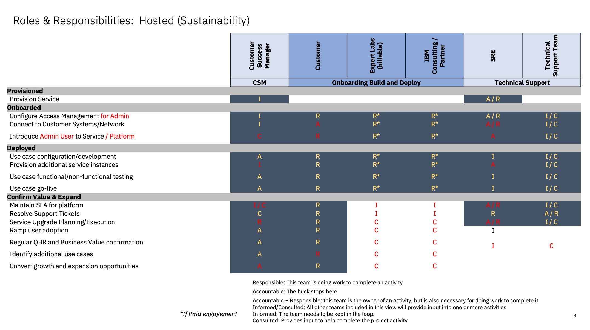
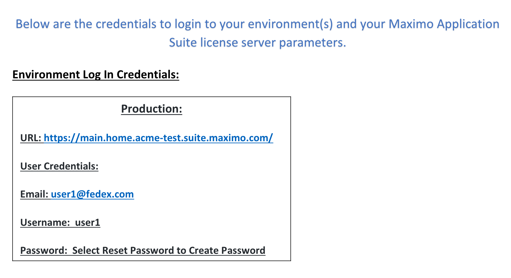
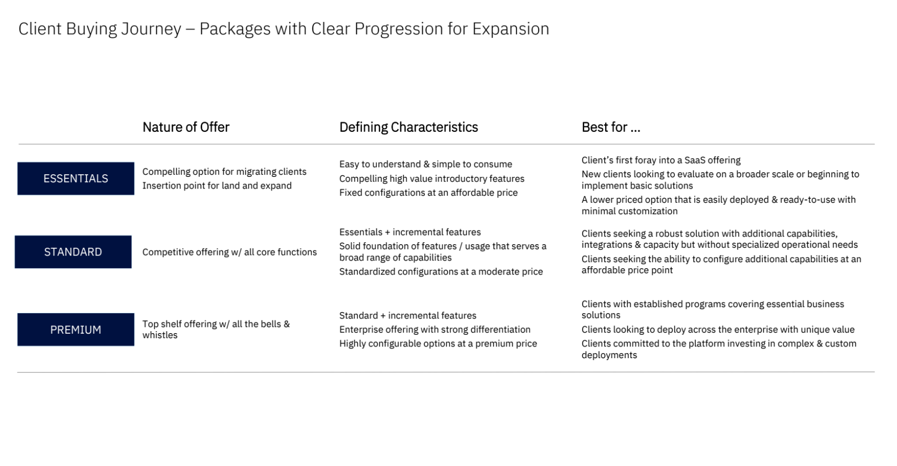
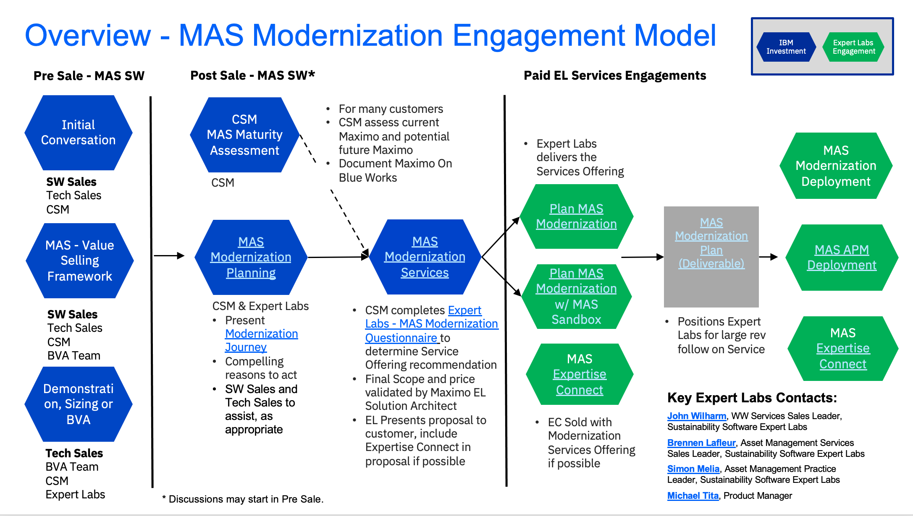

import {Link} from 'gatsby'

## Contacts

| WW contact | Name | WW contact | Name |
| --- | --- | --- | --- |
| **Customer Success Practice Leaders:** | Poornima Kallur | **Digital Customer Success & PLG:** | Chris Moran |
| **Technology Expert Labs Delivery:** | Simon Melia | **Technology Expert Labs Solution Engineering:** | Sourav Mazumder  |
| **SRE:** | Gur Auora | | |

<Row>
<Column colMd={9} colLg={9}>

## Overview
As a CSM, your focus is to guide your client in the adoption of the Maximo Application Suite (MAS) entitlement, from the initial deployment through expansion opportunities. Starting with the SRE’s provisioning and onboarding, you’ll monitor the activities through the deployment stage as the client moves into production. Beyond this initial go-live, you will work with the client to expand their product usage into additional modules, locations, business units, users, asset/work types or otherwise increase the AppPoint usage.

You can learn more about MAS on the <Link to='/common/ai-apps/csm-ai-maximo'>Maximo Application Suite Playbook page</Link>.

</Column>
</Row>

<Row>
<Column>

| FAQ | Answer |
| --- | --- |
| What is the relationship name in Gainsight? | Maximo Application Suite (SaaS) |
| Which Clouds does this product run on? | AWS  |
| How is MAS SaaS sizing calculated? | <a href='https://ibm.seismic.com/Link/Content/DCWDpXGfP636BGhX3pTbVQQFh388' target='_blank' rel='noreferrer noopener'>MAS SaaS sizing calculator</a>|
| Who can help my customer with billing/invoicing questions? | TBD |
| Where is the documentation? | <a href='https://www.ibm.com/mysupport/s/topic/0TO0z000000Zas8GAC/maximo-application-suite?language=en_US' target='_blank' rel='noreferrer noopener'>Maximo Application Suite documentation</a> |
| Are the SaaS capabilities different from the on-prem offering? | No |
| Is MAS SaaS consumable or ratable revenue? | Ratable |
| Who triggers deployment? | Manual at this time, with automation to determine first end-to-end work order |
| Where can I review MAS SaaS general FAQs? | <Link to='/common/ai-apps/csm-ai-maximo-saas/#MAS SaaS General FAQs'>MAS SaaS General FAQs</Link> |

</Column>
</Row>

<Row>
<Column colMd={9} colLg={9}>

### CSM Scorecard Milestones

SaaS milestones for the CSM Scorecard are based on usage. To progress from Planning to Deploying to Deployed, see <Link to='/common/saas-growth/#sustainability-software-saas-milestones-based-on-usage'>Sustainability software milestones based on usage</Link>.

<InlineNotification>

**Note:** The following usage-based milestones are not automated in Gainsight; the Growth Plan project stages will be used to determine milestone status. Deployed growth plans require a success plan review by a manager before being counted in the CSM scorecard.

</InlineNotification>

</Column>
</Row>

<Row>
<Column>

<Accordion>
<AccordionItem title="SaaS Adoption Journey Insights">
SaaS has an additional level of insights that are used to track the adoption journey. These provide an additional level of detail specifically for SaaS adoption.  For MAS, they are shown in the table below.

| 
Insight
 | 
Description
 |
| --- | --- | --- | --- |
| Paid Provisioned | Instance of Product is available |
| Paid Onboarded | Customer Admin User is able to create a user|
| Paid Deployed | First End-to-End Work Order is Completed |
| Paid Upgraded | Increase in AppPoint consumption|
| Paid Renewed | Customer has adopted and renewed |

</AccordionItem>
</Accordion>

### MAS Product Feature Adoption and Value Realized Indicators
Product Feature Adoption and Value Realized Indicators are instrumented in the product to show the capabilities and features that the customer is using. This information can be used to determine the level of adoption that has taken place and ensure that the customer is receiving full business value from the product. See below for novice, intermediate and advanced level indicators along with an asset listing the value proposition, expected benefits, considerations for implementation and metrics of success.
<Accordion>
<AccordionItem title="Novice level indicators">

| Product Feature | Description |
| --- | --- |
|  |   |
| Manage - Work Order| <a href='https://www.ibm.com/docs/en/mas-cd/maximo-manage/continuous-delivery?topic=tracking-working-work-orders' target='_blank' rel='noreferrer noopener'>Complete 100 Work Orders</a> |

</AccordionItem>

<AccordionItem title="Intermediate level indicators">

| Product Feature | Description |
| --- | --- |
| Mobile - Manage | <a href='https://www.ibm.com/docs/en/mas-cd/maximo-manage/continuous-delivery?topic=overview-maximo-mobile' target='_blank' rel='noreferrer noopener'>Complete workorder with Mobile</a> |
| Mobile - Inspection | <a href='https://www.ibm.com/docs/en/mas-cd/maximo-manage/continuous-delivery?topic=centers-managing-inspection-forms' target='_blank' rel='noreferrer noopener'>Complete an Inspection with mobile</a> |
| Manage - Inventory | <a href='https://www.ibm.com/docs/en/mas-cd/maximo-manage/continuous-delivery?topic=inventory-issues-transfers-returns-in' target='_blank' rel='noreferrer noopener'>Create Issues & Tranfers</a> |
| Manage - Job Plan | <a href='https://www.ibm.com/docs/en/mas-cd/maximo-manage/continuous-delivery?topic=plans-creating-job' rel='noreferrer noopener'>Create Job Plans</a> |
| Manage - PM | <a href='https://www.ibm.com/docs/en/mas-cd/maximo-manage/continuous-delivery?topic=module-preventive-maintenance' target='_blank' rel='noreferrer noopener'>Create PM</a>  |
| Manage - Inventory | <a href='https://www.ibm.com/docs/en/mas-cd/maximo-manage/continuous-delivery?topic=module-count-books' target='_blank' rel='noreferrer noopener'>Utilize CountBooks</a> |

</AccordionItem>

<AccordionItem title="Advance level indicators">

| Product Feature | Description |
| --- | --- |
| Manage - Scheduler | <a href='https://www.ibm.com/docs/en/mas-cd/maximo-manage/continuous-delivery?topic=view-creating-schedules' target='_blank' rel='noreferrer noopener'>Create a Schedule</a> |
| Manage - Purchase Order |  <a href='https://www.ibm.com/docs/en/mas-cd/maximo-manage/continuous-delivery?topic=module-purchase-orders' target='_blank' rel='noreferrer noopener'>Create a Purchase Order</a>|
| Manage - Contract | <a href='https://www.ibm.com/docs/en/mas-cd/maximo-manage/continuous-delivery?topic=manage-contracts-module' target='_blank' rel='noreferrer noopener'>Create a Contract</a> |
| Manage - Workflow | <a href='https://www.ibm.com/docs/en/mas-cd/maximo-manage/continuous-delivery?topic=workflows-workflow-overview' target='_blank' rel='noreferrer noopener'>Exact Definition Pending</a> |
| Manage - Inventory | <a href='https://www.ibm.com/docs/en/mas-cd/maximo-manage/continuous-delivery?topic=receiving-receipts-overview' target='_blank' rel='noreferrer noopener'>Material or service receipt</a> |

</AccordionItem>

</Accordion>

</Column>
</Row>

<Row>
<Column colMd={9} colLg={9}>

## Post-sales journey

As a CSM with a customer who has a MAS SaaS entitlement, it is your responsibility to help the customer adopt the product, bring use cases into production, and renew their subscriptions.

| CSM Coverage | Activities |
| --- | --- |
| CSM Architect | High touch nurture |
| Digital CSM | Low touch nurture |
| No CSM Coverage | Customer self-service |

The diagram shows the MAS SaaS post-sales journey at a high level. Each section is broken down in detail with links to assets below.
</Column>
</Row>

<Row>
<Column>

**PLG Customer Journey & RACI**

</Column>
</Row>

<Row>
<Column>

### Provisioned

| **Led by** | **Outcome** | **Assets & Activities** |
| --- | --- | --- |
| SRE | An environment exists.  No Customer access.    Provisioning takes an average of 10 days, for both Prod and Non-Prod Environments.    But if it's a MAS SaaS Premium Dedicated customer requesting a separate cluster, then it takes an additional 20 days for provisioning. Total time: 10 + 20 = 30days| After the Order is placed, it will be processed by Order Management.  Sometimes there are concerns with the Order, such as credit checks.  The Sales Representative will be deeply engaged with solving these issues, and progress it to Provisioning.  **Sizing and planning**  Identifying the Use Case that the customer wants to address with MAS should have been performed before the sale. The number of users and modules to be used should have already determined the configuration of the environment pre-sales, before the environment was provisioned.  Read through the <a href='https://ibm.seismic.com/Link/Content/DCpMhcBhDGDbH8qB88JVJF2T8G6j' target='_blank' rel='noreferrer noopener'>Maximo Application Suite License Overview Guide for Clients</a> or the <a href='https://ibm.seismic.com/Link/Content/DCWMFHfF2pPXT8cQ8BJP736G49Qj' rel='noreferrer noopener'>New MAS SaaS Pricing Tiers</a> document for an understanding of MAS AppPoints.  The <a href='https://ibm.seismic.com/Link/Content/DChB2R4P39Pm38TVX863Mp7bmJDV' target='_blank' rel='noreferrer noopener'>Maximo Application Suite AppPoint Calculator</a> is what is used to convert Maximo licenses to MAS AppPoints. There is a <a href='https://ibm.seismic.com/Link/Content/DCj92HjdDVC2VGTGcbVHTgPjHhjd' target='_blank' rel='noreferrer noopener'>demo on how to Use the AppPoint Calculator</a>| More information about how Maximo licenses upgrade to MAS AppPoints can be found in the <a href='https://ibm.seismic.com/Link/Content/DCMCJhGqbWBCQ8cPHVR399GDV67G' target='_blank' rel='noreferrer noopener'>Maximo Sales Enablement - Named vs Concurrent MAS App Points</a><br/ Provisioning takes an average of 10 days, then the Customer will be Onboarded, for both Prod and Non-Prod Environments.|

### Onboarded

| **Led by** | **Outcome** | **Assets & Activities** |
| --- | --- | --- |
| SRE | Customer has access to create a user. |Once the environment is provisioned, a <a href='https://ibm.ent.box.com/s/vus3oh6893lbe5hji8i4fs13u3yhs79d' target='_blank' rel='noreferrer noopener'>Welcome Letter</a> will be sent to the Customer (and the CSM if one is assigned) that provides links to  - <a href='https://www.ibm.com/docs/en/mas/saas?topic=getting-started' target='_blank' rel='noreferrer noopener'>Getting Started with Maximo Application Suite as a Service</a> website for informative information on how to manage the environment.  - <a href='https://learn.ibm.com/course/view.php?id=15641' target='_blank' rel='noreferrer noopener'>Maximo Application Suite SaaS Onboarding Administrative Tasks</a> free self led training on, as well as direct links to how to  - <a href='https://www.ibm.com/account/reg/us-en/signup?formid=urx-19776' target='_blank' rel='noreferrer noopener'>Create an IBM ID</a>  - <a href='https://www.ibm.com/docs/en/mas/saas?topic=getting-started#how-to-register-for-maximo-application-suite-support' target='_blank' rel='noreferrer noopener'>Register Product for IBM Support</a>  - <a href='https://www.ibm.com/docs/en/mas/saas?topic=getting-started#how-to-create-a-case' target='_blank' rel='noreferrer noopener'>How To Create a Support Ticket</a>  - <a href='https://www.ibm.com/docs/en/mas/saas?topic=getting-started#how-to-set-password-and-login-to-mas' target='_blank' rel='noreferrer noopener'>How To Set Password & Login To MAS</a>  - <a href='https://www.ibm.com/docs/en/mas/saas?topic=guide-client-communications-center-ccc' target='_blank' rel='noreferrer noopener'>Register for the Client Communication Center</a>  For Standard accounts > $100k on an exception basis, single one-off Onboarding Calls may be scheduled through SRE team, especially if the IBM Partner has not supported SaaS.  CSMs for these accounts can email Don Woodward, copying his manager Roy Haldenby for assistance.   Onboarding takes an average of 1 day after Provisioning, for both Prod and Non-Prod Environments.  **Customer Log In Information** The Customer will receive something like the below as part of the Welcome Letter and can access their instance with the credentials. |

</Column>
</Row>

<Row>
<Column>

### Deployed

| **Led by** | **Outcome** |
| --- | --- |
| CSM Architect (utilizing Billable Services if the customer has paid)/Digital CSM | The customer has implemented the work order module, and has completed one work order from end to end in the production environment.  Other features (as listed in the Intermediate and Advanced usage above) may or not be implemented at the same time.  |

</Column>
</Row>
<Row>
<Column>

| **Assets & Activities** |
| --- |
|**Understand the Edition that the Customer has Purchased**   Levels of service and capabilities differ across the available Editions. You can learn more about each Edition in the <a target='_blank' rel='noreferrer noopener' href="https://www.ibm.com/docs/en/mas/saas?topic=editions">IBM Maximo Application Suite SaaS - Editions</a> documentation. The <a target='_blank' rel='noreferrer noopener' href="https://www.ibm.com/docs/en/mas/saas?topic=editions-comparison-chart">IBM MAS SaaS - Edition Comparison Chart</a> presents the Editions available, and shows what is included now, and what will be included later for each Edition.    **Key Edition Differences**  - Premium Edition customers will have a customer coordinator and will have <a target='_blank' rel='noreferrer noopener' href="https://ibm.seismic.com/Link/Content/DCRcFVqjHFBQM8cPPC323RmDBXgB">Day 2 Support</a> from Expert Labs, and  - EAM to MAS Migration customers will have a customer coordinator for the migration period, regardless of Edition. -Note: Essential and Standard Editions have a pre-defined set of capabilities, which can be more readily supported.  **SaaS is Delivered through SRE**    The <a href='https://www.ibm.com/docs/en/mas/saas' target='_blank' rel='noreferrer noopener'>MAS SaaS Wiki Operations Guide</a> provides virtually any information a CSM or Customer would need to understand the product, including Service Components, Technical Support, Data Center Locations, Operations Support Locations, Maintenance, Roles & Responsibilities Matrix (RACI), Incident Management and RCA process, Client Request for RCA, IBM Support Guides  While in Deployment, you should follow the <a target='_blank' rel='noreferrer noopener' href="https://www.ibm.com/docs/en/mas/saas?topic=operations-guide#roles-responsibilities-matrix-raci">Roles & Responsibilities Matrix (RACI)</a> found in the wiki, if needed to inform the Customer on their responsibilities.  **Technical Deployment Activities**   These tasks are included in Deployment: - <a target='_blank' rel='noreferrer noopener' href="https://www.ibm.com/docs/en/mas/saas?topic=support-guide#saml-sso-configuration">Implementing SSO / LDAP / SAML</a> - <a target='_blank' rel='noreferrer noopener' href="https://www.ibm.com/docs/en/mas/saas?topic=support-guide#site-to-site-ipsec-vpn">VPN (if needed and ordered)</a> - <a target='_blank' rel='noreferrer noopener' href="https://www.ibm.com/docs/en/mas/saas?topic=support-guide#administrative-utilities-api-calls">API Keys needed</a> - <a target='_blank' rel='noreferrer noopener' href="https://www.ibm.com/docs/en/mas/saas?topic=support-guide#how-to-access-aws-s3-cloud-object-storage-buckets">DB access needed for integration (exceptional situations)</a> -Note: There are no license keys with the SaaS solution.  **Support**  Support for these should flow through the normal support procedures, except for: - Premium Edition customers who will have a customer coordinator, and  - EAM to MAS Migration customers who will have a customer coordinator for the migration period, regardless of Edition. <InlineNotification>If you have any SRE-related issues in Deployment, please follow the Support procedures, including Escalation and the <a href='https://ibm.enterprise.slack.com/archives/C05PA6AD1UM' target='_blank' rel='noreferrer noopener'>Sustainability Software Escalation Channel.</a>  You can get additional attention on urgent SRE needs through the <a href='https://ibm.enterprise.slack.com/archives/C04M143L9RC' target='_blank' rel='noreferrer noopener'>SRE Monitored Slack Channel.</a></InlineNotification>  **Technology Expert Labs Offerings**     **Expertise Connect Services**  Expertise Connect offers a continuous engagement model for clients to access technical guidance from TEL - Software deep technical expertise at a fraction of the cost of typical consulting engagements.    **Nurture opportunities**  After the Product Led Growth interface in Gainsight is configured later in 2024, you will be able to track the activities that the customer is performing in the MAS SaaS platform. This enables you to determine whether the customer needs additional assistance through their journey. For instance, if you see that the number of work orders dips, you can take action to see if there is a concern.   **Technology Expert Labs Engagement Model**  IBM Technology Expert Labs - Software is a great partner to help your clients successfully plan and migrate to MAS.  Expert Labs experts will help your client overcome their reservations about moving to a Red Hat OpenShift platform, by providing best practices for planning, implementing and Day 2 Operations so clients get the full benefit of MAS that is easier to manage with OpenShift.  Expert Labs has two offerings in this space - the "Maximo Application Suite (MAS) Modernization Plan and Design" and the "Maximo EAM to MAS Manage Migration Quick Win Offering," and can be engaged through the process below.    To learn more about the offerings, you can watch the Replay of the <a target='_blank' rel='noreferrer noopener' href="https://ec.yourlearning.ibm.com/w3/playback/10337975">MAS Modernization Product Launch Sales Enablement</a>.  In this session, the speakers shared how MAS will modernize and revolutionize your clients’ business. They’ll talk about how to have winning conversations around MAS, and why Technology Expert Labs is the insurance policy for MAS.   You can <a target='_blank' rel='noreferrer noopener' href="https://ibm.box.com/s/0sjrdb4md8bamm3ekhxrf9kc6whtbp43">review the overview presentation</a>   The first step is to engage your services sellers early in the opportunity.   Contact <a target='_blank' rel='noreferrer noopener' href="https://w3.ibm.com/#/people/937924897">John Wilharm</a>  or <a target='_blank' rel='noreferrer noopener' href="https://w3.ibm.com/#/people/093087649">Brennen Lafleur</a> if you are unsure of who your services seller is.  |

</Column>
</Row>

<Row>
<Column>

</Column>
</Row>

<Row>
<Column>

| **Deployed FAQs** | **Answers**
| --- | --- |
|How do I address license keys?| The Saas Products do not require the customer to work with license keys.|
|How do I set up connectivity between my Customer and the SaaS environment?| Establish a <a target='_blank' rel='noreferrer noopener' href="https://www.ibm.com/docs/en/mas/saas?topic=support-guide#site-to-site-ipsec-vpn">VPN (if needed and ordered)</a> |
| When will SSO be set up? | In Deployment, as it requires some degree of planning and design, maybe with a business partner.  Support should be through the Support team, or the Customer Coordinator for Premium Editions. |

</Column>
</Row>

<Row>
<Column>

### Confirm Value & Expand

| **Led by** | **Outcome** | **Assets & Activities** |
| --- | --- | --- |
| CSM Architect/Digital CSM + Sales | Customer has realized value and expanding usage | Expand usage to new 1) features, as noted in the Intermediate and Advanced Usage parameters above, 2) locations or business units, 3) assets or work types.
|   |   |The Maximo Maturity Assessment (MMA) is a ‘framework’ that allows you to engage your customers to deepen their understanding of their Maximo usage.  It is designed to provide an end-to-end view, including every MAS function, with details that guide the CSM through the process.  Through discussion, CSMs document status and collaborate on priorities to increase utilization, which increases value for our customers.<a href='https://ibm.box.com/s/4q3pzjk6663mhiypw0k944w82i9zaxfq' target='_blank' rel='noreferrer noopener'>The Maximo Maturity Assessment Guidebook</a> is designed to show you how to execute one of these assessments.|

### Renewed

| **Led by** | **Outcome** | **Assets & Activities** |
| --- | --- | --- |
|CSM Architect/Digital CSM + Renewal Rep + Sales | The client has confirmed that they are using the product and will continue to renew their entitlement. | N/A |

</Column>
</Row>

### MAS SaaS General FAQs

| MAS SaaS General FAQs | Answer |
| --- | --- |
| For upgrades will they be forced to take them when we push them out, and what if they need additional testing on their end?| <a href='https://www.ibm.com/docs/en/mas/saas?topic=editions-comparison-chart' target='_blank' rel='noreferrer noopener'>SaaS Editions Comparison Chart</a> |
| Where are the MAS SaaS data center locations? | <a href='https://www.ibm.com/docs/en/mas/saas?topic=operations-guide#data-center-locations' target='_blank' rel='noreferrer noopener'>SaaS Data Center locations</a> |
| Where can I find details on MAS SaaS Disaster Recovery options? | <a href='https://www.ibm.com/docs/en/mas/saas?topic=general-backups-disaster-recovery' target='_blank' rel='noreferrer noopener'>SaaS Backup and Recovery Details</a> |
| What are the High Availability and Disaster Recovery details for MAS SaaS by edition? | <a href='https://www.ibm.com/docs/en/mas/saas?topic=editions-comparison-chart' target='_blank' rel='noreferrer noopener'>SaaS Editions Comparison Chart</a> |
| For MAS SaaS premium customers, what is the RTO/RPO if they buy enhanced DR? | <a href='https://www.ibm.com/docs/en/mas/saas?topic=editions-premium' target='_blank' rel='noreferrer noopener'>MAS SaaS Premium Details</a>  - Current RTO/RPO is 72/24. When customers buy enhanced DR, they get an RTO of 6 hours and an RPO of 15 minutes, however, it is only available to clients who purchase Premium Edition with the non-shared cluster deployment option. They must purchase additional AppPoints to get Enhanced DR. The quantity of additional AppPoints varies with the size of the base deployment. Essentially, we have to stand up a second full production instance in a separate AWS data center. The larger the production instance, the more it costs to replicate it. |
| Where can I find MAS SaaS ADA compliance details? | <a href='https://www.ibm.com/docs/en/mas-cd/continuous-delivery?topic=overview-accessibility' target='_blank' rel='noreferrer noopener'>SaaS Accessibility Details</a> |
