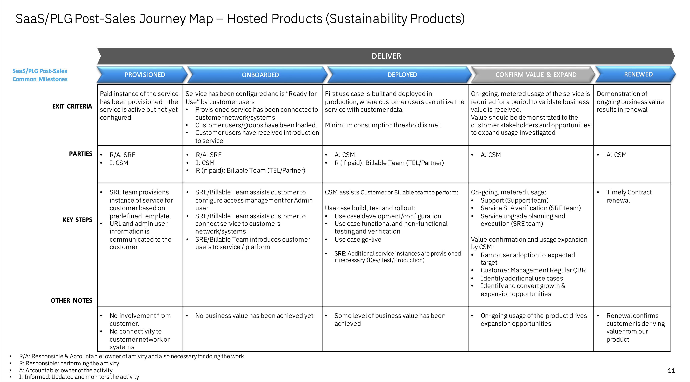

import {Link} from 'gatsby'

<InlineNotification kind="warning">

**Note: The <i>AUTOMATED</i> deployment metrics are pending sign-off and should be considered in progress until this notice is removed.**

The following considerations should be taken when reporting on SaaS deployments:
- All deployments for SaaS should follow the same process as non-SaaS / on-prem deployments
- Create one Growth Plan per use case
- Growth Plan project stages will be used to determine milestone status
- Deployed growth plans require a success plan review by a manager before being counted in the CSM scorecard
- All 3 deployment questions must be answered for the Growth Plan before being counted in the CSM scorecard

See below for detailed instructions on how to view the usage for your account.
</InlineNotification>

## Contacts

| WW contact | Name | WW contact | Name |
| --- | --- | --- | --- |
| **Customer Success Practice Leader:** | Mike Singleton | **Digital Customer Success & PLG:** | Chris Moran |
| **Technology Expert Labs Delivery:** | Brennen Lafleur  | **Technology Expert Labs Solution Engineering:** | Sourav Mazumder |
| **SRE:** | Ari Pampanwar |

<Row>
<Column colMd={9} colLg={9}>

## Overview

SaaS milestones for the CSM Scorecard are based on usage. To progress from Planning to Deploying to Deployed, see <Link to='/common/saas-growth/#sustainability-software-saas-milestones-based-on-usage'>Security milestones based on usage</Link>.

Refer to the <a href='https://pages.github.ibm.com/csm-playbook/playbook/common/acceleration-plays/tririga-play/' target='_blank' rel='noreferrer noopener'>TRIRIGA Acceleration Plays</a> page for the product overview, the pain points it addresses, what a CSM driven deployment looks like, and how to expand and grow a client’s TRIRIGA Application Suite SaaS usage.

</Column>
</Row>

<Row>
<Column>

| FAQ | Answer |
| --- | --- |
| What is the relationship name in Gainsight? | TRIRIGA Application Suite as a Service (as of 12 MAR 2024) |
| Which Clouds does this product run on? | IBM Cloud, AWS (both in development as of 12 MAR 2024) |
| How is SaaS usage calculated? | TBD |
| Who can help my customer with billing/invoicing questions? | TBD |
| Where is the documentation? | <a href='https://www.ibm.com/docs/en/tas' target='_blank' rel='noreferrer noopener'>TRIRIGA Application Suite Documentation</a> |
| Are the SaaS capabilities different from the on-prem offering? | TBD
| Is TRIRIGA Application Suite Essentials consumable or ratable revenue? | TBD |
| Who triggers deployment? | SRE |

</Column>
</Row>

<Row>
<Column colMd={9} colLg={9}>

### CSM Scorecard Milestones based on usage

SaaS milestones for the CSM Scorecard are based on usage. To progress from Planning to Deploying to Deployed, see <Link to='/common/saas-growth/#sustainability-software-saas-milestones-based-on-usage'>Sustainability software milestones based on usage</Link>.

</Column>
</Row>

<Row>
<Column>

TRIRIGA Application Suite SaaS pricing is currently TBD.

<Accordion>
<AccordionItem title="SaaS Adoption Journey Insights">
SaaS has an additional level of insights that are used to track the adoption journey. These provide an additional level of detail specifically for SaaS adoption.  For TRIRIGA Application Suite, they are shown in the table below

| 
Insight
 | 
Description
 |
| --- | --- | --- | --- |
| Paid Provisioned | TBD |
| Paid Onboarded | TBD |
| Paid Deployed | TBD |
| Paid Upgraded | TBD |
| Paid Renewed | Customer has adopted and renewed |
</AccordionItem>
</Accordion>

</Column>
</Row>

<Row>
<Column colMd={9} colLg={9}>

### TRIRIGA Application Suite SaaS Product Feature Adoption and Value Realized Indicators  
TRIRIGA Application Suite SaaS Product Feature Adoption and Value Realized Indicators will be instrumented in the product to show the capabilities and features that the customer is using (Currently TBD). This information can be used to determine the level of adoption that has taken place and ensure that the customer is receiving full business value from the product. See below for novice, intermediate and advanced level indicators along with an asset listing the value proposition, expected benefits, considerations for implementation and metrics of success.
</Column>
</Row>

<Row>
<Column>

<Accordion>
<AccordionItem title="Novice level indicators">

| Product feature | Description | Asset |
| --- | --- | --- |
| TBD | TBD | TBD |
</AccordionItem>

<AccordionItem title="Intermediate level indicators">

| Product feature | Description | Asset |
| --- | --- | --- |
| TBD | TBD | TBD |
</AccordionItem>

<AccordionItem title="Advanced level indicators">

| Product feature | Description | Asset |
| --- | --- | --- |
| TBD | TBD | TBD |
</AccordionItem>

</Accordion>

</Column>

</Row>

<Row>
<Column colMd={9} colLg={9}>

## Post-sales journey  
As a CSM, your focus is to digitally welcome and nurture your customers who have TRIRIGA Application Suite SaaS entitlements.

| CSM Coverage | Activities |
| --- | --- |
| CSM Architect | High touch nurture |
| Digital CSM | Low touch nurture |
| No CSM Coverage | Customer self-service |

The diagram shows the TRIRIGA Application Suite post-sales journey at a high level. Each section is broken down in detail with links to assets below.

</Column>
</Row>

<Row>
<Column>

### Provisioned

| **Led by** | **Outcome** | **Assets & Activities** |
| --- | --- | --- |
| TBD |  TRIRIGA Application Suite SaaS instance provisioned and the customer has access. | TBD |

### Onboarded

| **Led by** | **Outcome** | **Assets & Activities** |
| --- | --- | --- |
| TBD | Customer has validated access to their TRIRIGA Application Suite SaaS instance using their IBMid.     After the TRIRIGA Application Suite SaaS instance has been provisioned, a customer can access their instance URL.    By default, the IAM for the instance is configured with IBM Verify and using IBMid.  A customer can configure the instance to use a different access management system but will need to work with support. | TBD |

### Deployed

| **Led by** | **Outcome** | **Assets & Activities** |
| --- | --- | --- |
| TBD | The client has implemented at least one use case and is receiving value. | TBD |

### Confirm Value & Expand

| **Led by** | **Outcome** | **Assets & Activities** |
| --- | --- | --- |
| CSM Architect/Digital CSM | Customer has realized value and expanding usage to new business use cases | **Nuture relationship**   Set up an <a href='https://pages.github.ibm.com/csm-playbook/playbook/onboard/executive-business-review/' target='_blank' rel='noreferrer noopener'>EBR (executive business review)</a> with client sponsor and executives to align and review the adoption, value seen and confirm the customer's strategic goals have been met.    **Identify risk/opportunity**     **Expand solution**   A CSM should continue to drive usage of Technology Expert Labs services and look for opportunities to add more use cases using the <a href='https://pages.github.ibm.com/csm-playbook/playbook/common/acceleration-plays/tririga-play/' target='_blank' rel='noreferrer noopener'>TRIRIGA acceleration plays</a>. |

### Renewed

| **Led by** | **Outcome** | **Assets & Activities** |
| --- | --- | --- |
| CSM Architect/Digital CSM + Renewal Rep + Sales | The client has confirmed that they are using the product and will continue to renew their TRIRIGA Application Suite SaaS entitlement. | N/A |

</Column>
</Row>
