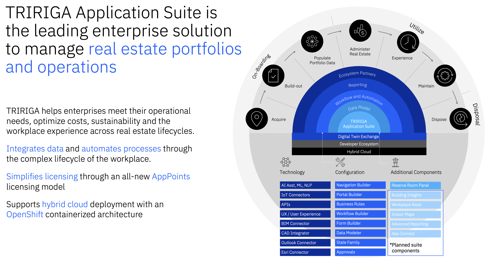

import {Link} from 'gatsby'

<AnchorLinks small>
<AnchorLink>TRIRIGA/TAS Announcements</AnchorLink>
<AnchorLink>What is TRIRIGA Application Suite and what does it do?</AnchorLink>
<AnchorLink>What pain points does TRIRIGA address?</AnchorLink>
<AnchorLink>There isn't a current use case, where do I start?</AnchorLink>
<AnchorLink>What do CSM-driven engagements look like?</AnchorLink>
<AnchorLink>What are the steps to deploy and who is responsible for what, when?</AnchorLink>
<AnchorLink>How do I get support for my TRIRIGA customer?</AnchorLink>
<AnchorLink>How do I get support for my TRIRIGA FedRAMP customer?</AnchorLink>
<AnchorLink>How do I expand and grow TRIRIGA usage?</AnchorLink>
<AnchorLink>Frequently asked questions</AnchorLink>
</AnchorLinks>

<Row className="resource-card-group">

<Column colMd={4} colLg={4} noGutterSm>
<ResourceCard
      subTitle="Take customers from legacy IBM TRIRIGA to IBM TRIRIGA Application Suite (TAS) running on Red Hat OpenShift"
      title="TRIRIGA modernization"
      href="/common/ai-apps/csm-tririga-modernization/">

</ResourceCard>

</Column>

<Column colMd={4} colLg={4} noGutterSm>
<ResourceCard
      subTitle="Expand client use of TRIRIGA with new use cases"
      title="TRIRIGA acceleration"
      href="/common/acceleration-plays/tririga-play/">

</ResourceCard>

</Column>

<Column colMd={4} colLg={4} noGutterSm>
<ResourceCard
      subTitle="Guide the client from provisioning to onboarding, help with the use case, and expand the use cases"
      title="TRIRIGA SaaS"
      href="/common/ai-apps/csm-ai-tas-saas/">

</ResourceCard>

</Column>
</Row>

<Row>
<Column colMd={8} colLg={8} noGutterMdLeft>

## TRIRIGA/TAS Announcements  

<Accordion>
<AccordionItem title='New Releases'>

Platform 4.5 and application 11.5 are the latest long term support (LTS) releases 

Read through the summary of <a href='https://ibm.box.com/s/dwlhrsig6zueqxp9qfrvzr179acndegu' target='_blank' rel='noreferrer noopener'>What’s New in TAS/TRIRIGA 4.5.3/11.5.1 Fixpack</a> 

Platform 4.6 and application 11.6 "Athena" release is targeted for end of 3Q 2024.  This is expected to be the next LTS release 

Go here to find <a href='https://www.ibm.com/support/pages/node/1275142' target='_blank' rel='noreferrer noopener'>Release Notes for TRIRIGA Products</a> 

</AccordionItem>

<AccordionItem title='Software Fixes'>

Review the weekly update for the <a href='https://ibm.box.com/s/bbdh38kxr03bcdhi5sdfvovcr1t57j3q' target='_blank' rel='noreferrer noopener'>version and fix release schedule</a> 

Read through the summary of <a href='https://ibm.box.com/s/dwlhrsig6zueqxp9qfrvzr179acndegu' target='_blank' rel='noreferrer noopener'>What’s New in TAS/TRIRIGA 4.5.3/11.5.1 Fixpack</a> 

Platform fixpack for 4.1.3 targeted for release end of 3Q 2024.  This contains HCACHE fixes for CVS 

Platform fixpack for 3.7.0.2 itargeted for release end of 3Q 2024.  This contains a total of 40 fixes identified including all the HCACHE fixes 

LA fixpacks for 4.3.2, 4.1.3, 4.0.4 targeted for release end of 3Q 2024 

</AccordionItem>

<AccordionItem title='End of Support/End of Marketing'>

IBM TRIRIGA to drop support for traditional WebSphere Application Server in a future release.
See the Support communication <a href='https://www.ibm.com/support/pages/node/7003917?myns=swgtiv&mynp=OCSSFCZ3&mync=E&cm_sp=swgtiv-_-OCSSFCZ3-_-E' target='_blank' rel='noreferrer noopener'>HERE</a> 

Early End of Support (EOS) Announcement for TRIRIGA application version 10.7.x Platform version 3.7.x and CAD Integrator 12.7.  EOS date 30-Sep-2024.  View the EOS announcement <a href='https://community.ibm.com/community/user/asset-facilities/blogs/paul-lacey/2023/09/25/end-of-support-announcement-eos-for-tririga-107-10?CommunityKey=8535e294-83a9-4f44-803f-debcab4ca493' target='_blank' rel='noreferrer noopener'>HERE</a> 
 

Early End of Support (EOS) Announcement for TRIRIGA application version 10.8, Platform version 3.8, and CAD Integrator 12.8.  EOS date 30-Apr-2025.  View the EOS announcement <a href='https://community.ibm.com/community/user/asset-facilities/blogs/paul-lacey/2023/09/25/end-of-support-announcement-eos-for-tririga-107-10?CommunityKey=8535e294-83a9-4f44-803f-debcab4ca493' target='_blank' rel='noreferrer noopener'>HERE</a> 
 

TRIRIGA Assistant is no longer supported, EOM was announced in 1Q 2024.  For customers or partners interested in similar capabilities, engage Client Engineering to look at ways watsonx Assistant can be used to build a solution.  Contact @Samantha O'Neill, Product Manager, for more information.

For additional details on TRIRIGA versions under support and planned EOS dates, review the <a href="https://www.ibm.com/support/pages/lifecycle/search?q=tririga" target='_blank' rel='noreferrer noopener'>IBM Support TRIRIGA Support Lifecycle pages</a>  

</AccordionItem>

<AccordionItem title='Maintenance Scheduled Downtime'>

Review the <a href="https://ibm-cds.atlassian.net/wiki/spaces/ICDSW/pages/1909555201/2024+Maintenance+Calendar" target='_blank' rel='noreferrer noopener'>TRIRIGA SaaS Maintenance Downtime Schedule</a>  

Review the <a href="https://ibm.box.com/s/5j3d8pm2239lq4nzgwc1rk7ut67ssi11" target='_blank' rel='noreferrer noopener'>TRIRIGA FedRAMP Maintenance Downtime Schedule</a>  

</AccordionItem>

</Accordion>

____________________

## What is TRIRIGA Application Suite and what does it do?  

Data and AI are increasingly critical tools in how organizations are evolving their facilities management. IBM® TRIRIGA® is an intelligent asset management solution for integrated workplace management systems (IWMS) that equips you to meet the needs of modern facility management.

<a href="https://ibm.biz/BdPdG5" target='_blank' rel='noreferrer noopener'>TRIRIGA Application Suite Documentation</a>
 
<a href="https://www.ibm.com/support/pages/node/1283650" target='_blank' rel='noreferrer noopener'>Compatibility Matrix Page for TRIRIGA Products</a>
 
<a href="https://ibm.biz/BdPdnr" target='_blank' rel='noreferrer noopener'>TRIRIGA Application Suite AppPoint Calculator</a>
 

## What do CSM-driven engagements look like?

**TRIRIGA is not a DIY or CSM deployed type of solution.  Deployments should be led by IBM Consulting or a qualified Ecosystem implementation partner.**

* See <a href="/onboard/csm-partner-ecosystem" target='_blank' rel='noreferrer noopener'>Working with IBM Partners</a>

* Explore a <a target='_blank' rel='noreferrer noopener' href="https://ibm.seismic.com/Link/Content/DCdMdgBBB66bW8MBj9D2pPM3mC4G">List of IBM partners</a>

* Conduct a project phase review using the <a href="https://ibm.box.com/s/spb264sg0k8uic3xkcg4jg44eg2m7716" target='_blank' rel='noreferrer noopener'>Customer Project Review Template</a>

* Learn all about how to <a href="https://pages.github.ibm.com/csm-playbook/playbook/onboard/executive-business-review/" target='_blank' rel='noreferrer noopener'>Hold an EBR periodically to align with client executives</a>

* Prepare for an Executive Business Review by downloading the <a href="https://pages.github.ibm.com/csm-playbook/playbook/files/EBR-Sample-Template-01142023.pptx" target='_blank' rel='noreferrer noopener'>Executive Business Review Template</a>

## What are the steps to deploy and who is responsible for what, when?
We look at "deployment" in two phases, Installation and Implementation.

**Installation**
There are three options for licensing and deploying TRIRIGA’s suite of applications.  Enterprises can continue to deploy On-Premise running TRIRIGA on their own servers.  SaaS will remain an option running on IBM Cloud.  IBM provides a new flexible deployment and consumption model through the TRIRIGA Application Suite.   Depending on which model, the roles will vary.

**Implementation**
Installation of the software is only the beginning of deployment.   The complexity and duration of that deployment will vary depending on what features and functions are being rolled out. IBMers and   Business Partners who know TRIRIGA will commonly refer to this as “implementation.”

Within each phase of implementation there are activities, tasks, and deliverables that are tailored to meet each client’s needs. Each Business Partner, as well as IBM Consulting, has a specific view of how to do this implementation, but a brief description of each of the six generic phases of a TRIRIGA implementation is outlined below.

**Launch / Prepare** 
*Purpose* Kickoff project, Initial Phase 
*Do* Finalize the core and expanded project team

1. Establish project team working environment
2. Establish Steering Committee participants, roles, schedules
3. Engage the business leaders and stakeholders
4. Meet with the client exec sponsor and key team members to validate and discuss key aspects
5. Conduct Implementation Team Training as necessary
6. Finaliaxze the project work plan including individual task lists and resource assignments
7. Collect and review existing project related materials
8. Establish the project standards and tools
9. Develop High Level project plans and strategies (training, quality, risk, change, etc)
10. Conduct the Project Kick Off meeting
11. Conduct infrastructure workshop
12. Install TRIRIGA or TAS and create the required environments

**Design** 
*Purpose* Leverage best practice methods provided by TRIRIGA/TAS functionality and inherent capabilities to re-design processes and organizational alignment 
*Do* Conduct Business Process Workshops

1. Develop Functional and Technical Specifications
2. Conduct Integration workshops
3. Conduct Report Workshop, prioritize reports and develop Report Specifications
4. Conduct Data Workshop, determine data strategy

**Configure** 
*Purpose* Develop, Integrate, and Unit Test all applicable components of the solution 
*Do* Tailor / Configure TRIRIGA or TAS according to Design phase requirements and specifications

1. Develop / Configure workflows
2. Develop integrations per Design Specifications
3. Develop data migration scripts / configure data loading tools to load data from the various sources and conduct test loads
4. Develop Reports according to Design phase specifications based on priorities defined in the Design Phase
5. Assist in developing test scenarios and scripts
6. Jointly (Implementation Team and Client) create training materials (role-based)
7. Conduct Train the Trainer sessions
8. Continue performance tuning

**Verify / Test** 
*Purpose* To conduct System, Integration, and User Acceptance testing of all components of the solution 
*Do* Conduct System Testing

1.	Conduct Integration Testing
2.	Assist Client with User Acceptance Testing
3.	Conduct Regression Testing

**Deploy** 
*Purpose* To move the system into production and provide support during the transition period 
*Do* Deploy the solution in accordance with the rollout plan

1.	Migrate from Test / QA to Production environment
2.	Cutover to Production
3.	Short term production support

**Stabilize** 
*Purpose* To maintain the solution throughout its life 
*Do* Long term support

1.	Patches / Upgrades
2.	Grow / Expand into new functionality
3.	Could be IBM support or Client supported

## There isn't a current use case, where do I start?
**If you're starting from scratch you can go as informal as walking through the TRIRIGA Maturity Assessment with your customer or you can arrange a use case discovery session with Client Engineering or an IBM Garage Framing Session.**

**The TRIRIGA Maturity Assessment is a framework that allows you to engage your customer to deepen understanding of their business in order to discover TRIRIGA use cases. It is designed to provide an end-to-end view, including every TRIRIGA function, with details that guide the CSM through the process.**

**Through discussion, CSMs document current state and desired future state.  Then they collaborate on priorities to identify near- and long-term use case needs with a focus on quick wins to demonstrate business value early and often to the client.  The TRIRIGA Maturity Assessment can be revisited after each use case is deployed to review and reprioritize existing and any newly discovered use cases.**

* The <a target='_blank' rel='noreferrer noopener' href="https://ibm.box.com/s/o758ppmv8an0qayhiqo6iz2r6118t13k">TRIRIGA Maturity Assessment Guidebook</a> helps you learn how to conduct one of these assessments.

* Review the <a target='_blank' rel='noreferrer noopener' href="https://ibm.box.com/s/u9ckqpcvy6zki625pfrcw4aca2g5gn90">TRIRIGA Maturity Assessment Customer Engagement Presentation</a> to help you explain the assessment process to your customer.

* Refer to the <a target='_blank' rel='noreferrer noopener' href="https://ibm.box.com/s/nfzzbnvg61z922681vm6kfdbiyzsr4an">How to Setup Your BlueWorks Live Assessment Space document</a> to prepare the template for your assessment.

* How you can prove the business value of the TRIRIGA solution to your customer? <a target='_blank' rel='noreferrer noopener' href="https://pages.github.ibm.com/csm-playbook/playbook/onboard/business-outcomes-framework/ ">Review the Business Value Framework</a>

* Learn how to arrange a <a target='_blank' rel='noreferrer noopener' href="https://pages.github.ibm.com/csm-playbook/playbook/use-case-discovery/#what-is-a-use-case-discovery-session">Use Case discovery Session with Client Engineering</a>

* Learn how to arrange an <a target='_blank' rel='noreferrer noopener' href="https://w3.ibm.com/services/lighthouse/spaces/view/sustainability/ibm-garage-for-sustainability">IBM Garage Framing Session</a>

## How do I get support for my TRIRIGA customer?

<Link to="/common/support/access-ibm-support" target='_blank' rel='noreferrer noopener'>IBM Support Resources</Link>
 
<Link to="https://www.ibm.com/support/pages/node/738883" target='_blank' rel='noreferrer noopener'>IBM Support Options for On-Premise Software</Link>
 
<Link to="https://ibm.box.com/s/wis18wej63b6njjcccycp6ulgwvzhwuc" target='_blank' rel='noreferrer noopener'>IBM Software Customer Support Quick Start Guide</Link>
 
<a href="https://ibm.ent.box.com/s/iu4iwcj0sf2faoohcanhbjl7e79rlchn" target='_blank' rel='noreferrer noopener'>Tech Sales and CSM Internal Support Guide</a>
 
<a href="https://ibm-cds.atlassian.net/wiki/spaces/ICDSW/pages/32959/Welcome+to+IBM+Cloud+Delivery+Services+CDS" target='_blank' rel='noreferrer noopener'>SRE/CDS Wiki for TRIRIGA SaaS</a>
 
<a href="https://ibm.box.com/s/0tr3zn4914qr1hhfl6aax2fszbc2a9si" target='_blank' rel='noreferrer noopener'>IBM Cloud SaaS Customer Quick Start Guide</a>
 
<a href="http://www.ibm.com/terms/?id=i126-6781" target='_blank' rel='noreferrer noopener'>Services Descriptions and SLAs for TRIRIGA On Cloud</a>
 
<a href="http://www.ibm.com/terms/?id=i126-8817" target='_blank' rel='noreferrer noopener'>Services Descriptions for IBM Cloud Services TRIRIGA Service Offerings</a>
 
<a href="https://ibm.box.com/s/g33vhsj6jlk78cvgvsedjwyxvomu0hh7" target='_blank' rel='noreferrer noopener'>How to Join the TRIRIGA User Group Community</a>
 
<a href="https://ibm.box.com/s/06mk68lloesacpvrffb0wgo8vosfe3db" target='_blank' rel='noreferrer noopener'>Review the Continuous Delivery Support Model</a>
 
<a href="https://ibm.box.com/s/0lm6l0t4b9qirm8heg1qsr2un7epoihz" target='_blank' rel='noreferrer noopener'>Customer-Facing Continuous Delivery Recommendations One-Pager</a>
 
<a href="https://www.ibm.com/support/pages/node/1282306" target='_blank' rel='noreferrer noopener'>TRIRIGA Supported Versions and EOS Dates</a>
 
<a href="https://ibm.box.com/s/txwartu9415jcn2ptrlqwk8h00pror6z" target='_blank' rel='noreferrer noopener'>Support Engagement Template For New TRIRIGA Customers</a>
 
<a href="https://www.ibm.com/support/pages/how-provide-must-gather-tririga-support-cases" target='_blank' rel='noreferrer noopener'>How to Provide Must Gather Details for TRIRIGA Support Cases</a>
 
<a href="https://ibm.box.com/s/fj0u0m8uyk0uohvpychlc7qaefls663m" target='_blank' rel='noreferrer noopener'>How to Collect TRIRIGA Usage Reporting Metrics</a>
 
<a href="https://ibm.box.com/s/ujyovx9gcnrteurum8te75pz66iecrlj" target='_blank' rel='noreferrer noopener'>How to Escalate an IBM Support Case</a>
 

Go here to create a <a href="https://pasterns1.fyre.ibm.com:8087/#/open" target='_blank' rel='noreferrer noopener'>Proactive Support Alert</a> to advise the Support team about critical upcoming customer activities such as go-live dates, weekend coverage, etc.
 
<a href="https://www-112.ibm.com/software/howtobuy/passportadvantage/homepage/ecarec" target='_blank' rel='noreferrer noopener'>How to Get Passport Advantage Support</a>
 
<a href="https://www.ibm.com/software/passportadvantage/pao_customer.html" target='_blank' rel='noreferrer noopener'>Where do customers sign in or request access to Passport Advantage Online</a>
 
<a href="https://www.ibm.com/software/passportadvantage/pao_download_software.html" target='_blank' rel='noreferrer noopener'>Where do Passport Advantage customers go to download software</a>
 
<a href="https://www.ibm.com/software/passportadvantage/pao_account_management.html" target='_blank' rel='noreferrer noopener'>Where do Passport Advantage customers go to manage their account access</a>
 
<a href="https://access.redhat.com/support/escalation" target='_blank' rel='noreferrer noopener'>How to submit or escalate a case for TRIRIGA Application Suite Red Hat Support</a>
 
<a href="https://ibm.box.com/s/ww0se9q2e1pdcoau78p7ligbacv2kabk" target='_blank' rel='noreferrer noopener'>Review instructions on how customers should access their container software</a>
 
<a href="https://www.ibm.com/support/pages/node/7008589" target='_blank' rel='noreferrer noopener'>Learn how customers can get IBM Extended Support when they can't upgrade in time for end of support</a>
 

Q: Can TRIRIGA customers can get IBM Sustained Support?   A: TRIRIGA currently doesn't have a need for Sustained Support as we have not announced a full EOL of the traditional TRIRIGA on-prem licensing. Sustained Support is only offered once a product has reached its EOL and there is only one version left to sustain.  Once we get to the point where traditional TRIRIGA has its EOL announced, with the intention of everyone moving to TAS (or a SaaS equivalent), then sustained support comes into play.
 
 

## How do I get support for my TRIRIGA FedRAMP customer?
<a href="https://ibm.box.com/s/0gw2o2k7w7xy6lpsobtrdmej6wycb4n5" target='_blank' rel='noreferrer noopener'>Sample FedRAMP Customer Welcome Email</a>
 
<a href="https://ibm.box.com/s/0o12atn5ktzdce7xzzjxnhmawla18ux2" target='_blank' rel='noreferrer noopener'>FedRAMP Self-Service Portal Request Guide</a>
 
<a href="https://ibm.box.com/s/in6yfhaf9l4h93nyiovs5ccvy5y55xuj" target='_blank' rel='noreferrer noopener'>FedRAMP Operations and Support Guide</a>
 
<a href="https://ibm.box.com/s/9v6zybej2mo9ahgyke4szof6dzjluv5k" target='_blank' rel='noreferrer noopener'>FedRAMP User Account Request Form</a>
 
<a href="https://ibm.box.com/s/5j3d8pm2239lq4nzgwc1rk7ut67ssi11" target='_blank' rel='noreferrer noopener'>FedRAMP Maintenance Schedule</a>
 
 

## How do I expand and grow TRIRIGA usage?
** You can go as informal as walking through the TRIRIGA Maturity Assessment with your customer or as formal as a Client Engineering use case discovery session or a Business Value Analysis **

**The TRIRIGA Maturity Assessment is a framework that allows you to engage your customer to deepen understanding of their TRIRIGA usage. It is designed to provide an end-to-end view, including every TRIRIGA function, with details that guide the CSM through the process.**

**Through discussion, CSMs document status and collaborate on priorities to increase utilization, which increases value for our customers, and potentially additional revenue for IBM.  The TRIRIGA Maturity Assessment can be revisited after each use case is deployed to review and reprioritize existing and any newly discovered use cases.**

* The <a target='_blank' rel='noreferrer noopener' href="https://ibm.box.com/s/o758ppmv8an0qayhiqo6iz2r6118t13k">TRIRIGA Maturity Assessment Guidebook</a> helps you learn how to conduct one of these assessments.

* Review the <a target='_blank' rel='noreferrer noopener' href="https://ibm.box.com/s/u9ckqpcvy6zki625pfrcw4aca2g5gn90">TRIRIGA Maturity Assessment Customer Engagement Presentation</a> to help you explain the assessment process to your customer.

* Refer to the <a target='_blank' rel='noreferrer noopener' href="https://ibm.box.com/s/nfzzbnvg61z922681vm6kfdbiyzsr4an">How to Setup Your BlueWorks Live Assessment Space document</a> to prepare the template for your assessment.

* How you can prove the business value of the TRIRIGA solution to your customer? <a target='_blank' rel='noreferrer noopener' href="https://pages.github.ibm.com/csm-playbook/playbook/onboard/business-outcomes-framework/ ">Review the Business Value Framework</a>

* Learn how to arrange a <a target='_blank' rel='noreferrer noopener' href="https://pages.github.ibm.com/csm-playbook/playbook/use-case-discovery/#what-is-a-use-case-discovery-session">Use Case discovery Session with Client Engineering</a>

* Learn how to arrange an <a target='_blank' rel='noreferrer noopener' href="https://w3.ibm.com/services/lighthouse/spaces/view/sustainability/ibm-garage-for-sustainability">IBM Garage Framing Session</a>

* Visit the <a target='_blank' rel='noreferrer noopener' href="https://pages.github.ibm.com/csm-playbook/playbook/common/acceleration-plays/tririga-play/">TRIRIGA Play Page</a> for winning conversations around expanding your customer's use of TRIRIGA.

</Column>

<Column colMd={4} colLg={4} noGutterMdLeft>

 

<Aside>

**Customer Success Practice Leader:** Mike Singleton (@msingleton) 
**CSM Slack Channel:** <a href='https://ibm-cloud.slack.com/archives/C01J5Q8C5HA' target='_blank' rel='noreferrer noopener'>#sustainability_sw_csms</a> 
**Practice Leader Overiew:** <a href='https://w3.ibm.com/w3publisher/customersuccess/community-connections/sustainability-software-community/asset-management-tririga' target='_blank' rel='noreferrer noopener'>About the Sustainability Software TRIRIGA Community</a>
</Aside>
<Aside>

**Learn:** <a href='https://community.ibm.com/community/user/asset-facilities/communities/tririga-home' target='_blank' rel='noreferrer noopener'>Explore the IBM Asset & Facilities Management Community</a> 
**Product team:** <Link to="https://ibm.box.com/s/yujveelw2prtqk5yj9irjmign78lda0b" target='_blank' rel='noreferrer noopener'>Who's who in TRIRIGA Product Management</Link> 
**Product pages:** <a href="https://w3.ibm.com/systems/productpages" target='_blank' rel='noreferrer noopener'>Review the TRIRIGA product details page</a> 
**Product support:** <Link to="https://pages.github.ibm.com/csm-playbook/playbook/common/support/ibm-support-programs" target='_blank' rel='noreferrer noopener'>Support for Sustainability Software</Link> 
**Marketing:** <a href="https://www.ibm.com/products/tririga">IBM TRIRIGA marketing page</a> 
**Docs:** <a href="https://www.ibm.com/support/knowledgecenter/SSFCZ3">IBM TRIRIGA documentation</a> + <a href="https://www.ibm.com/docs/en/tap" target='_blank' rel='noreferrer noopener'>TRIRIGA Application Platform documentation</a>  
**Community:** <a href="https://community.ibm.com/community/user/asset-facilities/communities/tririga-home">Explore the IBM Asset & Facilities Management Community</a> 
**Demo:**<a href='https://ibm.seismic.com/Link/Folder/DCdfcc8d6' target='_blank' rel='noreferrer noopener'>Recorded demos and instructions</a> 
**Roadmap:**<a href='https://ibm.box.com/s/t6jy5n7v2gpahp6kwo7ntru1kclbu25z' target='_blank' rel='noreferrer noopener'>Review the INTERNAL Roadmap deck</a> + <a href="https://ibm.box.com/s/c47ss17n3yv4b0dk2wtddzuwdzquddj2" target='_blank' rel='noreferrer noopener'>Download the CUSTOMER-SHAREABLE roadmap deck</a> + <a href="https://ibm.box.com/s/pjtdik838xueaxiyw07mc0sed8pxv8ev" target='_blank' rel='noreferrer noopener'>View the Product Team roadmap presentation replay</a> 
**Seismic:**<a href='https://ibm.seismic.com/Link/Folder/DC88d7a76' target='_blank' rel='noreferrer noopener'>Sales Kit</a> with Presentations and Pre-sales assets 
**Tech Zone:**<a href='https://techzone.ibm.com/search?searchbox=%22tririga%22&StatusFilter=Active&VisibilityFilter=%5B%22IBMers%22%5D' target='_blank' rel='noreferrer noopener'>TRIRIGA in Tech TechZone</a> 
**Deployment options:**<a href='https://ibm.seismic.com/Link/Content/DCjQ38F2V7jPJGhTP6dGGPGM9m2B' target='_blank' rel='noreferrer noopener'>TAS INTERNAL Packaging, Pricing and Licensing Guide</a>
**Compare:**<a href='https://ibm.box.com/s/wkxxf8vz4qb6ywwtsdcyjju68efwx0q9' target='_blank' rel='noreferrer noopener'>TRIRIGA offerings and deployment options</a>
<a href="https://ibm.seismic.com/Link/Content/DCf34QqJFf4cgGQ2P63HHd8DMpb8" target='_blank' rel='noreferrer noopener'>INTERNAL Guidelines for Packaging-Pricing-Licensing of TRIRIGA </a> 
</Aside>
<Aside>

**Build your skills**

<a href="https://www.ibm.com/training/search?query=tririga" target='_blank' rel='noreferrer noopener'>TRIRIGA Training Courses</a>
<a href="https://ibm.seismic.com/app?FolderId=b8eed77#/search?appType=DocCenter&keyword=TAS%2520new%2520release%2520enablement&contentType=All%20Documents&selectedProperties=ContentProfiles%3AIBM%2520Business%2520Partners%3BOffering%20Name%3ATRIRIGA%2520Application%2520Suite%3B&folderId=&folderName=&fromAppType=&currentTeamSiteId=&sharedTeamSiteId=&pageIndex=0&ranking=&strategy=" target='_blank' rel='noreferrer noopener'>TAS new release technical enablement</a>
 

</Aside>
<Aside>

**Installing TRIRIGA**
<a href="https://www.ibm.com/docs/en/tas/11.5?topic=installing" target='_blank' rel='noreferrer noopener'>Installing TRIRIGA Application Suite - Documentation</a>
 
</Aside>

<Aside>

**Business Outcomes**

<a href='https://ibm.box.com/s/xiaftlaz7w1qlynp3w4w1kg7j9ldi6pp' target='_blank' rel='noreferrer noopener'>TRIRIGA metrics</a> 
<a href='https://ibm.box.com/s/ruoujc5q7mzo5jyr9pr6i81wasb3ea0h' target='_blank' rel='noreferrer noopener'>TRIRIGA calculator</a> 
<a href='https://ibm.box.com/s/iqu0td55xyg8v261uefx1pftounb67im' target='_blank' rel='noreferrer noopener'>TRIRIGA workshop</a>

</Aside>

</Column>
</Row>

<Row>

<Column>

_____________________________

## Frequently asked questions

* What does a TRIRIGA Application Platform upgrade look like? <a href="https://ibm.box.com/s/um7zwllo9edafy3ou7axrx4jod3kvk4d" target='_blank' rel='noreferrer noopener'>Platform Upgrade Process Summary</a>

* What does a TRIRIGA Application  upgrade look like? <a href="https://ibm.box.com/s/fswhkh5tb2oz6f6vo2nl08xex69w551e" target='_blank' rel='noreferrer noopener'>Application Upgrade Process Outline</a>

* How can I tune TRIRIGA for optimum performance? <a href="https://www.ibm.com/docs/en/tap/4.1?topic=platform-optimizing-performance" target="
_blank">How to optimize TRIRIGA performance</a>

* Where can I go to find sample proposals, RFP responses and SOW content? <a target='_blank' rel='noreferrer noopener' href="https://ibm.seismic.com/Link/Content/DC6jHq2VJppBR87RFpJT6Vd93DJ3">TRIRIGA Proposals and SOW Content Landing Page</a>

* What are AppPoints and how do they work? <a target='_blank' rel='noreferrer noopener' href="https://www.ibm.com/docs/en/tas/11.1?topic=overview-application-points">Understanding TRIRIGA AppPoints</a>

* What is the business value of moving to an OpenShift architecture? <a target='_blank' rel='noreferrer noopener' href="https://www.redhat.com/rhdc/managed-files/cl-idc-business-value-openshift-analyst-material-f28051-202104-en_1.pdf">Review the IDC OpenShift business value whitepaper</a>

* Who is Technology Expert Labs and how can they help me and my customer? <a target='_blank' rel='noreferrer noopener' href="https://ibm.seismic.com/Link/Content/DC4JGd7B4Pg6R8mBgjT6bjfhgfDV">How to Engage Expert Labs</a>

* What services does Technology Expert Labs offer? <a target='_blank' rel='noreferrer noopener' href="https://ibm.ent.box.com/s/sfcaszu11gk6363crwhsfiy59jtwpb5y">Review Expert Labs TRIRIGA service offerings</a>

* How can I get Gainsight education? <a target='_blank' rel='noreferrer noopener' href="https://w3.ibm.com/w3publisher/gainsight-user-community">Gainsight community</a>

* Where can I find TRIRIGA sales collateral? <a target='_blank' rel='noreferrer noopener' href="https://ibm.seismic.com/Link/Content/DCc6V686RFWjg8WDb7RfqTd6cWJd">TRIRIGA Sales Kits</a>

* Where can I find relevant industry news and insights? <a target='_blank' rel='noreferrer noopener' href="https://ibm.northernlight.com/resultsall.php?usedefault=1&context=quicksearch&textQuery=tririga&datasource=">Northern Light Research and News Portal</a>

* Where can I find TRIRIGA Customer References? <a target='_blank' rel='noreferrer noopener' href="https://ibm.seismic.com/Link/Content/DCfdG8Tmfg9FX89WP3QDV6CW6hj8">Seismic Resource for TRIRIGA Customer References</a>

* Where can I learn how TRIRIGA complies with common accessibility standards? <a target='_blank' rel='noreferrer noopener' href="https://www.ibm.com/able/product_accessibility/">Search for TRIRIGA in IBM Product Accessibility Reports</a>

* Where can my customer find formal TRIRIGA training courses? <a target='_blank' rel='noreferrer noopener' href="https://www.ibm.com/training/search?query=tririga">Search for TRIRIGA training on the IBM Global Training site</a>

* How can my non-TAS customer download Db2? <a target='_blank' rel='noreferrer noopener' href="https://ibm.box.com/s/ggl9p6eoqvb5o1o3kf7ox0lc6fpmdlkp">See these Db2 download instructions</a>

* Where can I find details on SOC audits, SOC audit schedules, PenTest results, SOC Bridge Letters, and other security reports?<a target='_blank' rel='noreferrer noopener' href="https://w3.ibm.com/w3publisher/ssw-grc">Visit the Sustainability Software, Business-side Security Program's GRC page</a>

</Column>

</Row>

## What pain points does TRIRIGA address?
___________________
### *Real Estate Management*
**You can use the IBM® TRIRIGA® application to track real estate transactions, real estate contracts, asset leases, lease accounting, and other related processes**

<Row>
<Column colMd={3} colLg={3} noGutterMdLeft>
<CardGroup>
  <MiniCard title="Site Selection and Planning Real Estate Transactions and Projects" href="https://www.ibm.com/docs/en/tririga/11.5?topic=assets-planning-real-estate-transactions-projects"/>
</CardGroup>
</Column>
<Column colMd={3} colLg={3} noGutterMdLeft>
<CardGroup>
  <MiniCard title="Abstract New Leases" href="https://www.ibm.com/docs/en/tririga/11.5?topic=contracts-creating-lease-abstracts" />
</CardGroup>
</Column>
<Column colMd={3} colLg={3} noGutterMdLeft>
<CardGroup>
  <MiniCard title="Managing Location and Asset Leases and Owned Property Agreements" href="https://www.ibm.com/docs/en/tririga/11.5?topic=assets-managing-leased-owned-property-contracts"/>
</CardGroup>
</Column>
<Column colMd={3} colLg={3} noGutterMdLeft>
<CardGroup>
  <MiniCard title="Lease Accounting and Standards Compliance" href="https://www.ibm.com/docs/en/tririga/11.5?topic=accounting-lease-concepts"/>
</CardGroup>
</Column>
</Row>
 

____________________
### *Capital Projects Management*
**IBM® TRIRIGA® offers a suite of tools that automate, streamline, and manage the full array of capital project processes, tasks, documents, design, changes, cost, risk, and schedule management**

<Row>
<Column colMd={4} colLg={4} noGutterMdLeft>
<CardGroup>
  <MiniCard title="Managing Programs and Projects" href="https://www.ibm.com/docs/en/tririga/11.5?topic=managing-programs-projects"/>
  <MiniCard title="Planning and Managing Projects" href="https://www.ibm.com/docs/en/tririga/11.5?topic=projects-planning-managing"/>
</CardGroup>
</Column>
<Column colMd={4} colLg={4} noGutterMdLeft>
<CardGroup>
  <MiniCard title="Managing Project Funding and Budgets" href="https://www.ibm.com/docs/en/tririga/11.5?topic=projects-budget-management"/>
  <MiniCard title="Managing Project Procurement" href="https://www.ibm.com/docs/en/tririga/11.5?topic=projects-managing-project-procurement"/>
</CardGroup>
</Column>
<Column colMd={4} colLg={4} noGutterMdLeft>
<CardGroup>
  <MiniCard title="Project Execution" href="https://www.ibm.com/docs/en/tririga/11.5?topic=projects-project-execution"/>
  <MiniCard title="Project and Program Closeout" href="https://www.ibm.com/docs/en/tririga/11.5?topic=projects-project-program-closeout"/>
</CardGroup>
</Column>
</Row>
 

____________________
### *Managing Facilities Space and Moves*
**You can use the IBM® TRIRIGA® application to manage portfolio data, facility planning, space utilization, space use agreements, move plans, and other related operations**

<Row>
<Column colMd={4} colLg={4} noGutterMdLeft>
<CardGroup>
  <MiniCard title="Manage Portfolio Data" href="https://www.ibm.com/docs/en/tririga/11.5?topic=managing-portfolio-data"/>
  <MiniCard title="Planning Facilities, Spaces and Moves" href="https://www.ibm.com/docs/en/tririga/11.5?topic=planning-facilities-spaces-moves"/>
</CardGroup>
</Column>
<Column colMd={4} colLg={4} noGutterMdLeft>
<CardGroup>
  <MiniCard title="Strategic Facility Planning" href="https://www.ibm.com/docs/en/tririga/11.5?topic=moves-strategic-facility-planning"/>
  <MiniCard title="Managing Reservations and Reservable Resources" href="https://www.ibm.com/docs/en/tririga/11.5?topic=moves-managing-reservations-reservable-resources"/>
</CardGroup>
</Column>
</Row>
 

____________________
### *Employee Experience*
**You can use TRIRIGA mobile apps and self-service offerings to deliver more consumer-friendly options to enhance productivity**

<Row>
<Column colMd={3} colLg={3} noGutterMdLeft>
<CardGroup>
  <MiniCard title="Space Assessment App" href="https://www.ibm.com/docs/en/tap/4.5?topic=apps-ux-space-assessment-app"/>
  <MiniCard title="Space Management App" href="https://www.ibm.com/docs/en/tap/4.5?topic=apps-ux-space-management-app"/>
  <MiniCard title="Space Stacking App" href="https://www.ibm.com/docs/en/tap/4.5?topic=apps-ux-stacking-app"/>
  <MiniCard title="BIM View" href="https://www.ibm.com/docs/en/tap/4.5?topic=apps-ux-bim-view"/>
</CardGroup>

</Column>
<Column colMd={3} colLg={3} noGutterMdLeft>
<CardGroup>
  <MiniCard title="Room Reservation App" href="https://www.ibm.com/docs/en/tap/4.5?topic=apps-ux-room-reservation-app"/>
  <MiniCard title="Locate App" href="https://www.ibm.com/docs/en/tap/4.5?topic=apps-ux-locate-app"/>
  <MiniCard title="Workplace Services Portal" href="https://www.ibm.com/docs/en/tap/4.5?topic=apps-ux-workplace-services-portal"/>
  <MiniCard title="Service Request App" href="https://www.ibm.com/docs/en/tap/4.5?topic=apps-ux-service-request-app"/>
</CardGroup>

</Column>
<Column colMd={3} colLg={3} noGutterMdLeft>
<CardGroup>
  <MiniCard title="Move Me App" href="https://www.ibm.com/docs/en/tap/4.5?topic=apps-ux-move-me-app"/>
  <MiniCard title="Group Move App" href="https://www.ibm.com/docs/en/tap/4.5?topic=apps-ux-group-move-app"/>
  <MiniCard title="Work Task Services Portal" href="https://www.ibm.com/docs/en/tap/4.5?topic=apps-ux-work-task-services-portal"/>
</CardGroup>

</Column>
<Column colMd={3} colLg={3} noGutterMdLeft>
<CardGroup>
  <MiniCard title="Work Task App" href="https://www.ibm.com/docs/en/tap/4.5?topic=apps-ux-work-task-app"/>
  <MiniCard title="Offline Mode" href="https://www.ibm.com/docs/en/tap/4.5?topic=apps-ux-offline-mode"/>
  <MiniCard title="Work Planner App" href="https://www.ibm.com/docs/en/tap/4.5?topic=apps-ux-work-planner-app"/>
</CardGroup>
</Column>
</Row>
 

___________________
### *Operations and Maintenance Management*
**You can use the IBM® TRIRIGA® application to track service requests, facility assessment, procurement, inventory, and other related operations**

<Row>
<Column colMd={3} colLg={3} noGutterMdLeft>
<CardGroup>
  <MiniCard title="Managing Facilities Services" href="https://www.ibm.com/docs/en/tririga/11.5?topic=services-managing"/>
</CardGroup>
</Column>
<Column colMd={3} colLg={3} noGutterMdLeft>
<CardGroup>
  <MiniCard title="Managing Inventory" href="https://www.ibm.com/docs/en/tririga/11.5?topic=services-managing-inventory" />
</CardGroup>
</Column>
<Column colMd={3} colLg={3} noGutterMdLeft>
<CardGroup>
  <MiniCard title="Managing Procurement" href="https://www.ibm.com/docs/en/tririga/11.5?topic=services-managing-procurement"/>
</CardGroup>
</Column>
<Column colMd={3} colLg={3} noGutterMdLeft>
<CardGroup>
  <MiniCard title="Assessing and Improving the Physical Condition of Facilities and Assets" href="https://www.ibm.com/docs/en/tririga/11.5?topic=accounting-lease-concepts"/>
</CardGroup>
</Column>
</Row>
 

___________________
### *Real Estate Environmental Sustainability*
**You use IBM® TRIRIGA® Real Estate Environmental Sustainability Manager plus Envizi to measure, manage, and reduce the environmental impact of the real estate portfolio.  The standard TRIRIGA-Envizi integration connector works with all deployment options of TRIRIGA (SaaS, TAS, and on Prem). In all cases a license for App Connect is required, which is included with TAS, or the customer can purchase an unlimited license separately.**

<Row>
<Column colMd={3} colLg={3} noGutterMdLeft>
<CardGroup>
  <MiniCard title="Measuring Environmental Impact" href="https://www.ibm.com/docs/en/tririga/11.5?topic=sustainability-measuring-environmental-impact"/>
</CardGroup>
</Column>
<Column colMd={3} colLg={3} noGutterMdLeft>
<CardGroup>
  <MiniCard title="Managing Environmental Impact" href="https://www.ibm.com/docs/en/tririga/11.5?topic=sustainability-managing-environmental-impact" />
</CardGroup>
</Column>
<Column colMd={3} colLg={3} noGutterMdLeft>
<CardGroup>
  <MiniCard title="Reducing Environmental Impact" href="https://www.ibm.com/docs/en/tririga/11.5?topic=sustainability-reducing-environmental-impact"/>
</CardGroup>
</Column>
<Column colMd={3} colLg={3} noGutterMdLeft>
<CardGroup>
  <MiniCard title="Accelerate your journey of MAS and TAS integration with Envizi" href="https://ibm.seismic.com/Link/Content/DCHTcT2hFqGR7G7RgVdPQm4bMDTd"/>
</CardGroup>
</Column>
</Row>
 

___________________
### *Integrations*
**Integration between IBM® TRIRIGA® Workplace Reservation Manager and Microsoft Exchange requires two-way communication. Microsoft Exchange sends meeting requests to IBM TRIRIGA for the room resources that IBM TRIRIGA manages. This communication is done by using Simple Mail Transfer Protocol (SMTP). IBM TRIRIGA sends messages to Exchange to accept or reject meeting requests for managed rooms. IBM TRIRIGA also sends free/busy data to Exchange to ensure the Exchange calendars are kept in sync with IBM TRIRIGA. This communication is done by using the Microsoft Exchange Web Services (EWS) API or Microsoft Graph API. Initial configuration is required in both Exchange and IBM TRIRIGA.**

**You use the IBM® TRIRIGA® Application Platform connector tools to import, update, or export data from IBM TRIRIGA; or link or share data with IBM TRIRIGA applications. These tools include the TRIRIGA integration object, IBM TRIRIGA Connector for Esri Geographic Information System (GIS), IBM TRIRIGA Connector for Business Applications SOAP API, IBM TRIRIGA DataConnect, IBM TRIRIGA Data Integrator, and OSLC REST API integration.**

<Row>
<Column colMd={3} colLg={3} noGutterMdLeft>
<CardGroup>
  <MiniCard title="Integration with Microsoft Exchange" href="https://www.ibm.com/docs/en/tap/4.5?topic=integrating-tririga-microsoft-exchange"/>
</CardGroup>
</Column>
<Column colMd={3} colLg={3} noGutterMdLeft>
<CardGroup>
  <MiniCard title="Integration with External Applications and Data Sources" href="https://www.ibm.com/docs/en/tap/4.5?topic=integrating-data-external-applications" />
</CardGroup>
</Column>
<Column colMd={3} colLg={3} noGutterMdLeft>
</Column>
</Row>
 
