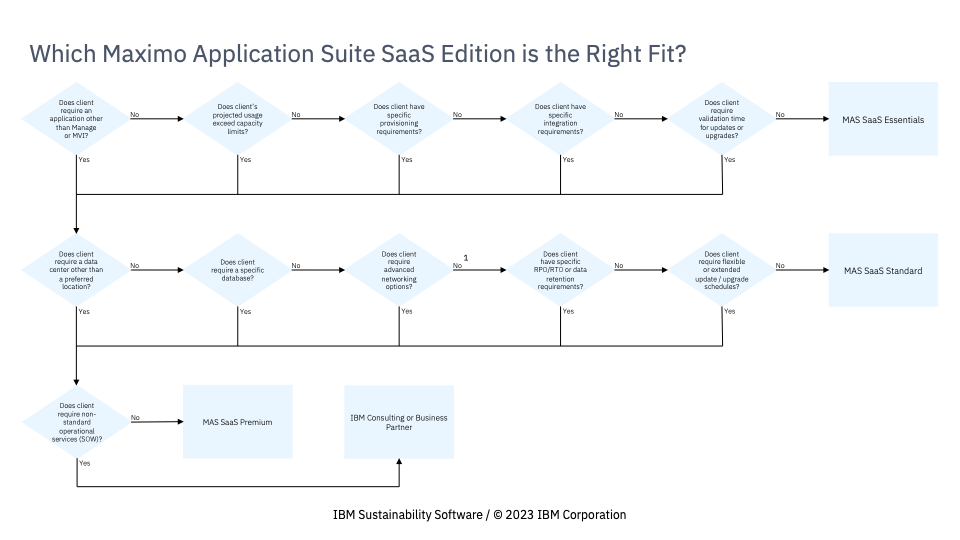
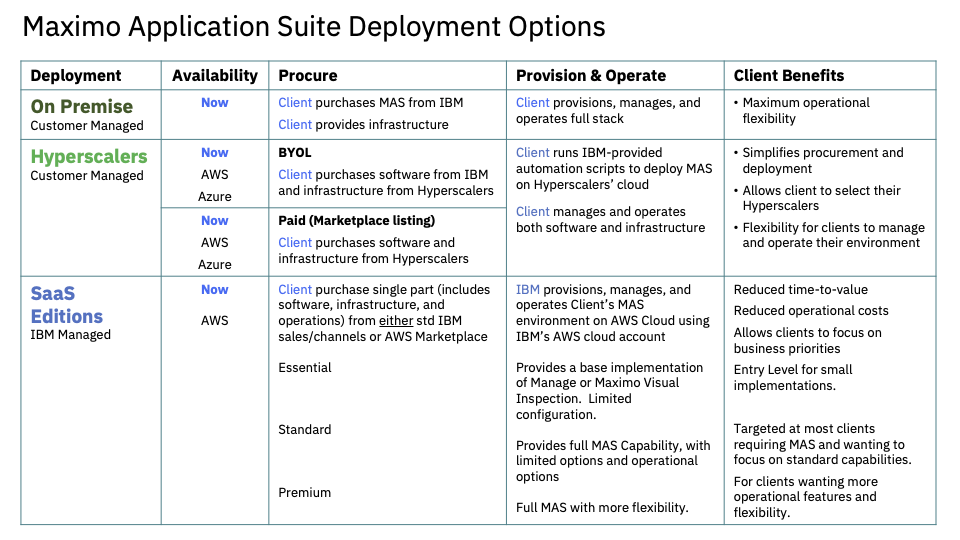
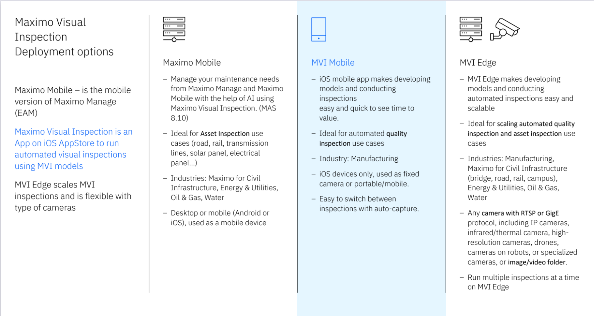

<Row>

# Maximo Modernization

<Column colMd={2} colLg={3} offsetMd={1} offsetLg={1}>
  <Aside>

**Need Help?**   
Customer Success Practice Leader -  Poornima Kallur    
Americas Brand CSM Leader - Juan Lopez    
EMEA Brand CSM Leader - Kevin Standfield    

  </Aside>
</Column>

## What is included in Maximo Modernization?

Maximo Modernization consists of the actions that can be taken to establish our Customer’s continued success (and renewal) through our next generation of products in the Maximo Application Suite, and get the Customer to use OpenShift in some way.

  

### Journey Maps

There are three Journey Maps that we can consider to be Modernization, as they result in the Customer using the next generation of the products, and being on a OpenShift environment:

  

<AnchorLinks small>
<AnchorLink>EAM to MAS Migration</AnchorLink>
<AnchorLink>Maximo Mobile Implementation</AnchorLink>
<AnchorLink>Maximo Visual Inspection Implementation</AnchorLink>
</AnchorLinks>

(Refer to the IBM Maximo Application Suite page for other areas of Expansion.)

### Implementation methods

These can be accomplished in a number of Implementation Methods.  In no particular order, the customer can:
- do it themselves
- use Technology Expert Labs
- use a IBM Partner
- use IBM Consulting

General information about these Implementation Methods, such as the overall needs or how to engage in general, can be found on the IBM Maximo Application Suite.  Information specific to these

These Journey Maps will help CSMs run through the steps, taking into consideration the Implementation Approach that is in place, or that might need to be recommended.

</Row>

<Row>

## EAM to MAS Migration

 

<Accordion>
  <AccordionItem title="Understanding the EAM to MAS Migration">

<InlineNotification>

This step outlines how a CSM can inform themselves on the EAM to MAS Migration.  We've provided what the Migration is, the Carrots and the Sticks for the Customer to Migrate.  The outcome of this step is to be ready to prepare for a conversation with the Customer about Migration.

 

**IBM:** Customer Success Manager, Brand Technical Seller, Account Technical Specialist

 

**Customer:** None at this time.

</InlineNotification>

### What is the EAM to MAS Migration?

First, a few points for context:

- EAM is short for Enterprise Asset Management, and if often used to refer to Maximo version 7
- MAS is short for Maximo Application Suite, the newest version of IBM's EAM AND <a target='_blank' rel='noreferrer noopener' href="https://ibm.seismic.com/Link/Content/DC7FPMd7RBCcMGFHcPT9GpWMPPGV">Asset Performanance Management (APM)</a> software
- MAS is licensed through AppPoints.  This migration plan assumes that the upgrade sale of AppPoints has already been completed, so they have access to MAS, but the customer is stil running EAM.
- For additional high level context, this  <a target='_blank' rel='noreferrer noopener' href="https://community.ibm.com/community/user/asset-facilities/viewdocument/evolve-your-asset-management-with-t?CommunityKey=3d7261ae-48f7-481d-b675-a40eb407e0fd&tab=librarydocuments">Journey Infographic</a> is how we're positioning the migration with our Customers.

 

The process involves upgrading the customer's EAM environment to MAS, which would include moving the customer's data from the current EAM compliant infrastructure to the MAS OpenShift based infrastructure, testing for any issues with the new MAS software in the customer's business procedures, and enabling the end users with information on the new user interface.

### Why should a customer migrate from EAM to MAS?

**The Carrots**

Maximo Application Suite 8.11 includes the following enhancements above and beyond EAM:
- Enterprise Asset Management - AI-infused technologies that drive efficiencies that reduce costs
  - IBM Maximo Manage adds new capabilities to the Scheduler and Operational Manager dashboards.
  -	IBM Maximo IT is a new add-on that empowers seamless, IT Service Management, IT Asset Management, and IT/OT collaboration across the enterprise.
  - IBM Maximo Optimizer adds model enhancements to enable new Dispatching dashboard available as part of the IBM Maximo Scheduler.
  - IBM Maximo Mobile is a re-imagined Mobile experience.
  - Enhanced login capabilities that provide options for multiple login routes, default login paths, and seamless login using a Security Assertion Markup Language (SAML) identity provider.
  - A range of security and user administration enhancements to assist clients deploying Maximo Application Suite in highly regulated environments.
  - Asset Reliability Strategies Library to improve asset reliability.  IBM Maximo Reliability Strategies is a new add-on that enables the creation of reliability centered maintenance strategies through a database of industrial content including equipment types, failure mechanisms, and maintenance tasks built by domain and industry experts.
- Asset Performance Management - AI-infused technologies that reduce asset failures and reduce inspection costs, while improving the frequency & accuracy
  - IBM Maximo Predict adds enhancements for users who work with Watson Studio projects and SPSS® models and a foundation for condition-based maintenance
  - IBM Maximo Monitor adds the capability for integrating with widely used industrial data sources including devices, Programmable Logic Controllers (PLCs), and Open Platform Communications (OPC) servers using a comprehensive catalogue of ready-to-use connectors. Device data is automatically transformed into a standardized data model.
  - Access to partner technologies ecosystem that drives time to value.
- Computer Vision Inspections
  -	IBM Maximo Visual Inspection adds intelligent grouping of image datasets, object storage support, anomaly detection models optimized based on inferencing hardware, and seamless upgrades on Maximo Visual Inspection Edge.
- Delivered SaaS First

 

You can dive deeper into the <a target='_blank' rel='noreferrer noopener' href="hhttps://ibm.seismic.com/Link/Content/DCTV2VhmRX8hP8qD4jJj89P8WFR3">What's new with Upgrade to MAS</a> presentation.  The deck isn't customer-ready, but might have some content that would resonate with your customer.

 

Additionally, MAS runs on RedHat OpenShift (RHOS), which provides a number of operational benefits to the customer, including:

- Portability - containers encapsulate an application and all its dependencies, making it easy to run the same containerized application on different environments, such as development, testing, and production. This reduces compatibility issues and streamlines deployment.
- Scalability/auto-scaling -designed to be lightweight and can be rapidly scaled up or down to meet changing workload demands. Container orchestration tools like Kubernetes make it easy to manage and automate the scaling of containerized applications.
- Security - enhance security through isolation and image scanning tools. They also make it easier to patch and update applications, reducing the risk of security vulnerabilities.
- Dependency management - all dependencies within the container image, reducing the likelihood of conflicts and ensuring that the application runs with the required libraries and components.
- CI/CD Enablement - fit well into DevOps and CI/CD pipelines. Easier to automate testing, deployment, and updates, leading to faster development cycles and improved collaboration between development and operations teams.
- _RHOS Key Features_
  - Cloud agnostic - not tied to a specific cloud provider or platform. You can run containers on various cloud services or on-premises infrastructure, offering flexibility in choosing where and how to deploy your applications.
  - Programming language agnostic (each container can run its own code)
  - Ease of updating/upgrading components with less downtime than monolithic applications
  - Ability to decouple services into microservices - Microservices are more flexible and easier to manage than a monolithic application.
  - Ability to move to managed services and/or pay-as-you-go model.
  - Platform consistency
  - Total resource capacity control
  - Nimble deployment

 

Is the customer is not interested in running RHOS, and would rather consume the software as a service, this <a href="https://ibm.seismic.com/Link/Content/DC42JWgRq33Dc8mFCc8BVX6MFWQB">MAS SaaS Sales Update from 2 Aug 2023</a> provides a good outline of the MAS SaaS Editions summarized below.

 

    

    
For additional details review the <a target='_blank' rel='noreferrer noopener' href="https://www.ibm.com/docs/en/mas/saas?topic=getting-started">MAS SaaS Documentation</a>

 

**The Sticks**

-	Support for EAM will be coming to an end.  Per IBM policy, once a Customer purchases AppPoints, they have 12 months to move from EAM to MAS.  Given the scale of this change for IBM and our Customers, IBM will be waiving that requirement, but all customers that have purchased AppPoints, and therefore have dual entitlement to EAM and MAS, must move to MAS before April 2027.
    Click <a href="https://www.ibm.com/support/pages/node/6570953?utm_medium=Exinfluencer&utm_source=Exinfluencer&utm_content=AMPWW&utm_term=30BH6&utm_id=Infographic-Ensuring-continued-support" target='_blank' rel='noreferrer noopener'>HERE</a> to review End of Support details.

  - Customers who have moved to AppPoints will not be eligile for the Extended or Sustained support after April 2027.

### Is the EAM to MAS Migration right for my Customer?

Customers who are currently on Maximo EAM 7.6.1.3 are in a good position to move to MAS.

The EAM to MAS Migration is applicable for customers who have purchased some EAM product in the past (Maximo SaaS Flex, Perpetual licenses, or some other hosted solution for which they own the entitlement), and have now upgraded to AppPoints, but are currently still running Maximo 7.x or prior.

    

### What's next?

Before Engaging the Customer, it is necessary to have discussed the topic of EAM to MAS Migration with the Brand Technical Seller and Account Technical Leader to ensure that it is part of the overall account plan, or any aspects of the migration that has been discussed during the sales process.

</AccordionItem>

<AccordionItem title="Engaging the Customer">

<InlineNotification>

This step covers the necessary actions to have the first conversation with the customer about EAM to MAS Migration. We’ve provided a sample Compelling Reason to Act which is generic and applicable to most Maximo customers as well as a deck from Product Management that goes into more depth on the value of modernization from EAM to MAS.
The outcome of this phase is that a sponsor is interested in an EAM to MAS Briefing and workshop where IBM and the customer will work together to scope and plan a project.

 

**IBM:** Customer Success Manager, Brand Technical Seller, Account Technical Specialist

 

**Customer:** None at this time.

</InlineNotification>

### How can I prepare to talk to my Customer?

Review the <a target='_blank' rel='noreferrer noopener' href="https://ibm.seismic.com/Link/Content/DCT4JbW7MT97FGqGfDqqT2qfRbj3">EAM to MAS Upgrade Customer Presentation</a> and its corresponding <a target='_blank' rel='noreferrer noopener' href="https://ibm.seismic.com/Link/Content/DCRfqGGf23X2B87XB9Hgbbfc3393">Recording</a> for IBM's positioning of the upgrade to our Customers.

### Who should be invited?

- If there is an IBM Partner or IBM Consulting are involved, they will generally want to lead the conversation.
- If there is no IBM Partner and IBM Consulting is not involved, consider engaging Technology Expert Labs
- On the Customer side, the Sponsor and any key business users should be included in the process.

### How should the meeting be assembled?

### What other resources are there to engage the Customer?

- There is a good webinar called Demystifying the Move to Maximo Application Suite, with special guest Tucson Electric Power.  If you would like to share the replay of this webinar with a client, please have them register <a target='_blank' rel='noreferrer noopener' href="https://mediacenter.ibm.com/media/1_lll8tv5x?utm_medium=Exinfluencer&utm_source=Exinfluencer&utm_content=AMPWW&utm_term=30BH6&utm_id=Upgrade-TecXchange.Community-Tucson-Electric-webinar">here</a> to get access to the replay.

- A <a target='_blank' rel='noreferrer noopener' href="https://ibm.seismic.com/Link/Content/DC8DqpDDf7FqR8qPX24PBgfXGfXG">BVA for EAM to MAS</a> might be helpful to present the value that MAS brings to the table.

BVA for EAM to MAS Deliverables

1. What’s at Stake – Strategic objective and rationale for investing in the proposed solution; assessment of current state key challenges and capability gaps
2. Solution Alignment – Required solution enablers and key new capabilities (“day in the life”)
3. Financial & Operational Benefits - Key financial and operational benefits (e.g., asset uptime, productivity increase, operational efficiency, capital preservation, etc.)
4. Implementation Roadmap & Cost - Phased solution roll-out plan (e.g., crawl - walk - run) and estimated cost
5. ROI Bottom Line – ROI, payback, and cash-flow dynamics; capex/opex requirements Maximo Asset Management

</AccordionItem>

<AccordionItem title="Delivering a POX">

<InlineNotification>

This step covers the necessary actions to demonstrate MAS to a Customer, and if necessary, set up a POC or Pilot. We’ve provided resources available and mapped them to where they might be used.  The outcome of this phase is that the Customer has the confidence to move forward with a migration to MAS.

 

**IBM:** Customer Success Manager, Brand Technical Seller

</InlineNotification>

### What resources are available for demontrations?

In TechZone, there is a <a target='_blank' rel='noreferrer noopener' href="https://techzone.ibm.com/collection/ibm-sustainability-software-asset-management-technical-demo-collections/journey-maximo-application-suite">Collection</a> of demos available for use.  Some key ones:

- <a target='_blank' rel='noreferrer noopener' href="https://techzone.ibm.com/my/reservations/create/63efc1cc7c001900174b6091">Request access to the MAS WW Demo 8.9 system.</a>
  - This environment is a read-only instance of Maximo Application Suite and is used to demo MAS, via a provided a script. The script is used Pumps, Sedimentation Tanks and assets for Health and Predict for Utilities. The environment is not for enablement, custom demos or any other usage and is a read-only environment outside of the script.  There are four "flavors":

|Type | Use Case      |
| -------- | --------- |
| Customer Demo | Showcasing a pre-built, standardized product use case with minimal customization needed on the environment for a client demonstration. Aligns with ‘Custom Demo’ in IBM Sales Cloud. |
| Proof-of-Technology    | Customizing an environment to set up and personalize beyond the pre-built option to showcase a specific customer use case. Typically these environments are needed for a longer period of time. Aligns with ‘Proof of Value’ in IBM Sales Cloud.         |
| Practice / Self-Education    | Gaining experience with specific technology, product, or solution.    |
| Test    | Need to test a specific function, configuration, or customization.      |

- <a target='_blank' rel='noreferrer noopener' href="https://techzone.ibm.com/collection/608b16d81a1b57001eb4c0c9">IBM Sustainability Software - Maximo Application Suite for Cross Industry</a>
  - LIVE DEMO - With this demonstration, you will be able to show the wastewater pump use case leveraging the capabilities of Maximo Application Suite applications: Monitor, Manage, Mobile, Predict, and Health.

https://ibm.seismic.com/Link/Content/DC3Pbd2BcT23dGhPXBJWqWVCB9Pj#/?anchorId=16e0ea5b-b8d3-4130-9092-3189286b483c

</AccordionItem>

<AccordionItem title="Developing a Strategy">

<InlineNotification>

This phase covers the steps necessary to assist the customer in developing a strategy around the technical migration from EAM to MAS.

 

**IBM:** Customer Success Manager, Brand Technical Seller

 

**Customer:** Sponsor, Business Users

</InlineNotification>

<Row>

### What resources are availible to make a plan with the customer?

If the customer already has a plan, you might want to use that as your starting point. If not, the template and examples below have been used in several accounts.  It is not expected that any client will need to do all of the steps, and it is likely that a client will have some unique activities (team integrations, budgets, approvals, additional testing, etc.) they want to add.  All the durations are specific to the client, depending on their skills, access to support staff, and amount of overhead in their processes. You can look at the examples to see how others have done it. Please make sure that if  you reuse an example, you first clean all the client references.

Engage BVA team member Ashok Kumar (kumaras@ibm.com) to explore the possibility of arriving at a use case ROI by moving to MAS suite. This could be only for those Big ACV customers who are resistant to migrating on time or have questions on ROI for their investment in MAS.
Download this <a href="https://www.ibm.com/docs/en/SSRHPA_cd/appsuite/infographic/IBM_BusinessValueAssessment.pdf?utm_medium=Exinfluencer&utm_source=Exinfluencer&utm_content=AMPWW&utm_term=30BH6&utm_id=Infographic-IBM-Business-Value-Assessment%20https://www.ibm.com/docs/en/SSRHPA_cd/appsuite/infographic/IBM_BusinessValueAssessment.pdf?utm_medium=Exinfluencer&utm_source=Exinfluencer&utm_content=AMPWW&utm_term=30BH6&utm_id=Infographic-IBM-Business-Value-Assessment" target='_blank' rel='noreferrer noopener'>MAS Business Value Assessment One-Pager</a> to review the approach.

**Template and Examples**

</Row>

<Row>

<CardGroup>
  <MiniCard title="MAS Migration Project Plan to Mgd Svcs.xlsx" href="https://ibm.box.com/s/6egq43xj54p8do1koi0965qens829h79">
  </MiniCard>
</CardGroup>

</Row>
<Row>

<CardGroup>
  <MiniCard title="MAS-Migration-Schedule.mpp" href="https://ibm.box.com/s/tj7j9pqmxadvxr49578ogovc4qpqxfn9">
  </MiniCard>
  <MiniCard title="City of Atlanta – MAS with managed Services deployment notes Oct 10 2022.pptx" href="https://ibm.box.com/s/35x98y3br323vdqw50r8948j989srepk" />
  <MiniCard title="MASMS-82084278-230322-2225-348.pdf" href="https://ibm.box.com/s/2xmof242u0rxa3tqfo196mgpxh5uyb9e" />
  <MiniCard title="IBM MAS Migration Steps – v1.pptx" href="https://ibm.box.com/s/p97342lko79gag9dhbyexqbjni7duet4" />
</CardGroup>

</Row>
<Row>

The <a target='_blank' rel='noreferrer noopener' href="https://www.ibm.com/docs/en/mas-cd/continuous-delivery?topic=planning">
IBM Maximo Application Suite Version 8.8 and later - continuous-delivery - Planning </a> documentation provides additional information on planning for:

- IBM Maximo Application Suite standard installation using CLI,
- Amazon Web Services,
- Microsoft Azure,
- On premises,
- IBM Cloud,
- Installation mode considerations, and
- High availability

</Row>
</AccordionItem>

<AccordionItem title="Proposing and Closing the Services Agreement (if required)">

<InlineNotification>

This phase covers the steps necessary to engage a Business Partner or Technology Expert Labs - Software in pursuit of the implementation of MAS.

 

**IBM:** Customer Success Manager, Brand Technical Seller, Account Technical Specialist, Expert Labs or Business Partner Seller

 

**Customer:** Sponsor, Project Manager

</InlineNotification>

### Business Partners

Three major Maximo focused Business Partners are <a href='https://ibm.box.com/s/sjl7c56re48hdidua77kpkfzionwa28c' target='_blank' rel='noreferrer noopener'>Aquitas</a>, <a href='https://ibm.box.com/s/pt3mjdt2zul1cyd5bw3t5x19g8aypihd' target='_blank' rel='noreferrer noopener'>Cohesive</a>, and <a href='https://ibm.box.com/s/pt3mjdt2zul1cyd5bw3t5x19g8aypihd' target='_blank' rel='noreferrer noopener'>SMS</a> 

<a href='https://ibm.box.com/s/cg7qmby3n2g0n47byj0vir7zuk8m0fk7' target='_blank' rel='noreferrer noopener'>Electra Learning</a> can help with training options and <a href='https://ibm.box.com/s/sp9hiekxpuvg3oglew3aukcvmezm5i4y' target='_blank' rel='noreferrer noopener'>Qellus</a> can help with enterprise content management connections.

<Row>

### IBM Technology Expert Labs - Software

IBM Technology Expert Labs - Software is a great partner to help your clients successfully plan and migrate to MAS.  Expert Labs experts will help your client overcome their reservations about moving to a Red Hat OpenShift platform, by providing best practices for planning, implementing and Day 2 Operations so clients get the full benefit of MAS that is easier to manage with OpenShift.  Expert Labs has two offerings in this space - the "Maximo Application Suite (MAS) Modernization Plan and Design" and
the "Maximo EAM to MAS Manage Migration Quick Win Offering," and can be engaged through the process below.

 

To learn more about the offerings, you can watch the Replay of the <a target='_blank' rel='noreferrer noopener' href="https://ec.yourlearning.ibm.com/w3/playback/10337975">MAS Modernization Product Launch Sales Enablement</a>.  In this session, the speakers shared how MAS will modernize and revolutionize your clients’ business. They’ll talk about how to have winning conversations around MAS, and why Technology Expert Labs is the insurance policy for MAS.

</Row>

<Row>

You can <a target='_blank' rel='noreferrer noopener' href="https://ibm.box.com/s/0sjrdb4md8bamm3ekhxrf9kc6whtbp43">review the overview presentation</a>

  

TL;DR - The first step is to engage your services sellers early in the opportunity.   Contact <a target='_blank' rel='noreferrer noopener' href="https://w3.ibm.com/#/people/937924897">John Wilharm</a>  or <a target='_blank' rel='noreferrer noopener' href="https://w3.ibm.com/#/people/093087649">Brennen Lafleur</a> if you are unsure of who your services seller is.

</Row>
<Row>

<Column>

</Column>

</Row>

<Row>

We have an <a target='_blank' rel='noreferrer noopener' href="https://ibm.box.com/s/55hthfm3559u6v5vum13wx099ybp2rwl">Interactive Document with Live Links</a> that can be used to get to any of the information on the diagram.

</Row>

<Row>

#### This process has been successful!

</Row>

<Row>
<a target='_blank' rel='noreferrer noopener' href="https://ibm.seismic.com/Link/Content/DCGMFBj42P7DTG7R2H33b9pHfhBV#/?anchorId=a0d4e5b4-08be-4f13-b4a1-7f9ed61f884d">Several success cases</a> can be found in the Technology Expert Labs MAS Modernization Showcase.

- <a target='_blank' rel='noreferrer noopener' href="https://ibm.seismic.com/Link/Content/DCWmqqCcCTdWcGqX6h8MMBbjm2m3">Estée Lauder</a>
- <a target='_blank' rel='noreferrer noopener' href="https://ibm.seismic.com/Link/Content/DC4M97pgCJTBMG9HmWgC8RfVT2fP">US Department of Interior</a>
- <a target='_blank' rel='noreferrer noopener' href="https://ibm.seismic.com/Link/Content/DCm89qGjd9q3m8QT38qdW72FQ8q8">Atlanta DEAM</a>

</Row>
</AccordionItem>

<AccordionItem title="Implementing the Project">

<InlineNotification>

This phase covers the steps necessary to implement the EAM to MAS Migration.

 

**IBM:** Customer Success Manager, Brand Technical Seller, Account Technical Specialist

 

**Customer:** None at this time.

</InlineNotification>

<Row>

The <a target='_blank' rel='noreferrer noopener' href="https://www.ibm.com/docs/en/mas-cd/continuous-delivery?topic=installing">
IBM Maximo Application Suite Version 8.8 and later - continuous-delivery - Installing </a> documentation provides additional information on installing for:

- IBM Maximo Application Suite standard installation using CLI,
- Amazon Web Services,
- Microsoft Azure,
- On premises,
- IBM Cloud,
- Installation mode considerations, and
- High availability

</Row>

Go here to find the latest version of the <a target='_blank' rel='noreferrer noopener' href="https://ibm.seismic.com/Link/Content/DC8bqDGgWfRpJ8QF8qd3m2WqG9D8">MAS On-Prem Infrastructure Sizing Calculator</a>

The customer should always get the latest version of the PDF guide <a target='_blank' rel='noreferrer noopener' href="http://www.ibm.com/docs/SSRHPA_cd/pdf/migrating-pdf.pdf">Migrating from IBM Maximo Asset Management to IBM Maximo Manage</a>

</AccordionItem>

</Accordion>
</Row>

<Row>

## Maximo Visual Inspection (MVI)

 

<Accordion>
  <AccordionItem title="Understanding Maximo Visual Inspection (MVI)">

<InlineNotification>

This step outlines how a CSM can inform themselves on the MVI.  We've provided what MVI is, and some of the ways it is being used.  The outcome of this step is to be ready to prepare for a conversation with the Customer about MVI.

 

**IBM:** Customer Success Manager, Brand Technical Seller, Account Technical Specialist

 

**Customer:** None at this time.

</InlineNotification>

### What is MVI?

Maximo® Visual Inspection makes computer vision with deep learning accessible to business users by providing an intuitive tool set that empowers subject matter experts to label, train, and deploy deep learning vision models, without coding or data science expertise.  The solution includes the most popular deep learning frameworks, and it is built for easy and rapid deployment.

 

The implementation process involves obtaining a MVI environment through one of a number of ways, establisghing the use cases to be explored, and then training the system for the initial inferencing.

### Why should a customer use MVI?

- Accelerate defect detection
  - Continuously improve quality control through real-time end-to-end defect detection anywhere on the production line, support root cause analysis and boost manufacturing workflows.
- Gain the flexibility to train and deploy anywhere
  - Simplify the process of gathering and labeling data sets, training models, and deploying those AI models at the edge.
- Boost uptime with 24/7 real-time monitoring
  -Automate data labeling for deep-learning models to quickly spot and stop issues, alerting the right resource to inspect, diagnose and rectify any issue, anywhere.
- Enable any subject matter expert (SME)
  - Provide SMEs the tools to codify their knowledge through an AI-powered visual inspection system that is fast and easy to create.
- Increase worker safety through visual inspection software
  - Monitor and enforce inspection tasks and regulations for safety to protect workers from hazardous environments and dangerous conditions.

### Is MVI right for my Customer?

This <a href="https://ibm.seismic.com/Link/Content/DChfWGbBW7bGJ84RVP2W4mh9TJfd">Maximo Visual Inspection Seller One Pager</a> provides a framework for evaluating if MVI is right for your customer.

Specific qualification criteria to consider:

- Is the primary use case focused on asset inspection and equipment reliability?
- Do assets require frequent inspections, are in hard-to-access or dangerous
locations, where up-time, safety,and performance are critical to business operations, resiliency, and cost management?

### What's next?

Before Engaging the Customer, it is necessary to have discussed the topic of MVI with the Brand Technical Seller and Account Technical Leader to ensure that it is part of the overall account plan, or any aspects of the migration that has been discussed during the sales process.

</AccordionItem>

<AccordionItem title="Engaging the Customer">

<InlineNotification>

This step covers the necessary actions to have the first conversation with the customer about MVI. We’ve provided a sample reasons to act which is generic and applicable to most Maximo customers as well as a deck from Product Management that goes into more depth on the value of MVI.  The outcome of this phase is that a sponsor is interested in an MVI briefing, demo or workshop where IBM and the customer will work together to scope and plan a project.

 

**IBM:** Customer Success Manager, Brand Technical Seller, Account Technical Specialist

 

**Customer:** None at this time.

</InlineNotification>

### How can I prepare to talk to my Customer?

Review the <a target='_blank' rel='noreferrer noopener' href="https://ibm.seismic.com/Link/Content/DCdVTWdPdBPWCGfDVqmjcbjDjPmj">Maximo Visual Inspection Client Presentation</a> and its corresponding Instructions on the right hand side for IBM's positioning of Maximo Visual Inspection our customers.

### Who should be invited?

- If there is an IBM Partner or IBM Consulting are involved, they will generally want to lead the conversation.
- If there is no IBM Partner and IBM Consulting is not involved, consider engaging Technology Expert Labs
- On the Customer side, the Sponsor and any key business users should be included in the process.

### What other resources are there to engage the Customer?

Review the <a target='_blank' rel='noreferrer noopener' href="https://ibm.seismic.com/Link/Content/DC8HF4C8BfpCcG2Fhb2h9HmDRc2j">Maximo Visual Inspection Sales Level 3 Demo Script</a> for an overview of the features of MVI our customers.  It includes how to get an MVI environment on which to develop an example for your customer, as well as how to label and augment the data and train the system.

</AccordionItem>

<AccordionItem title="Delivering a POX">

<InlineNotification>

This step covers the necessary actions to demonstrate Maximo Visual Inspection to a Customer, and if necessary, set up a POC or Pilot. We’ve provided resources available and mapped them to where they might be used.  The outcome of this phase is that the Customer has the confidence to move forward with MVI.

 

**IBM:** Customer Success Manager, Brand Technical Seller

</InlineNotification>

### What do I need to be thinking about when developing a POC?

There is a great, comprehensive outline of what is needed to create a Proof of Experience for MVI in the <a target='_blank' rel='noreferrer noopener' href="https://ibm.seismic.com/Link/Content/DCXRpPVR7hhcp8hD29WXbT6HhpMd">How to run a Maximo Visual Inspection (MVI) Proof of Experience Level 4 (Best Practices) Presentation</a>.  It includes important topics:

- Intro to Maximo Visual Inspection (MVI)
- Competition in the Marketplace
- Understand Where Clients Derive Value
- Standard MVI Engagement
- Process / Objectives
- Five Ws of an MVI POC
- Before You Discuss a POC
- How to Scope an MVI POC
- Use Case Gathering Template
- Before You Agree to a POC
- Document of Understanding (DoU) Essentials
- DoU Template
- MVI POC Deployment Options
- MVI on MAS POC Environment Options
- MVI POC Template Architecture
- How to Execute an MVI POC
- Image Capturing / Labeling Best Practices
- Measuring Model Performance (% Accuracy)
- Creating a POC Executive Readout
- How to Progress Past an MVI POC
- MVI Training Workshop Template
- Lessons Learned
- Additional Resources

</AccordionItem>

<AccordionItem title="Developing a Strategy">

<InlineNotification>

This phase covers the steps necessary to assist the customer in developing a strategy around implementing Maximo Visual Inspection.

 

**IBM:** Customer Success Manager, Brand Technical Seller

 

**Customer:** Sponsor, Business Users

</InlineNotification>

### How do I help the customer evaluate the Deployment Options?

</AccordionItem>

<AccordionItem title="Proposing and Closing the Services Agreement (if required)">

<InlineNotification>

MVI - Services

 

**IBM:** Customer Success Manager, Brand Technical Seller, Account Technical Specialist

 

**Customer:** None at this time.

</InlineNotification>

</AccordionItem>

<AccordionItem title="Implementing the Project">

<InlineNotification>

MVI - Implementing

 

**IBM:** Customer Success Manager, Brand Technical Seller, Account Technical Specialist

 

**Customer:** None at this time.

</InlineNotification>

</AccordionItem>

</Accordion>
</Row>
<Row>

## Maximo Mobile

 

<Accordion>
  <AccordionItem title="Understanding Maximo Mobile">

<InlineNotification>

This step outlines how a CSM can inform themselves on Maximo Mobile.  We've provided what Maximo Mobile is, and some of the ways it is being used.  The outcome of this step is to be ready to prepare for a conversation with the Customer about Maximo Mobile.

 

**IBM:** Customer Success Manager, Brand Technical Seller, Account Technical Specialist

 

**Customer:** None at this time.

</InlineNotification>

### What is Maximo Mobile?

IBM Maximo® mobile solutions deliver remote and AI-based expert assistance, real-time asset history and operational data from wearables, safety sensors and diagnostic interfaces to the digital twin. Explore the mobile EAM solutions below and discover how intelligent mobile EAM can keep technicians connected and your organization productive.

 

The implementation process involves implemeting a Maximo Application Suite environment through one of a number of ways, establisghing the use cases to be explored, and then training the users on the system (although the system is designed to be self-driven).

### Why should a customer use Maximo Mobile?

- Boost technician productivity
  - Provide access to mobile-native features and AI-powered tools, so technicians have all the information they need to find solutions even in the most remote locations.

- Create a safer workplace
  - Guard worker safety with data from cameras, sensors, beacons, wearables and other devices to monitor density, capacity levels, no-go zones and more.

- Train workers and reduce knowledge gaps
  - Give a new generation of workers the information they need to do the job — including critical expert and institutional knowledge — all in the palm of their hand.

- Spot problems and avoid downtime
  - Identify small problems before they become big issues with computer vision and AI-based visual inspection.

- Find answers, anytime, anywhere
  - Use AI- and human-based assistance to search for the most probable fixes, identify parts and collaborate remotely with experts.

- Stay in compliance
  - Use integrated HSE data and processes to improve safety, environmental and operational performance in compliance with regulations and operating procedures.

### Is Maximo Mobile right for my Customer?

https://ibm.seismic.com/Link/Content/DChfWGbBW7bGJ84RVP2W4mh9TJfd

### What's next?

Before Engaging the Customer, it is necessary to have discussed the topic of MVI with the Brand Technical Seller and Account Technical Leader to ensure that it is part of the overall account plan, or any aspects of the migration that has been discussed during the sales process.

</AccordionItem>

<AccordionItem title="Engaging the Customer">

<InlineNotification>

This step covers the necessary actions to have the first conversation with the customer about Maximo Mobile. We’ve provided a sample reasons to act which is generic and applicable to most Maximo customers as well as a deck from Product Management that goes into more depth on the value of Maximo Mobile.  The outcome of this phase is that a sponsor is interested in an MVI briefing, demo or workshop where IBM and the customer will work together to scope and plan a project.

 

**IBM:** Customer Success Manager, Brand Technical Seller, Account Technical Specialist

 

**Customer:** None at this time.

</InlineNotification>

### How can I prepare to talk to my Customer?

Review the <a target='_blank' rel='noreferrer noopener' href="https://ibm.seismic.com/Link/Content/DCJXQ4mTJPPWjGFMMcT66cX3Pfb8">Maximo Mobile Client Presentation</a> and its corresponding Instructions on the right hand side for IBM's positioning of Maximo Mobile our customers.

### Who should be invited?

- If there is an IBM Partner or IBM Consulting are involved, they will generally want to lead the conversation.
- If there is no IBM Partner and IBM Consulting is not involved, consider engaging Technology Expert Labs
- On the Customer side, the Sponsor and any key business users should be included in the process.

### What other resources are there to engage the Customer?

- This <a href="https://mediacenter.ibm.com/media/IBM%20Maximo:%20standardizing%20asset%20inspections/1_xjju79dd">Standardizing your asset inspections</a> video can too easily become subjective, leading to wasted time and money. But IBM Maximo Mobile app can help deliver consistent procedural inspections across your global organization with easy to follow forms available to access and edit on mobile devices.

- This <a href="https://ibm.seismic.com/Link/Content/DCdQDpVhhWT8f8WGD3jTH8mPpCTP">Maximo Application Suite v8.9 Demo Script</a> is a script to use with the Worldwide (WW) demo environment to highlight the capabilities across the entire MAS. This storyline is based on a pump failure at a wastewater treatment plant.
  - <a target='_blank' rel='noreferrer noopener' href="https://techzone.ibm.com/my/reservations/create/63efc1cc7c001900174b6091">Request access to the MAS WW Demo 8.9 system.</a>

</AccordionItem>

<AccordionItem title="Delivering a POX">

<InlineNotification>

This step covers the necessary actions to demonstrate Maximo Visual Inspection to a Customer, and if necessary, set up a POC or Pilot. We’ve provided resources available and mapped them to where they might be used.  The outcome of this phase is that the Customer has the confidence to move forward with MVI.

 

**IBM:** Customer Success Manager, Brand Technical Seller, Sponsor, Project Manager, Business Users, Business Partner, Expert Labs

</InlineNotification>

### Demo collection

#### Inspections

You can use the <a href="https://techzone.ibm.com/collection/65242a33a994a300170a3b3b">IBM Sustainability Software - Maximo Application Suite - Standardizing Procedural Inspections</a> demo collection, you can show how Maximo Mobile can help you standardize Inspection processes in all your locations worldwide.  Maximo Mobile app can help deliver consistent procedural inspections across your global organization with easy-to-follow forms available to access and edit on mobile devices.

#### Work Orders

You can use the <a href="https://techzone.ibm.com/collection/65243cc2ae64380017b687ed">IBM Sustainability Software - Maintenance Preset dashboards and Mobile manage any asset from any locations</a> demo collection, you can show how how a maintenance manager in the railway industry uses preset role-based dashboards to easily plot out his team’s activities with essential KPIs like open work orders awaiting approval or overdue emergency work. You’ll also learn how a technician uses Maximo Mobile to get the correct information, collect materials, and finish the task.

#### Environment Standards

- Environment
  - This environment is a fully installed MAS with Manage. You only need to bring your license file and entitlement key. IBM’s Tech Zone automation will build the instance for you, and you’ll have a MAS Manage instance ready to explore (no installation required from your end).
- Reservation Period
  - The latest  <a href="https://github.com/IBM/itz-support-public/blob/main/IBM-Technology-Zone/IBM-Technology-Zone-Runbooks/reservation-duration-policy.md">Tech Zone policy</a> provides instances for a maximum of 49 days with customer opportunity number—six days for self-education and 1.5 days for testing.

</AccordionItem>

<AccordionItem title="Developing a Strategy">

<InlineNotification>

This phase covers the steps necessary to assist the customer in developing a strategy around implementing Maximo Mobile.

 

**IBM:** Customer Success Manager, Brand Technical Seller

 

**Customer:** Sponsor, Business Users

</InlineNotification>

</AccordionItem>

<AccordionItem title="Proposing and Closing the Services Agreement (if required)">

<InlineNotification>

This phase covers the

 

**IBM:** Customer Success Manager, Brand Technical Seller, Account Technical Specialist

 

**Customer:** None at this time.

</InlineNotification>

### Business Partners

Three major Maximo Mobile focused Business Partners are <a href='https://ibm.box.com/s/sjl7c56re48hdidua77kpkfzionwa28c' target='_blank' rel='noreferrer noopener'>Aquitas</a>, <a href='https://ibm.box.com/s/pt3mjdt2zul1cyd5bw3t5x19g8aypihd' target='_blank' rel='noreferrer noopener'>Cohesive</a>, and <a href='https://ibm.box.com/s/pt3mjdt2zul1cyd5bw3t5x19g8aypihd' target='_blank' rel='noreferrer noopener'>SMS</a> 

### Technology Expert Labs

Technology Expert Labs has a <a href="https://ibm.seismic.com/Link/Content/DC2bVQ7jp39mM8HXG2G3PDpcPRDP">Build MAS Mobile</a> offering that is designed to get to the fastest time to value.  Technology Expert Lab brings:

- Fastest Time to Value
- Deep Maximo Mobile product skills
- Expert Labs Services and Development
  – Expert Labs is closest to the DevOps team who built the product
  – Able to solve problems quickly
- Maximo Mobile deployment that demonstrates the capability of the solution in the customer’s operation
- Recommendations for Operationalizing Solution and larger scale roll

</AccordionItem>

<AccordionItem title="Implementing the Project">

<InlineNotification>

This phase outlines the steps needed to complete the implementation of Maximo Mobile.

 

**IBM:** Customer Success Manager, Brand Technical Seller, Account Technical Specialist

 

**Customer:** None at this time.

</InlineNotification>

From a high level, the steps needed to complete the implementation include:

- Understand business requirements and define business goals.
- Design and plan deployment.
- Configure Maximo Application Suite Mobile.
- Perform system verification tests to ensure install does not break core Maximo business rules.

</AccordionItem>

</Accordion>
</Row>
