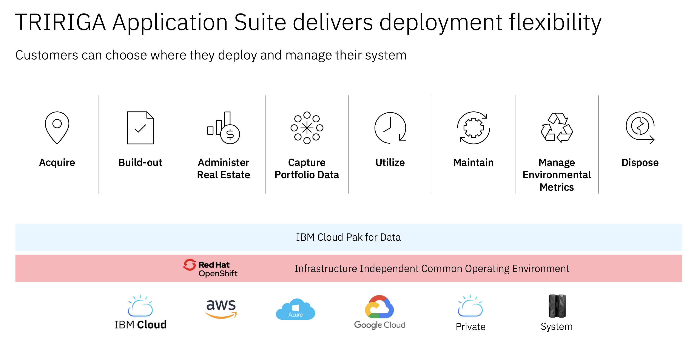

import { Link } from "gatsby";

<Row>
<Column colMd={9} colLg={9}>

<AnchorLinks small>
<AnchorLink>Scope</AnchorLink>
<AnchorLink>Why should my customer modernize TRIRIGA?</AnchorLink>
<AnchorLink>Engage Client Phase</AnchorLink>
<AnchorLink>Optional PoX Phase</AnchorLink>
<AnchorLink>Propose, Negotiate and Close Phase</AnchorLink>
<AnchorLink>Implement and Accelerate Phases</AnchorLink>
</AnchorLinks>

| WW contact | Name |
| --- | --- |
| **Customer Success Practice Leader** | Mike Singleton   msingleton@ibm.com |
| **Technology Expert Labs (TEL) Services Sales Leader** | Brennen Lafleur  Brennen.lafleur@ca.ibm.com |
| **TRIRIGA Product Management** | Paul Lacey   placey@us.ibm.com |

## Scope

By its nature, Sustainability Software is designed for end users to deliver and optimize business processes. As such, the focus of modernization is not only on the movement of the software to an OpenShift platform and preparing it for the hybrid cloud, but it also involves modernizing the front end to better reflect modern interconnected applications, as well as the underlying data structures to facilitate sharing data among the individual applications. One of the main goals of modernization is to leverage a common platform and services that will allow offerings to look the same, work the same, operate and be managed the same with greater efficiencies. This enables IBM to deliver on the <Link to='/common/ai-appscsm-iss-overview#what-is-the-sustainability-pov'>Sustainability Software Point of View.</Link>

Modernizing IBM TRIRIGA is the process of taking customers from legacy IBM TRIRIGA (on-premises, SaaS and hosted), to IBM TRIRIGA Application Suite (TAS) running on Red Hat OpenShift.  There is an additional investment that the client will make in skills associated with Red Hat OpenShift.

For now, TRIRIGA’s functionality, use cases, and demonstration are equivalent to TAS. Only the license model and deployment architecture are changing. Most existing materials are still relevant and should continue to be used.

</Column>

</Row>

<Row>

## Why should my customer modernize TRIRIGA?

Moving from the traditional IBM TRIRIGA to the IBM TRIRIGA Application Suite yields the following benefits: 
(The first three are benefits of the Red Hat on OpenShift technology stack) 

* Improves efficiency, reduces the cost of system infrastructure  
* Simplifies deployment and management of enterprise systems  
* Provides deployment flexibility (on-prem, cloud, hybrid-cloud)  
* Uses simplified, more flexible software licensing  
* Presents a uniform, improved user experience  
* Offers easy expansion into additional capabilities with full-suite access via AppPoints  

Expanding the use of IBM TRIRIGA into other functional areas to cover more than the original use case enables the customer to achieve a greater return on their investment in IBM TRIRIGA.  This would apply to both traditional TRIRIGA and TAS.

For additional background and details, see the <a target='_blank' rel='noreferrer noopener' href="https://ibm.seismic.com/Link/Content/DCf87DVhbGQ2FGfQ79BhP4B3hb2B">TRIRIGA Application Suite Value Overview for Partners & Sellers</a> 
For help with customer modernization conversations, see <a target='_blank' rel='noreferrer noopener' href="https://ibm.seismic.com/Link/Content/DC7D3Hd4m9PVGGmJ3Q87JJ8X4HWd">TRIRIGA Application Suite Why Change Conversation Guide</a> 
To understand the full breadth and depth of the business benefits of TRIRIGA, review the <a target='_blank' rel='noreferrer noopener' href="https://ibm.seismic.com/Link/Content/DCFbpXQqV9bqfGqXVDh7mfD2RR8j">TRIRIGA Real Estate and Facilities Management Sales Kit</a> 

</Row>

<Row>

## Engage Client Phase

**Led by:** Customer Success Manager and/or Brand Technical Seller  
**Audience:** Executive/Sponsor  

Before entering this phase, it is necessary to have discussed TRIRIGA modernization with the account team and Account Technical Leader to ensure that it is part of the overall account plan.
The outcome of this phase is that a sponsor is interested in investigating the additional value that the organization will gain from TAS and Red Hat OpenShift capabilities and that the client sees the value in other aspects like integration, governance, future watsonx use cases, etc.   

**Process and Assets:**

| Task | Asset | Role |
| --- | --- | --- |
| Perform account planning to identify target personas and related metrics related to TRIRIGA modernization | | CSM |
| Create a Success/Growth Plan in Gainsight to track the progress of this potential project. | [Sample Growth Plan](https://ibm.box.com/s/3t3nudaxvyokceo28mq81ny7zj8y1frp) | CSM |
| Prepare for the conversation. | [Modernization Conversation one-pager](https://ibm.ent.box.com/s/khxkwmmuc6besb8mp4ow6qhtzzesrxgv) | CSM |
| Review the latest materials to enhance the briefing | [TAS Activation Kit](https://ibm.seismic.com/Link/Content/DCC7GBb2jR8248MDbb83Jch2RfD8) | CSM |
|  Understand how to convert existing TRIRIGA licenses to TAS AppPoints. | Review and discuss [Guidelines for Packaging, Pricing, and Licensing of TAS](https://ibm.seismic.com/Link/Content/DCjQ38F2V7jPJGhTP6dGGPGM9m2B) | Tech Seller |
| State a compelling reason to act. Create a customized slide from the information provided to reflect specific client personas and metrics  | [TRIRIGA Application Suite Why Change Conversation Guide](https://ibm.seismic.com/Link/Content/DC7D3Hd4m9PVGGmJ3Q87JJ8X4HWd) | CSM |
| Insert the customized Compelling Reason to Act slide into the executive TRIRIGA modernization briefing deck | | CSM |
| Present the Executive TRIRIGA modernization briefing deck including customized Compelling Reason to Act to **customer executives or sponsors** | | CSM |

</Row>

<Row>

## Optional PoX Phase

**Led by:** Client Engineering, monitored by Customer Success Manager  

The customer may want a workshop to engage their broader teams, a custom demonstration explaining in more detail the process of migrating from TRIRIGA to TAS, or a PoX of some description. Client Engineering can provide these services around a modernization opportunity logged in ISC.

To request a Client Engineering resource to deliver a workshop, custom demo or PoX, a resource request is done via [IBM Sales Cloud (ISC)](https://ibmsc.lightning.force.com/lightning/page/home) 

Here is the link that details how to fill in the request in ISC:  [Engagement Instructions](https://w3.ibm.com/w3publisher/client-engineering/engage/engagement-instructions)  
</Row>
When filling out the request have the relevant information ready: 
- Engagement Details (”Technology Pattern” + pattern + description)  
- Pattern: Plan TAS Modernization (Technology Pattern TAS Modernization + description)  
- Business Problem: TRIRIGA to TAS modernization  
- Scope: PoX  
- Use Case: [Describe the use case(s) targeted for the PoX]  
- Success Criteria: [Describe the criteria for success of the PoX]  
- Skills: TRIRIGA/TAS on OpenShift architecture and migration  

**Required inputs by CSM:** CSM should provide context, background and guidance and maintain awareness throughout the client engagement. 

<Row>
</Row>

<Row>

## Propose, Negotiate and Close Phase

**Led by:** Technology Expert Labs Seller, monitored by Customer Success Manager  

The purpose of the Propose, Negotiate, and Close phase is to close a services deal. The IBM Sales team: Digital/Services Seller, Solution Architect/Solution Engineer will present the customer with a Services proposal for a Plan TAS Modernization engagement based on their budget and requirements.  

The Technology Expert Labs Plan TRIRIGA Application Suite (TAS) Modernization service offering provides a structured services approach based on deep product expertise to develop a plan and design that will successfully move clients to TAS. 

**Technology Expert Labs offerings:**

* [Plan TAS Modernization](https://ibm.seismic.com/Link/Content/DC38JQq2DbdpV8hV6m9c3dqWdMHd) 

**Process and Assets:**

| Task | Asset |
| --- | --- |
| Review the deck for your in-depth client conversation. | [Plan TAS Modernization Client Deck](https://ibm.ent.box.com/s/8cn7shqbfbmnzojaedp0eidytdous63n) |
| Start the modernization conversation using the one-pager | [Technology Expert Labs Plan TRIRIGA Application Suite (TAS)Modernization Client One-Pager](https://ibm.ent.box.com/s/khxkwmmuc6besb8mp4ow6qhtzzesrxgv) |
| See the scope document for information on how to scope a Technology Expert Labs Plan Tririga Application Suite Modernization Assessment engagement. | [Plan Tririga Application Suite Modernization - Scope Document](https://ibm.ent.box.com/s/xqxz31h9wpo8pn6hcpuj1qz9hqh4j8wq) |

**Required inputs by CSM:** None; however, the CSM will want to maintain awareness for continued engagement with the client.

</Row>

<Row>

<Column colMd={9} colLg={9}>

## Implement and Accelerate Phases  

**Led by:** IBM Consulting Delivery Seller, Business Partner, Technology Expert Labs Seller (when a service offering is available), CSM   

**Licensing Options:**  
* Subscription License – Renewable annual license, Minimum 12 months, maximum 60 months, Can renew, modify size, or terminate contract at renewal date,
Predictable billing for budgeting license renewal fees, For existing TRIRIGA customers available as an upgrade from traditional TRIRIGA S&S on Passport Advantage.  

* Perpetual License – Non-expiring license to use the software, Annual renewal payments for maintenance and support, For existing TRIRIGA customers available as a trade-up from traditional TRIRIGA S&S on Passport Advantage.  

**Deployment Options:**  

* Customer Hosted – Can be hosted on a private cloud or in-house system.  Public cloud options are IBM Cloud, AWS, Azure and Google Cloud.

* Third Party Hosted – There is no TAS SaaaS option hosted by IBM at present.  TAS can be hosted by IBM Consulting on IBM Cloud or one of the public cloud options.  Can be hosted by an IBM business partner on AWS, Azure or Google Cloud.

* Existing TRIRIGA SaaS Customers – At the end of their current term, existing TRIRIGA SaaS customers can trade their license for TAS subscription licenses or perpetual licenses if desired.  A TAS SaaS offering hosted on IBM Cloud is not currently available.

**Technology Expert Labs offerings:**  

* Build TAS Modernization – in planning, not available at this time
* [Expertise Connect/Expert Essential Services](https://ibm.seismic.com/Link/Content/DChTBdhh2f8jg8mHCbCTB8FfD683)

**IBM Consulting offerings:**  

Build TAS Modernization – For the Implement and Accelerate phase, the IBM Consulting Delivery team will do **one** of the following:  

* Quote and perform the services using IBM Consulting Delivery resources based on the plan delivered in the Technology Expert Labs Plan TAS Modernization engagement.  Note:  Due to limited delivery resources this team usually only accepts engagements greater than $1M.
* Quote and perform the services outsourced to an IBM Business Partner based on the plan delivered in the Technology Expert Labs Plan TAS Modernization engagement.  Note:  IBM Consulting will use this option if the client wants the agreement on IBM paper but the project will be under the minimum clip level for using IBM Delivery team resources.
* Recommend the client engage an IBM Business Partner directly to contract the services based on the plan delivered in the Technology Expert Labs Plan TAS Modernization engagement.  Note:  Unless the client prefers to have the services agreement on IBM paper, this is likely to be the least costly alternative.  

 

**Process and Assets:**  

* If IBM Consulting will deliver or subcontract, the CSM should enter a services opportunity for IBM Consulting in ISC.  CSM should then contact the IBM Consulting Delivery team lead for TRIRIGA
Art Liem – Slack: @art   Email: aliem@us.ibm.com

* If an IBM Business Partner will deliver, the CSM should work with the IBM Brand Partner Specialist to refer the client to one or more IBM Business Partners to request a services quote based on the plan delivered in the Technology Expert Labs Plan TAS Modernization engagement.  See [Working with IBM Partners](https://pages.github.ibm.com/csm-playbook/playbook/onboard/csm-partner-ecosystem/)  

**Required inputs by CSM:** None; however, the CSM will want to maintain awareness for continued engagement with the client to monitor deployment progress, help as needed with any support case resolution delays or escalations, and confirm use case live in production for updating the project scorecard milestone in Gainsight.

</Column>

</Row>
