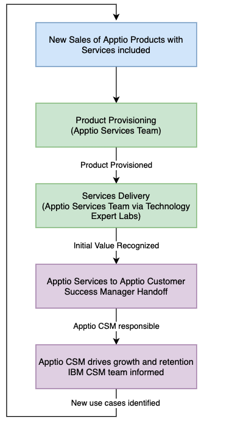
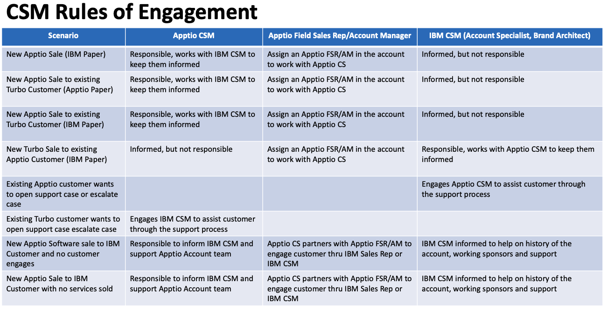
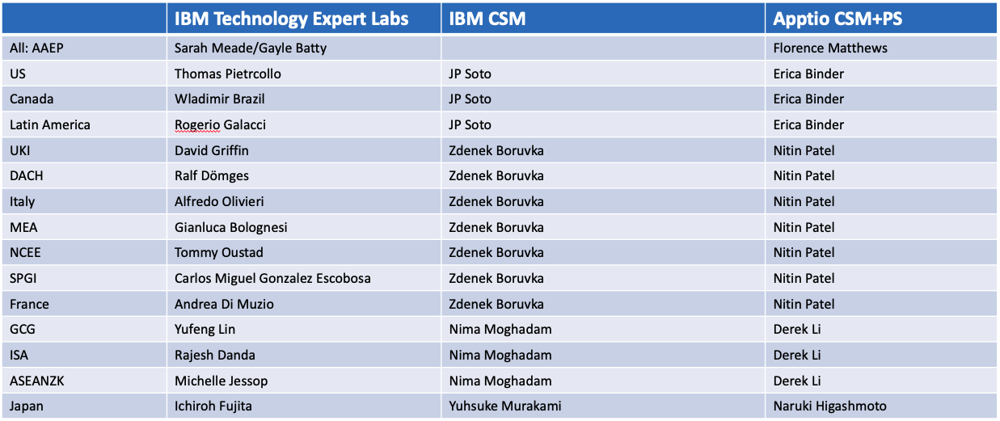

import {Link} from 'gatsby'

<Row>

<Column>

## Important information for IBM CSMs 
**Organizational structure and responsibilities:** Apptio employees started moving into IBM in November 2023. Apptio moved into a new "division" reporting directly to Kareem Yusuf with no organization structure changes.   
**Customer Success coverage:** Apptio has its own Customer Success Managers. Apptio Customer Success Managers are not part of the existing IBM CSM organization and will continue to only cover Apptio products. IBM CSMs are not expected to cover Apptio products in 2024.    
**Apptio Customer Success responsibilities:**  Apptio products are SaaS only and have mandatory services attached to every sale. Apptio CSMs are assigned to new customers only once the customer is on-boarded and the services have been delivered. Apptio CSMs are responsible for customer health, retention, and growth.    
**Contacting Apptio CSMs with general questions about an existing Apptio implementation at my customer**: Apptio account teams (including Apptio CSMs) and IBM account teams (including IBM CSMs) will remain independent and use the [Apptio Engagement Process](https://ibm.seismic.com/Link/Content/DCgbFqQjh9HTM8mBpdcQFVDpFdf8) to interact to ensure that no harm is done to existing Apptio customers and sales pipeline. Apptio CSMs have been told by their leadership that if they are contacted directly by IBMers, they should pass the request back to their Account Managers. The Apptio CSMs must be left to focus on their customers and responsibilities.    
**Contacting Apptio CSMs about a new Apptio/Turbo sale:** As per the Apptio Deployment Flow diagram and the "CSM Rules of Engagement" below, the Apptio and IBM CSMs should be keeping each other informed about deployment progress for new sales of Apptio/Turbo. Requests for introductions should be made via the account teams using the [Apptio Engagement Process](https://ibm.seismic.com/Link/Content/DCgbFqQjh9HTM8mBpdcQFVDpFdf8). In exceptional situations, you should use the IBM market/GEO contact to make the connection for you   

### Apptio Deployment Flow
As shown below, the IBM CSM is informed of the status of the customer health, growth and retention by the Apptio CSM once the services engagements are complete. **Requests for introductions should be made via the account teams using this [Apptio Engagement Process](https://ibm.seismic.com/Link/Content/DCgbFqQjh9HTM8mBpdcQFVDpFdf8). In exceptional situations, you should use the IBM market/GEO contact to make the connection for you**

  

### CSM Rules of Engagement
As shown below, IBM and Apptio CSMs are expected to keep each other informed about customer health, growth and retention but Apptio CSMs are not responsible for IBM products and IBM CSMs are not responsible for Apptio products.

**Requests for introductions should be made via the account teams using this [Apptio Engagement Process](https://ibm.seismic.com/Link/Content/DCgbFqQjh9HTM8mBpdcQFVDpFdf8) In exception situations, you should use the IBM market/GEO contact shown below to make the connection for you**

  

## Apptio Sales Kit and Demo Assets 

- [Apptio Sales Kit](https://ibm.seismic.com/Link/Content/DC2JqMVmBX2Pj89T4QqGT9WTXQ28)
- [Apptio: What you need to know](https://ibm.seismic.com/Link/Content/DCMFJXCcjjHQV8WXHWmhjfcmdg3V)
- [Apptio: Engagement Process](https://ibm.seismic.com/Link/Content/DCgbFqQjh9HTM8mBpdcQFVDpFdf8)
- [Apptio Cloudability Walkthrough](https://ibm.seismic.com/Link/Content/DCfqcTVB8d762GMF4qWqD7VgQMd8)
- [Apptio/Turbo Demo](https://ibm.seismic.com/Link/Content/DCH9dMjPB3W8RGfJ4BdFTRPd4gf3)
- [Apptio Cloudability Demo and Video instructions](https://ibm.seismic.com/Link/Content/DCcC4jJC7mFp88H2fDCG2q74q9VP)

</Column>

</Row>