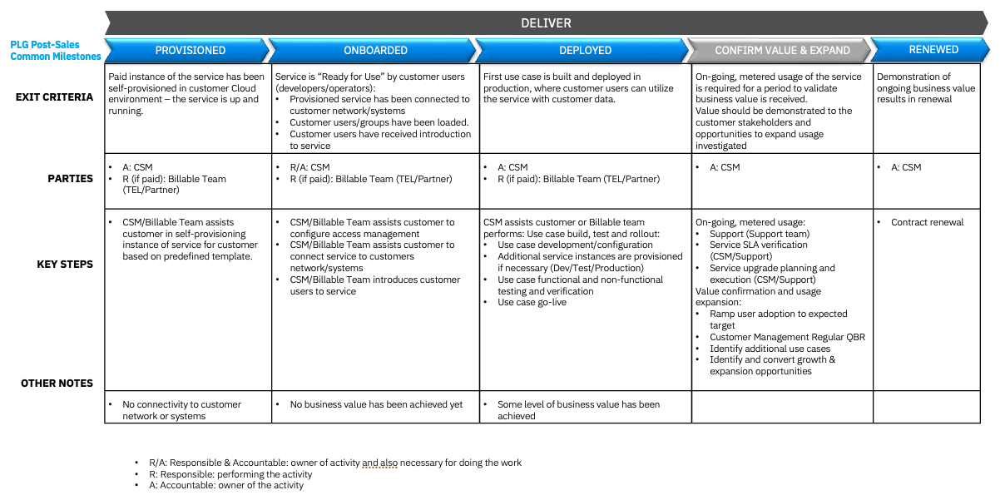

import {Link} from 'gatsby'

<InlineNotification kind="warning">

**Note: The <i>AUTOMATED</i> deployment metrics are pending sign-off and should be considered in progress until this notice is removed.**

The following considerations should be taken when reporting on SaaS deployments:
- All deployments for SaaS should follow the same process as non-SaaS / on-prem deployments
- Create one Growth Plan per use case
- Growth Plan project stages will be used to determine milestone status
- Deployed growth plans require a success plan review by a manager before being counted in the CSM scorecard
- All 3 deployment questions must be answered for the Growth Plan before being counted in the CSM scorecard

See below for detailed instructions on how to view the usage for your account.
</InlineNotification>

## Contacts

| WW contact | Name | WW contact | Name |
| --- | --- | --- | --- |
| **Customer Success Practice Leaders:** | Venkata V Gadepalli(Vishy) | **Digital Customer Success & PLG:** | Rob Young |
| **Technology Expert Labs Delivery:** | Giri Togarcheti | **Technology Expert Labs Solution Engineering:** | Luca Floris |
| **SRE:** | Derek Wong | | |

<Row> 
<Column colMd={9} colLg={9}>

## Overview

IBM API Connect Essentials as a Service is a GraphQL server with a scalable architecture that enables developers to build their APIs using a declarative approach. With microservices and new data being created faster than ever, data continues 
to be spread across multiple silos. Yet users and applications want one view of 
the data. Today, creating one view involves complex API creation and 
orchestration, forcing teams to spend time on development rather than value-added work. GraphQL is helping solve this problem. GraphQL is an emerging 
technology adopted by companies big and small, from innovative startups to 
Fortune 500 companies. With GraphQL, companies can iterate faster on APIs and 
application development by creating a unified GraphQL data layer for all their 
data. 

IBM API Connect Essentials was previously referred to as StepZen. You might still see references to StepZen in some of the enablement and overview material, but the product is the same.
To learn more about IBM APIC Essentials, refer to the following links:
* <a href='https://yourlearning.ibm.com/activity/PLAN-20479CBDAB08' target='_blank' rel='noreferrer noopener'>Introduction to StepZen</a>
* <a href='https://yourlearning.ibm.com/activity/PLAN-25251CCA799B' target='_blank' rel='noreferrer noopener'>StepZen Level 2 Course</a>
* <a href='https://ec.yourlearning.ibm.com/w3/series/10370381?layout=grid' target='_blank' rel='noreferrer noopener'> Technical Boot Camp</a>

As a CSM, your focus is to guide and nurture your customers who have an API Connect Essentials SaaS entitlement by guiding the customer through provisioning to onboarding, helping with their first use case, and expanding their use cases.

</Column>
</Row>

<Row>
<Column>

| FAQ | Answer |
| --- | --- |
| What is the relationship name in Gainsight? | StepZen SaaS |
| Which Clouds does this product run on? | AWS |
| How is SaaS usage calculated? | <a href='https://ibm.seismic.com/Link/Content/DCGfMdHRFcVdX87TCM68RdG8P3Gd' target='_blank' rel='noreferrer noopener'>SaaS Seller Enablement</a> |
| Who can help my customer will billing/invoicing questions? | TBD |
| Where is the documentation? | <a href='https://www.ibm.com/docs/en/stepzen' target='_blank' rel='noreferrer noopener'>IBM StepZen Graph Server Documentation</a> (<a href='https://www.ibm.com/products/api-connect/api-development' target='_blank' rel='noreferrer noopener'>IBM API Connect Essentials SaaS Product Page</a>) |
| Are the SaaS capabilities different from the non-SaaS offering? | No, the product code and capabilities are the same | 
| Is the SaaS product running on top of OCP? | Yes |
| Is API Connect Essentials consumable or ratable revenue? | Ratable. The unit of consumption is API calls |
| Who triggers deployment? | Growth Plan & Manager Assessed until Instrumented  |

</Column>
</Row>

### CSM Scorecard Milestones based on usage

SaaS milestones for the CSM Scorecard are based on usage. To progress from Planning to Deploying to Deployed, see <Link to='/common/saas-growth/#automation-milestones-based-on-usage'>Automation milestones based on usage</Link>.

<Row>
<Column>

 

<Accordion>
<AccordionItem title="SaaS adoption journey insights">
SaaS has an additional level of insights that are used to track the adoption journey. These provide an additional level of detail specifically for SaaS adoption.  For APIC Essentials, they are shown in the table below:

| Insight | Description |
| --- | --- | --- | --- |
| Paid Provisioned | Customer has purchased the product |
| Paid Onboarding Progress | A target has not been connected |
| Paid Onboarded | Completion of the Onboarding Checklist |
| Paid Deployed | First use case or feature deployed in production environment |
</AccordionItem>
</Accordion>

</Column>
</Row>

<Row> 
<Column colMd={9} colLg={9}>

### IBM APIC Essentials Product Feature Adoption and Value Realized Indicators
APIC Essentials Product Feature Adoption and Value Realized Indicators are instrumented in the product to show the capabilities and features that the customer is using. This information can be used to determine the level of adoption that has taken place and ensure that the customer is receiving full business value from the product. See below for novice, intermediate and advanced level insights.

</Column>
</Row>

<Row> 
<Column>

<Accordion>
<AccordionItem title="Novice level indicators">

| Product feature | Description | Asset |
| --- | --- | --- |
| Will be finalized as part of PLG rollout | TBD | TBD |

</AccordionItem>

<AccordionItem title="Intermediate level indicators">

| Product feature | Description | Asset |
| --- | --- | --- |
| Will be finalized as part of PLG rollout | TBD | TBD |

</AccordionItem>

<AccordionItem title="Advance level indicators">

| Product feature | Description | Asset |
| --- | --- | --- |
| Will be finalized as part of PLG rollout | TBD | TBD |

</AccordionItem>

</Accordion>

</Column>

</Row>

<Row> 
<Column colMd={9} colLg={9}>

## Post-sales journey  
When a customer converts from a trial to a paid licensed product, a CSM Architect or Digital CSM assigned to the account can digitally welcome and nurture the users along their product journey.  The CSM can take actions based on key milestone events.
The diagram shows the APIC Essentials SaaS post-sales journey at a high level. Each section is broken down in detail with links to assets below.

</Column>
</Row>

<Row>
<Column>

### Provisioned

| **Led by** | **Outcome** | **Assets & Activities** |
| --- | --- | --- | 
| APIC Essentials CSM | IBM APIC Essentials SaaS instance has been provisioned and the customer has access. | The client will be required to validate login by following the instructions at  <a href='https://www.ibm.com/docs/en/stepzen?topic=quickstart-install-set-up' target='_blank' rel='noreferrer noopener'>Install and Setup</a>. |

### Onboarded 

| **Led by** | **Outcome** | **Assets & Activities** |
| --- | --- | --- | 
| CSM | Customer has validated access to their APIC Essentials SaaS instance using their credentials, and built their GraphQL API. After the APIC Essentials SaaS instance has been provisioned, a customer can access their instance URL from the IBM SaaS console or the link in the provision request email. | After signing in, the customer can build GraphQL APIs by following the instructions from the <a href='https://www.ibm.com/docs/en/stepzen?topic=quickstart' target='_blank' rel='noreferrer noopener'>Quickstart page</a>.  CSM can also help guide customers by using some of the samples for the <a href='https://developer.ibm.com/components/api-connect/tutorials/' target='_blank' rel='noreferrer noopener'>Tutorials </a> page. |

### Deployed 

| **Led by** | **Outcome** | **Assets & Activities** |
| --- | --- | --- |  
| CSM or Technology Expert Labs | The client is actively using their entitlement and is observing more than 10,000 API calls consistently for two consecutive months to be receiving value and considered "deployed". It is the responsibility of the CSM to guide the customer through the deployment phase, using Technology Expert Labs to make sure that the customer is seeing value from their purchase. | Learn from the demos available at <a href='https://www.youtube.com/c/StepZen' target='_blank' rel='noreferrer noopener'>Youtube </a> page.    **Technology Expert Labs Offerings:** TBD |

### Confirm Value & Expand 

| **Led by** | **Outcome** | **Assets & Activities** |
| --- | --- | --- | 
| CSM | Customer has realized value and is expanding usage to new business units. | Set up an <a href='https://pages.github.ibm.com/csm-playbook/playbook/onboard/executive-business-review/' target='_blank' rel='noreferrer noopener'>EBR (executive business review)</a> with the client sponsor and executives to align and review the adoption, value seen, and to confirm that the customer's strategic goals have been met. A CSM should continue to drive usage of Technology Expert Labs services and look for opportunities to expand the adoption with other business units. |

### Renewed 

| **Led by** | **Outcome** | **Assets & Activities** |
| --- | --- | --- | 
| CSM and/or Technical Sales |  The client has confirmed that they are using the product and will continue to renew their entitlement. |  N/A |

</Column>
</Row>