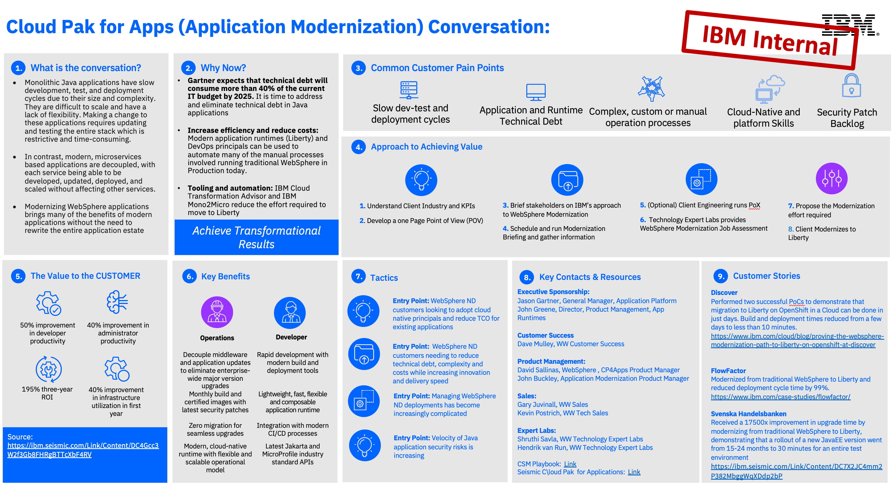

import {Link} from 'gatsby';
import FileLink from '../../../components/FileLink';

<AnchorLinks small>
<AnchorLink>What is Cloud Pak for Applications and what does it do?</AnchorLink>
<AnchorLink>What are the pain points that Cloud Pak for Applications addresses?</AnchorLink>
<AnchorLink>What do CSM driven deployments look like?</AnchorLink>
<AnchorLink>The steps to deploy and who is responsible for what, when?</AnchorLink>
<AnchorLink>How do I expand and grow Cloud Pak for Applications usage?</AnchorLink>
<AnchorLink>There isn't a current use case, where do I start?</AnchorLink>
<AnchorLink>Frequently asked questions</AnchorLink>
</AnchorLinks>

<Row className="resource-card-group">
<Column colMd={4} colLg={4} noGutterSm>
<ResourceCard
      subTitle="Address modernization, cost reduction and flexibility"
      title="WebSphere modernization"
      href='/common/modernization/modernization-was'>

</ResourceCard>

</Column>

<Column colMd={4} colLg={4} noGutterSm>
<ResourceCard
      subTitle="Run virtual machines like any other containerized workload"
      title="OpenShift Virtualization acceleration"
      href='/common/acceleration-plays/openshift-virtualization-play/'>

</ResourceCard>

</Column>
</Row>

<Row>
<Column colMd={8} colLg={8} noGutterMdLeft>

## What is Cloud Pak for Applications and what does it do?  
Cloud Pak for Applications is a bundle of the following:

  - Unrestricted entitlement to Red Hat OpenShift (customers can deploy any workloads to a cluster with this entitlement, which is different to the other Cloud Paks which are restricted to only deploying workloads provided by the Cloud Pak)  
  - PVCs of WebSphere (ND, Base, Liberty) that can be deployed on traditional environments like VMs OR in containers  
  - <a href="https://access.redhat.com/articles/4394291"  target='_blank' rel='noreferrer noopener'>Red Hat Runtimes</a> 
  - Transformation Advisor

Previous (now "End of Service") versions of Cloud Pak for Applications included the following products which are no longer part of Cloud Pak for Applications v5.1

  - PVCs of MobileFirst that can be deployed on traditional environments like VMs OR in containers  
  - Accelerators for Teams and AppNav

<InlineNotification>
Check out our <Link to="/common/modernization/modernization-was">WebSphere Modernization Play</Link> and the <Link to="/common/acceleration-plays/openshift-virtualization-play">OpenShift Virtualization Acceleration Play</Link> for some ideas on how to talk to your customers about Cloud Pak for Applications.
</InlineNotification>

## What are the pain points that Cloud Pak for Applications addresses?

The key pain points that Cloud Pak for Applications addresses are related to the modernization, cost reduction and flexibility, such as:   
**Pain Point: **Need to optimize applications and operations to lower costs and increase flexibility   
**Pain Point: **Desire to modernize applications while utlizing existing investments   
**Pain Point: **Need to run unrestricted Red Hat OpenShift   

Refer to the <Link to='/common/modernization/modernization-was'>WebSphere Modernization Play</Link> for more information on modernizing WebSphere.

## The steps to deploy and who is responsible for what, when?

Customers that purchased Cloud Pak for Applications fall in to two main categories:

1) Customers that have purchased Cloud Pak for Applications that already have some kind of WebSphere deployment and either want to continuing running WebSphere as-is or want to modernize. The objective in these situations is to assist the customer modernize their WebSphere ND environments to Liberty and, if they are interested in containerization, modernize to Libery on OpenShift. 
Work with the account team to understand the current WebSphere footprint and modernization plans. Refer to the <Link to='/common/modernization/modernization-was'>WebSphere Modernization Play</Link> for more information on modernizing WebSphere. 
Client Engineering can help demonstrate the modernization journey to the customer and Technology Expert Labs and our Business Partners can put modernization practices in place to modernize applications at scale.  
2) Customers that have purchased Cloud Pak for Applications for unrestricted OpenShift entitlements. In this case you should use a deployment partner such as Technology Expert Labs or Red Hat themselves to install a production ready OpenShift Cluster

## Who is responsible for what, when?

**Sales Phase**:  
*IBM Sales, IBM Tech Sales*: Close deal, identify sponsor, define success criteria   
*IBM Tech Sales, Client Engineering*: Perform PoX, gain agreement for Technology Expert Labs/Professional services   
**Deployment Phase**:  
*IBM Technology Expert Labs*: Propose services and create DOU, execute DOU and deliver value to the customer   
*IBM CSM, IBM Tech Sales, IBM Technology Expert Labs*: identify areas for expansion and increased usage   

## What do CSM driven deployments look like?

<a href='https://ibm.ent.box.com/s/3v3agcltwl09yugw44m958dfdcyaglcs' target='_blank' rel='noreferrer noopener'>Asian Paints</a> is an example of a CSM driven engagement where the CSM (Prageetika Sharma) and Technology Expert Labs worked together to modernize existing WebSphere ND applications to Liberty on OpenShift.

## How do I expand and grow Cloud Pak for Applications usage?

If your customer has entitlements that they aren't fully utilizing then look to expand the unrestricted OpenShift footprint.

## There isn't a current use case, where do I start?

<FileLink to="/files/app-mod-one-pagers.pptx" target='_blank' rel='noreferrer noopener'>Link to deck</FileLink>

Utilize the <a href="https://www.ibm.com/cloud/architecture/content/field-guide/app-modernization-field-guide" target='_blank' rel='noreferrer noopener'>Application Modernization Field Guide</a> and the<a href="https://ibm-cloud-architecture.github.io/modernization-playbook/applications/" target='_blank' rel='noreferrer noopener'>Modernization Playbook </a> to build a strategy to talk to your customer about their modernization journey

  

</Column>

<Column colMd={4} colLg={4} noGutterMdLeft>

  

<Aside>

**Customer Success Practice Leader:** Noel Colon (@ncolon), Venkata Gadepali (@Vishy) 
**CSM Slack Channel:** <a href='https://ibm-cloud.slack.com/archives/C01L3DZUKEZ' target='_blank' rel='noreferrer noopener'>csm-appmod</a> 
**Learn:** <a href='https://www.ibm.com/cloud/cloud-pak-for-applications' target='_blank' rel='noreferrer noopener'>Public Website</a>  
**Demo:** <a href='https://techzone.ibm.com/collection/application-platform-activation-kit#tab-2' target='_blank' rel='noreferrer noopener'>Transformation Advisor and Liberty demos</a> 
**Practice Leader Overiew:**  
**Roadmap:** <a href='https://ibm.seismic.com/Link/Content/DCPJ2iChwJwES-WEuZMawnDA' target='_blank' rel='noreferrer noopener'>Presentation</a> 
**Seismic:** <a href='https://ibm.seismic.com/Link/Content/DCMBVHgfVhmDd8cDMpfPdTXHhbh3' target='_blank' rel='noreferrer noopener'>Sales Kit [Jan 2024]</a> with Presentations and Pre-sales assets 
**Tech Zone:** <a href='https://techzone.ibm.com/collection/application-platform-activation-kit' target='_blank' rel='noreferrer noopener'>Activation Kit</a> with Demo environments and enablement 
**Deployment options:** Virtual Machine/Bare Metal, Operator, Container

</Aside>

<Aside>

**Build your skills**

Field Guide: <a href="https://www.ibm.com/cloud/architecture/content/field-guide/app-modernization-field-guide" target='_blank' rel='noreferrer noopener'>Application Modernization Field Guide</a> 
Modernization Playbook: <a href="https://ibm-cloud-architecture.github.io/modernization-playbook/applications/" target='_blank' rel='noreferrer noopener'> Public Website</a> 
CSM U: <a href='https://yourlearning.ibm.com/activity/PLAN-53FA3376706B' target='_blank' rel='noreferrer noopener'>LearnIT learning plan</a> 
CSM U: <a href='https://yourlearning.ibm.com/activity/PLAN-416015650B78' target='_blank' rel='noreferrer noopener'>ApplyIT learning plan</a> 
CSM U: <a href='https://yourlearning.ibm.com/activity/PLAN-33069BD4CB5E' target='_blank' rel='noreferrer noopener'>DesignIT learning plan</a> 
Transformation Advisor for CSMs: <a href='https://ibm.box.com/v/TAforTechSales' target='_blank' rel='noreferrer noopener'>Presentation</a> and <a href='https://ibm.box.com/v/TAforTechSalesRecording' target='_blank' rel='noreferrer noopener'>Recording</a>

</Aside>

<Aside>

**Who can help me?**

**Dave Mulley** (dmulley@us.ibm.com) has many years experience working with WebSphere customers and helping them modernize. 
**Client Engineering** and **Tech Sales** also have the skills required to talk to customers and can help them modernize their WebSphere footprint. 
**Technology Expert Labs** can deliver solution design, deploy production environments, deliver full stack observability, create outcome SOW and account plans (for a fee)

</Aside>

<Aside>

**Customer facing case studies?**

Case Study showing how <a href='https://ibm.ent.box.com/s/3v3agcltwl09yugw44m958dfdcyaglcs' target='_blank' rel='noreferrer noopener'>Asian Paints</a> modernized from WebSphere ND. IBM Technology Expert Labs embarked on a significant AppMod journey with Asian Paints in transforming their existing WebSphere applications to Red Hat OpenShift with IBM Cloud Pak for Applications. Besides migration to Liberty containers, Expert Labs had closely worked with Asian Paints in integrating their existing DevOps investments and demonstrating key cloud capabilities like AutoScaling, HealthChecks, Logging and Monitoring Dashboards on OpenShift.
There are many other case studies in the <a href='https://csm-usecase.dal1a.cirrus.ibm.com/' target='_blank' rel='noreferrer noopener'>Use Case Repository (deprecated)</a> and in the <a href='https://ibm.biz/IBM_STARS' target='_blank' rel='noreferrer noopener'>STARS repository.</a>

</Aside>

<Aside>

**Workshops**

There is an <a href='https://w3.ibm.com/w3publisher/automation-innovation-workshop' target='_blank' rel='noreferrer noopener'>Automation Innovation Workshop</a> (free) that can be used when trying to generate interest, sponsors and use cases that is available to Sales teams and CSMs. This workshop is delivered by senior IBM specialists and is targeted at the Senior Leadership team at your customer.  
The <a target='_blank' rel='noreferrer noopener' href='https://techzone.ibm.com/collection/application-platform-activation-kit'>Proof of Technology workshop</a>. The focus of this workshop is to introduce the modernization tools that are included with Cloud Pak for Applications and WebSphere Hybrid Edition and to work through some lab exercises using pre-defined data.  

</Aside>

<Aside>

**Technology Expert Labs offerings**

<a href='http://ibm.biz/ExpertLabs-Automation' target='_blank' rel='noreferrer noopener'>Technology Expert Labs Automation offerings</a>

</Aside>

</Column>

</Row>

<Row>

<Column>

_____________________________

## Frequently asked questions

**Does Cloud Pak for Applications include Mono2Micro?**

Yes.  Starting with CP4Apps 5.2 Mono2Micro is included  as a licensed product.

**Cloud Pak for Applications Deployment: Overview and General Guidance**

**There were THREE primary use cases / scenarios that drove the acquisition of Cloud Pak for Applications:**

1. In support of growth and/or application modernization of existing WAS/Liberty estate.
2. In order to access RedHat OpenShift Cloud Platform (OCP) and/or RedHat Runtimes (RHR) (possibly in combination with the prior point).
3. Commercial transaction, no use cases defined (typically found only in ELA catalog bookings).

In EACH of the above scenarios we should continue to ACTIVELY PROMOTE deployment of CP4Apps.

**Clients might want to consider alternative deployment plans if they plan to deploy the following features or components of Cloud Pak for Applications:**

Accelerators for Teams: These features have been deprecated.

Mobile Foundation: Support for Mobile Foundation &mdash; As part of Cloud Pak for Applications will be discontinued on April 30, 2022. Mobile Foundation can still be purchased separately. No end of support for the standalone offering has been announced.

**My client wants to exchange Cloud Pak for Applications for WebSphere Hybrid Edition? Can they do that, and if so, what is the process?**

WebSphere Hybrid Edition is included in the latest version of Cloud Pak for Applications.

For any other questions not answered here, please review the <a href="https://ibm.seismic.com/app?ContentId=ddfffffb-8673-4728-8d69-ba54bfe8cb94" target='_blank' rel='noreferrer noopener'>CP4Apps FAQ</a>.

</Column>
</Row>
