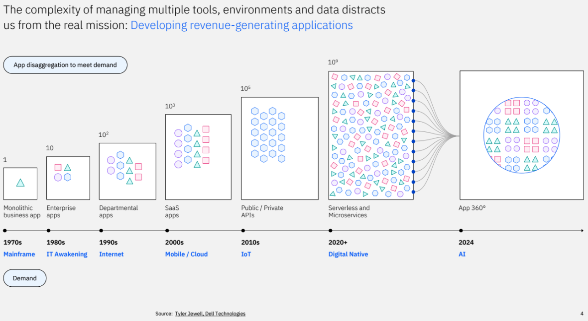
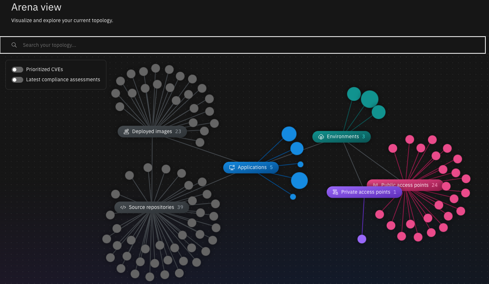
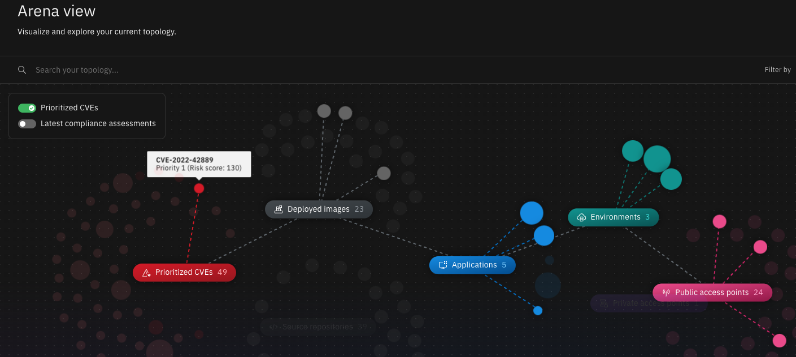
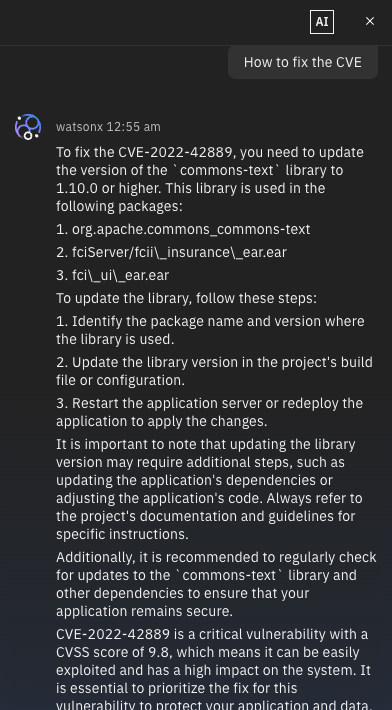
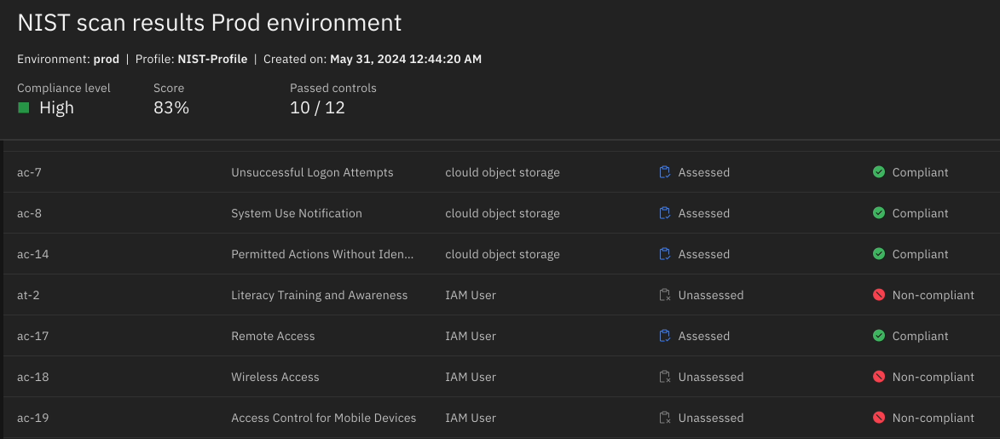
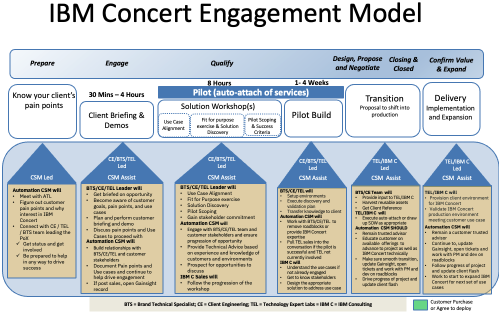
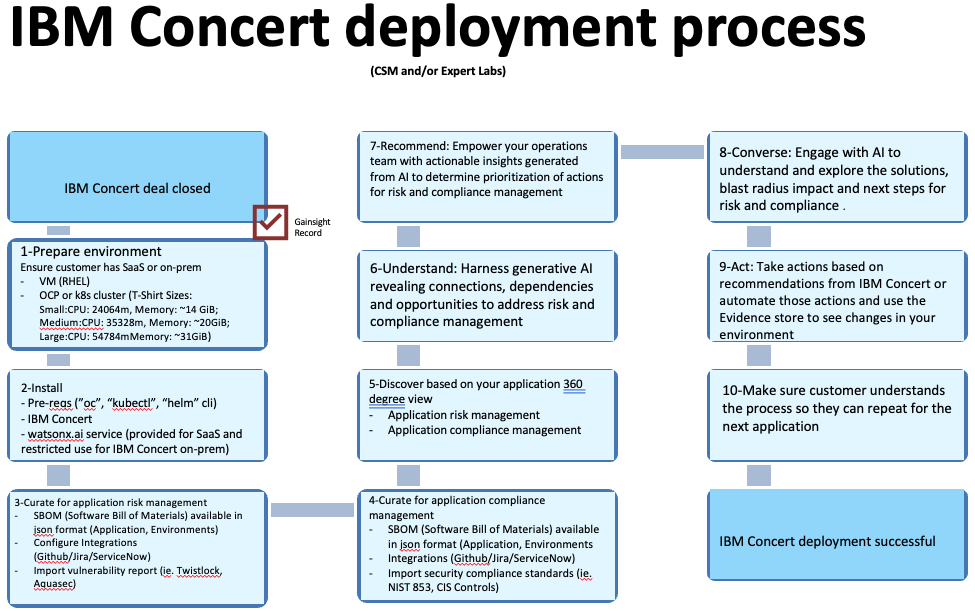
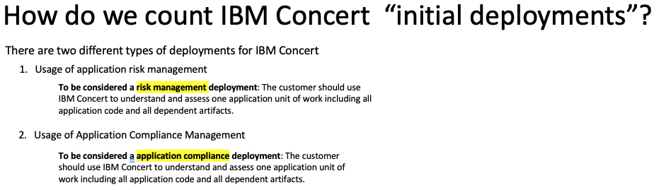

import {Link} from 'gatsby';
import FileLink from '../../../components/FileLink';

<Row>

<Column>

<Tabs>

<Tab label='WW contacts'>

| WW contact | Name |
| --- | --- |
| **Customer Success Practice Leaders:** | Hollis Chui (@hollisc)|
| **Technology Expert Labs Delivery Lead:** | Saumil Patel (@saumilpp) |
| **Technology Expert Labs Solution Engineering:** | Ricardo Olivieri (@ricardo.olivieri) |
| **Technology Expert Labs GDC Leader:** | Richard Trickey (@Richard Trickey) |
| **Technology Expert Labs Product Management:** | Marian Kaminski (@Marian) |
| **Technology Expert Labs Automation Sales Leader:** | Brent Murray (@bmurray) |
</Tab>

<Tab label='Who can help?'>

| Role | Assset |
| --- | --- |
| **Customer Success** | Slack: TBD |
| **Client Engineering** | Slack: TBD |
| **Tech Sales** | Slack: TBD |
| **Technology Expert Labs:** | Slack: TBD  |

</Tab>

<Tab label='IBM Concert contacts'>

| Role | Name |
| --- | --- |
| WW Technical Sales | Oved Lourie (@Oved) |
| IBM Concert Product Management | Joshua Kim (@joshkim), Jennifer Fitzgerald (@Jenny Fitzgerald) |
| IBM Concert Product Engineering Focal | Mahesh Dashora (@maheshd) |

</Tab>

</Tabs>

</Column>
</Row>

<Row>
<Column colMd={9} colLg={9} noGutterMdLeft>

## What is IBM Concert

IBM Concert provides generated AI-powered insights to help clients understand their application landscape and enables them to discover the connections, dependencies, gaps and opportunities in their application architecture. 

With businesses looking to harness AI to revolutionize technology operations, IBM Concert delivers a 360-degree view of the application lifecycle management, using AI to make sense of complex data signals producted by multiple environments and toolsets.  

### What can IBM Concert do?

- **Discover:** Experience seamless integration as IBM Concert connects with your environments and toolsets, uncovering crucial data about your application's opearations.
- **Understand:** Harness the power of generative AI as IBM Concert delves into your application architecture, revealing intricate connections, dependencies and invaluable opportunites.
- **Recommend:** Empower your organization with actionable insights as IBM Concert genrates strategic recommendations to enhance your applciation's performance and efficiency.
- **Converse:** Engage in intuitive converations with IBM Concert using natural language processing (NLP).  Question its conclusions, comprehence its recommendations, and explore the potential impact on your applications.
- **Act:** Take action based on the recommendations of IBM Concert or automate actions.

### Who are the personas to target?

- Look for enterprise companies that use multiple applications across various environments.  
- Companies with data silos that prevent them from seeing all their application data end-to-end.
- Target personas:
  - **Buyers:** CTO, CIO, Directior of {Application}, Ops Manager, Application Owners
  - **Influencers:** Internal & Eternal auditors
  - **Users:** Site Reliability Engineers (SREs), Software Developers, Dev/Net/SecOps

### Where does IBN Concert run? 

IBM Concert can be provisioned as a SaaS instnace or installed on-premised on a VM, OpenShift or Kubernetes clsuter.  Refer to the product documentation for the supported OS and hardware requirements.  

### What integrations does IBM Concert support?
TBD

### Foundational learning 

CSMs should complete the following:

- [IBM Concert - Preview and Demo](https://ec.yourlearning.ibm.com/w3/playback/10445349)
- IBM Concert Pre-GA Enablement 
  - Enroll in the Americas/EMEA call on June 13: [link](https://ec.yourlearning.ibm.com/w3/event/10429779)
  - Enroll in the APAC/Japan call on June 13: [link](https://ec.yourlearning.ibm.com/w3/event/10444827)
- IBM Concert Platinum Demos and Videos: Available on June 14
- IBM Concert Deep Dive Sessions: Targeted for July 2024​
- IBM Concert Level 1: Targeted for July 10, 2024​
- IBM Concert Level 2: Targeted for mid-August 2024

The following courses provide the foundational knowledge required to be able to talk to customers about [watsonx.ai](https://www.ibm.com/products/watsonx-ai) and IBM’s approach to watsonx:

- [AI for Business Level 1](https://yourlearning.ibm.com/activity/PLAN-E3DED51F67AA) 
- [AI Fundamentals Level 1](https://yourlearning.ibm.com/activity/PLAN-402D037C5668). 

</Column>

</Row>

<Row>

<Column colMd={6} colLg={6} noGutterMdLeft>

### IBM Concert Use Cases

<Tabs>

<Tab label='Application Risk Management'>

Empower application owners and site reliability engieners (SREs) to proactively prioritize, mitigate and trace application vulnerabilities to ensure resilient operations. 

**Business outcomes**

– Eliminate manual scripts and spreadsheets
– Prioritize CVEs promptly based on application impact and receive actionable recommendations for resolution
– Visualize the CVE blast radius and simulate remediation scenarios effortlessly by taking meaningful and swift action

**Why act now?**

– Reclaim time: 40% of organizations spend over 5,000 hours yearly on risk mitigation 
– Optimize costs: 25% of business revenue is spent on risk and compliance 
– Drive innovation: Security teams focused on risk mitigation neglect proactive  

**Benefits**

- Gain complete risk visiblity: Consolidate the management of CVEs and security certificates into a single, interactive dashboard for complete visibility. 
- Focus on prioritized risks based on the impact: Enable focused and efficient risk mitigation with AI-driven analysis that ranks CVEs and certificates based on their impact. 
- Assess the impact of risks: Assess the "blast radius" of risks, offering insights into the operational impact of vulnerabilities and expiring certificates. 

- Get CVE mitgitation recommendations: Get concrete suggestions for CVE mitigation using natural language, with instant deep dives into context and follow-on actions. 

- Connect existing tools for faster remediation: Turn suggested actions into actionable insights with seamless integrations into ServiceNow, Jira and GitHub, further reducing remediation time. 
- Apply learnings from past mitigation efforts: Show how CVEs have impacted your application over time and illustrate the impact of previous CVE mitigation efforts. 

**Drive results**

- App centric insights: Focus on applications providing comprehensive insights that transcend the traditional infrastructure silos. 
– Risk prioritization: Prioritize risks based on their impact on applications, ensuring organizations address critical vulnerabilities effectively. 
– Instant context: Deliver real-time insights with instant context, empowering decision-makers to make informed decisions swiftly while enhancing overall operational efficiency. 

</Tab>

<Tab label='Application Compliance Management'>

Empower application owners and site reliability engieners (SREs) to proactively understand compliance controls, assess your environment for those controls , and recommend/prioritize  actions to be taken to achieve compliance.

**Business outcomes**

– Spend less time navigating compliance controls 
– Assess your application’s compliance posture against NIST 800-53, CIS Controls, and more for a deeper understanding of potential compliance issues 

– Anticipate the compliance impact of development decisions in the pre-deployment stage before it affects the end users 

**Why act now?**

– Streamline cost management: 25% of business revenue is spent on risk and compliance 
– Increase efficiency: Tracking compliance to meet regulatory requirements burdens the application and compliance teams 

**Benefits**

- Track compliance posture of your apps: Track compliance against NIST 800-53 and NIST 800-37, with support for additional compliance standards coming later in 2024. 
- Assess compliance impact: Assess the impact of compliance actions on application functionality through the “blast radius” view. 
- Monitor compliance deviations: Track deviations from compliance standards and assess the impact of potential remediation pathways. 
- Prioritize compliance efforts: Prioritize compliance work by impact to the application, with concrete recommendations for action. 

**Drive results**

– Continuous integration: Integrate compliance monitoring into the application lifecycle and ensure adherence to standards as applications evolve and scale. 
– Holistic view: Use a unified view of compliance impacts across application, security and compliance teams to enable streamlined collaboration and decision-making. 
– Prioritized focus: Prioritize compliance considerations during development and avoid costly post-deployment re-factoring to foster a proactive compliance culture within application teams. 

</Tab>

</Tabs>

</Column>

</Row>

<Row>

<Column>

-----

What is the engagement model

CSM must engage the client from the very beginning to enable IBM to accelerate deployments.  Technology Expert Labs is engaged from the very beginning on IBM Concert with auto-attach of services.  Below is the engagement model as well as how the model should be executed. 

CSMs should be engaged prior to the sale.  This is a new product with a lot of focus and interest from IBM Corporate and Automation customers.  As a result of being new, it is not in current ELA catalogs so CSMs need to engage early to build reslationships.  CSMs need to be engaged as part of the POCs to understand what roadblocks exists so they can avoid them during deployment time.  

-----

## Deployment stages (Milestones)

Deployments are tracked in Gainsight through <Link to='/onboard/gainsight-create-growth-plan'>Growth Plans</Link>. In ISC, these deployments are called Deployment Opportunities. These <Link to='/deploy/document-the-plan'>Deployment stages</Link> are called <Link to='/onboard/gainsight-milestones'>Milestones</Link> in Gainsight.

-----
### Identify phase

#### Common practices

Before you start to work with the customer, you will need to learn about the customer, their industry, what was sold, and who you might work with.  Work with the seller and account team to understand if a sponsor(s) and use case(s) were identified.

| Practice | Description |
| --- | --- |
| <Link to='/onboard/understand-client-it-landscape/'>Learn about the customer</Link> | Before you get started, you need to learn about your customer and their business. |
| <Link to='/onboard/learn-partner/'>Learn about the partner</Link> | If your customer is working with a partner, you need to learn about the partner and their relationship with IBM and the customer. |
| <Link to='/onboard/understand-deal/'>Understand the deal</Link> | Learn where to find information related to how the product was sold to the customer. |
| <Link to='/deploy/identify/'>Identify</Link> | Understand what the customer will need to be successful. |

#### Product-specific practices

| Led by | Outcome | Assets & Activities |
| --- | --- | --- |
| CSM | Prioritized use case | **If the customer has already done a PoC?** The CE team has already, through the workshop, identified use cases that customers might be interested in. The CSM should have a Transition meeting with the CE team. Before the meeting study all of the documents that were produced during the workshops to get a clear understanding of the use cases.    **If the customer has NOT done a POC?** Meet with the account ATL (Account Technical Leader) and BTS (Brand Technical Seller) to understand customer pain points around the solution and to get customer contacts.  Reach out to those contacts through the ATL or Seller. Those contacts should include a manager of an application team. Begin to gather this information and propose a briefing and demo of IBM Concert. Through this exercise, you should be able to identify one or more use cases to pursue. |

------

### Propose phase

#### Common practices

| Practice | Description |
| --- | --- |
| <Link to='/deploy/propose-solution/'>Propose the solution</Link> | Understand what the customer will need to be successful. |

#### Product-specific practices

| Led by | Outcome | Assets & Activities |
| --- | --- | --- |
| CSM | An agreement and plan for TEL Design and Architecture Workshop. | - Based on the customer's knowledge of IBM Concert, you might need to perform another briefing or demo for this customer.   - Propose to the customer the Design and Architecture Workshop or getting the TEL rep to present it. |

------

### Sponsored phase

#### Common practices

| Practice | Description |
| --- | --- |
| <Link to='/deploy/get-sponsorship/'>Get Sponsorship</Link> | Identify the people in the organization who will help you establish the value of the solution. |

#### Product-specific practices

| Led by | Outcome | Assets & Activities |
| --- | --- | --- |
| CSM | Find an application area and application owner who is prepared to begin the IBM Concert workshop. |  **If the customer has already done a PoX ?**   - The CE team has probably identified, through the set of use cases, who the product owners are and the potential sponsors. As part of the Transition from CE, the CSM should familiarize themselves with key application owners and get introductions from the CE team if hasn’t already been done.   - Work with the application owner to plan the Design and Architecture Workshop. Help them to identify the right people to engage in the workshop. This should be the application architects who have a depth of understanding of the application landscape.    **If the customer has NOT done a PoX or if this Application Owner was not involved in the PoX?**   - Based on this individual’s knowledge of IBM Concert, you may need to perform another briefing a demo for this individual.   - Work with the Application Owner to plan the Design and Architecture Workshop. Help them to identify the right people to engage in the workshop. This should be application architects who have a depth of understanding of the application landscape.    **After a sponsor is identified:**  - Submit a request for the Workshop to Expert Labs through the <a href='https://survey.alchemer.com/s3/7197619/Solution-Engineering-Request-Form' target='_blank' rel='noreferrer noopener'>Request an Expert Labs Solution Engineer</a> form.  - Work with the customer and Expert Lab to schedule the workshop  - Be sure to brief Expert Labs regarding customer pain points and priorities.

</Column>

</Row>

<Row>

<Column>

------

### Planning phase

#### Common practices

| Practice | Description |
| --- | --- |
| <Link to='/deploy/plan-deployment/'>Plan deployment</Link> | Plan the deployment, create the architecture, and set a target date. |

#### Product-specific practices

| Led by | Outcome | Assets & Activities |
| --- | --- | --- |
| CSM | A plan for deploying the product and exploring its capabilities. | - Organize the Expert Labs workshop   - Identify specific customer use cases  - Pay special attention to additional use case expansion opportunities post deployment |
| TEL | - Customer use cases identified and detailed.   - Plan for MVP deployment   - SOW for MVP implementation  | - Execute on the Design and Architecture Workshop.   - Work with the customer to identify use cases and assess their environmental Production Readiness for deployment   - Share with the customer the pre-req requirements for installation. |

------

### Deploying phase

**Deployment Options:** SaaS, Virtual Machine, OpenShift/k8s

#### Common practices

| Practice | Description |
| --- | --- |
| <Link to='/deploy/install-provision/'>Deploying</Link> | Get the right resources in place. Install and build. |

#### Product-specific practices

| Led by | Outcome | Assets & Activities |
| --- | --- | --- |
| CSM and TEL | An infrastructure in place with the right ports open and the right users created and with correct access. | Prepare the Environment |
| CSM and TEL | On-prem only - IBM Concert installed and configured. | IBM Concert pre-reqs and software are installed and watsonx.ai service is connected. |
| CSM and TEL | A curated application for the application risk management use case. | Generate a SBOM (Software Bill of Materials) for the application and environment, configure an integration with Github/Jira/ServiceNow, and ingest the vulnerability report (ie. Tiwstlock, Aquasec). | 
| CSM and TEL | A curated application for the application compliance management use case | Generate a SBOM (Software Bill of Materials) for the application and environment, configure an integration with Github/Jira/ServiceNow, and import the required security compliance standards (NIST 853, CIS Controls). |
| CSM and TEL | Discover the application 360 view of the target application with CVE and compliance data. | Ingestion the SBOM (Software Bill of Materials), the application vulnerability report and the required compliance standards. |
| CSM and TEL | Understand the CVE and compliance risks of the application deployed in the target environments. | Review the risk score and blast radius of CVEs and compliance risks in your environments. |
| CSM and TEL | Prioritize actions to manage risks and compliance issues. | Enable the operations team with AI generated insights and actions to take for vulernabilities and compliance risks. |
| CSM and TEL | Engage with AI to anage the applicaion risks and compliance issues. | Enable the operations team to use AI to obtain more details and the actions to take to address the risks and compliance issues. |
| CSM and TEL | Take actions to address the identified risks and compliance issues. | Enable the operations team to take actions to address the risks and compliance issues found in the application and maintain a history of changes with the environment for auditability. |
| CSM and TEL | Customer educated and able to curate and ingest additional applications. | Make sure the customer is clear on the process and start the discussion about the new application. |

------

### Deployed / Confirm value phase

#### Common practices

| Practice | Description |
| --- | --- |
| <Link to='/deploy/measure-success/'>Confirm value</Link> | Measure success. |

#### Product-specific practices

| Led by | Outcome | Assets & Activities |
| --- | --- | --- |
| CSM and TEL | IBM Concert is used by the customer to manage their application risk and compliance. | - Review with the customer the success criteria to make sure all the goals were met.   - Gather feedback from the customer and open up an aha idea with their suggested improvements. |

</Column>

</Row>

<Row>

<Column>

-----

### Expand

Use Case and Sponsors will ensure a successful first project deployment.  From there the positioning of additional services driven by new use cases will validate the need for additional compute or CP4D services.

| Practice | Description |
| --- | --- |
| <Link to='deploy/measure-success/'>Confirm value</Link> |  Show the customer the value they are achieving with their investment. |
| <Link to='/expand-renew/expand-offerings/'>Expand</Link> | Grow customer's use of the offerings. |

#### Product-specific practices
TBD

</Column>

</Row>

<Row>

<Column colMd={4} colLg={4} noGutterMdLeft>
 

<Aside>

**CSM Slack Channel:** [#csm-observability](https://ibm.enterprise.slack.com/archives/C01LWEJK8D6) 
**IBM Concert AMA Slack Channel:** [#ibm-concert-ama](https://ibm.enterprise.slack.com/archives/C074EL397AN) 
**IBM Concert Documentation:** TBD

**Roadmap:** TBD
**IBM Concert Sales Kit:** [link](https://ibm.seismic.com/Link/Content/DCPFRbd9pcGhb8fWCgHGmjFPFm4P)  

</Aside>

</Column>

<Column colMd={4} colLg={4} noGutterMdLeft>

 

<Aside>

**Technology Expert Labs offerings:**
**IBM Concert Service Offering:** TBD

</Aside>

<Aside>

**Client 101 Deck:** [link](https://ibm.seismic.com/Link/Content/DCHBJCj2TFgjC89Xp8JpQpd8q2Hd) 
**Propspecting Guide:** [link](https://ibm.seismic.com/Link/Content/DChh4Xgj4Xmb9GQHT2MF7X7GjRfB)

</Aside>

</Column>

<Column colMd={4} colLg={4} noGutterMdLeft>

 

<Aside>

**Build Your Skills:** 
**IBM THINK 2024 Keynote:** [The Era of AI-powered Automation](https://www.ibm.com/think/videos/technology-operations-with-ai-automation?lnk=thUSkey2)
**IBM Concert Preview and Demo:** [link](https://ec.yourlearning.ibm.com/w3/meeting/10434545) | [Deck](https://ibm.ent.box.com/s/13i45vuxq7fiu9tioo4tycyxr7434n3w)

**Level 1:** TBD 
**Level 2:** TBD 
**Level 3:** TBD 

</Aside>
<Aside>

**Frequently Asked Questions:**
TBD

</Aside>
</Column>

</Row>
