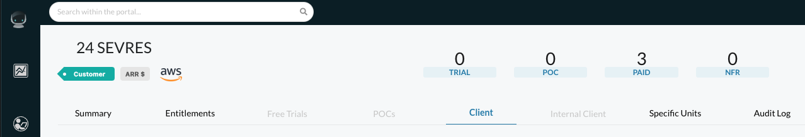
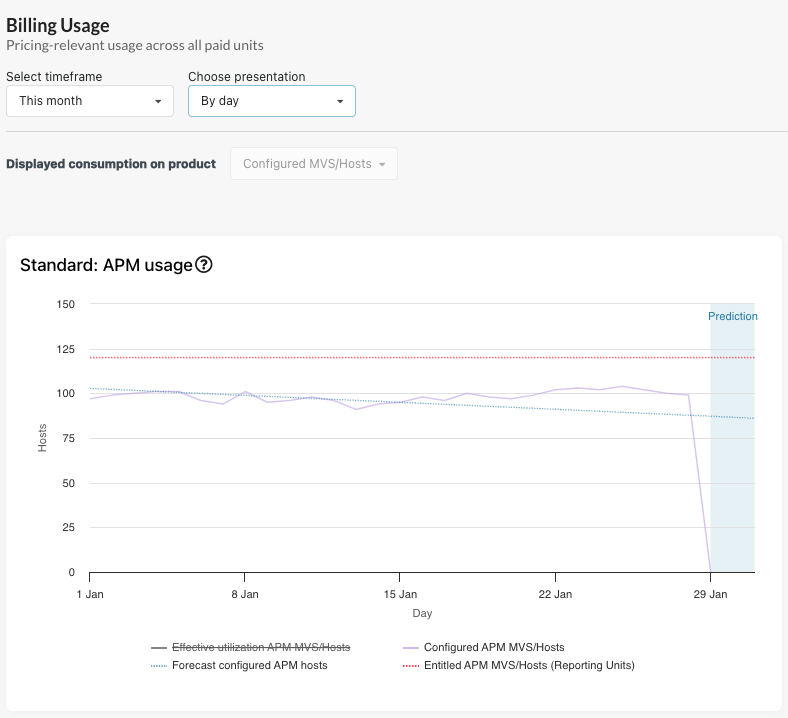
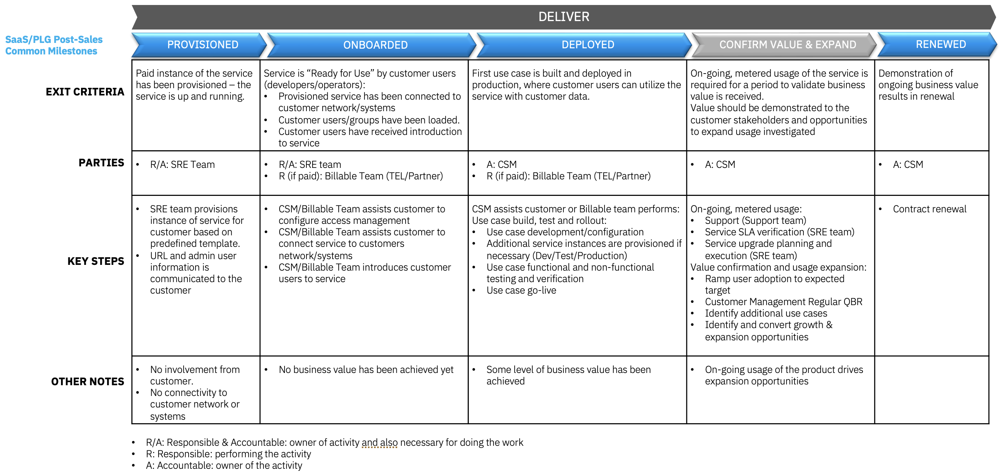
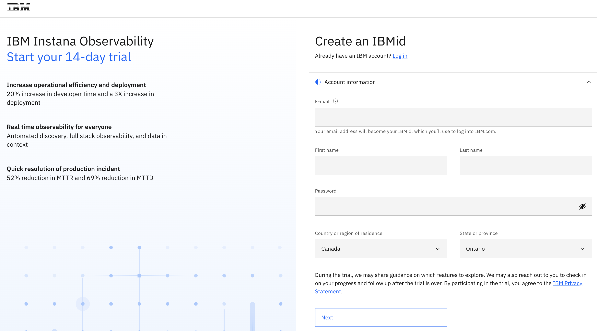
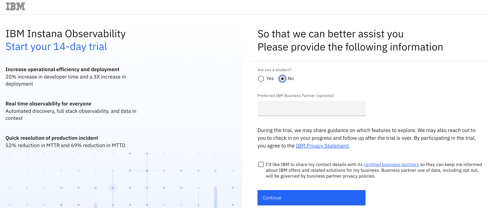

import {Link} from 'gatsby'

<InlineNotification kind="warning">

**Note: The <i>AUTOMATED</i> deployment metrics are pending sign-off and should be considered in progress until this notice is removed.**

The following considerations should be taken when reporting on SaaS deployments:
- All deployments for SaaS should follow the same process as non-SaaS / on-prem deployments
- Create one Growth Plan per use case
- Growth Plan project stages will be used to determine milestone status
- Deployed growth plans require a success plan review by a manager before being counted in the CSM scorecard
- All 3 deployment questions must be answered for the Growth Plan before being counted in the CSM scorecard

See below for detailed instructions on how to view the usage for your account.
</InlineNotification>

## Contacts

| WW contact | Name | WW contact | Name |
| --- | --- | --- | --- |
| **Customer Success Practice Leaders:** | Hollis Chui (<hollisc@ca.ibm.com>) | **Digital Customer Success & PLG:** | Rob Young (<robert.young1@ibm.com>) |
| **Technology Expert Labs Delivery:** | Saumil Patel (<saumilpp@us.ibm.com>) | **Technology Expert Labs Solution Engineering:** | Luca Floris (<luca.floris@uk.ibm.com>) |
| **SRE:** | Della Lenz (<della.lenz@ibm.com>), Mary Yost (<maryyost@us.ibm.com>) | | |

<Row>
<Column colMd={9} colLg={9}>

## Overview
As a CSM, your focus is to guide and nurture your customers who have an Instana SaaS entitlement.  Your job is to guide the customer with provisioning through onboarding (install an agent, invite/add users), help with their first use case (create application perspectives, set up alerts), and continue to expand their use cases.

</Column>
</Row>

<Row>
<Column>

| FAQ | Answer |
| --- | --- |
| What is the relationship name in Gainsight? | Instana SaaS |
| Which Clouds does this product run on? | AWS and GCP |
| How is SaaS usage calculated? | <a href='https://ibm.seismic.com/Link/Content/DC3FqhbFPPcCV87XqWD8hgR7JffP?anchorId=b1cf147f-2d41-4386-bd4e-2d3462e8b66d#/?anchorId=b1cf147f-2d41-4386-bd4e-2d3462e8b66d' target='_blank' rel='noreferrer noopener'>SaaS Seller Enablement</a> |
| Who can help my customer with billing/invoicing questions? | Della Lenz (<della.lenz@ibm.com>) |
| Where is the documentation? | <a href='https://www.ibm.com/docs/en/instana-observability/current' target='_blank' rel='noreferrer noopener'>IBM Instana Observability Documentation</a> (<a href='https://www.ibm.com/docs/en/instana-observability/current?topic=notes-saas' target='_blank' rel='noreferrer noopener'>Instana SaaS Release Notes</a>, <a href='https://www.ibm.com/docs/en/instana-observability/current?topic=requirements-instana-saas-deployments' target='_blank' rel='noreferrer noopener'>Outbound network accss requirements for SaaS deployments</a>) |
| Are the SaaS capabilities different from the on-prem offering? | No, the product code and capabilities are the same |
| How to view my client's usage of Instana SaaS and how to get access? | Instana SaaS telemetry data for a customer's account can be viewed using the <a href='https://instana.io/portal2/#/customers?page=0&pageSize=25' target='_blank' rel='noreferrer noopener'>Instana Portal</a>.  Request access through AccessHub using these <a href='https://ibm.ent.box.com/s/cssvm4bhrij85cijkl25numzcrxv1anm' target='_blank' rel='noreferrer noopener'>instructions</a>. |
| Does Instana SaaS run on OpenShift? | No |
| Is Instana SaaS consumable or ratable revenue? | Ratable. The unit of consumption is MVS (Managed Virtual Server) |
| Who triggers deployment? | Growth Plan & Manager Assessed until Instrumented  |

</Column>
</Row>

<Row>
<Column colMd={9} colLg={9}>

### CSM Scorecard Milestones based on usage

SaaS milestones for the CSM Scorecard are based on usage. To progress from Planning to Deploying to Deployed, see <Link to='/common/saas-growth/#automation-milestones-based-on-usage'>Automation milestones based on usage</Link>.

</Column>
</Row>

<Row>
<Column>

<Accordion>
<AccordionItem title="View and track MVS usage using the Instana Portal">
Instana SaaS telemetry data for a customer's account can be viewed using the <a href='https://instana.io/portal2/#/customers?page=0&pageSize=25' target='_blank' rel='noreferrer noopener'>Instana Portal</a>.
Refer to the FAQ on the page for instructions on how to request access. 

After access has been granted, refer to the steps below on how to check the MVS usage for your account. 

- The <a href='https://instana.io/portal2/#/customers' target='_blank' rel='noreferrer noopener'>Clients</a> page lists all **SaaS**, **On-prem** and **Hybrid** customers.
- Search for your customer's SaaS instance and select the **Client tab**. 
    
- Scroll down to the **Billing Usage** section, specify the following values for the two fields and review the **Standard: APM usage** graph.  It shows both the entitled and consumed MVS.
    - Select timeframe: This month
    - Choose presentation: By day
    
    
</AccordionItem>
<AccordionItem title="SaaS adoption journey insights">
SaaS has an additional level of insights that are used to track the adoption journey. These provide an additional level of detail specifically for SaaS adoption.  For Instana, they are shown in the table below:

| 
Insight
 | 
Description
 |
| --- | --- | --- | --- |
| Paid Provisioned | Customer has purchased the product |
| Paid Onboarding Progress | A target has not been connected |
| Paid Onboarded | Completion of the Onboarding Checklist |
| Paid Deployed | First use case or feature deployed in production environment |
</AccordionItem>
</Accordion>

</Column>
</Row>

<Row>
<Column colMd={9} colLg={9}>

### Instana Product Feature Adoption and Value Realized Indicators
Instana Product Feature Adoption and Value Realized Indicators are instrumented in the product to show the capabilities and features that the customer is using. This information can be used to determine the level of adoption that has taken place and ensure that the customer is receiving full business value from the product. See below for novice, intermediate and advanced level insights.

</Column>
</Row>

<Row>
<Column>

<Accordion>
<AccordionItem title="Novice level indicators">

| Product Feature | Description |
| --- | --- |
| Reporting application perspective | Definition of a "call filter" - commonly setting the context of an application and its supporting services and endpoints |
| Website monitored | Performance monitoring of websites |
| Website Smart Alerts Active | Event/Alert Definition tuned to historical observed Website performance |
| Application Smart Alert Active | Event/Alert Definition tuned to historical observed Application performance |
| Alerts | Alerts that actually fire |
| Alert Channels | Communication Channel to receive notification of events |
| Active Alerts | Properly configured alerts firing through alert channels |
| Application Perspective | Definition of a "call filter" - commonly setting the context of an application and its supporting services and endpoints |

</AccordionItem>

<AccordionItem title="Intermediate level indicators">

| Product Feature | Description |
| --- | --- |
| Custom Dashboard | Customizable graphical display of data |
| Pipeline Feedback | Pipeline feedback mechanism to tag deployments with time and context |
| Mobile Apps | Performance monitoring of mobile applications |

</AccordionItem>

<AccordionItem title="Advance level indicators">

| Product Feature | Description |
| --- | --- |
| Custom Events | Custom-made event definitions for infrastructure metrics |
| Reporting Synthetics Test | Tests running and reporting results |
| Reporting Synthetics Location | Points of presence (POPs) running tests |
| Synthetic Locations | Points of presence (POPs) from which synthetic tests originate and execute |
| Synthetic Tests | Scripted tests to exercise services or web pages |

</AccordionItem>

</Accordion>

</Column>
</Row>

<Row>
<Column colMd={9} colLg={9}>

## Post-sales journey  
When a customer converts from a trial to a paid licensed product, a CSM Architect or Digital CSM assigned to the account can digitally welcome and nurture the users along their product journey.  The CSM can take actions based on key milestone events.
The diagram shows the Instana SaaS post-sales journey at a high level. Each section is broken down in detail with links to assets below.

</Column>
</Row>

<Row>
<Column>

### Provisioned

| **Led by** | **Outcome** | **Assets & Activities** |
| --- | --- | --- |
| IBM Instana SRE | Instana SaaS instance provisioned and the customer has access.   The Instana SaaS instance is multi-tenant.  The client is required to create an <a href='https://www.ibm.com/account/reg/us-en/signup?formid=urx-19776' target='_blank' rel='noreferrer noopener'>IBMid account</a> | **Provisioning the service:**  **Request a 14-day free trial instance**  1. Click on this link to request an <a href='https://www.ibm.com/account/reg/us-en/signup?formid=urx-52345' target='_blank' rel='noreferrer noopener'>IBM Instana Observability free trial</a> and create an IBMid.    2. Complete the form and click **Continue**.    3. You will receive an email with a link to access your SaaS instance along with the Instana Agent key and installation guide.   **Upgrade from a trial to a paid instance from the AWS Marketplace**  1. When the trial instance is provisioned, an email indicating your IBM subscription is ready to use will contain a link to <a href='https://myibm.ibm.com/dashboard/' target='_blank' rel='noreferrer noopener'>My IBM</a>.   2. Under **My products**, click on the **Upgrade options** link to switch to a paid plan.    **How to request a paid instance if my customer already owns an Instana SaaS entitlement**   For customers who already own an Instana SaaS entitlement, work with the IBM Tech Seller assigned to the account to fill out a license activation form.  They will submit the request to the SRE team to provision an instance.  - Americas: Ryan Strehlke, Masa Kawano, Jimmy Herbert, Bobby Coppersmith, Drew Flower   - EMEA: Michael Nagar   - APAC: Madura Eleperuma   - Japan: Brent Butchard

### Onboarded

| **Led by** | **Outcome** | **Assets & Activities** |
| --- | --- | --- |
| IBM Instana SRE and IBM CSM | Customer has validated access to their Instana SaaS instance using their IBMid, installed an agent and/or invited additional users. | **Technology Expert Labs Offerings:**   <a href='https://ibm.seismic.com/Link/Content/DCMj9fQQ2QP6JGmGWbhcJBdjVBpd' target='_blank' rel='noreferrer noopener'>**Plan Instana**</a>   IBM will review, validate, and understand during a remote discussion with a customer.  A roadmap of adoption implementation recommendations based on customer priorities will be developed for further service opportunities.    **Getting started:**   After the Instana SaaS instance has been provisioned, a customer can access their instance URL from the IBM SaaS console or the link in the provision request email.  Upon the initial sign-in, the user will be prompted to set up their password to access the Instana Console. A customer can configure the instance to use a different access management system but will need to work with support.   The next step is to <a href='https://www.ibm.com/docs/en/instana-observability/current?topic=installing-instana-agents' target='_blank' rel='noreferrer noopener'>install the agent</a> and Instana will automatically discover and map your services and infrastructure components. |

### Deployed

| **Led by** | **Outcome** | **Assets & Activities** |
| --- | --- | --- |
| IBM CSM or Technology Expert Labs | Client is using >50% of the purchased subscription capacity for two consecutive months to be receiving value and considered "deployed". | **Technology Expert Labs Offerings:**   **Build Instana** Coming soon    **Use the solution:**   CSMs should utilize billable services from Technology Expert Labs to observe the applications and infrastructure components required by the customer.   CSMs that have customers that want to use Instana SaaS without the support of Technology Expert Labs will need to provide support themselves using the resources available in the <a href='https://pages.github.ibm.com/csm-playbook-staging/playbook/common/automation/csm-automation-instana/' target='_blank' rel='noreferrer noopener'>Instana playbook</a> or <a href='https://instana-demo-development.5a8cbfd1.public.multi-containers.ibm.com/' target='_blank' rel='noreferrer noopener'>experience Instana</a> by going through a walk-through demo. |

### Confirm Value & Expand

| **Led by** | **Outcome** | **Assets & Activities** |
| --- | --- | --- |
| IBM CSM | Customer has realized value and expanding usage to new business units | **Nuture relationship:**  Set up a <a href='https://pages.github.ibm.com/csm-playbook/playbook/onboard/executive-business-review/' target='_blank' rel='noreferrer noopener'>EBR (executive business review)</a> with client sponsor and executives to align and review the adoption, value seen and confirm the customer's strategic goals have been met.    **Expand solution**   A CSM should continue to drive usage of Technology Expert Labs services and look for opportunities to add more use cases. |

### Renewed

| **Led by** | **Outcome** | **Assets & Activities** |
| --- | --- | --- |
| IBM CSM and/or Technical Sales | The client has confirmed that they are using the product and will continue to renew their entitlement. | N/A |

</Column>
</Row>
