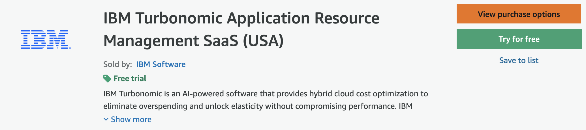
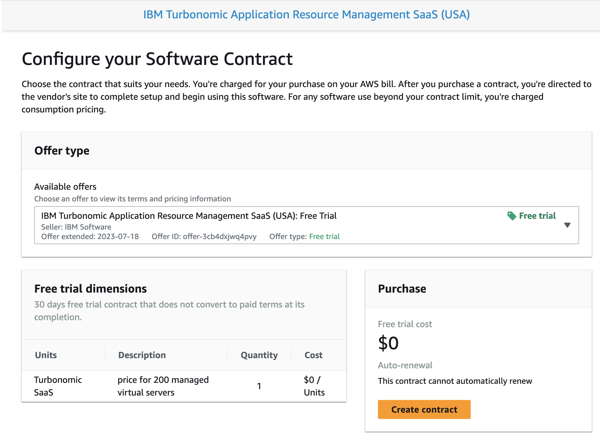
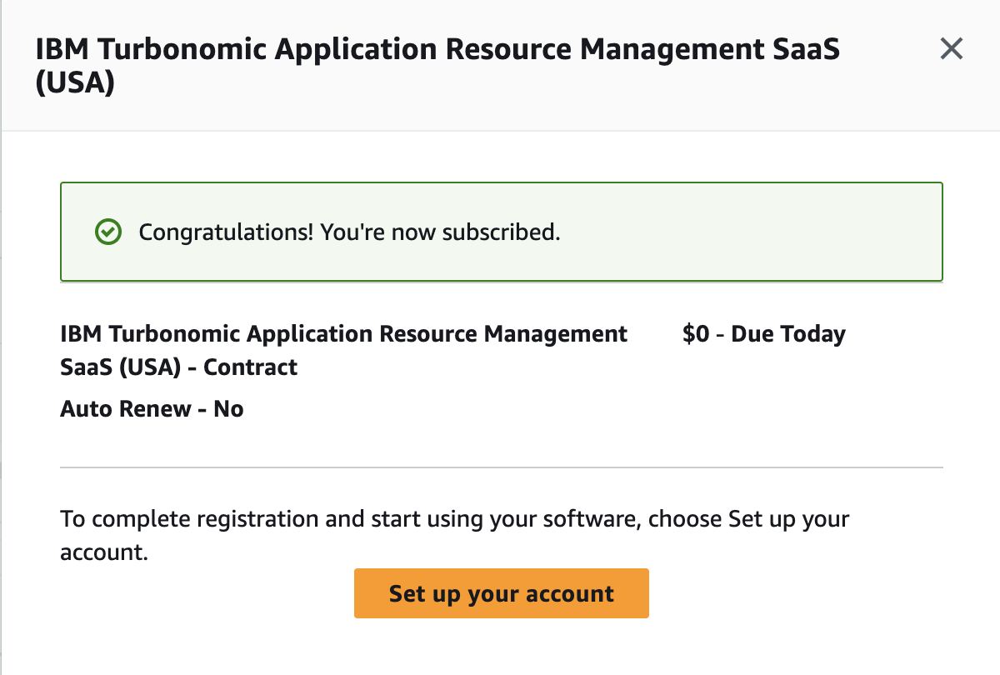
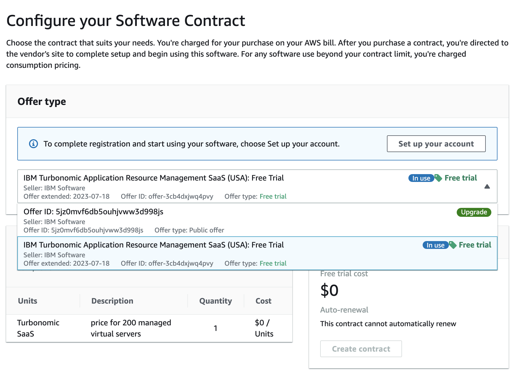
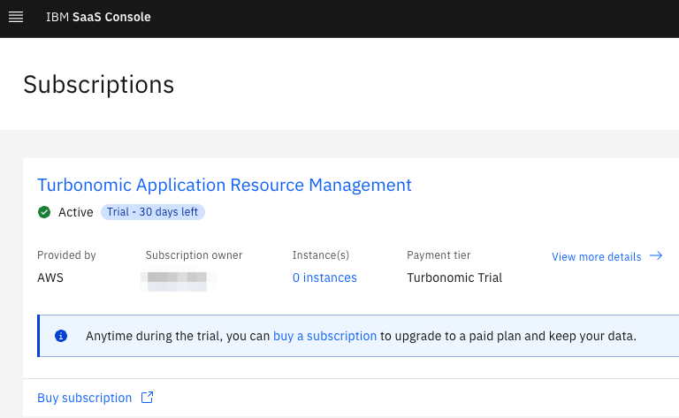

<Accordion>

## Request a 30-day free trial instance from the AWS Marketplace

<AccordionItem title='Request a 30-day free trial instance from the AWS Marketplace'>

| Instructions |
| --- |
| 1. Log in to the <a href='https://aws.amazon.com/marketplace/pp/prodview-5r3k3snu4ttnm?sr=0-2&ref_=beagle&applicationId=AWSMPContessa' target='_blank' rel='noreferrer noopener'>AWS Marketplace</a>. |
| 2. To provision a trial instance, click on the **Try for free** button.  |
| 3. In the **Offer type** drop down, select the Free trial option and select the **Create contract** button.  |
| 4. Next, select the **Set up your account** button, create an IBMid account and complete the request.  |
| 5. You will receive an email indicating that your trial instance is being set up and the email will contain a link to the <a href='https://console.saas.ibm.com/dashboard/subscriptions' target='_blank' rel='noreferrer noopener'>IBM SaaS Console</a> where you can check the status. |

</AccordionItem>
</Accordion>

<Accordion>

## Upgrade from a trial to a paid instance from the AWS Marketplace

<AccordionItem title='Upgrade from a trial to a paid instance from the AWS Marketplace'>

There are two paths to upgrade from a trial instance to a paid instance.

| Option |
| --- |
| 1. Upgrade from the <a href='https://aws.amazon.com/marketplace/pp/prodview-5r3k3snu4ttnm?sr=0-2&ref_=beagle&applicationId=AWSMPContessa' target='_blank' rel='noreferrer noopener'>AWS Marketplace</a> by changing the **Offer type** from "Free trial" to "Public offer".  |
| 2. Upgrade from the <a href='https://console.saas.ibm.com/dashboard/subscriptions' target='_blank' rel='noreferrer noopener'>IBM SaaS Console</a> and click on the **buy a subscription** link.  |

</AccordionItem>
</Accordion>

<Accordion>

## Request a paid instance from the AWS Marketplace

<AccordionItem title='Request a paid instance from the AWS Marketplace'>

| Instructions |
| --- |
| 1. Log in to the <a href='https://aws.amazon.com/marketplace/pp/prodview-5r3k3snu4ttnm?sr=0-2&ref_=beagle&applicationId=AWSMPContessa' target='_blank' rel='noreferrer noopener'>AWS Marketplace</a>. |
| 2. To provision a paid instance, click on the **View purchase options** button.  |
| 3. Fill out the fields in the **Configure your contract** section, specify the AWS Purchase Order number if it is available and click the **Create contract**. button. |
| 4. Next, select the **Set up your account** button, create an IBMid account and complete the request.  |
| 5. You will receive an email indicating that your instance is being set up and the email will contain a link to the <a href='https://console.saas.ibm.com/dashboard/subscriptions' target='_blank' rel='noreferrer noopener'>IBM SaaS Console</a> where you can check the status. |

</AccordionItem>
</Accordion>

<Accordion>

## How to request a paid instance if my customer already owns a Turbonomic SaaS entitlement

<AccordionItem title='How to request a paid instance if my customer already owns a Turbonomic SaaS entitlement'>

For customers who already own a Turbonomic SaaS entitlement, work with the IBM Seller assigned to the account.  The IBM Seller will collect the required provisioning information and submit the request to the IBM Turbonomic SRE team.

</AccordionItem>
</Accordion>