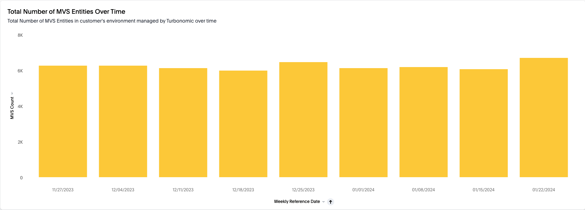
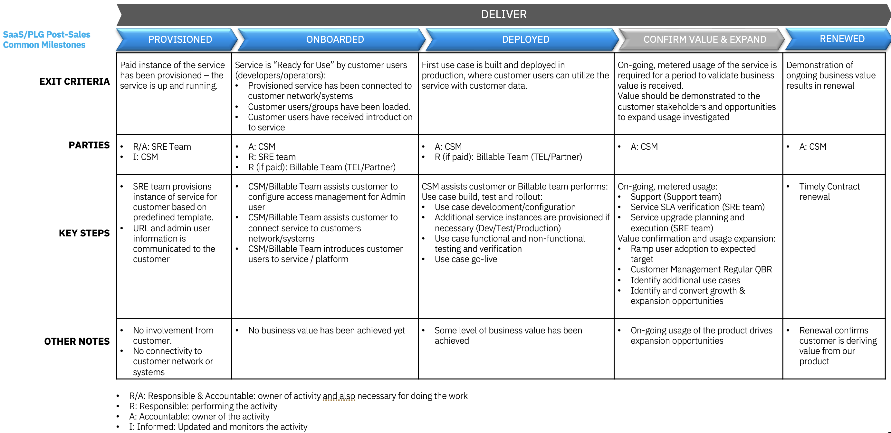

import {Link} from 'gatsby';
import FileLink from '../../../components/FileLink';

<InlineNotification kind="warning">

**Note: The <i>AUTOMATED</i> deployment metrics are pending sign-off and should be considered in progress until this notice is removed.**

The following considerations should be taken when reporting on SaaS deployments:
- All deployments for SaaS should follow the same process as non-SaaS / on-prem deployments
- Create one Growth Plan per use case
- Growth Plan project stages will be used to determine milestone status
- Deployed growth plans require a success plan review by a manager before being counted in the CSM scorecard
- All 3 deployment questions must be answered for the Growth Plan before being counted in the CSM scorecard

See below for detailed instructions on how to view the usage for your account.
</InlineNotification>

## Contacts

| WW contact | Name | WW contact | Name |
| --- | --- | --- | --- |
| **Customer Success Practice Leaders:** | Hollis Chui (<hollisc@ca.ibm.com>) | **Digital Customer Success & PLG:** | Rob Young (<robert.young1@ibm.com>) |
| **Technology Expert Labs Delivery:** | Saumil Patel (<saumilpp@us.ibm.com>) | **Technology Expert Labs Solution Engineering:** | Mark Barnard (<barnardm@uk.ibm.com>) |
| **SRE:** | Greg Aligiannis (VP, Chief Information Security Officer Turbonomic) (<Greg.Aligiannis@ibm.com>) | | |

<Row>
<Column colMd={9} colLg={9}>

## Overview
As a CSM, your focus is to guide and nurture your customers who have a Turbonomic SaaS entitlement.  Your job is to guide the customer with provisioning through to onboarding, help with their first use case (add a target, configure application discovery and grouping, take automated actions), and continue to expand their use cases.

You can learn more about Turbonomic on the <a href='https://pages.github.ibm.com/csm-playbook/playbook/common/automation/csm-automation-turbonomic/' target='_blank' rel='noreferrer noopener'>playbook page</a>.

</Column>
</Row>

<Row>
<Column>

| FAQ | Answer |
| --- | --- |
| What is the relationship name in Gainsight? | Turbonomic ARM SaaS |
| Which Clouds does this product run on? | AWS only |
| How is SaaS usage calculated? | <a href='https://ibm.seismic.com/Link/Content/DCJ2bCQ7FPH448fJ6TWjVcmc2MJ3?anchorId=191ccccc-9690-4aa3-bc15-f0cd83424689#/?anchorId=191ccccc-9690-4aa3-bc15-f0cd83424689' target='_blank' rel='noreferrer noopener'>SaaS Seller Enablement</a> |
| Who can help my customer with billing/invoicing questions? | Kevin Fraser (<Kevin.Fraser@ibm.com>) |
| Where is the documentation? | <a href='https://www.ibm.com/docs/en/tarm/8.11.0?topic=documentation-all-turbonomic-versions' target='_blank' rel='noreferrer noopener'>IBM Turbonomic Documentation</a> (<a href='https://www.ibm.com/docs/en/tarm/8.11.0?topic=documentation-integration-saas-reporting' target='_blank' rel='noreferrer noopener'>Turbonomic SaaS Reporting</a>, <a href='https://www.ibm.com/docs/en/tarm/8.11.0?topic=getting-started-saas-console' target='_blank' rel='noreferrer noopener'>IBM SaaS Console</a>) |
| Are the SaaS capabilities different from the on-prem offering? | No, the product code and capabilities are the same. |
| How to view my client's usage of Turbonomic SaaS and how to get access? | Turbonomic telemetry data for a customer's account can be viewed using <a href='https://turbonomic.thoughtspot.cloud/?utm_source=welcome-email&utm_medium=email#/' target='_blank' rel='noreferrer noopener'>ThoughtSpot</a>. Request access by sending an email to Vaptistis Anogeianakis <Vaptistis.Anogeianakis@ibm.com> with your name and role. |
| Does Turbonomic SaaS run on OpenShift? | Yes |
| Is Turbonomic SaaS consumable or ratable revenue? | Ratable |
| Who triggers deployment? |  Growth Plan and manager assessed (until instrumented) |

</Column>
</Row>

<Row>
<Column colMd={9} colLg={9}>

### CSM Scorecard Milestones based on usage

SaaS milestones for the CSM Scorecard are based on usage. To progress from Planning to Deploying to Deployed, see <Link to='/common/saas-growth/#automation-milestones-based-on-usage'>Automation milestones based on usage</Link>.

</Column>
</Row>

<Row>
<Column>

<Accordion>
<AccordionItem title="View and track MVS usage using ThoughtSpot">
Turbonomic SaaS telemetry data for a customer's account can be viewed using <a href='https://turbonomic.thoughtspot.cloud/?utm_source=welcome-email&utm_medium=email#/' target='_blank' rel='noreferrer noopener'>ThoughtSpot</a>.
Refer to the FAQ on the page for instructions on how to request access. 

After access has been granted, refer to the steps below on how to check the MVS usage for your account. 

- Contact Hollis Chui (<hollisc@ca.ibm.com>) or Rob Young (<robert.young1@ibm.com>) to retrieve the **Instance Id** for your customer's account.  The Instance Id value is alphanumeric and contains 32 characters.
- From the **Home** tab, select the <a href='https://turbonomic.thoughtspot.cloud/?utm_source=welcome-email&utm_medium=email#/pinboard/c9bfab66-5bca-4dd0-8cc9-76fdeb4212ce' target='_blank' rel='noreferrer noopener'>Telemetry Production - CSM MVS Tracking</a> dashboard, click on the **Instance Id** filter and search for your account's Instance Id. 
    
- The widget is a chart displaying MVS usage (y-axis) in the last 120 Days (x-axis).
    

</AccordionItem>

</Accordion>

</Column>
</Row>

<Row>
<Column colMd={9} colLg={9}>

### Turbonomic Product Feature Adoption and Value Realized Indicators
Turbonomic Product Feature Adoption and Value Realized Indicators are instrumented in the product to show the capabilities and features that the customer is using. This information can be used to determine the level of adoption that has taken place and ensure that the customer is receiving full business value from the product. See below for novice, intermediate and advanced level indicators along with an asset listing the value proposition, expected benefits, considerations for implementation and metrics of success.

</Column>
</Row>

<Row>
<Column>

<Accordion>
<AccordionItem title="Novice level indicators">

| Product Feature | Description | Asset |
| --- | --- | --- |
| Add and configure target(s) | Configure resources and/or collect data from initial automation settings | <a href='https://ibm.seismic.com/Link/Content/DCXh9hD46FWhRG4WGR3cDVm2Chj3' target='_blank' rel='noreferrer noopener'>Link</a> |
| Application Discovery and Grouping | Create groups or app topologies to provide scoped views into ARM | <a href='https://ibm.seismic.com/Link/Content/DCGmXh83bG4RV82HM8Ggg2c4dcRG' target='_blank' rel='noreferrer noopener'>Link</a> |
| Visibility, Dashboards, Reporting, Baseline Value | Use of dashboards and reports | <a href='https://ibm.seismic.com/Link/Content/DCbf2pPMXJQW3GWQ7mTd8p8DDWCd' target='_blank' rel='noreferrer noopener'>Link</a> |
| ITSM Change Control Integration - ServiceNow | Implement integration with ServiceNow so actions are recorded and approved | <a href='https://ibm.seismic.com/Link/Content/DC8RdhCPFVggR8TCDdFGpXD3bBT3' target='_blank' rel='noreferrer noopener'>Link</a> |
| Manual Cloud Reclamation - Wasted Storage and Idle Instances | Identification of orphaned disks in public cloud providers | <a href='https://ibm.seismic.com/Link/Content/DCWcBg6RXBTXdGWB329dWFp4V4dd' target='_blank' rel='noreferrer noopener'>Link</a> |
| Reserved Instance and Savings Plans Purchase | Purchase recommendations for Azure and AWS reserved instances ot minimize costs by pre-paying for workloads with appropriate usage criteria | <a href='https://ibm.seismic.com/Link/Content/DCG8f7mRd3jF8GFDbG6bGH8gBX8j' target='_blank' rel='noreferrer noopener'>Link</a> |
| Manual Instance Sizing | Sizing instance types or workloads in a manual fashion to assure application performance and maximize cost efficiency | <a href='https://ibm.seismic.com/Link/Content/DC9Xqc7J9Fq8j84DgR6BV684dQdV' target='_blank' rel='noreferrer noopener'>Link</a> |
| Manual Storage Optimization | Scaling storage by changing tiers or adjusting capacity of IOPs/throughput within a tier | <a href='https://ibm.seismic.com/Link/Content/DC6WdD2c6MHbGGQDBJq7WgFCDcf8' target='_blank' rel='noreferrer noopener'>Link</a> |
| Manual PaaS Sizing | Scaling actions for instance databases that utilize the DTU model | <a href='https://ibm.seismic.com/Link/Content/DCG47QGV3hBRBGHGqQ94cpj9B4DB' target='_blank' rel='noreferrer noopener'>Link</a> |
| Cloud Advanced Planning | Cloud planning for migration workloads to cloud targets as well as optimization opportunities for existing workloads in cloud targets | <a href='https://ibm.seismic.com/Link/Content/DCGdjF2TcqJHQ87XgDHp8FGQcV4j' target='_blank' rel='noreferrer noopener'>Link</a> |

</AccordionItem>

<AccordionItem title="Intermediate level indicators">

| Product Feature | Description | Asset |
| --- | --- | --- |
| Automated Cloud Storage Reclamation | Automated deletion of orphaned storage in public cloud providers based on number of days unattached | <a href='https://ibm.seismic.com/Link/Content/DCB6X4GC4B4488hCT2PdqgjjV3cd' target='_blank' rel='noreferrer noopener'>Link</a> |
| Automated Instance Sizing | Sizing instance types or workloads in an automated fashion to assure application performance and maximize cost efficiency | <a href='https://ibm.seismic.com/Link/Content/DC3CfWBVWR26GGCXB2XWWMf7fXGd' target='_blank' rel='noreferrer noopener'>Link</a> |
| Automated Storage Optimization | Automatic adjustment of storage types or sizes in Cloud | <a href='https://ibm.seismic.com/Link/Content/DC8gRM8Q3G9RfGcV4W474HdQWXpj' target='_blank' rel='noreferrer noopener'>Link</a> |
| Automated PaaS Sizing | Automate scaling actions for databases that utilize the DTU model | <a href='https://ibm.seismic.com/Link/Content/DCH8QXWQDQJRCG4VCq7TqJQjC3VB' target='_blank' rel='noreferrer noopener'>Link</a> |

</AccordionItem>

<AccordionItem title="Advance level indicators">

| Product Feature | Description | Asset |
| --- | --- | --- |
| Automated Initial Placement | Redistribute pods to optimize workload and node utilization |  <a href='https://ibm.seismic.com/Link/Content/DCbR4PFpXXh6V8qPd77JdpM2WJXP' target='_blank' rel='noreferrer noopener'>Link</a> |
| Application Scaling | Scaling application components based on app requirements |  <a href='https://ibm.seismic.com/Link/Content/DC9Qfd8DVHJphGhXgbXHGRqT76hV' target='_blank' rel='noreferrer noopener'>Link</a> |
| SLO Adherence | Setting target level utilization on latency and transaction rates and leveraging actions to return a metric back to desired threshold | <a href='https://ibm.seismic.com/Link/Content/DCF7bT3M2dH8bGWJqpGRdC74HDXP' target='_blank' rel='noreferrer noopener'>Link</a> |
| Continuous Integration/Continuous Development | Integrate automated workflows using predefined templates.  Execute sizing against standard change workflow. | <a href='https://ibm.seismic.com/Link/Content/DC4M8PMPm4fgGGcCM7PhHR22m633' target='_blank' rel='noreferrer noopener'>Link</a> |
| Infrastructure as Code Action Integration | Integrate automated workflows using predefined templates.  Execute sizing against standard change workflow. | <a href='https://ibm.seismic.com/Link/Content/DCb8VhWM86BqdGHMFT2MThWmbJ4d' target='_blank' rel='noreferrer noopener'>Link</a> |
| Custom Application Key Performance Indicator Definitions | Define KPIs utilizing external sources and reference those inside Turbo application | <a href='https://ibm.seismic.com/Link/Content/DC2BPJmj6D9Rd8qQFH2qFjVXBDh8' target='_blank' rel='noreferrer noopener'>Link</a> |
| ITSM Change Control Integration - Custom | Define KPIs utilizing external sources and reference those inside Turbo application | <a href='https://ibm.seismic.com/Link/Content/DC7mb94c6WFc4GCGXBG3DDD6CfhP' target='_blank' rel='noreferrer noopener'>Link</a> |
| ITSM Configuration Management Integration | Define KPIs utilizing external sources and reference those inside Turbo application | <a href='https://ibm.seismic.com/Link/Content/DCg9QDc8cc32Q8MThpBVMV9cbT83' target='_blank' rel='noreferrer noopener'>Link</a> |
| Data Streaming - Custom Reporting | Exporting data from Turbo to an alternate data lake product leveraging Kafka bus | <a href='https://ibm.seismic.com/Link/Content/DCJ6bCB8GHPHRGTVqBGVP2cV3DqG' target='_blank' rel='noreferrer noopener'>Link</a> |

</AccordionItem>

</Accordion>

</Column>
</Row>

<Row>
<Column colMd={9} colLg={9}>

## Post-sales journey  
As a CSM, your focus is to guide and nurture your customers who have a Turbonomic SaaS entitlement. Your job is to help the customer adopt the product, bring use cases to production, and renew their subscriptions.
The diagram shows the Turbonomic SaaS post-sales journey at a high level. Each section is broken down in detail with links to assets below.

</Column>
</Row>

<Row>
<Column>

<Accordion>

<AccordionItem title="SaaS Adoption Journey Insights">
SaaS has an additional level of insights that are used to track the adoption journey. These provide an additional level of detail specifically for SaaS adoption.  For Turbonomic, they are shown in the table below.

| 
Insight
 | 
Description
 |
| --- | --- | --- | --- |
| Paid Provisioned | Customer has purchased the product |
| Paid Onboarding Progress | A target has not been connected |
| Paid Onboarded | Completion of the Onboarding Checklist |
| Paid Deployed | First use case or feature deployed in production environment |
</AccordionItem>
</Accordion>

### Provisioned

| **Led by** | **Outcome** | **Assets & Activities** |
| --- | --- | --- |
| IBM Turbonomic SRE | Turbonomic SaaS instance provisioned and the customer has access.   The Turbonomic SaaS instance is not multi-tenant and one environment per customer.  There are different paths for a customer to request a Turbonomic SaaS trial and/or paid instance (running in ROSA).  The client is required to create an <a href='https://www.ibm.com/account/reg/us-en/signup?formid=urx-19776' target='_blank' rel='noreferrer noopener'>IBMid account</a>. |  **Provisioning the service:**    <Link to='/common/automation/csm-automation-turbonomic-saas-provision/#request-a-paid-instance-from-the-aws-marketplace'>Request a 30-day free trial instance from the AWS Marketplace</Link>    <Link to='/common/automation/csm-automation-turbonomic-saas-provision/#upgrade-from-a-trial-to-a-paid-instance-from-the-aws-marketplace'>Upgrade from a trial to a paid instance from the AWS Marketplace</Link>   <Link to='/common/automation/csm-automation-turbonomic-saas-provision/#request-a-paid-instance-from-the-aws-marketplace'>Request a paid instance from the AWS Marketplace</Link>    <Link to='/common/automation/csm-automation-turbonomic-saas-provision/#how-to-request-a-paid-instance-if-my-customer-already-owns-a-turbonomic-saas-entitlement'>How to request a paid instance if my customer already owns a Turbonomic SaaS entitlement</Link>    **Nurture opportunities:**  A <a href="https://ibm.box.com/s/fvl5l58lz0ohyiws0w8adno4sa191osa" target='_blank' rel='noreferrer noopener'>Welcome Email Template</a> is available and can be used to introduce yourself to your client and provide links to the product documentation, how to raise a support ticket, how to join the Turbonomic Community and enablement material.

### Onboarded

| **Led by** | **Outcome** | **Assets & Activities** |
| --- | --- | --- |
| IBM Turbonomic SRE and IBM CSM | Customer has validated access to their Turbonomic SaaS instance using their IBMid and added a target |  **Technology Expert Labs Offerings:**   &nbsp;&nbsp;&nbsp;&nbsp; <a href='https://ibm.seismic.com/Link/Content/DChm62RpdBFm3G2TdB7Bc9V339DB' target='_blank' rel='noreferrer noopener'>**Plan Turbonomic**</a>   IBM will review, validate, and understand during a remote discussion with customer.  A roadmap of adoption implementation recommendations based on customer priorities will be developed for further service opportunities.    **Getting started:**   After the Turbonomic SaaS instance has been provisioned, a customer can access their instance URL from the AWS console (if provisioned from the AWS Marketplace) or from the email (if the request was submitted by an IBM Technical Seller).   By default, the IAM for the instance is configured with IBM Verify and using IBMid.  A customer can configure the instance to use a different access management system but will need to work with support.   The next step is to <a href='https://www.ibm.com/docs/en/tarm/8.11.2?topic=started-configuring-targets' target='_blank' rel='noreferrer noopener'>configure a target</a> and allow Turbonomic to discover entities.    **Nurture opportunities:**  If no activity has been taken by the client, an <a href="https://ibm.box.com/s/nil1v27b0pa4ngsc86syogm20iygqicu" target='_blank' rel='noreferrer noopener'>Onboarding Nudge Email Template</a> can be sent with instructions to add a target.   After the onboarding process has been completed, an <a href="https://ibm.box.com/s/3vk07v03zquu1i5yqa2c1dsc82dwfuei" target='_blank' rel='noreferrer noopener'>Onboarded Email Template</a> is available to advise the client to take the next step of their journey to take an action. |

### Deployed

| **Led by** | **Outcome** | **Assets & Activities** |
| --- | --- | --- |
| IBM CSM or Technology Expert Labs | The client has implemented actions that consume at least 10% of the purchased subscription capacity must be in use to be receiving value and considered deployed. | **Technology Expert Labs Offerings:**   &nbsp;&nbsp;&nbsp;&nbsp; <a href='https://ibm.seismic.com/Link/Content/DCTRBV4q6TTRR8TQ9bB9VPBb6WMB' target='_blank' rel='noreferrer noopener'>**Build Turbonomic**</a>  Help Turbonomic clients create an architecture and deployment plan based on consultative discussions about what the client intends to achieve with the Turbonomic solution.    **Use the solution:**   The image below captures the Turbonomic ARM Journey providing the customer with visibility of their on-prem, public Cloud and containerized environments, automated decisions that can be taken manually and ultimately, working towards allowing Turbonomic to take automated actions. You can learn more about Turbonomic on the <a href='https://pages.github.ibm.com/csm-playbook/playbook/common/automation/csm-automation-turbonomic/' target='_blank' rel='noreferrer noopener'>playbook page</a>.   The CSM is responsible for guiding the customer through the deployment phase, utilizing Technology Expert Labs to perform the configuration and testing required to get to automated actions being performed.      **Nurture opportunities:**  When the client has successfully taken an action, a <a href="https://ibm.box.com/s/hb6rj3uziesqus03vok5sxil34q65auk" target='_blank' rel='noreferrer noopener'>Deployed Email Template</a> can be sent to guide the customer on setting up automation in the environment. |

</Column>
</Row>

<Row>
<Column>

### Confirm Value & Expand

| **Led by** | **Outcome** | **Assets & Activities** |
| --- | --- | --- |
| IBM CSM | Customer has realized value and is expanding usage to new business units. | **Nurture relationship:**   Set up an <a href='https://pages.github.ibm.com/csm-playbook/playbook/onboard/executive-business-review/' target='_blank' rel='noreferrer noopener'>EBR (executive business review)</a> with client sponsor and executives to align and review the adoption, value seen, and confirm the customer's strategic goals have been met.    **Expand solution**   A CSM should continue to drive usage of Technology Expert Labs services and look for opportunities to add more use cases. |

### Renewed

| **Led by** | **Outcome** | **Assets & Activities** |
| --- | --- | --- |
| IBM CSM and/or Technical Sales | The client has confirmed that they are using the product and will continue to renew their entitlement. | N/A |

</Column>
</Row>