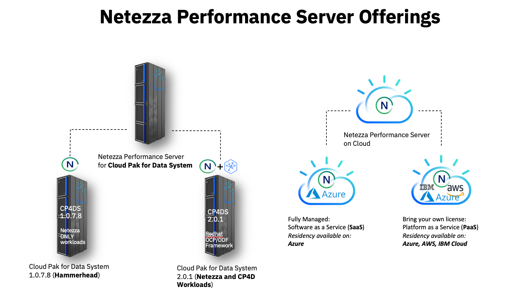

<AnchorLinks small>
<AnchorLink>What is CP4DS/NPS and what does it do?</AnchorLink>
<AnchorLink>What are the pain points that CP4DS/NPS addresses?</AnchorLink>
<AnchorLink>The steps to deploy and who is responsible for what, when?</AnchorLink>
<AnchorLink>What do CSM driven deployments look like?</AnchorLink>
<AnchorLink>How do I expand and grow CP4DS/NPS usage?</AnchorLink>
</AnchorLinks>

<Row>
<Column colMd={7} colLg={7} noGutterMdLeft>

## What is CP4DS/NPS and what does it do?
Netezza Performance Server (NPS) is an appliance to run analytic workloads and data warehouse driven use cases.  There is also a Cloud offering of NPS in the Cloud eliminating the need for on premise or hardware management.
IBM Netezza Performance Server is the advanced cloud-native data warehouse designed for unified, scalable analytics and insights available anywhere. Built with [data lake](https://www.ibm.com/data-lake) integration, Netezza Performance Server empowers you to run highly complex queries and machine learning to support critical business decisions across your organization. It provides a secure, and scalable source for your analytics that is simple to use and flexible enough to run demanding analytical workloads across [fully managed cloud ] <a href='https://www.ibm.com/downloads/cas/LGGVLJ27' target='_blank' rel='noreferrer noopener'>(PDF, 201 KB)</a> , Hybrid and [on-premises ]<a href='https://www.ibm.com/downloads/cas/DRM7DAG7' target='_blank' rel='noreferrer noopener'>(PDF, 41 KB)</a>  environments.

IBM Netezza Performance Server is available on IBM Cloud®, AWS, Azure and IBM Cloud Pak® for Data Systems.

## What are the pain points that CP4DS/NPS addresses?

- Support comprehensive, cost-effective information governance
- Monitor master data quality using dashboards and proactive alerts
- Simplify the management and enforcement of master data policies
- Integrate master data management into existing business processes
- Quickly scale to meet changing business needs
- Optimize resources using flexible deployment option

## The steps to deploy and who is responsible for what, when?

NPS Sizing Guide: [Link](https://ibm.seismic.com/Link/Content/DChR8TqDq3HG6GTBcdTgmMGdgjMV) 

Deployment can be the responsibly of a combination of resources: IBM Technology Expert Labs or IBM Data Elite Team can assist::<a href='https://ibm.seismic.com/Link/Content/DCQH8dfJ923MRGfC68CPT9RpBCFV' target='_blank' rel='noreferrer noopener'>Link</a> 
You can request assistance by completing this submission form: <a href='https://ibm.biz/grow-my-deal' target='_blank' rel='noreferrer noopener'>Link</a> 

## How do I expand and grow usage?
Use Case and Sponsors will ensure a successful first project deployment.  From there the positioning of addtional services driven by new use cases will valdiate the need for additional compute or CP4D services.

</Column>

<Column colMd={5} colLg={5} noGutterMdLeft>

 

<Aside>

**Customer Success Practice Leader:** Campbell Robertson (cir@ca.ibm.com) 

**CSM Slack Channel:** <a href='https://ibm-analytics.slack.com/archives/C01L3NASBUJ' target='_blank' rel='noreferrer noopener'>csm-data-ai</a> 
**CP4DS/NPS Slack Channels:**
[#netezza](https://ibm-analytics.slack.com/archives/CDG775K6X) 
**Roadmap:**  [Link](https://bigblue.aha.io/products/CP4DS/feature_cards) Need Aha Access 
**Seismic:** [Sales Kit](https://ibm.seismic.com/Link/Content/DC3FqhbFPPcCV87XqWD8hgR7JffP) with Presentations and Pre-sales assets 
**Tech Zone:**  [Netezza Demos and Environments](https://techzone.ibm.com/search?searchbox=%22netezza%22&StatusFilter=ActiveVisibilityFilter=%5B%22IBMers%22%5D&BrandsFilter=%5B%22Data+and+AI%22%5D&LanguageFilter=%5B%22English%22%5D) 

**Deployment options:** SaaS(IBM, AWS and Azure), On-Prem Appliance

</Aside>

<Aside>

**Build Your Skills:**
Build Your Skills

[Netezza Performance Server Partner Technical Enablement Guide](https://ibm.seismic.com/app#/doccenter/861ea1fd-99e0-44d7-9135-85412e5c28d1/doc/%252Fdd3359e5f7-a856-a91b-7688-41024b2ac637%252FdfNTY4NmVhOWItY2RkNS04ZWY3LTZkNzItZTQwZjczMWUyMjk1%252CPT0%253D%252CQXV0b21hdGlvbg%253D%253D%252FdfOthers%252FdfOTRiYmU4NTQtNWY4NC03Y2QyLWZjYWUtOGIxYmFmZjkyZThk%252CPT0%253D%252CU2FsZXMga2l0%252Flf46241cf4-32bd-4d69-a4c5-9fcc2fc50eef//?mode=view&parentPath=sessionStorage)

[Netezza Performance Server Backup and Restore Disaster Recovery Guide](https://ibm.seismic.com/app#/doccenter/f6bc8873-d580-4ee8-a903-c4e0d3a7eee9/doc/%252Fdd0ab3871f-9594-50fd-73b1-7f6c58815c13%252Fdd4d2d23ab-1147-1d0f-f305-1f89def2f716%252Fdd38246a3c-e520-6d56-7a8c-377c9015d158%252Fdf70641cf0-7d2d-4703-a2a4-dc96e6326ea2%252Flfb607bd9e-a759-445b-a590-3fa1155dd896//?mode=view&parentPath=sessionStorage)

[Netezza for Technical Sales Level 3](https://yourlearning.ibm.com/activity/PLAN-8651E36DC476)

[Hammerhead Enablement Recording](https://ibm.seismic.com/Link/Content/DC7PMG9CdQG6G87F2cVmbQG9V62P)

[Netezza Mako EOS Sales Enablement](https://ibm.seismic.com/app#/doccenter/f6bc8873-d580-4ee8-a903-c4e0d3a7eee9/doc/%252Fdd0ab3871f-9594-50fd-73b1-7f6c58815c13%252Fdd4d2d23ab-1147-1d0f-f305-1f89def2f716%252Fdd38246a3c-e520-6d56-7a8c-377c9015d158%252Fdf70641cf0-7d2d-4703-a2a4-dc96e6326ea2%252Flfd3dff23f-a574-4231-9397-fe1cc2d4e2d6//?mode=view&parentPath=sessionStorage)

[Netezza Mako EOS Sales Enablement Recording](https://ibm.seismic.com/app#/doccenter/f6bc8873-d580-4ee8-a903-c4e0d3a7eee9/doc/%252Fdd0ab3871f-9594-50fd-73b1-7f6c58815c13%252Fdd4d2d23ab-1147-1d0f-f305-1f89def2f716%252Fdd38246a3c-e520-6d56-7a8c-377c9015d158%252Fdf70641cf0-7d2d-4703-a2a4-dc96e6326ea2%252Flf1f4db9a8-b7ea-4653-bd04-40a1916979d7//?mode=view&parentPath=sessionStorage)

[Tri-Dimensional Analysis CTP Tactical Enablement](https://ibm.seismic.com/app#/doccenter/f6bc8873-d580-4ee8-a903-c4e0d3a7eee9/doc/%252Fdd0ab3871f-9594-50fd-73b1-7f6c58815c13%252Fdd4d2d23ab-1147-1d0f-f305-1f89def2f716%252Fdd38246a3c-e520-6d56-7a8c-377c9015d158%252Fdf70641cf0-7d2d-4703-a2a4-dc96e6326ea2%252Flf493500a8-f785-4be5-b7e9-23e42b10c362//?mode=view&parentPath=sessionStorage)

</Aside>

<Aside>

**Who can help me?**

**Client Engineering** Slack: #client-eng-data-ai and **Tech Sales** Slack: #cp4d-cpfield have the skills required to perform Proof of Experience (Pox) engagements. 
**Data & AI Technical Account Managers (TAMs)** have deep skills and experience with the Data & AI portfolio.  Find out if a TAM is assigned to your account here: https://tams.mybluemix.net/
Work with your account team to determine if there is already a TAM attached to your customer. If you aren't sure reach out to Christian Peterman @Christian Peterman or Campbell Robertson @campbell for help. 
**Technology Expert Labs** can deliver solution design, deploy production environments, deliver full stack observability, create outcome SOW and account plans (for a fee).  Slack Channel for Expert Labs: #ask-expert-labs <a href='https://ibm.biz/BdPZX6' target='_blank' rel='noreferrer noopener'>Seismic Link to Expert Labs Homepage</a> 
**Technology Expert Labs offerings** >>>****reach out to @charles.gonsalves for details<<

**CP4DS/NPS Points of Contact: **
 Hasani Ewing -- hsewing@us.ibm.com Product Manager - Neezza, HDM

CP4DS Support:
Rulesh Rebello (WW) -- rulesh.rebello@in.ibm.com Program Director, Appliance Customer Success HDM
Darius Gorczyca (EMEA) -- dariusz.gorczyca@pl.ibm.com Senior Manager, HDM Appliances Customer

</Aside>

<Aside>

**Customer Case Studies?** 
**HDM Client Use Cases:** [Link](https://ibm.seismic.com/Link/Content/DCC6H7BDm8J3qGhQ6bP6fpp8cTPG) 
**Netezza Client Use Cases:** Link

Technology Expert Labs 1,000 Plus Reference, Wins and Success [Link](https://ibm.seismic.com/Link/Content/DCXf8MfRC66PH87Qd8G4P8DfXqJd)
</Aside>

<Aside>

**Workshops**
**Workshops** Netezza Launch Program - Delivered by Dan Hancock ( 7-8 hours of material). nzlaunch is targeted for existing Netezza customers that are migrating to Hammerhead or NPS on cloud. Reach out to daniel.hancock@us.ibm.com for more details

</Aside>

<Aside>

**Technology Expert Labs offerings**

</Aside>

</Column>

</Row>

<Row>

<Column>

_____________________________

### Special notes
Currently Blank

_____________________________

## Frequently asked questions
FAQ: [Link](https://ibm.seismic.com/Link/Content/DCBGB9f3PhWb7G2VVMhQpPbddPM8)

</Column>
</Row>
