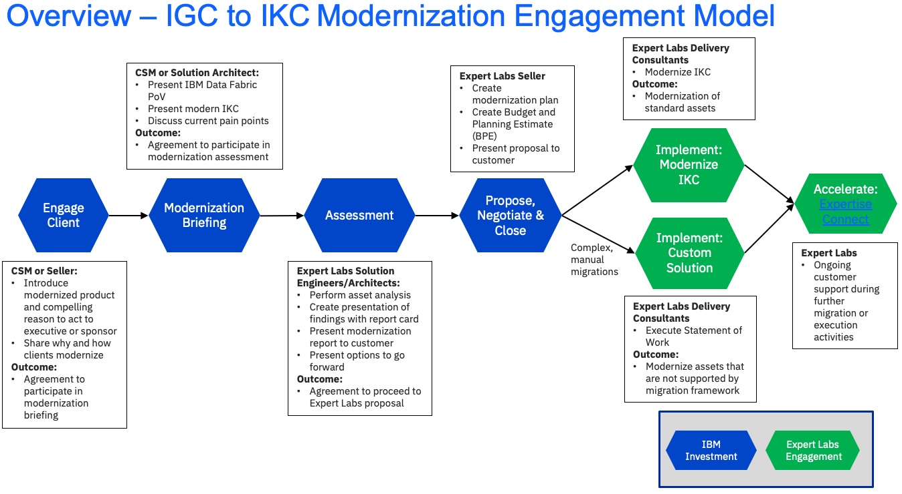
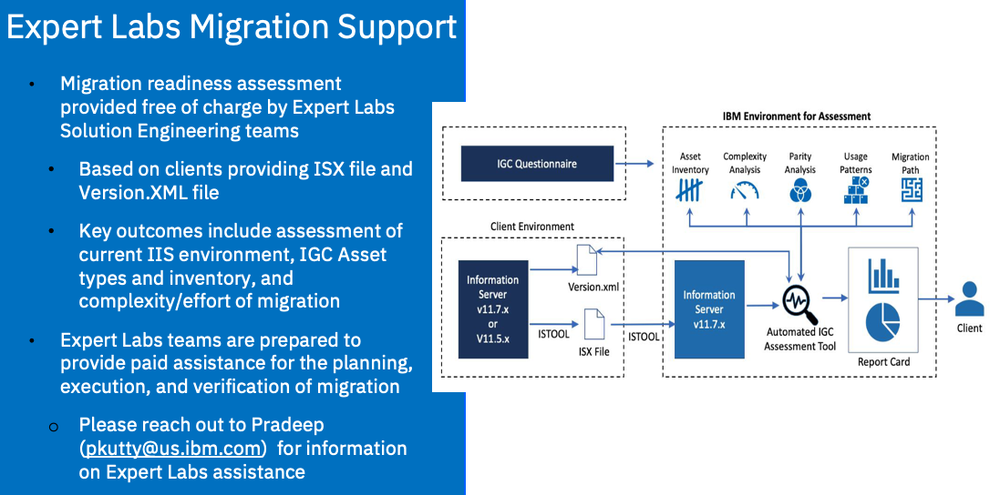

import {Link} from 'gatsby';
import FileLink from '../../../components/FileLink';

<Row>

<Column>

<Tabs>

<Tab label='WW contacts'>

| WW contact | Name |
| --- | --- |
| **Customer Success Practice Leaders:** | Campbell Robertson (cir@ca.ibm.com)|
| **Technology Expert Labs Delivery Lead:** | Akram Abdouch (@Akram) |
| **Technology Expert Labs Solution Engineering:** | Bala Vaithyalingam (@bala) |
| **Technology Expert Labs Product Management:** | Sarah Memon (@Sarah Memon) and  Sandeep Sinha (@ssinha1)|
| **IKC Product Management** | Sachin Prasad |
</Tab>

<Tab label='Who can help?'>

| Role | Assset |
| --- | --- |
| **Client Engineering** | Slack: #client-eng-data-ai |
| **Tech Sales** | Slack: #cp4d-cpfield has the skills required to perform Proof of Experience (Pox) engagements. |
| **Data & AI Solution Architect** | Deep skills and experience with the Data & AI portfolio. Work with your account team to determine if there is already a resource attached to your customer. If you aren't sure reach out to your Data & AI Practice Leader Campbell Robertson @campbell for help. |
| **Technology Expert Labs:** | Deliver solution design, deploy production environments, deliver full-stack observability, and create outcome SOW and account plans (for a fee).  Slack Channel for Expert Labs: #ask-expert-labs <a href='https://ibm.biz/BdPZX6' target='_blank' rel='noreferrer noopener'>Seismic Link to Expert Labs Homepage</a> |

</Tab>
</Tabs>

</Column>
</Row>

<Row>

<Column colMd={9} colLg={9} noGutterMdLeft>

## What is CP4D and what does it do?

**IBM Cloud Pak for Data (CP4D)** is a comprehensive and modular set of integrated software components designed for data analysis, organization, and management. IBM Cloud Pak for Data platform helps improve productivity and reduce complexity. Build a data fabric connecting siloed data distributed across a hybrid cloud landscape. This platform is available for self-hosting or as a managed service on IBM Cloud, offering flexibility to users. The key technical aspects of IBM Cloud Pak for Data include:

- **Data Fabric Connectivity**: It enables the creation of a data fabric that connects siloed data distributed across hybrid cloud environments, allowing users to access data without the need to move it.
- **Deployment Options**: Users can choose between an on-premises software version based on the Red Hat OpenShift container platform or a fully managed version on the IBM Cloud
- **Solution Areas**: Cloud Pak for Data addresses various solution areas such as data insights and applications, data sources, and AI workflows, enhancing decision-making processes and data management.
- **Data Governance and AI Capabilities**: The platform offers features like generative AI workflows, data governance capabilities, and transparent AI workflows built on third-party platforms.
- **Integration with Third-Party Platforms**: IBM Cloud Pak for Data integrates market-leading IBM Watson AI technology with IBM Hybrid Data Management Platform, DataOps, governance, and business analytics technologies

In summary, CP4D is a versatile platform that empowers organizations to streamline their data processes, enhance productivity, and leverage advanced AI capabilities within a hybrid cloud environment.

## What pain points does CP4D address?

CP4D addresses various pain points to enhance data management and analytics processes. Some of the key pain points it tackles include:

- **Improving Performance and Quality**: IBM Cloud Pak for Data helps improve performance and quality while reducing storage and egress costs.
- **Consolidating IT Infrastructures**: It allows organizations to consolidate and simplify IT infrastructures, run anywhere (on-premises or any cloud), and automate data operations to deliver trusted data to business users.
- **Preventing Data Delays and Disruption**: The platform ensures data resilience and easy data access to prevent delays and disruptions of mission-critical data.
- **Building Trustworthy AI Models**: IBM Cloud Pak for Data enables the building of successful AI models by providing trusted data access within hybrid multi-cloud environments.
- **Enabling Customer 360 Views**: It helps in providing 360-degree customer views, allowing businesses to focus on applying AI and analytics rather than searching for quality data.
- **Govern Data for Self-Service**: Organizations can eliminate complexity by centralizing governance and privacy definitions, ensuring data trust, protection, security, and compliance.

These features make CP4D a comprehensive solution that addresses critical business and technical user pain points related to data management, analytics, governance, and AI model building.

## CP4D acceleration

Upgrading CP4D on Red Hat OpenShift is a complex process in which you first have to determine whether it is something your customer will benefit from, and then determine the best way to ensure a successful upgrade experience.

## CP4D modernization

Clients who are currently on IGC or IKC might benefit from modernizing to CP4D.

IGC/IKC modernization is the process of taking customers from **IBM InfoSphere® Information Governance Catalog (IGC) and/or IBM Information Analyzer (IA)** and moving them to IBM Knowledge Catalog running on Cloud Pak for Data on OpenShift. You can learn more about IBM Knowledge Catalog on our [playbook page](/data-ai/csm-data-ai-watson-knowledge-catalog).

## Competitors of CP4D

Cloud Pak for Data competes with several alternatives in the market. Some of the top competitors and alternatives to IBM Cloud Pak for Data include:
* Appian Low-Code Platform  
* Pega Workforce Intelligence   
* Newgen iBPS Low Code Process Automation Platform   
* webMethods BPMS   
* Informatica PowerCenter   
* Azure Data Factory   
* Snowflake   
* Informatica Cloud Data Quality.     

These competitors offer a range of features and functions that cater to data management, integration, and automation needs, providing users with options to consider based on their specific requirements and preferences.  Do some research with IBM Northernlight for external validation on the value of Cloud Pak for Data. [Link Here](https://ibm.northernlight.com/resultsall.php?usedefault=1&context=quicksearch&textQuery=Cloud+Pak+for+Data&datasource=)

<Row>

<Column>

-----

## Deployment stages (Milestones)

Deployments are tracked in Gainsight through <Link to='/onboard/gainsight-create-growth-plan'>Growth Plans</Link>. In ISC, these deployments are called Deployment Opportunities. These Deployment stages are called <Link to='/onboard/gainsight-milestones'>Milestones</Link> in Gainsight.

-----
### Identify phase

#### Common practices

Before you start to work with the customer, you will need to learn about the customer, their industry, what was sold, and who you might work with.

| Practice | Description |
| --- | --- |
| <Link to='/onboard/understand-client-it-landscape/'>Learn about the customer</Link> | Before you get started, you need to learn about your customer and their business. |
| <Link to='/onboard/learn-partner/'>Learn about the partner</Link> | If your customer is working with a partner, you need to learn about the partner and their relationship with IBM and the customer. |
| <Link to='/onboard/understand-deal/'>Understand the deal</Link> | Learn where to find information related to how the product was sold to the customer. |
| <Link to='/deploy/identify/'>Identify</Link> | Understand what the customer will need to be successful. |

#### Product-specific practices

| Led by | Outcome | Assets & Activities |
| --- | --- | --- |
| CSM | Prioritized use case | **There isn't a current use case, where do I start?**   As a CSM, drive to at least gain approval from the customer to run a discovery workshop to identify and prioritize use cases and potential solution designs.  Do this with the participation of IT and LOB in the room or MURAL session at the same time.  If you need assistance running a workshop reach out to the Practice Leaders:  Campbell Robertson for assistance.  You can also ask to have Client Engineering (IBM Invest) or Technology Expert Labs (Paid Engagement)   Another approach is to run a **Discovery/Solution Workshop** to define a use case and solution design.  Reach out to your Practice Leader - [Campbell Robertson](cir@ca.ibm.com) |

<Tabs>

<Tab label='Acceleration: Advanced use cases'>

| Led by | Outcome | Assets & Activities |
| --- | --- | --- |
| CSM | Advanced use case on OCP prioritized | **Advanced OpenShift Architecture for CP4D**    **Share an existing OpenShift cluster with CP4D**, without impacting other workloads and without changing worker node configuration parameters cluster-wide.  **Solution:** Machine Config Operator  - MachineConfigPool  - MachineSets  - MachineConfig  - ContainerRuntimeConfig  - KubeletConfig  - Namespace Placement  - Namespace Pull Secrets   **Scaling**  - Your customer is interested in DataStage and needs to add more CP4D nodes.   Sales Configurator: 128 vCPU, 512GB, 8 nodes    - Your customer needs to deploy CPU and/or memory-intensive workloads. 16vCPU and 64GB per node are not enough. Need to add capacity to existing CP4D nodes.    - Your customer has outgrown their existing OpenShift cluster; or, my etc. performance is resource-constrained and needs to add capacity to Control Plane Nodes. NEW IN OCP 4.12   **Network & Security**  Your customer wants to limit the IP address that connects to internal data sources. Whitelisting the whole machine network CIDR range (10.0.0.0/16 by default) is not an option, as it conflicts with security policies.  - **Refer to CP4D + OpenShift Supporting Deck:** [Link](https://ibm.box.com/s/359h42306ug0nl8g90st5crykf57jf16)  - Machine Config Operator Tasks: [Link]( [https://docs.openshift.com/container-platform/4.12/post_installation_configuration/machine-configuration-tasks.html](https://docs.openshift.com/container-platform/4.12/post_installation_configuration/machine-configuration-tasks.html) )  - MachineConfigs: [Link]( https://docs.openshift.com/container-platform/4.12/post_installation_configuration/machine-configuration-tasks.html#using-machinec[…]change-machines)  - MachineSets: [Link](https://docs.openshift.com/container-platform/4.12/machine_management/creating-infrastructure-machinesets.html)  - ContainerRuntimeConfig: [Link](https://docs.openshift.com/container-platform/4.12/rest_api/machine_apis/containerruntimeconfig-machineconfiguration-openshift-io-v1.html)  - KubeletConfig: [Link](https://docs.openshift.com/container-platform/4.12/rest_api/machine_apis/kubeletconfig-machineconfiguration-openshift-io-v1.html)  - Namespace Placement: [Link]( https://docs.openshift.com/container-platform/4.12/nodes/scheduling/nodes-scheduler-node-selectors.html)  - ControlPlaneMachineSets: [Link]( https://docs.openshift.com/container-platform/4.12/rest_api/machine_apis/controlplanemachineset-machine-openshift-io-v1.html)  - EgressIPs:  [Link](https://docs.openshift.com/container-platform/4.12/networking/ovn_kubernetes_network_provider/configuring-egress-ips-ovn.html) 

</Tab>

<Tab label='Acceleration: Upgrade'>

<Row>
<Column colMd={12} colLg={12}>

### Why should a customer upgrade?

Deciding whether to upgrade your IBM Cloud Pak for Data depends on several factors, including your client's specific needs and circumstances. Some key considerations that might justify an upgrade:

| Consideration | Description |
| --- | --- |
| **Security updates** | Software upgrades often include critical security patches and updates. Staying on an older version may expose their system to vulnerabilities that have been addressed in newer releases. This is especially important in a world where cybersecurity threats are constantly evolving. |
| **New features and capabilities** | Upgrades typically introduce new features, functionalities, and improvements. These can enhance your client's data fabric, data analytics, machine learning, and data management capabilities, helping them stay competitive and make better use of their data. |
| **Performance enhancements** | Newer versions of software often come with performance improvements, optimizations, and better resource utilization. This can lead to increased efficiency and cost savings in the long run. |
| **Compatibility** | As other software and platforms evolve, maintaining compatibility with them is crucial. An outdated version of IBM Cloud Pak for Data may not work well with newer databases, analytics tools, or other software the client organization relies on. |
| **Vendor support** |  Vendors like IBM provide support and updates for their products, but this is typically limited to the most recent versions. If you encounter issues with an older version, you might find it challenging to get support and assistance. |
| **Regulatory Compliance** | If your industry is subject to specific regulations, upgrading your software can help you remain compliant with the latest requirements, as vendors often update their software to align with new regulations. |
| **Bug fixes and stability** | Upgrades often include bug fixes and stability improvements. Running on a stable and error-free platform is crucial for your organization's data-related operations. |
| **Enhanced user experience** | Newer versions often come with improved user interfaces and workflows, making it easier for your team to work with the software and streamline their processes. |
| **Community and user base** | Staying current can also connect you with a more active user community and resources, such as forums, documentation, and user-generated content that can help troubleshoot issues and provide insights. |
| **Cost savings** |  While there's an initial investment in upgrading, long-term cost savings can be achieved through improved efficiency, better performance, and reduced support costs. |

</Column>
</Row>

### Resources for Cloud Pak for Data upgrades

<Row>
<Column colMd={6} colLg={6}>

* <a href='https://www.ibm.com/docs/en/cloud-paks/cp-data/4.7.x?topic=46-preparing-upgrade-instance-cloud-pak-data' target='_blank' rel='noreferrer noopener'>CP4D Upgrade Preparation for 4.6 to 4.7</a> IBM docs

* <a href='ttps://www.ibm.com/docs/en/cloud-paks/cp-data/4.7.x?topic=upgrading-from-cloud-pak-data-version-47' target='_blank' rel='noreferrer noopener'>CP4D Upgrade from 4.7 to a later 4.7 refresh</a> IBM docs

</Column>

<Column colMd={6} colLg={6}>

* Understand the <Link to='/common/redhat/upgrades.mdx'>OpenShift Upgrade Paths and Best Practices</Link> in the Playbook
* Read and Plan using the Center of Excellence <a href='https://ibm.box.com/s/bbzptaa13d1mlix4g6t5eef4tcoh9tkg' target='_blank' rel='noreferrer noopener'> CP4D Upgrade Flowchart</a>
* <a href='https://ibm.box.com/s/bbzptaa13d1mlix4g6t5eef4tcoh9tkg'>Flow details (zoom in)</a>

</Column>

</Row>

## Considerations in the upgrade process

Upgrading IBM Cloud Pak for Data on Red Hat OpenShift is a complex process that involves several steps to ensure a successful transition to the new version. Here is a high-level overview of the steps you should plan for when upgrading IBM Cloud Pak for Data and Red Hat OpenShift:

<Accordion>
<AccordionItem title='Prepare for upgrade'>

1. **Review documentation**: Start by reviewing the official documentation provided by IBM and Red Hat for the specific versions you are upgrading from and to. This will give you insights into the upgrade process and any version-specific considerations.

**Gather information to upgrade**  

It is imperative to gather as much information about the current versions, environment, cluster health and other factors.

Refer to the <a href='https://ibm.box.com/s/ms14md3sqkawrwqr8c0lqo0no8rshn9t' target='_blank' rel='noreferrer noopener'>CP4D Upgrade Must Gather Questionaire</a>. This living document attempts to provide how and what data should be considered for gathering information. 

Regardless of whether the Client, Technology Expert Labs, Business Partner or IBM Support SWAT does the upgrade, the questionnaire is a key information-gathering exercise.

After you have gathered information related to OpenShift and Cloud Pak for Data, then align the criteria below to determine the type of upgrade the client will have to plan for.

### Assess the upgrade complexity against this criteria

| Simple upgrade | Semi-complex upgrade criteria | Complex upgrade criteria |
| --- | --- | --- |
| - Less than 5 services   - Single version hop (i.e. 4.6.6 to 4.7.1)  - CPU-based environments | - Between 5 - 10 services   - Single or multiple version hop (i.e. 4.5.x to 4.7.x)  - CPU based environments or contain GPUs- 2-3 environments | - 10+ services  - HPC environment(s)  - Multi-version hop (i.e. 4.5.x to 4.7.x)  - CP4D + CP4DS involved  - Includes other Cloud Paks in the same cluster

2. **Backup and disaster recovery**: Ensure that you have a robust backup and disaster recovery plan in place. This includes backups of your data, configurations, and any customizations.

3. **Resource assessment**: Evaluate your current infrastructure to ensure that it meets the minimum requirements for the new version of IBM Cloud Pak for Data and Red Hat OpenShift.

</AccordionItem>

<AccordionItem title='Plan for upgrade'>

4. **Compatibility check**: Verify the compatibility of your existing IBM Cloud Pak for Data version with the new Red Hat OpenShift version and the Cloud Pak for Data version you plan to upgrade to. Ensure that any dependencies are also compatible.

5. **System requirements**: Review the hardware and software requirements for the new version. Make any necessary infrastructure adjustments.

6. **Data migration**: Plan for data migration if required. This might include moving data to a different storage solution or database that's compatible with the new version.

7. **Customizations**: Document any customizations or extensions you've made to your current IBM Cloud Pak for Data environment. These will need to be re-implemented or reconfigured in the new version.

</AccordionItem>

<AccordionItem title='Test'>

8. **Development/test environment**: Set up a development or test environment that mirrors your production environment. This will allow you to test the upgrade process and verify that your applications and configurations work correctly on the new version.

9. **Test data**: Use representative data to simulate the production environment as closely as possible. This will help identify and address any issues early in the testing phase.

</AccordionItem>

<AccordionItem title='Execute'>

10. **Red Hat OpenShift upgrade**: Begin the upgrade process for Red Hat OpenShift. Follow the specific steps outlined in the Red Hat OpenShift documentation for upgrading. Ensure that Red Hat OpenShift is successfully upgraded before proceeding to IBM Cloud Pak for Data.

11. **IBM Cloud Pak for Data upgrade**: Upgrade IBM Cloud Pak for Data on the newly upgraded Red Hat OpenShift. Follow the steps provided in IBM's documentation for Cloud Pak for Data upgrades. This process will typically include:

    - Backing up your current Cloud Pak for Data configuration.

    - Stopping Cloud Pak for Data services.

    - Performing the upgrade, which may involve deploying new containers or making changes to existing ones.

    - Configuring and testing the upgraded environment.

    - Verifying data and functionality.

</AccordionItem>

<AccordionItem title='Post-upgrade tasks'>

12. **Testing**: Thoroughly test the entire environment to ensure that all components work as expected, including any customizations and integrations.

13. **User training**: Provide training to your users and administrators on any new features or changes introduced in the upgraded version.

14. **Monitoring and optimization**: Set up monitoring and performance optimization processes to ensure that your upgraded environment continues to operate efficiently.

15. **Documentation update**: Update your internal documentation to reflect the changes made during the upgrade. Document any issues encountered and the resolutions applied.

16. **Rollback plan**: Develop a rollback plan in case you encounter critical issues during or after the upgrade. This plan should allow you to revert to the previous version while minimizing data loss or service disruption.

</AccordionItem>

</Accordion>

Remember that the specific steps and requirements for your upgrade may vary based on the versions you are transitioning between and your organization's unique needs. Careful planning, thorough testing, and adherence to documentation are essential for a successful IBM Cloud Pak for Data and Red Hat OpenShift upgrade. If you're not experienced in such upgrades, please reach out to your CSM Data & AI Practice Leaders.

<Row>
<Column colMd={12} colLg={12}>

## Engagement context for the upgrade

<Accordion>

<AccordionItem title='Client upgrade without IBM assistance'>

### Client upgrade without IBM assistance 

In this scenario, the customer wants to perform the upgrade without any involvement from IBM/external services support. In this case, the assumption is that the customer has the resources, expertise, and experience to upgrade successfully suitable to the complexity of their OCP+CP4D environment. In this case the CSM's role is to offer to:  

* Take the customer through the available upgrade documentation to ensure they have all the available information they need for their planning, as well as to review with the customer how to engage IBM support in the event they run into issues.  

* Review the customer's upgrade plan to identify gaps and/or risks, answer outstanding questions answered,  

* Hold regular checkpoints with them throughout the upgrade project  

**CSM action:** Verify Client Timeline, Explain Support Process, Review Upgrade Steps, Review Documentation with Client, Review all components affected by upgrade (hardware & software), Identify Individuals Involved with upgrade, Ensure version compatibility of hardware/storage/software

If the client wants to upgrade themselves and in the CSMs opinion is not equipped to do so successfully, what should the CSM do?

The CSM should engage the overall IBM team to ensure that all decision-makers at the client acknowledge the skills required to perform a OpenShift and CP4D upgrade. All the CSM can do is prepare the client and raise concerns to the client's organization on risks.

The CSM should work with their Technology Expert Labs Service Seller to <a href='https://survey.alchemer.com/s3/7197619/Solution-Engineering-Request-Form' target='_blank' rel='noreferrer noopener'>request a Solution Engineer </a> to engage in the scoping and planning discussions with the client. 

</AccordionItem>

<AccordionItem title='IBM Technology Expert Labs (TEL) hands-off keyboard consultation with client'>

### IBM Technology Expert Labs (TEL) hands-off keyboard consultation with the client

In this scenario, the customer wants to perform the upgrade themselves but wants to collaborate with IBM for the planning and execution oversight. In this scenario, the assumption is that the client has the resources and sufficient expertise to upgrade successfully but wants to leverage IBM's experience to ensure they plan accordingly as well as have IBM present while they execute the upgrade. In this case the CSM's role is to 

* Understand how much assistance the customer wants with the planning (have IBM review their plan [for free] vs have IBM assess their environment and provide a plan as well as an execution runbook [pay IBM to provide the plan & runbook] and propose/coordinate the IBM resources accordingly,  

* Understand for the execution of the upgrade how present they want IBM to be and which skills they want present, and propose/coordinate the IBM resources accordingly, 

* Project manage the IBM resource participation and overall engagement model with the customer. 

**CSM action:** Verify Client Timeline, Explain Support Process, Review Upgrade Steps, Review Documentation with Client, Review all components affected by upgrade (hardware & software), Identify Individuals Involved with upgrade, Ensure version compatibility of hardware/storage/software.
Provide or find help to instruct the client on how to proceed.

- Identify your TEL Service Seller to engage a TEL Solution Engineer

- <a href='https://survey.alchemer.com/s3/7197619/Solution-Engineering-Request-Form' target='_blank' rel='noreferrer noopener'>Request a Solution Engineer </a> to engage in the scoping and planning discussions with the client. 

- TEL Solution Engineer to identify the scope of activity and draft SOW

What Partner can we recommend if the customer would rather work with a partner? TEL actively maintains a list of strategic partners who can assist in CP4D Upgrades, work with your TEL Services to identify IBM Business Partners.

If another IBM Business Partner is actively engaged, ensure they have adequate skills and experience with upgrading the latest versions of Cloud Pak for Data.

</AccordionItem>

<AccordionItem title='IBM TEL complete hands-on keyboard upgrade for client'>

### IBM TEL complete hands-on keyboard upgrade for a client

In this scenario, the customer wants to pay IBM, or a partner, to plan and execute the upgrade for them. The CSM's role in this scenario is to: 

* Engage Technology Expert Labs, or a Business Partner to work with the client to scope and propose an upgrade services engagement.  

* Participate in the upgrade project status reviews between the customer and the services delivery team,  

* Oversee the effective use of IBM support during the engagement if/when needed,  

* act as the customer's first point of escalation should there be issues with the upgrade project meeting expectations  

**CSM action:** Verify Client Timeline, Explain Support Process, Review Upgrade Steps, Review Documentation with Client, Review all components affected by upgrade (hardware & software), Identify Individuals Involved with upgrade, Ensure version compatibility of hardware/storage/software.
Provide or find help to instruct the client on how to proceed.

- Identify your TEL Service Seller to engage a TEL Solution Engineer

- <a href='https://survey.alchemer.com/s3/7197619/Solution-Engineering-Request-Form' target='_blank' rel='noreferrer noopener'>Request a Solution Engineer </a> to engage in the scoping and planning discussions with the client. 

- TEL Solution Engineer to identify the scope of activity and draft SOW

What Partner can we recommend if the customer would rather work with a partner? TEL actively maintains a list of strategic partners who can assist in CP4D Upgrades, please work with your TEL Services to identify IBM Business Partners.

If another IBM Business Partner is actively engaged please ensure they have adequate skills and experience with upgrading the latest versions of Cloud Pak for Data.

</AccordionItem>

<AccordionItem title='IBM Support SWAT Team upgrades'>

### IBM Support SWAT Team upgrades

In this scenario, the client wants IBM to do the upgrade for them but refuses to pay for services to do so. The CSMs role in this scenario is to assess the appropriateness of the customer's ask and set the customer's expectations appropriately. For example, before even considering free SWAT team involvement, for simple upgrades, consider how co-participation with them is a better option. For more complex upgrades that meet the SWAT team's engagement criteria, the customer's expectations on timeframe need to be clearly set given free SWAT team availability. If the free SWAT team is the path taken, the **CSM's role** is to:  

*  Engage the SWAT team on behalf of the customer,  

* Participate in the upgrade project status reviews between the customer and the SWAT team,  

* Oversee the effective use of IBM support during the engagement if/when needed,  

* Act as the customer's first point of escalation should there be issues with the upgrade project meeting expectations.

Review the <a href='https://w3.ibm.com/w3publisher/cloud-pak-for-data-client-experience/services/cp4d-upgrades' target='_blank' rel='noreferrer noopener'>SWAT Team submission process</a> to understand the process. There will be a lead time in scheduling so set clients expectations correctly.

**CSM action:** Offer Expert Labs first, if the client refuses (different than the client preferring not to pay) then CP4D Upgrade SWAT Team would be the suggested route.

</AccordionItem>

</Accordion>

### Example Runbook of CP4D Upgrades

Refer to this <a href='https://ibm.box.com/s/a4yrm8cfmz7pcc5yj29qc5m48d2g2xnr' target='_blank' rel='noreferrer noopener'>runbook</a> for an example of an Airgapped Upgrade of CP4D.

</Column>
</Row>

</Tab>

<Tab label='Modernization: IGC/IKC'>

### Modernization Conversations
While we have largely achieved functional parity with **IBM InfoSphere® Information Governance Catalog (IGC) and/or IBM Information Analyzer (IA)** with the release of IKC on Cloud Pak for Data 4.8, CSMs and Account Teams should be very deliberate in how and when to have these conversations with clients.   

**What’s the risk?**  
In addition to the functional gaps we closed with Cloud Pak for Data 4.7, we also introduced a set of semi-automated migration tools to assist clients who deployed the XMETA-based components that were part of IKC. These tools help clients get from older versions of IKC to IKC  4.7, but they do not support the semi-automated migration from IGC/IA to IKC. These tools have been enhanced throughout 2H23 and will support IGC/IA migration to Cloud Pak for Data with the release of 4.8.   

**Is Information Server reaching end of life?**  
No. While it's true our investment in data movement, transformation and governance is focused on IKC and IKC on Cloud Pak for Data, there are no imminent plans to end support for Information Server. If it's working for clients, they can continue to run this environment and be confident they will continue to receive support.   

**What about this Free Migration Assessment?**  
It's true! Expert Labs has developed a free migration assessment. The data collection part of the assessment can be useful to help plan for the eventual migration   

**So what should I do?**  
- Engage with your client now.  Understand their current IGC deployment and what problems or upcoming use cases they need to address.
- Plan an account strategy for 1H24.  Where are they going?  What unmet needs do they currently have?  Are the blind spots in their data estate they want to address?
- Position IKC to address new use cases.  Don't start with a modernization play.  Start with a strategy to deploy IKC to address the new use cases.  Start small.
- Plan the modernization. After successfully deploying that first IKC use case, what's next?  Are there other gaps or is it time to plan a modernization discussion?

### Why should a customer modernize?
IBM Cloud Pak for Data and IBM Knowledge Catalog provides customers with the next generation of IBM InfoSphere® Information Governance Catalog (IGC) and/or IBM Information Analyzer (IA) and includes the following benefits:
- *Consume and extract value from more data* – IKC’s data protection enabled multi-catalog approach improves the ability to organize and distribute data across the organization
- *Control data risk and ensure data quality* – IKC’s data protection rules, SLA rules, and Next Gen Data Quality ensure the safety and quality of data for improved use in Analytics and BI
- *Automate manual processes and speed up time to value* – robust automation integrated across the product to enable faster governance of data so that you can use more of your data across your organization

| Modernization Video Overview | PPT | Description |
| --- | --- | --- |
| <a target='_blank' rel='noreferrer noopener' href="https://ibm.seismic.com/Link/Content/DCM9Wmff4FVpGGCJ4JVQ6Pjm8D7P">Data Catalog Video</a> | <a target='_blank' rel='noreferrer noopener' href="https://ibm.seismic.com/Link/Content/DCT9fT22BW4c6G2Xp7p9QBq3gQcd">Data Catalog PPT</a> | Video outlining main differences between the IIS Information Governance Catalog and IBM Knowledge Catalog. **The key value of the modern catalog is the support for multiple access controlled catalogs as opposed to having only one catalog.** | 
| <a target='_blank' rel='noreferrer noopener' href="https://ibm.seismic.com/Link/Content/DCBC2p7f9JJjWGHBF3BbX8bggmTV">Platform Concepts Video</a> | <a target='_blank' rel='noreferrer noopener' href="https://ibm.seismic.com/Link/Content/DCMjQRmjdCpfMGWG8GqTJh3gppDB">Platform Concepts PPT</a> | Video outlining differences between IIS and Cloud Pak for Data. **The main value of CPD is the the end-to-end integration of tools for numerous data use cases as well as the support for data protection within the platform.** | 
| <a target='_blank' rel='noreferrer noopener' href="https://ibm.seismic.com/Link/Content/DCdJFh3VPpgmFGMXbmT37mgJh72P">Profiling and Curation Video</a> | <a target='_blank' rel='noreferrer noopener' href="https://ibm.seismic.com/Link/Content/DCgFWgV283Cp3G2G26mM2mchWGBG">Profiling and Curation PPT</a> | Video detailing difference between Information Analyzer and IKC Metadata Enrichment with emphasis on the **value of automated and AI-enabled profiling and discovery over and above what was possible in IA.** | 
| <a target='_blank' rel='noreferrer noopener' href="https://ibm.seismic.com/Link/Content/DCG4WbQBmGDbdGCTR8gdFP7Ggm8G">Data Quality Video</a> | <a target='_blank' rel='noreferrer noopener' href="https://ibm.seismic.com/Link/Content/DCQ6BWBXB9GFj8T2JMhbj4hpG42G">Data Quality PPT</a> | Video detailing difference between Information Analyzer and IKC Data Quality. **The key value of modern Data Quality is the improved automation and enhanced integration with Next Gen IKC.** | 
| <a target='_blank' rel='noreferrer noopener' href="https://ibm.seismic.com/Link/Content/DCVTq79XbV7bWGqVhPmH2dDRJM4G">Data Lineage Video</a> | <a target='_blank' rel='noreferrer noopener' href="https://ibm.seismic.com/Link/Content/DCTc4PfpFG4G9GMFJRq8JJ4cCH7B">Data Lineage PPT</a> | Video outlines differences between IIS Lineage and IKC Automated Data Lineage with Manta. In contrast to the manual lineage support in IIS, **modern Lineage is automated and supported for more sources.** | 
| <a target='_blank' rel='noreferrer noopener' href="https://ibm.seismic.com/Link/Content/DCd8QbRcg3gVJGmDTd2hFpqVb9q8">Business Glossary Video</a> | <a target='_blank' rel='noreferrer noopener' href="https://ibm.seismic.com/Link/Content/DCFR428JCJjWpGcFPcm7BdmpPgHj">Business Glossary PPT</a> | Video outlining the differences between IGC's Glossary and the IKC Business Glossary. | 

### How complex is modernization?
Modernization ranges from fully automated to manual. **The purpose of the FREE Technology Expert Labs Assessment is to analyze the existing environment and create a customized modernization plan**. The <a target='_blank' rel='noreferrer noopener' href="https://ibm.seismic.com/Link/Content/DCGmpRf8dgCpP8fHC6TMmq9mXChG">Legacy Migration Sales Guide</a> has a summary of the migration limitations of the semi-automated tooling and the comparisons of functionality between IGC and IKC.  

Note: Customers will first need to upgrade to the latest IGC version, before modernizing to IKC. 

## IGC/IKC Modernization journey
This diagram shows the IKC Modernization journey at a high level. Each section is broken down in detail with links to assets below.

</Tab>
</Tabs>

</Column>
</Row>

<Row>

<Column>

------

### Propose phase

#### Common practices

| Practice | Description |
| --- | --- |
| <Link to='/deploy/propose-solution/'>Propose the solution</Link> | Understand what the customer will need to be successful. |

#### Product-specific practices

<Tabs>

<Tab label='Acceleration'>

</Tab>

<Tab label='Modernization: IGC/WKC Engage'>

Before entering this phase it is necessary to discuss the topic of IKC modernization with the account team and Account Technical Leader to ensure that it is part of the overall account plan.

This phase covers the steps necessary to have the first conversation with the customer about IKC modernization (**Executive level meeting**). We've provided a sample *Compelling Reason to Act* which is generic and applicable to most IGC customers as well as a deck from Product Management that goes into more depth on the value of modernization from IBM InfoSphere® Information Governance Catalog (IGC) and/or IBM Information Analyzer (IA) and moving them to IBM Knowledge Catalog running on Cloud Pak for Data on OpenShiftn.

**Process and assets:**

<Row>
<Column colMd={12} colLg={12}>

| Role | Outcome | Assets & Activities |
| --- | --- | --- |
| **Led by:** Customer Success and/or Brand Technical Seller  **Audience:** Executive/Sponsor | A sponsor is interested in a **Modernization Briefing** and workshop where IBM and the customer will work together to scope and plan the modernization project. | - Perform account planning to identify target personas and related metrics related to IKC modernization   - Create a Success/Growth Plan in Gainsight to track the progress of this potential project. <a target='_blank' rel='noreferrer noopener' href="https://ibm.box.com/s/c94rbjsigkrpznx5a41vy6i314ay4ucp" > Sample Growth Plan</a>   - Enhance one of the provided <a target='_blank' rel='noreferrer noopener' href="https://ibm.seismic.com/Link/Content/DCB2pC48mdQ938CDHJMQV6mmBWXj">compelling reasons to act</a> to reflect specific personas and metrics   -  Insert a customized Compelling Reason to Act into the <a target='_blank' rel='noreferrer noopener' href="https://ibm.box.com/s/brdu0205jpsg5c7p68sm0y015tujtycm">Executive IKC Modernization Overview Deck</a>   - Present the Executive IKC modernization overview deck including customized Compelling Reason to Act to **customer executives or sponsors** |

</Column>
</Row>

</Tab>

<Tab label='Modernization: IGC/WKC Briefing'>

This phase will typically be an in-person meeting with the following participants:
- IBM CSM, Technology Expert Labs Solution Architect, Account Team, ATL
- Customer architect, developer, operations team

The modernization briefing is used to articulate the capabilities and benefits of the IBM Knowledge Catalog on Cloud Pak for Data and position and prepare for the Technology Expert Labs assessment. The set of assets that should be used in the briefing are included here. They include an agenda, the IKC Modernization deck and feature comparison videos to show to the customer in the briefing.

**Process and assets:**

<Row>
<Column colMd={12} colLg={12}>

| Role | Outcome | Assets & Activities |
| --- | --- | --- |
| CSM | Engage the Technology Expert Labs Seller | (if you don't know your Technology Expert Labs Seller they <a target='_blank' rel='noreferrer noopener' href="https://clientresourcelocator.wdc1a.cirrus.ibm.com/">can be found here</a>) |
| Technology Expert Labs Seller | A record in ISC | Create an ISC record and engage the Technology Expert Labs Solution Architect (if necessary) |
|**Led by:** Customer Success and/or Technology Expert Labs Solution Architect  ** Audience:** Customer architect, developer, operations team | The technical IKC team at the customer understands the capabilities and benefits of IBM Knowledge Catalog and that they are prepared for the Technology Expert Labs assessment. | Use these assets in the briefing:    - Review the <a target='_blank' rel='noreferrer noopener' href="https://ibm.box.com/s/b8rift7vfik3sozd4xar75twdjzf66s2">IKC Modernization Licensing considerations</a>   - Modify <a target='_blank' rel='noreferrer noopener' href="https://ibm.box.com/s/hypuhdl0h9r9r4dz5az3hzi9u37ply5h">Briefing Agenda</a> to insert demonstrations or hand on labs if necessary.   - Use the <a target='_blank' rel='noreferrer noopener' href="https://ibm.seismic.com/Link/Content/DCbRbJfD32FgfGC2VqB2XFH74F3j">IBMs Data Fabric PoV Deck</a>   - Use the <a target='_blank' rel='noreferrer noopener' href="https://ibm.box.com/s/brdu0205jpsg5c7p68sm0y015tujtycm">Executive IKC Modernization Overview Deck</a> |

**Demo and Lab assets:**

| Modernization Video Overview | PPT | Description |
| --- | --- | --- |
| <a target='_blank' rel='noreferrer noopener' href="https://ibm.seismic.com/Link/Content/DCM9Wmff4FVpGGCJ4JVQ6Pjm8D7P">Data Catalog Video</a> | <a target='_blank' rel='noreferrer noopener' href="https://ibm.seismic.com/Link/Content/DCT9fT22BW4c6G2Xp7p9QBq3gQcd">Data Catalog PPT</a> | Video outlining main differences between the IIS Information Governance Catalog and IBM Knowledge Catalog. **The key value of the modern catalog is the support for multiple access controlled catalogs as opposed to having only one catalog.** | 
| <a target='_blank' rel='noreferrer noopener' href="https://ibm.seismic.com/Link/Content/DCBC2p7f9JJjWGHBF3BbX8bggmTV">Platform Concepts Video</a> | <a target='_blank' rel='noreferrer noopener' href="https://ibm.seismic.com/Link/Content/DCMjQRmjdCpfMGWG8GqTJh3gppDB">Platform Concepts PPT</a> | Video outlining differences between IIS and Cloud Pak for Data. **The main value of CPD is the the end-to-end integration of tools for numerous data use cases as well as the support for data protection within the platform.** | 
| <a target='_blank' rel='noreferrer noopener' href="https://ibm.seismic.com/Link/Content/DCdJFh3VPpgmFGMXbmT37mgJh72P">Profiling and Curation Video</a> | <a target='_blank' rel='noreferrer noopener' href="https://ibm.seismic.com/Link/Content/DCgFWgV283Cp3G2G26mM2mchWGBG">Profiling and Curation PPT</a> | Video detailing difference between Information Analyzer and IKC Metadata Enrichment with emphasis on the **value of automated and AI-enabled profiling and discovery over and above what was possible in IA.** | 
| <a target='_blank' rel='noreferrer noopener' href="https://ibm.seismic.com/Link/Content/DCG4WbQBmGDbdGCTR8gdFP7Ggm8G">Data Quality Video</a> | <a target='_blank' rel='noreferrer noopener' href="https://ibm.seismic.com/Link/Content/DCQ6BWBXB9GFj8T2JMhbj4hpG42G">Data Quality PPT</a> | Video detailing difference between Information Analyzer and IKC Data Quality. **The key value of modern Data Quality is the improved automation and enhanced integration with Next Gen IKC.** | 
| <a target='_blank' rel='noreferrer noopener' href="https://ibm.seismic.com/Link/Content/DCVTq79XbV7bWGqVhPmH2dDRJM4G">Data Lineage Video</a> | <a target='_blank' rel='noreferrer noopener' href="https://ibm.seismic.com/Link/Content/DCTc4PfpFG4G9GMFJRq8JJ4cCH7B">Data Lineage PPT</a> | Video outlines differences between IIS Lineage and IKC Automated Data Lineage with Manta. In contrast to the manual lineage support in IIS, **modern Lineage is automated and supported for more soures.** | 
| <a target='_blank' rel='noreferrer noopener' href="https://ibm.seismic.com/Link/Content/DCd8QbRcg3gVJGmDTd2hFpqVb9q8">Business Glossary Video</a> | <a target='_blank' rel='noreferrer noopener' href="https://ibm.seismic.com/Link/Content/DCFR428JCJjWpGcFPcm7BdmpPgHj">Business Glossary PPT</a> | Video outlining the differences between IGC's Glossary and the IKC Business Glossary. | 

</Column>
</Row>

</Tab>

</Tabs>

</Column>
</Row>

<Row>

<Column>

------

### Sponsored phase

#### Common practices

| Practice | Description |
| --- | --- |
| <Link to='/deploy/get-sponsorship/'>Get Sponsorship</Link> | Identify the people in the organization who will help you establish the value of the solution. |

</Column>

</Row>

<Row>

<Column>

------

### Planning phase

#### Common practices

| Practice | Description |
| --- | --- |
| <Link to='/deploy/plan-deployment/'>Plan deployment</Link> | Plan the deployment, create the architecture, and set a target date. |

#### Product-specific practices

<Tabs>

<Tab label='Acceleration'>

**Process and assets:**

| Led by | Outcome | Assets & Activities |
| --- | --- | --- |
| CSM | A CSM-driven deployment |  **AI Lifecycle**   Data science teams are looking for integrated systems to manage assets across AI lifecycle, while enterprise Chief Data Officers (CDOs) want to ensure governance of AI models and datasets associated with them. Cloud Pak for Data enables the end-to-end AI Lifecycle from data preparation to building and deploying models to managing them at scale all the while ensuring governance of data and AI models. Enterprises can realize an integrated experience, automation and the benefits of AI governance including bias detection, explainability, model fairness and drift detection.  **Data Modernization** Enterprises are grappling with the proliferation of data, with data distributed across multiple silos, databases, and clouds. Cloud Pak for Data addresses this through governed data virtualization enabling self-service access to data in real time. It also includes a comprehensive set of capabilities to discover, prep, transform, govern, catalog and access data at scale across all enterprise data sources.   **Data Ops** Organizations want to enforce policy controls to allow access to ALL relevant data sets. Cloud Pak for Data enables enterprises to scale their data operations and enforce policies on individual columns and rows, so that assets with sensitive data can still be used. Among other things, this pattern includes capabilities around data preparation, data quality, lineage, and regulatory compliance.  **Self-service analytics** Data is the world's most valuable asset and is a competitive differentiator if used appropriately. Data warehouse and BI is one of the foundational use cases which entails collecting relevant data and building reports/dashboards to derive business insights. Cloud Pak for Data includes everything you need to persist, visualize and analyze data at scale.  **AI for financial operations** Financial and operation planning in enterprises is often multi-dimensional spanning many people and departments. Cloud Pak for Data enables automated and integrated planning across your organization, from financial planning and analysis to workforce planning, sales forecasting to supply chain planning. Empower your organization to deliver more agile, reliable plans and forecasts to drive better business performance.  **AI for Customer Care** Automating customer care is one of the key enterprise use cases of AI. Among other things, Watson helps reduce time to resolution, call volume, and increases customer satisfaction. Watson Assistant (WA) can provide AI-powered automated assistance to customers or employees through web/mobile or voice channels and enable human agents to better handle customer inquiries. Watson Discovery (WD) compliments Watson Assistant and can help unlock insights from complex business content – manuals, contracts, and scanned PDFs. |
| CSM | A well-architected solution. | **Cloud Pak for Data Reference Architecture**   [Latest Release of CP4D Material ](https://ibm.seismic.com/Link/Folder/DC7b6c86b)  Use the Cognitive Solution Architect: [https://w3.ibm.com/tools/cogarch/pagelogin](https://w3.ibm.com/tools/cogarch/pagelogin)  Refer to the [IBM Cloud Pak Playbook](https://playbook.cloudpaklab.ibm.com/)  You can also have your architectural pattern or plan reviewed by SMEs and Practice Leaders [here](https://github.ibm.com/customer-success-management/architecture-review/issues) |

</Tab>

<Tab label='Modernization: IGC/WKC Assessment and Strategy Phase'>

This assessment is performed by Technology Expert Labs after the Modernization Briefing where the CSM has gathered the required information about the Customer's environment (questionnaire and export of environment). 

**Process and assets:**

<Row>
<Column colMd={12} colLg={12}>

| Led by | Outcome | Assets & Activities |
| --- | --- | --- |
| **Led by:** Technology Expert Labs Solution Architect/Solution Engineer | Customer has a report that outlines the effort required to migrate. | Required inputs by CSM (from Modernization Briefing/Discovery):   - Project objectives and requirements   - Completed questionnaire and ISX export from IGC. The Solution Engineer uses the questionnaire along with an assessment tool to analyze the customer's IGC environment and provide a findings report card complete with a migration analysis and one or more service options to align with the customer's requirements.

</Column>
</Row>

</Tab>

</Tabs>

</Column>
</Row>

<Row>

<Column>

------

### Deploying phase

**Deployment Options:** SaaS, Virtual Machine, OpenShift

This product offers a wide selection of IBM and third-party services spanning the entire data lifecycle. Deployment options include an on-premises software version built on the Red Hat® OpenShift® container platform or a fully managed version built on the IBM Cloud.

#### Common practices

| Practice | Description |
| --- | --- |
| <Link to='/deploy/install-provision/'>Deploying</Link> | Get the right resources in place. Install and build. |

#### Product-specific practices

<Tabs>
<Tab label='Acceleration'>

**Process and assets:**

<Row>
<Column colMd={12} colLg={12}>

| Led by | Outcome | Assets & Activities |
| --- | --- | --- |
| CSM | The steps to deploy and who is responsible for what, when? | Cloud Pak for Data Deployment Guide: [https://ibm.biz/BdPZ4f](https://ibm.biz/BdPZ4f)   Cloud Pak Production Deployment Guides: [https://production-gitops.dev/overview/overview/](https://production-gitops.dev/overview/overview/) Typical steps in a deployment would include:  - Sizing  - Designing the architecture topology  - Installing OpenShift  - Installing Cloud Pak for Data  - Installing relevant services  - Configuring and Tuning Services  - Backup and Restore Strategy and Plan   Reference the Cloud Pak Production CP4D Architecture [Content](https://production-gitops.dev/guides/cp4d-hadr/cpdbase/overview/architecture/)  Use the Cognitive Architect Tool to draft your architectural plans [Link](https://w3.ibm.com/tools/cogarch/workspace) |
| CSM | Stand up an environment | **Use TechZone to spin up your CP4D**    If you need to have your own Cloud Pak for Data on OpenShift ROKS, VMWare vSphere or Cloud Pak for Data components on IBM Cloud SaaS, this will help you to get started from a few minutes to 6 hours of deployment time depending on your choice. [Go Here](https://techzone.ibm.com/collection/63490e8e7664860018c8d1c0) |

</Column>
</Row>

</Tab>

<Tab label='Modernization: IGC/IKC Propose, Negotiate, Close Phase'>

The purpose of the Propose, Negotiate, and Close phase is to close a services deal. The IBM Sales team: Digital/Services Seller, Solution Architect/Solution Engineer presents the customer with a Services proposal for IKC Modernization based on their budget and requirements.   

IBM Technology Expert Lab Services’ team recommended implementation methodology is built on a premise of phase-based implementations for IGC/IKC modernization, which enable quick “wins” in terms of go-live dates and milestones. This approach allows organizations to better manage the overall roll-out approach, while simultaneously building enthusiasm and confidence in the program. IBM Technology Expert Labs team leverages best practices and a proven methodology to support your modernization journey success with backing from IBM Software Labs. In IBM’s experience, roll-outs can be segmented by a variety of business and technical areas, including product lines, geographies and business units, source and destination systems, and business processes. IBM Technology Expert Lab is highly skilled at working with customers to develop optimal roll-out plans to match individual client requirements based on the current usage of IKC, complexity of the environment, modernization assessment results, key dependencies between IKC Projects and critical milestones for the program

CSMs should maintain awareness for continued engagement with the client.

**Process and assets:**

| Roles | Outcome| Assets & Activities |
| --- | --- | --- |
| **Led by:** Technology Expert Labs Seller | A TEL Services deal. | **Technology Expert Labs Offerings:**   - <a target='_blank' rel='noreferrer noopener' href="https://ibm.seismic.com/Link/Content/DChTBdhh2f8jg8mHCbCTB8FfD683">Expertise Connect</a> |

</Tab>

<Tab label='Modernization: IGC/IKC Implement Phase'>

<Row>
<Column>

**Process and assets:**

| Roles | Outcome| Assets & Activities |
| --- | --- | --- |
| **Led by:** Technology Expert Labs Solution Engineer | Technology Expert Labs Delivery team will perform the services as agreed upon in the Propose Negotiate and Close Phase. | **Technology Expert Labs Offering:**    - <a target='_blank' rel='noreferrer noopener' href="https://ibm.seismic.com/Link/Content/DChTBdhh2f8jg8mHCbCTB8FfD683">Expertise Connect</a> |

CSMs should shadow to maintain awareness for continued engagement with the client.
</Column>
</Row>

</Tab>

</Tabs>

</Column>
</Row>

</Column>
</Row>

<Row>

<Column>

------

### Deployed / Confirm value phase

#### Common practices

| Practice | Description |
| --- | --- |
| <Link to='/deploy/measure-success/'>Confirm value</Link> | Measure success. |

</Column>

</Row>

<Row>

<Column>

-----

### Expand

Use Case and Sponsors will ensure a successful first project deployment.  From there the positioning of additional services driven by new use cases will validate the need for additional compute or CP4D services. 

| Practice | Description |
| --- | --- |
| <Link to='deploy/measure-success/'>Confirm value</Link> |  Show the customer the value they are achieving with their investment. |
| <Link to='/expand-renew/expand-offerings/'>Expand</Link> | Grow customer's use of the offerings. |

</Column>
</Row>

-----

<Row>
<Column>

## Resources

</Column>
</Row>

<Row className="resource-card-group">

<Column colMd={4} colLg={4} noGutterSm>

<ResourceCard
      subTitle='IGC/IKC'
      title="Implementation playbook- coming soon"
      href="">

</ResourceCard>
</Column>

<Column colMd={4} colLg={4} noGutterSm>

<ResourceCard
      subTitle='CP4D'
      title="Reference architecture- coming soon"
      href="">

</ResourceCard>

</Column>

</Row>

<Row>

<Column colMd={4} colLg={4} noGutterMdLeft>

 

<Aside>

**CSM Slack Channel:** [csm-data-ai](https://ibm-analytics.slack.com/archives/C01L3NASBUJ)  
**Learn: ** [CPD Office Hours: Cross Team Office Hours](https://ec.yourlearning.ibm.com/w3/meeting/10407312)
**CP4D Release Schedule:**  [Here](https://w3.ibm.com/w3publisher/cpd/schedule) 
**Seismic:** [Sales Kit](https://ibm.biz/BdPZXk) with additional information  
**Tech Zone:** [Activation Kits](https://ibm.biz/BdPZXu) Demo and Installation Environments  

</Aside>

<Aside>

**Build your skills**
[IBM Cloud Pak for Data 4.8 - Product Enablement](https://yourlearning.ibm.com/channel/CNL_IEC_10405549)
[IBM Certified Architect](https://yourlearning.ibm.com/credential/CREDLY-2fea93b5-f543-483a-b723-32a272528607) - Cloud Pak for Data V4.7 **Applies for 4.8**

</Aside>

<Aside>

**Deployment-related information**
If a client cannot install CASE files from Git here is an alternate approach:
<a href='https://playbook.cloudpaklab.ibm.com/case-repository/#Alternate_CASE_repo' target='_blank' rel='noreferrer noopener'>Alternate CASE Repo</a>

</Aside>

</Column>

<Column colMd={4} colLg={4} noGutterMdLeft>

 

<Aside>

**Client Engineering** Slack: #client-eng-data-ai and **Tech Sales** Slack: #cp4d-cpfield have the skills required to perform Proof of Experience (PoX) engagements.  

**Data & AI Technical Account Managers (TAMs)** have deep skills and experience with the Data & AI portfolio. Work with your account team to determine if there is already a TAM attached to your customer. 

If you aren't sure reach out to  [Campbell Robertson](cir@ca.ibm.com), WW DAI Practice Leader for help.  

**Technology Expert Labs** can deliver solution design, deploy production environments, deliver full-stack observability, and create outcome SOW and account plans (for a fee). Slack Channel for Technology Expert Labs: #ask-expert-labs [Seismic Link to Expert Labs Homepage](https://ibm.biz/BdPZX6)

</Aside>

<Aside>

**Technology Expert Labs offerings**

<a href='https://ibm.seismic.com/Link/Folder/DCdfce8b6' target='_blank' rel='noreferrer noopener'>Customer Care</a>
<a href='https://ibm.seismic.com/Link/Folder/DCaef8ce8' target='_blank' rel='noreferrer noopener'>Data Governance & Privacy</a>
<a href='https://ibm.seismic.com/Link/Folder/DCe6ce8c8' target='_blank' rel='noreferrer noopener'>Customer 360</a>
<a href='https://ibm.seismic.com/Link/Folder/DCe6cea98' target='_blank' rel='noreferrer noopener'>Multi-Cloud Data Integretiona</a>

</Aside>

</Column>

<Column colMd={4} colLg={4} noGutterMdLeft>

 

<Aside>

**Customer case studies?**
There are many other case studies in the <a href='https://csm-usecase.dal1a.cirrus.ibm.com/' target='_blank' rel='noreferrer noopener'>Use Case Repository (deprecated)</a> and in the <a href='https://ibm.biz/IBM_STARS' target='_blank' rel='noreferrer noopener'>STARS repository.</a>
There are public case studies here:  <a href='https://ibm.biz/BdPZ4A' target='_blank' rel='noreferrer noopener'>CP4D External References and Wins</a>.

</Aside>

<Aside>

See the Storage section of the [Fusion HCI](/common/storage/fusionHCI/) playbook.

</Aside>

</Column>

</Row>

