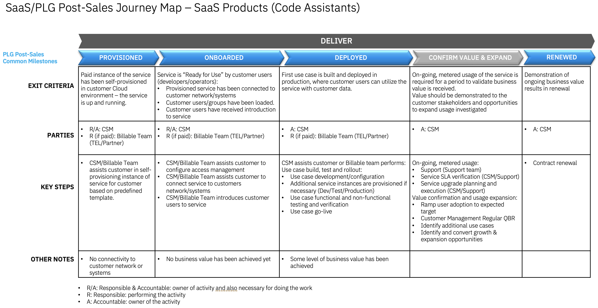

import {Link} from 'gatsby'

<InlineNotification kind="warning">

**Note:**

<ul>
<li>All watsonx <strong>PLATFORM SaaS</strong> deployment threshold automation is under evaluation.
<ul>
<li>CSMs mark customers deployed in a Growth Plan with manager sign-off.</li>
<li>Submit <a href='https://ibm.biz/watsonxdeploymentrequest' target='_blank' rel='noreferrer noopener'>the approval form</a> for WW reviews and validation. The status of approval will be communicated through email.</li>
</ul>
</li>
<li><strong>AI Assistants and APIs</strong>(NON-PLATFORM) watsonx <strong>SaaS</strong> products the automated thresholds remain in place. If you are a CSM or market leader who believes your NON-PLATFORM product is deployed but is not reaching the threshold you can ask for an override through approval process as described below. A Growth Plan with manager sign-off must be in place before sending an override request.
<ul>
<li>For override and additional deployment, CSM or market leader should submit <a href='https://ibm.biz/watsonxdeploymentrequest' target='_blank' rel='noreferrer noopener'>the approval form</a>. The status of approval will be communicated through email.</li>
</ul>  
</li>
<li>Only 2024 new SaaS deployments with a success plan will be approved.</li>
<li>Each watsonx product deployed will be counted. i.e. A RAG use case with watsonx Assistant and watsonx.ai count as two deployments.</li>
</ul>
</InlineNotification>

## Contacts

| WW contact | Name | WW contact | Name |
| --- | --- | --- | --- |
| **Customer Success Practice Leaders:** | John Senegal, Craig Bender | **Digital Customer Success & PLG:** | None |
| **Technology Expert Labs Delivery:** | Tal Sharar | **Technology Expert Labs Solution Engineering:** | Jo Ramos, Guillaume Hoareau |
| **SRE:** | None | | |

<Row>
<Column colMd={9} colLg={9}>

## Overview
As a CSM, your focus is to guide and nurture your customers who have a watsonx Code Assistant for Z SaaS entitlement by guiding the customer through provisioning to onboarding, helping with their first use case, and continuing to expand their use cases.

You can learn more about watsonx Code Assistant for Z on the <a href='https://pages.github.ibm.com/csm-playbook/playbook/common/modernization/modernization-WCA-Z/' target='_blank' rel='noreferrer noopener'>Acceleration Play page</a>.

</Column>
</Row>

<Row>
<Column>

| FAQ | Answer |
| --- | --- |
| What is the relationship name in Gainsight? | IBM Cloud |
| Which Clouds does this product run on? | IBM Cloud |
| How is SaaS usage calculated? | <a href='https://ibm.seismic.com/Link/Content/DC3VpV9PhqCcJGCMpGdfGFfcQPGP' target='_blank' rel='noreferrer noopener'>SaaS Seller Enablement - Slide 10 onwards</a> |
| Who can help my customer with billing/invoicing questions? | TBD |
| Where is the documentation? | <a href='https://cloud.ibm.com/docs/watsonx-code-assistant' target='_blank' rel='noreferrer noopener'>watsonx Code Assistant for Z Documentation</a> |
| Are the SaaS capabilities different from the on-prem offering? | Code Assistant for Z has both on-prem and Cloud based components that work together for a single solution |
| Does watson Code Assistant for Z run on OpenShift? | Yes (LLM on OCP) |
| Does watson Code Assistant for Z count as OpenShift Deployment? | Yes |
| Is watsonx Code Assistant for Z SaaS consumable or ratable revenue? | Consumable. The unit of consumption is ratings. |
| Who triggers deployment? | Automated based on Threshold |

</Column>
</Row>

<Row>
<Column colMd={9} colLg={9}>

### CSM Scorecard Milestones based on usage

SaaS milestones for the CSM Scorecard are based on usage. To progress from Planning to Deploying to Deployed, see <Link to='/common/saas-growth/#zsw-milestones-based-on-usage'>zSW milestones based on usage</Link>.

</Column>
</Row>

<Row>
<Column>

You can find more about RUs and how watsonx Code Assistant for Z is priced in the <a href='https://ibm.seismic.com/Link/Content/DC4QGj6Q4Bjm487X6jp6dqm2QGqd' target='_blank' rel='noreferrer noopener'>SaaS Seller Enablement - Slide 10 onwards</a>

**Example**:  
The overall process of modernizing existing applications will take many months and result in inconsistent usage of the SaaS-based **transform** engine that reports usage to Gainsight. Therefore, as long as the customer uses 8 RUs (converts 40000 lines of COBOL) in a 12-month window, then the entitlement will be marked as Deployed.

<Accordion>
<AccordionItem title="SaaS Adoption Journey Insights">
SaaS has an additional level of insights that are used to track the adoption journey. These provide an additional level of detail specifically for SaaS adoption.  For watsonx Code Assistant for Z, they are shown in the table below:

| 
Insight
 | 
Description
 |
| --- | --- | --- | --- |
| Paid Provisioned | Customer has purchased the product |
| Paid Onboarding Progress | User has read the quickstart |
| Paid Onboarded | Completion of the Onboarding Checklist |
| Paid Deployed | First use case or feature deployed in production environment |
</AccordionItem>
</Accordion>

</Column>
</Row>

<Row>
<Column colMd={9} colLg={9}>

### watsonx Code Assistant for Z Product Feature Adoption and Value Realized Indicators

watsonx Code Assistant for Z Product Feature Adoption and Value Realized Indicators are instrumented in the product to show the capabilities and features that the customer is using. This information can be used to determine the level of adoption that has taken place and ensure that the customer is receiving full business value from the product. See below for novice, intermediate and advanced level indicators along with an asset listing the value proposition, expected benefits, considerations for implementation and metrics of success.

</Column>
</Row>

<Row>
<Column>

<Accordion>
<AccordionItem title="Novice level indicators">

| Product Feature | Description | Asset |
| --- | --- | --- |
| Will be finalized as part of PLG rollout | TBD | TBD |

</AccordionItem>

<AccordionItem title="Intermediate level indicators">

| Product Feature | Description | Asset |
| --- | --- | --- |
| Will be finalized as part of PLG rollout | TBD | TBD |

</AccordionItem>

<AccordionItem title="Advance level indicators">

| Product Feature | Description | Asset |
| --- | --- | --- |
| Will be finalized as part of PLG rollout | TBD | TBD |

</AccordionItem>

</Accordion>

</Column>
</Row>

<Row>
<Column colMd={9} colLg={9}>

## Post-sales journey 

As a CSM with a customer who has a watsonx Code Assistant for Z SaaS entitlement, it is your responsibility to help the customer adopt the product, bring use cases to production, and renew their subscriptions.
The diagram shows the watsonx Code Assistant for Z SaaS post-sales journey at a high level. Each section is broken down in detail with links to assets below.

</Column>
</Row>

<Row>
<Column>

### Provisioned

| **Led by** | **Outcome** | **Assets & Activities** |
| --- | --- | --- | 
| IBM CSM | watsonx Code Assistant for Z SaaS instance provisioned and the customer has access. |**Technology Expert Labs Offerings:**   <a href="https://ibm.seismic.com/Link/Content/DCdJJgXcXcjQMGFF6g8X46hhW4X3" target='_blank' rel='noreferrer noopener'>**Custom Service in Seismic**</a> - Custom SOW    **Sizing and planning**   watsonx Code Assistant for Z doesn't provide different sizing and topology options during provisioning of the component running on IBM Cloud.    **Provisioning the service**   Use the <a href='https://cloud.ibm.com/docs/watsonx-code-assistant?topic=watsonx-code-assistant-getting-started' target='_blank' rel='noreferrer noopener'>Getting Started section</a> of the watsonx Code Assistant for Z Documentation along with the <a href='https://ibm.ent.box.com/s/vt5bhdeh8pq65j20wlez3f0b5ias0m0p' target='_blank' rel='noreferrer noopener'>CS IBM Cloud onboarding guide</a> to guide your customer through the process of provisioning the watsonx Code Assistant for Z service. | 

### Onboarded

| **Led by** | **Outcome** | **Assets & Activities** |
| --- | --- | --- | 
| IBM CSM | Customer has read the quickstart document, has configured VS Code, and added the required API Keys. | **Technology Expert Labs Offerings:**   <a href="https://ibm.seismic.com/Link/Content/DCdJJgXcXcjQMGFF6g8X46hhW4X3" target='_blank' rel='noreferrer noopener'>**Custom Service in Seismic**</a> - Custom SOW    **Getting started**   Use the <a href="https://cloud.ibm.com/docs/watsonx-code-assistant?topic=watsonx-code-assistant-cloud-setup-z" target='_blank' rel='noreferrer noopener'>setup guide</a> to create and configure the required API Keys and then the <a href="https://www.ibm.com/docs/en/watsonx-code-assistant-4z/1.0" target='_blank' rel='noreferrer noopener'>Code Assistant for Z documentation</a> to configure the on-prem components of the offering.    **Nurture opportunities**  After the Product Led Growth interface in Gainsight is configured later in 2024, you will be able to track the activities that the customer is performing in watsonx Code Assistant for Z. This enables you to determine whether the customer needs additional assistance through their journey. For instance, if you see that no *buckets or engines* have been configured or no *queries* have been executed, then your customer has not completed the basic onboarding steps and might require your assistance. |

### Deployed

| **Led by** | **Outcome** | **Assets & Activities** |
| --- | --- | --- | 
| CSM |  The client is consistently modernizing applications and generating Java services based on COBOL. | **Technology Expert Labs Offerings:**   <a href="https://ibm.seismic.com/Link/Content/DCdJJgXcXcjQMGFF6g8X46hhW4X3" target='_blank' rel='noreferrer noopener'>**Custom Service in Seismic**</a> - Custom SOW    **Create/enhance the solution**   CSMs should utilize billable services from Technology Expert Labs to design and implement the solution for the customer.   CSMs that have customers that want to perform the first design and implementation without the support of Technology Expert Labs will need to provide support themselves using experience gained from completing the <a href="https://yourlearning.ibm.com/activity/PLAN-3A95B9E1CBA3" target='_blank' rel='noreferrer noopener'>Level 2</a>, and <a href="https://yourlearning.ibm.com/activity/PLAN-EDD40AC8FE9B" target='_blank' rel='noreferrer noopener'>Level 3</a> enablement classes.   **Operate the solution**   CSMs should utilize billable services from Technology Expert Labs to instruct the customer on how to operate the solution for the customer.   CSMs that have customers that want to perform the first design and implementation without the support of Technology Expert Labs will need to provide support themselves using experience gained from completing the <a href="https://yourlearning.ibm.com/activity/PLAN-3A95B9E1CBA3" target='_blank' rel='noreferrer noopener'>Level 2</a>, and <a href="https://yourlearning.ibm.com/activity/PLAN-EDD40AC8FE9B" target='_blank' rel='noreferrer noopener'>Level 3</a> enablement classes.   **Nurture opportunities**  After the Product Led Growth interface in Gainsight is configured later in 2024, you will be able to track the activities that the customer is performing in watsonx Code Assistant for Z. This enables you to determine whether the customer needs additional assistance through their journey. For instance, if you see that no requests to transform COBOL to Java have occurred, then your customer has not completed the basic onboarding steps and may require your assistance. |

### Confirm Value & Expand

| **Led by** | **Outcome** | **Assets & Activities** |
| --- | --- | --- | 
| CSM | Customer has realized value and is expanding usage to new business use cases. | **Nuture Relationship**   Set up a <a href='https://pages.github.ibm.com/csm-playbook/playbook/onboard/executive-business-review/' target='_blank' rel='noreferrer noopener'>EBR (executive business review)</a> with client sponsor and executives to align and review the adoption, value seen and confirm the customer's strategic goals have been met.    **Identify Risk/Opportunity**   After the Product Led Growth interface in Gainsight is configured later in 2024, you will be able to track the activities that the customer is performing in watsonx Code Assistant for Z. This enables you to determine whether the customer is continuing to use the product or whether usage is dropping.    **Expand Solution**   A CSM should continue to look for opportunities to add more use cases using the <a href='https://pages.github.ibm.com/csm-playbook/playbook/common/modernization/modernization-WCA-Z/' target='_blank' rel='noreferrer noopener'>watsonx Code Assistant for Z Acceleration Play</a>. |

### Renewed

| **Led by** | **Outcome** | **Assets & Activities** |
| --- | --- | --- | 
| CSM and/or Technical Sales | The client has confirmed that they are using the product and will continue to renew their entitlement. | N/A |

</Column>
</Row>
