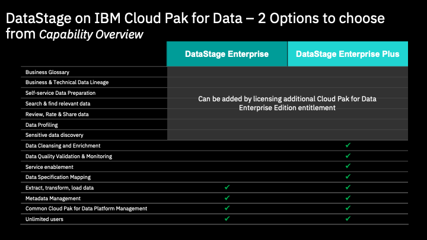
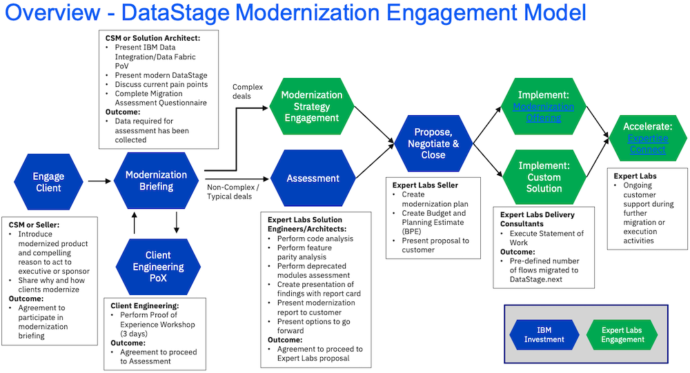
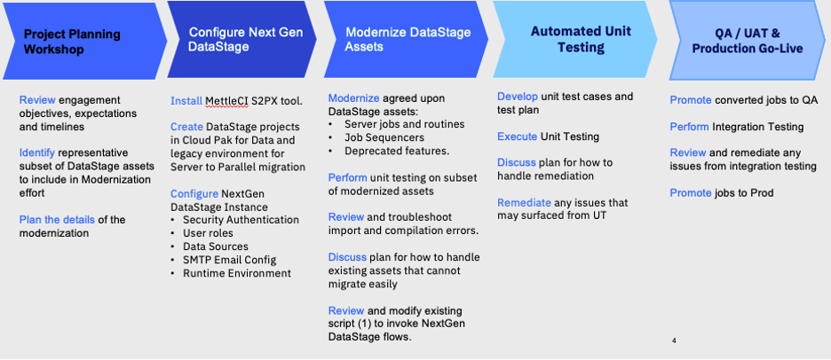

import {Link} from 'gatsby';
import FileLink from '../../../components/FileLink';

<Row>

<Column>

<Tabs>

<Tab label='WW contacts'>

| WW contact | Name |
| --- | --- |
| **Customer Success Practice Leaders:** | Campbell Robertson (cir@ca.ibm.com)|
| **Technology Expert Labs Delivery Lead:** | Akram Abdouch (@Akram) |
| **Technology Expert Labs Solution Engineering:** | Bala Vaithyalingam (@bala) |
| **Technology Expert Labs Product Management:** | Sarah Memon (@Sarah Memon) and  Sandeep Sinha (@ssinha1)|
</Tab>

<Tab label='Who can help?'>

| Role | Assset |
| --- | --- |
| **Client Engineering** | Slack: #client-eng-data-ai |
| **Tech Sales** | Slack: #cp4d-cpfield has the skills required to perform Proof of Experience (Pox) engagements. |
| **Data & AI Solution Architect** | Deep skills and experience with the Data & AI portfolio. Work with your account team to determine if there is already a resource attached to your customer. If you aren't sure reach out to your Data & AI Practice Leader Campbell Robertson @campbell for help. |
| **Technology Expert Labs:** | Deliver solution design, deploy production environments, deliver full-stack observability, and create outcome SOW and account plans (for a fee).  Slack Channel for Expert Labs: #ask-expert-labs <a href='https://ibm.biz/BdPZX6' target='_blank' rel='noreferrer noopener'>Seismic Link to Expert Labs Homepage</a> |

</Tab>

<Tab label='DataStage contacts'>

| Role | Name |
| --- | --- |
| WW Technical Sales - Data Integration and Preparation Lead | Albert Liang -- liangc@us.ibm.com |
| Program Director, DataStage Product Management | Scott Brokaw -- slbrokaw@us.ibm.com STSM |
| CP4D Product Management Lead, Connectivity | Daniel Ferranti -- daniel.ferranti@ibm.com  |
| Product Management Lead, DataStage on CP4D, CP4DaaS, and QualityStage | Stephanie Valarezo -- stephanie.valarezo1@ibm.com |
| Program Director DataStage Support, WW Client Success DataStage and WKC | Carl Braganza -- braganza@au1.ibm.com |

</Tab>

</Tabs>

</Column>
</Row>

<Row>
<Column colMd={9} colLg={9} noGutterMdLeft>

## What is DataStage and what does it do?
IBM DataStage on IBM Cloud Pak for Data is a modernized data integration solution to collect and deliver trusted data anywhere, at any scale and complexity, on and across multicloud and hybrid cloud environments. Save on data movement costs by bringing a best-in-breed parallel engine to where your data is. Increase the productivity of your business and IT users through automated job design and out-of-the-box, native integration with cloud data lakes, real-time data sources, relational databases, big data, and NoSQL data stores. 

* Design once, run anywhere paradigm allows you to bring data integration to where your data resides.
A best-in-breed parallel engine processes substantial data volumes, and built-in workload balancing supports multicloud scalability and elasticity.
* The DataStage service uses Cloud Pak for Data platform connections and integration points, with services like Data Virtualization, to simplify the process of connecting to and accessing your data. 
With a fully cloud-native architecture, DataStage can dynamically scale workloads and optimize for large data sets. With a few steps, you can deploy IBM DataStage on Cloud Pak for Data in your AWS infrastructure to facilitate cloud-to-cloud, ground-to-cloud, or cloud-to-on-premises tasks.

Some Key Benefits  from the [Data Stage Solution Brief](https://ibm.seismic.com/Link/Content/DCXgpTCPD6CmH84QFppd2hb3WDBB)

* 50% lower cost of operations through simpler operations and maintenance.
* 30% savings on workload execution time due to elastic scaling and balancing.
* 50% or more reduction in development costs when running on multiple cloud environments thanks to the design once and run anywhere feature.
* 87% savings in development cost when using visual and ML-assisted design, as compared to hand coding.
* Existing customers can retain existing investments in skills and assets and save millions of dollars in license cost savings by eliminating the need to purchase Windows/Citrix thick client licenses.

### What pain points does DataStage address?

Data Integration and Quality are at the heart of your DataOps value chain: 
* Provides flexibility on how to integrate your data and at what latency 
* Provides high scalability across a variety and volume of data 
* Provides built-in capabilities for data quality, governance and AI 

### DataStage modernization

DataStage modernization is the process of taking customers from IBM Infosphere DataStage, IBM Infosphere QualityStage or IBM Information Server and moving them to DataStage NextGen running on Cloud Pak for Data on OpenShift. To run DataStage NextGen, the customer needs to have licenses to either DataStage Cartridge or Information Server Cartridge. 

</Column>

</Row>

<Row>

<Column colMd={6} colLg={6} noGutterMdLeft>

### DataStage licensing options

 

</Column>

<Column colMd={3} colLg={3} noGutterMdLeft>

</Column>

</Row>

<Row>

<Column>

-----

## Deployment stages (Milestones)

Deployments are tracked in Gainsight through <Link to='/onboard/gainsight-create-growth-plan'>Growth Plans</Link>. In ISC, these deployments are called Deployment Opportunities. These <Link to='/deploy/document-the-plan'>Deployment stages</Link> are called <Link to='/onboard/gainsight-milestones'>Milestones</Link> in Gainsight.

-----
### Identify phase

#### Common practices

Before you start to work with the customer, you will need to learn about the customer, their industry, what was sold, and who you might work with.

| Practice | Description |
| --- | --- |
| <Link to='/onboard/understand-client-it-landscape/'>Learn about the customer</Link> | Before you get started, you need to learn about your customer and their business. |
| <Link to='/onboard/learn-partner/'>Learn about the partner</Link> | If your customer is working with a partner, you need to learn about the partner and their relationship with IBM and the customer. |
| <Link to='/onboard/understand-deal/'>Understand the deal</Link> | Learn where to find information related to how the product was sold to the customer. |
| <Link to='/deploy/identify/'>Identify</Link> | Understand what the customer will need to be successful. |

You will need to understand if the customer is an existing DataStage customer who needs to focus on modernization or if this is new to DataStage.

#### Product-specific practices

| Led by | Outcome | Assets & Activities |
| --- | --- | --- |
| CSM | Prioritized use case | **There isn't a current use case, where do I start?**   - Focus on modernization discussions   - Planned data integration projects   - DataOps-led initiatives   Run a discovery workshop to identify and prioritize use cases and potential solution designs.  Do this with the participation of IT and LOB in the room or MURAL session at the same time.   If you need assistance running a workshop, contact Practice Leader: Campbell Robertson.  You can also ask to have Client Engineering, Data Elite Team, Data Science Elite team or Expert Labs (Paid Engagement).    The customer is an existing DataStage customer who should modernize to CPD or DataStage Anywhere.    The customer is new to DataStage and needs to drive to an initial adoption use case.

<Tabs>

<Tab label='Acceleration'>

</Tab>

<Tab label='Modernization'>

#### Why should a customer modernize?
DataStage NextGen on Cloud Pak for Data provides customers with the next generation of DataStage and includes the following benefits:
- Redesigned GUI using modern, web-based canvases that do not require re-training of client developers.
- Additional data integrations to help virtualize, replicate, stream, and prepare data before or after the ETL job is completed in DataStage.
- Micro-services-based architecture & containerized, optimized for hybrid cloud workloads
- Dynamic scalability & high resiliency
- Databand (licenses sold separately) can provide data observability to ensure data quality, security, and performance levels of the ETL jobs
Metrics based on research and client experiences:
- 30% throughput execution improvement over legacy DataStage
- 87% savings in development cost when using GUI compared to hand-coding ETL jobs
- 60% increased efficiency (minimal upgrade efforts)

For client-facing material, see the Compelling Reason to Act in the [Engage Client Phase](#engage-client-phase) section.

#### How complex is modernization?
Modernization ranges from fully automated to manual. The purpose of the Technology Expert Labs Assessment is to analyze the existing environment and create a customized modernization plan. You can find a graphical view of the modernization and an example report from Technology Expert Labs starting on slide 44 of the <a target='_blank' rel='noreferrer noopener' href="https://ibm.box.com/s/5uxv3r7htt6vus6ljn1uypt3jxrz30zz">IBMs DataStage Modernization PoV Deck</a>

Read DataStage Product Management's views and thoughts on having a Modernization Discussion with your client: [DataStage NextGen Review](https://github.ibm.com/Stephanie-Valarezo1/ds-nextgen-review)

In summary, assets can be modernized from DataStage Standalone to DataStage NextGen on Cloud Pak for Data using one of the three paths (and only one path is manual):
- Automated (ISX Import Service) - Parallel Jobs, Parallel Shared Containers, Parameter Sets, Parallel Routines
- Semi-Automated Migration Tool (MettleCI) - Server Jobs
- Manual Rewrite - Server Routines

IBM has confidence that DataStage NextGen is ready for customers to modernize from IBM Infosphere DataStage, IBM Infosphere QualityStage or IBM Information Server and that a repeatable process exists with our DataStage modernization journey. 
**Review:** <a target='_blank' rel='noreferrer noopener' href="https://ibm.box.com/s/2kb0scdqsweu3t2vers7hcyz01g32b63">
Technology Expert Labs DataStage Modernization Project at Standard Bank of South Africa</a> 
**Listen:** <a target='_blank' rel='noreferrer noopener' href="https://ibm.biz/Bdy5QH">Technology Expert Labs DataStage Modernization Journey at Standard Bank of South Africa Recording</a>

#### DataStage Modernization journey
This diagram shows the DataStage Modernization journey at a high level. Each section is broken down in detail with links to assets below.

| Led by | Modernization use case | Description |
| --- | --- | --- |
| CSM | **Simplified architecture leads to reduced administration & overhead** | Removed WebSphere App Server, metadata repository (DB2, Oracle or SQL Server), no more Windows clients needed (removes Citrix or other workspace solutions); same DataStage parallel engine; simplified high availability.  |
| | **Simpler upgrades, easy rollbacks** | Operator framework allows repeatability of installation and upgrades; container images are quick to install and can be rolled back (minutes versus hours; no longer need to patch WAS, Engine, etc.). Monthly minor releases share security fixes; and faster development and delivery of new DataStage features.  |
| | **Monitoring on a modern stack** | Monitoring stack based on Prometheus open-source project; built-in logging components (EFK stack); can extend and share DataStage metrics beyond cluster administrators; integration with Splunk, Slack, ServiceNow, etc. possible.  |
| | **Automated operations** | Over-the-air updates for components; simplified, unified interface to leverage all the Kubernetes benefits; rich command-line interface (dsjob) allows you to reuse scripts for DataStage operations; APIs/CLIs integration for CI/CD; simplified lifecycle management.  |
| | **Performance and scalability, availability** | Multiple DataStage conductors and computes can be deployed quickly; virtually unlimited horizontal and vertical scalability; dynamic scalability and compute bursting are handled automatically by DataStage.  |
| | **Development ease of use** | Web-browser-based development environment; substantial productivity enhancements such as automated column propagation; searchable and interactive logs; canvas built on open-source project Elyra; type-ahead for DataStage functions.  |
| | **Flexibility to deploy on other clouds or on-prem** | Deploy within minutes (standardized deployment and management); monthly patches can be applied at the push of a button; simple access control and provisioning options; flexible model (self-managed OpenShift, managed OpenShift, SaaS).  |
| | **DataStage asset modernization effort** | In-built migration service simplifies importing existing DataStage assets (including parallel jobs and sequence jobs) into new experience; maintains portability with parameter sets; many development months to make this seamless.  |
| | **Security** | Highly secure container environment; supports TLS to encrypt data in transit; client-server communications are encrypted; container images go through certification; role-based access controls with Cloud Pak for Data.  |

</Tab>

</Tabs>

</Column>
</Row>

<Row>

<Column>

------

### Propose phase

#### Common practices

| Practice | Description |
| --- | --- |
| <Link to='/deploy/propose-solution/'>Propose the solution</Link> | Understand what the customer will need to be successful. |

#### Product-specific practices

<Tabs>
<Tab label='Acceleration'>

</Tab>

<Tab label='Modernization: Engage Client'>

Before entering this phase it is necessary to discuss the topic of DataStage modernization with the account team and Account Technical Leader to ensure that it is part of the overall account plan.

This phase covers the steps necessary to have the first conversation with the customer about DataStage modernization (**Executive level meeting**). We've provided a sample *Compelling Reason to Act* which is generic and applicable to most DataStage customers as well as a deck from Product Management that goes into more depth on the value of modernization from legacy DataStage runtimes to the OpenShift- based *NextGen* version.

<Row>
<Column colMd={12} colLg={12}>

| Roles | Outcome| Assets & Activities |
| --- | --- | --- |
| **Led by:** CSM and/or BTS    **Audience:** Executive/Sponsor | A sponsor is interested in a **Modernization Briefing** and workshop where IBM and the customer will work together to scope and plan the modernization project. | - Perform account planning to identify target personas and related metrics related to DataStage modernization   - Create a Success/Growth Plan in Gainsight to track the progress of this potential project. <a target='_blank' rel='noreferrer noopener' href="https://ibm.box.com/s/u0d2z0ia2z5uhvb81577l36gkvspucud" > Sample Growth Plan</a>   -  Review the <a target='_blank' rel='noreferrer noopener' href="https://ibm.box.com/s/uewlcphgn5tl1fd7tsi6l0un7n5bcbql">Modernization Conversation one-pager</a>   - Enhance one of the provided <a target='_blank' rel='noreferrer noopener' href="https://ibm.box.com/s/k9pmeensue05z7pn6sfhipvq0kutbdiy">compelling reasons to act</a> to reflect specific personas and metrics   - Insert a customized Compelling Reason to Act into the <a target='_blank' rel='noreferrer noopener' href="https://ibm.box.com/s/3nkb97281xv3i7mqmg8rqtfj5bt58b04">Executive DataStage Modernization Overview Deck</a>   - Listen the Product Management walk through the DataStage POV material: [PM DataStage POV Walkthrough](https://ibm.box.com/s/vie9ubgg0ggm83hx0esna4fxoz7ywn1d)   - Present the Executive DataStage modernization overview deck including customized Compelling Reason to Act to **customer executives or sponsors**   - Refer to the <a target='_blank' rel='noreferrer noopener' href="https://ibm.biz/BdPpQY">recording</a> of the DataStage modernization approach from the Community of Practice call for reference on how to present the overview deck   - Review and understand parity issues (if SaaS is an option) and how that may impact the rollout of the DataStage Modernization Project: [DataStage Parity Assessment for DS to DSaaS](https://github.ibm.com/Stephanie-Valarezo1/ds-nextgen-review)  - Review and understand the <a href='https://ibm.ent.box.com/folder/236410490242?s=vdihs7oehpe1ztpct425lyqsxwv2d53k' target='_blank' rel='noreferrer noopener'>**DataStage Modernization BVA** process</a> to further enhance the compelling reason to act  |

</Column>
</Row>

</Tab>

<Tab label='Modernization: Modernization briefing phase'>

The modernization briefing is used to articulate the capabilities and benefits of DataStage NextGen and to complete the assessment questionnaire required by Technology Expert Labs to be able to complete an assessment. We have provided a set of assets that should be used in the briefing below. They include an agenda, the DataStage Modernization PoV deck and the assessment questionnaire. In addition, there is a set of links to Demos and Lab exercises that you may choose to show to the customer in the briefing.

You can engage the Technology Expert Labs Solution Architect for assistance with the questionnaire.

In some situations, you might need to engage Client Engineering to complete a Proof of Experience (PoX) to convince the technical DataStage team of the viability of the modernization to DataStage NextGen. In this case, we have provided detailed instructions in the *Optional Client Engineering PoX Phase* section below.

**Process and assets:**

<Row>
<Column colMd={12} colLg={12}>

| Roles | Outcome| Assets & Activities |
| --- | --- | --- |
| **Participants in the briefing:** Customer Success and/or Technology Expert Labs Solution Architect, Customer architect, developer, operations team | The technical DataStage team at the customer understands the capabilities and benefits of DataStage NextGen and the assessment questionnaire has been completed. | - Engage the Technology Expert Labs Seller (if you don't know your Technology Expert Labs Seller they <a target='_blank' rel='noreferrer noopener' href="https://clientresourcelocator.wdc1a.cirrus.ibm.com/">can be found here</a>)   - The TEL Seller creates an ISC record and engage the Technology Expert Labs Solution Architect (if necessary)    - Review the <a target='_blank' rel='noreferrer noopener' href="https://ibm.box.com/s/xsjn12c8d5iztye14tmryz7ur70gh551">CSM Modernization Briefing Instruction Deck</a> for an overview of how to plan and execute the briefing   - Review the <a target='_blank' rel='noreferrer noopener' href="https://ibm.box.com/s/e6oyg4qb4spxv1xgqpgt2p1xwmgim6y0">DataStage Modernization Licensing considerations</a>   -  Modify <a target='_blank' rel='noreferrer noopener' href="https://ibm.box.com/s/ieugmcnn3uffarke8php0mnbafuzknhe">Briefing Agenda</a> to insert demonstrations or hand on labs if necessary.   - Conduct the briefing using the <a target='_blank' rel='noreferrer noopener' href="https://ibm.box.com/s/5uxv3r7htt6vus6ljn1uypt3jxrz30zz">IBMs DataStage Modernization PoV Deck</a>   - Refer to the <a target='_blank' rel='noreferrer noopener' href="https://ibm.biz/BdPpQY">recording</a> of the DataStage modernization approach from the Community of Practice call for reference on how to present the PoV deck   - Together, the CSM/Technology Expert Labs Solution Architect and customer team complete the <a target='_blank' rel='noreferrer noopener' href="https://ibm.ent.box.com/s/rpx9y7z48yzteho273g6gwmto496zxng">DataStage Modernization questionnaire</a>. This includes instructions showing how to export the DataStage assets required for assessment.  |
| | | **Demo and Lab assets:** - <a target='_blank' rel='noreferrer noopener' href="https://ibm.seismic.com/Link/Content/DCXHq3VJ8mV4G8FCBQ83bQBhcJJ8">Demo: Migrate DataStage Workloads to Cloud Pak with MettleCI</a>   - <a target='_blank' rel='noreferrer noopener' href="https://ibm.seismic.com/Link/Content/DCgHQbm3BhG6HG9Q9QRhfCqBdb7j">Demo: DataStage and Databand</a>   - <a target='_blank' rel='noreferrer noopener' href="https://ibm.seismic.com/Link/Content/DCBBTB49FgpBM8hTcWXpdbhX7fm8">Demo: DataStage Cartridge on CPD</a>   - <a target='_blank' rel='noreferrer noopener' href="https://cp4d-outcomes.techzone.ibm.com/data-fabric/data-integration">Data Integration Lab Exercise</a> |
| | | **Review:** <a target='_blank' rel='noreferrer noopener' href="https://ibm.box.com/s/2kb0scdqsweu3t2vers7hcyz01g32b63">Technology Expert Labs DataStage Modernization Project at Standard Bank of South Africa</a>. |

</Column>
</Row>

</Tab>

<Tab label='Modernization: PoX phase'>

This is an optional phase in which the customer might want to see a demonstration of the process of moving flows from their current environment to DataStage NextGen. Client Engineering can engage in a Proof of Experience (PoX) to demonstrate the process and the new platform.

**Process and assets:**

<Row>
<Column colMd={12} colLg={12}>

| Roles | Outcome| Assets & Activities |
| --- | --- | --- |
| CSM | Engage CE to run a DataStage modernization PoX. | Request a Client Engineering resource to run a DataStage modernization PoX, in ISC <a href='https://ibmsc.lightning.force.com/lightning/page/home' target='_blank' rel='noreferrer noopener'>IBM Sales Cloud (ISC)</a>. See the <a href='https://w3.ibm.com/w3publisher/client-engineering/engage/engagement-instructions' target='_blank' rel='noreferrer noopener'>Client Engineering engagement instructions</a> on how to fill in the request in ISC.    When filling in the information, have the relevant information ready:   - Engagement Details (”Technology Pattern” + pattern + description)   - Pattern: Data Integration (i.e Technology Pattern Data Integration "Description")   - Business Problem: DataStage Modernization   - Scope: PoX   - Use Case   - Success Criteria   - Skills: DataStage Skills needed. |
| **Led by:** Client Engineering | A PoX that demonstrates the process and new platform. | <a target='_blank' rel='noreferrer noopener' href="https://ibm.box.com/s/qozwqitsk0dh2c9u4dsmnk65x3kg2k8b">Short presentation</a>  describing this process, along with a sample workshop agenda from Client Engineering. |

</Column>
</Row>

</Tab>

</Tabs>

</Column>

</Row>

<Row>

<Column>

------

### Sponsored phase

#### Common practices

| Practice | Description |
| --- | --- |
| <Link to='/deploy/get-sponsorship/'>Get Sponsorship</Link> | Identify the people in the organization who will help you establish the value of the solution. |

</Column>

</Row>

<Row>

<Column>

------

### Planning phase

#### Common practices

| Practice | Description |
| --- | --- |
| <Link to='/deploy/plan-deployment/'>Plan deployment</Link> | Plan the deployment, create the architecture, and set a target date. |

#### Product-specific practices

<Row>
<Column colMd={12} colLg={12}>

| Led by | Outcome | Assets & Activities |
| --- | --- | --- |
| CSM | | **What do CSM-driven deployments look like?**   Next Generation DataStage on Cloud Pak for Data Cartridge Sizing https://ibm.seismic.com/Link/Content/DCMHH6X7pHjWc8HRHjD7TRfJTPbj   Video tutorials on how to use certain stages and connectors, visit: https://video.ibm.com/playlist/650317/video/131718627 |

</Column>

</Row>

<Tabs>
<Tab label='Acceleration'>

</Tab>

<Tab label='Modernization: Assessment and Strategy Phase'>

This assessment is performed by Technology Expert Labs after the Modernization Briefing where the CSM has gathered the required information about the Customer's DataStage environment (questionnaire and export of environment). 

The purpose of the Assessment Phase is to take the completed questionnaire and the project exports to determine the level of effort to modernize a customer. Technology Expert Labs (Solution Architect/Solution Engineer) uses an in-house automation tool to analyze the customer's DataStage assessment information and Provides a findings report card complete with feature parity and deprecated module analysis and one or more service options to align with the customer's requirements.

You can find an example report from Technology Expert Labs starting on slide 45 of the <a target='_blank' rel='noreferrer noopener' href="https://ibm.box.com/s/5uxv3r7htt6vus6ljn1uypt3jxrz30zz">IBMs DataStage Modernization PoV Deck</a>.

**Process and assets:**

<Row>
<Column colMd={12} colLg={12}>

| Roles | Outcome| Assets & Activities |
| --- | --- | --- |
| **Led by:** CSM and TEL | Solution architecture completed.  |  <a href="https://ibm.biz/BdPZ49">DataStage Reference architecture</a> |
| **Led by:** Technology Expert Labs Solution Architect/Solution Engineer | Customer has a report that outlines the effort required to modernize.  |  Required inputs by CSM (from Modernization Briefing/Discovery):   - Project objectives and requirements   - Completed DataStage questionnaire including DataStage project export(s) preferably from the Production Environment (instructions provided in the questionnaire). |

</Column>

</Row>

</Tab>

</Tabs>

</Column>

</Row>

<Row>

<Column>

------

### Deploying phase

**Deployment Options:** SaaS, Virtual Machine, OpenShift

#### Common practices

| Practice | Description |
| --- | --- |
| <Link to='/deploy/install-provision/'>Deploying</Link> | Get the right resources in place. Install and build. |

#### Product-specific practices

<Tabs>
<Tab label='Acceleration'>

**Process and assets:**

<Row>
<Column colMd={12} colLg={12}>

| Led by | Outcome | Assets & Activities |
| --- | --- | --- |
| CSM |  | **The steps to deploy and who is responsible for what, when?**   The steps to deploy will depend on whether the client is new or a client migrating or modernizing.  Two teams can assist (either IBM Invest or For Fee)   **How do I modernize existing DataStage customers?**   DataStage modernization is the process of taking customers from IBM Infosphere DataStage, IBM Infosphere QualityStage or IBM Information Server and moving them to DataStage “nextgen” on OpenShift.  In conjunction with Product Management and Technology Expert Labs, the Customer Success team has created a <Link to="/common/modernization/modernization-datastage/">DataStage modernization journey</Link> that details the steps that are required to go from opportunity identification to assessment and end with an Expert Labs services project for delivery at scale.  You’ll find assets such as:   -- curated, focused “compelling reason to act” pages that can be used with customers -- comparisons of existing point products and the version that runs on OpenShift -- modernization workshop materials -- assessment questionnaires and processes -- Technology Expert Labs offerings and approaches    For **new installations**, you can request assistance from Technology Expert Labs: **[Request an Expert Labs Solution Engineer](https://survey.alchemer.com/s3/7197619/Solution-Engineering-Request-Form)** |

</Column>

</Row>

</Tab>

<Tab label='Modernization: Propose, Negotiate, and Close phase'>

The purpose of the Propose, Negotiate, and Close phase is to close a services deal. The IBM Sales team: Digital/Services Seller, Solution Architect/Solution Engineer presents the customer with a Services proposal for DataStage Modernization based on their budget and requirements.   

The IBM Technology Expert Lab Services’ team recommended implementation methodology is built on a premise of phase-based implementations for DataStage modernization, which enable quick “wins” in terms of go-live dates and milestones. This approach allows organizations to better manage the overall roll-out approach, while simultaneously building enthusiasm and confidence in the program. IBM Technology Expert Labs team leverages best practices and a proven methodology to support your modernization journey success with backing from IBM Software Labs. In IBM’s experience, roll-outs can be segmented by a variety of business and technical areas, including product lines, geographies and business units, source and destination systems, and business processes. IBM Technology Expert Lab is highly skilled at working with customers to develop optimal roll-out plans to match individual client requirements based on the current usage of DataStage, complexity of the environment, modernization assessment results, key dependencies between DataStage Projects and critical milestones for the program

CSM needs to maintain awareness for continued engagement with the client.

**Process and assets:**

<Row>
<Column colMd={12} colLg={12}>

| Roles | Outcome| Assets & Activities |
| --- | --- | --- |
| **Led by:** Technology Expert Labs Seller | TEL Services deal is closed. | **Technology Expert Labs Offerings:**   - <a target='_blank' rel='noreferrer noopener' href="https://ibm.seismic.com/Link/Content/DC6VXhfBm8WJhGmQ4j6b24DBC2Wj">Build DataStage Modernization</a>   - <a target='_blank' rel='noreferrer noopener' href="https://ibm.seismic.com/Link/Content/DChTBdhh2f8jg8mHCbCTB8FfD683">Expertise Connect</a> |

</Column>
</Row>

</Tab>

<Tab label='Modernization: Implement Phase'>

In the Implementation Phase, the Technology Expert Labs Delivery team performs the services to modernize DataStage from Information Server to DataStage NextGen on CP4D or DataStage Anywhere (SaaS). The details of the implementation phase depend on the services agreed on in the Propose Negotiate and Close Phase.
This diagram shows the DataStage Modernization Methodology at a high level.  For more details, you can review the <Link to='/common/data-ai/tel-data-ai-data-stage-data'>DataStage Implementation Playbook.</Link>

CSMs should shadow/maintain awareness for continued engagement with the client.

<Row>
<Column colMd={12} colLg={12}>

| Roles | Outcome| Assets & Activities |
| --- | --- | --- |
| **Led by:** Technology Expert Labs Solution Engineer | Technology Expert Labs Delivery team will perform the services as agreed upon in the Propose Negotiate and Close Phase. | **Technology Expert Labs Offering:**    - <a target='_blank' rel='noreferrer noopener' href="https://ibm.seismic.com/Link/Content/DC6VXhfBm8WJhGmQ4j6b24DBC2Wj">Build DataStage Modernization</a>   - <a target='_blank' rel='noreferrer noopener' href="https://ibm.seismic.com/Link/Content/DChTBdhh2f8jg8mHCbCTB8FfD683">Expertise Connect</a> |

</Column>
</Row>

</Tab>

</Tabs>

</Column>
</Row>

<Row>

<Column>

------

### Deployed / Confirm value phase

#### Common practices

| Practice | Description |
| --- | --- |
| <Link to='/deploy/measure-success/'>Confirm value</Link> | Measure success. |

</Column>

</Row>

<Row>

<Column>

-----

### Expand

Use Case and Sponsors will ensure a successful first project deployment.  From there the positioning of additional services driven by new use cases will validate the need for additional compute or CP4D services.

| Practice | Description |
| --- | --- |
| <Link to='deploy/measure-success/'>Confirm value</Link> |  Show the customer the value they are achieving with their investment. |
| <Link to='/expand-renew/expand-offerings/'>Expand</Link> | Grow customer's use of the offerings. |

#### Product-specific practices

| Led by | Outcome | Assets & Activities |
| --- | --- | --- |
| CSM |  | **Start with Express Parts, which provides a rapid lightweight introduction.**   - [Seller 1-Pager](https://ibm.seismic.com/app?ContentId=08894b44-8921-44f2-9d3d-fd7070af936a#/doccenter/f6bc8873-d580-4ee8-a903-c4e0d3a7eee9/doc/%252Fdd85c941b1-5f54-2314-ce72-b98c4c0974c2%252FdfOTRiYmU4NTQtNWY4NC03Y2QyLWZjYWUtOGIxYmFmZjkyZThk%252CPT0%253D%252CUHJvc3BlY3Rpbmc%253D%252Flf642235a3-71fb-4291-9a7f-76d76c78c25b//?mode=view&parentPath=sessionStorage)  - [Prospecting Guide 1-Pager](https://ibm.seismic.com/app?ContentId=08894b44-8921-44f2-9d3d-fd7070af936a#/doccenter/f6bc8873-d580-4ee8-a903-c4e0d3a7eee9/doc/%252Fdd85c941b1-5f54-2314-ce72-b98c4c0974c2%252FdfOTRiYmU4NTQtNWY4NC03Y2QyLWZjYWUtOGIxYmFmZjkyZThk%252CPT0%253D%252CUHJvc3BlY3Rpbmc%253D%252Flf70907048-707e-47a9-8872-7bd5b5194ecb//?mode=view&parentPath=sessionStorage)  - [Competitive 1-Pager](https://ibm.seismic.com/app?ContentId=08894b44-8921-44f2-9d3d-fd7070af936a#/doccenter/f6bc8873-d580-4ee8-a903-c4e0d3a7eee9/doc/%252Fdd85c941b1-5f54-2314-ce72-b98c4c0974c2%252FdfOTRiYmU4NTQtNWY4NC03Y2QyLWZjYWUtOGIxYmFmZjkyZThk%252CPT0%253D%252CQ29tcGV0aXRpdmUgcGxheWJvb2s%253D%252Flfbdab93b9-bd03-46bb-8395-1fe7d45d2a81//?mode=view&parentPath=sessionStorage) 

</Column>
</Row>

-----

<Row>

<Column>

## Resources

</Column>
</Row>

<Row className="resource-card-group">

<Column colMd={4} colLg={4} noGutterSm>

<ResourceCard
      subTitle='DataStage'
      title="Implementation playbook"
      href="/common/data-ai/tel-data-ai-data-stage-data">

</ResourceCard>
</Column>

<Column colMd={4} colLg={4} noGutterSm>

<ResourceCard
      subTitle='DataStage'
      title="Reference architecture"
      href="https://ibm.biz/BdPZ49">

</ResourceCard>

</Column>

</Row>

<Row>

<Column colMd={4} colLg={4} noGutterMdLeft>
 

<Aside>

**CSM Slack Channel:** <a href='https://ibm-analytics.slack.com/archives/C01L3NASBUJ' target='_blank' rel='noreferrer noopener'>csm-data-ai</a> 
**DataStage Slack Channels:** 
**Standalone DataStage:** #iis-connectivity or #iis-general 
**Connectivity:** #cp4d-common-connectivity 
**Cloud Pak for Data:** #ds-nextgen-internal-users or #cp4d-datastage 

**Roadmap:** <a href='https://ibm.seismic.com/Link/Content/DCqW2XR6Gb9cP8mRF7jT7mRP4RhV' target='_blank' rel='noreferrer noopener'>Data Stage - Date Fabric Integration</a> 
**DataStage Sales Kit:** <a href='https://ibm.seismic.com/Link/Content/DCMbbC7qhpDQf8CCGPjB6qR2QpT8' target='_blank' rel='noreferrer noopener'>Go here for new DataStage discussions.</a> with additional information 

**Demo:** DataStage Free Trial [Link](https://techzone.ibm.com/resource/ibm-data-stage-ghmhd59kd) 
**Tech Zone:**  DataStage with Mettle CI [Link](https://techzone.ibm.com/collection/data-stage-dev-ops-with-mettle-ci) 

</Aside>

<Aside>

**Sizing the project:** <a href="https://ibm.seismic.com/Link/Content/DCMHH6X7pHjWc8HRHjD7TRfJTPbj"> Sizing </a> 
**Installation:**  <a href="https://www.ibm.com/docs/en/cloud-paks/cp-data/4.0?topic=datastage-installing"> Installation tips</a>

</Aside>

</Column>

<Column colMd={4} colLg={4} noGutterMdLeft>

 

<Aside>

**Technology Expert Labs offerings:**
[CSM DataStage Modernization Journey](/modernization/modernization-datastage) 
[DataStage Modernization Service Offering](https://ibm.seismic.com/Link/Content/DC6VXhfBm8WJhGmQ4j6b24DBC2Wj)

</Aside>

<Aside>

**Customer presentation:** [Customer Facing Presention](https://ibm.seismic.com/Link/Content/DCmFW2gPF66Tm8CPW4qGp7TJ674P) 

**Cognitive Solution Architect:** https://w3.ibm.com/tools/cogarch/pagelogin 

</Aside>

 

<Aside>

**Customer Case Studies:** 
<a href='https://www.ibm.com/products/datastage/use-cases?mhsrc=ibmsearch_a&mhq=datastage%20use%20cases' target='_blank' rel='noreferrer noopener'>External Use Case Examples</a>  
 <a href='https://ibm.biz/BdPZ4J' target='_blank' rel='noreferrer noopener'>Internal CSM Use Case Repository (Internal Use Only)(deprecated)</a>  
 The new <a href='https://ibm.biz/IBM_STARS' target='_blank' rel='noreferrer noopener'>STARS repository</a> 
<a href='https://ibm.seismic.com/Link/Folder/DC886c666' target='_blank' rel='noreferrer noopener'>References and Wins</a>  
<a href='https://ibm.seismic.com/Link/Content/DCXf8MfRC66PH87Qd8G4P8DfXqJd' target='_blank' rel='noreferrer noopener'>Technology Expert Labs 1,000 Plus Reference, Wins and Success</a>  
</Aside>

</Column>

<Column colMd={4} colLg={4} noGutterMdLeft>

 

<Aside>

**Build Your Skills:** 
**Learn:** Pre-recorded CSM Data & AI Office Hours  
**Calls:** <a href='https://ibm.biz/BdPZ4y' target='_blank' rel='noreferrer noopener'>CSM  enablement</a> materials 
 [NextGen DataStage Enablement](https://yourlearning.ibm.com/activity/IEC-10261879)
 [Level 1](https://yourlearning.ibm.com/activity/URL-298A5C9871EC)
 [Data Movement with DataStage Level 1](https://yourlearning.ibm.com/activity/URL-59E597AAAF78)
 [Level 2: Multi Cloud Data Integration](https://yourlearning.ibm.com/activity/PLAN-FE12340A116D)
 [Level 3 course](https://yourlearning.ibm.com/activity/PLAN-3E27BD894F60)  that features a DataStage and Watson Query demo.

</Aside>
<Aside>

**Frequently Asked Questions:**
 <a href='https://ibm.box.com/s/oov844aofjjk9zdayjd6ddubu87yiz2i' target='_blank' rel='noreferrer noopener'>DataStage NexGen FAQ</a> 
 <a href='https://w3.ibm.com/w3publisher/data-ai-lessons-learned' target='_blank' rel='noreferrer noopener'>DataStage Lessons Learned Blog Post</a> 

</Aside>
</Column>

</Row>

