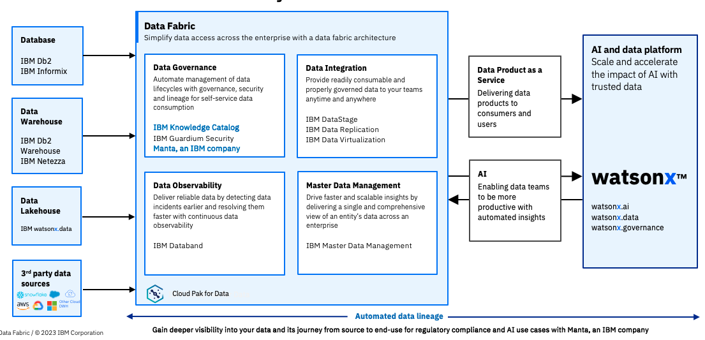

<AnchorLinks small>
<AnchorLink>What is Manta Data Lineage and what does it do?</AnchorLink>
<AnchorLink>What are the pain points that Manta Data Lineage addresses?</AnchorLink>
<AnchorLink>What do CSM driven deployments look like?</AnchorLink>
<AnchorLink>What to do for Manta Stand Alone deployments (OOTB)?</AnchorLink>
<AnchorLink>The steps to deploy and who is responsible for what, when?</AnchorLink>
<AnchorLink>How do I expand and grow Manta Data Lineage usage?</AnchorLink>
<AnchorLink>There isn't a current use case, where do I start?</AnchorLink>
</AnchorLinks>

<Row>
<Column colMd={7} colLg={7} noGutterMdLeft>

## What is Manta Data Lineage and what does it do?  
IBM acquired Manta in October 2023 as it provides world-class data lineage software to complement IBM's data and AI governance capabilities and help business deliver products that are built on principles of trust and transparency. Manta helps give businesses visibility into their data environments by delivering a comprehensive map of data flows, sources, transformations and dependencies. Manta’s data lineage capabilities help increase transparency within watsonx so businesses can determine whether the right data was used for their AI models and systems, where it originated, how it has evolved and any discrepancies in data flows. By providing an audit trail, Manta can help businesses discover and anonymize sensitive data to lower risk of exposure and regulatory violations.

There are two Manta Data Lineage offerings:  
-- Manta Automated Data Lineage on Cloud Pak for Data  
-- IBM Automated Data Lineage (standalone offering that doesn't require OpenShift or Cloud Pak for Data)  

More information on the offerings and differences can be found in the <a href='https://ibm.seismic.com/Link/Content/DCp74GJV8TmqPGTPqdPb4pHTFVqP' target='_blank' rel='noreferrer noopener'>FAQ</a>

The diagram below shows where Manta fits in to the Data Governance capability of the overall Data Fabric architecture alongside IBM Knowledge Catalog

## What are the pain points that Manta Data Lineage addresses?

**Pain Point: Decreasing level of trust in reports and AI** Analysts cannot fully explain how calculations were made, the origins of the underlying data, and associated data quality or data privacy attributes. 
**Pain Point: Growing number of data incidents** Data engineers have a limited ability to assess the end-to-end impacts of to-be implemented changes 
**Pain Point: Regulatory compliance audits** With the growing number of regulations and policies, there have been cases where one data incident caused damage to a company totaling hundreds of millions of dollars (fees, reputational damage, etc.)  
**Pain Point: Slow delivery of new insights** 40% of data engineering resources are spent on impact analysis due to lack of understanding of the data environment  
**Pain Point: Architecture migrations** Renovating systems that have been developed, adjusted, enhanced, and changed over decades is a challenge. These systems operate with multiple sources and were built with skills from many contributors.  

More details are available in the <a href='https://ibm.seismic.com/Link/Content/DC8hVc9V4CQbQ87QcfWhCg4RRhmd' target='_blank' rel='noreferrer noopener'>Client Presentation</a> and <a href='https://ibm.seismic.com/Link/Content/DCp74GJV8TmqPGTPqdPb4pHTFVqP' target='_blank' rel='noreferrer noopener'>FAQ</a>

## The steps to deploy and who is responsible for what, when?

Manta Data Lineage follows the traditional model of:   
1: **Identifying a pain point, sponsor and use case** 
The IBM team of Sales, Tech Sales and potentially CSM can use the list of pain points above to identify use cases and sponsors  
2: **Demonstrating how a given pain point can be addressed (demo)** 
The <a href='https://ibm.seismic.com/Link/Content/DCmmhWgV8CXhf8qHBDC88RHDjqqB#/?anchorId=5a25709e-41cc-40c6-bd23-ef0e27eca9bf' target='_blank' rel='noreferrer noopener'>demonstrations</a> in Seismic can be used to help show the customer how Manta Data Lineage can be used to address the problem areas  
3: **Proving value (proof of experience (PoX))** 
Tech Sales, Client Engineering and CSM can work together to connect Manta Data Lineage to the customers' systems and prove the capabilities resolve the pain points.  
4: **Implementation project** 
Technology Expert Labs, Business Partners and IBM Consulting can take ownership of an implementation project and guide the customer through the implementation project. 

## What do CSM driven deployments look like?

A typical IBM Manta Data Lineage deployment involves the utilization of scripts. These Scripts are unique code elements defined by the Product implementation, specific to each technology. The deployment includes defining various elements such as Script, MANTA Instance, Source Environment, Source Environment Set, MANTA Instance Set, Unique Scripts, Dataflow graph hash, User Controlled Metadata, Instance Script Count, Instance Set Script Count, and (Concurrent) Revision. 

Furthermore, a typical deployment involves understanding the basics of Data Mesh vs. Data Fabric and implementing data lineage to ensure efficient data management processes. Data lineage plays a crucial role in automating change management, understanding data dependencies, ensuring compliance with regulations, and facilitating data governance within both centralized Data Fabric and decentralized Data Mesh architectures.

In summary, a typical IBM Manta Data Lineage deployment involves the utilization of Scripts specific to each technology, recognizing different models like  implementing data lineage for efficient data management processes within both centralized and decentralized architectures like Data Fabric and Data Mesh.

## What to do for Manta Stand Alone deployments (OOTB)?

This is only applicable to Out-Of-The-Box (OOTB) Manta scanners and integrations. Any customer work needs to go through Expert Labs/Professional Services

Most deals are customers that have either completed a POC or a custom demo.

Towards the end of a successful POC (or a custom demo), when a prospect shows intent to move forward as a customer, the Manta Account Executive (AE) will bring in a member of the Customer Success (CSM) Team to start the implementation planning process.

The CSM team member will work with the AE and their assigned Solutions Architect (SA) to review and complete as much of the Environmental Assessment as possible.

The AE will provide the CSM with the POC scanners and any other scanners that will be a part of the initial implementation. The CSM will then use that to build out the Kickoff Deck and the Project Plan.

The next call should be an introduction call with the CSM included to review the Environmental Assessment, confirm the answers are correct and ensure its completion. They will also review the Kickoff Deck which will outline the implementation process and set appropriate expectations. Once both of those documents are completed, the implementation plan can be reviewed at a high level, discuss the phases and approximate effort required.

[Sample MANTA Environmental Assessment](https://ibm.box.com/s/3n3he66ya1vx2ncl68632pom236p91bw)

[Sample Kickoff Deck Here](https://ibm.box.com/s/p5q4p5soknhcob9twalnuu92cnuf0y66)

[Sample Project Plan](https://ibm.box.com/s/p133mnm8kasf8ielguef3cjxdd6xz14d)

Post meeting, once the project plan has been agreed upon with the customer, the CSM will finalize the Environment Planning document and remove scanners/integrations that are not part of this project. This is important as it includes all necessary prerequisites for a successful implementation. The prerequisites must be met prior to the start of the implementation.

[Sample MANTA Environment Planning](https://ibm.box.com/s/hh8auh2urorg98rf19qc5t83pu06lolb)

## How do I expand and grow Manta Data Lineage usage?

Use Case and Sponsors will ensure a successful first project deployment. From there, the positioning of additional services driven by new use cases will validate the need for additional compute or CP4D services. 
Data Governance use cases can lead to Data Quality & Discovery and vice-versa. Data Discovery use cases lead to Data Consumption use cases.

## There isn't a current use case, where do I start?
As a CSM drive to at least gain approval from the customer to run a discovery workshop to identfy and prioritize use cases and potential solution designs.  
Do this with the participation of IT and LOB in the room or MURAL session at the same time.  
If you need assistance running a workshop reach out the Practice Leaders: Campbell Robertson for assistance.  
You can also ask to have Client Engineering and/or Technology Expert Labs (Paid Engagement)

</Column>

<Column colMd={5} colLg={5} noGutterMdLeft>

 

<Aside>

**Customer Success Practice Leader:** Campbell Robertson @cir 
**CSM Slack Channel:** <a href='https://ibm-cloud.slack.com/archives/C01L3NASBUJ' target='_blank' rel='noreferrer noopener'>csm-data-ai</a> 
**Learn:** <a href='https://ibm.seismic.com/Link/Content/DCmmhWgV8CXhf8qHBDC88RHDjqqB#/?anchorId=6c196424-7f23-45ca-b56b-56da6ad72db6' target='_blank' rel='noreferrer noopener'>Manta Data Lineage Introduction</a>  
**Demo:** <a href='https://ibm.seismic.com/Link/Content/DCmmhWgV8CXhf8qHBDC88RHDjqqB#/?anchorId=5a25709e-41cc-40c6-bd23-ef0e27eca9bf' target='_blank' rel='noreferrer noopener'>Functionality Demonstrations</a>  
**Roadmap:** <a href='IBM Manta Data Lineage Roadmap' target='_blank' rel='noreferrer noopener'>Seismic</a> 
**Seismic:** <a href='https://ibm.seismic.com/Link/Content/DCmmhWgV8CXhf8qHBDC88RHDjqqB' target='_blank' rel='noreferrer noopener'>Sales Kit</a> with Presentations and Pre-sales assets 
**Tech Zone:** <a href='https://techzone.ibm.com/collection/629016db73586a001f02615d' target='_blank' rel='noreferrer noopener'>Assets</a> with Demo environments and enablement 

</Aside>

<Aside>

**Build your skills** 
Use the tutorials <a href='https://ibm.seismic.com/Link/Content/DCRJGmM8M2mFMGf2pXVjgCq449Wd' target='_blank' rel='noreferrer noopener'>in Seismic</a> 

</Aside>

<Aside>

**Who can help me?** 
**Client Engineering** and **Tech Sales** also have the skills required to perform Proof of Value engagements. 
**Technology Expert Labs** can deliver solution design, deploy production environments, deliver full stack observability, create outcome SOW and account plans (for a fee) 
**Technology Expert Labs Seller locator: [Find IBM Sellers](https://ibm.biz/FindIBMSellers)** 
**Technology Expert Labs Contacts: [TEL-SW Services Sales](http://ibm.biz/ExpertLabs-WWContacts)** 
**Technology Expert Labs Assistance:[www.ibm.biz/grow-my-deal](https://ibm.biz/grow-my-deal)** 
**Technology Expert Labs [Solution Architects](https://w3.ibm.com/w3publisher/americasexpertlabs/our-team/solution-architect-team)** 
**Slack: [#ask-expert-labs](https://ibm.biz/ask-expert-labs) (IBMers only)** 
**Technology Expert Labs Data & AI Offerings Detail:[Link](https://ibm.seismic.com/Link/Content/DCRjRRmhcDWJc8mMgGh2CHCPV7Gj)** 

</Aside>

<Aside>

**Customer facing case studies?** 
Coming soon
</Aside>

<Aside>

**Workshops** 
Coming soon
</Aside>

<Aside>

**Technology Expert Labs offerings**
<a href='https://ibm.seismic.com/Link/Content/DCRjRRmhcDWJc8mMgGh2CHCPV7Gj' target='_blank' rel='noreferrer noopener'>All offerings</a> 
</Aside>

</Column>

</Row>

