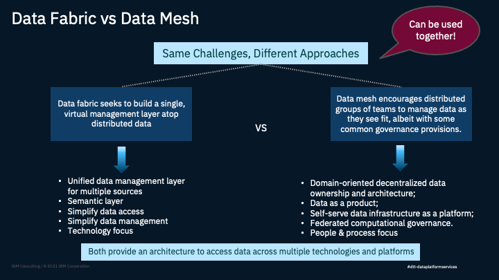

import {Link} from 'gatsby'

<AnchorLinks small>
<AnchorLink>What is Data Fabric and what does it do?</AnchorLink>
<AnchorLink>What are the pain points that Data Fabric addresses?</AnchorLink>
<AnchorLink>What are the Data Challenges a Data Fabric strategy addresses?</AnchorLink>
<AnchorLink>What do CSM driven deployments look like?</AnchorLink>
<AnchorLink>What is the difference between Data Fabric and Data Mesh?</AnchorLink>
<AnchorLink>There isn't a current use case, where do I start?</AnchorLink>
<AnchorLink>What does a Data Fabric Strategy Deployment look like?</AnchorLink>
</AnchorLinks>

<Row>
<Column colMd={7} colLg={7} noGutterMdLeft>

## What is Data Fabric and what does it do? 

73% of data created in an organization today goes unused. This is due the deployment of enterprise class use cases (read complex).  Use cases can span regulatory compliance, operational analytics, business intelligence reports and dashboards, data science, etc.  These use cases are usually deployed in a hybrid landscape. We have seen innovation in data management evolve over the years; moving from data silos to data warehouse, data virtualization, data lake and now data fabric. 

* Helps reduce the number of data copies by virtually connecting data end points and simplifying access pattern over any data. 
* Provides and activates global automatic policy enforcement for increased data protection and quality. 
* Utilizes augmentation of integration governance, and active metadata to enable a dynamic, intelligent and automated data orchestration. 
* Provides automatic enrichment to contextualize data with semantics and knowledge 

Analyst Definitions of Data Fabric 

**Gartner:**  A data fabric is an emerging data management design concept for attaining flexible, 
reusable and augmented data integration pipelines, services and semantics, in support of various operational and analytics use cases 
delivered across multiple deployment and orchestration platforms. Data fabrics support a combination of different data integration styles  
and utilize active metadata, knowledge graphs, semantics and ML to augment data integration design and delivery.

**Forrester:**  Dynamically orchestrating disparate data sources intelligently and securely in a self-service manner and leveraging various  
data platforms to deliver integrated and trusted data to support various applications, analytics and use cases.

**IBM's definition of Data Fabric (IBM Consulting Services)** 
A Data Fabric is an architecture, set of services and a platform that standardizes and integrates data across the enterprise regardless
of data location (On-Prem, Cloud, Multi Cloud, Hybrid Cloud). A Data Fabric must have these primary capabilities: 

* Manage: A Data Fabric provides a singular and integrated means of management across the data ecosystem. It must support data at rest,
data in motion, integration of data, as well as providing the ability to virtualize the enterprise. Must bring AI/ML to your data.

* Govern: A Data Fabric must map all enterprise assets to a single canonical model representing a common enterprise vernacular. In addition,
it must allow for data quality, stewardship, metadata, and MDM/RDM capabilities.

* Secure: Classifications of information should serve as the single means of defining security policy and entitlements. All data must be secure
from outside attacks as well as provide the ability to identify insider threat.

**Key Aspects of Data Fabric to remember!** 

To Intelligently automate 
Leave Data where it lives 
Bring AI to your data 

## What are the Data Challenges a Data Fabric strategy addresses?  

1. Managing data in a heterogeneous data environment is difficult
2. Data Proliferation and Complexity
	1. Increasing data domains (e.g. Product, Supply Chain, Marketing)
	2. Increasing number of data consumers
	3. Increasing number of data sources
3. Lack of Agility
	1. Inability to meet data demands in a timely basis
	2. The analytics tools provided aren't designed for product teams
	3. People don't have access to the data they need
	4. Users have access to data but lack the skills to find answers to questions
4. Lack of Collaboration
	1. Data Developers siloed from the domains where the data originates or is used for decision making
	2. Data Experts are too busy to help users
5. Lack of trust in Data
	1. Poor Data Quality
	2. Multiple copies of varying instances of the same data
	3. Data is not trusted by users

## What do CSM driven Data Fabric deployment look like? 
Data Fabric Deployment examples such as: 

**Smart Integration (ICS Accelerator)** 
The Data Fabric Smart Integration Services provide the real-time and batch data acquisition and transport pipelines between the internal and external data source providers and the Digital Insights Data Platform Layer. 
The Data Provisioning Ingestion components are Apache-based micro-services built in Python and Java (using Kafka for real-time), which have the capability to acquire, transport, validate, and land data in any layer of the platform (e.g. raw landing, conformed, data access.) 
**Batch Ingestion Services Component** 
These ingestion services provide the ability to: 
1.Manage multiple workloads such as real-time and batch, perform both continuous data delivery, and creation of new data sets. 
2.Accept all data formats like structured, unstructured and semi-structured including files, tables, documents (*.pdf), images, audio, video, web logs, etc. 
3.Acquire/ingest data from various/multiple sources coming with different workloads, different schedules, different SLAs, etc. 
Handle mixed workloads such as: 
Low latency, high frequency, small data in a streaming, micro-batch (Intra-day) or near real time frequency 
**Real-Time Ingestion Services Component.** 
The Real-time ingestion service is a spark job that consumes data from Apache Kafka in micro-batches. It can perform data transformations at scale, moving millions of messages per second.  
Kafka acts at the ingestion buffer and can also be used to replay event streams when re-processing is required. The events in Kafka are typically in JSON but can be in any format.  

The Spark Ingestion Service provides the following features: 

1.Support for storing data to Hive, Relational Databases and Apache Cassandra database. 
2.Configurable mapping of JSON messages from the source to the destination. No coding required. 
3.Extensible interface to add a new storage source or destination. Minimal coding required. 
4.Ability to read messages from non-Kafka sources is also supported: i.e. s3 object storage or relational databases. 
5.Provide a scalable Kafka Rest API, implemented as a spring boot microservice. 
6.Can run on either Hadoop (as a Yarn job) or on Kubernetes (Spark 2.3 only). 
7.Configurable micro-batching window. 
8.Monitoring dashboard using Grafana. 
9.Supports Spark 2+. 

**Curation Services**

Foundational Curation Component 
The baseline set of Curation micro services provide a set of components to manage, transform, and publish data. This includes the following capabilities: 
* Curate raw data from multiple formats into IBM's Industry Models (e.g. Banking Data Warehouse Model and Retail Data Model). 
* Transform data into user specific uses cases such as: 
	* Dimensional formats for reporting and analytics
	* Highly available structures for real-time customer journeys
	* Publishing outbound digital events
	* Publishing data into Data Science Sandboxes
	* Streaming data through Insight processes for down-stream decisioning
* Provide future state capabilities such as out-bound event publishing to digital channels.

## What is the difference between Data Fabric and Data Mesh?

**What is a Data Mesh?**

The Data Mesh is an architectural paradigm for developing and managing data data platforms that meet the target architecture requirements.
* Global Governance & Open Standards: Data Modelling, architecture, and standards are uniformly defined and enforced across the organization to guarantee the success of developing Domain Data Products
* Decentralized Data Pipelines: Data storage, access control and other tooling is provided as domain agnostic infrastructure serviced by infrastructure engineers.  Data pipelines are distributed across domain boundaries, and adhere to global standards and interoperability requirements
* Domain-Driven Data Products: Data products are created by cross functional teams, focused on a domain, with clear ownership and accountabilities for data quality standards
* Cross-Functional Independant Teams with Clear Ownership: Data is provided as a set of product that is discoverable, addressable, self-describing and adhering to quality standards and KPIs

**When not to use a Data Mesh?**

* Few data domains or data sources or data team members (i.e. to small and midsize companies)
* Scaling data delivery, meeting data demands are not issues
* Centralized decision-making culture
* Lack of budget for enabling domain-level self-serve data infrastructure
* Centralization of data (e.g., data warehouse, data lake) is not a bottleneck in meeting data delivery requirements
* Lack of skills and resources at the domain level to define and build data products

## There isn't a current use case, where do I start?

Data Fabric is focused on ensuring that a virtual enterprise data strategy is implemented.  If no current use cases are being discussed then work with Client Engineering, Technology Expert Labs Solution Architects, Data & AI  CSM Community Practice Leaders to assist in identifying use cases at either driven by **industry needs** (Financial Services, CP/Retail, Industrial, Government etc), **business use cases** (Enterprise, Finance, Sales and Marketing, Operations, Production, etc or by **Functional Use Cases** (Transactional, Analytics, Operational - (Intelligent Workflows), Digital))

## What does a Data Fabric Strategy Deployment look like?

1. Review Business Objectives in context of the Virtual Enterprise

	* Confirm Industry Scope
	* Determine LOB (e.g. Finance, Sales and Marketing) or Enterprise
	* Review Business Objectives

2. Determine Functional Objectives in context of the Virtual Enterprise

	* Define business intelligence use cases
	* Define data science current and future use cases
	* Define current and future digital use cases
	* Define operational current and future use cases
	* Define existing and planned Data Organizational Model

3. Determine Business Value Case

	* Develop a Size of the Prize View by Use Case
	* Perform Top-Down view based on business value and feasibility
	*Perform Bottoms-Up Review

4. Envision Future-State Data Platform

	* Review existing architectural patterns and eco-system
	* Review existing technology stack
	* Leverage IBM Data Platform Reference Architecture as a baseline Blueprint
	* Perform Gap Analysis of existing to Baseline Blueprint
	* Harden and gain concurrence on Client Target State Blueprint.

5. Envision Future State Target Operating Model (Leveraging DCAM)

	* Review Target Development and Support Organizational Requirements
	* Review and Gap Data Management Job Roles
	* Review and Gap Information Governance Process and Roles
	* Review and Recommend Development and Data Ops Methods
	* Develop Change Management Recommendations

6. Develop Garage-Based, Implementation Road Map

	* Partition the Target Blueprint into Opportunity areas
	* Prioritize and Sequence each opportunity area into a Garage Sprint
	* Sequence Garages based on business outcome: both quick hits and long term
	* Develop expectations and timing for all Program Garage iterations
	* Incorporate the Garage project plans into a Program Plan 

## IBM Fusion HCI Storage Considerations

IBM Fusion HCI is a hyper-converged infrastructure (HCI) solution that integrates the Red Hat OpenShift container platform with a hybrid cloud data platform. It offers a turn-key enterprise-grade solution for deploying Red Hat OpenShift and simplifies the management of hardware and software. This solution is designed to be highly scalable, with features like erasure coding for data resilience, local and remote backup and recovery, and a global data platform for storage resources.

Key technical aspects of IBM Spectrum Fusion HCI include:
- Integrated HCI appliance for containers
- Scalable containerized file system
- Data resilience for backup and recovery
- Simple installation and maintenance
- Global data platform for storage resources
- Integration with IBM Cloud Satellite® and Red Hat ACM
- Support for AI applications with optional NVIDIA A100 GPUs
- Scalability from 6 to 20 servers.

IBM Spectrum Fusion HCI eliminates the need for excess VM layers typical in container environments, providing an optimized solution for running cloud-native applications and containers. It offers transparent access to data, simplifying both development and operational tasks. The solution is designed to be simple to manage, integrate with current and hybrid cloud environments, build and run container applications, deploy Red Hat OpenShift, and manage storage services efficiently.

In summary, IBM Fusion HCI (IBM Spectrum Fusion HCI) is a comprehensive hyper-converged infrastructure solution that combines the capabilities of Red Hat OpenShift with a hybrid cloud data platform to provide a scalable, resilient, and easy-to-manage environment for containerized applications and AI workloads.

For further information to to the Storage section of the [Fusion HCI](/common/storage/fusionHCI/) playbook 
</Column>

<Column colMd={5} colLg={5} noGutterMdLeft>

 

<Aside>

**Customer Success Practice Leaders:** Dave Mulley (@Dave Mulley), Campbell Robertson (@Campbell) 

**Slack Channel:** <a href='https://ibm-analytics.slack.com/archives/C01JXGB6L56' target='_blank' rel='noreferrer noopener'>data-fabric-general</a> 
<a href='https://ibm-technology-sales.slack.com/archives/C03E243RAD6' target='_blank' rel='noreferrer noopener'>data-fabric-hybrid-growth</a> 

Data Fabric Use Case Kits: <a href='https://ibm.seismic.com/Link/Content/DCgbb6TCPhCTVGcQW29V2XMDVWc3' target='_blank' rel='noreferrer noopener'>Data Governance</a> 
<a href='https://ibm.seismic.com/Link/Content/DCDPPMFbbcqcgGFCTD8G3VdPqRhP' target='_blank' rel='noreferrer noopener'>Data Integration</a> <a href='https://ibm.seismic.com/Link/Content/DCCDCB2DPpcPF8WVRdCMF7TbqRXd' target='_blank' rel='noreferrer noopener'>Data Science and MLOps</a> 
<a href='https://ibm.seismic.com/Link/Content/DCWFTHpdXGc768hB2GWdh4RBMXBd' target='_blank' rel='noreferrer noopener'>AI Governance</a> 

**Learn:** <a href='https://yourlearning.ibm.com/activity/PLAN-28F1E54D199C' target='_blank' rel='noreferrer noopener'>Technology Expert Labs Data Fabric Intermediate 101</a> + <a href='https://yourlearning.ibm.com/activity/PLAN-0622E1526D1D' target='_blank' rel='noreferrer noopener'>Competitive Insights Level 1</a> and <a href='https://yourlearning.ibm.com/activity/PLAN-D57D0793CE82' target='_blank' rel='noreferrer noopener'>Data Fabric Accelerators</a> materials 
<a href='https://yourlearning.ibm.com/activity/PLAN-28F1E54D199C' target='_blank' rel='noreferrer noopener'>Technology Expert Labs Data Fabric Intermediate 101</a> + <a href='https://yourlearning.ibm.com/activity/PLAN-0622E1526D1D' target='_blank' rel='noreferrer noopener'>Competitive Insights Level 1</a> and <a href='https://yourlearning.ibm.com/activity/PLAN-D57D0793CE82' target='_blank' rel='noreferrer noopener'>Data Fabric Accelerators</a> materials 

**Seismic:** <a href='https://ibm.seismic.com/Link/Content/DC9PX43WRjp64GHGV8JB9G3P4VJd' target='_blank' rel='noreferrer noopener'>Sales Kit</a> with Presentations and Pre-sales assets 

**Tech Zone:** <a href='https://techzone.ibm.com/collection/platinum-demos-observability' target='_blank' rel='noreferrer noopener'>Activation Kit</a> with Demo environments and enablement 

</Aside>

<Aside>

**Who can help me?**

**Client Engineering** and **Tech Sales** have the skills required to perform Experience (PoX) engagements. <a href='https://ibm.seismic.com/Link/Content/DCBQFPGV6TBTqGFC9JWWpfVgHBc8' target='_blank' rel='noreferrer noopener'>CE Home Page</a> 

**Technology Expert Labs** can deliver solution design, deploy production environments, deliver full stack observability, create outcome SOW and account plans (for a fee) 
- **Technology Expert Labs Seller locator: [Find IBM Sellers](https://ibm.biz/FindIBMSellers)**
- **Technology Expert Labs Contacts: [TEL-SW Services Sales](http://ibm.biz/ExpertLabs-WWContacts)**
- **Technology Expert Labs Assistance:[www.ibm.biz/grow-my-deal](https://ibm.biz/grow-my-deal)**
- **Technology Expert Labs [Solution Architects](https://w3.ibm.com/w3publisher/americasexpertlabs/our-team/solution-architect-team)**
- **Slack: [#ask-expert-labs](https://ibm.biz/ask-expert-labs) (IBMers only)**
- **Technology Expert Labs Data & AI Offerings:[Link]( https://ibm.seismic.com/Link/Content/DCJDcj942qMcD8HCXVj2RFXbXXmG)**
- **Data & AI Offerings Detail:[Link](https://ibm.seismic.com/Link/Content/DCRjRRmhcDWJc8mMgGh2CHCPV7Gj)**

</Aside>

<Aside>

**Customer facing case studies?**

Use Case Stories
<a href='https://ibm.ent.box.com/s/z6rvnmtiko38tyfz4x69xt270py5gb5q' target='_blank' rel='noreferrer noopener'>Link</a>

Technology Expert Labs: Success Stories
<a href='https://ibm.seismic.com/Link/Content/DCXf8MfRC66PH87Qd8G4P8DfXqJd' target='_blank' rel='noreferrer noopener'>Link</a>

</Aside>

<Aside>

**Workshops**

There is an <a href='https://techzone.ibm.com/collection/MLOpsWorkshop' target='_blank' rel='noreferrer noopener'>ML OPs Workshop</a> (free) that has been set up as a self paced exercise to run through some of the key aspects of Data Fabric.

</Aside>

</Column>

</Row>

<Row>

<Column>

</Column>
</Row>
