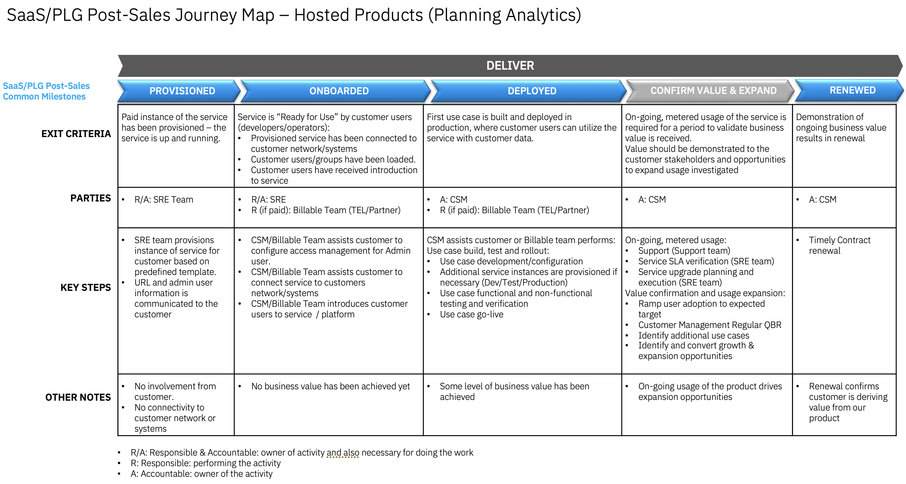

import {Link} from 'gatsby'

<Row>
<Column>

<InlineNotification kind="warning">

**Note:**

<ul>
<li>All watsonx <strong>CORE SaaS</strong> deployment threshold automation is under evaluation through Q2; until the end of 2Q.
<ul>
<li>CSMs mark customers deployed in a Growth Plan with manager sign-off.</li>
<li>WW reviews and validates ratings and the use case</li>
</ul>

</li>
<li><strong>NON-CORE</strong> watsonx <strong>SaaS</strong> products the automated thresholds remain in place. If you are a CSM or market leader who believes your NON-CORE product is deployed but is not reaching the threshold you can ask for an override through email to Robin as described below. A Growth Plan with manager sign-off must be in place before sending an override request.</li>

<li>In each case (CORE or NON-CORE override) CSM or market leader should send a note (with a detailed explanation + link to the success/growth plan record) to Robin (rohernan@us.ibm.com) to evaluate and decide if to approve it in the system.</li>

<li>Only 2024 new SaaS deployments with a success plan will be approved.</li>

<li>Each watsonx product deployed will be counted. i.e. A RAG use case with watsonx Assistant and watsonx.ai count as two deployments.</li>
</ul>

</InlineNotification>

## Contacts

| WW contact | Name | WW contact | Name |
| --- | --- | --- | --- |
| **Customer Success Practice Leaders:** | Campbell Robertson | **Digital Customer Success & PLG:** | Felipe Satantri |
| **Technology Expert Labs Delivery:** | None | **Technology Expert Labs Solution Engineering:** | Jo Ramos |
| **SRE:** | None | | |

</Column>
</Row>

<Row> 
<Column colMd={9} colLg={9}>

## Overview
As a CSM, your focus is to guide and nurture your customers who have a Planning Analytics SaaS entitlement.  Your job is to guide the customer with provisioning through to onboarding, help with their first use case, and continue to expand their use cases.

You can learn more about Planning Analytics on the <a href='https://ibm.seismic.com/Link/Content/DCMcT7WW92B3jG9PmBfmHPhqBRQP' target='_blank' rel='noreferrer noopener'>Seismic page</a>.

</Column>
</Row>

<Row>
<Column>

| FAQ | Answer |
| --- | --- |
| What is the relationship name in Gainsight? | Planning Analytics SaaS |
| Which Clouds does this product run on? | AWS (managed from IBM Cloud) |
| How is SaaS usage calculated? | License Seat Usage |
| Who can help my customer with billing/invoicing questions? | TBD |
| Where is the documentation? | <a href='https://www.ibm.com/docs/en/planning-analytics/2.0.0?topic=cloud-getting-started-planning-analytics' target='_blank' rel='noreferrer noopener'>Planning Analytics Documentation</a> |
| Are the SaaS capabilities different from the on-prem offering? | No |
<!--
| Is Planning Analytics SaaS consumable or ratable revenue? | Ratable.  |
| Who triggers deployment? | Growth Plan & Manager Assessed until Instrumented  |
-->

</Column>
</Row>

<Row>
<Column colMd={9} colLg={9}>

### CSM Scorecard Milestones based on usage

SaaS milestones for the CSM Scorecard are based on usage. To progress from Planning to Deploying to Deployed, see <Link to='/common/saas-growth/#data-and-ai-saas-milestones-based-on-usage'>Data and AI milestones based on usage</Link>.

</Column>
</Row>

<Row>
<Column>

<Accordion>
<AccordionItem title="SaaS adoption journey insights">
SaaS has an additional level of insights that are used to track the adoption journey. These provide an additional level of detail specifically for SaaS adoption. They are shown in the table below:

| 
Insight
 | 
Description
 |
| --- | --- | --- | --- |
| Paid Provisioned | Customer has purchased the product |
| Paid Onboarding Progress | User has added a user |
| Paid Onboarded | Completion of the Onboarding Checklist |
| Paid Deployed | First use case or feature deployed in production environment |
</AccordionItem>
</Accordion>

### Planning Analytics Product Feature Adoption and Value Realized Indicators
Planning Analytics Product Feature Adoption and Value Realized Indicators are instrumented in the product to show the capabilities and features that the customer is using. This information can be used to determine the level of adoption that has taken place and ensure that the customer is receiving full business value from the product. See below for novice, intermediate and advanced level indicators along with an asset listing the value proposition, expected benefits, considerations for implementation and metrics of success.
<Accordion>
<AccordionItem title="Novice level indicators">

| Product Feature | Description | Asset |
| --- | --- | --- |
| Will be finalized as part of PLG rollout | TBD | TBD |

</AccordionItem>

<AccordionItem title="Intermediate level indicators">

| Product Feature | Description | Asset |
| --- | --- | --- |
| Will be finalized as part of PLG rollout | TBD | TBD |

</AccordionItem>

<AccordionItem title="Advance level indicators">

| Product Feature | Description | Asset |
| --- | --- | --- |
| Will be finalized as part of PLG rollout | TBD | TBD |

</AccordionItem>

</Accordion>

</Column>
</Row>

<Row>
<Column colMd={9} colLg={9}>

## Post-sales journey  
As a CSM with a customer who has a Planning Analytics SaaS entitlement, it is your responsibility to help the customer adopt the product, bring use cases to production and renew their subscriptions.
The diagram shows the Planning Analytics SaaS post-sales journey at a high level. Each section is broken down in detail with links to assets below.

</Column>
</Row>

<Row>
<Column>

### Provisioned

| **Led by** | **Outcome** | **Assets & Activities** |
| --- | --- | --- | 
| SRE |  Planning Analytics SaaS instance provisioned and customer has access. | The Planning Analytics SaaS instance is provisioned and managed by the IBM SRE team. The client will be required to create an <a href='https://www.ibm.com/account/reg/us-en/signup?formid=urx-19776' target='_blank' rel='noreferrer noopener'>IBMid account</a>. |

### Onboarded

| **Led by** | **Outcome** | **Assets & Activities** |
| --- | --- | --- | 
| IBM SRE and CSM | Customer has validated access to their Planning Analytics SaaS instance and has added users. | After the Planning Analytics SaaS instance has been provisioned, a customer can access their instance URL from the welcome email.    **Getting started**   Use the <a href="https://www.ibm.com/docs/en/planning-analytics/2.0.0?topic=cloud-planning-analytics-account-system-information" target='_blank' rel='noreferrer noopener'>product documentation</a> and <a href="https://community.ibm.com/community/user/businessanalytics/planning/learning" target='_blank' rel='noreferrer noopener'>Getting Started Guide</a> to add users to the environment.    **Nurture opportunities**  After the Product Led Growth interface in Gainsight is configured later in 2024, you will be able to track the activities that the customer is performing in Planning Analytics. This enables you to determine whether the customer needs additional assistance through their journey. For instance, if you see that no *users* have been configured or have accessed the environment, then your customer has not completed the basic onboarding steps and may require your assistance. |

### Deployed

| **Led by** | **Outcome** | **Assets & Activities** |
| --- | --- | --- | 
| CSM (utilizing Billable Services if the customer has paid) | The client has created a solution and has moved to operate the solution with consistent usage. | **Technology Expert Labs Offerings:**   <a href="https://ibm.seismic.com/Link/Content/DCdJJgXcXcjQMGFF6g8X46hhW4X3" target='_blank' rel='noreferrer noopener'>**Custom Service in Seismic:**</a> - Custom SOW    **Create/enhance the solution**   CSMs should guide the customer through the configuration of Planning Analytics using the <a href="https://www.ibm.com/docs/en/planning-analytics/2.0.0?topic=cloud-planning-analytics-account-system-information" target='_blank' rel='noreferrer noopener'>product documentation</a>, <a href="https://community.ibm.com/community/user/businessanalytics/planning/learning" target='_blank' rel='noreferrer noopener'>Getting Started Guide</a> and <a href="https://yourlearning.ibm.com/activity/PLAN-39A504E027BE" target='_blank' rel='noreferrer noopener'>Level 3</a> enablement.   **Operate the solution**   CSMs should guide the customer through the operationalization of Planning Analytics using the <a href="https://www.ibm.com/docs/en/planning-analytics/2.0.0?topic=cloud-planning-analytics-account-system-information" target='_blank' rel='noreferrer noopener'>product documentation</a>, <a href="https://community.ibm.com/community/user/businessanalytics/planning/learning" target='_blank' rel='noreferrer noopener'>Getting Started Guide</a> and <a href="https://yourlearning.ibm.com/activity/PLAN-39A504E027BE" target='_blank' rel='noreferrer noopener'>Level 3</a> enablement.    **Nurture opportunities**  After the Product Led Growth interface in Gainsight is configured later in 2024, you will be able to track the activities that the customer is performing in Planning Analytics. This enables you to determine whether the customer needs additional assistance through their journey. For instance, if you see that no *buckets or engines* have been configured or no *queries* have been executed, then your customer has not completed the basic onboarding steps and may require your assistance. |

### Confirm Value & Expand

| **Led by** | **Outcome** | **Assets & Activities** |
| --- | --- | --- | 
| CSM | Customer has realized value and expanding usage to new business use cases | **Nuture relationship**  Set up a <Link to='https://pages.github.ibm.com/csm-playbook/playbook/onboard/executive-business-review/'>EBR (executive business review)</Link> with client sponsor and executives to align and review the adoption, value seen and confirm the customer's strategic goals have been met.    **Identify risk/opportunity**   After the Product Led Growth interface in Gainsight is configured later in 2024, you will be able to track the activities that the customer is performing in Planning Analytics. This enables you to determine whether the customer is continuing to use the product or whether usage is dropping.   **Expand solution**  A CSM should continue to drive usage of Technology Expert Labs services and look for opportunities to add more use cases using the <Link to='https://ibm.seismic.com/Link/Content/DCMcT7WW92B3jG9PmBfmHPhqBRQP'>Seismic page</Link> . |

### Renewed

| **Led by** | **Outcome** | **Assets & Activities** |
| --- | --- | --- | 
| CSM and/or Technical Sales | The client has confirmed that they are using the product and will continue to renew their entitlement. | N/A |

</Column>
</Row>