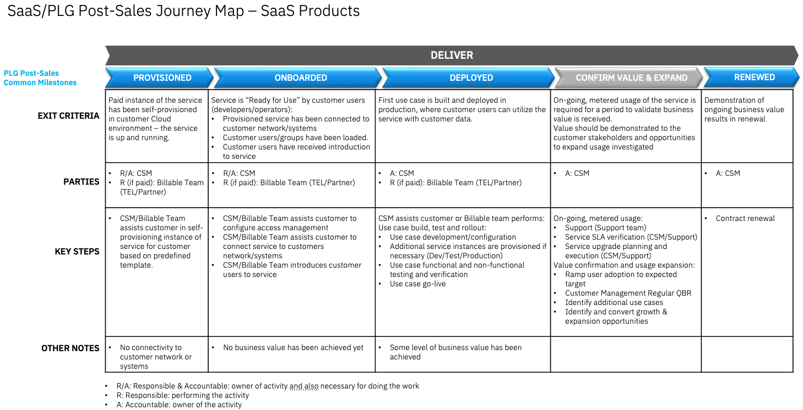

import {Link} from 'gatsby'

<Row>
<Column>

<InlineNotification kind="warning">

**Note:**

<ul>
<li>All watsonx <strong>PLATFORM SaaS</strong> deployment threshold automation is under evaluation.
<ul>
<li>CSMs mark customers deployed in a Growth Plan with manager sign-off.</li>
<li>Submit <a href='https://ibm.biz/watsonxdeploymentrequest' target='_blank' rel='noreferrer noopener'>the approval form</a> for WW reviews and validation. The status of approval will be communicated through email.</li>
</ul>

</li>
<li><strong>AI Assistants and APIs</strong>(NON-PLATFORM) watsonx <strong>SaaS</strong> products the automated thresholds remain in place. If you are a CSM or market leader who believes your NON-PLATFORM product is deployed but is not reaching the threshold you can ask for an override through approval process as described below. A Growth Plan with manager sign-off must be in place before sending an override request.
<ul>
<li>For override and additional deployment, CSM or market leader should submit <a href='https://ibm.biz/watsonxdeploymentrequest' target='_blank' rel='noreferrer noopener'>the approval form</a>. The status of approval will be communicated through email.</li>
</ul>  
</li>

<li>Only 2024 new SaaS deployments with a success plan will be approved.</li>

<li>Each watsonx product deployed will be counted. i.e. A RAG use case with watsonx Assistant and watsonx.ai count as two deployments.</li>
</ul>

</InlineNotification>

## Contacts

| WW contact | Name | 
| --- | --- | 
| **Customer Success Practice Leaders:** | Di Lang | 
| **Technology Expert Labs Delivery:** | Brian Bissell | 
| **Technology Expert Labs Solution Engineering:** | Charley Beller |

</Column>
</Row>

<Row>
<Column colMd={9} colLg={9}>

## Overview
As a CSM, your focus will be to guide and nurture your customers who have Watson APIs (Speech to Text, Text to Speech, Natural Language Understanding) entitlements.  You will guide the customer with provisioning through to onboarding, help with their first use case, and continue to expand their use cases.

Refer to the <a href='https://pages.github.ibm.com/csm-playbook/playbook/common/data-ai/csm-data-ai-watson-speech-to-text/' target='_blank' rel='noreferrer noopener'>Watson Language Services Playbook</a> for the product overview, the pain points it addresses, what a CSM driven deployment looks like, and how to expand and grow a client's Watson APIs (and Customer Care) usage.

</Column>
</Row>

<Row>
<Column>

| FAQ | Answer |
| --- | --- |
| What is the relationship name in Gainsight? | IBM Cloud |
| Which Clouds does this product run on? | IBM Cloud |
| How is SaaS usage calculated? | <a href='https://cloud.ibm.com/catalog/services/speech-to-text' target='_blank' rel='noreferrer noopener'>Watson STT Pricing</a>, <a href='https://cloud.ibm.com/catalog/services/text-to-speech' target='_blank' rel='noreferrer noopener'>Watson TTS Pricing</a>, <a href='https://cloud.ibm.com/docs/natural-language-understanding?topic=natural-language-understanding-pricing' target='_blank' rel='noreferrer noopener'>Watson NLU Pricing</a> |
| Who can help my customer with billing/invoicing questions? | TBD |
| Where is the documentation? | <a href='https://cloud.ibm.com/docs/speech-to-text' target='_blank' rel='noreferrer noopener'>Watson STT Documentation</a>, <a href='https://cloud.ibm.com/docs/text-to-speech' target='_blank' rel='noreferrer noopener'>Watson TTS Documentation</a>, <a href='https://cloud.ibm.com/docs/natural-language-understanding' target='_blank' rel='noreferrer noopener'>Watson NLU Documentation</a> |
| Are the SaaS capabilities different from the on-prem offering? | NLU SaaS only |
| Does Watson APIs SaaS count as OpenShift deployment? | No | 
| Is Watson APIs SaaS consumable or ratable revenue? | Consumable. The unit of consumption is ratings. |
| Who triggers deployment? | Automated based on Threshold |

</Column>
</Row>

<Row>
<Column colMd={9} colLg={9}>

### CSM Scorecard Milestones based on usage

SaaS milestones for the CSM Scorecard are based on usage. To progress from Planning to Deploying to Deployed, see <Link to='/common/saas-growth/#data-and-ai-saas-milestones-based-on-usage'>Data and AI milestones based on usage</Link>.

</Column>
</Row>

<Row>
<Column>

You can find more about how Watson APIs are priced in the <a href='https://cloud.ibm.com/catalog/services/speech-to-text' target='_blank' rel='noreferrer noopener'>Watson STT Pricing</a>, <a href='https://cloud.ibm.com/catalog/services/text-to-speech' target='_blank' rel='noreferrer noopener'>Watson TTS Pricing</a>, <a href='https://cloud.ibm.com/docs/natural-language-understanding?topic=natural-language-understanding-pricing' target='_blank' rel='noreferrer noopener'>Watson NLU Pricing</a>.

<Accordion>
<AccordionItem title="SaaS Adoption Journey Insights">
SaaS has an additional level of insights that are used to track the adoption journey. These provide an additional level of detail specifically for SaaS adoption.  For Watson APIs, they are shown in the table below

| 
Insight
 | 
Description
 |
| --- | --- | --- | --- |
| Paid Provisioned | Customer has purchased the product |
| Paid Onboarded | Completion of the Onboarding Checklist |
| Paid Deployed | First use case or feature deployed in production environment |
| Paid Upgraded | Moving to a different offering package |
| Paid Renewed | Customer has adopted and renewed |    
</AccordionItem>
</Accordion>

</Column>
</Row>

<Row>
<Column colMd={9} colLg={9}>

### Watson APIs Product Feature Adoption and Value Realized Indicators  
Watson APIs Product Feature Adoption and Value Realized Indicators are instrumented in the product to show the capabilities and features that the customer is using. This information can be used to determine the level of adoption that has taken place and ensure that the customer is receiving full business value from the product. See below for novice, intermediate and advanced level indicators along with an asset listing the value proposition, expected benefits, considerations for implementation and metrics of success.

</Column>
</Row>

<Row> 
<Column>

<Accordion>
<AccordionItem title="Novice level indicators">

| Product feature | Description | Asset |
| --- | --- | --- |
| TBD | TBD | TBD |
</AccordionItem>

<AccordionItem title="Intermediate level indicators">

| Product feature | Description | Asset |
| --- | --- | --- |
| TBD | TBD | TBD |

</AccordionItem>

<AccordionItem title="Advanced level indicators">

| Product feature | Description | Asset |
| --- | --- | --- |
| TBD | TBD | TBD |

</AccordionItem>
</Accordion>

</Column>

</Row>

<Row>
<Column colMd={9} colLg={9}>

## Post-sales journey  
As a CSM, your focus is to digitally welcome and nurture your customers who have Watson APIs entitlements. 

| CSM Coverage | Activities |
| --- | --- |
| CSM Architect | High touch nurture |
| Digital CSM | TBD |
| No CSM Coverage | Customer self-service |

The diagram shows the Watson APIs post-sales journey at a high level. Each section is broken down in detail with links to assets below.

</Column>
</Row>

<Row> 
<Column>

### Provisioned

| **Led by** | **Outcome** | **Assets & Activities** |
| --- | --- | --- |
| CSM (utilizing Billable Services if the customer has paid) |  Watson APIs SaaS instance provisioned and the customer has access. |  Before provisioning, the CSM helps the customer review Pricing plans, <a href='https://cloud.ibm.com/estimator' target='_blank' rel='noreferrer noopener'>Service plan cost</a>, and <a href='https://cloud.ibm.com/docs/account?topic=account-iamoverview' target='_blank' rel='noreferrer noopener'>How IBM Identity and Access Management works</a>.    **Technology Expert Labs Offerings**  &nbsp;&nbsp;&nbsp;&nbsp;**Assess Customer Care Diagnostics**: TEL team conducts an assessment of the client’s Customer Care solution to ensure they are optimizing the software to solve their business issues and realize the full value of their solution.  &nbsp;&nbsp;&nbsp;&nbsp;**Plan Customer Care Workshop**: Clients choose a focus area for the workshop based on their business need including, but not limited to actions, artificial intelligence, analytics, governance, and integrations.   **Customer doesn’t have IBM Cloud account**   - Getting started on <a href='https://cloud.ibm.com/docs/overview?topic=overview-get-started-checklist' target='_blank' rel='noreferrer noopener'>IBM Cloud checklist</a>   - Understanding <a href='https://cloud.ibm.com/docs/overview?topic=overview-compliance' target='_blank' rel='noreferrer noopener'>compliance in IBM Cloud</a>   - Create an <a href='https://cloud.ibm.com/registration' target='_blank' rel='noreferrer noopener'>IBM Cloud account</a>   **Customer already has IBM Cloud account**   - <a href='https://cloud.ibm.com/docs/account?topic=account-account-getting-started' target='_blank' rel='noreferrer noopener'>Setting up the IBM Cloud account</a>   - <a href='https://cloud.ibm.com/docs/account?topic=account-access-getstarted' target='_blank' rel='noreferrer noopener'>Assigning access to resources by using access groups</a>. |

### Onboarded

| **Led by** | **Outcome** | **Assets & Activities** |
| --- | --- | --- |
| CSM Architect/Digital CSM (utilizing Billable Services if the customer has paid) | Customer has validated access to their Watson APIs instance using their IBMid.     After the Watson APIs instance has been provisioned, a customer can access their instance URL from the IBM Cloud account.    By default, the IAM for the instance is configured with IBM Verify and using IBMid.  A customer can configure the instance to use a different access management system but will need to work with support. | **Technology Expert Labs Offerings**   &nbsp;&nbsp;&nbsp;&nbsp;**Assess Customer Care Diagnostics:** TEL team conducts an assessment of the client’s Customer Care solution to ensure they are optimizing the software to solve their business issues and realize the full value of their solution.   &nbsp;&nbsp;&nbsp;&nbsp;**Plan Customer Care Workshop:** Clients choose a focus area for the workshop based on their business needs including, but not limited to actions, artificial intelligence, analytics, governance, and integrations. |

### Deployed

| **Led by** | **Outcome** | **Assets & Activities** |
| --- | --- | --- |
| CSM Architect/Digital CSM or Technology Expert Labs | The client has implemented at least one use case and is receiving value. | **Technology Expert Labs Offerings:**  &nbsp;&nbsp;&nbsp;&nbsp;**Build Customer Care Solution:**  Depending on the scope, outcomes range anywhere from a custom virtual agent solution that can understand natural language, answer common questions, and assist users through routine business processes to a production-ready MVP with added integrations and digital/voice channels.   &nbsp;&nbsp;&nbsp;&nbsp;**Customer Care Speech Analysis Toolkit:** Deploy/install an instance of Speech Analysis Tool kit for the client's project and onboard the project team on the operational usage of the asset.   &nbsp;&nbsp;&nbsp;&nbsp;**Expertise Connect for Data and AI Expert Essential Services:** Expertise Connect offers a continuous engagement model for clients to access technical guidance from TEL - Software deep technical expertise at a fraction of the cost of typical consulting engagements.    **Create/enhance the solution**   CSMs should utilize billable services from Technology Expert Labs to design and implement the solution for the customer.   CSMs that have customers that want to perform the first design and implementation without the support of Technology Expert Labs will need to provide support themselves using experience gained from completing the enablement classes.   **Operate the solution**   CSMs should utilize billable services from Technology Expert Labs to instruct the customer on how to operate the solution for the customer.  CSMs that have customers that want to perform the activities without the support of Technology Expert Labs will need to provide support themselves using experience gained from completing the enablement classes.  | 

### Confirm Value & Expand

| **Led by** | **Outcome** | **Assets & Activities** |
| --- | --- | --- |
| CSM Architect/Digital CSM | Customer has realized value and expanding usage to new business use cases | **Nuture relationship**   Set up a <Link to='/onboard/executive-business-review/'>EBR (executive business review)</Link> with client sponsor and executives to align and review the adoption, value seen and confirm the customer's strategic goals have been met.    **Identify risk/opportunity**   After Gainsight is configured later in 2024, you will be able to track the activities that the customer is performing in Watson APIs. This allows you to determine whether the customer is continuing to use the product or whether usage is dropping.    **Expand solution**   A CSM should continue to drive usage of Technology Expert Labs services and look for opportunities to add more use cases using the <Link to='/common/acceleration-plays/customer-care-play/'>Customer Care and watsonx acceleration play</Link>. | 

### Renewed

| **Led by** | **Outcome** | **Assets & Activities** |
| --- | --- | --- |
| CSM Architect/Digital CSM and/or Technical Sales | The client has confirmed that they are using the product and will continue to renew their entitlement. | N/A |

</Column>
</Row>
