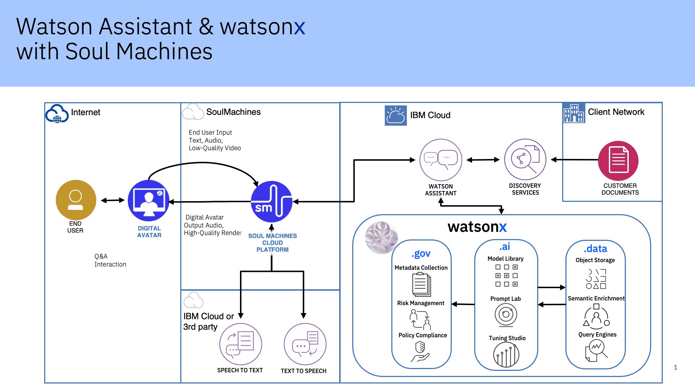

import {Link} from 'gatsby'

<InlineNotification kind="warning">

**Note:**

<ul>
<li>All watsonx <strong>PLATFORM SaaS</strong> deployment threshold automation is under evaluation.
<ul>
<li>CSMs mark customers deployed in a Growth Plan with manager sign-off.</li>
<li>Submit <a href='https://ibm.biz/watsonxdeploymentrequest' target='_blank' rel='noreferrer noopener'>the approval form</a> for WW reviews and validation. The status of approval will be communicated through email.</li>
</ul>
</li>
<li><strong>AI Assistants and APIs</strong>(NON-PLATFORM) watsonx <strong>SaaS</strong> products the automated thresholds remain in place. If you are a CSM or market leader who believes your NON-PLATFORM product is deployed but is not reaching the threshold you can ask for an override through approval process as described below. A Growth Plan with manager sign-off must be in place before sending an override request.
<ul>
<li>For override and additional deployment, CSM or market leader should submit <a href='https://ibm.biz/watsonxdeploymentrequest' target='_blank' rel='noreferrer noopener'>the approval form</a>. The status of approval will be communicated through email.</li>
</ul>  
</li>
<li>Only 2024 new SaaS deployments with a success plan will be approved.</li>
<li>Each watsonx product deployed will be counted. i.e. A RAG use case with watsonx Assistant and watsonx.ai count as two deployments.</li>
</ul>
</InlineNotification>

<AnchorLinks small>
<AnchorLink>Foundational learning</AnchorLink>
<AnchorLink>What is watsonx.ai?</AnchorLink>
<AnchorLink>What are the watsonx.ai use cases?</AnchorLink>
<AnchorLink>Where does watsonx.ai run?</AnchorLink>
<AnchorLink>Key concepts for watsonx.ai</AnchorLink>
<AnchorLink>watsonx.ai scoping, sizing, and implementation considerations</AnchorLink>
<AnchorLink>IBM Fusion HCI considerations</AnchorLink>
<AnchorLink>watsonx.ai competitors</AnchorLink>
</AnchorLinks>

<Row className="resource-card-group">
<Column colMd={4} colLg={4} noGutterSm>
<ResourceCard
      subTitle="Guide and nurture your customers who have a watsonx.ai SaaS entitlement"
      title="watsonx.ai SaaS"
      href="/common/data-ai/csm-data-ai-watsonxai-saas/">

</ResourceCard>

</Column>
<Column colMd={4} colLg={4} noGutterSm>
<ResourceCard
      subTitle="Work with CE and TEL to ensure the client starts their watsonx.ai deployments"
      title="watsonx.ai acceleration"
      href="/common/acceleration-plays/watsonx-ai-play/">

</ResourceCard>

</Column>

<Column colMd={4} colLg={4} noGutterSm>
<ResourceCard
      subTitle="Optimize business processes"
      title="X-factor IT Automation acceleration"
      href="/common/acceleration-plays/xfactor-it-automation-play/">

</ResourceCard>

</Column>

<Column colMd={4} colLg={4} noGutterSm>
<ResourceCard
      subTitle="Compute and storage services for Watson AI, data and governance and watsonx.data"
      title="watsonx & Fusion acceleration"
      href="/common/acceleration-plays/watsonx-fusion-play/">

</ResourceCard>

</Column>
</Row>

<Row>
<Column colMd={8} colLg={8} noGutterMdLeft>

## Foundational learning
CSMs should complete the <a href='https://yourlearning.ibm.com/activity/PLAN-E3DED51F67AA' target='_blank' rel='noreferrer noopener'>AI for Business Level 1 course</a> and the <a href='https://yourlearning.ibm.com/activity/PLAN-402D037C5668' target='_blank' rel='noreferrer noopener'>AI Fundamentals Level 1 course</a>. These courses provide the foundational knowledge required to be able to talk to customers about watsonx.ai and IBM's approach to watsonx.

## What is watsonx.ai? 

watsonx.ai is the next-generation enterprise studio for AI builders. It brings together traditional machine learning and new generative AI capabilities powered by foundation models into a powerful studio that enables you to build AI applications in a fraction of the time with a fraction of the data.  
Traditional AI tools, while powerful, can be expensive, time-consuming, and difficult to use. Data must be laboriously collected, curated, and labeled with task-specific annotations to train AI models. Up until now, building a model required specialized, hard-to-find skills — and each new task required repeating this process.  
The introduction of foundation models provides a powerful and versatile foundation for a variety of AI applications. We can use foundation models to quickly perform tasks with limited annotated data and minimal effort; in some cases, we need only to describe the task at hand to coax the model into solving it. IBM’s new watsonx.ai studio offers a suite of foundation models aimed at delivering enterprise value. They’ve been incorporated into a range of IBM products that will be made available to IBM clients in the coming months.

The core watsonx products are watsonx.ai and watsonx.data and watsonx.governance.  Understanding how they all fit together is important to conceptualize the capabilities and more importantly the value to a client.   
Cloud Pak for Data is a key factor in the overall strategy for a client.  CP4D is the robust data fabric architecture and deployment platform for other key services in the Data & AI portfolio.    

## What are the watsonx.ai use cases?
**Summarization**: transform text with domain-specific content into personalized overviews, capturing key points.
Examples:
- Sales conversation summary: Summarize a chat conversation between a sales agent and a customer. Being able to quickly transfer knowledge between agents without having to read through the entire chat conversation
- Insurance coverage: Generate comprehensive summaries of benefit inclusions and exclusions for insurance policies, making it easier for customers to understand their coverage.
- Contract information synthesis: Synthesize information from contract documents on Network Assets and present it to the users based on user queries.
- Meeting transcripts: Summarize the content of a recorded Webex call.

**Classification**: Read and classify written input with as few as zero examples.
Examples:
- Customer sentiment analysis: NLP techniques can be used to analyze customer feedback and social media data to gain insights into customer sentiment and preferences.
- Customer complaint classification: Classify a customer complaint in a specific category: credit cards, credit reporting, mortgages and loans, retail banking, or debt collection.

**Content Generation**: Generate textual content for a specific purpose.
Examples:
- Marketing campaign: Foundation Models can help create high-quality content for marketing campaigns by analyzing data on target audiences, trending topics, and keywords.
- Job descriptions: Automatically generate job descriptions based on skills required from multiple sources like enterprise HR systems and external areas like LinkedIn
- Design Thinking activities: Generate content for design thinking activities such as Hills, Layers of Effect, and Empathy Maps.

**Question Answering**: A Q&A feature grounded on a specific set of documents or content. 
Examples:
- Q&A Knowledge Base of All IBM Products: We built an IBM knowledge bank based on all IBM developer articles, tutorials, product pages, medium blogs, support channels, and every article on the internet about IBM products.  Next, we built a conversational Q&A application to answer any question on IBM products.  The search pipeline is powered by Watson Discovery to retrieve the information from the knowledge bank. The application is powered by foundation models for generating answers.  
- Customer service assistance: Customers can type in questions and the application searches through knowledge bases (e.g. support articles, forms, catalogs, PDFs) to identify relevant snippets and form a natural language answer. Can also surface the file and section where the answer came from.

**Extraction**: Analyze and extract essential information from unstructured text
Examples:
- Extract information to accelerate audit: Extract specific entities from a document called "Negative certificate of debt" to enable a quicker analysis from auditors (usually trainees). Current process: CNDs are images, that go through OCR, then a classification model to detect their type. then, each type goes through a py script to extract entities (regex) and create a structured JSON. Pain point: create a specific script for each type. Must have: a way to structure the information across types of documents.
- Medical diagnosis: Large language models can help healthcare professionals diagnose patients by analyzing patient data and comparing it to known symptoms and conditions.
- User research findings: Analyze user research interviews to quickly extract insights.
  

## Where does watsonx.ai run?
Initially, watsonx.ai will be available as a SaaS offering on IBM Cloud only.  Consider running watsonx on [IBM Fusion HCI](/common/storage/fusionHCI/)

## Key concepts for watsonx.ai

**Foundation models**: A foundation model (also called base model) is a large machine learning (ML) model trained on a vast quantity of data at scale (often by self-supervised learning or semi-supervised learning) such that it can be adapted to a wide range of downstream tasks. More details are available in the IBM Research <a target='_blank' rel='noreferrer noopener' href="https://research.ibm.com/blog/what-are-foundation-models">blog</a>

**Generative AI**: Generative AI refers to deep-learning models that can generate high-quality text, images, and other content based on the data they were trained on. More details are available in the IBM Research <a target='_blank' rel='noreferrer noopener' href="https://research.ibm.com/blog/what-is-generative-AI">blog</a>

**Hugging Face**: We have a shared commitment to delivering an open ecosystem approach that allows clients to define the best models and architecture for their unique business needs. IBM and Hugging Face help clients select the best models, train, optimize, and run at scale:
- IBM provides “security and support” while clients get the flexibility provided by Hugging Face tools & open source. Together we build a better community through collaboration on open-source software for foundation models. this partnership will allow our clients to Innovate faster!
- Watsonx.ai will support the use of any open-source models hosted on Hugging Face. Also, IBM would likely make some of its own (smaller) models available on the Hugging Face platform for open-source use.

## watsonx.ai scoping, sizing, and implementation considerations

The current engagement model above highlights that Sales, Tech Sales, and Client Engineering should be capturing use cases, workload assessments and sizing data.  However, as a CSM or TEL Service Seller, you want to ensure that all data is captured to have a successful deployment strategy.

**Deployment steps to focus on and ensure that the analysis and planning have been done:**

**Validate or understand the use case** that was captured during the sales cycle or CE workshops. 
**If no current use case exists,**  request a TEL Solution Engineer to <a href='https://ibm.biz/grow-my-deal' target='_blank' rel='noreferrer noopener'>assist in a Use Case Discovery Workshop.</a>  
**Review the existing workload assessment** that should have been captured by TechSales, Client Engineering, or Sales. 
**If there is no existing workload assessment**, then align the use case to the workload type.  Gen AI models are better at certain 
tasks/workloads so ensure the use case matches Gen AI capability. <a href='https://ibm.biz/grow-my-deal' target='_blank' rel='noreferrer noopener'>Request a TEL SE.</a>  

Proper sizing and workload assessment (driven by an agreed-upon use case) will dictate deployment strategy. 
**Validation of sizing** from the Sales team or the Solution Engineer will validate the sizing and or recommend the proper sizing configuration based on the entitlements. 
**If no sizing information is available** for the entitlement, refer to the watsonx.ai <a href='https://ibm.seismic.com/Link/Content/DC2hQWQHhF4678cMqghMQqPq94CP' target='_blank' rel='noreferrer noopener'>T-shirt sizing.</a>  
 

**If this is a SaaS Deployment of watsonx.ai** 
**Request** the provisioning documentation for SQO from the sales team.   
**Understand how to onboard** a client to IBM Cloud. <a href='https://ibm.ent.box.com/s/vt5bhdeh8pq65j20wlez3f0b5ias0m0p' target='_blank' rel='noreferrer noopener'>here</a> 

**Review** the implementation offerings from TEL for watsonx.ai <a href='https://ibm.seismic.com/app?ContentId=bd997837-2369-4008-91be-523cc9c4e349#/doccenter/861ea1fd-99e0-44d7-9135-85412e5c28d1/doc/%252Fdd3359e5f7-a856-a91b-7688-41024b2ac637%252FdfNTY4NmVhOWItY2RkNS04ZWY3LTZkNzItZTQwZjczMWUyMjk1%252CPT0%253D%252CRGF0YSBhbmQgQUk%253D%252FdfNDRmODBlMzMtY2ViMC0zMDI1LTVhNDEtNzg2OTg4MWVmZDBl%252CPT0%253D%252Cd2F0c29ueC5haQ%253D%253D%252FdfOTRiYmU4NTQtNWY4NC03Y2QyLWZjYWUtOGIxYmFmZjkyZThk%252CPT0%253D%252CU2VsbGVyIGVuYWJsZW1lbnQ%253D%252Flfb18a5500-ebb8-481b-9ab4-5daff00ecf53/grid/?anchorId=9a4cdf02-9923-43c0-9e71-7f6e3814f5f0' target='_blank' rel='noreferrer noopener'>here</a> 

**Solution pattern example:**

## IBM Fusion HCI Deployment considerations

IBM Fusion HCI is a hyper-converged infrastructure (HCI) solution that integrates the Red Hat OpenShift container platform with a hybrid cloud data platform. It offers a turn-key enterprise-grade solution for deploying Red Hat OpenShift and simplifies the management of hardware and software. This solution is designed to be highly scalable, with features like erasure coding for data resilience, local and remote backup and recovery, and a global data platform for storage resources.

Key technical aspects of IBM Spectrum Fusion HCI include:
- Integrated HCI appliance for containers
- Scalable containerized file system
- Data resilience for backup and recovery
- Simple installation and maintenance
- Global data platform for storage resources
- Integration with IBM Cloud Satellite® and Red Hat ACM
- Support for AI applications with optional NVIDIA A100 GPUs
- Scalability from 6 to 20 servers.

IBM Spectrum Fusion HCI eliminates the need for excess VM layers typical in container environments, providing an optimized solution for running cloud-native applications and containers. It offers transparent access to data, simplifying both development and operational tasks. The solution is designed to be simple to manage, integrate with current and hybrid cloud environments, build and run container applications, deploy Red Hat OpenShift, and manage storage services efficiently.

IBM is promoting a competitive differentiation with the ability to deploy generative AI models, datalake warehouse and model governance on-premises for clients who consider it undesirable, inefficient, costly, or complex to test or deliver elements of their solution in a public cloud. IBM Fusion HCI is fully supported by the IBM Software Data and AI product team as a platform in which all of these capabilities can be deployed with simplicity, speed and a single point of contact for support. A CSM should engage with the Data and AI Seller and a Storage Seller to develop a plan for client success. Situations in which the client does not wish to use Fusion HCI Lenovo hardware or the standard IBM appliance can be fulfilled with IBM Fusion software and the client’s preferred hardware. Please refer to the <Link to='/common/acceleration-plays/watsonx-fusion-play'>Fusion Play Page</Link> 

## watsonx.ai competitors
Competitors are covered in detail in the <a target='_blank' rel='noreferrer noopener' href="https://ibm.seismic.com/Link/Content/DCM9h4qhBCmX2GHWWPVf6DWQj68j">competitive deck</a>

watsonx.ai competitors include AI21 Lab, Amazon Bedrock, Anthropic, Azure OpenAI, Cohere, Google Vertex and Nvidia. Each competitor's strategic initiatives and business models and key strengths and weaknesses are described in the detailed competitive deck which also includes objection handling and approaches.

** A note from the <a target='_blank' rel='noreferrer noopener' href="https://ibm.seismic.com/Link/Content/DCGq8T9hmFHbF82P2PPmQH8jpmBB">FAQ</a>:**
IBM's play is to make smaller, enterprise-focused models that can sometimes outperform when operating in-domain or for a specific use case. With our data provenance, IBM models will have fewer risks—and deployment costs. They have also been optimized to work with our inferencing stack. 
IBM Research will release performance metrics of our models in Q3.
Strategically, it is not our intent to get into the arms race of "build a better model." We envision a future where a client will select the best foundation model for a specific task and then bring their own data and start constructing the use case via prompt engineering or the tuning studio.
We are building tools to help them select the right foundation model as a starting point, even if it isn't a model from IBM Research.
For clients who just want to get going quickly, we'll have multiple models "at the ready" on the platform.

</Column>

<Column colMd={4} colLg={4} noGutterMdLeft>

  

<Aside>

**Customer Success Practice Leader:**  Campbell Roberstson (@cir) 
**CSM Slack Channel:** <a href='https://ibm-cloud.slack.com/archives/C01L3NASBUJ' target='_blank' rel='noreferrer noopener'>csm-data-ai</a> 
**FAQ:** <a href='https://ibm.seismic.com/Link/Content/DCGq8T9hmFHbF82P2PPmQH8jpmBB' target='_blank' rel='noreferrer noopener'>Document</a> 
**Client Presentation:** <a href='https://ibm.seismic.com/Link/Content/DCdbfTqG2qMHVGQXmQ3qGT6BhjGV' target='_blank' rel='noreferrer noopener'>Deck</a> 
**Generative AI:** <a href='https://ibm.seismic.com/Link/Content/DC6VW9CD3WMbQ8FR2gcV3qfC89gV' target='_blank' rel='noreferrer noopener'>Overview Video</a> 
**Demo:** <a href='https://ibm.seismic.com/Link/Content/DCWbCJV928fVpGCPbh2CF3DqBBJP' target='_blank' rel='noreferrer noopener'>Generative AI</a>  
**Roadmap:** <a href='https://ibm.seismic.com/Link/Content/DCVfj4mQD7jGT8qTC7gW3qJHWmHP' target='_blank' rel='noreferrer noopener'>Deck</a>  
**Seismic:** <a href='https://ibm.seismic.com/Link/Content/DCJH7MbqmMBmG8MPFjm2jWWfjgbP' target='_blank' rel='noreferrer noopener'>Sales Kit</a> with Presentations and Pre-sales assets 

</Aside>

<Aside>

**Build your skills**

Seller enablement <a href='https://ibm.seismic.com/Link/Content/DCqc84gDd33Pj84VMGgJjpGDWB83' target='_blank' rel='noreferrer noopener'>presentation</a> 
<a href='https://yourlearning.ibm.com/activity/PLAN-E3DED51F67AA' target='_blank' rel='noreferrer noopener'>AI for Business Level 1 course</a> 
<a href='https://yourlearning.ibm.com/activity/PLAN-402D037C5668' target='_blank' rel='noreferrer noopener'>AI Fundermentals Level 1 course </a> 
</Aside>

<Aside>

**Who can help me?**

**Client Engineering** and **Tech Sales** also have the skills required to perform Proof of Value engagements. 
**Technology Expert Labs** can deliver:  
-"Implement: Install watsonx" (on OCP/non-SaaS)  [-"Implement: Build watsonx.data"](https://ibm.seismic.com/Link/Content/DC8TD69B2qqX989TP7fqVgbj3cMV)  
-"Implement: Build watsonx.ai"  
-"Learn: Learning Subscription/Interactive Training"   
-"Accelerate: Expertise Connect" 
**TEL locator: <a href='https://ibm.biz/FindIBMSellers' target='_blank' rel='noreferrer noopener'>>Find IBM Sellers</a>** 
**TEL Contacts: <a href='http://ibm.biz/ExpertLabs-WWContacts' target='_blank' rel='noreferrer noopener'>>TEL-SW Services Sales</a>** 
**TEL Assistance: <a href='https://ibm.biz/grow-my-deal' target='_blank' rel='noreferrer noopener'>>www.ibm.biz/grow-my-deal</a>** 
**TEL <a href='https://w3.ibm.com/w3publisher/americasexpertlabs/our-team/solution-architect-team' target='_blank' rel='noreferrer noopener'>>Solution Architects</a>** 
**Slack: <a href='https://ibm.biz/ask-expert-labs' target='_blank' rel='noreferrer noopener'>>#ask-expert-labs</a> (IBMers only)** 

</Aside>

<Aside>

**Customer-facing case studies?**

Coming soon. However, some beta use cases were covered in Janine's <a href='https://secure.video.ibm.com/channel/25075714' target='_blank' rel='noreferrer noopener'>all hands call</a>

</Aside>

</Column>

</Row>

<Row>

<Column>

</Column>
</Row>
