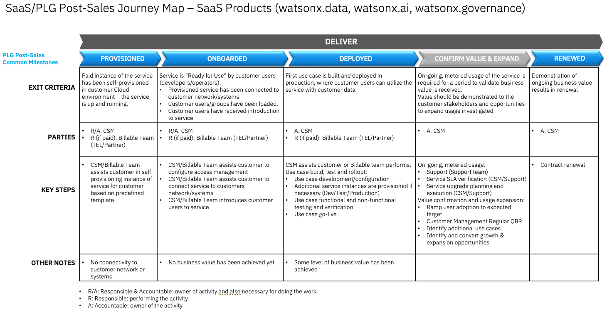

import {Link} from 'gatsby'

<Row>
<Column>

<InlineNotification kind="warning">

**Note:**

<ul>
<li>All watsonx <strong>PLATFORM SaaS</strong> deployment threshold automation is under evaluation.
<ul>
<li>CSMs mark customers deployed in a Growth Plan with manager sign-off.</li>
<li>Submit <a href='https://ibm.biz/watsonxdeploymentrequest' target='_blank' rel='noreferrer noopener'>the approval form</a> for WW reviews and validation. The status of approval will be communicated through email.</li>
</ul>
</li>
<li><strong>AI Assistants and APIs</strong>(NON-PLATFORM) watsonx <strong>SaaS</strong> products the automated thresholds remain in place. If you are a CSM or market leader who believes your NON-PLATFORM product is deployed but is not reaching the threshold you can ask for an override through approval process as described below. A Growth Plan with manager sign-off must be in place before sending an override request.
<ul>
<li>For override and additional deployment, CSM or market leader should submit <a href='https://ibm.biz/watsonxdeploymentrequest' target='_blank' rel='noreferrer noopener'>the approval form</a>. The status of approval will be communicated through email.</li>
</ul>  
</li>
<li>Only 2024 new SaaS deployments with a success plan will be approved.</li>
<li>Each watsonx product deployed will be counted. i.e. A RAG use case with watsonx Assistant and watsonx.ai count as two deployments.</li>
</ul>
</InlineNotification>

## Contacts

| WW contact | Name | WW contact | Name |
| --- | --- | --- | --- |
| **Customer Success Practice Leaders:** | Campbell Robertson | **Digital Customer Success & PLG:** | Felipe Satantri |
| **Technology Expert Labs Delivery:** | Suzanne Golledge | **Technology Expert Labs Solution Engineering:** | Jo Ramos |
| **SRE:** | None | | |

</Column>
</Row>

<Row>
<Column colMd={9} colLg={9}>

## Overview
As a CSM, your focus is to guide and nurture your customers who have a watsonx.data SaaS entitlement.  Your job is to guide the customer with provisioning through to onboarding, help with their first use case, and continue to expand their use cases.

You can learn more about watsonx.data on the <a href='https://pages.github.ibm.com/csm-playbook/playbook/common/data-ai/csm-data-ai-watsonx-data/' target='_blank' rel='noreferrer noopener'>playbook page</a>.

</Column>
</Row>

<Row>
<Column>

| FAQ | Answer |
| --- | --- |
| What is the relationship name in Gainsight? | IBM Cloud |
| Which Clouds does this product run on? | IBM Cloud and AWS |
| How is SaaS usage calculated? | <a href='https://ibm.seismic.com/Link/Content/DCJ2bCQ7FPH448fJ6TWjVcmc2MJ3?anchorId=191ccccc-9690-4aa3-bc15-f0cd83424689#/?anchorId=191ccccc-9690-4aa3-bc15-f0cd83424689' target='_blank' rel='noreferrer noopener'>SaaS Seller Enablement</a> |
| Who can help my customer with billing/invoicing questions? | Richard Porter |
| Where is the documentation? | <a href='https://cloud.ibm.com/docs/watsonxdata' target='_blank' rel='noreferrer noopener'>watsonx.data Documentation</a> |
| Are the SaaS capabilities different from the on-prem offering? | No, the product code and capabilities are the same |
| Does watsonx.data SaaS run on OpenShift? | No on IBM Cloud (IKS), Yes on AWS (ROSA)  |
| Does watsonx.data SaaS count as OpenShift Deployment? | No on IBM Cloud (IKS), Yes on AWS (ROSA)  |
| Is watsonx Assistant SaaS consumable or ratable revenue? | Consumable. The unit of consumption is ratings. |
| Who triggers deployment? | Until the end of 2Q, CSMs can mark customers deployed in a Growth Plan with manager sign-off. |

</Column>
</Row>

<Row>
<Column colMd={9} colLg={9}>

### CSM Scorecard Milestones based on usage

SaaS milestones for the CSM Scorecard are based on usage. To progress from Planning to Deploying to Deployed, see <Link to='/common/saas-growth/#data-and-ai-saas-milestones-based-on-usage'>Data and AI milestones based on usage</Link>.

</Column>
</Row>

<Row>
<Column>

<Accordion>
<AccordionItem title="SaaS adoption journey insights">
SaaS has an additional level of insights that are used to track the adoption journey. These provide an additional level of detail specifically for SaaS adoption.  For Turbonomic, they are shown in the table below.

| 
Insight
 | 
Description
 |
| --- | --- |
| Paid Provisioned | Customer has purchased the product |
| Paid Onboarding Progress | User has read the quick start. User has created a bucket. User has created an Engine. User has executed a Query |
| Paid Onboarded | Completion of the Onboarding Checklist |
| Paid Deployed | First use case or feature deployed in production environment |
</AccordionItem>
</Accordion>

</Column>
</Row>

<Row>
<Column colMd={9} colLg={9}>

### watsonx.data Product Feature Adoption and Value Realized Indicators
watsonx.data Product Feature Adoption and Value Realized Indicators are instrumented into the product to show the capabilities and features that the customer is using. This information can be used to determine the level of adoption that has taken place and ensure that the customer is receiving full business value from the product. See below for novice, intermediate, and advanced level indicators along with an asset listing the value proposition, expected benefits, considerations for implementation and metrics of success.

</Column>
</Row>

<Row> 
<Column>

<Accordion>
<AccordionItem title="Novice level indicators">

| Product Feature | Description | Asset |
| --- | --- | --- |
| Will be finalized as part of PLG rollout | TBD | TBD |

</AccordionItem>

<AccordionItem title="Intermediate level indicators">

| Product Feature | Description | Asset |
| --- | --- | --- |
| Will be finalized as part of PLG rollout | TBD | TBD |

</AccordionItem>

<AccordionItem title="Advance level indicators">

| Product Feature | Description | Asset |
| --- | --- | --- |
| Will be finalized as part of PLG rollout | TBD | TBD |

</AccordionItem>

</Accordion>

</Column>
</Row>

<Row>
<Column colMd={9} colLg={9}>

## Post-sales journey  
As a CSM with a customer who has a watsonx.data SaaS entitlement, it is your responsibility to help the customer adopt the product, bring use cases to production, and renew their subscriptions.
The diagram shows the watsonx.data SaaS post-sales journey at a high level. Each section is broken down in detail with links to assets below.

</Column>
</Row>

<Row> 
<Column>

### Provisioned

| **Led by** | **Outcome** | **Assets & Activities** |
| --- | --- | --- |
| IBM CSM (utilizing Billable Services if the customer has paid) | watsonx.data SaaS instance provisioned and customer has access. | **Technology Expert Labs Offerings:**   &nbsp;&nbsp;&nbsp;&nbsp; **Build watsonx.data** (<a href="https://ibm.seismic.com/Link/Content/DC8TD69B2qqX989TP7fqVgbj3cMV" target='_blank' rel='noreferrer noopener'>Seismic</a>) Includes:  - Design and planning   - Integration and Configuration    **Sizing and planning**   The use case(s) that the customer wants to address with watsonx.data will determine the configuration of the runtime environment and should be determined **before** the environment is provisioned. Refer to the steps in the <a href='https://pages.github.ibm.com/csm-playbook/playbook/common/acceleration-plays/watsonx-data-play/#watsonx.data-scoping-sizing-and-implementation-considerations' target='_blank' rel='noreferrer noopener'>watsonx.data Acceleration Play</a> that covers sizing to determine what will need to be provisioned.    **Provisioning the service**  Use the <a href='https://cloud.ibm.com/docs/watsonxdata?topic=watsonxdata-getting-started' target='_blank' rel='noreferrer noopener'>Getting Started section</a> of the watsonx.data Documentation along with the <a href='https://ibm.ent.box.com/s/vt5bhdeh8pq65j20wlez3f0b5ias0m0p' target='_blank' rel='noreferrer noopener'>CS IBM Cloud onboarding guide</a> to guide your customer through the process of provisioning the watsonx.data service.

### Onboarded

| **Led by** | **Outcome** | **Assets & Activities** |
| --- | --- | --- |
| IBM CSM (utilizing Billable Services if the customer has paid) | Customer has read the quickstart document, configured a bucket and engine, and executed a query. |   - <a href='https://cloud.ibm.com/docs/overview?topic=overview-get-started-checklist' target='_blank' rel='noreferrer noopener'>Getting started on IBM Cloud checklist</a> provides a guide to navigate the available documentation to set up your account, secure your cloud resources, and track costs.   - <a href='https://cloud.ibm.com/docs/billing-usage?topic=billing-usage-subscription_code' target='_blank' rel='noreferrer noopener'>Applying the watsonx subscription code</a>   - <a href='https://cloud.ibm.com/docs/framework-financial-services?topic=framework-financial-services-onboarding-to-catalog' target='_blank' rel='noreferrer noopener'>Onboard to the IBM Cloud catalog</a> shows how to interact with the IBM Cloud catalog listing IBM and third-party services and software you can create.    **Technology Expert Labs Offerings:**   &nbsp;&nbsp;&nbsp;&nbsp; **Build watsonx.data** (<a href="https://ibm.seismic.com/Link/Content/DC8TD69B2qqX989TP7fqVgbj3cMV" target='_blank' rel='noreferrer noopener'>Seismic</a>) Includes:  - Design and planning   - Integration and Configuration    **Getting started**   Use the <a href="https://cloud.ibm.com/docs/watsonxdata?topic=watsonxdata-quick_start" target='_blank' rel='noreferrer noopener'>Quick-start guide</a> to configure a storage bucket and engine and then the <a href="https://cloud.ibm.com/docs/watsonxdata?topic=watsonxdata-run_sql" target='_blank' rel='noreferrer noopener'>Query Workspace</a> to demonstrate how to execute an SQL query in watsonx.data. Completing these steps demonstrates that the service is ready to use.    **Nurture opportunities**  After the Product Led Growth interface in Gainsight is configured later in 2024, you will be able to track the activities that the customer is performing in watsonx.data. This enables you to determine whether the customer needs additional assistance through their journey. For instance, if you see that no *buckets or engines* have been configured or no *queries* have been executed, then your customer has not completed the basic onboarding steps and might require your assistance. 

### Deployed

| **Led by** | **Outcome** | **Assets & Activities** |
| --- | --- | --- |
| CSM (utilizing Billable Services if the customer has paid) | The client has created a solution and has moved to operate the solution with consistent usage. | **Technology Expert Labs Offerings:**   &nbsp;&nbsp;&nbsp;&nbsp; **Build watsonx.data** (<a href="https://ibm.seismic.com/Link/Content/DC8TD69B2qqX989TP7fqVgbj3cMV" target='_blank' rel='noreferrer noopener'>Seismic</a>) Includes:  - Design and planning   - Integration and Configuration     **Create/enhance the solution**   CSMs should utilize billable services from Technology Expert Labs to design and implement the solution for the customer.  CSMs that have customers that want to perform the first design and implementation without the support of Technology Expert Labs will need to provide support themselves using experience gained from completing the <a href="https://yourlearning.ibm.com/activity/PLAN-96BA3950C94B" target='_blank' rel='noreferrer noopener'>Level 2</a>, <a href="https://yourlearning.ibm.com/activity/PLAN-D1A3C14641E5" target='_blank' rel='noreferrer noopener'>Level 3</a> and <a href="https://yourlearning.ibm.com/activity/PLAN-398E80DC7D9E" target='_blank' rel='noreferrer noopener'>Level 4</a> enablement classes.    **Operate the solution**   CSMs should utilize billable services from Technology Expert Labs to instruct the customer on how to operate the solution for the customer.   CSMs that have customers that want to perform the first design and implementation without the support of Technology Expert Labs will need to provide support themselves using experience gained from completing the <a href="https://yourlearning.ibm.com/activity/PLAN-96BA3950C94B" target='_blank' rel='noreferrer noopener'>Level 2</a>, <a href="https://yourlearning.ibm.com/activity/PLAN-D1A3C14641E5" target='_blank' rel='noreferrer noopener'>Level 3</a> and <a href="https://yourlearning.ibm.com/activity/PLAN-398E80DC7D9E" target='_blank' rel='noreferrer noopener'>Level 4</a> enablement classes. enablement classes.    **Nurture opportunities** After the Product Led Growth interface in Gainsight is configured later in 2024, you will be able to track the activities that the customer is performing in watsonx.data. This allows you to determine whether the customer needs additional assistance through their journey. For instance, if you see that no *buckets or engines* have been configured or no *queries* have been executed, then your customer has not completed the basic onboarding steps and may require your assistance. |

### Confirm Value & Expand

| **Led by** | **Outcome** | **Assets & Activities** |
| --- | --- | --- |
| CSM | Customer has realized value and expanding usage to new business use cases. | **Nurture relationship**  Set up a <Link to='/onboard/executive-business-review/'>EBR (executive business review)</Link> with client sponsor and executives to align and review the adoption, value seen and confirm the customer's strategic goals have been met.    **Identify risk/opportunity**   After the Product Led Growth interface in Gainsight is configured later in 2024, you will be able to track the activities that the customer is performing in watsonx.data. This enables you to determine whether the customer is continuing to use the product or whether usage is dropping.   **Expand solution**   A CSM should continue to drive usage of Technology Expert Labs services and look for opportunities to add more use cases using the <Link to='/common/acceleration-plays/watsonx-data-play'>watsonx.data Acceleration Play</Link> . |

### Renewed

| **Led by** | **Outcome** | **Assets & Activities** |
| --- | --- | --- |
| CSM and/or Technical Sales | The client has confirmed that they are using the product and will continue to renew their entitlement. | N/A |

</Column>
</Row>
