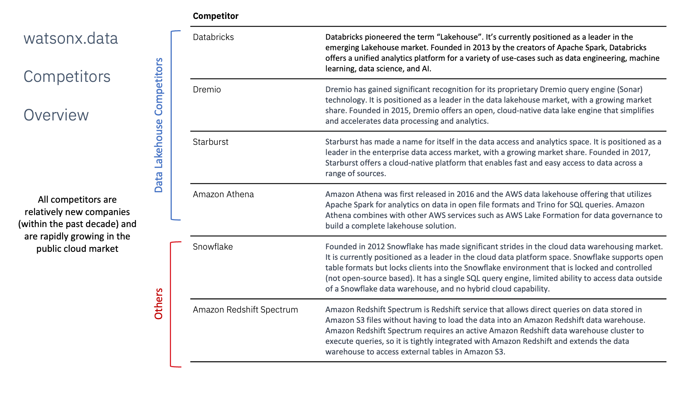

import {Link} from 'gatsby'

<InlineNotification kind="warning">

**Note:**

<ul>
<li>All watsonx <strong>PLATFORM SaaS</strong> deployment threshold automation is under evaluation.
<ul>
<li>CSMs mark customers deployed in a Growth Plan with manager sign-off.</li>
<li>Submit <a href='https://ibm.biz/watsonxdeploymentrequest' target='_blank' rel='noreferrer noopener'>the approval form</a> for WW reviews and validation. The status of approval will be communicated through email.</li>
</ul>
</li>
<li><strong>AI Assistants and APIs</strong>(NON-PLATFORM) watsonx <strong>SaaS</strong> products the automated thresholds remain in place. If you are a CSM or market leader who believes your NON-PLATFORM product is deployed but is not reaching the threshold you can ask for an override through approval process as described below. A Growth Plan with manager sign-off must be in place before sending an override request.
<ul>
<li>For override and additional deployment, CSM or market leader should submit <a href='https://ibm.biz/watsonxdeploymentrequest' target='_blank' rel='noreferrer noopener'>the approval form</a>. The status of approval will be communicated through email.</li>
</ul>  
</li>
<li>Only 2024 new SaaS deployments with a success plan will be approved.</li>
<li>Each watsonx product deployed will be counted. i.e. A RAG use case with watsonx Assistant and watsonx.ai count as two deployments.</li>
</ul>
</InlineNotification>

<AnchorLinks small>
<AnchorLink>Foundational learning</AnchorLink>
<AnchorLink>Overview</AnchorLink>
<AnchorLink>What are the watsonx.data use cases?</AnchorLink>
<AnchorLink>Where does watsonx.data run?</AnchorLink>
<AnchorLink>What is watsonx.data?</AnchorLink>
<AnchorLink>Key concepts for watsonx.data</AnchorLink>
<AnchorLink>watsonx.data terminology</AnchorLink>
<AnchorLink>watsonx.data scoping, sizing, and implementation considerations</AnchorLink>
<AnchorLink>watsonx.data competitors</AnchorLink>
<AnchorLink>watsonx.data components</AnchorLink>
<AnchorLink>IBM Fusion HCI considerations</AnchorLink>
</AnchorLinks>

<Row className="resource-card-group">

<Column colMd={4} colLg={4} noGutterSm>

<ResourceCard
      subTitle="Guide and nurture your customers who have a watsonx.data SaaS entitlement"
      title="watsonx.data SaaS"
      href="/common/data-ai/csm-data-ai-watsonx-data-saas/">

</ResourceCard>
</Column>

<Column colMd={4} colLg={4} noGutterSm>

<ResourceCard
      subTitle="Work with CE and TEL to ensure the client starts their watsonx.data deployments"
      title="watsonx.data acceleration"
      href="/common/acceleration-plays/watsonx-data-play/">

</ResourceCard>

</Column>

<Column colMd={4} colLg={4} noGutterSm>
<ResourceCard
      subTitle="Compute and storage services for Watson AI, data and governance and watsonx.data"
      title="watsonx & Fusion acceleration"
      href="/common/acceleration-plays/watsonx-fusion-play/">

</ResourceCard>

</Column>
</Row>

<Row>
<Column colMd={8} colLg={8} noGutterMdLeft>

## Foundational learning 

CSMs should complete the  <a href='https://yourlearning.ibm.com/activity/PLAN-E3DED51F67AA' target='_blank' rel='noreferrer noopener'>AI for Business Level 1 course</a> <a href='https://yourlearning.ibm.com/activity/PLAN-402D037C5668' target='_blank' rel='noreferrer noopener'>AI Fundermentals Level 1 course</a> <a href='https://yourlearning.ibm.com/activity/PLAN-96BA3950C94B' target='_blank' rel='noreferrer noopener'>IBM watsonx.data Level 2 course </a> 
These courses provide the foundational knowledge required to be able to talk to customers about watsonx.data and IBM's approach to watsonx. 

<Accordion>

<AccordionItem title='Additional Learning'>
- Seismic <a href='https://ibm.seismic.com/Link/Content/DCbbPfP64CX3RG4CJPH7bH8XjGBP' target='_blank' rel='noreferrer noopener'>Sales Kit</a> with Presentations and Pre-sales assets 
- <a href='https://ibm.seismic.com/Link/Content/DCMhDcDb2qVWVGCBcM4JpJMcVQJG' target='_blank' rel='noreferrer noopener'>Gartner on Lakehouses</a>  
- dbInsight on watsonx.data <a href='https://ibm.seismic.com/Link/Content/DCH6V6pc4PPVjGmDbh9PVfM86PC3' target='_blank' rel='noreferrer noopener'>report</a>  
- watsonx.data <a href='https://ibm.seismic.com/Link/Content/DC24pQJX7c4M7GCRFM8FqQmTHTQG' target='_blank' rel='noreferrer noopener'>FAQ</a>  
- Db2 Warehouse Gen 3 + watsonx.data <a href='https://ibm.seismic.com/Link/Content/DCJpChBRPCR2pG9T24cM66fMXMJ8' target='_blank' rel='noreferrer noopener'>one pager</a>  
- Netezza aaS + watsonx.data <a href='https://ibm.seismic.com/Link/Content/DCGW6WDB9W67g87WChgJQ4pQ3dPj' target='_blank' rel='noreferrer noopener'>one pager</a>  
</AccordionItem>
</Accordion>

## Overview

The core watsonx products are watsonx.ai and watsonx.data and watsonx.governance.  Understanding how they all fit together is important to conceptualize the capabilities and more importantly the value to a client.   
Cloud Pak for Data is a key factor in the overall strategy for a client.  CP4D is the robust data fabric architecture and deployment platform for other key services in the Data & AI portfolio.    

## What are the watsonx.data use cases?

**AI/ML at scale**: Build, train, tune, deploy and monitor trusted AI/ML models for mission-critical workloads with data in watsonx.data and ensure compliance with lineage and reproducibility of data used for AI   
**Real-time analytics and business intelligence**: Combine data from existing sources with new data in watsonx.data to unlock new, faster insights without the cost and complexity of duplicating and moving data across different environments.   
**Streamline data engineering**: Reduce data pipelines, simplify data transformation, and enrich data for consumption using SQL, Python, or an AI-infused conversational interface.   
**Share data responsibly**: Enable self-service access for more users to more data while ensuring security and compliance with centralized governance and local automated policy enforcement.

## Where does watsonx.data run?
watsonx.data can run on SaaS and as "Software" on OpenShift. Consider [Fusion HCI](/common/storage/fusionHCI/)  
Notes:
1. In the initial releases, the *AWS SaaS* option will **not** be available in the AWS Marketplace and instead will be purchased through IBM Cloud and provisioned on AWS.
2. The *software* option can be deployed anywhere that OpenShift runs and can run without Cloud Pak for Data or as a Cloud Pak for Data Cartridge. watsonx.data **does not** require Cloud Pak for Data
3. The *software* option contains a slim version of foundational services that are required for IAM, metering, billing and a common look and feel.

## What is watsonx.data?  
The next-gen watsonx.data lakehouse is designed to overcome the costs and complexities enterprises face. This will be the world’s first and only open data store with multi-engine support that is built for hybrid deployment across your entire ecosystem.  
watsonx.data is the only lakehouse with multiple query engines allowing you to optimize costs and performance by pairing the right workload with the right engine.
-	Run all workloads from a single pane of glass, eliminating trade-offs with convenience while still improving cost and performance.
-	Deploy anywhere with full support for hybrid-cloud and multicloud environments.
-	Shared metadata across multiple engines eliminates the need to re-catalog, accelerating time to value while ensuring governance and eliminating costly implementation efforts.

watsonx.data provides the next level of Data Lakehouse technology to the marketplace and will extract better value from data in ineffective data lakes by modernizing and enabling warehouse-like capabilities. The product can be installed on-premise, on a cloud, or provisioned as part of a managed service and be up and running in as little as 10 minutes.  
watsonx.data uses a combination of open-source components, including Apache Parquet, Apache ICEberg, and low-cost object storage to provide for high-performance analytics.  
Enterprise compliance and security will be built in from the start, and not as an afterthought, to provide unified governance across your entire ecosystem.  
Fit-for-purpose engines will optimize costly warehouse workloads, with engines that scale up/down automatically with your needs.
watsonx.data provides a simple UX and “click-and-go” console to ingest, access, transform data, and run workloads.  
Finally, watsonx.data will integrate with IBM’s robust ecosystem of technologies and a broad set of 3rd party partners to enable easy development and deployment of your use cases.

</Column>

<Column colMd={4} colLg={4} noGutterMdLeft>

  

<Aside>

**Customer Success Practice Leader:**  Campbell Roberstson (@cir),  Tal Shahar (@Tal Shahar) 
**CSM Slack Channel:** <a href='https://ibm-cloud.slack.com/archives/C01L3NASBUJ' target='_blank' rel='noreferrer noopener'>csm-data-ai</a> 
**FAQ:** <a href='https://ibm.seismic.com/Link/Content/DCGq8T9hmFHbF82P2PPmQH8jpmBB' target='_blank' rel='noreferrer noopener'>Document</a> 
**Learn:** <a href='https://ibm.seismic.com/Link/Content/DCqc84gDd33Pj84VMGgJjpGDWB83' target='_blank' rel='noreferrer noopener'>Enablement presentation</a> 
**Demo:** <a href='https://techzone.ibm.com/collection/ibm-watsonxdata-developer-base-image' target='_blank' rel='noreferrer noopener'>Environment</a>  
**Roadmap:** <a href='https://ibm.seismic.com/Link/Content/DCMmpHHmJchDq8qW3dM9TX8qjW9d' target='_blank' rel='noreferrer noopener'>Deck</a>  
**Seismic:** <a href='https://ibm.seismic.com/Link/Content/DCbbPfP64CX3RG4CJPH7bH8XjGBP' target='_blank' rel='noreferrer noopener'>Sales Kit</a> with Presentations and Pre-sales assets 

</Aside>

<Aside>

**Build your skills**

Additional Technical enablement <a href='https://ibm.seismic.com/Link/Content/DCqc84gDd33Pj84VMGgJjpGDWB83' target='_blank' rel='noreferrer noopener'>Seller Enablement Deck</a> 
<a href='https://yourlearning.ibm.com/activity/PLAN-D1A3C14641E5' target='_blank' rel='noreferrer noopener'>IBM watsonx.data Technical Level 3</a> 
<a href='https://yourlearning.ibm.com/activity/PLAN-398E80DC7D9E' target='_blank' rel='noreferrer noopener'>IBM watsonx.data Technical Level 4</a> 
</Aside>

<Aside>

**Who can help me?**

**Client Engineering** and **Tech Sales** also have the skills required to perform Proof of Value engagements. 

**Technology Expert Labs** can deliver:   -"Implement: Install watsonx" (on OCP/non-SaaS)  <a href='https://ibm.seismic.com/Link/Content/DC8TD69B2qqX989TP7fqVgbj3cMV'>-"Implement: Build watsonx.data"</a>   -"Implement: Build watsonx.ai"   -"Learn: Learning Subscription/Interactive Training"   -"Accelerate: Expertise Connect" 
**TEL locator: <a href='https://ibm.biz/FindIBMSellers' target='_blank' rel='noreferrer noopener'>>Find IBM Sellers</a>** 
**TEL Contacts: <a href='http://ibm.biz/ExpertLabs-WWContacts' target='_blank' rel='noreferrer noopener'>>TEL-SW Services Sales</a>** 
**TEL Assistance: <a href='https://ibm.biz/grow-my-deal' target='_blank' rel='noreferrer noopener'>>www.ibm.biz/grow-my-deal</a>** 
**TEL <a href='https://w3.ibm.com/w3publisher/americasexpertlabs/our-team/solution-architect-team' target='_blank' rel='noreferrer noopener'>>Solution Architects</a>** 

**Slack: <a href='https://ibm.biz/ask-expert-labs' target='_blank' rel='noreferrer noopener'>>#ask-expert-labs</a> (IBMers only)** 

</Aside>

<Aside>

**Customer-facing case studies?**

Coming soon. However, some beta use cases were covered in Janine's <a href='https://secure.video.ibm.com/channel/25075714' target='_blank' rel='noreferrer noopener'>all hands call</a>  

</Aside>

</Column>
</Row>

<Row>
<Column>

|Lakehouse implementation challenges | IBM's differentiation |
|---|---|
|**Data repositories are sticky.**   - Migration from existing warehouses and lakes is complex.   - Users are resistant to change| **Support for easy data consolidation with data ingest.**   - Retain existing repositories and expand in to the lakehouse.   - Federated queries for virtual lakehouses avoid data copies.|
|**Data Anywhere**   - Moving data to other clouds is not always possible.   - Safe harbor and other regulatory compliance cannot be ignored.|**In-engine policy enforcement and Data Sovereignty**   - Data versioning and enforcement during ingest.   - Materialization/caching of governed data.|
|**Price/Performance**   - Compute elasticity (grow and shrink on demand).   - Cheap, but slow storage.| **Performance optimizations**   - Watson Query analytics optimizations, query rewrites, pushdown, OLAP & other analytics optimization (IBM IP), workload management and isolation.   - Accelerated execution with Velox, Prestissimo, and IBM extensions. |
|**Application Refactoring**   - Expensive to re-implement applications and vendor tooling with new protocols. | **SQL and driver wire protocol compatibility**   - Retain existing applications that talk IBM DB2, IBM NZ, PostgreSQL or MySQL dialects, just switch URLs.|
|**Operational complexity**   - portability (ability to run anywhere in various form factors)   - lifecycle management of truly elastic and on-demand Lakehouse instances | **Open, modular Lakehouse with microservices architecture**   - IBM SaaS on multiple clouds   Red Hat OpenShift, operationalized for Private Cloud   - Ready for ISVs and Solutions|

</Column>
</Row>

<Row>
<Column colMd={9} colLg={9} noGutterMdLeft>

## Key concepts for watsonx.data

**watsonx.data** is IBM's entry into the Lakehouse market. It is a new (to IBM) data management system.  
**watsonx.data** enables a mutli-engine analytics approach based on a Hive Metastore that acts as a Database Catalog many engines can use.  
**Presto** is a new-generation open-source SQL engine designed to run efficiently over data lakes. IBM acquired Ahana which is a major presto contributor and created Prestissmo (presto improved with C++)  
**Warehouses and first generation lakehouses** are monolithic, and not optimized to work on all workloads. Only IBM watsonx.data's multi-engine architecture allows for true workload optimization  
**Iceberg** is a new open-table format that allows multiple engines to access the same data – this means, Snowflake, Netezza and IBM watsonx.data can all access data in Iceberg at the same time

## watsonx.data terminology

Traditional approaches to addressing data challenges have created complexity and cost, leading to the emergence of Data Lakehouse architectures.  Below are more comprehensive definitions of these approaches and lakehouse to help you understand the differences:

 

**Data Warehouse**: A relational data store designed for analytics and reporting. Data is typically moved from many transactional sources into a warehouse. It can be on-premises, in open systems or a mainframe, or in the cloud, either fully managed or in software installed on cloud infrastructure.  
**Data Virtualization**: Federation Technology which creates a logical view of data from many data sources. A central “coordinator” runs queries against multiple data sources without relocating data. It makes data from many systems appear as if they are in a single database. IBM DV is built on BigSQL technology. Access through DV is currently read-only. Because it accesses data live without relocating it, DV CAN impact the performance of target systems—so the capacity of the target system is a factor. Note: Data Virtualization in Cloud Pak for Data improves on Federation by allowing for multiple coordinator nodes and other performance features. But the underlying connections to data sources are identical.  
**Data Lake**: Data Lakes became popular with the advent of Hadoop—which promised warehouse-like performance on commodity hardware and accepted both structured and unstructured (or semi-structured) data. Data is moved from wherever it is created to storage attached to the Hadoop cluster. The processing was intended to occur close to the data for maximum performance. While Hadoop retains its presence, most feel its value was not fully realized. It wound up being more complicated and expensive than promised.  
**Lakehouse**: A Lakehouse is the evolution of the data lake built on Object Storage. Object Storage is economical, includes replication for High Availability, and can be addressed with the s3 API no matter where it is—in a cloud, on an appliance, or deployed via software, such as Ceph or OpenShift Data Foundations. It is also built on popular open-source file and table formats, like Parquet, Avro, iceberg, and HUDI. Data is copied or relocated into s3 buckets to be serviced by a query engine. Different companies implement Lakehouse differently.  
**watsonx.data**: IBM’s Lakehouse entry combines the above lakehouse definition with data federation. That means we not only allow for data to be copied or relocated into object storage, it can also be virtualized without moving it. That means customers can take advantage of s3 and open-source formats at their own pace—adding new s3 workloads without a requirement to rapidly abandon other structures. IBM’s Multi-engine approach also means that High Performance Data Warehouses can continue to perform their specialized workloads, while other engines execute overlapping workloads in a price-performant environment. Spark and presto can be sized as workloads demand. All engines can update the same data thanks to the Shared Hive Metastore (a system catalog for open-source tables). Federation in wastonx.data is built on presto and its many connectors. Compared to DV, it is read/write, but does not have the same options for performance improvement.

## watsonx.data scoping, sizing, and implementation considerations

The current engagement model above highlights that Sales, Tech Sales, and Client Engineering should be capturing use cases, workload assessments, and sizing data.  However, as a CSM or TEL Service Seller, you want to ensure that all data is captured to have a successful deployment strategy.

**Deployment steps to focus on and ensure that the analysis and planning have been done:**

**Validate or understand the use case** that was captured during the sales cycle or CE workshops. 
**If no current Use Case exists, engage** a TEL Solution Engineer who can assist with a workshop (IBM Invest). <a href='https://ibm.biz/grow-my-deal' target='_blank' rel='noreferrer noopener'>Request a TEL SE. </a>  

Proper sizing and workload assessment driven by an agreed-upon use case will dictate deployment strategy. 
**Review** the existing Workload Assessment that should have been captured by Tech-Sales, Client Engineering, or Sales. 
**If no existing workload assessment, align** use case to workload type and assessment. watsonx.data has multiple query engines and
storage options, select the one that aligns the use case data analysis to the type of query engine and storage classes. <a href='https://ibm.biz/grow-my-deal' target='_blank' rel='noreferrer noopener'>Request a TEL SE.</a>  
**Validation of sizing** from the Sales team or the Solution Engineer will validate the sizing and or recommend the proper sizing configuration based on the entitlements. 
**If sizing information is not available, refer** to the watsonx.data sizing tools: <a href='https://app.ibmsalesconfigurator.com/#/zen/home' target='_blank' rel='noreferrer noopener'> Sales Configurator link</a> and the <a href ='https://ibm.seismic.com/Link/Content/DC4QGj6Q4Bjm487X6jp6dqm2QGqd' target='_blank' rel='noreferrer noopener'>watsonx.data T-Shirt Sizing.</a>  

**If this is to be a SaaS deployment of watsonx.data 
   **Request** the provisioning documentation for SQA from the sales team. 
   **Understand how to onboard** a client to IBM Cloud <a href='https://ibm.ent.box.com/s/vt5bhdeh8pq65j20wlez3f0b5ias0m0p' target='_blank' rel='noreferrer noopener'>here.</a> 

   **Review** the watsonx.data implementation offerings from TEL for watsonx.data <a href='https://ibm.seismic.com/Link/Content/DC8TD69B2qqX989TP7fqVgbj3cMV' target='_blank' rel='noreferrer noopener'>here</a>

**watsonx.data use case pattern examples:**

## watsonx.data competitors
Given that watsonx.data is addressing both the data lake and data warehousing fields by providing an open and flexible lakehouse topology the competitive field is broad this is the high-level view of of our major competitors. 

Competitors are also covered in the <a target='_blank' rel='noreferrer noopener' href="https://ibm.seismic.com/Link/Content/DCqc84gDd33Pj84VMGgJjpGDWB83">seller enablement deck</a> and <a target='_blank' rel='noreferrer noopener' href="https://ibm.seismic.com/Link/Content/DCHHRW2F4Jch9GTWF3QH2H8jDCmd">recording</a>

## watsonx.data components

### Presto

Presto is an open-source, fast and reliable SQL engine for Data Analytics and data lake houses.

Presto allows watsonx.data to be a preferred tool for data engineers. Presto helps to manage multiple query languages and interfaces from siloed databases and storage and can be used with data analytics and business intelligence tools

**Presto takeaways**:

**One Language**: One familiar ANSI SQL Language and one engine for your data analytics. Can be used with interactive and batch workloads, small and large amounts of data

**One Interface**: One place to reach all of your data regardless of where it is. Separates storage and compute allows you to run queries where your data lives

**Scalability**: Price-performance and optimized to meet growing data sizes and workloads. Scales from a few to thousands of users

**Ad-hoc Query**: Removes the need for traditional ETL processes. Ready to query, wherever and whenever you want

**Reporting and Dashboarding**: Enhances business intelligence. Create thorough visualizations and reports with all of your data in one

Stores data in Object Store buckets in the Iceberg open data format to facilitate data access and sharing across applications
Open Source 

<a href='https://ibm.box.com/s/9gbtjq7muyvk33jiozcyh1yeqd1uwlbg' target='_blank' rel='noreferrer noopener'>Detailed Presto Presentation</a>

### Iceberg

Apache Iceberg is central to Watsonx.data strategy. Traditional open data formats were born out of open source and were pervasive in data lakes like Hadoop, but they only provided append-only support. You cannot update a telephone number in the middle of a file. The new record would need to be appended to the file and the original record invalidated.

The Apache Iceberg open table format tries to address shortcomings of open file formats by providing additional metadata on top of file formats, ACID1 consistency for data lake tables which can be used to transform a Data Lake into a Lakehouse. Most importantly, Iceberg provides the ability to do updates against the data.

**Iceberg take aways**:

**Flexible compute**:  Don’t move data; multiple engines (many languages, not just JVMs) work seamlessly

**Iceberg FileIO (S3FileIO)**: Interface between core Iceberg library and underlying storage. S3FileIO adopts the latest S3 features for optimized security and performance

**Maintaining Iceberg Tables**: Table migration: In-Place migration or shadow migration to Iceberg, snapshot management, metadata management  (expire_snapshots, rewrite_data_files, etc.), compaction (taking several small files and rewriting to fewer larger files to speed up queries), expiring snapshots, remove orphan files.

<a href='https://ibm.box.com/s/9oilsw4nwkovo2zrlwm6s7orh1ab76q9' target='_blank' rel='noreferrer noopener'>Detailed Iceberg Presentation</a>

### Optimized storage:

There are two fundamental principles in the design of watsonx.data and the storage choices - you are not forced to migrate applications or data, nor are you tied into a single vendor. You don’t have to replace an existing system. You can run watsonx.data side by side with your existing system, and over time you can migrate your systems at your own pace, rather than being forced to migrate immediately.

**Storage tiers**

At a very simple level, we can categorize lakehouse storage into three tiers:
-	Bronze – Raw ingested data
-	Silver – Prepared data (i.e Iceberg or Parquet)
-	Gold – Optimized data

Each of these tiers has performance and cost characteristics associated with it. Any combination of these tiers can be found in a lakehouse, and data often moves between these tiers depending on the processing requirements.   
watsonx.data provides support for data residing in a variety of table formats and storage systems. Rather than having to migrate data to a new format, watsonx.data will provide access to your existing data by utilizing a variety of SQL engines (e.g., Apache Presto, Apache Spark).   
No vendor lock-in, and the use of open table formats, ensures that your investment is protected and you can access your data using a variety of utilities and tools.

<a href='https://ibm.box.com/s/w63i65bho2l10354bd2dvzg97dxpb1lf' target='_blank' rel='noreferrer noopener'>Detailed Storage Presentation</a>

## IBM Fusion HCI considerations

IBM Fusion HCI is a hyper-converged infrastructure (HCI) solution that integrates the Red Hat OpenShift container platform with a hybrid cloud data platform. It offers a turn-key enterprise-grade solution for deploying Red Hat OpenShift and simplifies the management of hardware and software. This solution is designed to be highly scalable, with features like erasure coding for data resilience, local and remote backup and recovery, and a global data platform for storage resources.

Key technical aspects of IBM Spectrum Fusion HCI include:
- Integrated HCI appliance for containers
- Scalable containerized file system
- Data resilience for backup and recovery
- Simple installation and maintenance
- Global data platform for storage resources
- Integration with IBM Cloud Satellite® and Red Hat ACM
- Support for AI applications with optional NVIDIA A100 GPUs
- Scalability from 6 to 20 servers.

IBM Spectrum Fusion HCI eliminates the need for excess VM layers typical in container environments, providing an optimized solution for running cloud-native applications and containers. It offers transparent access to data, simplifying both development and operational tasks. The solution is designed to be simple to manage, integrate with current and hybrid cloud environments, build and run container applications, deploy Red Hat OpenShift, and manage storage services efficiently.

In summary, IBM Fusion HCI (IBM Spectrum Fusion HCI) is a comprehensive hyper-converged infrastructure solution that combines the capabilities of Red Hat OpenShift with a hybrid cloud data platform to provide a scalable, resilient, and easy-to-manage environment for containerized applications and AI workloads.

For more information, go to the Storage section of the [Fusion HCI](/common/storage/fusionHCI/) playbook.

</Column>

</Row>
