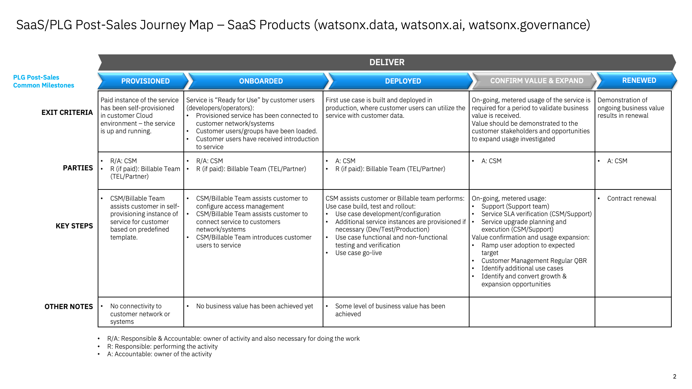

import {Link} from 'gatsby'

<Row>
<Column>

<InlineNotification kind="warning">

**Note:**

<ul>
<li>All watsonx <strong>PLATFORM SaaS</strong> deployment threshold automation is under evaluation.
<ul>
<li>CSMs mark customers deployed in a Growth Plan with manager sign-off.</li>
<li>Submit <a href='https://ibm.biz/watsonxdeploymentrequest' target='_blank' rel='noreferrer noopener'>the approval form</a> for WW reviews and validation. The status of approval will be communicated through email.</li>
</ul>
</li>
<li><strong>AI Assistants and APIs</strong>(NON-PLATFORM) watsonx <strong>SaaS</strong> products the automated thresholds remain in place. If you are a CSM or market leader who believes your NON-PLATFORM product is deployed but is not reaching the threshold you can ask for an override through approval process as described below. A Growth Plan with manager sign-off must be in place before sending an override request.
<ul>
<li>For override and additional deployment, CSM or market leader should submit <a href='https://ibm.biz/watsonxdeploymentrequest' target='_blank' rel='noreferrer noopener'>the approval form</a>. The status of approval will be communicated through email.</li>
</ul>  
</li>
<li>Only 2024 new SaaS deployments with a success plan will be approved.</li>
<li>Each watsonx product deployed will be counted. i.e. A RAG use case with watsonx Assistant and watsonx.ai count as two deployments.</li>
</ul>
</InlineNotification>

## Contacts

| WW contact | Name | WW contact | Name |
| --- | --- | --- | --- |
| **Customer Success Practice Leaders:** | Campbell Robertson | **Digital Customer Success & PLG:** | Felipe Sutantri |
| **Technology Expert Labs Delivery:** | Suzanne Golledge | **Technology Expert Labs Solution Engineering:** | Bala Vaithyalingam |
| **SRE:** | TBD | | |

</Column>
</Row>

<Row className="resource-card-group">

<Column colMd={4} colLg={4} noGutterSm>
<ResourceCard
      subTitle="Give your client a view of sensitive data throughout the org"
      title="OpenPages upgrade acceleration"
      href='/common/acceleration-plays/openpages-upgrade/'>

</ResourceCard>

</Column>

<Column colMd={4} colLg={4} noGutterSm>
<ResourceCard
      subTitle="Expand deployments using watsonx.goverance to enhance support model risk governance"
      title="watsonx.governance acceleration"
      href='/common/acceleration-plays/watsonx-gov-play/'>

</ResourceCard>

</Column>

<Column colMd={4} colLg={4} noGutterSm>
<ResourceCard
      subTitle="Compute and storage services for Watson AI, data and governance and watsonx.data"
      title="watsonx & Fusion acceleration"
      href="/common/acceleration-plays/watsonx-fusion-play/">

</ResourceCard>

</Column>
</Row>

<Row> 
<Column colMd={9} colLg={9}>

## Overview
As a CSM, your focus is to guide and nurture your customers who have a watsonx.governance SaaS entitlement.  Your job is to guide the customer with provisioning through to onboarding, help with their first use case, and continue to expand their use cases.

</Column>
</Row>

<Row>
<Column>

| FAQ | Answer |
| --- | --- |
| What is the relationship name in Gainsight? | IBM Cloud |
| Which Clouds does this product run on? | IBM Cloud |
| How is watsonx.governance SaaS sizing calculated? | <a href='https://ibm.seismic.com/Link/Content/DC2hBQQR9V4J287VVQBJM2RVGjmV' target='_blank' rel='noreferrer noopener'>watsonx.governance sizing questionnaire</a> |
| Who can help my customer with billing/invoicing questions? | Snehal Gawas |
| Where is the documentation? | <a href='https://dataplatform.cloud.ibm.com/docs/content/wsj/analyze-data/xgov-plan.html?context=wx&audience=wdp' target='_blank' rel='noreferrer noopener'>IBM watsonx as Service documentation</a> |
| Are the SaaS capabilities different from the on-prem offering? | TBD when on-prem is GA'd |
| Does watsonx.gov SaaS run on OpenShift? | No IBM Cloud (IKS) |
| Does watsonx.gov SaaS count as OpenShift Deployment? | No |
| Is watsonx.governance SaaS consumable or ratable revenue? | Consumable. The unit of consumption is ratings. |
| Who triggers deployment? | Until the end of 2Q, CSMs can mark customers deployed in a Growth Plan with manager sign-off. |

</Column>
</Row>

<Row> 
<Column colMd={9} colLg={9}>

### CSM Scorecard Milestones based on usage

SaaS milestones for the CSM Scorecard are based on usage. To progress from Planning to Deploying to Deployed, see <Link to='/common/saas-growth/#data-and-ai-saas-milestones-based-on-usage'>Data and AI milestones based on usage</Link>.

<InlineNotification>

**Note: the usage-based milestones are not automated in Gainsight; the Growth Plan project stages will be used to determine milestone status. Deployed growth plans require a success plan review by a manager before being counted in the CSM scorecard.** 

</InlineNotification>

</Column>
</Row>

<Row>
<Column>

<Accordion>
<AccordionItem title="SaaS adoption journey insights">
SaaS has an additional level of insights that are used to track the adoption journey. These provide an additional level of detail specifically for SaaS adoption.  For watsonx.governance, they are shown in the table below

| 
Insight
 | 
Description
 |
| --- | --- | --- | --- |
| Paid Provisioned | Customer has purchased the product |
| Paid Onboarding Progress | IBM Cloud Resource and Access Groups Created |
| Paid Onboarded | Completion of the IBM Cloud Onboarding Checklist |
| Paid Deployed | At least one model is being evaluated on an ongoing basis |
</AccordionItem>
</Accordion>

</Column>
</Row>

<Row> 
<Column colMd={9} colLg={9}>

### watsonx.gov Product Feature Adoption and Value Realized Indicators
Product Feature Adoption and Value Realized Indicators are instrumented in the product to show the capabilities and features that the customer is using. This information can be used to determine the level of adoption that has taken place and ensure that the customer is receiving full business value from the product. See below for novice, intermediate and advanced level indicators along with an asset listing the value proposition, expected benefits, considerations for implementation and metrics of success.

</Column>
</Row>

<Row> 
<Column>

<Accordion>
<AccordionItem title="Novice level indicators DRAFT">

| Product Feature | Description |
| --- | --- |
| OpenScale Service Instance | To provision and launch a watsonx.governance service instance |
| Evaluation of Model | Track and Measure outcomes in your AI Models on an Adhoc basis |
</AccordionItem>

<AccordionItem title="Intermediate level indicators DRAFT">

| Product Feature | Description |
| --- | --- |
| OpenScale Service Instance | To provision and launch a watsonx.governance service instance |
| Evaluation of Model | Track and Measure Outcomes in your AI Models |
| Evaluating Prompt Templates in Projects| Managing Payload Data, Managing Feedback Data, Sending Model Transactions |
| Evaluating Prompt Templates in Deployment Spaces | You can evaluate prompt templates in projects to measure the performance of foundation model tasks and understand how your model generates responses.|

</AccordionItem>

<AccordionItem title="Advance level indicators DRAFT">

| Product Feature | Description |
| --- | --- |
| OpenScale Service Instance | To provision and launch a watsonx.governance service instance |
| Evaluation of Model | Track and Measure Outcomes in your AI Models |
| Evaluating Prompt Templates in Projects| Managing Payload Data, Managing Feedback Data, Sending Model Transactions |
| Evaluating Prompt Templates in Deployment Spaces | You can evaluate prompt templates in projects to measure the performance of foundation model tasks and understand how your model generates responses.|
| Configuring model evaluations | Configure watsonx.governance evaluations to generate insights about your model performance. |
| Governing Assets in AI Use Cases | Create an AI use case to track and govern AI assets from request through production. Factsheets capture details about the asset for each stage of the AI lifecycle to help you meet governance and compliance goals. |

</AccordionItem>

</Accordion>

</Column>
</Row>

<Row> 
<Column colMd={9} colLg={9}>

## Post-sales journey 
As a CSM with a customer who has a watsonx.gov SaaS entitlement, it is your responsibility to help the customer adopt the product, bring use cases into production and renew their subscriptions.
The diagram shows the watsonx.ai SaaS post-sales journey at a high level. Each section is broken down in detail with links to assets below.

</Column>
</Row>

<Row> 
<Column>

### Provisioned

| **Led by** | **Outcome** | **Assets & Activities** |
| --- | --- | --- | 
| IBM CSM (utilizing Billable Services if the customer has paid) | Customer has access to IBM Cloud and watsonx.governance service (Tile). | **Sizing and planning**   The use case(s) that the customer wants to address with watsonx.data will determine the configuration of the runtime environment and should be determined before the environment is provisioned. Refer to the steps in the <Link to='/common/acceleration-plays/watsonx-gov-play'>watsonx.gov Acceleration Play</Link>. that covers sizing to determine what will need to be provisioned.    **Provisioning the service**  Use the <a href='https://www.ibm.com/docs/en/watsonx-as-a-service?topic=governing-ai-assets'>Getting Started</a> section of the watsonx.gov Documentation along with the <a href='https://ibm.ent.box.com/s/vt5bhdeh8pq65j20wlez3f0b5ias0m0p' target='_blank' rel='noreferrer noopener'>CS IBM Cloud onboarding guide</a> to guide your customer through the process of provisioning the watsonx.gov service.    A <a href="https://ibm.box.com/s/clowrj2uc2g5cnjg2ycas9wm7j95rfep" target='_blank' rel='noreferrer noopener'>Welcome Email Template</a> is available and can be used to introduce yourself to your client and provide links to the product documentation, how to raise a support ticket, how to join the watsonx Community and enablement material. |

### Onboarded

| **Led by** | **Outcome** | **Assets & Activities** |
| --- | --- | --- | 
| IBM CSM (utilizing Billable Services if the customer has paid) | Customer has added wastson.governance service. | - <a href='https://cloud.ibm.com/docs/overview?topic=overview-get-started-checklist' target='_blank' rel='noreferrer noopener'>Getting started on IBM Cloud checklist</a> provides a guide to navigate the available documentation to set up your account, secure your cloud resources, and track costs.  - <a href='https://cloud.ibm.com/docs/billing-usage?topic=billing-usage-subscription_code'  target='_blank' rel='noreferrer noopener'>Applying the watsonx subscription code</a>   - <a href='https://cloud.ibm.com/docs/framework-financial-services?topic=framework-financial-services-onboarding-to-catalog' target='_blank' rel='noreferrer noopener'> Onboard to the IBM Cloud catalog</a> shows how to interact with the IBM Cloud catalog listing IBM and third-party services and software you can create.   **Next steps:**  watsonx.governance SaaS Onboarding, Nurture Steps to be added in Q124.  **Nurture opportunities**  TBD |

### Deployed

| **Led by** | **Outcome** | **Assets & Activities** |
| --- | --- | --- | 
| CSM (utilizing Billable Services if the customer has paid) | The client has created a solution and has moved to operate the solution with consistent usage. | **Create/enhance the solution**  CSMs should utilize billable services from Technology Expert Labs to design and implement the solution for the customer. CSMs that have customers that want to perform the first model assessment and implementation without the support of Technology Expert Labs will need to provide support themselves using experience gained from completing the <a href='https://yourlearning.ibm.com/activity/PLAN-08E169AA237E' target='_blank' rel='noreferrer noopener'>Level 2</a>, <a href='https://yourlearning.ibm.com/activity/PLAN-07AEB3D2563D' target='_blank' rel='noreferrer noopener'>Level 3</a> and Level 4 (TBD) enablement classes.    **Operate the solution**  CSMs should utilize billable services from Technology Expert Labs to instruct the customer on how to operate the solution for the customer. CSMs that have customers that want to perform the first model assessment and implementation without the support of Technology Expert Labs will need to provide support themselves using experience gained from completing the <a href='https://yourlearning.ibm.com/activity/PLAN-08E169AA237E' target='_blank' rel='noreferrer noopener'>Level 2</a>, <a href='https://yourlearning.ibm.com/activity/PLAN-07AEB3D2563D' target='_blank' rel='noreferrer noopener'>Level 3</a> and Level 4 (TBD) enablement classes.    **Technology Expert Labs Offerings:**   <a href='https://ibm.seismic.com/Link/Content/DCFmc2WfqmmTqGMJhTRjhVccJGQ3' target='_blank' rel='noreferrer noopener'>**Build watsonx.governance:**</a> The Build watsonx.governance offering is designed to help clients evaluate, validate, and monitor their Large Language Models (LLMs) to manage the risks they pose.   **Custom SOW:** Contact a local Solution Architect or Practice Lead to engage with us. or Engage with your TEL Service Seller.    **Technology Expert Labs Engagement Model**   TBD    **Nurture opportunities**  After the Product Led Growth interface in Gainsight is configured later in 2024, you will be able to track the activities that the customer is performing in watsonx.governance. This enables you to determine whether the customer needs additional assistance through their journey. For instance, if you see no model assessments. | 

### Confirm Value & Expand

| **Led by** | **Outcome** | **Assets & Activities** |
| --- | --- | --- | 
| CSM | Customer has realized value and expanding usage to new business units. | **Nurture relationship**  Set up a <Link to='/onboard/executive-business-review/' target='_blank' rel='noreferrer noopener'>EBR (executive business review)</Link> with client sponsor and executives to align and review the adoption, value seen and confirm the customer's strategic goals have been met.    **Identify risk/opportunity**  After the Product Led Growth interface in Gainsight is configured later in 2024, you will be able to track the activities that the customer is performing in watsonx.governance. This allows you to determine whether the customer is continuing to use the product or whether usage is dropping. |

### Expand solution

| **Led by** | **Outcome** | **Assets & Activities** |
| --- | --- | --- | 
| CSM | Customer has realized value and expanding usage to new business units. | A CSM should continue to drive usage of Technology Expert Labs services and look for opportunities to add more use cases using the <Link to='/common/acceleration-plays/watsonx-gov-play'>watsonx.gov Acceleration Play</Link>. A CSM should continue to drive usage of Technology Expert Labs services, look for opportunities to add more automation of actions, and try to expand the adoption with other business units. | 

## Renewed

| **Led by** | **Outcome** | **Assets & Activities** |
| --- | --- | --- | 
| CSM and/or Technical Sales | The client has confirmed that they are using the product and will continue to renew their entitlement. | N/A |

</Column>
</Row>
