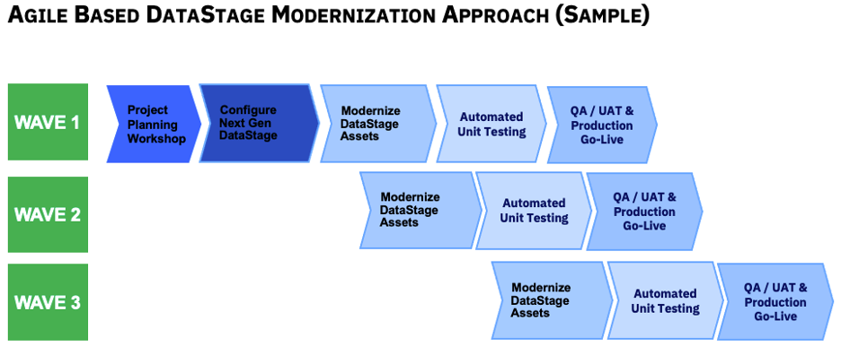

import {Link} from 'gatsby';
import FileLink from '../../../components/FileLink';

This playbook provides a structured approach for modernizing DataStage on IBM Cloud Pak for Data. Each step includes links to detailed documentation and resources to facilitate a smooth migration process.

<Row>
<Column colMd={9} colLg={9}>

## Cloud Pak for Data and DataStage NextGen architecture and environment

| Architecture/Environment | Description | Resource |
| --- | --- | --- |
| **Topology** | Understand the overall architecture, including how DataStage integrates with Cloud Pak for Data on OpenShift.  | <a href='https://www.ibm.com/docs/en/cloud-paks/cp-data/4.8.x?topic=planning-architecture' target='_blank' rel='noreferrer noopener'>Architecture for IBM Cloud Pak for Data - IBM Documentation</a> |
| **Storage** | Plan and configure the necessary storage for DataStage. | <a href='https://www.ibm.com/docs/en/cloud-paks/cp-data/4.8.x?topic=architecture-storage' target='_blank' rel='noreferrer noopener'>Storage architecture for IBM Cloud Pak for Data - IBM Documentation.</a> |
| **Security** | Implement security best practices and configurations.  | <a href='https://www.ibm.com/docs/en/cloud-paks/cp-data/4.8.x?topic=planning-security-considerations' target='_blank' rel='noreferrer noopener'>Security on Cloud Pak for Data - IBM Documentation</a> |
| **Installation of CP4D** | Follow the IBM Documentation for installing IBM Cloud Pak for Data. | <a href='https://www.ibm.com/docs/en/cloud-paks/cp-data/4.8.x?topic=installing' target='_blank' rel='noreferrer noopener'>Installing IBM Cloud Pak for Data - IBM Documentation</a> |

## DataStage modernization methodology

DataStage modernization is the process of taking customers from IBM Infosphere DataStage, IBM Infosphere QualityStage, or IBM Information Server and moving them to DataStage next-gen running on Cloud Pak for Data on OpenShift.

This diagram shows the DataStage modernization methodology at a high level. Each section is
broken down in detail with links to technical assets, product documentation and tips and
tricks.

There are two recommended approaches to modernization: the Big Bang and the agile approach.  The approach will depend on the scope of the modernization and the number of DataStage projects.  

* If the customer has only a few DataStage projects with dependencies between them, the Big Bang approach is recommended.  
* If the customer has many DataStage projects with no dependencies, use the agile/phased approach.  This requires the customer to identify DataStage projects for each phase. 

</Column>
</Row>

<Row>

<Column>

-----

## Implementation phases

-----

### Project Planning Workshop

Project planning is an important step; it helps form the steps needed to complete a project successfully. Planning helps teams avoid potential problems and roadblocks to ensure the project stays on track.  During this workshop, the goal is to confirm the scope and identify tasks, people, milestones and timelines.  Below are some topics you will cover in this phase.

* **Review Engagement Objectives, Expectations and Timelines**  

* **Review the DataStage Modernization Assessment** 

During the services presale cycle, TEL would have already performed the DataStage Modernization Assessment.  The report shows the different types of DataStage assets that might require conversion and migration (Parallel Jobs, Server Jobs, Sequencers, Shared Containers, Server Routines, Type and number of scripts).  The output of this step will be an input to build the project plan.  Here is a sample <a href='https://ibm.box.com/s/9uixx7ngpptlu6rqm4toevv23tc0r9ty' target='_blank' rel='noreferrer noopener'>DataStage Modernization Assessment Report</a>

* **Perform Additional Analysis** 
After reviewing the DataStage Modernization Report, you need to perform a detailed analysis of the following:
* Deprecated stages
* Source and target systems interfacing with the DataStage solution
* Types and numbers of shell scripts needing to be in scope
* Custom code (build ops etc)

* **DataStage Project Plan Template** 
Use the <a href='https://ibm.box.com/s/si1sn2fgbyu1m4gsof15oivy923kf0bz' target='_blank' rel='noreferrer noopener'>DataStage Modernization Project Plan Template</a> to outline the steps and timeline for the modernization process.  The project manager should leverage this template to build a more detailed project plan specific to a given client.  Leverage the output of the above steps to build the project plan.

</Column>
</Row>

<Row>

<Column>

-----

### Configure and Install

* **Installation of NextGen DataStage Services**  
Refer to the <a href='https://www.ibm.com/docs/en/cloud-paks/cp-data/4.8.x?topic=datastage-installing' target='_blank' rel='noreferrer noopener'>IBM Documentation for installing DataStage.</a>

* **Installation of MettleCI**  
   *	MettleCI S2PX 
   If the customer has DataStage server jobs, you should use S2PX from Data Migrators to convert server jobs to parallel jobs.  Installation Steps

   * MettleCI Workbench 
   <a href='https://datamigrators.atlassian.net/wiki/x/FwBGYQ' target='_blank' rel='noreferrer noopener'>MettleCI Installation Topologies</a>

</Column>
</Row>

<Row>

<Column>

-----

### Modernize DataStage assets

* **DataStage Jobs with Deprecated Stages** 

If the customer has some deprecated stages in IIS 11.5.x - 11.7.x, you need to use the Connector Migration Tool to update these stages before you export/import these jobs to DataStage NextGen. See the <a href='https://www.ibm.com/docs/en/iis/11.3?topic=connectivity-connector-migration-tool' target='_blank' rel='noreferrer noopener'>Connector Migration Tool - IBM Documentation</a>

* **Server to Parallel Job Conversion**

If the customer has DataStage server jobs, you should use S2PX from Data Migrators to convert server jobs to parallel jobs.  The conversion should be performed on the current IIS environment; after the conversion, you can leverage MettleCI Workbench to test all converted jobs. 

Refer to <a href='https://datamigrators.atlassian.net/wiki/spaces/S2PX/pages/1978630297/What+is+S2PX' target='_blank' rel='noreferrer noopener'>What is S2PX? - Server to Parallel Migration - Confluence (atlassian.net)</a> for guidance on converting server jobs to parallel jobs and updating related scripts.  

* **Server Routine Conversion**

#### Migrate DataStage jobs and sequences

After you perform the above migration steps in IIS environment, complete the following tasks to migrate DataStage. After you import the ISX file, other tasks might apply, depending on the connections, stages, and other components of your migrated jobs.

1. <a href='https://www.ibm.com/docs/en/SSQNUZ_4.8.x/dstage/dsnav/topics/migration.html#migrating-datastage__isx' target='_blank' rel='noreferrer noopener'>Create and import the ISX file</a>
2. <a href='https://www.ibm.com/docs/en/SSQNUZ_4.8.x/dstage/dsnav/topics/migration.html#migrating-datastage__connections' target='_blank' rel='noreferrer noopener'>Migrate connections</a>
3. <a href='https://www.ibm.com/docs/en/SSQNUZ_4.8.x/dstage/dsnav/topics/migration.html#migrating-datastage__stages' target='_blank' rel='noreferrer noopener'>Migrate stages</a>
4. <a href='https://www.ibm.com/docs/en/SSQNUZ_4.8.x/dstage/dsnav/topics/migration.html#migrating-datastage__parameters' target='_blank' rel='noreferrer noopener'>Review the parameter sets and PROJDEF values</a>
5. <a href='https://www.ibm.com/docs/en/SSQNUZ_4.8.x/dstage/dsnav/topics/migration.html#migrating-datastage__dsjob' target='_blank' rel='noreferrer noopener'>Update scripts that use the dsjob command line interface</a>
6. <a href='https://www.ibm.com/docs/en/SSQNUZ_4.8.x/dstage/dsnav/topics/migration.html#migrating-datastage__sequence-jobs' target='_blank' rel='noreferrer noopener'>Migrate sequence jobs</a>
7. <a href='https://www.ibm.com/docs/en/SSQNUZ_4.8.x/dstage/dsnav/topics/migration.html#migrating-datastage__subroutines' target='_blank' rel='noreferrer noopener'>Rewrite the routine code for before-job and after-job subroutines</a>
8. <a href='https://www.ibm.com/docs/en/SSQNUZ_4.8.x/dstage/dsnav/topics/migration.html#migrating-datastage__env' target='_blank' rel='noreferrer noopener'>Review the environment variables</a>
9. <a href='https://www.ibm.com/docs/en/SSQNUZ_4.8.x/dstage/dsnav/topics/migration.html#migrating-datastage__other' target='_blank' rel='noreferrer noopener'>Update data types, data sets, file sets, dsenv files, and user-defined functions</a>

#### Update Shell Scripts that use dsjob

<a href='https://www.ibm.com/docs/en/cloud-paks/cp-data/4.8.x?topic=data-migrating-datastage-jobs' target='_blank' rel='noreferrer noopener'>Migrate DataStage jobs and sequences</a>

</Column>
</Row>

<Row>

<Column>

-----

### Unit testing

Leverage the MettleCI Test Harness for unit testing. Follow the <a href='https://datamigrators.atlassian.net/wiki/spaces/MCIDOC/pages/470319149/Configuring+Jobs+for+Unit+Testing' target='_blank' rel='noreferrer noopener'>Configuring Jobs for Unit Testing - MettleCI Documentation - Confluence (atlassian.net)
Documentation</a>for configuring jobs for unit testing.

</Column>
</Row>

<Row>

<Column>

-----

### Integration testing

Conducted by the Integration team to ensure all components work together seamlessly.

-----

### Production go-live

</Column>

</Row>

