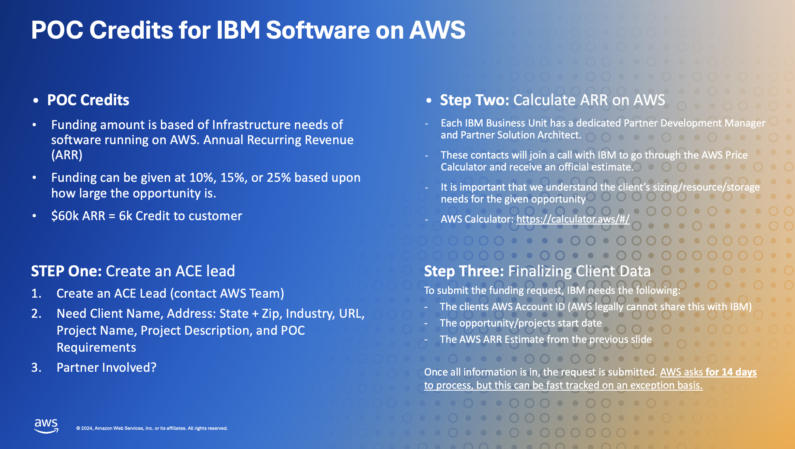
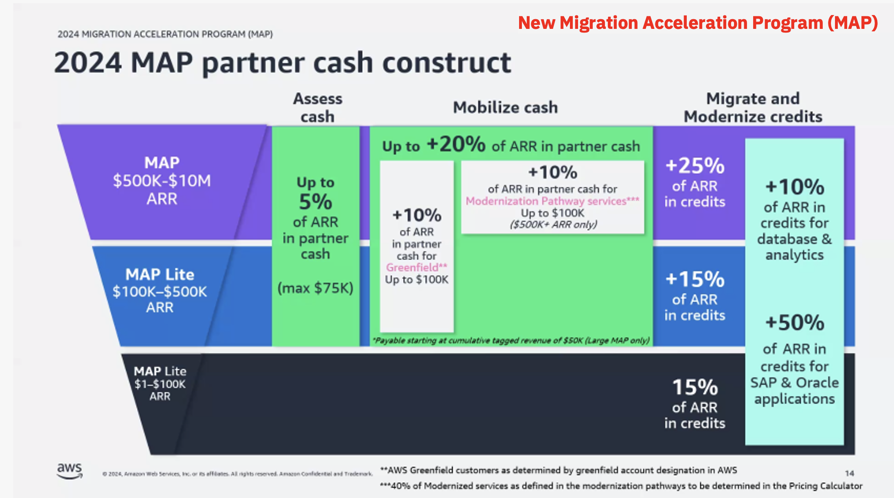
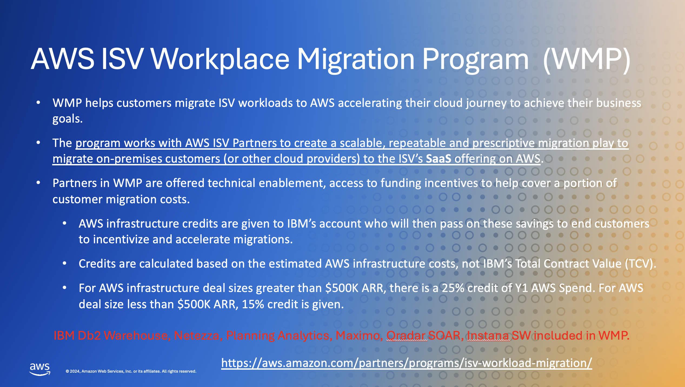

import {Link} from 'gatsby'

<Row>
<Column colMd={9} colLg={9} noGutterMdLeft>

## The Amazon and IBM partnership

The IBM, AWS, and Red Hat partnership brings a unique combination of leading enterprise AI, cloud, infrastructure, and open-source technologies delivered with deep IBM consulting expertise. 
This enables companies to quickly and responsibly scale AI workloads using a comprehensive stack of Generative AI - composed of Amazon Bedrock and IBM watsonx running on AWS Cloud and across hybrid cloud environments.

Step 1. Acquire IBM software
* From IBM
  * Direct
  * Partner Reseller

* AWS Marketplace
  * 330,000 customers use the AWS marketplace monthly to buy software 
  * Over $100+ billion in AWS committed spend 

Step 2. Deploy on AWS 
* AWS maintains its lead as the number one Cloud provider with 31% of the share of the market
* Microsoft is gaining share

## The role of the CSM in the AWS partnership

As a CSM, your goal is to get your customer's solution deployed. There are IBM and AWS resources that you can use to get your customer deployed. To ensure success, you need to

* Understand your customer's goals and use case  
  *	Do you know the AWS account leader and team?  The AWS team can be a great resource for relationships and growth opportunities.

* Understand how the product was sold and the implications. The entitlement might have been sold by IBM or through the AWS Marketplace. 

* Get help with a deployment. Use the AWS account team's client relationship to support deployments, expand IBM SW footprints, and grow revenue.   
The AWS web services team has incentives focused on the utilization of the AWS cloud (ARR).  IBM transactional sales need to be utilized on AWS before the AWS team earns these incentives.  The IBM CSM incentives are focused on deployments.  Therefore both teams are highly aligned to work together. The AWS team will also want to work with the IBM sales team (including CSMs) to grow existing technology deployment footprints to grow ARR.

* If you are new to this customer, review <Link to='/onboard/understand-client-it-landscape/'>Learn about your customer</Link>

</Column>

<Column colMd={3} colLg={3} noGutterMdLeft>

  

<Aside>

**Customer Success Practice Leader:** Jeffrey Frick 
**Weekly office hours:** coming soon 
**Blog:** coming soon  
**Learn:** <a href='https://www.ibm.com/aws' target='_blank' rel='noreferrer noopener'>IBM and AWS partnership</a> &plus; <a href='https://aws.amazon.com/partners/ibm/' target='_blank' rel='noreferrer noopener'>AWS and IBM consulting partnership</a> 
**Roadmap:** <a href='https://ibm.seismic.com/Link/Content/DCMFgdgWT8mD6G9QW99XJ7qqJDVB' target='_blank' rel='noreferrer noopener'>IBM SaaS on AWS</a> 
**Tech Zone:** with Demo environments and enablement 

</Aside>

<Aside>

**Download and watch the video: CSMs & AWS**

<a href='https://ibm.box.com/shared/static/dcobnbzvko5mqxzzq6titu9yxdvy7qrb.mp4'>Grow deployments on AWS</a>

</Aside>

</Column>
</Row>

<Row>
<Column colMd={9} colLg={9} noGutterMdLeft>

## How was the IBM product sold?

**Did the client purchase the product through IBM?**

Clients can buy IBM software solutions from IBM and deploy them on AWS platforms. 
Does the client have an existing ELA? If so, they will likely have a Bring Your Own Software License (BYOSL) situation. If they have an existing ELA and would like to move IBM SW to AWS or purchase IBM software from the AWS Marketplace, you need to engage the IBM Deal Maker responsible for the ELA. To prepare for your discussion with the IBM Deal Maker, be sure you fully understand your client's desires in terms of where they want to deploy and who they want to buy from.

Do they want to purchase through the AWS Marketplace? If they already have IBM SW, do they want to migrate to AWS via BYOSL?
You will need to understand the type of SW desired if it is a change from subscription to SaaS. As an FYI: To use the BYOSL feature in AWS, the client will need to have the Proof Of Entitlement (POE). The Deal Maker can also advise on the POE status of the IBM SW.

If you need help with this process, contact Jeffrey.Frick@ibm.com.

</Column>

</Row>

<Row>
<Column colMd={9} colLg={9} noGutterMdLeft>

**Did the client buy through the AWS Marketplace?** 
There are several advantages for the client if they buy through the AWS Marketplace:
* Opportunity to tap into client's committed spend
* Does the client have an AWS Enterprise Discount Program (EDP)? If yes, there are incentives to buy IBM SW through AWS Marketplace.
* Deploy faster and reduce cost with preconfigured images and SaaS
* Nurture relationships with new and existing partners
* AWS sellers are incentivized to help you sell IBM solutions on the AWS Marketplaces.
* Leverage connections with accounts

</Column>

</Row>

<Row>
<Column colMd={9} colLg={9} noGutterMdLeft>

**What do I need to know?**

* IBM software is available on the AWS Marketplace (Current product listings and part numbers can be found on the <a href='https://ibm.seismic.com/Link/Content/DCXPTD4hgTMhhGfMjqWBb7X6T77B' target='_blank' rel='noreferrer noopener'>Hyperscaler Seismic Page</a>
)
  * Subscription License & Subscription License Upgrade 
  * SaaS 
* Purchase Options for IBM SW on AWS Market Place
    * Direct, in 95% of cases the IBMer controls the marketplace transaction via SQO and submits the "private offer": marketplace private offer in SQO steps (No BP) 
    * Via IBM Partner Reseller:  https://ibm.seismic.com/Link/Content/DCRb7d2Dj79HFG7RCgQD443VPgP3

</Column>

</Row>

<Row>
<Column colMd={9} colLg={9} noGutterMdLeft>

## Request help with the deployment project

### IBM Resources

* <a href='https://ibm.seismic.com/Link/Content/DCDgdXMqVXXR7GmQC2JffBhTQXfV' target='_blank' rel='noreferrer noopener'>IBM technology on AWS:</a> click on the functional area of interest: Cross Brand, Watson X, Data and AI, Automation, Sustainability, Security, modernization and Redhat on AWS.  In each section, you will find an Overview, Publications/Blogs /Tutorials, Demos and Deployment Guides. (If more information is needed, contact Jeff Frick who will connect you with the appropriate SME.)

* Review the <a href='https://ibm.seismic.com/Link/Content/DCXPTD4hgTMhhGfMjqWBb7X6T77B' target='_blank' rel='noreferrer noopener'>Hyperscaler Seismic Page</a>.

* Review the following for additional information:
  * <a href="https://aws.amazon.com/partners/ibm/" target='_blank' rel='noreferrer noopener'>IBM on AWS Partner Page</a>
  * <a href="https://mediacenter.ibm.com/media/1_t126u2ya" target='_blank' rel='noreferrer noopener'>Watsonx.governance: Monitor AI models with Amazon SageMaker</a>
  * <a href="https://aws.amazon.com/blogs/ibm-redhat/accelerate-data-modernization-and-ai-with-ibm-databases-on-aws/" target='_blank' rel='noreferrer noopener'>Accelerate Data Modernization and AI with IBM Databases on AWS</a>
  * <a href="https://aws.amazon.com/blogs/apn/making-data-driven-decisions-with-ibm-watsonx-data-an-open-data-lakehouse-on-aws/" target='_blank' rel='noreferrer noopener'>Making Data-Driven Decisions with IBM watsonx.data, an Open Data Lakehouse on AWS</a>
  * <a href="https://www.youtube.com/watch?v=8L97KvQqzI8" target='_blank' rel='noreferrer noopener'>IBM watsonx.data on AWS</a>

* Contact the <a href='https://w3.ibm.com/w3publisher/aws-guild' target='_blank' rel='noreferrer noopener'>AWS Guild</a> to enable the IBM Technical Sales organization to accelerate AWS knowledge and skills development, co-creation for IBM Technology on AWS, pre- and post-sales opportunity support, and technology demonstration and marketing representation. 

* Contact Jeff Frick to get support from IBM teams.

</Column>

<Column colMd={3} colLg={3}>

 

<Aside>

**IBM technology on AWS sales kits**

<a href='https://ibm.seismic.com/Link/Content/DCDgdXMqVXXR7GmQC2JffBhTQXfV' target='_blank' rel='noreferrer noopener'>IBM technology on AWS</a> 

<a href='https://ibm.seismic.com/Link/Content/DC62pqpPQ389d89W3hcDWPG7dG28' target='_blank' rel='noreferrer noopener'>Data and AI on AWS</a> 

<a href='https://ibm.seismic.com/Link/Content/DCb7MWfH4bBXT8CPp32qRRdgW4B8' target='_blank' rel='noreferrer noopener'>Automation on AWS</a> 

<a href='https://ibm.seismic.com/Link/Content/DCDgdXMqVXXR7GmQC2JffBhTQXfV' target='_blank' rel='noreferrer noopener'>IBM Security on AWS</a> 

<a href='https://ibm.seismic.com/Link/Content/DCDgdXMqVXXR7GmQC2JffBhTQXfV' target='_blank' rel='noreferrer noopener'>IBM Sustainability on AWS</a> 

</Aside>

<Aside>

**IBM resources available**

**Blue Partner team** (Subhash Srikantiah and Sunil Gajula) is available to help you. Contact Jeff Frick to request the support you need from this team.

<a href='https://w3.ibm.com/w3publisher/aws-guild' target='_blank' rel='noreferrer noopener'>AWS Guild:</a> Self-service, guided, and facilitated access to AWS and IBM Technology on AWS skills and experience. Helps address gaps in technical knowledge regarding partnership differentiation.  

</Aside>

</Column>

</Row>

<Row>
<Column colMd={9} colLg={9} noGutterMdLeft>

### AWS Resources 

AWS provides resources to help you deploy IBM products on AWS. There are AWS Partner Solution Architects (trained on IBM SW) available as well as support for a POC and other programs to assist you with migration.

### How can I access AWS resources?

* **Step 1:** Register the deal through: https://w3.ibm.com/w3publisher/oem-deal-registration-portal/aws  Be sure to complete the Question: “Primary need from “AWS”.  The IBM and AWS teams can help you complete the registration.  Contact Jeff Frick who can bring in IBM and AWS resources to support you.
  * When requesting a POC you will need to complete a POC Project Plan.  See attached BOX folder and contact Jeff Frick for assistance.
  * After the deal is registered, we will also connect to the AWS Account team at the clients and the AWS Partner Solution Architect to align on client contacts and strategy.
* **Step 2:** The client needs to decide to migrate via BYOL or purchase through AWS Marketplace.

</Column>

<Column colMd={3} colLg={3}>

  

<Aside>

**AWS resources available**

<a href='https://w3.ibm.com/w3publisher/oem-deal-registration-portal/aws' target='_blank' rel='noreferrer noopener'>Request free AWS assistance</a>  

**AWS Partner Solution Architects** (trained on IBM SW): Contact Jeff Frick for the appropriate AWS contact for your technology.

</Aside>

</Column>

</Row>

<Row>
<Column colMd={5} colLg={5} noGutterMdLeft>

**POC Credits**
* Recommended for all on-prem SW moving to AWS.  Taking a portion of SW and deploying it on AWS will allow you to confirm consistent performance from on-prem to AWS.
* Add a section about on-prem to AWS BYOSL licensing (enablement coming in the future).
* POC request Form required.  Contact Jeff Frick to help with the registration process.

</Column>
<Column colMd={7} colLg={7} noGutterMdLeft>

</Column>
</Row>

<Row>
<Column colMd={5} colLg={5} noGutterMdLeft>

**Migration Acceleration Program (MAP)**
* After a client decides to deploy IBM SW on AWS, the MAP can be provided to the Service provider migrating.
* An AWS sizing calculator needs to be completed to determine the credits provided.  Contact Jeff Frick for assistance.

</Column>
<Column colMd={7} colLg={7} noGutterMdLeft>

</Column>
</Row>

<Row>
<Column colMd={5} colLg={5} noGutterMdLeft>

**Workplace Migration Program (WMP)**

The program works with AWS ISV Partners to create a scalable, repeatable, and prescriptive migration play to migrate on-premises customers (or other cloud providers) to the ISV’s SaaS offering on AWS.   
 
The IBM SW currently included in the program are Db2 Warehouse, Netezza, Planning Analytics, Maximo, Qradar SOAR and Instana SW.  Contact Jeff Frick for assistance.

</Column>
<Column colMd={7} colLg={7} noGutterMdLeft>

</Column>
</Row>

## Top IBM SW opportunities in AWS Partnership

* <a href='https://ibm.seismic.com/app#/doccenter/861ea1fd-99e0-44d7-9135-85412e5c28d1/doc/%252Fdd3359e5f7-a856-a91b-7688-41024b2ac637%252FdfNTY4NmVhOWItY2RkNS04ZWY3LTZkNzItZTQwZjczMWUyMjk1%252CPT0%253D%252CRGF0YSBhbmQgQUk%253D%252FdfOthers%252FdfOTRiYmU4NTQtNWY4NC03Y2QyLWZjYWUtOGIxYmFmZjkyZThk%252CPT0%253D%252CU2FsZXMga2l0%252Flfe68f60cc-5730-44e3-a300-97d36c39b21b//?mode=view&searchId=1284d1d3-a22c-4ef1-8f9f-db8ece9252e5' target='_blank' rel='noreferrer noopener'>Data and AI</a>

* <a href='https://ibm.seismic.com/app#/doccenter/861ea1fd-99e0-44d7-9135-85412e5c28d1/doc/%252Fdd3359e5f7-a856-a91b-7688-41024b2ac637%252FdfNTY4NmVhOWItY2RkNS04ZWY3LTZkNzItZTQwZjczMWUyMjk1%252CPT0%253D%252CSVQgQXV0b21hdGlvbiAmIEFwcCBNb2Rlcm5pemF0aW9u%252FdfOthers%252FdfOTRiYmU4NTQtNWY4NC03Y2QyLWZjYWUtOGIxYmFmZjkyZThk%252CPT0%253D%252CU2FsZXMga2l0%252Flfccb09451-05d0-4fcb-8fd6-096e394829ce//?mode=view' target='_blank' rel='noreferrer noopener'>Automation and integration</a>

* <a href='https://ibm.seismic.com/app?ContentId=fde3b016-728e-4ea6-a42f-36720dad2ecb#/doccenter/5477419a-9474-4c51-94af-b442e9169fab/doc/%252Fdd98c5a3df-6b7c-1d77-6f07-d12e63954c78%252FdfOTRiYmU4NTQtNWY4NC03Y2QyLWZjYWUtOGIxYmFmZjkyZThk%252CPT0%253D%252CU2VsbGVyIGVuYWJsZW1lbnQ%253D%252Flfa42a7f8a-8dbf-48fa-8264-f22c5f873510/grid/?anchorId=782ed48f-b63b-4231-94eb-6ca159b95b26' target='_blank' rel='noreferrer noopener'>Security</a>

* <a href='https://ibm.seismic.com/app?ContentId=fde3b016-728e-4ea6-a42f-36720dad2ecb#/doccenter/5477419a-9474-4c51-94af-b442e9169fab/doc/%252Fdd98c5a3df-6b7c-1d77-6f07-d12e63954c78%252FdfOTRiYmU4NTQtNWY4NC03Y2QyLWZjYWUtOGIxYmFmZjkyZThk%252CPT0%253D%252CU2VsbGVyIGVuYWJsZW1lbnQ%253D%252Flfa42a7f8a-8dbf-48fa-8264-f22c5f873510/grid/?anchorId=4603a6ba-d8c4-4e8e-bec9-cf4dc5c71731' target='_blank' rel='noreferrer noopener'>Sustainability</a>

