<AnchorLinks small>

  <AnchorLink>A1 - Expose</AnchorLink>
  <AnchorLink>A2 - Extend</AnchorLink>
  <AnchorLink>A3 - Co-Locate</AnchorLink>
  <AnchorLink>A4 - Enhance</AnchorLink>
  <AnchorLink>A5 - Refactor</AnchorLink>
  <AnchorLink>B1 - Enable</AnchorLink>
  <AnchorLink>B2 - Virtualize</AnchorLink>
  <AnchorLink>C1 - Respond to Z</AnchorLink>
  <AnchorLink>C2 - Respond to External</AnchorLink>
  <AnchorLink>C3 - Optimize CQRS</AnchorLink>
  <AnchorLink>D1 - Upgrade </AnchorLink>
  <AnchorLink>D2 - Containerize </AnchorLink>
  <AnchorLink>D3 - Lift and Shift </AnchorLink>
  <AnchorLink>D4 - Containerize</AnchorLink>
  <AnchorLink>D5 - Upgrade</AnchorLink>
  <AnchorLink>D6 - Lift and Shift</AnchorLink>
  <AnchorLink>D7 - Lift and Shift</AnchorLink>
  <AnchorLink>D8 - Containerize</AnchorLink>
  <AnchorLink>D9 - Upgrade</AnchorLink>
  <AnchorLink>D10 - Containerize</AnchorLink>
  <AnchorLink>D11 - Lift and Shift </AnchorLink>
  <AnchorLink>D12 - Upgrade</AnchorLink>
  <AnchorLink>E1 - Enhance On-Premise</AnchorLink>
  <AnchorLink>E2 - Enhance On-Cloud</AnchorLink>
  <AnchorLink>E3 - Enhance and Containerize On-Premise</AnchorLink>
  <AnchorLink>E4 - Enhance and Containerize On-Cloud</AnchorLink>
  <AnchorLink>E5 - Enhance On-Premise to Cloud</AnchorLink>
  <AnchorLink>F1 - Foundational Software Upgrade</AnchorLink>
  <AnchorLink>F3 - Competitive Migration</AnchorLink>
  <AnchorLink>G1 - Application Discovery</AnchorLink>
  <AnchorLink>G2 - Enterprise DevOps</AnchorLink>
  <AnchorLink>O1 - Observability Z Subsystems</AnchorLink>
  <AnchorLink>O2 - Observability Anamoly Analytics</AnchorLink>

</AnchorLinks>

## A1 - Expose

<Column colMd={16} colLg={16} noGutterSm>

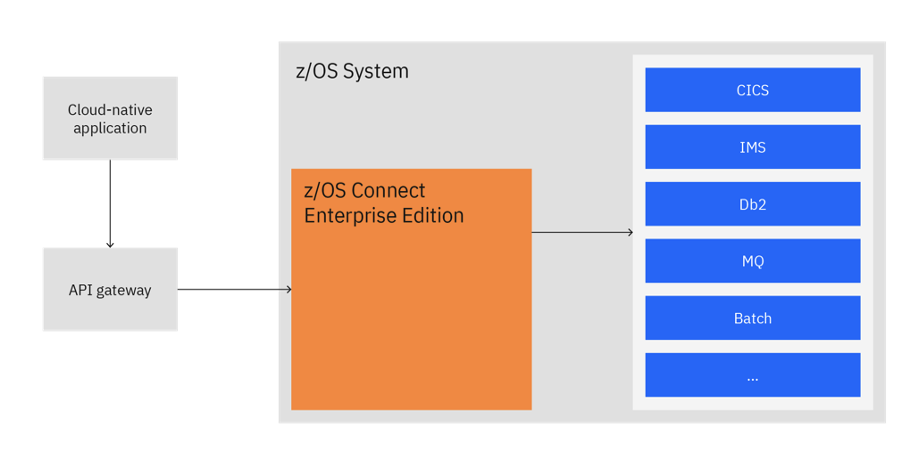

</Column>

### Expose end-user client's core applications via APIs
Scenario:
<Row>

* **Infrastructure Origin:** Any Z Machine
* **Destination Infrastructure:** Distributed/Cloud/Linux on IBM Z
* **Operating System :** z/OS or any flavor of the mainframe operating system

</Row>

<Row>

<Column colMd={16} colLg={16} noGutterSm>

| Scenario A1: Expose | End-User Client's core applications on Mainframe Z has to be exposed via APIs to be consumed by new cloud based/modern applications. Client wants their applications and services can call mainframe data and functions directly through an open standards API interface and scale services with demand. |
| ------ | ------ |
| IBM Solution | Advises client to deploy APIs of their core applications in z/OS Connect EE server so that the modern applications can access those APIs via a gateway. |
| License Ownership | Kyndryl owns the IBM Z Software licenses |
| CSM Role(s) | Software CSM for Kyndryl drives growth opportunity of IBM Z Software |
| CSM Engagement | IBM Software CSM for Kyndryl engages in discussion with Kyndryl and EUC on exposing the core applications via z/OS Connect, IBM Software CSM for Kyndryl hand over to IBM Sales to help customer with the renewals/purchase of z/OS connect, IBM Software CSM for Kyndryl helps collaborate to other IBM support/product teams to help with the issues in Install/Upgrade and on the Product |
| Account Team, Larger IBM and Ecosystem | IBM Sales is consulted on retention and growth of IBM Software licenses with Kyndryl  |
| Production Management | Kyndryl manages and supports the software for the customers and maintain the exposed applications |
| Example | Exposing a COBOL CICS online module using API by leveraging z/OS Connect |

</Column>

</Row>

## A2 - Extend

<Column colMd={16} colLg={16} noGutterSm>

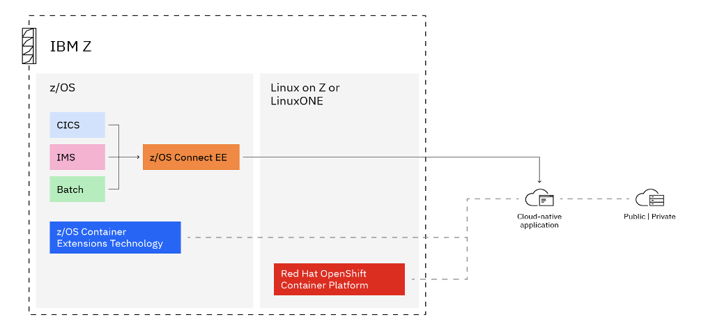

</Column>

### Extend end-user client's core IBM Z applications
Scenario:

<Row>

* **Infrastructure Origin:** Any Z Machine
* **Destination Infrastructure:** Distributed/Cloud/Linux on IBM Z
* **Operating System :** z/OS or any flavor of the mainframe operating system

</Row>

<Row>

<Column colMd={16} colLg={16} noGutterSm>

| Scenario A2: Extend | End-User Client wants to develop new functions of a core mainframe Z application as cloud native. They want to leverage the existing logics build on the core application at the same time want to  develop new functions as cloud native to take advantage of the modern capabilities. |
| ------ | ------ |
| IBM Solution | Advises client to use z/OS connect to enable the communication between the core application and the new cloud native functions. Bring in the considerations of low latency if the new functions are deployed far away from Z. Advocate the use of containerizing the new functions and deploy them close to Z with the help of Open shift or zCX. |
| License Ownership | Kyndryl owns the IBM Z Software licenses |
| CSM Role(s) | Software CSM for Kyndryl drives growth opportunity of IBM Z Software |
| CSM Engagement | IBM Software CSM for Kyndryl engages in discussion with Kyndryl and EUC on exposing the core applications via z/OS Connect, IBM Software CSM for Kyndryl hand over to IBM Sales to help customer with the renewals/purchase of z/OS connect, IBM Software CSM for Kyndryl helps collaborate to other IBM support/product teams to help with the issues in Install/Upgrade and on the Product |
| Account Team, Larger IBM and Ecosystem | - IBM Sales is consulted on retention and growth of IBM Software licenses with Kyndryl  |
| Production Management | Kyndryl manages and supports the software for the customers and maintain the exposed applications |
| Example | The "Extend with cloud-native" pattern shows the process and components that are involved to extend a core application on z/OS, whether CICS®, IMS, or batch, by writing new functions as cloud-native applications.|

</Column>

</Row>

## A3 - Co-Locate

<Column colMd={16} colLg={16} noGutterSm>

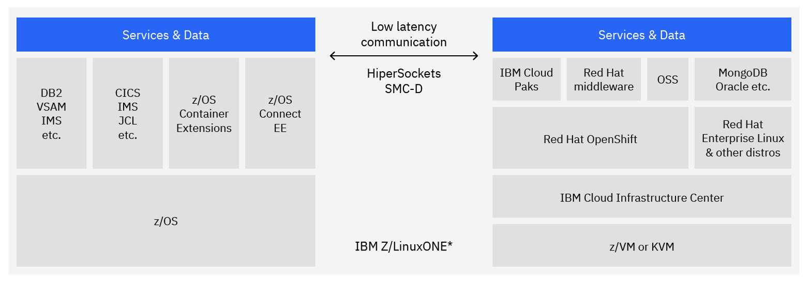

</Column>

### Co-locate end-user client’s newly developed/rewritten IBM Z applications
Scenario:

<Row>

* **Infrastructure Origin:** Any Z Machine
* **Destination Infrastructure:** Distributed/Cloud/Linux on IBM Z
* **Operating System :** z/OS or any flavor of the mainframe operating system

</Row>

<Row>

<Column colMd={16} colLg={16} noGutterSm>

| Scenario A3: Co-Locate | End-User Client is facing issues with high latency and low throughput for the supporting/newly  developed applications  hosted in various environments accessing the mainframe Z application. |
| ------ | ------ |
| IBM Solution | Employ Application discovery patterns to identify and analyze the existing code. Advocate the advantages of co-locating the functions/applications in IBM Z/LinuxONE  to reduce high latency and low throughput. Use z/OS Connect to establish the integration between the rewritten function and core application. Leverage IBM CloudPaks if it adheres to the client's enterprise architecture.  |
| License Ownership | Kyndryl owns the IBM Z Software licenses |
| CSM Role(s) | Software CSM for Kyndryl drives growth opportunity of IBM Z Software |
| CSM Engagement | IBM Software CSM for Kyndryl engages in discussion with Kyndryl and EUC on exposing the core applications via z/OS Connect, IBM Software CSM for Kyndryl hand over to IBM Sales to help customer with the renewals/purchase of z/OS connect, IBM Software CSM for Kyndryl helps collaborate to other IBM support/product teams to help with the issues in Install/Upgrade and on the Product |
| Account Team, Larger IBM and Ecosystem | IBM Sales is consulted on retention and growth of IBM Software licenses with Kyndryl  |
| Production Management | Kyndryl manages and supports the software for the customers and maintain the exposed applications |
| Reference | <a href= "https://www.ibm.com/cloud/architecture/architectures/z-collocate-applications-pattern" target='_blank' rel='noreferrer noopener'> IBM Z Co-Locate Application Pattern </a> |
| Considerations | IBM® LinuxONE supports only IBM® z/VM®, KVM, or native LPAR Linux® based workloads.|
| Example | A Credit card provider adding a Fraud detection module to existing system which uses IBM-CICS (COBOL/Java) and IBM-DB2 as SOR and achieving ultra low latency using Co-locate pattern |

</Column>

</Row>

## A4 - Enhance

<Column colMd={16} colLg={16} noGutterSm>

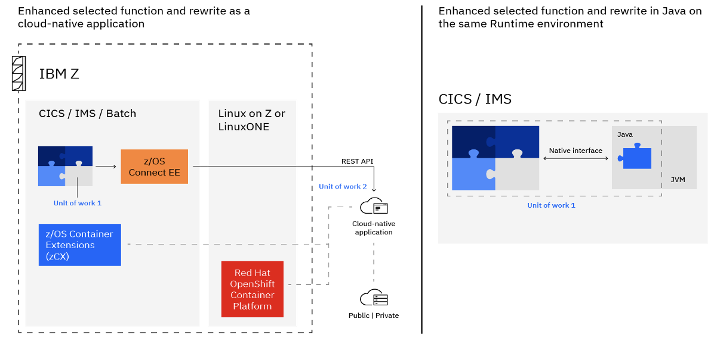

</Column>

### Enhance end-user client’s core IBM Z applications
Scenario:

<Row>

* **Infrastructure Origin:** Any Z Machine
* **Destination Infrastructure:** Distributed/Cloud/Linux on IBM Z
* **Operating System :** z/OS or any flavor of the mainframe operating system

</Row>

<Row>

<Column colMd={16} colLg={16} noGutterSm>

| Scenario A4: Enhance | End-User Client wants to rewrite an old function of a core mainframe Z application as cloud native and still want to  be integrated with the core mainframe application.  In the long run, they want to incrementally rewrite the functions because of their business need  and take advantage of the cloud native technology. |
| ------ | ------ |
| IBM Solution | Employ Application discovery patterns to identify and analyze the existing code. Use z/OS Connect to establish the integration between the rewritten function & core application and leverage IBM CloudPaks if it adheres to the client's enterprise architecture. Advocate the use of containerizing the new functions and deploy them close to Z with the help of Open shift or zCX.  |
| License Ownership | Kyndryl owns the IBM Z Software licenses |
| CSM Role(s) | Software CSM for Kyndryl drives growth opportunity of IBM Z Software |
| CSM Engagement | IBM Software CSM for Kyndryl engages in discussion with Kyndryl and EUC on exposing the core applications via z/OS Connect, IBM Software CSM for Kyndryl hand over to IBM Sales to help customer with the renewals/purchase of z/OS connect, IBM Software CSM for Kyndryl helps collaborate to other IBM support/product teams to help with the issues in Install/Upgrade and on the Product |
| Account Team, Larger IBM and Ecosystem | IBM Sales is consulted on retention and growth of IBM Software licenses with Kyndryl  |
| Production Management | Kyndryl manages and supports the software for the customers and maintain the exposed applications |
| Reference | <a href= "https://www.ibm.com/cloud/architecture/architectures/z-collocate-applications-pattern" target='_blank' rel='noreferrer noopener'> IBM Z Co-Locate Application Pattern </a> |
| Example | Enhancement of selected components of a monolithic application (e.g., presentation, business process, shared functions, or business rules) by incrementally rewriting only the selected function as a cloud-native application |

</Column>

</Row>

## A5 - Refactor

<Column colMd={16} colLg={16} noGutterSm>

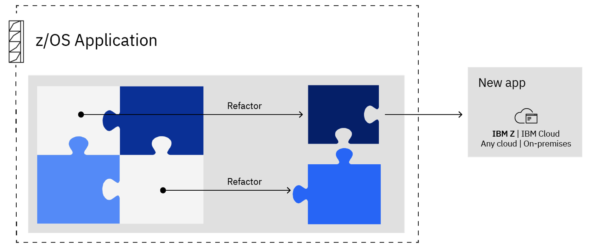

</Column>

### Refactor end-user client's core IBM Z applications
Scenario:

<Row>

* **Infrastructure Origin:** Any Z Machine
* **Destination Infrastructure:** Distributed/Cloud/Linux on IBM Z
* **Operating System :** z/OS or any flavor of the mainframe operating system

</Row>

<Row>

<Column colMd={16} colLg={16} noGutterSm>

| Scenario A5: Refactor | End-User Client's application logic doesn't serve well for their changing business needs, and they want to use this opportunity to refactor the application into discrete services and leverage the advantages of using microservices. |
| ------ | ------ |
| IBM Solution | Advocate taking an integrated DevOps approach in refactoring applications using IBM Developer for z/OS. Weigh in the option of closer integration of refactored pieces to existing Z applications and loosely coupled applications based on the customer architecture. |
| License Ownership | Kyndryl owns the IBM Z Software licenses |
| CSM Role(s) | Software CSM for Kyndryl drives growth opportunity of IBM Z Software |
| CSM Engagement | IBM Software CSM for Kyndryl engages in discussion with Kyndryl and EUC on exposing the core applications via z/OS Connect, IBM Software CSM for Kyndryl hand over to IBM Sales to help customer with the renewals/purchase of z/OS connect, IBM Software CSM for Kyndryl helps collaborate to other IBM support/product teams to help with the issues in Install/Upgrade and on the Product |
| Account Team, Larger IBM and Ecosystem | IBM Sales is consulted on retention and growth of IBM Software licenses with Kyndryl  |
| Production Management | Kyndryl manages and supports the software for the customers and maintain the exposed applications |
| Reference | <a href= "https://www.ibm.com/cloud/architecture/architectures/z-refactor-discrete-services-pattern" target='_blank' rel='noreferrer noopener'> IBM Z Refactor into discrete services pattern </a> |
| Example | The "Refactor into discrete services" pattern shows the process and components that are involved to refactor functions into re-useable components so that they can be used by both existing and new applications |

</Column>

</Row>

## B1 - Enable

<Column colMd={16} colLg={16} noGutterSm>

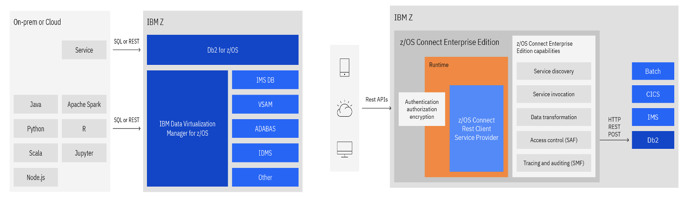

</Column>

### Enable modern access to IBM Z data
Scenario:

<Row>

* **Infrastructure Origin:** Cloud/On-prem
* **Destination Infrastructure:** IBM Z

</Row>

<Row>

<Column colMd={16} colLg={16} noGutterSm>

| Scenario B1: Enable | End-User Client's distributed/modern workloads wants to establish a modern way to access IBM Z data to bring consistent framework in the way data is accessed. |
| ------ | ------ |
| IBM Solution | Propose z/OS Connect EE to access the data in DB2 and IMS via SQL and REST API. Other data sources can be accessed through SQL or API using IBM Data Virtualization Manager for z/OS. Advocate the use of DB2 Analytics Accelerator for z/OS to address to increase in consumption of data on the  Z side. |
| License Ownership | Kyndryl owns the IBM Z Software licenses |
| CSM Role(s) | Software CSM for Kyndryl drives growth opportunity of IBM Z Software |
| CSM Engagement | IBM Software CSM for Kyndryl engages in discussion with Kyndryl and EUC on exposing the core applications via z/OS Connect, IBM Software CSM for Kyndryl hand over to IBM Sales to help customer with the renewals/purchase of z/OS connect, IBM Software CSM for Kyndryl helps collaborate to other IBM support/product teams to help with the issues in Install/Upgrade and on the Product |
| Account Team, Larger IBM and Ecosystem | - IBM Sales is consulted on retention and growth of IBM Software licenses with Kyndryl  |
| Production Management | Kyndryl manages and supports the software for the customers and maintain the exposed applications |
| Reference | <a href= "https://www.ibm.com/cloud/architecture/architectures/z-enable-modern-access-pattern" target='_blank' rel='noreferrer noopener'> IBM Z Enable Modern access pattern </a> |
| Example | You can access data that is stored in Db2 from anywhere by using SQL. Db2 for z/OS also supports native RESTful services to expose SQL and stored procedures as REST APIs when combined with z/OS Connect EE. You can invoke Db2 native RESTful services from z/OS Connect EE by using the z/OS Connect EE REST Client Service Provider. |

</Column>

</Row>

## B2 - Virtualize

<Column colMd={16} colLg={16} noGutterSm>

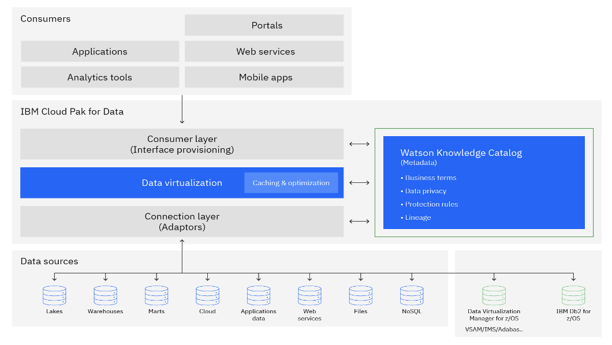

</Column>

### Virtualize IBM Z data
Scenario:

<Row>

* **Infrastructure Origin:** IBM Z

</Row>

<Row>

<Column colMd={16} colLg={16} noGutterSm>

| Scenario B2: Virtualize | As part of the AI/ML roadmap, End-User Client needs a comprehensive way of mapping the traditional IBM Z data such as VSAM, IMS or Adabas into  relational views for modern access through SQL or API without having to move, replicate or transform data. |
| ------ | ------ |
| IBM Solution | Propose IBM Data Virtualization Manager for z/OS which provides virtual, integrated views of data residing on IBM Z. IBM DVM enables users and applications read/write access to IBM Z data without having to move, replicate of transform. |
| License Ownership | Kyndryl owns the IBM Z Software licenses |
| CSM Role(s) | Software CSM for Kyndryl drives growth opportunity of IBM Z Software |
| CSM Engagement | IBM Software CSM for Kyndryl engages in discussion with Kyndryl and EUC on exposing the core applications via z/OS Connect, IBM Software CSM for Kyndryl hand over to IBM Sales to help customer with the renewals/purchase of z/OS connect, IBM Software CSM for Kyndryl helps collaborate to other IBM support/product teams to help with the issues in Install/Upgrade and on the Product |
| Account Team, Larger IBM and Ecosystem | IBM Sales is consulted on retention and growth of IBM Software licenses with Kyndryl  |
| Production Management | Kyndryl manages and supports the software for the customers and maintain the exposed applications |
| Reference | <a href= "https://www.ibm.com/cloud/architecture/architectures/z-virtualize-ibm-z-data-pattern" target='_blank' rel='noreferrer noopener'> Virtualize IBM Z data pattern </a> |
| Example | Accessing Db2 and IMS through SQL, Java Database Connectivity (JDBC), and REST API by using z/OS Connect EE , IBM DVM for z/OS can provide SQL access to all IBM Z data sources. |

</Column>

</Row>

## C1 - Respond to Z

<Column colMd={16} colLg={16} noGutterSm>

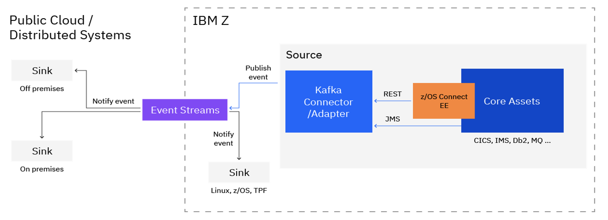

</Column>

### Virtualize IBM Z data
Scenario:

<Row>

* **Infrastructure Origin:** IBM Z
* **Destination Infrastructure:** Public cloud / Distributed Systems

</Row>

<Row>

<Column colMd={16} colLg={16} noGutterSm>

| Scenario C1: Respond to Z | End-User Client wants to implement an event distribution topology integrated with the core IBM Z applications and as part of their business logic they are intending to handle post-processing operations based on the events happening in IBM Z. |
| ------ | ------ |
| IBM Solution | Identify the correct fit of topology (Message or API) based on Client's existing architecture. Propose z/OS connect EE for API based and leverage MQ connectors for Messages based for communicating to the messaging system (Kafka). Advocate the importance of co-locating the messaging system closer to Z to reduce latency. |
| License Ownership | Kyndryl owns the IBM Z Software licenses |
| CSM Role(s) | Software CSM for Kyndryl drives growth opportunity of IBM Z Software |
| CSM Engagement | IBM Software CSM for Kyndryl engages in discussion with Kyndryl and EUC on exposing the core applications via z/OS Connect, IBM Software CSM for Kyndryl hand over to IBM Sales to help customer with the renewals/purchase of z/OS connect, IBM Software CSM for Kyndryl helps collaborate to other IBM support/product teams to help with the issues in Install/Upgrade and on the Product |
| Account Team, Larger IBM and Ecosystem | IBM Sales is consulted on retention and growth of IBM Software licenses with Kyndryl  |
| Production Management | Kyndryl manages and supports the software for the customers and maintain the exposed applications |
| Reference | <a href= "https://www.ibm.com/cloud/architecture/architectures/z-respond-to-z-app-events-pattern" target='_blank' rel='noreferrer noopener'> Respond to IBM Z application events pattern </a> |
| Example | Banks need to notify customers through mobile apps when an account total is below a pre-specified level. Organizations also seek to automate many post-processing operations that follow on to an SOR transaction, such as the opening of a new account. New services are to be developed not only as cloud-native applications, but also integrated with ease by using modern capabilities such as APIs, and in a non-disruptive manner. |

</Column>

</Row>

## C2 - Respond to External

<Column colMd={16} colLg={16} noGutterSm>

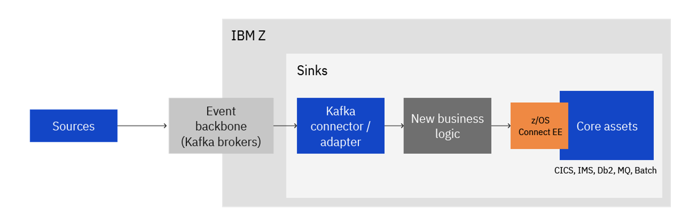

</Column>

### Respond to External events in IBM Z
Scenario:
<Row>

* **Infrastructure Origin:** Any Platform
* **Destination Infrastructure:** IBM Z

</Row>

<Row>

<Column colMd={16} colLg={16} noGutterSm>

| Scenario C2: Respond to External events | End -User Client wants to implement an event distribution topology integrated with the core IBM Z applications and as part of their business logic  they are intending to handle post-processing operations based on the events outside of Z.  They want to have their core Z assets respond to the events happening across various sources. |
| ------ | ------ |
| IBM Solution | Propose building the new logic within Z landscape and recommend z/OS Connect EE to bridge the conversations from the external sources. Advocate the importance of co-locating the messaging system closer to Z to reduce latency.|
| License Ownership | Kyndryl owns the IBM Z Software licenses |
| CSM Role(s) | Software CSM for Kyndryl drives growth opportunity of IBM Z Software |
| CSM Engagement | IBM Software CSM for Kyndryl engages in discussion with Kyndryl and EUC on exposing the core applications via z/OS Connect, IBM Software CSM for Kyndryl hand over to IBM Sales to help customer with the renewals/purchase of z/OS connect, IBM Software CSM for Kyndryl helps collaborate to other IBM support/product teams to help with the issues in Install/Upgrade and on the Product |
| Account Team, Larger IBM and Ecosystem | IBM Sales is consulted on retention and growth of IBM Software licenses with Kyndryl  |
| Production Management | Kyndryl manages and supports the software for the customers and maintain the exposed applications |
| Reference | <a href= "https://www.ibm.com/cloud/architecture/architectures/z-respond-external-events-pattern" target='_blank' rel='noreferrer noopener'> Respond to external events pattern </a> |
| Example | An airline needs to provide a way for customers to reschedule flights due to weather constraints or personal decisions. The airline customers can submit a reschedule request to the airline, which the new applications respond to. New services are to be developed not only as cloud-native applications,  but also integrated with ease by using modern capabilities such as APIs, and in a non-disruptive manner |

</Column>

</Row>

## C3 - Optimize CQRS

<Column colMd={16} colLg={16} noGutterSm>

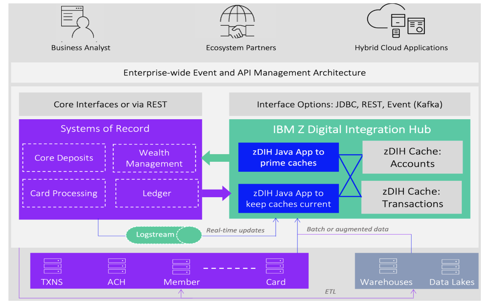

</Column>

### Transform business processes into real-time or near-real-time responsiveness by using CQRS
Scenario:

<Row>

* **Infrastructure Origin:** Any Platform
* **Destination Infrastructure:** IBM

</Row>

<Row>

<Column colMd={16} colLg={16} noGutterSm>

| Scenario C3: Optimize CQRS | End-User Client wants to transform business processes into real-time or near-real-time responsiveness by using Command Query Response Separation (CQRS). |
| ------ | ------ |
| IBM Solution | Propose an optimized aggregation of the relevant information, as opposed to moving all of the raw data from systems of record. Then, you surface that information through various standards-based interfaces, including through event-based mechanisms such as Kafka. |
| License Ownership | Kyndryl owns the IBM Z Software licenses |
| CSM Role(s) | Software CSM for Kyndryl drives growth opportunity of IBM Z Software |
| CSM Engagement | IBM Software CSM for Kyndryl engages in discussion with Kyndryl and EUC on exposing the core applications via z/OS Connect, IBM Software CSM for Kyndryl hand over to IBM Sales to help customer with the renewals/purchase of z/OS connect, IBM Software CSM for Kyndryl helps collaborate to other IBM support/product teams to help with the issues in Install/Upgrade and on the Product |
| Account Team, Larger IBM and Ecosystem | IBM Sales is consulted on retention and growth of IBM Software licenses with Kyndryl  |
| Production Management | Kyndryl manages and supports the software for the customers and maintain the exposed applications |
| Reference | <a href= "https://www.ibm.com/cloud/architecture/architectures/z-optimize-cqrs-pattern" target='_blank' rel='noreferrer noopener'> Optimize CQRS pattern </a> |
| Example | Segregate APIs for accessing data and the models for managing data.(Like segregating read and write APIs). Also, segregate database itself into a read/write database that is effectively write only and one or more read-only databases. |

</Column>

</Row>

## D1 - Upgrade

<Column colMd={16} colLg={16} noGutterSm>

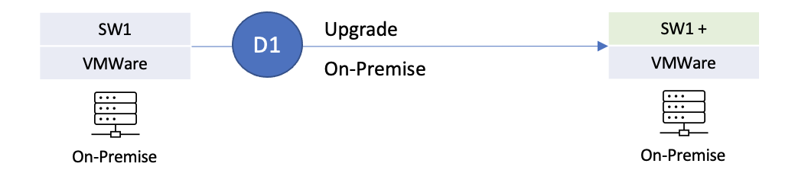

</Column>

<Row>

D1 - Upgrade
Distrubuted Software Pattern Overview

- From Non-containerized on prem to Non-containerized on prem

</Row>

### Upgrade Kyndryl owned non-containerized IBM Software running on VMware virtual machine.
Scenario:

<Row>

- **Infrastructure Origin:** On-Premise VMware Virtual machine
- **Destination Infrastructure:** On-Premise VMware Virtual machine

</Row>

<Row>

<Column colMd={16} colLg={16} noGutterSm>

| Scenario D1: Upgrade On-Prem to On-Prem | End-User Client has invested significantly on IBM Software (IBM Data Stage) for moving data from on-prem transactional system to data warehouse.   Software CSM for Kyndryl recommends that End-User client upgrade to latest non-containerized version of IBM Data Stage  on-prem to pick up additional functionality.  Kyndryl owns and manages the infrastructure and IBM software licenses on behalf of the End-User Client.|
| ------ | ------ |
| IBM Solution | Provide support and guidance to Kyndryl and End-User Client on the use and upgrade of IBM DataStage.|
| License Ownership | Kyndryl owns the IBM Software licenses (IBM DataStage), Kyndryl owns the on-prem infrastructure |
| CSM Role(s) | Software CSM for Kyndryl drives growth opportunity of IBM Software |
| CSM Engagement | IBM Software CSM for Kyndryl leads the discussion on the use and upgrade of software with Kyndryl and the End-User Client, IBM Software CSM for Kyndryl works with IBM Sales and Technology Expert Labs to help with the upgrades |
| Account Team, Larger IBM and Ecosystem | IBM Sales is consulted on retention and growth of IBM Software licenses with Kyndryl,  IBM Technology Expert Labs is engaged to provide services for upgrading DataStage |
| Production Management | End-User Client builds, maintains and manages the ETL jobs that runs on-premise |

</Column>

</Row>

## D2 - Containerize

<Column colMd={16} colLg={16} noGutterSm>

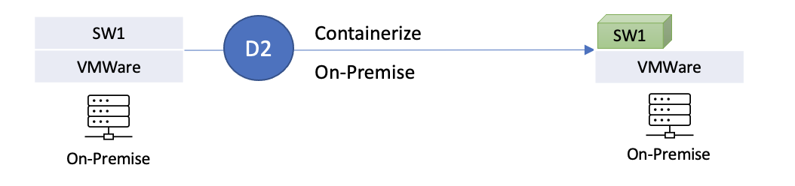

</Column>

<Row>
D2 - Containerize
Distrubuted Software Pattern Overview
- From Non-containerized on prem to Containerized on prem
</Row>

### Upgrade Kyndryl owned non-containerized IBM Software running on VMware virtual machine to containerized version of IBM Software
Scenario:

<Row>

- **Infrastructure Origin:** On-Premise VMware Virtual machine.
- **Destination Infrastructure:** On-Premise VMware Virtual machine.

</Row>

<Row>

<Column colMd={16} colLg={16} noGutterSm>

| Scenario D2: Containerize On-Prem to On-Prem | Software CSM for Kyndryl recommends End-User Client to upgrade Db2 to containerized version of Db2 to reduce Db2 outages.  Db2 is used by the End-User Client for their claims application. The infrastructure on which Db2 runs is managed by Kyndryl.  The infrastructure on which Cloud Pak for Data, Db2 cartridge will run will be managed by Kyndryl. |
| ------ | ------ |
| IBM Solution | Move to containerized version of Db2 on-premise |
| License Ownership | - Kyndryl owns the on-prem Db2 and Cloud Pak for Data, Db2 Cartridge  - Kyndryl owns and manages on-premise infrastructure on which Db2 runs on  - Kyndryl will own and manage Private Cloud infrastructure on which the Cloud Pak for Data and, Db2 Cartridge will run on. |
| CSM Role(s) | - IBM Software CSM for Kyndryl is assigned because Kyndryl owns CP4Data, Db2 cartridge |
| CSM Engagement | - Kyndryl has the relationship with the End-User Client and is managing the on-premise environment  - Kyndryl  engages Software CSM for Kyndryl for Db2 containerization discussion  - Once the Software CSM for Kyndryl has the confidence of the Kyndryl Delivery team, Software CSM for Kyndryl positions the IBM solution to the End-User Client application and database owners |
| Account Team, Larger IBM and Ecosystem | Software CSM for Kyndryl consults IBM Sales to engage Technology Expert Labs for upgrading Db2 to Cloud Pak for Data Db2 cartridge |
| Production Management | End-User Client manages their Db2 databases after production deployment |

</Column>

</Row>

## D3 - Lift and Shift

<Column colMd={16} colLg={16} noGutterSm>

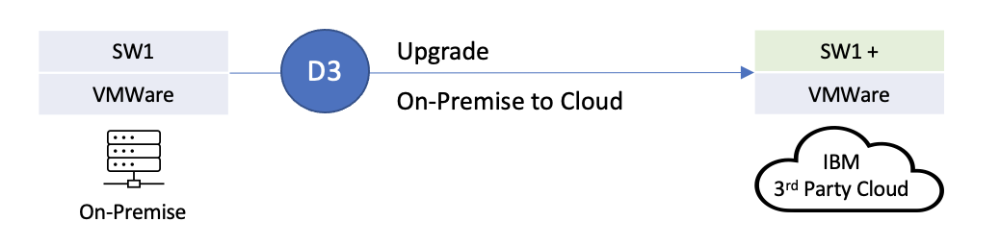

</Column>

<Row>
D3 - Lift and Shift
Distrubuted Software Pattern Overview
- From Non-containerized on prem to Non-containerized on Cloud
</Row>

### Upgrade Kyndryl owned non-containerized IBM Software running on VMware virtual machine to non-containerized version of IBM Software.
Scenario:

<Row>

- **Infrastructure Origin:** On-Premise VMware Virtual machine
- **Destination Infrastructure:** IBM Cloud VMware Virtual machine **OR** Third-Party Cloud VMware Virtual machine

</Row>

<Row>

<Column colMd={16} colLg={16} noGutterSm>

| Scenario D3:  Lift and Shift to IBM or 3rd Party Public Cloud | End-User Client has invested significantly on IBM Software (IBM Data Stage) for moving data  from on-prem transactional system to cloud warehouse.  Software CSM for Kyndryl recommends that End-User client upgrade to  latest non-containerized version of  IBM Data Stage on IBM Cloud or Azure.  Kyndryl owns and manages the IBM or Azure Public Cloud and IBM Software licenses on behalf of the End-User Client. |
| ------ | ------ |
| IBM Solution | Provide support and guidance to Kyndryl and End-User Client on the lifting and shifting and upgrade of IBM DataStage on IBM Cloud or Azure. |
| License Ownership |  - Kyndryl owns the IBM Software licenses (IBM DataStage)  - Kyndryl owns and manages the IBM or Azure Public Cloud infrastructure  |
| CSM Role(s) | - Software CSM for Kyndryl drives growth opportunity of IBM Software |
| CSM Engagement |- IBM Software CSM for Kyndryl leads the discussion on the use and upgrade of software with Kyndryl and the End-User Client  - IBM Software CSM for Kyndryl works with IBM Sales and Technology Expert Labs to help with the upgrades |
| Account Team, Larger IBM and Ecosystem | - IBM Sales is consulted on retention and growth of IBM Software licenses with Kyndryl  - IBM Technology Expert Labs is engaged to provide services for upgrading DataStage |
| Production Management | End-User Client builds, maintains and manages the ETL jobs that runs on IBM or Azure Public Cloud |

</Column>

</Row>

<Row>

<Column colMd={16} colLg={16} noGutterSm>

| Scenario D3:  Lift and Shift to IBM Public Cloud  | During their digital transformation journey, End-User Client lifted and shifted IBM Db2 to IBM Public Cloud.   Software CSM for Kyndryl recommends End-User Client to upgrade DB2 to latest non-containerized version of Db2. Kyndryl owns and manages the Cloud and IBM Software licenses on behalf of the End-User Client. |
| ------ | ------ |
| IBM Solution | Provide support and guidance to Kyndryl and End-User Client on upgrade of IBM Db2 on IBM Public Cloud. |
| License Ownership |  - Kyndryl owns the IBM Software licenses (IBM Db2)  - Kyndryl owns and manages the IBM Public Cloud  infrastructure |
| CSM Role(s) | - Software CSM for Kyndryl drives growth opportunity of IBM Software |
| CSM Engagement |- IBM Software CSM for Kyndryl leads the discussion on the use and upgrade of software with Kyndryl and the End-User Client  - IBM Software CSM for Kyndryl works with IBM Sales and Technology Expert Labs to help with the upgrades |
| Account Team, Larger IBM and Ecosystem | - IBM Sales is consulted on retention and growth of IBM Software licenses with Kyndryl  - IBM Technology Expert Labs is engaged to provide services for upgrading DataStage |
| Production Management | End-User Client builds, maintains and manages the ETL jobs that runs on IBM or Azure Public Cloud |

</Column>

</Row>

## D4 - Containerize

<Column colMd={16} colLg={16} noGutterSm>

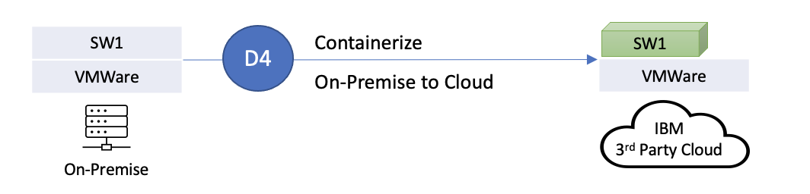

</Column>

<Row>
D4 - Containerize
Distrubuted Software Pattern Overview
- From Non-containerized on prem to Containerized on Cloud
</Row>

### Containerize Kyndryl owned non-containerized IBM Software running on VMware virtual machine to containerized version of IBM Software
Scenario:

<Row>

- **Infrastructure Origin:** On-Premise VMware Virtual machine
- **Destination Infrastructure:** IBM Cloud VMware Virtual machine OR Third-Party Cloud VMware Virtual machine

</Row>

<Row>

<Column colMd={16} colLg={16} noGutterSm>

|  Scenario D4:  Containerize on-prem to IBM or 3rd Party Cloud  | Software CSM for Kyndryl recommends End-User Client to upgrade Db2 to containerized version of Db2 to reduce Db2 outages.  Db2 is used by the End-User Client for their claims application.  The infrastructure on which Db2 runs is managed by Kyndryl. The infrastructure on which Cloud Pak for Data, Db2 cartridge will run will be managed by Kyndryl.|
| ------ | ------ |
| IBM Solution | Move to containerized version of Db2 running on IBM Cloud |
| License Ownership | - Kyndryl owns the on-prem Db2 and Cloud Pak for Data, Db2 Cartridge  - Kyndryl owns and manages IBM on-premise infrastructure that Db2 runs on  - Kyndryl will own and manage IBM Public Cloud infrastructure on which the Cloud Pak for Data and, Db2 Cartridge will run on.|
| CSM Role(s) | IBM Software CSM for Kyndryl assigned because Kyndryl owns CP4Data, Db2 cartridge |
| CSM Engagement | - Kyndryl has the relationship with the End-User Client and is managing the cloud environment  - Kyndryl  engages Software CSM for Kyndryl for Db2 containerization discussion  - Once the Software CSM for Kyndryl has the confidence of the Kyndryl Delivery team, Software CSM for Kyndryl positions the IBM solution to the End-User Client application and database owners |
| Account Team, Larger IBM and Ecosystem | - Cloud Pak Platform CSM consults  - IBM Sales to engage Technology Expert Labs for upgrading Db2 to Cloud Pak for Data Db2 cartridge |
| Production Management | End-User Client manages their Db2 databases after production deployment |

</Column>

</Row>

## D5 - Upgrade

<Column colMd={16} colLg={16} noGutterSm>

</Column>

<Row>
D5 - Upgrade
Distrubuted Software Pattern Overview
- From Containerized on prem to Containerized on prem
</Row>

### Upgrade Kyndryl owned containerized IBM Software running on VMware virtual machine to containerized version of IBM Software
Scenario:

<Row>

- **Infrastructure Origin:** On-Premise VMware Virtual machine
- **Destination Infrastructure:** On-Premise VMware Virtual machine

</Row>

<Row>

<Column colMd={16} colLg={16} noGutterSm>

|  Scenario D5:  Containerized on-prem to Containerized on-prem  | Software CSM for Kyndryl recommends End-User Client to upgrade containerized version of WebSphere (Liberty or Base)  workloads on-prem to secure and take advantage of the latest version of the software.  WebSphere  is used by the End-User Client for their critical business applications. The infrastructure on which WebSphere Hybrid Edition runs is managed by Kyndryl. |
| ------ | ------ |
| IBM Solution | Upgrade containerized  on-prem WebSphere workloads |
| License Ownership | - Kyndryl owns the on-prem containerized WebSphere  - Kyndryl owns and manages IBM on-premise infrastructure that WebSphere runs on|
| CSM Role(s) | IBM Software CSM for Kyndryl assigned because Kyndryl owns WebSphere  |
| CSM Engagement | - Kyndryl has the relationship with the End-User Client and is managing the on-prem environments  - Kyndryl  engages Software CSM for Kyndryl for WebSphere upgrade on-prem  - Once the Software CSM for Kyndryl has the confidence of the Kyndryl Delivery team, Software CSM for Kyndryl positions the IBM solution to the End-User Client application and WebSphere owners |
| Account Team, Larger IBM and Ecosystem | - Software CSM for Kyndryl consults IBM Sales to engage Technology Expert Labs for upgrading WebSphere if consulting assistance needed |
| Production Management | Kyndryl manages their WebSphere workloads after production deployment |

</Column>

</Row>

## D6 - Lift and Shift

<Column colMd={16} colLg={16} noGutterSm>

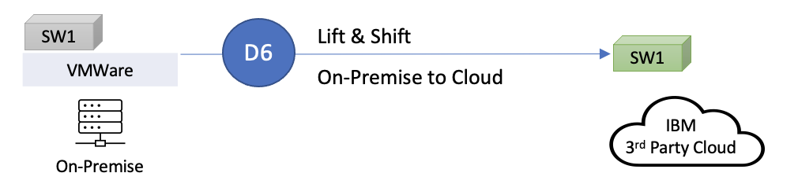

</Column>

<Row>
D6 - Lift and Shift
Distrubuted Software Pattern Overview
- From Containerized on prem to Containerized on Cloud

</Row>

### Lift and Shift Kyndryl owned containerized IBM Software running on VMware virtual machine to containerized version of IBM Software
Scenario:

<Row>

- **Infrastructure Origin:** On-Premise VMware Virtual machine
- **Destination Infrastructure:** IBM Cloud VMware Virtual machine OR Third-Party Cloud VMware Virtual machine

</Row>

<Row>

<Column colMd={16} colLg={16} noGutterSm>

| Scenario D6: Lift and Shift containerized  on-prem workloads to  IBM or 3rd Party Cloud | Software CSM for Kyndryl recommends End-User Client to lift and shift containerized WebSphere (Liberty or base)  workloads  from on-prem to IBM Cloud or 3rd party cloud to improve operational efficiency and reduce cost.  WebSphere is used by the End-User Client for their critical business  applications.  The infrastructure on which WebSphere workloads will run will be managed by Kyndryl.|
| ------ | ------ |
| IBM Solution | Lift and Shift containerized WebSphere workloads from on-prem to IBM Cloud or 3rd party cloud |
| License Ownership | - Kyndryl owns the on-prem WebSphere Hybrid Edition  - Kyndryl owns and manages IBM on-premise infrastructure that WebSphere runs on  - Kyndryl will own and manage IBM Public Cloud infrastructure on which the WebSphere workloads will run on. |
| CSM Role(s) | IBM Software CSM for Kyndryl assigned because Kyndryl owns WebSphere  |
| CSM Engagement | - Kyndryl has the relationship with the End-User Client and is managing the cloud environment  - Kyndryl  engages Software CSM for Kyndryl for WebSphere Lift and Shift discussion  - Once the Software CSM for Kyndryl has the confidence of the Kyndryl Delivery team, Software CSM for Kyndryl positions the IBM solution to the End-User Client application owners |
| Account Team, Larger IBM and Ecosystem | - Cloud Pak Platform CSM consults IBM Sales to engage Technology Expert Labs for moving the on-prem containerized WebSphere workloads to Cloud |
| Production Management | End-User Client manages their Db2 databases after production deployment|

</Column>

</Row>

## D7 - Lift and Shift

<Column colMd={16} colLg={16} noGutterSm>

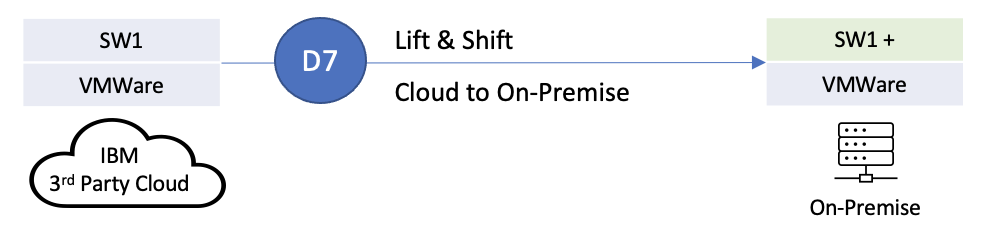

</Column>

<Row>

D7 - Lift and Shift
Distrubuted Software Pattern Overview
- From Non-containerized IBM Cloud to Non-containerized on Prem

</Row>

### Lift and Shift Kyndryl owned non-containerized IBM Software running on Cloud to non-containerized version of IBM Software running on-prem
Scenario:

<Row>

- **Infrastructure Origin:** IBM Cloud VMware Virtual machine OR Third-Party Cloud VMware Virtual machine
- **Destination Infrastructure:** On-Premise VMware Virtual machine

</Row>

<Row>

<Column colMd={16} colLg={16} noGutterSm>

| Scenario D7:  Lift and Shift from Cloud to On-Prem: | End-User Client has adopted the strategy to migrate applications to public cloud as a mechanism to reduce cost.  The EUC ran into three issues: increasing costs, security and performance.  End User Client moved IBM Cognos on AWS cloud.  Cognos PowerCube took 2 days to prepare the data for reporting on AWS as opposed to less than 2 hours on-premise. The customer moved the Cognos powercube workload on Kyndryl managed on-premise  infrastructure.  Software CSM for Kyndryl recommends upgrading Cognos to Data Modules. It has been observed by research firms that 72% of End User Clients have moved at least one application back to on-premise  after migrating them to cloud.|
| ------ | ------ |
| IBM Solution | Provide support and guidance to Kyndryl and End-User Client on the use and upgrade of IBM Cognos. |
| License Ownership | Kyndryl owns the IBM Software licenses (IBM Cognos)  - Kyndryl owns the on-prem infrastructure  - EUC owns the AWS  cloud infrastructure |
| CSM Role(s) | Software CSM for Kyndryl drives modernization of IBM Cognos Software |
| CSM Engagement | - IBM Software CSM for Kyndryl leads the discussion on the use and upgrade of software with Kyndryl and the End-User Client  - IBM Software CSM for Kyndryl works with IBM Technology Expert Labs to help with the modernization |
| Account Team, Larger IBM and Ecosystem | -  IBM Sales is consulted on retention and growth of IBM Software licenses with Kyndryl  - IBM Technology Expert Labs is engaged to provide services for upgrading Cognos |
| Production Management | End-User Client builds, maintains and manages Cognos|

</Column>

</Row>

## D8 - Containerize

<Column colMd={16} colLg={16} noGutterSm>

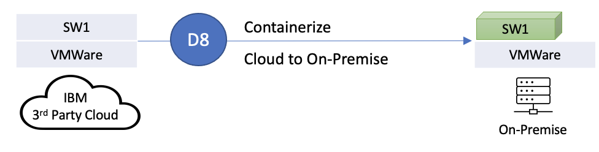

</Column>

<Row>

D8 - Containerize
Distrubuted Software Pattern Overview
- From Non-containerized on Cloud to Containerized on prem

</Row>

### Containerize Kyndryl owned non-containerized IBM Software running on Cloud to containerized version of IBM Software running on-prem
Scenario:

<Row>

- **Infrastructure Origin:** IBM Cloud VMware Virtual machine OR Third-Party Cloud VMware Virtual machine
- **Destination Infrastructure:** On-Premise VMware Virtual machine

</Row>

<Row>

<Column colMd={16} colLg={16} noGutterSm>

| Scenario D8: Containerize on Premise | End-User Client has adopted the strategy to migrate applications to AWS as a mechanism to reduce cost.  The EUC ran into the issue of performance.  End User Client moved IBM DataStage on AWS cloud.  AWS latency issues caused significant performance issues.  EUC client decided to move the DataStage software to on-premise and containerize data-stage using RedHat OpenShift.|
| ------ | ------ |
| IBM Solution | Provide support and guidance to Kyndryl and End-User Client on the use and upgrade of IBM DataStage. |
| License Ownership | - Kyndryl owns the IBM Software licenses (IBM DataStage)  - Kyndryl owns the on-prem infrastructure  - EUC owns the AWS  cloud infrastructure |
| CSM Role(s) | Software CSM for Kyndryl drives modernization of IBM DataStage Software |
| CSM Engagement | - IBM Software CSM for Kyndryl leads the discussion on the use and upgrade of software with Kyndryl and the End-User Client  - IBM Software CSM for Kyndryl works with IBM Technology Expert Labs to help with the modernization |
| Account Team, Larger IBM and Ecosystem | -  IBM Sales is consulted on retention and growth of IBM Software licenses with Kyndryl  - IBM Technology Expert Labs is engaged to provide services for upgrading DataStage |
| Production Management | End-User Client builds, maintains and manages DataStage |

</Column>

</Row>

## D9 - Upgrade

<Column colMd={16} colLg={16} noGutterSm>

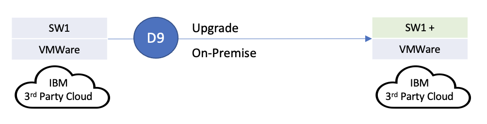

</Column>

<Row>

<h3> D9 - Upgrade </h3>
Distrubuted Software Pattern Overview
- From Non-containerized on Cloud to Non-containerized on Cloud

</Row>

#### Upgrade Kyndryl owned non-containerized IBM Software running on Cloud
Scenario:

<Row>

- **Infrastructure Origin:** IBM Cloud VMware Virtual machine OR Third-Party Cloud VMware Virtual machine
- **Destination Infrastructure:** IBM Cloud VMware Virtual machine OR Third-Party Cloud VMware Virtual machine

</Row>

<Row>

<Column colMd={16} colLg={16} noGutterSm>

|  Scenario D9:  Upgrade Non-Containerized on Cloud  to Containerized on Cloud  | Software CSM for Kyndryl recommends End-User Client to upgrade Non- containerized version of WebSphere  workloads on cloud to the latest version  to secure the platform and take advantage of the latest functionalities on the platform.  WebSphere is used by the End-User Client for their critical business applications.  The infrastructure on which WebSphere Hybrid Edition runs is managed by Kyndryl. |
| ------ | ------ |
| IBM Solution | Upgrade  Non-containerized cloud WebSphere workloads |
| License Ownership | - Kyndryl owns the WebSphere running on cloud  - Kyndryl owns and manages IBM Cloud infrastructure that WebSphere runs on |
| CSM Role(s) | IBM Software CSM for Kyndryl assigned because Kyndryl owns WebSphere  |
| CSM Engagement | - Kyndryl has the relationship with the End-User Client and is managing the cloud environments  - Kyndryl  engages Software CSM for Kyndryl for WebSphere upgrade on cloud  - Once the Software CSM for Kyndryl has the confidence of the Kyndryl Delivery team, Software CSM for Kyndryl positions the IBM solution to the End-User Client application and WebSphere owners |
| Account Team, Larger IBM and Ecosystem | -  Software CSM for Kyndryl consults IBM Sales to engage Technology Expert Labs for upgrading WebSphere if consulting assistance needed. |
| Production Management | Kyndryl manages their WebSphere workloads after production deployment |

</Column>

</Row>

## D10 - Containerize

<Column colMd={16} colLg={16} noGutterSm>

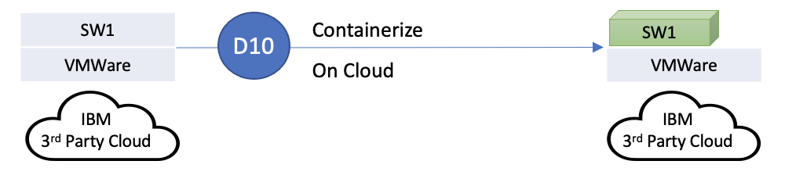

</Column>

<Row>

D10 - Containerize
Distrubuted Software Pattern Overview
- From Non-containerized on Cloud to Containerized on Cloud

</Row>

### Containerize Kyndryl owned non-containerized IBM Software running on Cloud to containerized version of IBM Software
Scenario:

<Row>

- **Infrastructure Origin:** IBM Cloud VMware Virtual machine OR Third-Party Cloud VMware Virtual machine
- **Destination Infrastructure:** IBM Cloud VMware Virtual machine OR Third-Party Cloud VMware Virtual machine

</Row>

<Row>

<Column colMd={16} colLg={16} noGutterSm>

| Scenario D10: Containerize workloads running on cloud | Software CSM for Kyndryl recommends End-User Client to containerize Non-containerized WebSphere workloads running in cloud   by refactoring monolithic applications to microservices to take advantage of the cloud native capabilities on the cloud. WebSphere  is used by the End-User Client for their critical business applications.  The infrastructure on which WebSphere Hybrid Edition runs is managed by Kyndryl. |
| ------ | ------ |
| IBM Solution | Containerize WebSphere workloads running in cloud |
| License Ownership | - Kyndryl owns the WebSphere running on cloud  - Kyndryl owns and manages IBM Cloud infrastructure that WebSphere runs on |
| CSM Role(s) | IBM Software CSM for Kyndryl assigned because Kyndryl owns WebSphere  |
| CSM Engagement | - Kyndryl has the relationship with the End-User Client and is managing the cloud environments  - Kyndryl  engages Software CSM for Kyndryl for WebSphere upgrade on cloud  - Once the Software CSM for Kyndryl has the confidence of the Kyndryl Delivery team, Software CSM for Kyndryl positions the IBM solution to the End-User Client application and WebSphere owners |
| Account Team, Larger IBM and Ecosystem | -  Software CSM for Kyndryl consults IBM Sales to engage Technology Expert Labs for upgrading WebSphere if consulting assistance needed. |
| Production Management | Kyndryl manages their WebSphere workloads after production deployment |

</Column>

</Row>

## D11 - Lift and Shift

<Column colMd={16} colLg={16} noGutterSm>

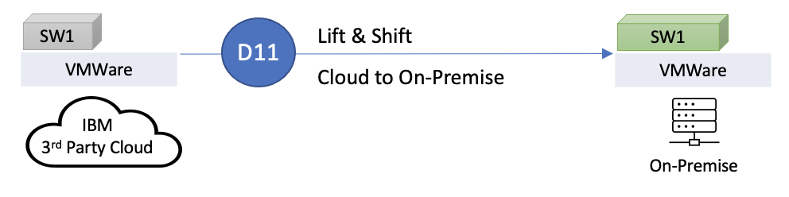

</Column>

<Row>

D11 - Lift and Shift
Distrubuted Software Pattern Overview
- From Containerized on Cloud to Containerized on prem

</Row>

### Lift and Shift Kyndryl owned containerized IBM Software running on Cloud to containerized version of IBM Software running  on-prem
Scenario:

<Row>

- **Infrastructure Origin:** IBM Cloud VMware Virtual machine OR Third-Party Cloud VMware Virtual machine
- **Destination Infrastructure:** On-Premise VMware Virtual machine

</Row>

<Row>

<Column colMd={16} colLg={16} noGutterSm>

| Scenario D11: Containerize on Premise | End-User Client has adopted the strategy to migrate applications to AWS as a mechanism to reduce cost. The EUC ran into the issue of increasing cost.  The EUC uses Db2 as the database for their transactional workload.  They had containerized DB2 on AWS cloud using IBM Open Shift.  After comparing the cost of managing the application with DB2 on AWS and on-premise,  the EUC realized that it was expensive to run and manage the application on AWS and decided to move the critical application to On-premise. |
| ------ | ------ |
| IBM Solution | Provide support and guidance to Kyndryl and End-User Client on the Db2. |
| License Ownership | - Kyndryl owns the IBM Software licenses (IBM DataStage)  - Kyndryl owns the on-prem infrastructure  - EUC owns the AWS  cloud infrastructure |
| CSM Role(s) | Software CSM for Kyndryl drives movement of IBM Db2 Software from AWS cloud to on-premise. |
| CSM Engagement | - IBM Software CSM for Kyndryl leads the discussion on the use and upgrade of software with Kyndryl and the End-User Client  - IBM Software CSM for Kyndryl works with IBM Technology Expert Labs to help with the movement of the software. |
| Account Team, Larger IBM and Ecosystem | - IBM Sales is consulted on retention and growth of IBM Software licenses with Kyndryl  - IBM Technology Expert Labs is engaged to provide services for Db2 Migration |
| Production Management | End-User Client builds, maintains and manages Db2 |

</Column>

</Row>

## D12 - Upgrade

<Column colMd={16} colLg={16} noGutterSm>

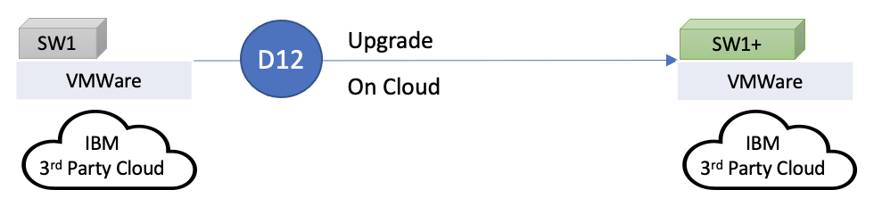

</Column>

<Row>

D12 - Upgrade
Distrubuted Software Pattern Overview
- From Containerized on Cloud to Containerized on Cloud

</Row>

### Upgrade Kyndryl owned containerized IBM Software running on Cloud
Scenario:

<Row>

- **Infrastructure Origin:** IBM Cloud VMware Virtual machine OR Third-Party Cloud VMware Virtual machine
- **Destination Infrastructure:** IBM Cloud VMware Virtual machine OR Third-Party Cloud VMware Virtual machine

</Row>

<Row>

<Column colMd={16} colLg={16} noGutterSm>

| Scenario D12: Upgrade Containerized on Cloud  to Containerized on Cloud | Software CSM for Kyndryl recommends End-User Client to upgrade containerized version of WebSphere workloads on cloud  to the latest version to secure the platform and take advantage of the latest functionalities on the platform.  WebSphere  is used by the End-User Client for their critical business applications.  The infrastructure on which WebSphere Hybrid Edition runs is managed by Kyndryl.|
| ------ | ------ |
| IBM Solution | Upgrade  containerized cloud WebSphere workloads |
| License Ownership | - Kyndryl owns the WebSphere running on cloud  - Kyndryl owns and manages IBM Cloud infrastructure that WebSphere runs on. |
| CSM Role(s) | IBM Software CSM for Kyndryl assigned because Kyndryl owns WebSphere |
| CSM Engagement | - Kyndryl has the relationship with the End-User Client and is managing the cloud environments  - Kyndryl  engages Software CSM for Kyndryl for WebSphere upgrade on cloud  - Once the Software CSM for Kyndryl has the confidence of the Kyndryl Delivery team, Software CSM for Kyndryl positions the IBM solution to the End-User Client application and WebSphere owners. |
| Account Team, Larger IBM and Ecosystem | - Software CSM for Kyndryl consults IBM Sales to engage Technology Expert Labs for upgrading WebSphere if consulting assistance needed |
| Production Management | Kyndryl manages their WebSphere workloads after production deployment |

</Column>

</Row>

## E1 - Enhance On-Premise

<Column colMd={16} colLg={16} noGutterSm>

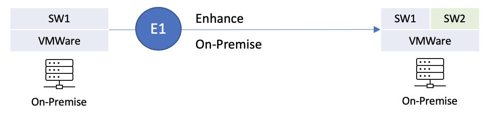

</Column>

<Row>
<Column>
E1 - Enhance On-Premise
Distrubuted Software Pattern Overview - Non-Containerized software enhancement on premises.
</Column>
</Row>

### Enhance Kyndryl owned non-containerized IBM Software running on VMware with non-containerized version of other IBM Software
Scenario - 1:

<Row>

- **Infrastructure Origin:** On-Premise VMware Virtual machine
- **Destination Infrastructure:** On-Premise VMware Virtual machine

</Row>

<Row>

<Column colMd={16} colLg={16} noGutterSm>

| Scenario E1: Enhance On-Premise | End-User Client has millions of claims documents on IBM Content Management.  Content Management is running on-premise which is managed by Kyndryl.  Software CSM for Kyndryl recommends End-User Client to automate the classification of the  claims documents as PCI/PII/PHI/Legal (sensitive data) by applying AI.|
| ------ | ------ |
| IBM Solution | Use Datacap for document classification |
| License Ownership | - Kyndryl owns non-containerized Datacap  - Kyndryl owns Content Management license.|
| CSM Role(s) | Software CSM for Kyndryl engaged because End-User Client wants Kyndryl to apply AI to understand the document contents |
| CSM Engagement | - Software CSM for Kyndryl leads the discussion with Kyndryl and End-User Client on the usage and application of Datacap  - Kyndryl leads the discussion with End-User Client on Kyndryl managed IBM Cloud infrastructure expansion (Kyndryl is self-sufficient and has the skills to lead the discussion on expansion of IBM Cloud themselves with the End-User Client) |
| Account Team, Larger IBM and Ecosystem | - IBM Sales is consulted to engage IBM Technology Technology Expert Labs for document classification  - IBM Technology Expert Labs builds the Datacap solution |
| Production Management | End-User Client manages their claims application after production deployment |

</Column>

</Row>

<Column colMd={16} colLg={16} noGutterSm>

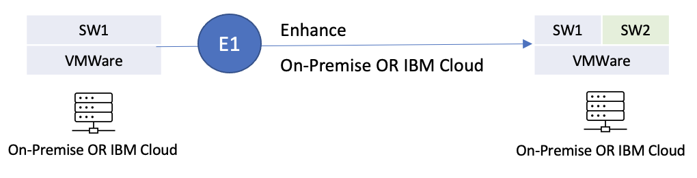

</Column>

### Enhance End-User Client owned non-containerized IBM Software running with other IBM Software
Scenario - 2

<Row>

- **Infrastructure Origin:** On-Premise VMware OR  IBM Cloud VMware
- **Destination Infrastructure:** On-Premise VMware OR  IBM Cloud VMware

</Row>

<Row>

<Column colMd={16} colLg={16} noGutterSm>

### Example - 1

| Example - 1 : Enhance End-User client owned software  running on  VMware or containers with other  IBM Software | End-User Client has hundreds of WebSphere applications running in their production environment. Kyndryl is managing WebSphere workloads for the client. End-User Client and Kyndryl is looking for automated solutions to manage the day-to-day operations of hundreds of WebSphere servers. They are spending lot of time and effort to identify the security vulnerabilities and critical patches  required to secure the business-critical WebSphere workloads. |
| ------ | ------ |
| IBM Solution | Recommend **WebSphere** Automation to Kyndryl and End-User Client to automate the operations. |
| License Ownership | Kyndryl owns non-containerized WebSphere, Kyndryl owns containerized WebSphere |
| CSM Role(s) | Software CSM for Kyndryl engaged because End-User Client wants Kyndryl to implement automated management solution for WebSphere workloads |
| CSM Engagement | Software CSM for Kyndryl leads the discussion with Kyndryl and End-User Client on the usage and application of WebSphere Automation, Kyndryl leads the discussion with End-User Client on Kyndryl managed infrastructure expansion (Kyndryl is self-sufficient and has the skills to lead the discussion on expansion of infrastructure themselves with the End-User Client), Software CSM for Kyndryl will engage with IBM or Third-Party Cloud Providers as appropriate |
| Account Team, Larger IBM and Ecosystem | IBM Sales is consulted to engage IBM Expert Lab services for WSA implementation, IBM Expert Lab services builds the WSA solution |
| Production Management | Kyndryl manages their WAS solution after production deployment |

</Column>

</Row>

<Row>

<Column colMd={16} colLg={16} noGutterSm>

### Example - 2

| Example - 2 : Enhance End-User client owned software  running on VMware or containers  with other IBM Software | End-User Client is modernizing existing WebSphere applications by containerizing them  to take advantage of the Cloud-Native capabilities. Application monitoring, visibility, and performance tuning within containerized environments is a huge challenge. Traditional application monitoring solutions are designed to handle monolithic applications.  Client is looking for a modern APM solution to support microservices distributed across a large cluster  of servers that provides enterprise level observability. |
| ------ | ------ |
| IBM Solution | Recommend implementing ** Instana ** for automating performance monitoring for modern applications and enterprise observability. |
| License Ownership | Kyndryl owns containerized WebSphere |
| CSM Role(s) | Software CSM for Kyndryl engaged because End-User Client want to implement a modern Application Performance Monitoring solution to manage the container-based WebSphere deployments. |
| CSM Engagement | Software CSM for Kyndryl leads the discussion with Kyndryl and End-User Client on the usage and application of Instana, Kyndryl leads the discussion with End-User Client on Kyndryl managed infrastructure expansion (Kyndryl is self-sufficient and has the skills to lead the discussion on expansion of infrastructure themselves with the End-User Client), Software CSM for Kyndryl will engage with IBM or Third-Party Cloud Providers as appropriate|
| Account Team, Larger IBM and Ecosystem | IBM Sales is consulted to engage IBM Expert Lab services for WSA implementation, IBM Expert Lab services builds the WSA solution |
| Production Management | Kyndryl manages their Instana solution after production deployment |

</Column>

</Row>

<Row>

<Column colMd={16} colLg={16} noGutterSm>

### Example - 3

| Example - 3 : Enhance End-User client owned software  running on VMware or containers with other IBM Software | End-User Client has hundreds of WebSphere applications running in their production environment.  Client is looking for a solution that can automatically manage resources needed for WebSphere applications  to perform based on real-time demand to drive continuous performance and availability.  Client want to avoid unpredicted application outages arising from resource constraints. |
| ------ | ------ |
| IBM Solution | Recommend **Turbonomic ARM** solution to Kyndryl and End-User Client to automate resource allocation. |
| License Ownership | Kyndryl owns non-containerized WebSphere, Kyndryl owns containerized WebSphere |
| CSM Role(s) | Software CSM for Kyndryl engaged because End-User Client wants Kyndryl to implement Turbonomic ARM to automate WebSphere application resource requirements. |
| CSM Engagement | Software CSM for Kyndryl leads the discussion with Kyndryl and End-User Client on the usage and application of Turbonomic ARM, Kyndryl leads the discussion with End-User Client on Kyndryl managed infrastructure expansion (Kyndryl is self-sufficient and has the skills to lead the discussion on expansion of infrastructure themselves with the End-User Client), Software CSM for Kyndryl will engage with IBM or Third-Party Cloud Providers as appropriate |
| Account Team, Larger IBM and Ecosystem | IBM Sales is consulted to engage IBM Expert Lab services for Turbonomic ARM implementation, IBM Expert Lab services builds the Turbonomic ARM  solution |
| Production Management | Kyndryl manages Turbonomic ARM solution after production deployment |

</Column>

</Row>

<Row>

<Column colMd={16} colLg={16} noGutterSm>

### Example - 4

| Example - 4 : Enhance End-User client owned software running on VMware or containers  with other IBM Software | End-User Client has hundreds of WebSphere applications running in their production environment.  Client would like to avoid unpredicted WebSphere application outages by proactively detecting log anomalies .  Client would like to implement an AI solution to analyze data across environments and surface issues, with suggested resolutions in ChatOps to save you time, money and identify areas where automation can improve your operations.. |
| ------ | ------ |
| IBM Solution | Recommend implementing proactive incident management solution with ** Cloud Pak for AIOps** |
| License Ownership | Kyndryl owns non-containerized WebSphere, Kyndryl owns containerized WebSphere |
| CSM Role(s) | Software CSM for Kyndryl engaged because End-User Client want to implement a AIOps solution to intelligently manage their IT operations |
| CSM Engagement | Software CSM for Kyndryl leads the discussion with Kyndryl and End-User Client on the usage and application of Turbonomic ARM, Kyndryl leads the discussion with End-User Client on Kyndryl managed infrastructure expansion (Kyndryl is self-sufficient and has the skills to lead the discussion on expansion of infrastructure themselves with the End-User Client), Software CSM for Kyndryl will engage with IBM or Third-Party Cloud Providers as appropriate |
| Account Team, Larger IBM and Ecosystem | IBM Sales is consulted to engage IBM Expert Lab services for Turbonomic ARM implementation, IBM Expert Lab services builds the Turbonomic ARM  solution |
| Production Management | Kyndryl manages their AIOps solution after production deployment |

</Column>

</Row>

<Row>

<Column colMd={16} colLg={16} noGutterSm>

### Example - 5

| Example - 5 : Enhance End-User client owned software  running on VMware or containers  with other IBM Software | End-User Client has hundreds of WebSphere applications running in their production environment. APIs optimize monolithic WebSphere applications that are difficult to modernize and enable for the cloud.  Extend existing applications with APIs that securely expose their full capabilities to developers.  The applications become reusable across clouds to easily access and build new capabilities. |
| ------ | ------ |
| IBM Solution | Recommend **Cloud Pak for Integration (API Connect)** to develop and expose monolithic WebSphere application capabilities as APIs |
| License Ownership | Kyndryl owns non-containerized WebSphere, Kyndryl owns containerized WebSphere |
| CSM Role(s) | Software CSM for Kyndryl engaged because End-User Client want to implement Cloud Pak for Integration API capabilities to expose monolithic applications. |
| CSM Engagement | Software CSM for Kyndryl leads the discussion with Kyndryl and End-User Client on the usage and application of Turbonomic ARM, Kyndryl leads the discussion with End-User Client on Kyndryl managed infrastructure expansion (Kyndryl is self-sufficient and has the skills to lead the discussion on expansion of infrastructure themselves with the End-User Client), Software CSM for Kyndryl will engage with IBM or Third-Party Cloud Providers as appropriate |
| Account Team, Larger IBM and Ecosystem | IBM Sales is consulted to engage IBM Expert Lab services for Turbonomic ARM implementation, IBM Expert Lab services builds the Turbonomic ARM  solution |
| Production Management | Kyndryl manages their Cloud Pak for Integration solution after production deployment |

</Column>

</Row>

## E2 - Enhance On-Cloud

<Column colMd={16} colLg={16} noGutterSm>

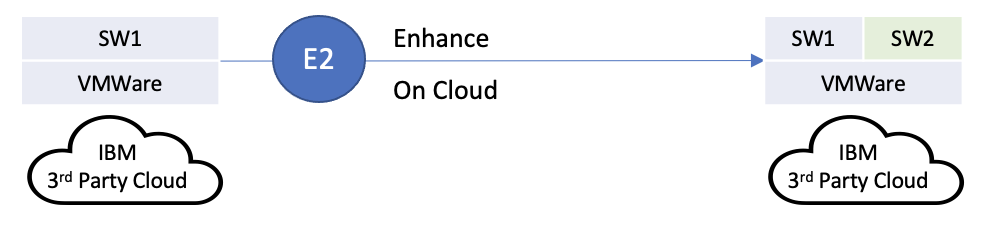

</Column>

<Row>
<Column>
E2 - Enhance On-Cloud
Distrubuted Software Pattern Overview - Non-Containerized software enhancement on cloud.
</Column>
</Row>

### Enhance Kyndryl owned non-containerized IBM Software running on Cloud with non-containerized version of other IBM Software
Scenario:

<Row>

- **Infrastructure Origin:** IBM Cloud OR Third-Party Cloud
- **Destination Infrastructure:** IBM Cloud OR Third-Party Cloud

</Row>

<Row>

<Column colMd={16} colLg={16} noGutterSm>

| Scenario E2: Enhance on IBM Cloud or Third-Party Cloud | End-User Client has millions of claims documents on IBM Content Management. Content Management is running on-premise which is managed by Kyndryl.  Software CSM for Kyndryl recommends End-User Client to lift and shift content management to  IBM Public Cloud automate the classification of the claims documents as PCI/PII/PHI/Legal (sensitive data) by applying AI.|
| ------ | ------ |
| IBM Solution | - Use Datacap for document classification - IBM Public Cloud Expansion |
| License Ownership |- Kyndryl owns non-containerized Datacap  - Kyndryl owns Content Management license|
| CSM Role(s) | Software CSM for Kyndryl engaged because End-User Client wants Kyndryl to lift and shift IBM Content Management to cloud to apply AI to understand the document contents |
| CSM Engagement | - Software CSM for Kyndryl leads the discussion with Kyndryl and End-User Client on the usage and application of Datacap  - Kyndryl leads the discussion with End-User Client on Kyndryl managed IBM Cloud infrastructure expansion (Kyndryl is self-sufficient and has the skills to lead the discussion on expansion of IBM Cloud themselves with the End-User Client)  - Software CSM for Kyndryl will engage with IBM or Third-Party Cloud Providers as appropriate |
| Account Team, Larger IBM and Ecosystem | - IBM Sales is consulted to engage IBM Expert Lab services for document classification  - IBM Expert Lab services builds the Datacap solution |
| Production Management | End-User Client manages their claims application after production deployment |

</Column>

</Row>

<Row>

<Column colMd={16} colLg={16} noGutterSm>

| Scenario E2:   Enhance on IBM Cloud or Third-Party Cloud | Retain IBM Content Management (CM8 not Filenet) running on IBM Cloud managed by Kyndryl and add Content Navigator functionality.|
| ------ | ------ |
| IBM Solution | End-User Client loves the solution and support from Kyndryl. IBM provides support so the IBM CM8 solution continues to provide value to the End-User Client.  The number of claims documents managed by content management continues to increase thereby requiring license growth. Software CSM for Kyndryl recommends End-User Client w to add Content Navigator functionality that is part of CM8 instead of their home-grown UI. |
| License Ownership | Kyndryl owns the IBM Software license for CM8, Kyndryl owns and manages the IBM public cloud infrastructure on which the CM8 solution runs |
| CSM Role(s) | Software CSM for Kyndryl assigned because Kyndryl owns CM8 and there is a growth opportunity |
| CSM Engagement | IBM Software CSM for Kyndryl leads the discussion on continued use of CM8|
| Account Team, Larger IBM and Ecosystem | IBM Sales is consulted for services engagement to implement solution using Content Navigator, IBM Technology Expert Labs is engaged to add value to the CM8 solution |
| Production Management | End-User Client continues to manage their claims application after production deployment, Kyndryl continues to manage the infrastructure on which CM8 runs|

</Column>

</Row>

## E3 - Enhance and Containerize On-Premise

<Column colMd={16} colLg={16} noGutterSm>

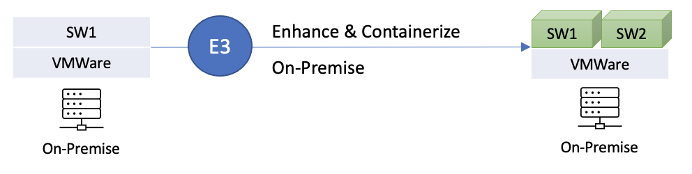

</Column>

<Row>
<Column>

E3 - Enhance and Containerize On-Premise
Distrubuted Software Pattern Overview - Containerized software enhancement on premise.
</Column>
</Row>

Scenario:
### Enhance Kyndryl owned non-containerized IBM Software running on VMware with containerized version of other IBM Software

<Row>

- **Infrastructure Origin:** On-Premise VMware Virtual machine
- **Destination Infrastructure:** On-Premise VMware Virtual machine

</Row>

<Row>

<Column colMd={16} colLg={16} noGutterSm>

| Scenario E3: Enhance and Containerize On Premise | End-User Client has millions of claims documents on IBM Content Management. Content Management is running on premise which is managed by Kyndryl.  Software CSM for Kyndryl recommends End-User Client to automate the classification of the claims documents  as PCI/PII/PHI/Legal (sensitive data) by applying AI.|
| ------ | ------ |
| IBM Solution | - Use Cloud Pak for Business Automation (Automated Document Processing) for document classification |
| License Ownership | End-User Client owns Cloud Pak for Business Automation (Automated Document Processing),  - End-User Client will manage it.  - Kyndryl owns Content Management license |
| CSM Role(s) | IBM Software CSM for Kyndryl assigned because End-User Client owns CP4BA |
| CSM Engagement | Software CSM for Kyndryl leads the discussion with Kyndryl and End-User Client on the usage and application of Datacap,  Kyndryl leads the discussion with End-User Client on Kyndryl managed IBM Cloud infrastructure expansion (Kyndryl is self-sufficient and has the skills to lead the discussion on expansion of IBM Cloud themselves with the End-User Client),  Software CSM for Kyndryl will engage with IBM or Third-Party Cloud Providers as appropriate |
| Account Team, Larger IBM and Ecosystem | IBM Sales is consulted to engage IBM Expert Lab services for document classification, IBM Expert Lab services builds the Datacap solution |
| Production Management | End-User Client manages their claims application after production deployment |

</Column>

</Row>

## E4 - Enhance and Containerize On-Cloud

<Column colMd={16} colLg={16} noGutterSm>

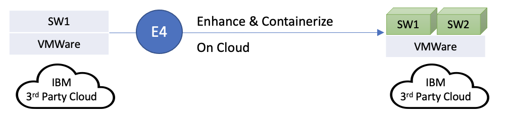

</Column>

<Row>

<Column>

E4 - Enhance and Containerize On-Cloud
Distrubuted Software Pattern Overview  - Containerized software enhancement on cloud.

</Column>

</Row>

### Enhance Kyndryl owned non-containerized IBM Software running on Cloud with containerized version of other IBM Software
Scenario:

<Row>

- **Infrastructure Origin:** IBM Cloud OR Third-Party Cloud
- **Destination Infrastructure:** IBM Cloud OR Third-Party Cloud

</Row>

<Row>

<Column colMd={16} colLg={16} noGutterSm>

| Scenario E4: Enhance on IBM Cloud or Third-Party Cloud |  End-User Client has millions of claims documents on IBM Content Management.  Content Management is running on IBM Public Cloud which is managed by Kyndryl.  Software CSM for Kyndryl recommends End-User Client to automate the classification of the claims  documents as PCI/PII/PHI/Legal (sensitive data) by applying AI. |
| ------ | ------ |
| IBM Solution | - Use Cloud Pak for Business Automation (Automated Document Processing) for document classification IBM Public Cloud Expansion |
| License Ownership | End-User Client owns Cloud Pak for Business Automation (Automated Document Processing), End-User Client will manage it, Kyndryl owns Content Management license |
| CSM Role(s) | IBM Software CSM for Kyndryl assigned because End-User Client owns CP4BA |
| CSM Engagement | Software CSM for Kyndryl leads the discussion with Kyndryl and End-User Client on the usage and application of Datacap, Kyndryl leads the discussion with End-User Client on Kyndryl managed IBM Cloud infrastructure expansion (Kyndryl is self-sufficient and has the skills to lead the discussion on expansion of IBM Cloud themselves with the End-User Client)  - Software CSM for Kyndryl will engage with IBM or Third-Party Cloud Providers as appropriate |
| Account Team, Larger IBM and Ecosystem | IBM Sales is consulted to engage IBM Expert Lab services for document classification, IBM Expert Lab services builds the Datacap solution |
| Production Management | End-User Client manages their claims application after production deployment |

</Column>

</Row>

## E5 - Enhance On-Premise to Cloud

<Column colMd={16} colLg={16} noGutterSm>

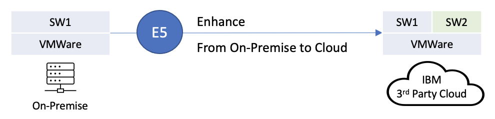

</Column>

<Row>
<Column>
E5 - Enhance from On-Premise to On-Cloud
Distrubuted Software Pattern Overview - Non - Containerized software enhancement on cloud.
</Column>
</Row>

### Enhance Kyndryl owned non-containerized IBM Software running on VMware with non-containerized version of other IBM Software
Scenario:

<Row>

- **Infrastructure Origin:** On-Premise VMware Virtual machine
- **Destination Infrastructure:** On-Premise VMware Virtual machine

</Row>

<Row>

<Column colMd={16} colLg={16} noGutterSm>

| Scenario E5: Enhance from On-Prem to IBM Cloud or Third-Party Cloud |  End-User Client has millions of claims documents on IBM Content Management.  Content Management is running on-premise which is managed by Kyndryl.  Software CSM for Kyndryl recommends End-User Client to lift and shift content management  to IBM Public Cloud automate the classification of the claims documents  as PCI/PII/PHI/Legal (sensitive data) by applying AI. |
| ------ | ------ |
| IBM Solution | Use Datacap for document classification IBM Public Cloud Expansion |
| License Ownership | Kyndryl owns non-containerized Datacap, Kyndryl owns Content Management license |
| CSM Role(s) | Software CSM for Kyndryl engaged because End-User Client wants Kyndryl to lift and shift IBM Content Management to cloud to apply AI to understand the document contents |
| CSM Engagement | Software CSM for Kyndryl leads the discussion with Kyndryl and End-User Client on the usage and application of Datacap, Kyndryl leads the discussion with End-User Client on Kyndryl managed IBM Cloud infrastructure expansion (Kyndryl is self-sufficient and has the skills to lead the discussion on expansion of IBM Cloud themselves with the End-User Client), Software CSM for Kyndryl will engage with IBM or Third-Party Cloud Providers as appropriate |
| Account Team, Larger IBM and Ecosystem | IBM Sales is consulted to engage IBM Expert Lab services for document classification, IBM Expert Lab services builds the Datacap solution |
| Production Management | End-User Client manages their claims application after production deployment |

</Column>

</Row>

## F1 - Foundational Software Upgrade

### Upgrade Kyndryl owned IBM Z Software running on Z machines
Scenario:

<Row>

* **Infrastructure Origin:** Any Z Machine
* **Destination Infrastructure:** Any Z machine
* **Operating System :** z/OS or any flavor of the mainframe operating system

</Row>

<Row>

<Column colMd={16} colLg={16} noGutterSm>

| Scenario F1: Drive adoption/upgrade IBM Z software | End-User Client's majority of the critical workloads run on the mainframe and their software currency involves major IBM Z software  covered by the Kyndryl CSM organization. Client needs to maintain their  software currency level at N or N-1 level to achieve their modernization/infrastructure roadmap. |
| ------ | ------ |
| IBM Solution | Advocate the necessity of running Z software at latest level by introducing them to the latest features in new releases and provide guidance in their upgrade plans by understanding their mainframe layout. Conduct demos on the new product releases that aligns with the customers software currency. |
| License Ownership | Kyndryl owns the IBM Z Software licenses |
| CSM Role(s) | Software CSM for Kyndryl drives growth opportunity of IBM Z Software |
| CSM Engagement | IBM Software CSM for Kyndryl engages in discussion with Kyndryl and EUC on exposing the core applications via z/OS Connect, IBM Software CSM for Kyndryl hand over to IBM Sales to help customer with the renewals/purchase of z/OS connect, IBM Software CSM for Kyndryl helps collaborate to other IBM support/product teams to help with the issues in Install/Upgrade and on the Product |
| Account Team, Larger IBM and Ecosystem | IBM Sales is consulted on retention and growth of IBM Software licenses with Kyndryl  |
| Production Management | Kyndryl manages and supports the software for the customers |
| Example | Upgrade CICS, IMS, z/OS, DB2 .. etc. |

</Column>

</Row>

## F3 - Competitive Migration

### rate from other vendor products to IBM
Scenario:

<Row>

* **Infrastructure Origin:** Any Z Machine
* **Destination Infrastructure:** Any Z machine
* **Operating System :** z/OS or any flavor of the mainframe operating system

</Row>

<Row>

<Column colMd={16} colLg={16} noGutterSm>

| Scenario F3: Competitive Migration | End-User Client looking for a competitive migration from their current suite of software from other Independent Software Vendors (ISV)  to an equivalent/better products to address their current challenges associated with the software. |
| ------ | ------ |
| IBM Solution | Identify and propose the equivalent suite of products from IBM Z portfolio and highlight the advantages of being part of IBM Z ecosystem. Conduct demos that could potentially explain the differentiators in the IBM's products that could help benefit addressing the customer's challenges.  |
| License Ownership | Kyndryl owns the IBM Z Software licenses |
| CSM Role(s) | Software CSM for Kyndryl drives growth opportunity of IBM Z Software |
| CSM Engagement | IBM Software CSM for Kyndryl engages in discussion with Kyndryl and EUC on exposing the core applications via z/OS Connect, IBM Software CSM for Kyndryl hand over to IBM Sales to help customer with the renewals/purchase of z/OS connect, IBM Software CSM for Kyndryl helps collaborate to other IBM support/product teams to help with the issues in Install/Upgrade and on the Product |
| Account Team, Larger IBM and Ecosystem | IBM Sales is consulted on retention and growth of IBM Software licenses with Kyndryl  |
| Production Management | Kyndryl manages and supports the software for the customers |
| References | <a href= "http://www.lookupmainframesoftware.com/" target='_blank' rel='noreferrer noopener'> Lookup Mainframe Software </a>   <a href= "https://www.ibm.com/it-infrastructure/z/resources/products-a-to-z" target='_blank' rel='noreferrer noopener'> Products A-Z </a>  <a href= "https://w3.ibm.com/systems/productpages/" target='_blank' rel='noreferrer noopener'> Products Pages </a>  <a href= "https://ibm.seismic.com/app#/home" target='_blank' rel='noreferrer noopener'> Siesmic </a> |
| Example | Replacing/migrating from CA Workload Automation to IBM Workload Automation |

</Column>

</Row>

## G1 - Application Discovery

<Column colMd={16} colLg={16} noGutterSm>

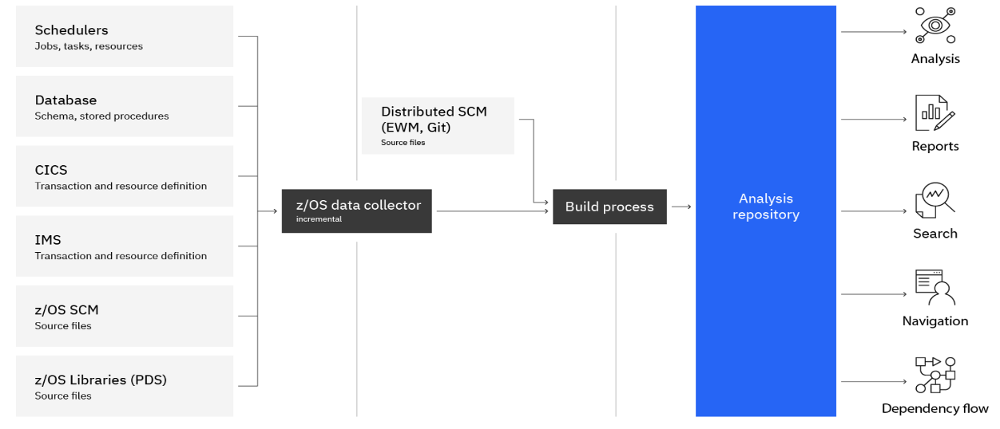

</Column>

### Apply Application discovery pattern to gain in-depth knowledge on SOR system
Scenario:

<Row>

* **Infrastructure Origin:** Any Z Machine
* **Destination Infrastructure:** Any Z machine
* **Operating System :** z/OS or any flavor of the mainframe operating system

</Row>

<Row>

<Column colMd={16} colLg={16} noGutterSm>

| Scenario G1: Application Discovery | End-User Client looking for an approach to create end to end flow of their existing SOR Z system.|
| ------ | ------ |
| IBM Solution | Application discovery provides up-to-date, consumable information about your mainframe software assets and resources. Architects and developers can visualize application flow, perform impact analysis, and generate reports to act on their modernization strategy and plan increments with confidence. |
| License Ownership | Kyndryl owns the IBM Z Software licenses |
| CSM Role(s) | Software CSM for Kyndryl drives growth opportunity of IBM Z Software |
| CSM Engagement | IBM Software CSM for Kyndryl engages in discussion with Kyndryl and EUC on exposing the core applications via z/OS Connect, IBM Software CSM for Kyndryl hand over to IBM Sales to help customer with the renewals/purchase of z/OS connect, IBM Software CSM for Kyndryl helps collaborate to other IBM support/product teams to help with the issues in Install/Upgrade and on the Product |
| Account Team, Larger IBM and Ecosystem | IBM Sales is consulted on retention and growth of IBM Software licenses with Kyndryl  |
| Production Management | Kyndryl manages and supports the software for the customers |
| Reference | <a href= "https://www.ibm.com/cloud/architecture/architectures/z-application-discovery-pattern" target='_blank' rel='noreferrer noopener'> Application discovery pattern </a> |
| Example | A car manufacturer wanted to modernize an application that generates identification information for mechanical parts. These identification codes are the starting point of the traceability process and the proof of authenticity for a mechanical part. The identification number generation process was written in assembler and couldn’t be maintained by the team anymore. It needed to be replaced by a new system, that will evolve more gracefully. But before replacing it, the company needed to assess all the impacts: this process was in the middle of a big part of the information system |

</Column>

</Row>

## G2 - Enterprise DevOps

<Column colMd={16} colLg={16} noGutterSm>

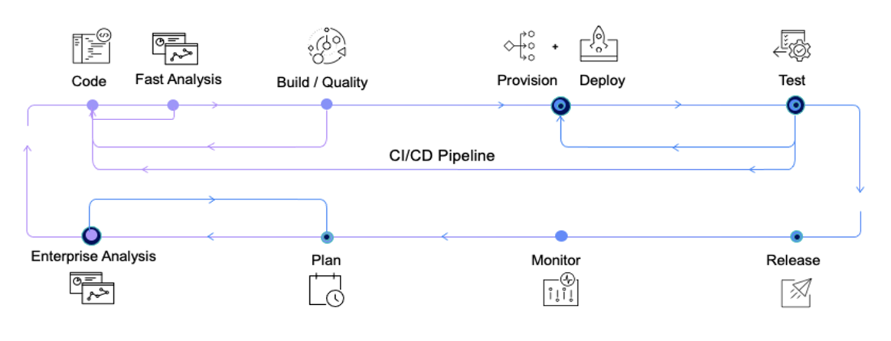

</Column>

### Enabling DevOps in Mainframe Z applications
Scenario:

<Row>

* **Infrastructure Origin:** Any Z Machine
* **Destination Infrastructure:** Any Z machine
* **Operating System :** z/OS or any flavor of the mainframe operating system

</Row>

<Row>

<Column colMd={16} colLg={16} noGutterSm>

| Scenario G2: Enterprise DevOps | Enterprises running mission critical z/OS applications on IBM Z are impeding innovation with twice a year release cycles of their  z/OS applications following traditional development and deployment tools, and practices which eventually contribute to technical debt.  They can accelerate application lifecycle and improve developer productivity while maintaining high code quality  using modern DevOps toolchains and practices available for IBM Z |
| ------ | ------ |
| IBM Solution | In collaboration with the client, we will co-create a DevOps toolchain using modern CI/CD tools on IBM Z that enables faster, high-quality code development with frequent deployment cycles of z/OS applications. This solution will showcase how DevOps on Z will drive faster time to market for z/OS applications by automating the software development life cycle and helps unlock innovation and process improvement. Within the minimal scope of the MVP (to be agreed) we will help the client understand how this IBM solution addresses this specific business need and prove the value of our technology. |
| License Ownership | Kyndryl owns the IBM Z Software licenses |
| CSM Role(s) | Software CSM for Kyndryl drives growth opportunity of IBM Z Software |
| CSM Engagement | IBM Software CSM for Kyndryl engages in discussion with Kyndryl and EUC on exposing the core applications via z/OS Connect, IBM Software CSM for Kyndryl hand over to IBM Sales to help customer with the renewals/purchase of z/OS connect, IBM Software CSM for Kyndryl helps collaborate to other IBM support/product teams to help with the issues in Install/Upgrade and on the Product |
| Account Team, Larger IBM and Ecosystem | IBM Sales is consulted on retention and growth of IBM Software licenses with Kyndryl  |
| Production Management | Kyndryl manages and supports the software for the customers |
| Reference | <a href= "https://www.ibm.com/cloud/architecture/architectures/z-enterprise-devops-pattern" target='_blank' rel='noreferrer noopener'> Enterprise DevOps pattern </a> |
| Example | Accelerating z/OS Application development cycle and faster deployments using IBM DevOps tools for IBM Z, OpenShift Tekton , GitLab Ultimate for IBM z/OS |

</Column>

</Row>

## O1 - Observability Z Subsystems

<Column colMd={16} colLg={16} noGutterSm>

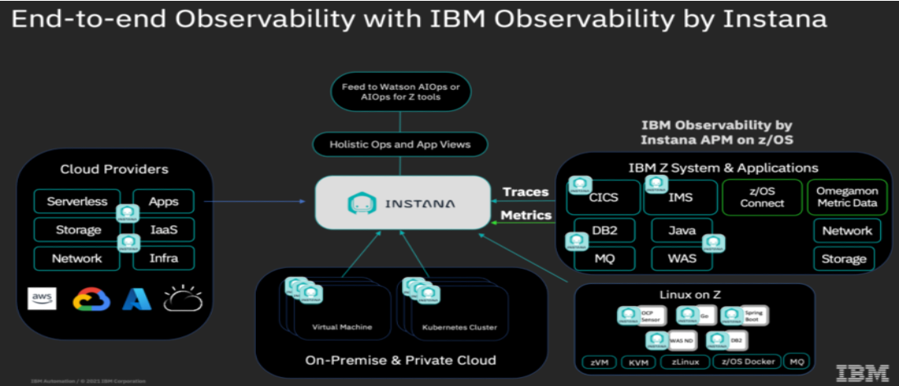

</Column>

### Observability for transactions running on z/OS Subsystems
Scenario:

<Row>

- **Infrastructure Origin:** Any Z Machine
- **Destination Infrastructure:** Any Z Machine
- **Operating System :** z/OS or any flavor of the mainframe operating system

</Row>

<Row>

<Column colMd={16} colLg={16} noGutterSm>

| Scenario O1: Observability for Z/OS Subsystems | Clients  are looking for a modern APM solution that provides automated full-stack application visibility  - including real-time change detection, mapping, tracing and profiling for transactions running on z/OS subsystems. Traditional monitoring tools don't give DevOps teams full visibility into hybrid and rapidly changing environments. |
| ------ | ------ |
| IBM Solution | IBM Observability by Instana APM on z/OS brings Instana APM observability to IBM Z application environments, and provides application owners and SRE teams with the ability to get end to end observability from mobile through mainframe in a single solution. |
| License Ownership | Kyndryl owns the IBM Z Software licenses |
| CSM Role(s) | Software CSM for Kyndryl drives growth opportunity of IBM Z Software |
| CSM Engagement | IBM Software CSM for Kyndryl engages in discussion with Kyndryl and EUC on the observability solution for z/OS subsystems, IBM Software CSM will help Kyndryl and End User Client (EUC) to realize the value of Instana observability solution, IBM Software CSM for Kyndryl helps to deploy the Instana APM on z/OS solution in production. |
| Account Team, Larger IBM and Ecosystem | IBM Sales is consulted on retention and growth of IBM Software licenses with Kyndryl  |
| Production Management | Kyndryl manages and supports the software for the customers |
| Reference |  <a href= "https://ibm.seismic.com/Link/Content/DC7qBC92J4X3d8CM4M6bR6Rp8TP3" target='_blank' rel='noreferrer noopener'> IBM Observability by Instana on Siesmic </a> |

</Column>

</Row>

## O2 - Observability Anomaly Analytics

<Column colMd={16} colLg={16} noGutterSm>

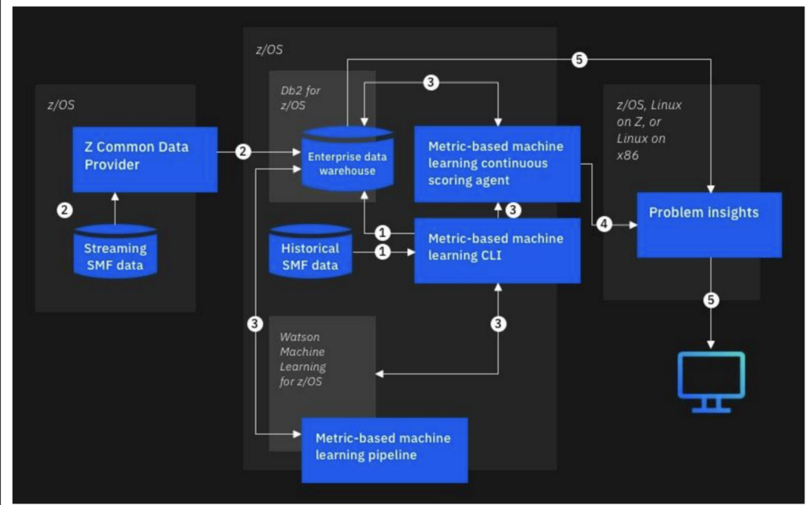

</Column>

<Row>

<Column colMd={16} colLg={16} noGutterSm>

| Scenario O2: Metrics and Log Anomaly Analytics - Proactive Incident Management | Client want to deploy an intelligent anomaly detection solution for for both log and metric data  to proactively detect operational issues and avoid costly incidents. |
| ------ | ------ |
| IBM Solution | Deploying IBM Z Anomaly Analytics solution will help to detect deviations from normal in system behavior and alert support/delivery teams for early intervention. That will eliminate or reduce impact from service disruptions. This solution can bring major operational efficiency by avoiding costly incidents. |
| License Ownership | Kyndryl owns the IBM Z Software licenses |
| CSM Role(s) | Software CSM for Kyndryl drives growth opportunity of IBM Z Software |
| CSM Engagement | IBM Software CSM for Kyndryl engages in discussion with Kyndryl and EUC on the observability solution for z/OS subsystems, IBM Software CSM will help Kyndryl and End User Client (EUC) to realize the value of Instana observability solution, IBM Software CSM for Kyndryl helps to deploy the Instana APM on z/OS solution in production. |
| Account Team, Larger IBM and Ecosystem | IBM Sales is consulted on retention and growth of IBM Software licenses with Kyndryl  |
| Production Management | Kyndryl manages and supports the software for the customers |
| Reference |  <a href= "https://www.ibm.com/products/z-anomaly-analytics" target='_blank' rel='noreferrer noopener'> Z Anomoly Analytics with Watson </a>  <a href= "https://ibm.ent.box.com/file/992843894991?s=et9chz6t0j04utexg0wlo6h6mz1r01ul" target='_blank' rel='noreferrer noopener'> Box Link </a> |
| Example | Accelerating z/OS Application development cycle and faster deployments using IBM DevOps tools for IBM Z, OpenShift Tekton , GitLab Ultimate for IBM z/OS |
</Column>

</Row>
