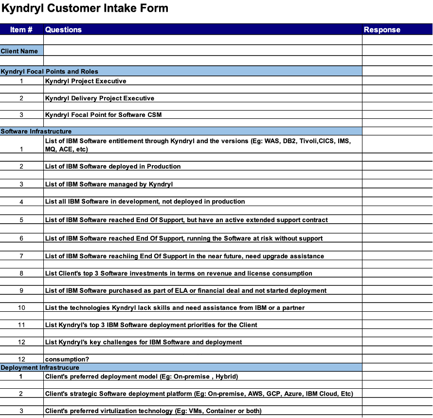
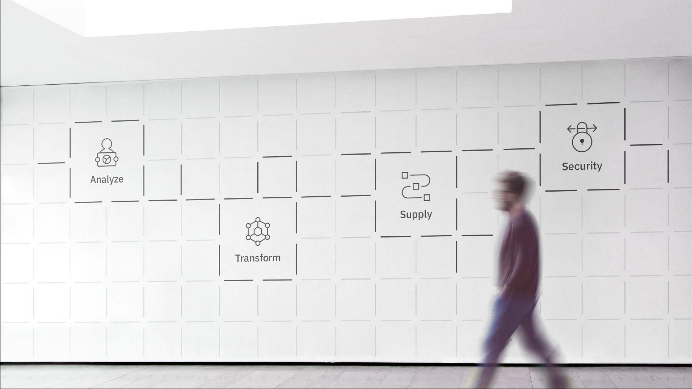
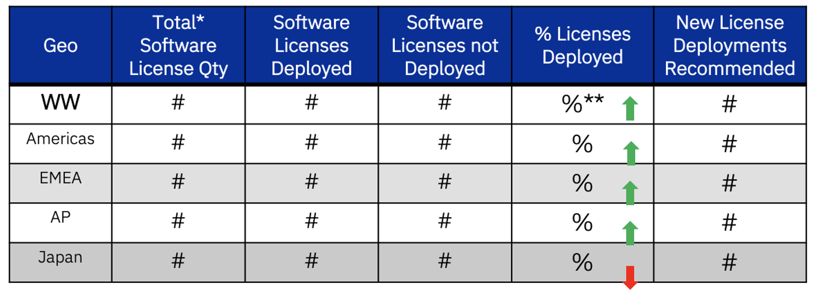
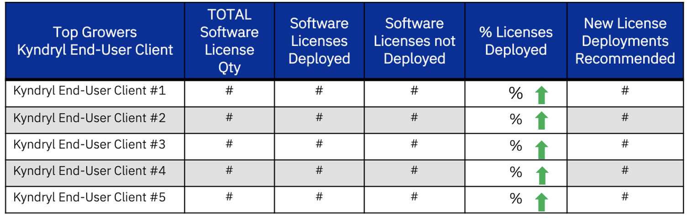
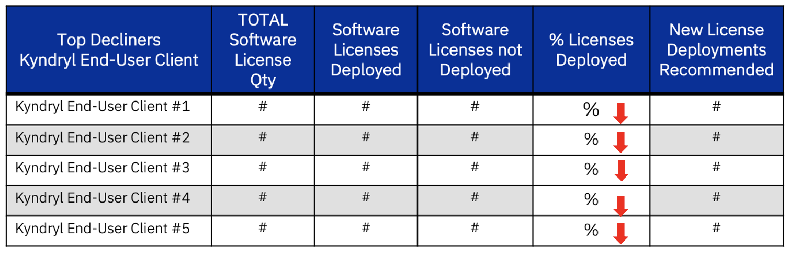

<AnchorLinks small>

  <AnchorLink>NEW Offerings</AnchorLink>
  <AnchorLink>Customer Intake Form</AnchorLink>
  <AnchorLink>CSM Enablement Links</AnchorLink>
  <AnchorLink>Scorecard</AnchorLink>

</AnchorLinks>

## NEW! Sofware Support Offerings available to Distributed customers for software going End of Support or Off Market

As we work closedly with Kyndryl and their End User Clients (EUCs) on their software lifecycles which we know are out-of-date for many products, we should have pointed discussions about the risks assocaited with running software that is out of support or off the market and the options to mitigate those risks.

To address the questions about Software Support Offerings and support available when Distributed products go End of Support and/or end of market availability, IBM has annouced a three tiered approach for customers to extend maintenance past those dates. Although these offerings are not unique for Kyndryl or Kyndryl EUCs, the offerings are available to them. These three lifecycle support offerings are available broadly to Distributed customers of IBM and are described below:

<a href= "https://ibm.box.com/s/ktlcqs5q3vcl58u4l3432dpihykz45ox" target='_blank' rel='noreferrer noopener'> Link to video </a> explaining all three Extended Support offerings along with <a href= "https://ibm.box.com/s/5smrc313effe7djnxvghwbq1ssh9f31v" target='_blank' rel='noreferrer noopener'> link to presentation </a> shown in video

**IBM Extended Support** <a href= "https://www.ibm.com/support/pages/node/7008589"> Link </a> allows customers to acquire support after the IBM base support period ends for their product version or release in use.

**IBM Sustained Support** <a href= "https://www.ibm.com/support/pages/node/7008619"> Link </a> allows customers to acquire support after the IBM base support period ends and no new versions or releases are available for the product.

**IBM Advanced Support** <a href= "https://www.ibm.com/support/pages/ibm-advanced-support-offering"> Link </a> allows customers to acquire an enhanced support experience on top of their active IBM support subscription, providing prioritized case handling and shorter response time objectives.

Finally, as you're planning product lifecycle with your customers for any IBM product, reference the external IBM Support page <a href= "https://www.ibm.com/support/pages/node/806866?mhsrc=ibmsearch_a&mhq=software%20support%20offerings"> here </a>.

## Customer Intake Form

<Row>
 Understanding Kyndryl and understanding the IBM Software installed with the client is critical to the success of SW CSMs for Kyndryl.
</Row>

<Row>
 Use the questionnaire to inventory IBM Software installed, versioning, software plans, etc. with Kyndryl first; then with Kyndryl's client.
</Row>

<Row>
Link to Kyndryl learnings and artifacts: <a href= "https://ibm.box.com/s/jqa17zyd44givm6f5jgc480rz3l2zlci" target='_blank' rel='noreferrer noopener'> Box Link </a>
</Row>

<Column>

* Build trusted relationships with IBM teams (Cloud CSM, CPP CSM, IBM Consulting, Sales)
* Define working relationship with Kyndryl (engagement model)
* Prepare to meet Kyndryl (questionnaire, other info gathering, assess Kyndryl skills)
* Prepare to meet EUC with Kyndryl (understand strategy, product use cases)
* Meet Kyndryl and/or EUC business sponsor

</Column>

<Column colMd={8} colLg={8} noGutterSm>

</Column>

## CSM Enablement Links

<Column colMd={8} colLg={8} noGutterSm>

</Column>

  <Accordion>
    <AccordionItem title="DB2 Distrubuted - Learning Materials">
    

    <a href= "https://yourlearning.ibm.com/activity/UDEMY-3105324" target='_blank' rel='noreferrer noopener'> Db2 For Beginners: (2 Hours)</a>  
    <a href= "https://yourlearning.ibm.com/activity/URL-0A11ADD8A9C8" target='_blank' rel='noreferrer noopener'> Db2 Foundations for Database Professionals Badge: (16 Hours) </a>  
    <a href= "https://yourlearning.ibm.com/activity/ITS-C120018G" target='_blank' rel='noreferrer noopener'> Overview of IBM Db2 on Cloud: (1 Hour) </a>  
    

    </AccordionItem>
    <AccordionItem title="DB2 on Z">
    

    <a href= "https://yourlearning.ibm.com/activity/PLAN-B1B232FC5001" target='_blank' rel='noreferrer noopener'> Db2 for z/OS L2 Learning Plan: (4 Hours)</a>  
    <a href= "https://yourlearning.ibm.com/activity/PLAN-89D2BC73F084" target='_blank' rel='noreferrer noopener'> IBM Db2 Analytics Accelerator for Db2 for z/OS Learning Plan: (2 hours 45 mins) </a>  
    <a href= "https://www.redbooks.ibm.com/Redbooks.nsf/RedbookAbstracts/redp5444.html?Open=" target='_blank' rel='noreferrer noopener'> Redbook:  </a>  
    

    </AccordionItem>
    <AccordionItem title="WebSphere Application Server (WAS)- Learning Materials">
    

    <a href= "https://yourlearning.ibm.com/activity/PLAN-89CB6A04D5DF" target='_blank' rel='noreferrer noopener'> WebSphere Application Server - Onboarding to L2 support </a>  
    

    </AccordionItem>
    <AccordionItem title="Tivoli Distributed - Learning Materials">
    

    <a href= "https://yourlearning.ibm.com/activity/URL-7CE938EDF721" target='_blank' rel='noreferrer noopener'> Spectrum Protect: (3 hours 30 mins) </a>  
    <a href= "https://learn.ibm.com/course/view.php?id=4450" target='_blank' rel='noreferrer noopener'> Introduction to IBM Spectrum : (4 hours) </a>  
    

    </AccordionItem>
    <AccordionItem title="Application Monitoring:">
    

    <a href= "https://www.ibm.com/docs/en/itcam-app-mgr/7.2.1" target='_blank' rel='noreferrer noopener'> Tivoli Composite Application Manager for Applications </a>  
    <a href= "https://www.ibm.com/docs/en/tivoli-monitoring/6.3.0?topic=63-quick-start-guide" target='_blank' rel='noreferrer noopener'> IBM Tivoli Monitoring </a>  
    <a href= "https://www.ibm.com/training/course/TM023G" target='_blank' rel='noreferrer noopener'> IBM Tivoli Monitoring 6.3 Fundamentals </a>  
    <a href= "https://www.ibm.com/training/course/TM674G" target='_blank' rel='noreferrer noopener'> IBM Cloud Application Performance Management 8.1.4 Fundamentals </a>  
    

    </AccordionItem>
    <AccordionItem title="Workload Automation:">
    

    <a href= "https://www.ibm.com/products/workload-automation" target='_blank' rel='noreferrer noopener'> IBM Workload Automation </a>  
    <a href= "http://www.workloadautomation-community.com/" target='_blank' rel='noreferrer noopener'> WORKLOAD AUTOMATION COMMUNITY </a>  
    <a href= "https://www.ibm.com/docs/en/workload-automation/9.4.0?topic=overview-product" target='_blank' rel='noreferrer noopener'> Overview of IBM Workload Automation </a>  
    <a href= "https://learn.ibm.com/enrol/index.php?id=9296" target='_blank' rel='noreferrer noopener'> IBM Spectrum Control and IBM Storage Insights Fundamentals :  (4 hours) + badge </a>  
    

    </AccordionItem>
    <AccordionItem title="Access Management">
    

    <a href= "https://yourlearning.ibm.com/activity/ILP-SLA_2637" target='_blank' rel='noreferrer noopener'> IBM Security Access Manager Introduction (41 minutes) </a>  
    

    </AccordionItem>
    <AccordionItem title="Tivoli on Z - Learning Materials">
    

    <a href= "https://www.ibm.com/docs/en/om-zos/5.6.0" target='_blank' rel='noreferrer noopener'> IBM Z OMEGAMON Monitor for z/OS  </a>  
    

    </AccordionItem>
    <AccordionItem title="Z Performance & Capacity">
    

    <a href= "https://www.ibm.com/products/z-system-automation" target='_blank' rel='noreferrer noopener'> IBM Z System Automation  </a>  
    <a href= "https://www.ibm.com/products/z-workload-scheduler" target='_blank' rel='noreferrer noopener'> IBM Z Workload Scheduler  </a>  
    

    </AccordionItem>
    <AccordionItem title="Z Architecture Center">
    

    <a href= "https://www.ibm.com/cloud/architecture/technical-decision-points/IBM-Z" target='_blank' rel='noreferrer noopener'> IBM Z - Maximize the value of hybrid cloud with IBM Z. </a>  
    

    </AccordionItem>
    <AccordionItem title="CICS">
    

    <a href= "https://w3.ibm.com/w3publisher/apprentice-and-cics/learning-path" target='_blank' rel='noreferrer noopener'> Learning path </a>  
    <a href= "https://yourlearning.ibm.com/activity/URL-C08BGMDWPIO" target='_blank' rel='noreferrer noopener'> Introduction to CICS </a>  
    <a href= "https://yourlearning.ibm.com/activity/ITS-DL000027G" target='_blank' rel='noreferrer noopener'> Modernize applications with IBM CICS: (3 Hours) </a>  
    <a href= "https://yourlearning.ibm.com/activity/IEC-10242605" target='_blank' rel='noreferrer noopener'> CICS: What is it and why do I care? (1 Hours) </a>  
    <a href= "https://yourlearning.ibm.com/activity/IEC-10233640" target='_blank' rel='noreferrer noopener'> CICS Application Programming using IMS, Db2 and MQ (2 Hours) </a>  
    <a href= "https://yourlearning.ibm.com/activity/ITS-TU00026G" target='_blank' rel='noreferrer noopener'> IBM TechU DevOps for IBM Z: (5 Hours) </a>  
    <a href= "https://yourlearning.ibm.com/activity/ITS-TU00025G" target='_blank' rel='noreferrer noopener'> IBM TechU IMS for System Z: (8 Hours)</a>  
    

    </AccordionItem>
    <AccordionItem title="IMS">
    

    <a href= "https://yourlearning.ibm.com/activity/URL-C8EFF741901A" target='_blank' rel='noreferrer noopener'> What is IMS? (30 minutes) </a>  
    <a href= "https://yourlearning.ibm.com/activity/URL-B553AC409E61" target='_blank' rel='noreferrer noopener'> IMS for Dummies (30 minutes) </a>  
    <a href= "https://learn.ibm.com/course/view.php?id=8829" target='_blank' rel='noreferrer noopener'> IMS Fundamentals </a>  
    <a href= "https://learn.ibm.com/course/view.php?id=10118" target='_blank' rel='noreferrer noopener'> IMS Database Fundamentals </a>  
    

    </AccordionItem>
  </Accordion>

## Scorecard

Deployments and Proposed Deployments WW and GEO (by account) views

### **WW view (quaterly updates)**

<Row>

<Column colMd={8} colLg={8} noGutterSm>

</Column>

<Column>

* *System Z  data not currently available at the End-User Client level
* **Trend up - Green; Trend Steady - Yellow; Trend down - Red

</Column>

</Row>

### **GEO view (by account)**

<Row>

<Column colMd={8} colLg={8} noGutterSm>

</Column>

</Row>

<Row>

<Column colMd={8} colLg={8} noGutterSm>

</Column>

</Row>
