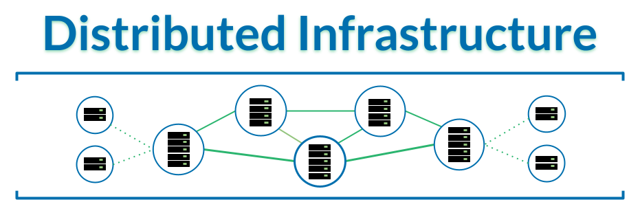
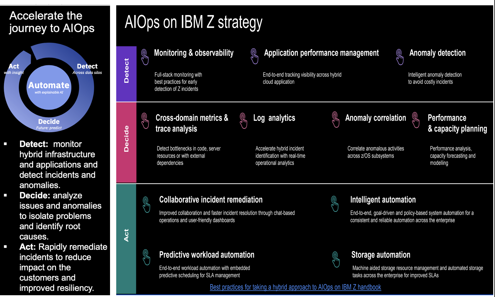

import {Link} from 'gatsby'

<AnchorLinks small>

  <AnchorLink>Core Actions</AnchorLink>
  <AnchorLink>How To Use this Guide</AnchorLink>
  <AnchorLink>Distributed Infrastructure - Software Patterns</AnchorLink>
  <AnchorLink>Distributed - Enhancement Use cases</AnchorLink>
  <AnchorLink>Z Infrastructure - Software Patterns</AnchorLink>
  <AnchorLink>Z Enhancement - Use Cases</AnchorLink>
  <AnchorLink>AI Ops on IBM Z</AnchorLink>

</AnchorLinks>

## Core Actions

<Row>

### CORE actions driven by SW CSMs for Kyndryl:

* Upgrade: same software, same platform.
* Lift and Shift: same software, different platform.
* Containerize: same software but containerized.
* Enhance: enhance with additional software from any platform non-containerized, containerized, SaaS.

</Row>
<Row>

### Additional terms relevant for SW CSMs for Kyndryl:

* Retention: Any actions taken by SW CSM for Kyndryl or any related IBM org to keep the End-User Client with current levels of install base (e.g. concessions, discounts, other incentives).
* Renewal: Gaining client approvals to continue with s/w agreements; extending term.
* Expansion: Additional workloads identified to be implemented on the same products/offerings as the client consumes currently.
* Modernization: the broad term used to encompass driving a client to a new version of Software or onto a cloud infrastructure (or more modern infrastructure like VPC) or enhanced with additional software.
* MRU: Monthly Recurring Usage; monthly measure of consumption of an offering or product.
* MRR: Monthly Recurring Revenue; monthly revenue associated with the monthly usage/consumption of an offering or product.
* NRR: Net Revenue Retention.

</Row>

## How To Use this Guide

<Column colMd={16} colLg={16} noGutterSm>

</Column>

<Row>

* The patterns and scenarios in this playbook are intended to provide guidance to the CSM Architect on possible situations as clients modernize their software infrastructure.   They are broken out into Distributed and Z Software Infrastructure scenarios.  The following tables provide an overview of the patterns that are being considered with hyperlinks to a separate page in this document.
* The scenarios have been given an ID following a simple naming convention for reference.
* The intent of the scenarios is to provide a high-level summary, a graphical representation of the architecture, a short description of the different roles and how they are engaged.  An example should illustrate the scenario to make it more comprehensible and gives the CSM a better idea of a possible use case.
* The patterns and scenarios covered in this document are not mean to be an exhaustive list but rather help the CSM to identify similar patterns as they engage with Kyndryl and their End-User Clients.
* *Add example for Z (Expose)*

</Row>

## Distributed Infrastructure - Software Patterns

<Column colMd={16} colLg={16} noGutterSm>

</Column>

<Row>
<Column>

### Distributed Infrastructure

| From\To | Non-containerized   on-prem| Containerized   on-prem | Non-Containerized  IBM or 3rd Party Cloud | Containerized   IBM or 3rd Party Cloud |
| ---------- | ----------- | ----------- | ----------- |----------- |
| Non-containerized   On-Prem | <Link to= "/kyndryl/csm-kyndryl-csm-plays#d1-upgrade" target='_blank' rel='noreferrer noopener'>D1 - Upgrade</Link> | <Link to='/kyndryl/csm-kyndryl-csm-plays#d2-containerize' target='_blank' rel='noreferrer noopener'>D2 - Containerize</Link> | <Link to='/kyndryl/csm-kyndryl-csm-plays#d3-lift-and-shift' target='_blank' rel='noreferrer noopener'>D3 - Lift and Shift </Link> | <Link to='/kyndryl/csm-kyndryl-csm-plays#d4-containerize' target='_blank' rel='noreferrer noopener'>D4 - Containerize</Link> |
| Containerized   On-Prem | --- | <Link to='/kyndryl/csm-kyndryl-csm-plays#d5-upgrade' target='_blank' rel='noreferrer noopener'>D5 - Upgrade</Link> | --- | <Link to='/kyndryl/csm-kyndryl-csm-plays#d6-lift-and-shift' target='_blank' rel='noreferrer noopener'>D6 - Lift and Shift </Link> |
| Non-containerized   IBM or 3rd Party Cloud | <Link to='/kyndryl/csm-kyndryl-csm-plays#d7-lift-and-shift' target='_blank' rel='noreferrer noopener'>D7 - Lift and Shift </Link> | <Link to='/kyndryl/csm-kyndryl-csm-plays#d8-containerize' target='_blank' rel='noreferrer noopener'> D8 - Containerize </Link> | <Link to='/kyndryl/csm-kyndryl-csm-plays#d9-upgrade' target='_blank' rel='noreferrer noopener'> D9 - Upgrade </Link> | <Link to='/kyndryl/csm-kyndryl-csm-plays#d10-containerize' target='_blank' rel='noreferrer noopener'>D10 - Containerize </Link> |
| Containerized   IBM or 3rd Party Cloud | --- | <Link to='/kyndryl/csm-kyndryl-csm-plays#d11-lift-and-shift' target='_blank' rel='noreferrer noopener'>D11 - Lift and Shift </Link> | --- | <Link to='/kyndryl/csm-kyndryl-csm-plays#d12-upgrade' target='_blank' rel='noreferrer noopener'>D12 - Upgrade </Link> |

</Column>

</Row>

<Row>

* Below each Action is the role that typically leads the action for the pattern.
* CSM runs retention play first if EUC intends to migrate from IBM Cloud to On Prem.
* **Note:  Each of the actions (On Prem, Cloud) could involve an enhancement to original software with additional software**

</Row>

<Row>
<Column>

## Enhance Distributed Software

| Packaging\Location | On Premise | Cloud | On Premise to Cloud |
| ---------- | ----------- | ----------- | ----------- |
| Non-containerized |  <Link to='/kyndryl/csm-kyndryl-csm-plays#e1-enhance-on-premise' target='_blank' rel='noreferrer noopener'> E1 </Link>  | <Link to='/kyndryl/csm-kyndryl-csm-plays#e2-enhance-on-cloud' target='_blank' rel='noreferrer noopener'> E2 </Link>  | <Link to='/kyndryl/csm-kyndryl-csm-plays#e5-enhance-on-premise-to-cloud' target='_blank' rel='noreferrer noopener'> E5 </Link>  |
| Enhance and Containerize | <Link to='/kyndryl/csm-kyndryl-csm-plays#e3-enhance-and-containerize-on-premise' target='_blank' rel='noreferrer noopener'> E3 </Link> | <Link to='/kyndryl/csm-kyndryl-csm-plays#e4-enhance-and-containerize-on-cloud' target='_blank' rel='noreferrer noopener'> E4 </Link> | --- |

</Column>

</Row>

## Distributed - Enhancement Use cases

<Column colMd={16} colLg={16} noGutterSm>

</Column>

<Row>

### Automation Functionality

* Optimize WebSphere applications with automated management
* Optimize application monitoring for modernized WebSphere applications with Instana Observability platform
* Optimize WebSphere Application availability and performance by automating resource management with Turbonomic ARM
* Proactively prevent critical WebSphere application outages by integrating with AI powered real time log anomaly detection with Cloud Pak for AIOps
* Expose complex monolithic WebSphere application capabilities as APIs using Cloud Pak for Integration capabilities such as API Connect.
* Optimize Processes with decisions. Add IBM Advanced Decision Services or ODM to IBM BPM
* Enhance value of IBM Filenet by adding IBM DataCap capabilities
* Enhance value of IBM Filenet by adding IBM Records Enterprise
* Enhance Processes with Robotic Process Automation
* Optimize Processes with AI driven Process mining, myInvenio
* Trigger a Process via Analytics. Add IBM analytics (Cognos) to a process
* Make your process smarter by embedding AI inside a process
* Enhance IBM monitoring and management software with AIOPs

</Row>

<Row>

### Database

* Catalog Data, Db2 and IBM Knowledge Catalog
* Summarize data in Data Warehouse, IBM Db2 and IBM Db2 Warehouse
* Enhance Application with event-driven architecture, WebSphere Application Server and IBM Event Streams
* Use Data for analysis, Db2 and IBM Cognos
* Use Data for analysis and reporting, Db2 Warehouse and IBM Cognos
* Use data for AI and analysis with virtualization, Db2 and CP4D Virtualization
* Add Db2 to IBM Data Fabric Architecture, Db2 and CP4D

</Row>

## Z Infrastructure - Software Patterns

<Column colMd={16} colLg={16} noGutterSm>

</Column>

<Column>

### Application, Data and Event Driven

| Application | Data | Event Driven |
| ---------------------- | --------------- | ----------------------- |
| <Link to='/kyndryl/csm-kyndryl-csm-plays#a1-expose' target='_blank' rel='noreferrer noopener'>A1 - Expose</Link> | <Link to='/kyndryl/csm-kyndryl-csm-plays#b1-enable' target='_blank' rel='noreferrer noopener'>B1 - Enable</Link> | <Link to='/kyndryl/csm-kyndryl-csm-plays#c1-respond-to-z' target='_blank' rel='noreferrer noopener'>C1 - Respond to Z</Link> |
| <Link to='/kyndryl/csm-kyndryl-csm-plays#a2-extend' target='_blank' rel='noreferrer noopener'>A2 - Extend </Link> | <Link to='/kyndryl/csm-kyndryl-csm-plays#b2-virtualize' target='_blank' rel='noreferrer noopener'>B2 - Virtualize</Link> | <Link to='/kyndryl/csm-kyndryl-csm-plays#c2-respond-to-external' target='_blank' rel='noreferrer noopener'>C2 - Respond to External</Link> |
| <Link to='/kyndryl/csm-kyndryl-csm-plays#a3-co-locate' target='_blank' rel='noreferrer noopener'>A3 - Co-Locate </Link> |  B3 - Cache | <Link to='/kyndryl/csm-kyndryl-csm-plays#c3-optimize-cqrs' target='_blank' rel='noreferrer noopener'>C3 - Optimize CQRS </Link> |
| <Link to='/kyndryl/csm-kyndryl-csm-plays#a4-enhance' target='_blank' rel='noreferrer noopener'>A4 - Enhance </Link> | B4 - Transform | --- |
| <Link to='/kyndryl/csm-kyndryl-csm-plays#a5-refactor' target='_blank' rel='noreferrer noopener'> A5 - Refactor </Link> | --- | --- |

</Column>

<Row>
<Column>

### Lifecycle Enablers

| LIFECYCLE ENABLERS |
| --------------|--------------|
| <Link to='/kyndryl/csm-kyndryl-csm-plays#g1-application-discovery' target='_blank' rel='noreferrer noopener'> G1 - Application Discovery </Link> | <Link to='/kyndryl/csm-kyndryl-csm-plays#g2-enterprise-devops' target='_blank' rel='noreferrer noopener'> G2 - Enterprise DevOps </Link> |

</Column>
</Row>

<Row>
<Column>

### Software Upgrades and Migrations

| Software Upgrades and Migrations  |
| --------------|
| <Link to='/kyndryl/csm-kyndryl-csm-plays#f1-foundational-software-upgrade' target='_blank' rel='noreferrer noopener'> F1 - Foundational Z Software Upgrade </Link> |
| F2 - Cloud Pak Upgrade |
| <Link to='/kyndryl/csm-kyndryl-csm-plays#f3-competitive-migration' target='_blank' rel='noreferrer noopener'> F3 - Competitive Migration </Link>|
</Column>
</Row>

## Z Enhancement - Use Cases

<Row>
<Column>

 ##  System Z
* Enhance owned IBM z/OS monitoring and management software with AIOPs
* Enhance System z: Incrementally modernize with z/OS Connect
* Enhance System z: Incrementally modernize with z/DVM
* Enhance System z: Establish System z as a test dev cloud
* Enhance System z: Establish System z Linux environment

</Column>
</Row>

## AI Ops on IBM Z

<Column colMd={16} colLg={16} noGutterSm>

</Column>

<Row>

### Strategy

| Detect | Decide | Act |
|-------|--------|--------|
| <Link to='/kyndryl/csm-kyndryl-csm-plays#o1-observability-z-subsystems' target='_blank' rel='noreferrer noopener'> O1 - Obersvability for IBM Z/OS Subsystems </Link> | --- | --- |
| <Link to='/kyndryl/csm-kyndryl-csm-plays#o2-observability-anomaly-analytics' target='_blank' rel='noreferrer noopener'> O2 - Anomoly Analytics </Link> | --- | --- |

</Row>

<Row>

* Scenarios will be updated based on encountering the use cases with customers

</Row>
